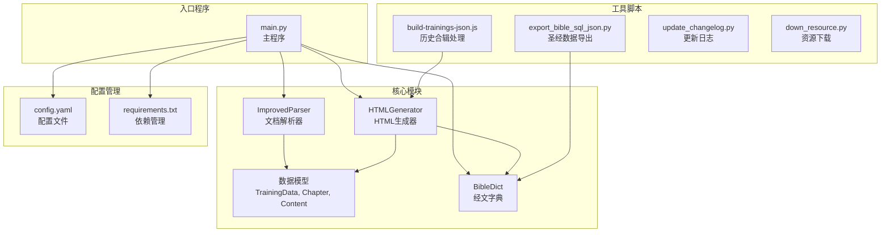
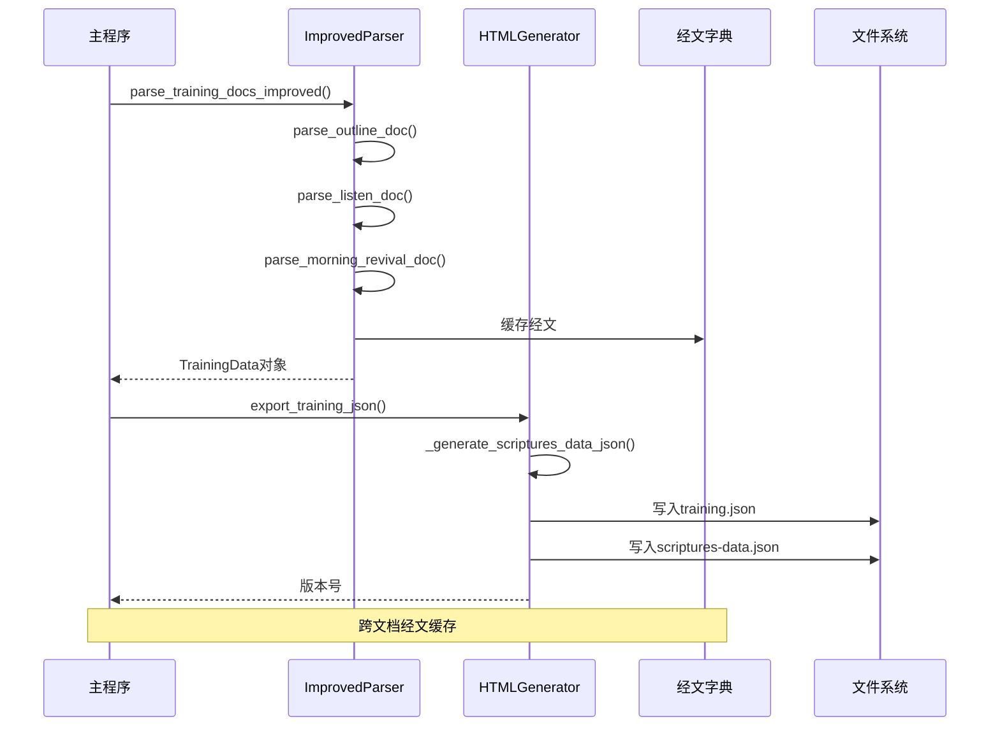
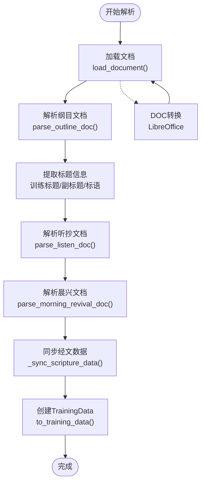
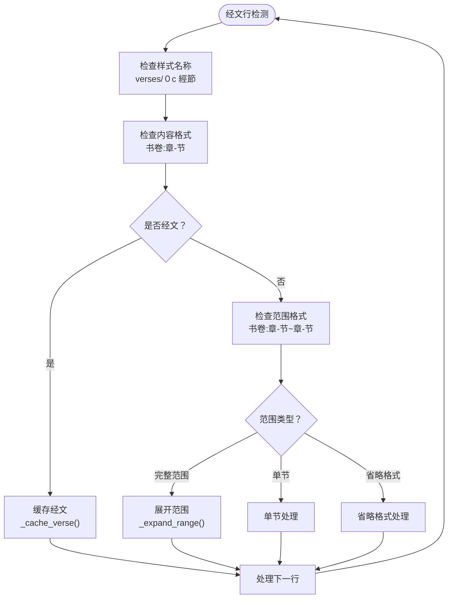
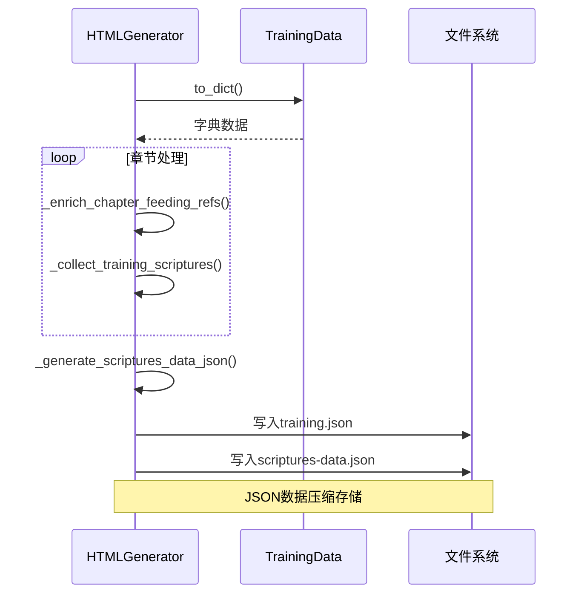
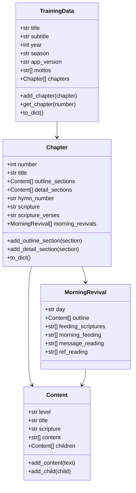
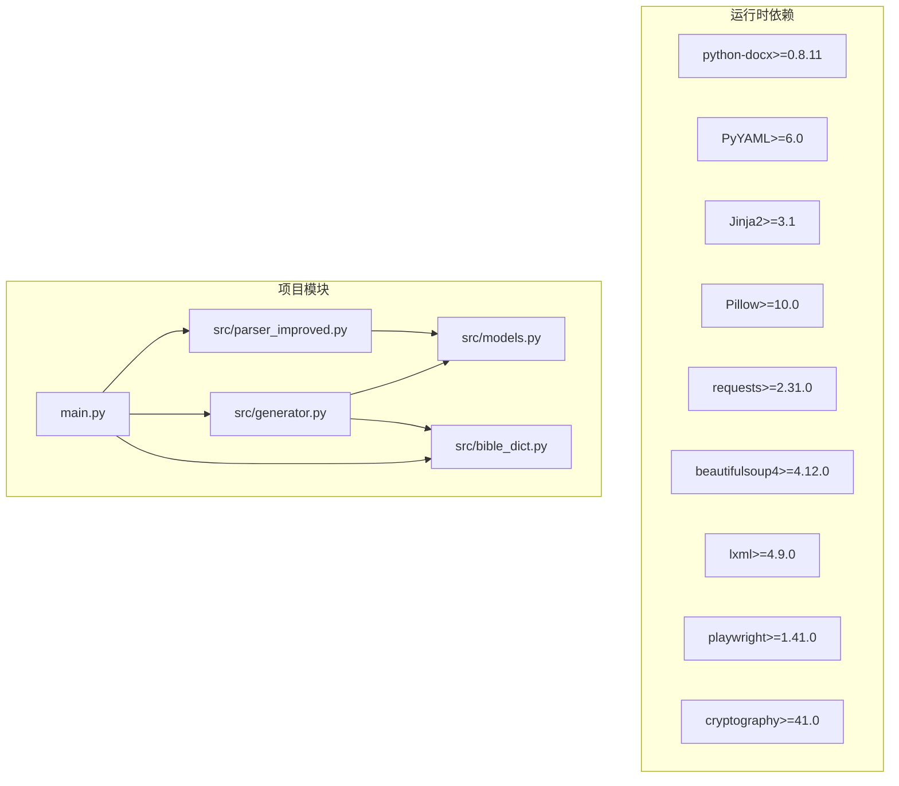

# API参考

<cite>
**本文档引用的文件**
- [main.py](file://main.py)
- [config.yaml](file://config.yaml)
- [requirements.txt](file://requirements.txt)
- [src/parser_improved.py](file://src/parser_improved.py)
- [src/generator.py](file://src/generator.py)
- [src/models.py](file://src/models.py)
- [src/bible_dict.py](file://src/bible_dict.py)
- [tools/build-trainings-json.js](file://tools/build-trainings-json.js)
- [export_bible_sql_json.py](file://export_bible_sql_json.py)
- [update_changelog.py](file://update_changelog.py)
- [down_resource.py](file://down_resource.py)
</cite>

## 目录
1. [简介](#简介)
2. [项目结构](#项目结构)
3. [核心组件](#核心组件)
4. [架构概览](#架构概览)
5. [详细组件分析](#详细组件分析)
6. [依赖分析](#依赖分析)
7. [性能考虑](#性能考虑)
8. [故障排除指南](#故障排除指南)
9. [结论](#结论)
10. [附录](#附录)

## 简介
本项目是一个基于Python的Word文档静态网站生成器，专门用于处理训练材料（经文、听抄、晨兴等）并生成SPA静态站点。项目提供了完整的API参考，包括改进的解析器、数据模型、HTML生成器等核心组件。

## 项目结构
项目采用模块化设计，主要包含以下核心模块：

**图表来源**
- [main.py:1-901](file://main.py#L1-L901)
- [src/parser_improved.py:1-2663](file://src/parser_improved.py#L1-L2663)
- [src/generator.py:1-545](file://src/generator.py#L1-L545)
- [src/models.py:1-232](file://src/models.py#L1-L232)
- [src/bible_dict.py:1-96](file://src/bible_dict.py#L1-L96)

**章节来源**
- [main.py:1-901](file://main.py#L1-L901)
- [config.yaml:1-42](file://config.yaml#L1-L42)

## 核心组件

### ImprovedParser类
ImprovedParser是项目的核心解析器，负责处理Word文档并提取结构化数据。

**主要方法：**
- `__init__(output_dir: str = 'output', bible_dict: BibleDict = None)`
- `reset_state()`
- `parse_outline_doc(docx_path: str) -> List[Chapter]`
- `parse_listen_doc(docx_path: str, chapters: List[Chapter])`
- `_is_verse_line(text: str) -> bool`
- `_extract_verse_range(text: str) -> Optional[tuple[str, int, int, bool]]`
- `_cache_verse(text: str)`

**关键属性：**
- `output_dir`: 输出目录路径
- `bible_dict`: 经文字典实例
- `training_title`: 训练标题
- `training_subtitle`: 副标题
- `mottos`: 标语列表

**章节来源**
- [src/parser_improved.py:114-742](file://src/parser_improved.py#L114-L742)

### TrainingData类
TrainingData是训练数据的顶层容器，包含所有章节和元数据。

**主要属性：**
- `title: str`: 总题
- `subtitle: str`: 副标题  
- `year: int`: 年份
- `season: str`: 季节
- `app_version: str`: 应用版本号
- `mottos: List[str]`: 标语列表
- `chapters: List[Chapter]`: 章节列表

**主要方法：**
- `add_chapter(chapter: Chapter)`
- `get_chapter(number: int) -> Optional[Chapter]`
- `to_dict() -> dict`

**章节来源**
- [src/models.py:196-232](file://src/models.py#L196-L232)

### Chapter类
Chapter代表单个篇章，包含纲目、详细内容、晨兴等信息。

**主要属性：**
- `number: int`: 篇章编号
- `title: str`: 标题
- `outline_sections: List[Content]`: 纲目结构
- `detail_sections: List[Content]`: 详细内容
- `hymn_number: str`: 诗歌编号
- `scripture: str`: 经文引用
- `scripture_verses: str`: 经文内容
- `morning_revivals: List[MorningRevival]`: 晨读内容

**主要方法：**
- `add_outline_section(section: Content)`
- `add_detail_section(section: Content)`
- `to_dict() -> dict`

**章节来源**
- [src/models.py:40-100](file://src/models.py#L40-L100)

### HTMLGenerator类
HTMLGenerator负责生成HTML静态网站和相关的JSON数据。

**主要方法：**
- `__init__(template_dir: str, output_dir: str)`
- `_copy_static_assets()`
- `_generate_scriptures_data_json(training_data: TrainingData)`
- `export_training_json(training_data, output_dir: str) -> str`

**配置选项：**
- `template_dir`: 模板目录路径
- `output_dir`: 输出目录路径

**章节来源**
- [src/generator.py:22-424](file://src/generator.py#L22-L424)

### BibleDict类
BibleDict提供持久化的经文字典功能。

**主要方法：**
- `add(ref: str, full_line: str)`
- `add_line(line: str)`
- `get(ref: str)`
- `get_range(book_ch: str, start: int, end: int) -> str`
- `load(path: str)`
- `save(path: str)`

**章节来源**
- [src/bible_dict.py:19-96](file://src/bible_dict.py#L19-L96)

## 架构概览

**图表来源**
- [main.py:205-313](file://main.py#L205-L313)
- [src/parser_improved.py:2548-2663](file://src/parser_improved.py#L2548-L2663)
- [src/generator.py:382-424](file://src/generator.py#L382-L424)

## 详细组件分析

### ImprovedParser详细分析

#### 核心解析流程

**图表来源**
- [src/parser_improved.py:2548-2663](file://src/parser_improved.py#L2548-L2663)

#### 经文解析算法

**图表来源**
- [src/parser_improved.py:299-365](file://src/parser_improved.py#L299-L365)

**章节来源**
- [src/parser_improved.py:114-742](file://src/parser_improved.py#L114-L742)

### HTMLGenerator详细分析

#### 数据导出流程

**图表来源**
- [src/generator.py:382-424](file://src/generator.py#L382-L424)

**章节来源**
- [src/generator.py:22-424](file://src/generator.py#L22-L424)

### 数据模型详细分析

#### 类层次结构

**图表来源**
- [src/models.py:9-232](file://src/models.py#L9-L232)

**章节来源**
- [src/models.py:1-232](file://src/models.py#L1-L232)

## 依赖分析

### Python依赖关系

**图表来源**
- [requirements.txt:1-16](file://requirements.txt#L1-L16)

### 配置选项详解

#### 主配置文件(config.yaml)
| 配置项 | 类型 | 默认值 | 描述 |
|--------|------|--------|------|
| `batch_processing.enabled` | bool | true | 是否启用批量处理模式 |
| `batch_processing.skip_existing` | bool | false | 是否跳过已存在的批次 |
| `batch_processing.strict_exit_on_batch_failure` | bool | false | 批处理失败时的退出策略 |
| `batch_processing.max_latest_trainings` | int | 5 | GitHub打包时保留的最新训练数量 |
| `output_dir` | str | "output" | 输出目录路径 |
| `resource_base_dir` | str | "resource" | 资源目录基础路径 |
| `template_dir` | str | "src/templates" | 模板目录路径 |
| `static_dir` | str | "src/static" | 静态资源目录路径 |

**章节来源**
- [config.yaml:1-42](file://config.yaml#L1-L42)

## 性能考虑
- **内存优化**: 使用生成器模式处理大型文档，避免一次性加载所有内容
- **缓存机制**: 经文数据在内存中缓存，支持跨文档复用
- **并行处理**: 批量处理时支持多批次并发处理
- **文件I/O优化**: 使用流式写入减少内存占用

## 故障排除指南

### 常见问题及解决方案

#### LibreOffice转换失败
**症状**: DOC文件无法自动转换为DOCX格式
**解决方案**: 
1. 手动在Word中另存为DOCX格式
2. 安装LibreOffice并确保命令可用
3. 使用在线转换工具进行转换

#### 经文解析错误
**症状**: 经文范围解析不正确
**解决方案**:
1. 检查经文格式是否符合规范
2. 验证书卷名称映射是否正确
3. 确认中文数字转换逻辑

#### HTML生成失败
**症状**: training.json生成过程中断
**解决方案**:
1. 检查模板文件是否存在
2. 验证输出目录权限
3. 确认JSON序列化过程无异常

**章节来源**
- [src/parser_improved.py:85-111](file://src/parser_improved.py#L85-L111)
- [src/generator.py:421-423](file://src/generator.py#L421-L423)

## 结论
本项目提供了完整的Word文档解析和静态网站生成解决方案。通过模块化设计和清晰的API接口，开发者可以轻松集成和扩展功能。项目具有良好的可维护性和扩展性，适合处理大规模的训练材料文档。

## 附录

### 命令行参数参考

#### build-trainings-json.js
- `--year YYYY`: 指定处理的年份过滤器

#### export_bible_sql_json.py
- `--sql-dump PATH`: SQL转储文件路径
- `--sqlite-db PATH`: SQLite数据库文件路径
- `--out-dir PATH`: 输出目录
- `--normalize-xrefs`: 启用串珠文本归一化

#### update_changelog.py
- `--version V`: 版本号
- `--new ITEM`: 新增功能（可多次使用）
- `--opt ITEM`: 优化内容（可多次使用）
- `--fix ITEM`: Bug修复（可多次使用）
- `--date DATE`: 发布日期

#### down_resource.py
- `--url URL`: Notion页面URL
- `--only-images`: 仅下载标语诗歌图片

**章节来源**
- [tools/build-trainings-json.js:1-34](file://tools/build-trainings-json.js#L1-L34)
- [export_bible_sql_json.py:478-483](file://export_bible_sql_json.py#L478-L483)
- [update_changelog.py:161-168](file://update_changelog.py#L161-L168)
- [down_resource.py:736-738](file://down_resource.py#L736-L738)