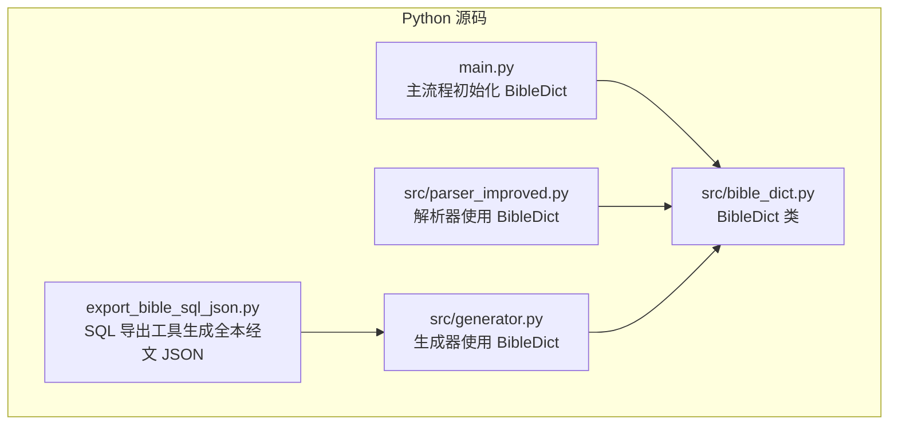
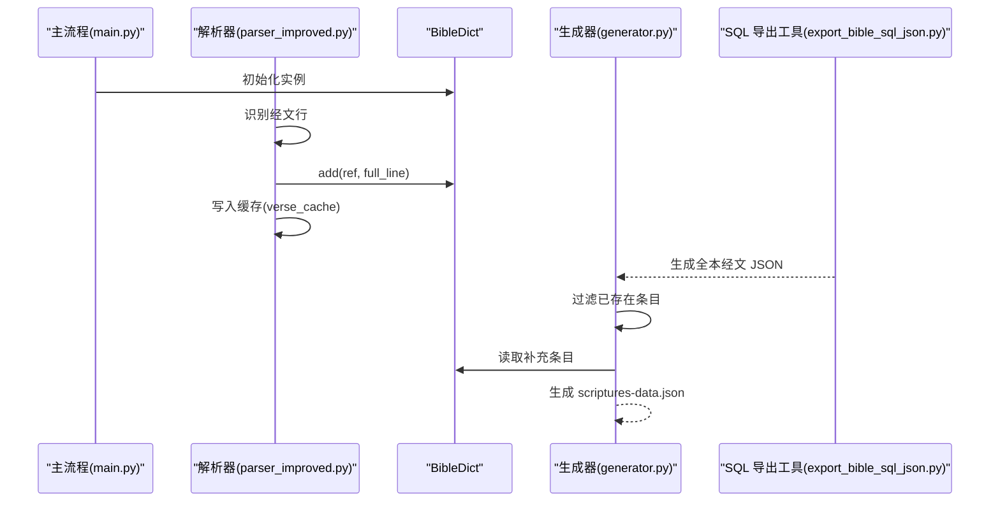
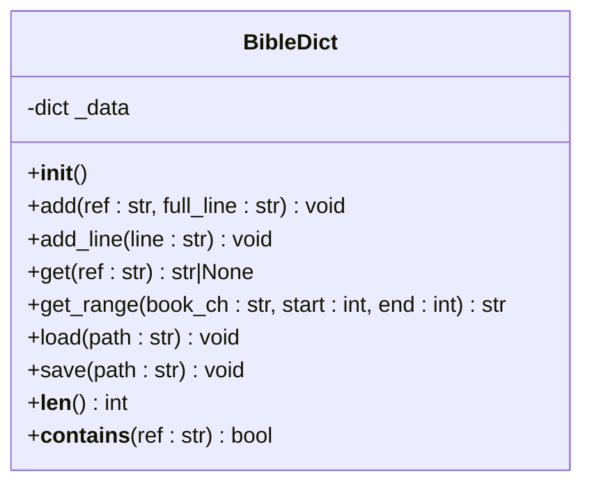
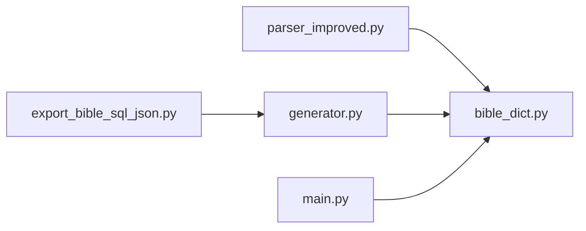

# BibleDict 类 API

<cite>
**本文档引用的文件**
- [bible_dict.py](file://src/bible_dict.py)
- [parser_improved.py](file://src/parser_improved.py)
- [main.py](file://main.py)
- [export_bible_sql_json.py](file://export_bible_sql_json.py)
- [generator.py](file://src/generator.py)
</cite>

## 目录
1. [简介](#简介)
2. [项目结构](#项目结构)
3. [核心组件](#核心组件)
4. [架构概览](#架构概览)
5. [详细组件分析](#详细组件分析)
6. [依赖分析](#依赖分析)
7. [性能考虑](#性能考虑)
8. [故障排除指南](#故障排除指南)
9. [结论](#结论)
10. [附录](#附录)

## 简介
本文件为 BibleDict 类的完整 API 文档，涵盖构造函数、初始化参数与配置选项、add 方法的参数类型与添加逻辑（含重复条目处理策略）、get 方法的查询机制与返回格式、持久化存储的实现方式与数据格式、缓存机制的工作原理与性能考虑、数据导入导出的方法与格式说明、错误处理与异常情况的处理方式，以及完整的使用示例与集成指南。BibleDict 用于持久化存储所有出现过的经文条目，键为经文引用（如“太5:3”），值为完整经文行（如“太5:3 灵里贫穷的人有福了，因为天国是他们的。”）。

## 项目结构
BibleDict 类位于 Python 源码目录中，与解析器、生成器、主流程以及数据导出工具协同工作，形成从原始文档到最终静态资源的完整链路。

图表来源
- [bible_dict.py:1-96](file://src/bible_dict.py#L1-L96)
- [parser_improved.py:340-365](file://src/parser_improved.py#L340-L365)
- [generator.py:334-372](file://src/generator.py#L334-L372)
- [main.py:988-990](file://main.py#L988-L990)
- [export_bible_sql_json.py:1-536](file://export_bible_sql_json.py#L1-L536)

章节来源
- [bible_dict.py:1-96](file://src/bible_dict.py#L1-L96)
- [parser_improved.py:340-365](file://src/parser_improved.py#L340-L365)
- [generator.py:334-372](file://src/generator.py#L334-L372)
- [main.py:988-990](file://main.py#L988-L990)
- [export_bible_sql_json.py:1-536](file://export_bible_sql_json.py#L1-L536)

## 核心组件
- 类名：BibleDict
- 作用：持久化存储经文条目，提供添加、查询、范围查询、加载与保存等能力。
- 数据结构：内部使用字典存储，键为经文引用（如“太5:3”），值为完整经文行（如“太5:3 灵里贫穷的人有福了，因为天国是他们的。”）。
- 正则表达式：复用解析器中的经文行识别正则，用于从完整经文行中提取引用与正文。

章节来源
- [bible_dict.py:1-96](file://src/bible_dict.py#L1-L96)

## 架构概览
BibleDict 在系统中的角色与交互如下：
- 主流程在批量构建阶段初始化 BibleDict 实例，用于跨章节“从略”还原等场景，且不持久化到磁盘。
- 解析器在解析过程中将识别到的经文同步写入 BibleDict，并同时写入缓存（verse_cache）。
- 生成器在生成补充经文 JSON 时，会基于全本经文 JSON 过滤已存在的条目，仅保留 BibleDict 中的补充条目。
- SQL 导出工具生成全本经文 JSON，供生成器进行过滤与补全标记。

图表来源
- [main.py:988-990](file://main.py#L988-L990)
- [parser_improved.py:340-365](file://src/parser_improved.py#L340-L365)
- [generator.py:334-372](file://src/generator.py#L334-L372)
- [export_bible_sql_json.py:1-536](file://export_bible_sql_json.py#L1-L536)

## 详细组件分析

### 构造函数与初始化
- 类名：BibleDict
- 构造函数：无参数
- 初始化行为：创建内部字典，用于存储经文条目
- 关键点：
  - 不接收外部配置参数
  - 内部状态为私有字典，键为经文引用，值为完整经文行
  - 使用与解析器相同的经文行识别正则，保证一致性

章节来源
- [bible_dict.py:26-27](file://src/bible_dict.py#L26-L27)
- [bible_dict.py:13-16](file://src/bible_dict.py#L13-L16)

### add 方法
- 方法签名：add(ref: str, full_line: str)
- 参数类型：
  - ref: str，经文引用（如“太5:3”）
  - full_line: str，完整经文行（包含 ref 前缀）
- 添加逻辑：
  - 若 ref 非空且不在字典中，则将条目加入字典
  - 若 ref 已存在，则不覆盖，保持已有值
- 重复条目处理策略：拒绝覆盖，确保数据一致性
- 典型用途：解析器在识别到新的经文行时，将其写入字典

章节来源
- [bible_dict.py:33-36](file://src/bible_dict.py#L33-L36)
- [parser_improved.py:340-349](file://src/parser_improved.py#L340-L349)

### add_line 方法
- 方法签名：add_line(line: str)
- 参数类型：line: str，完整经文行（如“太5:3 灵里贫穷的人有福了...”）
- 处理逻辑：
  - 使用经文行识别正则匹配行首的经文引用
  - 若匹配成功，调用 add(ref, line) 将条目加入字典
- 适用场景：批量处理经文行文本时，自动提取引用并存储

章节来源
- [bible_dict.py:38-42](file://src/bible_dict.py#L38-L42)
- [bible_dict.py:13-16](file://src/bible_dict.py#L13-L16)

### get 方法
- 方法签名：get(ref: str)
- 参数类型：ref: str，经文引用（如“太5:3”）
- 查询机制：
  - 直接从内部字典按键查找
  - 若存在，返回完整经文行；若不存在，返回 None
- 返回格式：str 或 None
- 典型用途：解析器在需要回填或补充经文时进行查询

章节来源
- [bible_dict.py:48-50](file://src/bible_dict.py#L48-L50)
- [parser_improved.py:361-365](file://src/parser_improved.py#L361-L365)

### get_range 方法
- 方法签名：get_range(book_ch: str, start: int, end: int) -> str
- 参数类型：
  - book_ch: str，书卷与章号（如“腓2”）
  - start: int，起始节号
  - end: int，结束节号
- 查询机制：
  - 遍历从 start 到 end 的每个节号
  - 拼接对应经文行，若某节缺失则跳过
  - 返回由换行符连接的多行文本
- 返回格式：str（多行文本）
- 典型用途：批量获取某一书卷某章的连续经文

章节来源
- [bible_dict.py:52-59](file://src/bible_dict.py#L52-L59)

### load 方法（持久化加载）
- 方法签名：load(path: str)
- 参数类型：path: str，JSON 文件路径
- 加载机制：
  - 若文件不存在，直接返回（不报错）
  - 读取 JSON 文件，逐项遍历
  - 对于每一条目，若键不在当前字典中，则加入（不覆盖）
  - 输出加载统计信息（加载数量与文件路径）
- 异常处理：
  - 读取 JSON 时捕获异常并打印警告信息，不影响整体流程
- 数据格式：JSON 对象，键为经文引用，值为完整经文行
- 典型用途：增量加载历史经文或外部补充数据

章节来源
- [bible_dict.py:65-77](file://src/bible_dict.py#L65-L77)
- [bible_dict.py:67-75](file://src/bible_dict.py#L67-L75)

### save 方法（持久化保存）
- 方法签名：save(path: str)
- 参数类型：path: str，目标 JSON 文件路径
- 保存机制：
  - 确保目标目录存在（不存在则创建）
  - 将内部字典写入 JSON 文件
  - 写入选项：不使用 ASCII，缩进为 2，按键排序
- 数据格式：JSON 对象，键为经文引用，值为完整经文行
- 典型用途：将当前内存中的经文条目持久化到磁盘

章节来源
- [bible_dict.py:79-85](file://src/bible_dict.py#L79-L85)

### 辅助方法
- __len__：返回字典中条目数量
- __contains__：判断某经文引用是否存在

章节来源
- [bible_dict.py:91-95](file://src/bible_dict.py#L91-L95)

### 类关系图

图表来源
- [bible_dict.py:19-95](file://src/bible_dict.py#L19-L95)

## 依赖分析
- 与解析器的耦合：
  - 解析器在识别到经文行时，同步写入 BibleDict 与缓存（verse_cache）
  - 解析器在回填或补充经文时，从 BibleDict 查询缺失条目
- 与生成器的耦合：
  - 生成器在生成补充经文 JSON 时，读取 BibleDict 中的条目，并结合全本经文 JSON 进行过滤
- 与主流程的耦合：
  - 主流程在批量构建阶段初始化 BibleDict 实例，用于跨章节“从略”还原等场景
- 与 SQL 导出工具的耦合：
  - SQL 导出工具生成全本经文 JSON，供生成器进行过滤与补全标记

图表来源
- [parser_improved.py:340-365](file://src/parser_improved.py#L340-L365)
- [generator.py:334-372](file://src/generator.py#L334-L372)
- [main.py:988-990](file://main.py#L988-L990)
- [export_bible_sql_json.py:1-536](file://export_bible_sql_json.py#L1-L536)

章节来源
- [parser_improved.py:340-365](file://src/parser_improved.py#L340-L365)
- [generator.py:334-372](file://src/generator.py#L334-L372)
- [main.py:988-990](file://main.py#L988-L990)
- [export_bible_sql_json.py:1-536](file://export_bible_sql_json.py#L1-L536)

## 性能考虑
- 时间复杂度：
  - add：O(1)，字典插入
  - add_line：O(1)，正则匹配 + 字典插入
  - get：O(1)，字典查找
  - get_range：O(n)，n 为节号范围大小
  - load/save：O(m)，m 为条目数量
- 空间复杂度：O(m)，m 为条目数量
- 优化建议：
  - 在解析阶段同时维护缓存（verse_cache），减少重复查询
  - 在生成补充经文 JSON 时，利用全本经文 JSON 进行快速过滤
  - 保存时按键排序，便于版本控制与差异对比

[本节为一般性性能讨论，不直接分析具体文件]

## 故障排除指南
- 加载失败：
  - 现象：load 方法在读取 JSON 文件时抛出异常
  - 处理：程序捕获异常并打印警告信息，继续执行其他流程
  - 建议：检查文件编码（UTF-8）与 JSON 格式
- 重复条目：
  - 现象：add/add_line 传入已存在引用
  - 处理：不覆盖，保持已有值
  - 建议：确认输入数据唯一性或在上游去重
- 查询为空：
  - 现象：get 返回 None
  - 处决：检查引用格式是否正确（如“太5:3”）
  - 建议：确认条目已成功加载或写入

章节来源
- [bible_dict.py:67-77](file://src/bible_dict.py#L67-L77)
- [bible_dict.py:35-36](file://src/bible_dict.py#L35-L36)

## 结论
BibleDict 类提供了简洁高效的经文条目持久化能力，具备良好的扩展性与稳定性。通过与解析器、生成器、主流程以及 SQL 导出工具的协作，形成了从原始文档到最终静态资源的完整数据流。其设计遵循“不覆盖已有条目”的原则，确保数据一致性；同时通过缓存与过滤机制提升性能与可用性。

[本节为总结性内容，不直接分析具体文件]

## 附录

### 使用示例与集成指南
- 初始化与基本操作
  - 在主流程中创建实例，用于跨章节“从略”还原等场景
  - 在解析器中识别到新经文行时，调用 add 或 add_line 写入
  - 在需要回填或补充经文时，调用 get 或 get_range 查询
- 数据导入导出
  - 导入：使用 load 从 JSON 文件增量加载
  - 导出：使用 save 将当前内存中的条目持久化到 JSON 文件
- 与全本经文的配合
  - 通过 SQL 导出工具生成全本经文 JSON
  - 生成器在生成补充经文 JSON 时，基于全本经文进行过滤与补全标记

章节来源
- [main.py:988-990](file://main.py#L988-L990)
- [parser_improved.py:340-365](file://src/parser_improved.py#L340-L365)
- [generator.py:334-372](file://src/generator.py#L334-L372)
- [export_bible_sql_json.py:1-536](file://export_bible_sql_json.py#L1-L536)

### 数据格式说明
- 存储格式：JSON 对象
- 键：经文引用（如“太5:3”）
- 值：完整经文行（如“太5:3 灵里贫穷的人有福了，因为天国是他们的。”）
- 排序：按键排序（保存时）

章节来源
- [bible_dict.py:84-85](file://src/bible_dict.py#L84-L85)

### 错误处理与异常情况
- 文件不存在：load 直接返回，不报错
- JSON 解析异常：捕获并打印警告，不影响其他流程
- 重复条目：add/add_line 不覆盖，保持已有值

章节来源
- [bible_dict.py:67-77](file://src/bible_dict.py#L67-L77)
- [bible_dict.py:35-36](file://src/bible_dict.py#L35-L36)