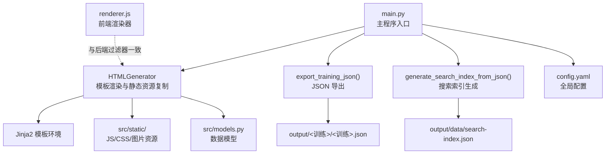
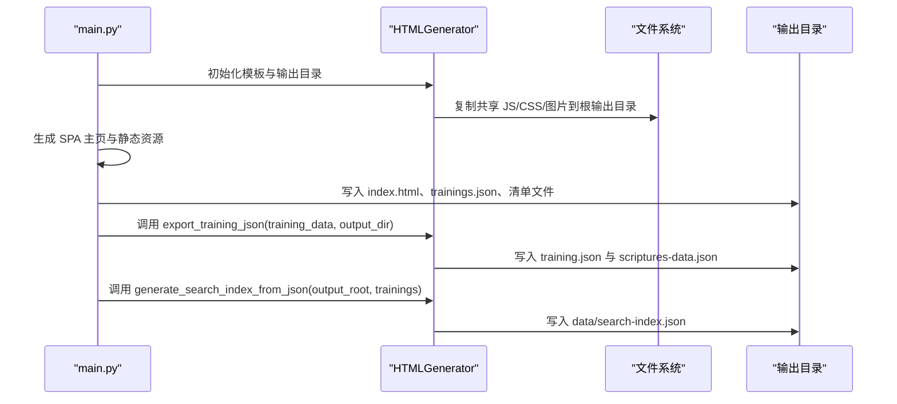
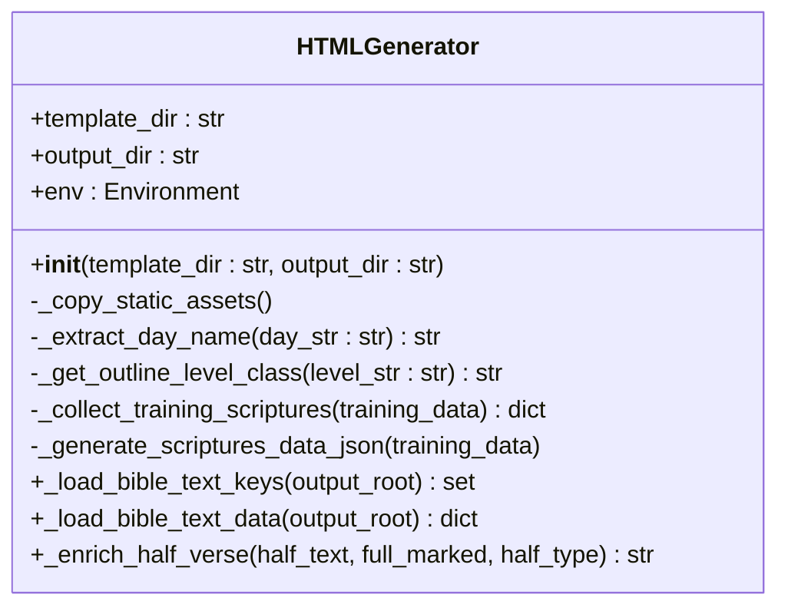
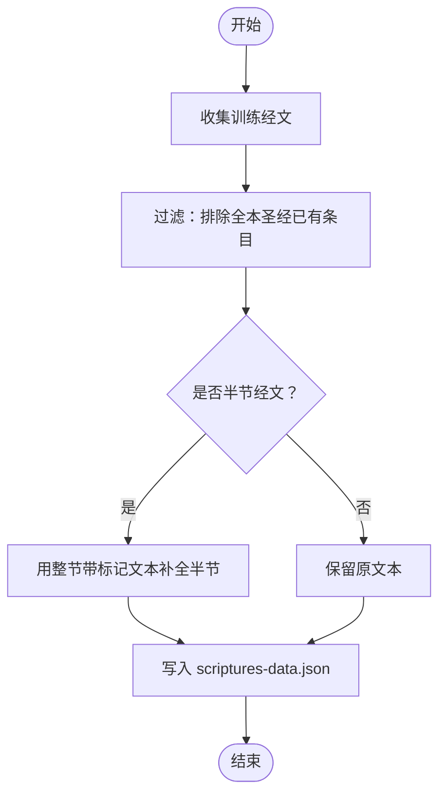
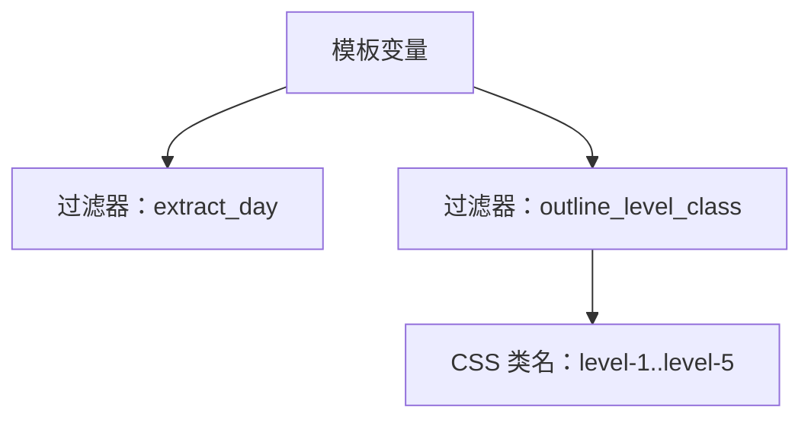
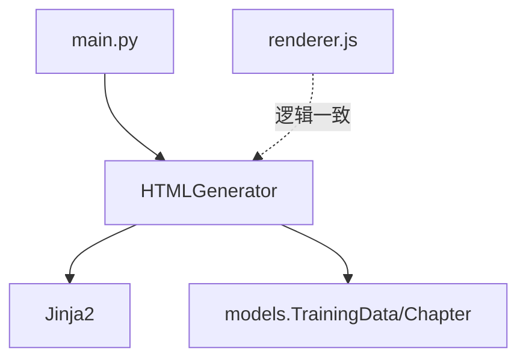

# Generator 类 API

<cite>
**本文引用的文件**
- [src/generator.py](file://src/generator.py)
- [main.py](file://main.py)
- [config.yaml](file://config.yaml)
- [src/models.py](file://src/models.py)
- [src/static/js/renderer.js](file://src/static/js/renderer.js)
</cite>

## 目录
1. [简介](#简介)
2. [项目结构](#项目结构)
3. [核心组件](#核心组件)
4. [架构概览](#架构概览)
5. [详细组件分析](#详细组件分析)
6. [依赖分析](#依赖分析)
7. [性能考量](#性能考量)
8. [故障排查指南](#故障排查指南)
9. [结论](#结论)
10. [附录](#附录)

## 简介
本文件为 Generator 类（在代码中实际为 HTMLGenerator）的详细 API 文档，覆盖构造函数参数、模板系统、静态资源处理、JSON 导出与搜索索引生成、配置项与默认值、部署与样式定制、以及性能优化与缓存策略。目标是帮助开发者快速理解并正确使用该生成器，同时为维护者提供深入的技术参考。

## 项目结构
与 Generator 相关的关键文件与职责如下：
- src/generator.py：包含 HTMLGenerator 类、JSON 导出函数与搜索索引生成函数，负责模板渲染、静态资源复制、经文数据生成与索引构建。
- main.py：主程序入口，负责批量处理、SPA 主页生成、静态资源复制、清单与元数据生成、以及最终输出目录的组织。
- config.yaml：全局配置文件，定义输出目录、模板目录、静态资源目录、批量处理策略与远程服务器配置等。
- src/models.py：训练数据模型定义，为模板渲染提供结构化的数据接口。
- src/static/js/renderer.js：前端渲染器，包含与模板过滤器一致的纲目层级判定逻辑，用于保证前后端一致性。

图表来源
- [src/generator.py:22-46](file://src/generator.py#L22-L46)
- [main.py:317-546](file://main.py#L317-L546)
- [config.yaml:1-42](file://config.yaml#L1-L42)
- [src/models.py:9-232](file://src/models.py#L9-L232)
- [src/static/js/renderer.js:112-144](file://src/static/js/renderer.js#L112-L144)

章节来源
- [src/generator.py:22-46](file://src/generator.py#L22-L46)
- [main.py:317-546](file://main.py#L317-L546)
- [config.yaml:1-42](file://config.yaml#L1-L42)
- [src/models.py:9-232](file://src/models.py#L9-L232)
- [src/static/js/renderer.js:112-144](file://src/static/js/renderer.js#L112-L144)

## 核心组件
- HTMLGenerator：负责模板初始化、静态资源复制、经文数据生成与 JSON 导出辅助功能。
- export_training_json：将训练数据导出为 SPA 所需的 training.json，并生成补充经文数据。
- generate_search_index_from_json：基于训练 JSON 生成搜索索引，供前端检索使用。

章节来源
- [src/generator.py:22-46](file://src/generator.py#L22-L46)
- [src/generator.py:382-424](file://src/generator.py#L382-L424)
- [src/generator.py:427-544](file://src/generator.py#L427-L544)

## 架构概览
下图展示了从主程序到生成器、再到输出目录的整体流程：

图表来源
- [main.py:317-546](file://main.py#L317-L546)
- [src/generator.py:22-46](file://src/generator.py#L22-L46)
- [src/generator.py:382-424](file://src/generator.py#L382-L424)
- [src/generator.py:427-544](file://src/generator.py#L427-L544)

## 详细组件分析

### HTMLGenerator 类
- 作用：封装模板渲染、静态资源复制、经文数据生成与 JSON 导出辅助功能。
- 关键点：
  - 模板环境：使用 Jinja2 FileSystemLoader，加载模板目录。
  - 自定义过滤器：extract_day（提取星期）、outline_level_class（纲目层级 CSS 类）。
  - 静态资源复制：将共享 JS、CSS、图片复制到输出目录的根级 js/、css/、images/，供各训练页相对引用。
  - 经文数据生成：收集训练中独有的经文，过滤全本圣经已有条目，生成 scriptures-data.json。

图表来源
- [src/generator.py:22-46](file://src/generator.py#L22-L46)
- [src/generator.py:142-201](file://src/generator.py#L142-L201)
- [src/generator.py:213-280](file://src/generator.py#L213-L280)
- [src/generator.py:333-371](file://src/generator.py#L333-L371)

章节来源
- [src/generator.py:22-46](file://src/generator.py#L22-L46)
- [src/generator.py:142-201](file://src/generator.py#L142-L201)
- [src/generator.py:213-280](file://src/generator.py#L213-L280)
- [src/generator.py:333-371](file://src/generator.py#L333-L371)

#### 构造函数与参数
- 参数
  - template_dir: 模板目录路径（Jinja2 FileSystemLoader 加载）。
  - output_dir: 输出目录路径（HTML 与 JSON 等产物写入）。
- 行为
  - 初始化模板环境并注册自定义过滤器。
  - 确保输出目录存在。
  - 复制静态资源（共享 JS、CSS、图片）到根输出目录的 js/、css/、images/。

章节来源
- [src/generator.py:25-46](file://src/generator.py#L25-L46)

#### 静态资源处理机制
- 复制范围
  - 共享 JS：固定列表文件复制至根输出目录 js/。
  - 共享 CSS：目录下所有 .css 文件复制至根输出目录 css/。
  - 共享图片：目录下所有文件复制至根输出目录 images/。
- 目录结构
  - 模板目录位于 src/templates，静态资源位于 src/static。
  - 复制目标为输出目录的上级目录（../js、../css、../images），以便训练页统一引用。

章节来源
- [src/generator.py:47-115](file://src/generator.py#L47-L115)

#### 经文数据生成与 scriptures-data.json
- 目的：为前端弹窗等场景提供全本圣经之外的补充经文。
- 流程
  - 收集训练中所有经文行，去重并过滤已在全本圣经中的条目。
  - 对半节（上/中/下）经文，利用整节带标记文本补全标记，保留至 scriptures-data.json。
  - 输出至 output/<训练>/js/scriptures-data.json。

图表来源
- [src/generator.py:333-371](file://src/generator.py#L333-L371)
- [src/generator.py:252-279](file://src/generator.py#L252-L279)
- [src/generator.py:281-332](file://src/generator.py#L281-L332)

章节来源
- [src/generator.py:333-371](file://src/generator.py#L333-L371)
- [src/generator.py:252-279](file://src/generator.py#L252-L279)
- [src/generator.py:281-332](file://src/generator.py#L281-L332)

#### 搜索索引生成（SPA 模式）
- 输入：output_root 与 trainings 列表（包含路径、标题、章节数等元数据）。
- 输出：output/data/search-index.json，包含听抄、纲目、晨兴喂养、信息选读、职事摘录等视图的条目。
- 视图类型映射与内容抽取规则详见实现细节。

章节来源
- [src/generator.py:427-544](file://src/generator.py#L427-L544)

### 模板系统与变量绑定
- 模板引擎：Jinja2（FileSystemLoader）。
- 自定义过滤器
  - extract_day：从“第N周 • 周X”中提取“周X”。
  - outline_level_class：根据纲目序号（壹、一、1、a、I、II、A、B、㈠等）生成 CSS 类名（level-1 至 level-5）。
- 前后端一致性：前端渲染器（renderer.js）实现了与后端过滤器一致的逻辑，确保渲染结果一致。

图表来源
- [src/generator.py:37-40](file://src/generator.py#L37-L40)
- [src/generator.py:142-201](file://src/generator.py#L142-L201)
- [src/static/js/renderer.js:112-144](file://src/static/js/renderer.js#L112-L144)

章节来源
- [src/generator.py:37-40](file://src/generator.py#L37-L40)
- [src/generator.py:142-201](file://src/generator.py#L142-L201)
- [src/static/js/renderer.js:112-144](file://src/static/js/renderer.js#L112-L144)

### 数据模型与输入格式
- 数据模型：TrainingData、Chapter、Content、MorningRevival。
- 导出前的数据预处理：将模型对象转换为字典，供模板渲染与 JSON 导出使用。
- 经文引用键提取：支持从“书卷:节”格式中提取引用键，用于索引与引用。

章节来源
- [src/models.py:9-232](file://src/models.py#L9-L232)

### JSON 导出与 SPA 集成
- 导出函数：export_training_json(training_data, output_dir)。
- 产物
  - training.json：完整训练数据，包含预计算的喂养经文引用列表。
  - scriptures-data.json：补充经文数据（不包含全本圣经条目）。
- 版本号：写入 training.json 的 version 字段，便于缓存与增量更新。

章节来源
- [src/generator.py:382-424](file://src/generator.py#L382-L424)

### SPA 主页与静态资源复制（主程序）
- 主页生成：生成 SPA shell（index.html）、trainings.json、图标、静态图片、vendor 目录、共享 JS/CSS。
- 清单与元数据：复制 manifest.json、sw.js、_headers、_redirects、changelog.json、.nojekyll。
- 资源包：生成历史训练资源包清单与 ZIP，按 10 年分组打包（不含图片）。

章节来源
- [main.py:317-546](file://main.py#L317-L546)

## 依赖分析
- 组件耦合
  - HTMLGenerator 依赖 Jinja2 环境与模板目录，依赖 models 提供的数据结构。
  - 主程序依赖 HTMLGenerator 的 JSON 导出与索引生成能力。
  - 前端渲染器与后端过滤器保持逻辑一致，避免渲染差异。
- 外部依赖
  - Python 标准库：os、json、shutil、re、yaml、subprocess。
  - 第三方库：Jinja2（模板引擎）。

图表来源
- [src/generator.py:9-11](file://src/generator.py#L9-L11)
- [src/models.py:9-232](file://src/models.py#L9-L232)
- [main.py:14-16](file://main.py#L14-L16)
- [src/static/js/renderer.js:112-144](file://src/static/js/renderer.js#L112-L144)

章节来源
- [src/generator.py:9-11](file://src/generator.py#L9-L11)
- [src/models.py:9-232](file://src/models.py#L9-L232)
- [main.py:14-16](file://main.py#L14-L16)
- [src/static/js/renderer.js:112-144](file://src/static/js/renderer.js#L112-L144)

## 性能考量
- 缓存策略
  - 全本圣经经文键集合与完整数据在类级别缓存，避免重复解析，提升多训练场景下的性能。
- I/O 优化
  - 批量复制共享 JS/CSS/图片时，优先检查目录是否存在，失败不中断生成流程。
  - 索引生成按 JSON 文件逐个读取，避免一次性加载全部数据。
- 压缩输出
  - 圣经数据 JSON 压缩为紧凑格式，减少打包体积。
- 资源包
  - 历史训练按 10 年分组打包，跳过图片目录，降低包体积与网络传输成本。

章节来源
- [src/generator.py:249-279](file://src/generator.py#L249-L279)
- [src/generator.py:47-115](file://src/generator.py#L47-L115)
- [src/generator.py:783-791](file://src/generator.py#L783-L791)
- [main.py:548-652](file://main.py#L548-L652)

## 故障排查指南
- 模板缺失
  - 现象：模板目录不存在或文件缺失导致渲染失败。
  - 处理：确认 template_dir 指向正确的模板目录。
- 静态资源复制失败
  - 现象：复制共享 JS/CSS/图片失败但不影响 HTML 生成。
  - 处理：检查 src/static 目录是否存在，确认权限与路径正确。
- JSON 导出异常
  - 现象：training.json 或 scriptures-data.json 生成失败。
  - 处理：检查输出目录权限与磁盘空间，查看异常堆栈定位具体问题。
- 搜索索引为空
  - 现象：search-index.json 条目数为 0。
  - 处理：确认 training.json 已生成且包含有效内容；检查视图类型与内容抽取逻辑。

章节来源
- [src/generator.py:112-115](file://src/generator.py#L112-L115)
- [src/generator.py:418-423](file://src/generator.py#L418-L423)
- [src/generator.py:473-476](file://src/generator.py#L473-L476)

## 结论
HTMLGenerator 作为静态站点生成的核心组件，提供了模板渲染、静态资源复制、经文数据生成与索引构建的完整能力。配合主程序的 SPA 主页生成与资源包策略，能够高效产出可部署的静态站点。通过合理的缓存与 I/O 优化，可在大规模训练数据场景下保持良好性能。

## 附录

### 配置项与默认值
- batch_processing.enabled: true
- batch_processing.skip_existing: false
- batch_processing.strict_exit_on_batch_failure: false
- batch_processing.max_latest_trainings: 5
- output_dir: "output"
- resource_base_dir: "resource"
- template_dir: "src/templates"
- static_dir: "src/static"
- default_training.year: 2025
- default_training.season: "秋季"
- remote_servers: 包含 cloudflare、github_api、github_mirrors、push、ip_apis 等配置项

章节来源
- [config.yaml:1-42](file://config.yaml#L1-L42)

### 部署配置与自定义样式指南
- 部署到 Cloudflare Pages
  - 构建命令：chmod +x build.sh && ./build.sh
  - 输出目录：output
  - 环境变量：PYTHON_VERSION=3.9、DEBIAN_FRONTEND=noninteractive
- 自定义样式
  - 在 src/static/css 下新增或修改 CSS 文件，生成时会复制到根输出目录的 css/。
  - 使用 outline_level_class 过滤器为纲目层级生成 CSS 类，便于样式定制。
- 自定义模板
  - 在 src/templates 下新增或修改模板文件，HTMLGenerator 会通过 FileSystemLoader 加载。
  - 使用 extract_day 过滤器处理日期显示，确保前后端一致。

章节来源
- [config.yaml:22-42](file://config.yaml#L22-L42)
- [main.py:500-505](file://main.py#L500-L505)
- [src/generator.py:37-40](file://src/generator.py#L37-L40)