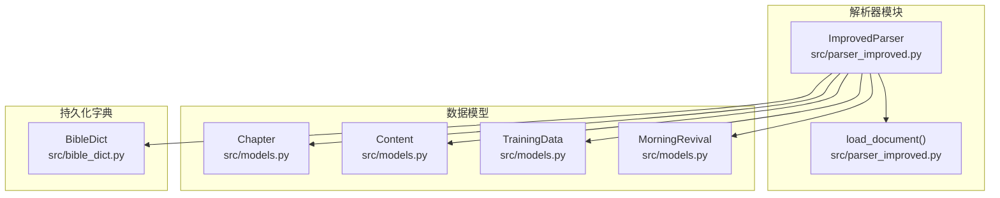
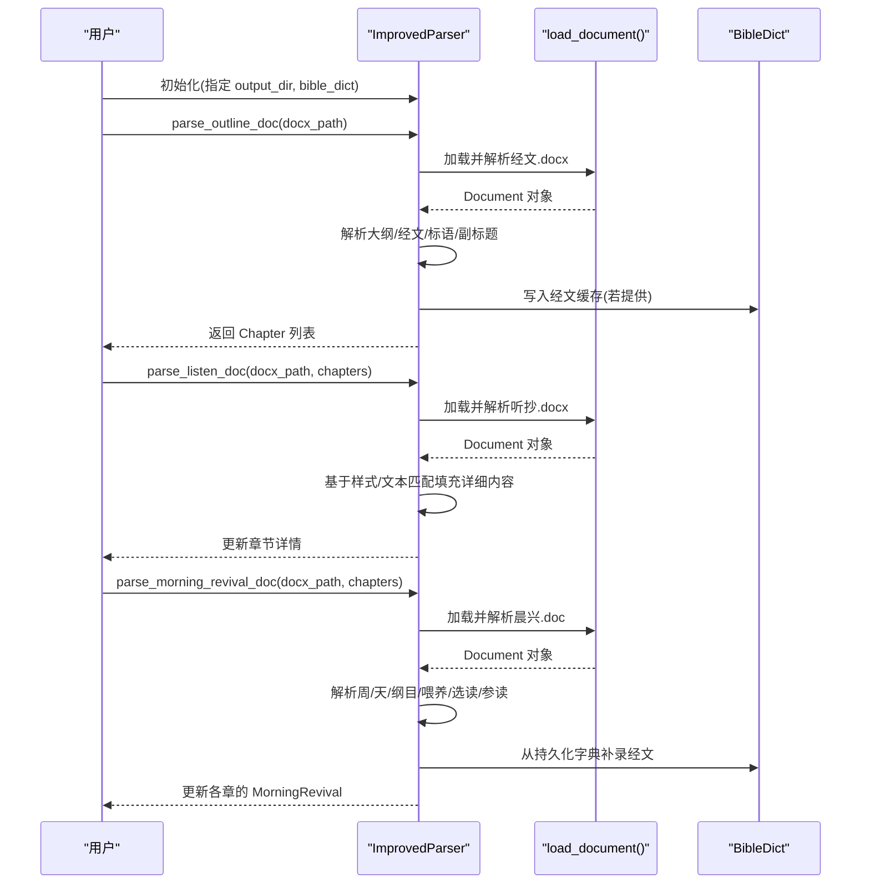
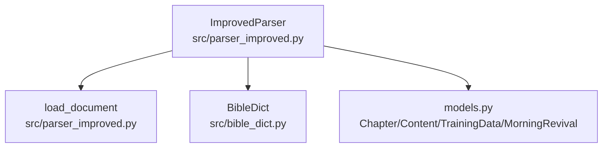

# ImprovedParser 类 API

<cite>
**本文引用的文件**
- [parser_improved.py](file://src/parser_improved.py)
- [bible_dict.py](file://src/bible_dict.py)
- [models.py](file://src/models.py)
- [README.md](file://README.md)
</cite>

## 目录
1. [简介](#简介)
2. [项目结构](#项目结构)
3. [核心组件](#核心组件)
4. [架构总览](#架构总览)
5. [详细组件分析](#详细组件分析)
6. [依赖关系分析](#依赖关系分析)
7. [性能考量](#性能考量)
8. [故障排查指南](#故障排查指南)
9. [结论](#结论)
10. [附录](#附录)

## 简介
本文件为 ImprovedParser 类的详细 API 文档，聚焦以下目标：
- 构造函数 __init__ 的参数与配置项说明（尤其是 output_dir 与 bible_dict 参数）
- parse_outline_doc 方法的参数类型、返回值、使用示例与 docx_path 的格式要求
- parse_listen_doc 方法的参数说明与处理逻辑
- reset_state 方法的作用与调用时机
- load_document 函数的使用方法与错误处理
- 正则表达式模式详解（含 STYLE_MAP、各类匹配模式的用途与格式要求）
- 缓存机制工作原理（verse_cache 的使用与 _bible_dict 的集成）
- 完整使用示例与最佳实践建议

## 项目结构
ImprovedParser 位于 src/parser_improved.py，配合 models.py 中的数据模型（Chapter、Content、TrainingData、MorningRevival）以及 src/bible_dict.py 中的持久化经文字典（BibleDict）共同完成从 Word 文档到结构化数据的解析与生成。

图表来源
- [parser_improved.py:276-282](file://src/parser_improved.py#L276-L282)
- [models.py:40-63](file://src/models.py#L40-L63)
- [bible_dict.py:19-96](file://src/bible_dict.py#L19-L96)

章节来源
- [README.md:52-88](file://README.md#L52-L88)
- [parser_improved.py:114-134](file://src/parser_improved.py#L114-L134)
- [models.py:9-26](file://src/models.py#L9-L26)
- [bible_dict.py:19-96](file://src/bible_dict.py#L19-L96)

## 核心组件
- ImprovedParser：主解析器，负责从经文、听抄、晨兴文档中抽取结构化内容，并维护解析状态与缓存。
- load_document：文档加载器，自动识别 .doc 与 .docx，必要时通过 LibreOffice 转换 .doc。
- BibleDict：持久化经文字典，提供 add/get/save/load 等能力，支持增量累积。
- 数据模型：Chapter、Content、TrainingData、MorningRevival，承载解析结果。

章节来源
- [parser_improved.py:114-134](file://src/parser_improved.py#L114-L134)
- [parser_improved.py:15-112](file://src/parser_improved.py#L15-L112)
- [bible_dict.py:19-96](file://src/bible_dict.py#L19-L96)
- [models.py:9-232](file://src/models.py#L9-L232)

## 架构总览
ImprovedParser 的解析流程分为三步：
1) parse_outline_doc：解析“经文.docx”，抽取大纲、经文、职事信息摘录、标语等，构建 Chapter 列表。
2) parse_listen_doc：解析“听抄.docx”，将详细内容填充到对应章节。
3) parse_morning_revival_doc：解析“晨兴.doc”，抽取每周每日的纲目与内容，补充到各章的 MorningRevival。

图表来源
- [parser_improved.py:276-282](file://src/parser_improved.py#L276-L282)
- [parser_improved.py:366-742](file://src/parser_improved.py#L366-L742)
- [parser_improved.py:744-803](file://src/parser_improved.py#L744-L803)
- [parser_improved.py:952-1303](file://src/parser_improved.py#L952-L1303)

## 详细组件分析

### ImprovedParser.__init__(output_dir="output", bible_dict=None)
- 参数
  - output_dir: 字符串，输出目录路径，默认为 "output"。用于存放生成的图片等资源。
  - bible_dict: BibleDict 实例，可选。用于跨文档/训练累积经文字典，提升缓存命中与一致性。
- 行为
  - 初始化输出目录与外部经文字典引用。
  - 调用 reset_state() 重置解析状态（当前章节/层级指针、经文缓存等）。
- 注意
  - 若传入 bible_dict，解析过程中会将经文写入该实例，便于后续补录与去重。

章节来源
- [parser_improved.py:276-282](file://src/parser_improved.py#L276-L282)

### reset_state()
- 作用
  - 重置解析器内部状态，包括当前章节与各级别节点指针，清空 verse_cache。
- 调用时机
  - parse_outline_doc 与 parse_listen_doc 开始解析前会调用 reset_state()。
  - 也可在需要重新解析不同文档时手动调用，确保状态干净。

章节来源
- [parser_improved.py:284-292](file://src/parser_improved.py#L284-L292)
- [parser_improved.py:373](file://src/parser_improved.py#L373)
- [parser_improved.py:756](file://src/parser_improved.py#L756)

### load_document(doc_path)
- 功能
  - 自动识别 .doc 与 .docx 格式；.doc 需要 LibreOffice 转换为 .docx 后解析。
- 参数
  - doc_path: 字符串，文档路径。
- 返回
  - Document 对象；若 .doc 需转换但失败，抛出异常。
- 错误处理
  - 文件不存在：抛出 FileNotFoundError。
  - 不支持的扩展名：抛出 ValueError。
  - LibreOffice 转换超时：抛出异常。
  - LibreOffice 不可用：打印友好提示并抛出 ImportError。

章节来源
- [parser_improved.py:15-112](file://src/parser_improved.py#L15-L112)

### parse_outline_doc(docx_path) -> List[Chapter]
- 参数
  - docx_path: 字符串，经文文档路径。支持 .doc 与 .docx；.doc 会尝试通过 LibreOffice 转换。
- 返回
  - List[Chapter]，包含解析得到的各篇章结构与内容。
- 处理逻辑要点
  - 标题/副标题/标语提取：从文档开头扫描，识别“总题：”、“标语”等区域，过滤无效内容。
  - 篇章标题解析：支持“第X篇”格式，提取编号与标题，同时提取诗歌编号。
  - 大纲层级解析：支持壹、一、1、a、㈠ 等层级标记，构建 Content 树。
  - 经文解析：识别“verses”样式或经文格式（如“腓2:5  经文内容...”），缓存到 verse_cache，并同步写入 bible_dict（若提供）。
  - 职事信息摘录：识别“职事信息摘录：”区域，收集有效段落。
  - 后处理：利用 bible_dict 补录空缺的经文范围与章节读经经文。
- docx_path 格式要求
  - 支持 .doc 与 .docx；.doc 需安装 LibreOffice 以便自动转换。
  - 文档应包含“第X篇”等明确的篇章标记，以便正确识别正文开始与章节边界。
- 使用示例（路径引用）
  - [parse_outline_doc 定义:366-742](file://src/parser_improved.py#L366-L742)

章节来源
- [parser_improved.py:366-742](file://src/parser_improved.py#L366-L742)

### parse_listen_doc(docx_path, chapters)
- 参数
  - docx_path: 字符串，听抄文档路径。支持 .doc 与 .docx。
  - chapters: List[Chapter]，由 parse_outline_doc 返回的章节列表。
- 处理逻辑要点
  - 基于 STYLE_MAP 将 Word 样式映射到章节层级（chapter_title、section_level1~5、content）。
  - 若样式映射失败，通过文本特征（层级标记、段落开头等）推断样式类型。
  - 将详细内容填充到对应章节的 detail_sections，并按层级关系构建 Content 树。
  - 跳过“读经：”行，避免与章节读经重复渲染。
- 使用示例（路径引用）
  - [parse_listen_doc 定义:744-903](file://src/parser_improved.py#L744-L903)

章节来源
- [parser_improved.py:744-903](file://src/parser_improved.py#L744-L903)

### 正则表达式模式详解
ImprovedParser 内部定义了大量正则表达式，用于识别层级、经文、纲目等。以下为关键模式与用途说明。

- STYLE_MAP
  - 用途：将 Word 样式名称映射到内部层级类型（chapter_title、section_level1~5、content）。
  - 示例映射（节选）：'121文章篇题' → 'chapter_title'；'131文章大点' → 'section_level1'；'verses' → 'content'。
  - 参考：[STYLE_MAP 定义:117-134](file://src/parser_improved.py#L117-L134)

- WEEK_OUTLINE_PATTERN、DAY_PATTERN、LEVEL1_PATTERN、LEVEL2_PATTERN、LEVEL3_PATTERN
  - 用途：识别周纲目与层级标记（如“第X周 • 纲目”、“第X周 • 周X”、“壹/一/1/a/㈠”等）。
  - 参考：[层级与周纲目模式:137-141](file://src/parser_improved.py#L137-L141)

- VERSE_PATTERN
  - 用途：识别经文行格式（如“腓2:5  经文内容...”），支持“书卷+阿拉伯章:节”与“书卷+中文章节”两种格式。
  - 参考：[经文行识别:142-144](file://src/parser_improved.py#L142-L144)

- 中文章节引用解析常量
  - _BOOK_BASE_PAT、_BOOK_MOD_PAT、_CN_CHAP_PAT：用于构建更复杂的引用解析正则。
  - _FULL_REF_RE、_REL_CHAP_RE、_WHOLE_CHAP_RE、_REL_WHOLE_CHAP_RE、_CONT_VERSE_RE：识别全称/相对/整章/纯节续/跨章范围等引用。
  - 参考：[中文章节引用解析常量:146-188](file://src/parser_improved.py#L146-L188)

- 全称/相对/章节式引用
  - _ARABIC_REF_RE、_FULL_CHAP_JING_RE、_REL_CHAP_JING_RE、_CONT_JING_RE、_CROSS_CHAP_VERSE_RE、_VERSE_TO_CROSS_CHAP_RE、_REL_CHAP_RANGE_RE：解析“阿拉伯章:节”、“全称中文章+阿拉伯节”、“相对中文章+阿拉伯节”、“纯中文节续”、“跨章范围”、“续章范围”、“相对章范围”等。
  - 参考：[全称/相对/章节式引用:241-274](file://src/parser_improved.py#L241-L274)

- 其他辅助模式
  - _FULL_BOOK_MAP、_ALIAS_BOOK_MAP、_FULL_BOOK_MAP_SORTED：书名映射与排序，便于规范化书名。
  - 参考：[书名映射:190-236](file://src/parser_improved.py#L190-L236)

章节来源
- [parser_improved.py:117-188](file://src/parser_improved.py#L117-L188)
- [parser_improved.py:241-274](file://src/parser_improved.py#L241-L274)
- [parser_improved.py:190-236](file://src/parser_improved.py#L190-L236)

### 缓存机制与 BibleDict 集成
- verse_cache
  - 作用：在单次解析过程中缓存已出现的经文行，键为“书卷+章:节”，值为完整经文行。
  - 使用：parse_outline_doc 与 parse_listen_doc 在遇到经文行时调用 _cache_verse(text) 写入；当遇到“从略”占位符时，通过 _get_cached_verse_range(book, start, end) 从缓存中拼接范围经文。
  - 参考：[经文缓存与范围获取:299-364](file://src/parser_improved.py#L299-L364)

- _bible_dict 集成
  - 若构造时提供了 BibleDict 实例，解析器会将经文行同步写入该实例，避免重复覆盖。
  - 后处理阶段：parse_outline_doc 与 parse_morning_revival_doc 会利用 BibleDict 补录空缺的经文范围与章节读经经文。
  - 参考：[后处理补录:731-737](file://src/parser_improved.py#L731-L737)、[补录章节经文:2437-2466](file://src/parser_improved.py#L2437-L2466)

- BibleDict 类能力
  - add/ref 行写入、add_line 行解析写入、get/get_range 读取、load/save 持久化、长度与包含判断。
  - 参考：[BibleDict 定义:19-96](file://src/bible_dict.py#L19-L96)

章节来源
- [parser_improved.py:299-364](file://src/parser_improved.py#L299-L364)
- [parser_improved.py:731-737](file://src/parser_improved.py#L731-L737)
- [parser_improved.py:2437-2466](file://src/parser_improved.py#L2437-L2466)
- [bible_dict.py:19-96](file://src/bible_dict.py#L19-L96)

### parse_morning_revival_doc(docx_path, chapters)
- 功能
  - 解析“晨兴.doc”，支持基于样式（夏季）与基于文本（秋季）两种解析策略。
  - 提取周/天/纲目/喂养/信息选读/参读等结构化内容。
  - 提取诗歌图片（跨平台），并将其路径写入对应章节。
- 处理逻辑要点
  - 文档格式检测：.doc 需转换为 .docx 后提取图片。
  - 样式统计：前200段统计样式使用情况，判断采用基于样式或基于文本的解析。
  - 夏季样式：使用 _parse_morning_revival_by_styles，支持“第一周”“周期”“喂养选读”“参读光亮”等样式。
  - 秋季样式：使用 _parse_morning_revival_by_text，基于文本模式识别周/天/纲目/内容。
  - 跨周/跨页续接：处理纲目与内容在分页/分栏中断后的拼接。
- 使用示例（路径引用）
  - [parse_morning_revival_doc 定义:952-1303](file://src/parser_improved.py#L952-L1303)
  - [基于样式解析:1304-1732](file://src/parser_improved.py#L1304-L1732)
  - [基于文本解析:1052-1280](file://src/parser_improved.py#L1052-L1280)

章节来源
- [parser_improved.py:952-1303](file://src/parser_improved.py#L952-L1303)
- [parser_improved.py:1304-1732](file://src/parser_improved.py#L1304-L1732)
- [parser_improved.py:1052-1280](file://src/parser_improved.py#L1052-L1280)

### 数据模型与输出
- Chapter/Content/MorningRevival/TrainingData
  - Chapter：包含 outline_sections、detail_sections、hymn_number/images、scripture/scripture_verses、message_content/ministry_excerpt、morning_revivals 等字段。
  - Content：层级、标题、经文、正文段落、子节点。
  - MorningRevival：按天的纲目与喂养/选读/参读内容。
  - TrainingData：训练总览，包含标题、副标题、年份、季节、标语、章节列表等。
  - 参考：[数据模型定义:9-232](file://src/models.py#L9-L232)

章节来源
- [models.py:9-232](file://src/models.py#L9-L232)

## 依赖关系分析
ImprovedParser 与外部模块的依赖关系如下：

图表来源
- [parser_improved.py:15-112](file://src/parser_improved.py#L15-L112)
- [parser_improved.py:114-134](file://src/parser_improved.py#L114-L134)
- [bible_dict.py:19-96](file://src/bible_dict.py#L19-L96)
- [models.py:9-232](file://src/models.py#L9-L232)

章节来源
- [parser_improved.py:15-112](file://src/parser_improved.py#L15-L112)
- [bible_dict.py:19-96](file://src/bible_dict.py#L19-L96)
- [models.py:9-232](file://src/models.py#L9-L232)

## 性能考量
- 正则表达式预编译：所有关键正则在类定义时预编译，减少重复编译开销。
- 缓存策略：单次解析使用内存缓存（verse_cache），跨文档/训练使用 BibleDict 持久化，降低重复解析成本。
- 跨页/跨栏续接：通过 _should_merge_with_previous 判断，避免不必要的字符串拼接。
- 样式统计：parse_morning_revival_doc 前200段统计样式，快速选择解析策略，减少误判。

## 故障排查指南
- .doc 文件无法自动转换
  - 现象：提示需要安装 LibreOffice 或手动转换。
  - 处理：安装 LibreOffice 后重试；或在 Word 中另存为 .docx。
  - 参考：[load_document 错误处理:82-102](file://src/parser_improved.py#L82-L102)
- LibreOffice 转换超时
  - 现象：抛出超时异常。
  - 处理：增大超时时间或改用手动转换。
  - 参考：[load_document 超时处理:104-106](file://src/parser_improved.py#L104-L106)
- 经文范围“从略”未补录
  - 现象：经文范围被占位符标记，但未从缓存/字典补录。
  - 处理：确认已调用 reset_state()、已传入 BibleDict、且范围键存在于缓存或字典中。
  - 参考：[经文范围补录:518-540](file://src/parser_improved.py#L518-L540)、[范围缓存获取:350-364](file://src/parser_improved.py#L350-L364)
- 标题/副标题识别异常
  - 现象：标题或副标题提取不符合预期。
  - 处理：检查文档开头是否存在“总题：”“标语”等标记，或调整文档样式。
  - 参考：[标题/副标题提取:386-510](file://src/parser_improved.py#L386-L510)

章节来源
- [parser_improved.py:82-102](file://src/parser_improved.py#L82-L102)
- [parser_improved.py:104-106](file://src/parser_improved.py#L104-L106)
- [parser_improved.py:518-540](file://src/parser_improved.py#L518-L540)
- [parser_improved.py:350-364](file://src/parser_improved.py#L350-L364)
- [parser_improved.py:386-510](file://src/parser_improved.py#L386-L510)

## 结论
ImprovedParser 提供了从 Word 文档到结构化数据的完整解析链路，具备强大的层级识别、经文解析与缓存补录能力。通过合理使用 output_dir 与 bible_dict 参数，可在单次与跨次解析中获得一致、高效的解析体验。结合正则表达式与样式映射，能够稳定处理 .doc/.docx 混合格式与不同训练类型的文档。

## 附录

### 使用示例与最佳实践
- 基本流程
  1) 初始化解析器：指定 output_dir 与可选的 bible_dict。
  2) 解析经文文档：parse_outline_doc 返回章节列表。
  3) 解析听抄文档：parse_listen_doc 填充详细内容。
  4) 解析晨兴文档：parse_morning_revival_doc 补充每日纲目与内容。
  5) 可选：将纲目经文映射同步到晨兴纲目。
- 最佳实践
  - .doc 文档建议先转换为 .docx，或安装 LibreOffice 以支持自动转换。
  - 使用 BibleDict 作为持久化字典，避免重复解析与去重问题。
  - 在 parse_outline_doc 与 parse_listen_doc 前调用 reset_state()，确保状态干净。
  - 对于大型文档，注意跨页/跨栏续接的处理，确保内容连贯性。
- 参考路径
  - [parse_training_docs_improved 主流程:2545-2662](file://src/parser_improved.py#L2545-L2662)

章节来源
- [parser_improved.py:2545-2662](file://src/parser_improved.py#L2545-L2662)