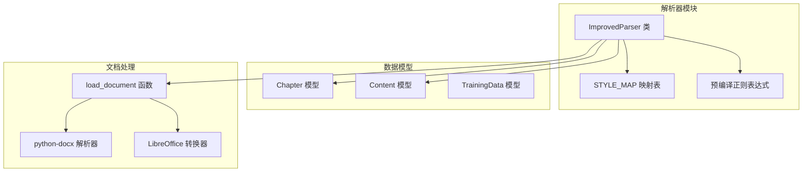
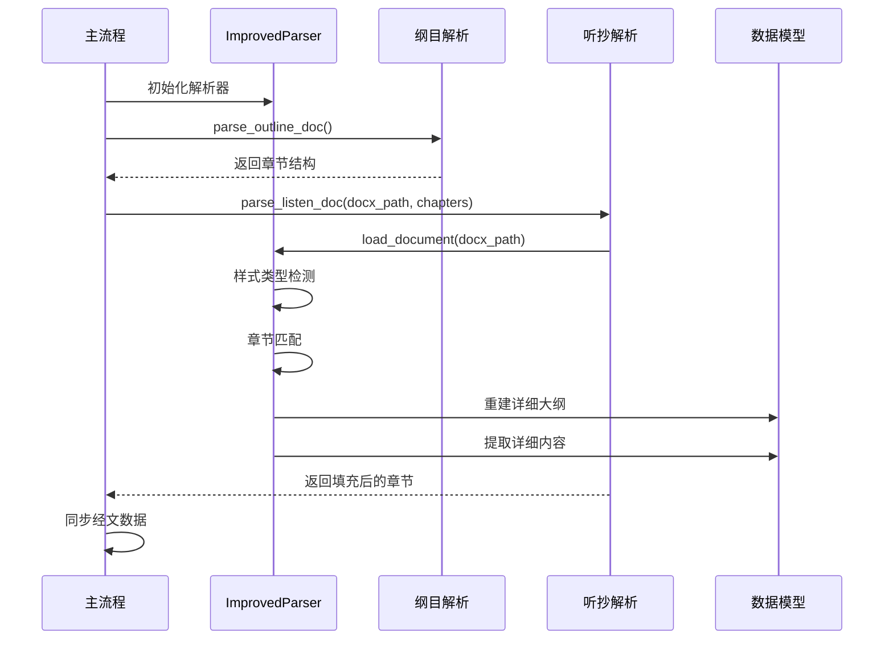
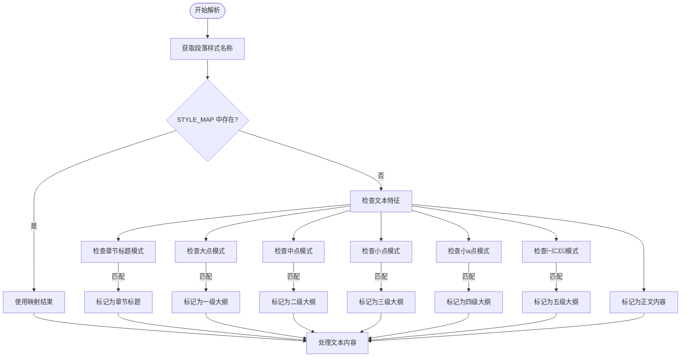
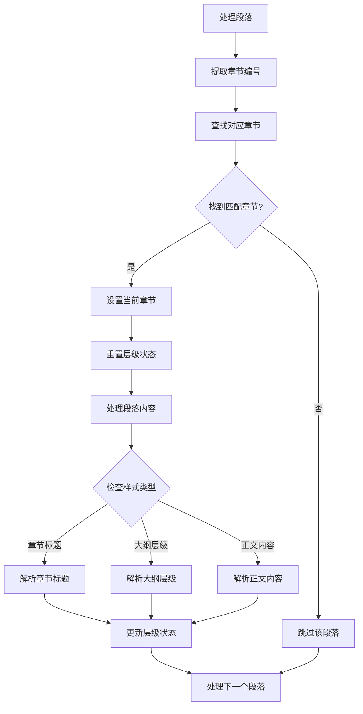
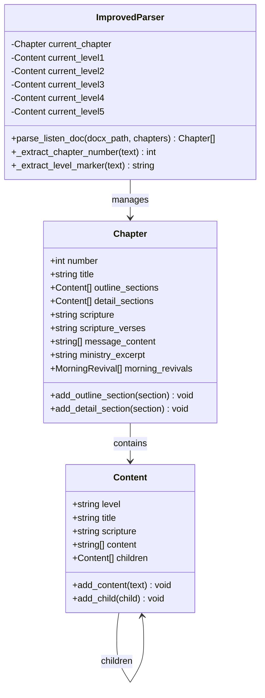
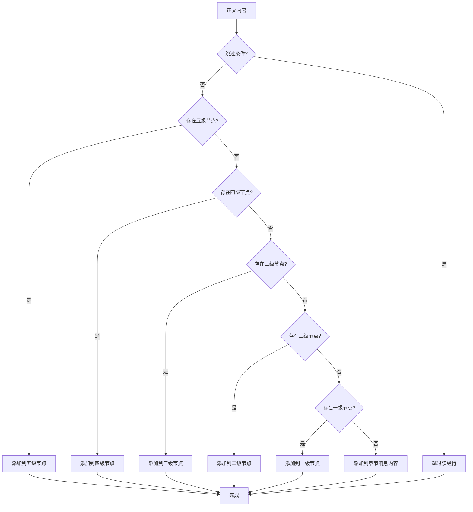
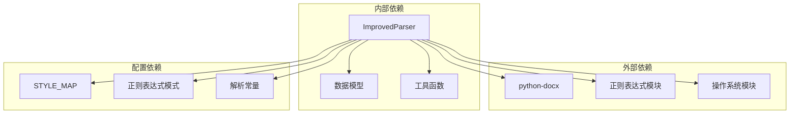

# 听抄文档解析方法

<cite>
**本文档引用的文件**
- [parser_improved.py](file://src/parser_improved.py)
- [models.py](file://src/models.py)
</cite>

## 目录
1. [简介](#简介)
2. [项目结构](#项目结构)
3. [核心组件](#核心组件)
4. [架构概览](#架构概览)
5. [详细组件分析](#详细组件分析)
6. [依赖分析](#依赖分析)
7. [性能考虑](#性能考虑)
8. [故障排除指南](#故障排除指南)
9. [结论](#结论)
10. [附录](#附录)

## 简介
本文档详细介绍了 `parse_listen_doc` 方法，这是改进版解析器中的关键组件，专门用于解析听抄文档并将其与现有的章节结构进行集成。该方法实现了复杂的文档解析流程，包括章节匹配、大纲结构重建和详细内容提取，并提供了强大的样式类型检测机制。

## 项目结构
改进版解析器位于 `src/parser_improved.py` 文件中，采用模块化设计，支持多种文档格式和解析策略：



**图表来源**
- [parser_improved.py:115-140](file://src/parser_improved.py#L115-L140)
- [parser_improved.py:16-113](file://src/parser_improved.py#L16-L113)
- [models.py:9-232](file://src/models.py#L9-L232)

**章节来源**
- [parser_improved.py:115-140](file://src/parser_improved.py#L115-L140)
- [parser_improved.py:16-113](file://src/parser_improved.py#L16-L113)
- [models.py:9-232](file://src/models.py#L9-L232)

## 核心组件
`parse_listen_doc` 方法是改进版解析器的核心功能，它实现了以下关键特性：

### 主要参数
- **docx_path**: 听抄文档的路径，支持 `.docx` 和 `.doc` 格式
- **chapters**: 现有的章节列表，包含纲目结构和基础信息

### 核心功能
1. **样式类型检测**: 通过 `STYLE_MAP` 进行样式名称映射
2. **文本特征判断**: 当样式映射失败时，通过正则表达式进行智能识别
3. **章节匹配**: 自动识别章节标题并匹配到对应的章节对象
4. **大纲重建**: 重建详细的层次化大纲结构
5. **内容提取**: 提取详细的内容段落并正确分配到相应层级

**章节来源**
- [parser_improved.py:784-945](file://src/parser_improved.py#L784-L945)

## 架构概览
`parse_listen_doc` 方法在整个解析流程中扮演着承上启下的关键角色：



**图表来源**
- [parser_improved.py:2614-2631](file://src/parser_improved.py#L2614-L2631)
- [parser_improved.py:784-945](file://src/parser_improved.py#L784-L945)

## 详细组件分析

### 样式类型检测机制
`parse_listen_doc` 方法实现了双重检测机制来确定文本的样式类型：

#### STYLE_MAP 映射表


**图表来源**
- [parser_improved.py:806-824](file://src/parser_improved.py#L806-L824)
- [parser_improved.py:118-135](file://src/parser_improved.py#L118-L135)

#### 文本特征判断规则
当样式映射失败时，方法会通过以下正则表达式进行智能识别：

| 样式类型 | 匹配模式 | 示例 |
|---------|---------|------|
| 章节标题 | `^第[一二三四五六七八九十]+篇` | "第十五篇" |
| 一级大纲 | `^[壹贰叁肆伍陆柒捌玖拾]+[、\s]` | "壹、" |
| 二级大纲 | `^[一二三四五六七八九十]+[、\s]` | "一、" |
| 三级大纲 | `^\d+[、\s]` | "1、" |
| 四级大纲 | `^[a-z][、\s]` | "a、" |
| 五级大纲 | `[^\u3220-\u3229㈠㈡㈢㈣㈤㈥㈦㈧㈨㈩]` | "㈠" |
| 正文内容 | 默认匹配 | 其他所有内容 |

**章节来源**
- [parser_improved.py:806-824](file://src/parser_improved.py#L806-L824)
- [parser_improved.py:118-135](file://src/parser_improved.py#L118-L135)

### 章节匹配与集成
`parse_listen_doc` 方法实现了智能的章节匹配机制：



**图表来源**
- [parser_improved.py:826-841](file://src/parser_improved.py#L826-L841)
- [parser_improved.py:843-944](file://src/parser_improved.py#L843-L944)

### 大纲结构重建
方法实现了多层次的大纲结构重建，支持跨页续接处理：

#### 层级结构管理


**图表来源**
- [models.py:9-63](file://src/models.py#L9-L63)
- [models.py:40-63](file://src/models.py#L40-L63)
- [parser_improved.py:285-293](file://src/parser_improved.py#L285-L293)

#### 跨页续接处理
方法特别处理了跨页续接的情况，确保大纲结构的完整性：

| 继续类型 | 处理逻辑 | 结果 |
|---------|---------|------|
| 章节标题续接 | 检查标题末尾标点符号 | 合并到现有标题 |
| 大点续接 | 检查是否已有内容/子节 | 创建新节点或合并 |
| 中点续接 | 检查是否已有内容/子节 | 创建新节点或合并 |
| 小点续接 | 检查是否已有内容/子节 | 创建新节点或合并 |

**章节来源**
- [parser_improved.py:847-867](file://src/parser_improved.py#L847-L867)
- [parser_improved.py:872-890](file://src/parser_improved.py#L872-L890)
- [parser_improved.py:895-911](file://src/parser_improved.py#L895-L911)

### 详细内容提取策略
正文内容的提取遵循严格的层级分配规则：



**图表来源**
- [parser_improved.py:926-944](file://src/parser_improved.py#L926-L944)

**章节来源**
- [parser_improved.py:926-944](file://src/parser_improved.py#L926-L944)

## 依赖分析
`parse_listen_doc` 方法依赖于多个核心组件：



**图表来源**
- [parser_improved.py:5-13](file://src/parser_improved.py#L5-L13)
- [parser_improved.py:118-135](file://src/parser_improved.py#L118-L135)

### 关键依赖关系
1. **python-docx**: 用于加载和解析 `.docx` 文档
2. **正则表达式模块**: 提供样式识别和内容提取功能
3. **数据模型**: 提供章节和内容结构的数据定义
4. **样式映射表**: 实现样式名称到逻辑类型的转换

**章节来源**
- [parser_improved.py:5-13](file://src/parser_improved.py#L5-L13)
- [parser_improved.py:118-135](file://src/parser_improved.py#L118-L135)

## 性能考虑
`parse_listen_doc` 方法在设计时充分考虑了性能优化：

### 时间复杂度
- **整体复杂度**: O(n)，其中 n 是文档段落数量
- **样式检测**: O(1)，固定数量的样式映射和正则表达式检查
- **章节匹配**: O(m)，其中 m 是现有章节数量

### 空间复杂度
- **内存使用**: O(k)，其中 k 是解析过程中创建的内容节点数量
- **缓存机制**: 使用 `verse_cache` 缓存已出现的经文范围内容

### 优化策略
1. **预编译正则表达式**: 所有正则表达式在类初始化时预编译
2. **样式映射缓存**: 使用字典映射减少重复检查
3. **增量处理**: 逐段处理，避免一次性加载整个文档

## 故障排除指南
### 常见问题及解决方案

#### 文档格式问题
**问题**: `.doc` 文件无法解析
**解决方案**: 
- 安装 LibreOffice 进行自动转换
- 手动将 `.doc` 文件另存为 `.docx` 格式
- 检查文件权限和路径有效性

#### 样式识别失败
**问题**: 文本被错误识别为正文而非大纲
**解决方案**:
- 检查文档样式设置是否正确
- 验证 `STYLE_MAP` 中是否存在对应样式名称
- 确认段落格式符合预期模式

#### 章节匹配错误
**问题**: 听抄内容没有正确填充到对应章节
**解决方案**:
- 检查章节标题格式是否包含标准的"第X篇"标识
- 确认现有章节列表中的编号与听抄文档一致
- 验证 `_extract_chapter_number` 方法的识别逻辑

**章节来源**
- [parser_improved.py:16-113](file://src/parser_improved.py#L16-L113)
- [parser_improved.py:958-975](file://src/parser_improved.py#L958-L975)

## 结论
`parse_listen_doc` 方法是一个高度优化的文档解析组件，它成功地实现了听抄文档与现有章节结构的无缝集成。通过双重样式检测机制、智能的章节匹配算法和完善的跨页续接处理，该方法能够准确地重建详细的层次化大纲结构，并提取高质量的正文内容。

该方法的设计体现了以下优势：
1. **灵活性**: 支持多种文档格式和解析策略
2. **准确性**: 通过多重验证确保解析结果的正确性
3. **性能**: 优化的时间和空间复杂度保证了高效的处理能力
4. **可维护性**: 清晰的代码结构和完善的注释便于后续维护

## 附录

### 使用示例
```python
# 基本使用方式
parser = ImprovedParser()
chapters = parser.parse_outline_doc("outline.docx")
parser.parse_listen_doc("listen.docx", chapters)
```

### 参数说明
- **docx_path**: 听抄文档的完整路径
- **chapters**: 已解析的章节列表，包含纲目结构

### 注意事项
1. 确保输入的 `chapters` 参数已经正确初始化
2. 文档样式应保持一致性以获得最佳解析效果
3. 大型文档解析可能需要较长时间，请耐心等待
4. 如遇解析问题，建议检查文档格式和样式设置