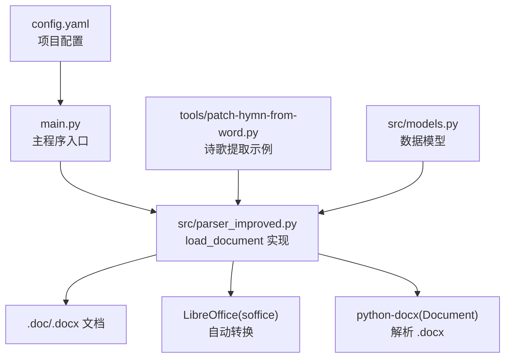
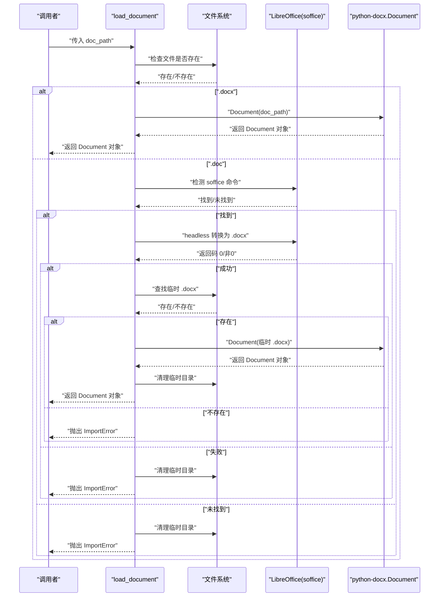
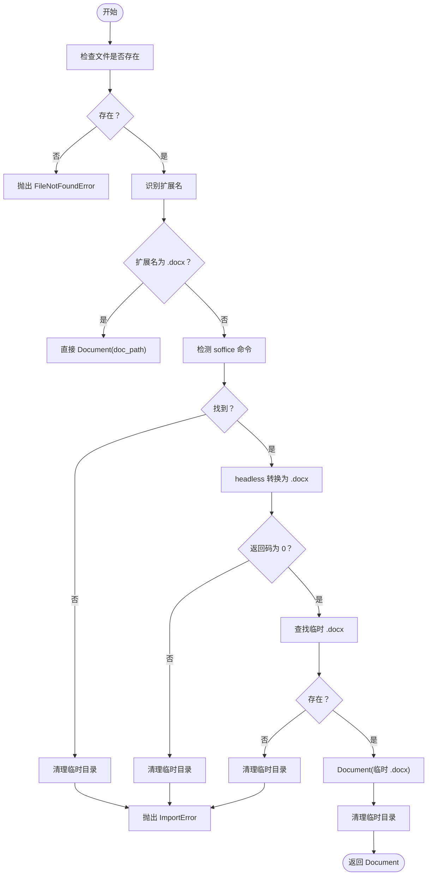
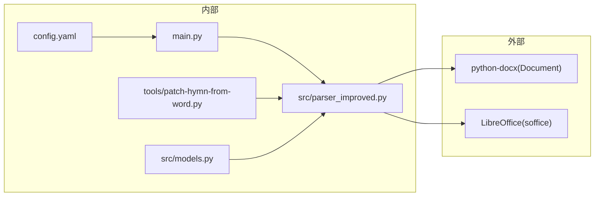

# 文档加载方法

<cite>
**本文引用的文件**
- [src/parser_improved.py](file://src/parser_improved.py)
- [main.py](file://main.py)
- [tools/patch-hymn-from-word.py](file://tools/patch-hymn-from-word.py)
- [src/models.py](file://src/models.py)
- [config.yaml](file://config.yaml)
</cite>

## 目录
1. [简介](#简介)
2. [项目结构](#项目结构)
3. [核心组件](#核心组件)
4. [架构概览](#架构概览)
5. [详细组件分析](#详细组件分析)
6. [依赖关系分析](#依赖关系分析)
7. [性能考量](#性能考量)
8. [故障排除指南](#故障排除指南)
9. [结论](#结论)
10. [附录](#附录)

## 简介
本文档围绕 load_document 函数提供全面的 API 文档，涵盖其参数、返回值、支持的文件格式（.doc 与 .docx）、LibreOffice 自动转换机制（跨平台命令检测、临时文件管理、错误处理）、使用示例（手动转换与自动转换）、错误处理策略（文件不存在、格式不支持、转换失败）以及性能考量与最佳实践。

## 项目结构
与 load_document 直接相关的核心文件与职责如下：
- src/parser_improved.py：实现 load_document 函数与文档解析器，包含 .doc/.docx 的加载与转换逻辑。
- main.py：主程序入口，展示如何在实际流程中使用 load_document（通过 parse_training_docs_improved 调用）。
- tools/patch-hymn-from-word.py：演示如何从 Word 文档提取诗歌内容与图片，间接体现 load_document 的使用场景。
- src/models.py：定义文档解析结果的数据模型（如 Chapter、TrainingData 等），用于理解返回值的结构化表示。
- config.yaml：项目配置文件，用于控制输出目录、模板目录等全局参数。

图表来源
- [src/parser_improved.py:16-112](file://src/parser_improved.py#L16-L112)
- [main.py:489-500](file://main.py#L489-L500)
- [tools/patch-hymn-from-word.py:84-87](file://tools/patch-hymn-from-word.py#L84-L87)
- [src/models.py:40-99](file://src/models.py#L40-L99)
- [config.yaml:10-13](file://config.yaml#L10-L13)

章节来源
- [src/parser_improved.py:16-112](file://src/parser_improved.py#L16-L112)
- [main.py:489-500](file://main.py#L489-L500)
- [tools/patch-hymn-from-word.py:84-87](file://tools/patch-hymn-from-word.py#L84-L87)
- [src/models.py:40-99](file://src/models.py#L40-L99)
- [config.yaml:10-13](file://config.yaml#L10-L13)

## 核心组件
- 函数签名与用途
  - 函数名：load_document
  - 参数：doc_path（str）——文档绝对或相对路径
  - 返回值：Document 对象（来自 python-docx）
  - 功能：根据扩展名自动识别 .docx 或 .doc，并对 .doc 触发 LibreOffice 自动转换为 .docx 后再解析

- 支持的文件格式
  - .docx：直接使用 python-docx 解析
  - .doc：通过 LibreOffice headless 转换为 .docx 后解析

- 错误处理
  - 文件不存在：抛出 FileNotFoundError
  - 不支持的扩展名：抛出 ValueError
  - LibreOffice 转换失败：抛出 ImportError（并打印友好提示）
  - 转换超时：捕获 TimeoutExpired 并抛出异常

章节来源
- [src/parser_improved.py:16-112](file://src/parser_improved.py#L16-L112)

## 架构概览
load_document 的工作流分为两条主线：
- .docx 直接解析：调用 python-docx.Document
- .doc 自动转换：检测 LibreOffice 命令 → headless 转换 → 生成临时 .docx → 解析 → 清理临时文件

图表来源
- [src/parser_improved.py:26-112](file://src/parser_improved.py#L26-L112)

## 详细组件分析

### load_document 函数 API 文档
- 函数原型
  - 名称：load_document
  - 参数
    - doc_path: str —— 文档路径（.doc 或 .docx）
  - 返回值
    - Document 对象（python-docx）
  - 异常
    - FileNotFoundError：文件不存在
    - ValueError：扩展名不支持
    - ImportError：LibreOffice 未安装或转换失败
    - Exception：其他解析失败或超时

- 处理逻辑
  - 文件存在性校验
  - 扩展名识别（.docx/.doc）
  - .docx：直接 Document(doc_path)
  - .doc：创建临时目录 → 检测 soffice 命令 → headless 转换 → 校验临时 .docx → Document(...) → 清理临时目录

- 使用示例
  - 手动转换（推荐快速场景）
    - 在 Microsoft Word 或 WPS 中打开 .doc，另存为 .docx，然后调用 load_document
  - 自动转换（推荐自动化场景）
    - 确保系统已安装 LibreOffice，确保 soffice 命令可在 PATH 或指定路径中找到，然后调用 load_document

- 错误处理策略
  - 文件不存在：立即抛出 FileNotFoundError
  - 不支持的扩展名：抛出 ValueError
  - LibreOffice 未找到或转换失败：打印友好提示并抛出 ImportError
  - 转换超时：捕获 TimeoutExpired 并抛出异常

章节来源
- [src/parser_improved.py:16-112](file://src/parser_improved.py#L16-L112)

### LibreOffice 自动转换机制详解
- 跨平台命令检测
  - Linux/Mac：优先检测 soffice、libreoffice
  - Windows：检测常见安装路径（含 x86）
  - 使用 shutil.which 与 os.path.exists 双重保障

- 临时文件管理
  - 使用 tempfile.mkdtemp 创建临时目录
  - 转换完成后删除临时目录（shutil.rmtree 忽略错误）

- 转换参数与超时
  - 使用 --headless、--convert-to docx、--outdir 指定输出目录
  - 设置超时时间（不同场景超时阈值不同）

- 错误处理
  - 返回码非 0：清理临时目录并抛出 ImportError
  - 临时 .docx 不存在：清理临时目录并抛出 ImportError
  - 超时：抛出异常并提示

图表来源
- [src/parser_improved.py:38-112](file://src/parser_improved.py#L38-L112)

章节来源
- [src/parser_improved.py:38-112](file://src/parser_improved.py#L38-L112)

### 数据模型与返回值
- 返回值类型：Document（python-docx）对象
- 结合解析器使用时，通常会进一步转换为内部模型（如 Chapter、TrainingData），用于后续生成静态站点或 JSON

章节来源
- [src/models.py:40-99](file://src/models.py#L40-L99)

### 使用示例

#### 场景一：手动转换（最快）
- 步骤
  - 在 Word 中打开 .doc 文件
  - 另存为 .docx
  - 调用 load_document(doc_path)
- 适用：文件数量较少、追求速度

章节来源
- [src/parser_improved.py:88-91](file://src/parser_improved.py#L88-L91)

#### 场景二：自动转换（自动化）
- 步骤
  - 确保系统安装 LibreOffice
  - 确保 soffice 命令可被检测到
  - 调用 load_document(doc_path)
- 适用：批量处理、CI/CD 流水线

章节来源
- [src/parser_improved.py:46-57](file://src/parser_improved.py#L46-L57)
- [src/parser_improved.py:62-66](file://src/parser_improved.py#L62-L66)

#### 场景三：在主流程中使用
- 主程序通过 parse_training_docs_improved 调用 load_document，从而解析经文、听抄与晨兴文档
- 示例调用链
  - parse_training_docs_improved(..., outline_path, listen_path, ...)
  - parse_outline_doc(...) 内部调用 load_document(...)
  - parse_morning_revival_doc(...) 内部调用 load_document(...)（用于 .doc 的图片提取）

章节来源
- [main.py:489-500](file://main.py#L489-L500)
- [src/parser_improved.py:372-372](file://src/parser_improved.py#L372-L372)
- [src/parser_improved.py:1011-1011](file://src/parser_improved.py#L1011-L1011)

## 依赖关系分析
- 外部依赖
  - python-docx：解析 .docx
  - LibreOffice：将 .doc 转换为 .docx
- 内部依赖
  - src/parser_improved.py：提供 load_document 与解析器
  - tools/patch-hymn-from-word.py：演示从 Word 文档提取诗歌内容与图片
  - src/models.py：定义数据模型
  - config.yaml：提供输出目录等配置

图表来源
- [src/parser_improved.py:10-13](file://src/parser_improved.py#L10-L13)
- [main.py:14-16](file://main.py#L14-L16)
- [tools/patch-hymn-from-word.py:24-25](file://tools/patch-hymn-from-word.py#L24-L25)
- [src/models.py:5-12](file://src/models.py#L5-L12)
- [config.yaml:10-13](file://config.yaml#L10-L13)

章节来源
- [src/parser_improved.py:10-13](file://src/parser_improved.py#L10-L13)
- [main.py:14-16](file://main.py#L14-L16)
- [tools/patch-hymn-from-word.py:24-25](file://tools/patch-hymn-from-word.py#L24-L25)
- [src/models.py:5-12](file://src/models.py#L5-L12)
- [config.yaml:10-13](file://config.yaml#L10-L13)

## 性能考量
- .docx 直接解析：速度快，无外部进程开销
- .doc 自动转换：涉及外部进程启动、文件 IO 与内存占用，建议：
  - 仅在必要时启用自动转换
  - 控制并发数量，避免同时大量调用 LibreOffice
  - 优化临时文件清理，减少磁盘压力
  - 在 CI 环境中预装 LibreOffice，缩短首次转换耗时

## 故障排除指南
- 文件不存在
  - 现象：抛出 FileNotFoundError
  - 排查：确认路径正确、权限允许
- 不支持的文件格式
  - 现象：抛出 ValueError
  - 排查：确保扩展名为 .doc 或 .docx
- LibreOffice 未安装或命令不可用
  - 现象：抛出 ImportError，并打印友好提示
  - 排查：安装 LibreOffice，确保 soffice 在 PATH 或使用 Windows 常见安装路径
- 转换超时
  - 现象：抛出异常（超时）
  - 排查：增大超时阈值、检查系统资源、减少并发
- 转换失败（返回码非 0）
  - 现象：抛出 ImportError
  - 排查：检查 LibreOffice 日志、确认输入 .doc 有效

章节来源
- [src/parser_improved.py:26-112](file://src/parser_improved.py#L26-L112)
- [src/parser_improved.py:84-103](file://src/parser_improved.py#L84-L103)

## 结论
load_document 提供了对 .doc/.docx 的统一加载接口，通过自动检测与 headless 转换实现跨平台兼容。结合 python-docx 的高效解析能力，可满足从 Word 文档到静态站点生成的完整需求。建议在生产环境中优先采用手动转换以获得更快响应，在自动化流水线中启用自动转换并做好超时与并发控制。

## 附录
- 相关实现参考
  - load_document：[src/parser_improved.py:16-112](file://src/parser_improved.py#L16-L112)
  - 主流程调用：[main.py:489-500](file://main.py#L489-L500)
  - 诗歌提取示例：[tools/patch-hymn-from-word.py:84-87](file://tools/patch-hymn-from-word.py#L84-L87)
  - 数据模型：[src/models.py:40-99](file://src/models.py#L40-L99)
  - 项目配置：[config.yaml:10-13](file://config.yaml#L10-L13)