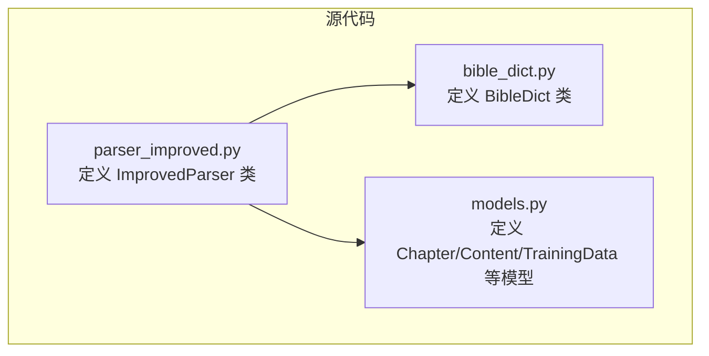
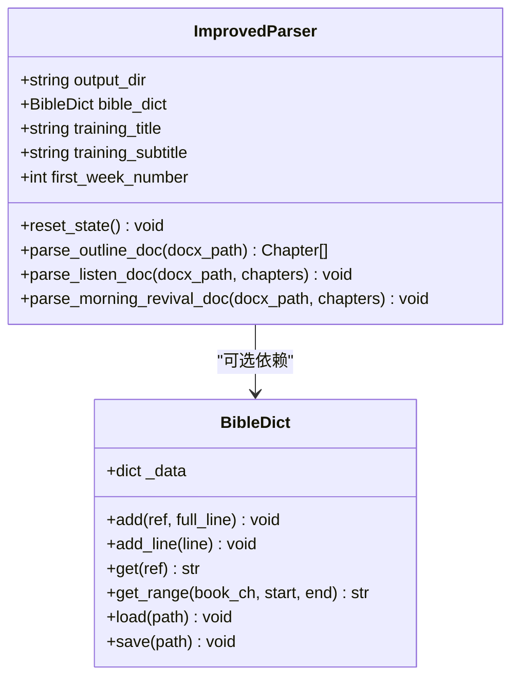
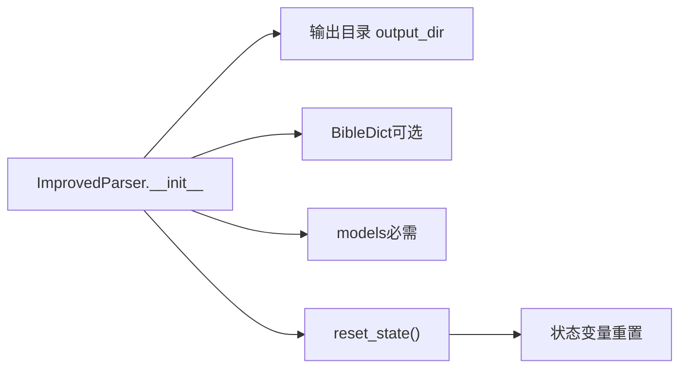

# 构造函数和初始化

<cite>
**本文引用的文件**
- [parser_improved.py](file://src/parser_improved.py)
- [bible_dict.py](file://src/bible_dict.py)
- [models.py](file://src/models.py)
</cite>

## 目录
1. [简介](#简介)
2. [项目结构](#项目结构)
3. [核心组件](#核心组件)
4. [架构概览](#架构概览)
5. [详细组件分析](#详细组件分析)
6. [依赖分析](#依赖分析)
7. [性能考量](#性能考量)
8. [故障排查指南](#故障排查指南)
9. [结论](#结论)

## 简介
本文聚焦于 ImprovedParser 类的构造函数 __init__，系统性地阐述其参数、默认值、初始化过程、状态重置机制、与 BibleDict 的集成关系，以及最佳实践与使用示例。目标是帮助读者快速理解如何正确实例化与使用该解析器，并掌握其内部状态管理与持久化经文字典的协作方式。

## 项目结构
本项目围绕“训练文档解析”展开，核心位于 src/parser_improved.py，其中定义了 ImprovedParser 类；经文持久化能力来自 src/bible_dict.py 的 BibleDict 类；训练数据模型来自 src/models.py。构造函数与初始化逻辑主要集中在 parser_improved.py 中。

图表来源
- [parser_improved.py:115-284](file://src/parser_improved.py#L115-L284)
- [bible_dict.py:19-96](file://src/bible_dict.py#L19-L96)
- [models.py](file://src/models.py)

章节来源
- [parser_improved.py:115-284](file://src/parser_improved.py#L115-L284)
- [bible_dict.py:19-96](file://src/bible_dict.py#L19-L96)
- [models.py](file://src/models.py)

## 核心组件
- ImprovedParser.__init__: 初始化输出目录、外部经文字典引用、标题字段、周序号记录，并调用 reset_state 完成状态重置。
- reset_state: 重置解析过程中的层级指针、当前章节与各级节点、经文缓存等状态，确保每次解析前处于干净状态。
- BibleDict: 提供经文的增删查与持久化能力，支持增量加载与保存，与 ImprovedParser 的经文缓存形成互补。

章节来源
- [parser_improved.py:277-284](file://src/parser_improved.py#L277-L284)
- [parser_improved.py:285-294](file://src/parser_improved.py#L285-L294)
- [bible_dict.py:19-96](file://src/bible_dict.py#L19-L96)

## 架构概览
ImprovedParser 与 BibleDict 的关系如下：
- 构造函数允许传入可选的 BibleDict 实例，作为跨文档/跨训练的经文持久化容器。
- 在解析过程中，ImprovedParser 会将解析到的经文行写入内部缓存，并同步写入外部 BibleDict（若存在）。
- 后处理阶段，ImprovedParser 可从 BibleDict 补录缺失的经文范围，提升解析完整性。

图表来源
- [parser_improved.py:115-284](file://src/parser_improved.py#L115-L284)
- [parser_improved.py:285-294](file://src/parser_improved.py#L285-L294)
- [bible_dict.py:19-96](file://src/bible_dict.py#L19-L96)

## 详细组件分析

### 构造函数 __init__ 参数与默认值
- output_dir: 类型为字符串，默认值为 "output"。作用是设置解析结果的输出根目录，影响图片导出、训练数据序列化等后续流程。
- bible_dict: 类型为 BibleDict，可选参数。若传入外部实例，解析器会将其作为经文持久化容器，实现跨文档/跨训练的经文累积与补录。

初始化过程要点
- 设置实例属性：output_dir、bible_dict、training_title、training_subtitle、first_week_number。
- 调用 reset_state，确保解析前的内部状态处于初始态。

章节来源
- [parser_improved.py:277-284](file://src/parser_improved.py#L277-L284)

### reset_state 方法：状态重置与调用时机
reset_state 的职责
- 重置当前章节与各级节点指针：current_chapter、current_level1、current_level2、current_level3、current_level4、current_level5。
- 清空经文缓存：verse_cache。
- 保证解析器在不同文档或多次解析之间保持独立、干净的状态。

调用时机
- 构造函数结束后立即调用，确保实例化即处于可用状态。
- 在 parse_outline_doc、parse_listen_doc 等解析入口处也会显式调用 reset_state，避免上次解析状态污染本次解析。

章节来源
- [parser_improved.py:285-294](file://src/parser_improved.py#L285-L294)
- [parser_improved.py:374](file://src/parser_improved.py#L374)
- [parser_improved.py:796](file://src/parser_improved.py#L796)

### 状态变量含义与用途
- current_chapter: 当前解析到的章节对象，承载大纲、经文、晨兴等内容。
- current_level1/2/3/4/5: 当前解析到的各级大纲节点，用于构建层次化的纲目结构。
- verse_cache: 本地缓存，存放当前解析会话中已出现的经文行，便于快速查询与跨范围补录。
- training_title/training_subtitle: 从纲目文档中提取的训练主标题与副标题，用于最终训练数据对象的组装。
- first_week_number: 记录第一个晨兴文档的起始周数，用于后续图片提取与周数偏移计算。

章节来源
- [parser_improved.py:285-294](file://src/parser_improved.py#L285-L294)
- [parser_improved.py:367-782](file://src/parser_improved.py#L367-L782)
- [parser_improved.py:2000-2004](file://src/parser_improved.py#L2000-L2004)

### 与 BibleDict 的集成与协作
- 写入路径：解析到经文行时，同时写入本地缓存与外部 BibleDict（若存在），避免重复覆盖已有条目。
- 读取路径：解析过程中，若本地缓存未命中，会回退到外部 BibleDict 查询；后处理阶段也可从 BibleDict 补录缺失范围。
- 持久化：BibleDict 支持从 JSON 文件增量加载与保存，便于长期累积。

章节来源
- [parser_improved.py:347-365](file://src/parser_improved.py#L347-L365)
- [parser_improved.py:771-777](file://src/parser_improved.py#L771-L777)
- [bible_dict.py:65-86](file://src/bible_dict.py#L65-L86)

### 使用示例与最佳实践
- 最简用法：直接传入输出目录，不传入 BibleDict，适合一次性解析场景。
- 多次解析：传入同一个 BibleDict 实例，实现跨文档/跨训练的经文累积与补录。
- 输出目录：建议根据训练批次或年份设置不同的 output_dir，便于组织产物。
- 解析流程：遵循“纲目 → 听抄 → 晨兴”的顺序，每次解析前调用 reset_state，确保状态隔离。

章节来源
- [parser_improved.py:2592-2614](file://src/parser_improved.py#L2592-L2614)

## 依赖分析
- ImprovedParser 依赖 BibleDict（可选）与 models（必需）。
- 解析流程中，BibleDict 主要用于经文的持久化与补录，提升解析鲁棒性。
- 输出目录 output_dir 影响图片导出与训练数据序列化路径。

图表来源
- [parser_improved.py:277-284](file://src/parser_improved.py#L277-L284)
- [parser_improved.py:285-294](file://src/parser_improved.py#L285-L294)
- [bible_dict.py:19-96](file://src/bible_dict.py#L19-L96)
- [models.py](file://src/models.py)

章节来源
- [parser_improved.py:277-294](file://src/parser_improved.py#L277-L294)
- [bible_dict.py:19-96](file://src/bible_dict.py#L19-L96)
- [models.py](file://src/models.py)

## 性能考量
- 经文缓存（verse_cache）减少重复解析成本，建议在大型训练文档中启用外部 BibleDict 以实现跨会话复用。
- 增量持久化（BibleDict.load/save）避免全量重建，适合长期维护经文字典。
- 输出目录与图片提取路径应尽量稳定，减少不必要的 IO 重定向。

## 故障排查指南
- 经文缺失：确认是否传入了有效的 BibleDict 实例，并检查其 load/save 流程是否成功。
- 状态污染：若多次解析出现交叉影响，检查是否遗漏调用 reset_state。
- 输出路径异常：核对 output_dir 是否存在写权限，以及图片导出目录 images 是否正确创建。

## 结论
ImprovedParser 的构造函数设计简洁而稳健：通过明确的参数与默认值、清晰的初始化步骤与状态重置，确保解析器在不同场景下的可靠性与可维护性。与 BibleDict 的可选集成进一步增强了跨文档/跨训练的经文一致性与持久化能力。遵循本文的最佳实践，可在保证性能的同时获得高质量的解析结果。