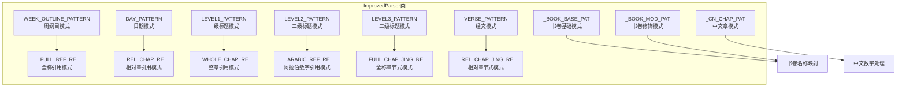
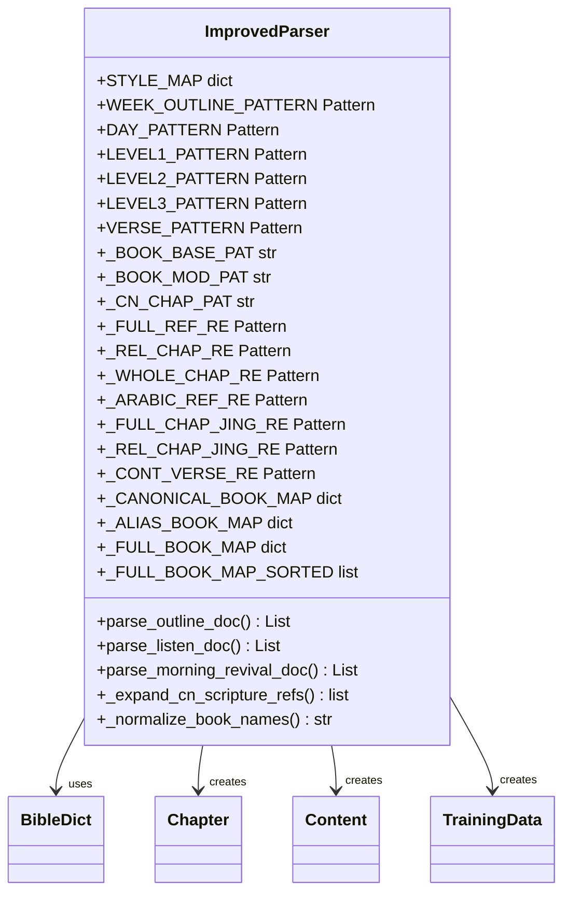
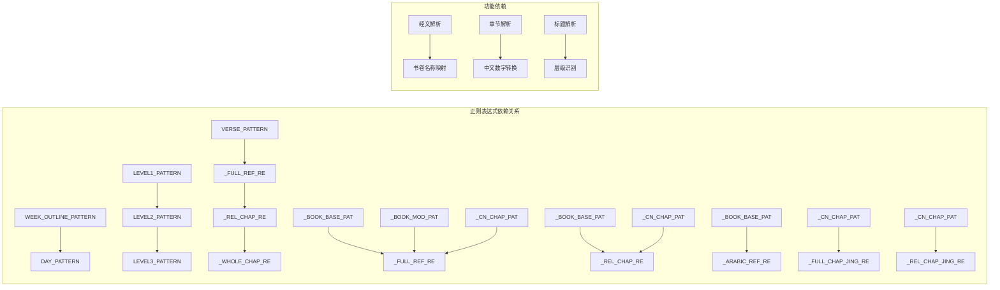

# 正则表达式模式

<cite>
**本文档引用的文件**
- [parser_improved.py](file://src/parser_improved.py)
</cite>

## 目录
1. [简介](#简介)
2. [项目结构](#项目结构)
3. [核心组件](#核心组件)
4. [架构概览](#架构概览)
5. [详细组件分析](#详细组件分析)
6. [依赖分析](#依赖分析)
7. [性能考虑](#性能考虑)
8. [故障排除指南](#故障排除指南)
9. [结论](#结论)

## 简介
本文档详细分析了ImprovedParser类中的正则表达式模式，涵盖了预编译的正则表达式、经文引用解析相关的正则表达式以及书卷名称映射相关的正则表达式。文档提供了每个正则表达式的用途、匹配规则、使用示例和测试用例，并说明了优化策略和性能考虑。

## 项目结构
ImprovedParser类位于src/parser_improved.py文件中，是一个专门用于解析圣经训练文档的改进解析器。该类包含了大量预编译的正则表达式来处理不同类型的文本模式。

**图表来源**
- [parser_improved.py:137-190](file://src/parser_improved.py#L137-L190)
- [parser_improved.py:148-185](file://src/parser_improved.py#L148-L185)
- [parser_improved.py:242-2454](file://src/parser_improved.py#L242-L2454)

**章节来源**
- [parser_improved.py:115-283](file://src/parser_improved.py#L115-L283)

## 核心组件
ImprovedParser类包含了大量的预编译正则表达式，这些模式用于识别和解析不同类型的文本内容。主要分为以下几类：

### 预编译的基础正则表达式
- **WEEK_OUTLINE_PATTERN**: 识别周纲目格式
- **DAY_PATTERN**: 识别日期格式
- **LEVEL1_PATTERN**: 识别一级标题格式
- **LEVEL2_PATTERN**: 识别二级标题格式
- **LEVEL3_PATTERN**: 识别三级标题格式
- **VERSE_PATTERN**: 识别经文格式

### 经文引用解析正则表达式
- **_FULL_REF_RE**: 全称引用解析（书卷+中文章+阿拉伯节）
- **_REL_CHAP_RE**: 相对章引用解析（仅中文章+阿拉伯节）
- **_WHOLE_CHAP_RE**: 整章引用解析（书卷+中文章）
- **_ARABIC_REF_RE**: 阿拉伯数字引用解析（书卷+阿拉伯章:节）
- **_FULL_CHAP_JING_RE**: 全称章节式解析（中文章+中文节）
- **_REL_CHAP_JING_RE**: 相对章节式解析（中文章+中文节）
- **_CONT_VERSE_RE**: 纯节续解析（阿拉伯节范围）

### 书卷名称映射正则表达式
- **_BOOK_BASE_PAT**: 书卷基础字符模式
- **_BOOK_MOD_PAT**: 书卷修饰字符模式
- **_CN_CHAP_PAT**: 中文章数字模式

**章节来源**
- [parser_improved.py:137-190](file://src/parser_improved.py#L137-L190)
- [parser_improved.py:148-185](file://src/parser_improved.py#L148-L185)
- [parser_improved.py:242-2454](file://src/parser_improved.py#L242-L2454)

## 架构概览
ImprovedParser类采用模块化设计，将不同的正则表达式功能分离到不同的类别中，便于维护和扩展。每个正则表达式都经过精心设计，以适应圣经训练文档的特殊格式要求。

**图表来源**
- [parser_improved.py:115-283](file://src/parser_improved.py#L115-L283)

## 详细组件分析

### 预编译的基础正则表达式

#### WEEK_OUTLINE_PATTERN
用途：识别周纲目格式，如"第X周 • 纲目"
匹配规则：
- 匹配以"第"开头的中文数字
- 可选的全角空格或普通空格
- 固定的"周"字符
- 可选的全角空格或普通空格
- 固定的"•"或"·"符号
- 固定的"纲目"文本

使用场景：
- 晨兴文档解析中的周标记识别
- 区分周纲目与其他文本内容

**章节来源**
- [parser_improved.py:138-139](file://src/parser_improved.py#L138-L139)

#### DAY_PATTERN
用途：识别日期格式，如"第X周 • 周Y"
匹配规则：
- 匹配以"第"开头的中文数字（周数）
- 可选的全角空格或普通空格
- 固定的"周"字符
- 可选的全角空格或普通空格
- 固定的"•"或"·"符号
- 固定的"周"字符
- 中文数字（星期几）

使用场景：
- 晨兴文档解析中的具体日期识别
- 区分不同星期的文本内容

**章节来源**
- [parser_improved.py:139-140](file://src/parser_improved.py#L139-L140)

#### LEVEL1_PATTERN
用途：识别一级标题格式，如"壹、内容"
匹配规则：
- 匹配中文数字（壹、贰、叁等）
- 可选的全角空格或普通空格
- 固定的标点符号（、）
- 标点符号后的任意内容

使用场景：
- 大纲结构解析
- 识别主要章节标题

**章节来源**
- [parser_improved.py:140-141](file://src/parser_improved.py#L140-L141)

#### LEVEL2_PATTERN
用途：识别二级标题格式，如"一、内容"
匹配规则：
- 匹配中文数字（一、二、三等）
- 可选的全角空格或普通空格
- 固定的标点符号（、）
- 标点符号后的任意内容

使用场景：
- 大纲结构解析
- 识别子章节标题

**章节来源**
- [parser_improved.py:141-142](file://src/parser_improved.py#L141-L142)

#### LEVEL3_PATTERN
用途：识别三级标题格式，如"1、内容"
匹配规则：
- 匹配阿拉伯数字
- 可选的全角空格或普通空格
- 固定的标点符号（、）
- 标点符号后的任意内容

使用场景：
- 大纲结构解析
- 识别细分子章节标题

**章节来源**
- [parser_improved.py:142-143](file://src/parser_improved.py#L142-L143)

#### VERSE_PATTERN
用途：识别经文格式，如"腓2:5 内容..."
匹配规则：
- 匹配书卷缩写（支持多种书卷）
- 可选的中文数字或阿拉伯数字
- 固定的":"符号
- 阿拉伯数字（节号）
- 可选的"上"、"中"、"下"修饰符
- 可选的全角空格或普通空格
- 标点符号后的任意内容

使用场景：
- 经文内容识别
- 缓存经文内容
- 区分经文与其他文本

**章节来源**
- [parser_improved.py:145-146](file://src/parser_improved.py#L145-L146)

### 经文引用解析正则表达式

#### _FULL_REF_RE
用途：全称引用解析（书卷+中文章+阿拉伯节）
匹配规则：
- 书卷名称（基础+可选修饰）
- 中文章数字
- 阿拉伯节数
- 可选的"上"、"中"、"下"修饰符
- 可选的"~"范围分隔符
- 可选的结束节号和修饰符

使用场景：
- 解析"腓四5~9"格式
- 处理经文范围引用
- 支持半节修饰符

**章节来源**
- [parser_improved.py:167-171](file://src/parser_improved.py#L167-L171)

#### _REL_CHAP_RE
用途：相对章引用解析（仅中文章+阿拉伯节）
匹配规则：
- 中文章数字
- 阿拉伯节数
- 可选的"上"、"中"、"下"修饰符
- 可选的"~"范围分隔符
- 可选的结束节号和修饰符

使用场景：
- 解析"一19~21上"格式
- 处理同书卷内的章节引用
- 与默认书卷结合使用

**章节来源**
- [parser_improved.py:173-176](file://src/parser_improved.py#L173-L176)

#### _WHOLE_CHAP_RE
用途：整章引用解析（书卷+中文章）
匹配规则：
- 书卷名称（基础+可选修饰）
- 中文章数字

使用场景：
- 解析"腓四"格式
- 处理整章引用
- 生成"章:0"格式的引用

**章节来源**
- [parser_improved.py:178-181](file://src/parser_improved.py#L178-L181)

#### _ARABIC_REF_RE
用途：阿拉伯数字引用解析（书卷+阿拉伯章:节）
匹配规则：
- 书卷名称（基础+可选修饰）
- 阿拉伯章号
- 固定的":"符号
- 阿拉伯节数
- 可选的"上"、"中"、"下"修饰符
- 可选的"~"范围分隔符
- 可选的结束节号和修饰符

使用场景：
- 解析"腓4:5~9"格式
- 处理标准的经文引用格式
- 与全称引用解析配合使用

**章节来源**
- [parser_improved.py:242-245](file://src/parser_improved.py#L242-L245)

#### _FULL_CHAP_JING_RE
用途：全称章节式解析（中文章+中文节）
匹配规则：
- 书卷名称（基础+可选修饰）
- 可选的"第"前缀
- 中文章数字
- "章"或"篇"后缀
- 可选的"的"前缀
- 中文节数（可选）
- 可选的"至到"范围分隔符
- 结束中文节数（可选）
- 可选的"节"后缀

使用场景：
- 解析"腓四章五节"格式
- 处理中文章节式引用
- 支持"篇"字用于诗篇

**章节来源**
- [parser_improved.py:247-252](file://src/parser_improved.py#L247-L252)

#### _REL_CHAP_JING_RE
用途：相对章节式解析（中文章+中文节）
匹配规则：
- 可选的"第"前缀
- 中文章数字
- "章"或"篇"后缀
- 可选的"的"前缀
- 中文节数（可选）
- 可选的"至到"范围分隔符
- 结束中文节数（可选）
- 可选的"节"后缀

使用场景：
- 解析"四章五节"格式
- 处理同书卷内的章节引用
- 与默认书卷结合使用

**章节来源**
- [parser_improved.py:254-258](file://src/parser_improved.py#L254-L258)

#### _CONT_VERSE_RE
用途：纯节续解析（阿拉伯节范围）
匹配规则：
- 阿拉伯节数
- 可选的"上"、"中"、"下"修饰符
- 可选的"节"后缀
- 可选的"~"范围分隔符
- 可选的结束阿拉伯节数和修饰符
- 可选的"节"后缀和修饰符

使用场景：
- 解析"11下~13"格式
- 处理同章内的节号范围
- 与默认书卷和章节结合使用

**章节来源**
- [parser_improved.py:187-189](file://src/parser_improved.py#L187-L189)

### 书卷名称映射正则表达式

#### _BOOK_BASE_PAT
用途：书卷基础字符模式
匹配规则：
- 匹配所有标准圣经书卷的起始字符
- 支持"创、出、利、民、申、书、士、得、撒、王、代、拉、尼、斯、伯、诗、箴、传、歌、赛、耶、哀、结、但、何、珥、摩、俄、拿、弥、鸿、哈、番、该、亚、玛、太、可、路、约、徒、罗、林、加、弗、腓、西、帖、多、提前、提后、门、来、雅、彼、约、犹、启"

使用场景：
- 作为其他书卷相关模式的基础
- 识别书卷名称的起始字符

**章节来源**
- [parser_improved.py:148-149](file://src/parser_improved.py#L148-L149)

#### _BOOK_MOD_PAT
用途：书卷修饰字符模式
匹配规则：
- 匹配书卷名称的修饰字符
- 支持"后、前、上、下、壹、贰、叁"
- 用于处理带有修饰的书卷名称

使用场景：
- 识别"后四书"、"前五书"等修饰书卷
- 处理特殊书卷名称格式

**章节来源**
- [parser_improved.py:149-149](file://src/parser_improved.py#L149-L149)

#### _CN_CHAP_PAT
用途：中文章数字模式
匹配规则：
- 支持复杂的中文数字组合
- 包括"一百五十"、"一百"、"二十"、"十"等
- 支持各种组合形式的中文数字
- 最大支持150章（符合圣经最大章数）

使用场景：
- 识别中文章节数字
- 处理各种中文数字格式
- 支持复杂的中文数字组合

**章节来源**
- [parser_improved.py:150-165](file://src/parser_improved.py#L150-L165)

### 使用示例和测试用例

#### 经文引用解析示例
以下是一些典型的经文引用格式及其对应的正则表达式匹配：

1. **阿拉伯数字格式**：
   - 输入："腓2:5~11"
   - 匹配：_ARABIC_REF_RE
   - 输出：["腓2:5", "腓2:6", "腓2:7", "腓2:8", "腓2:9", "腓2:10", "腓2:11"]

2. **全称中文格式**：
   - 输入："腓四5~9"
   - 匹配：_FULL_REF_RE
   - 输出：["腓4:5", "腓4:6", "腓4:7", "腓4:8", "腓4:9"]

3. **相对章格式**：
   - 输入："一19~21上"
   - 匹配：_REL_CHAP_RE
   - 输出：["腓1:19", "腓1:20", "腓1:21上"]

4. **整章格式**：
   - 输入："腓四"
   - 匹配：_WHOLE_CHAP_RE
   - 输出：["腓4:0"]

5. **中文章节式格式**：
   - 输入："腓四章五节"
   - 匹配：_FULL_CHAP_JING_RE
   - 输出：["腓4:5"]

6. **纯节续格式**：
   - 输入："11下~13"
   - 匹配：_CONT_VERSE_RE
   - 输出：["腓4:11下", "腓4:12", "腓4:13"]

#### 测试用例设计
为了确保正则表达式的正确性，建议设计以下测试用例：

1. **边界测试**：
   - 最大章数测试（150章）
   - 最大小节测试（999节）
   - 最长书卷名称测试

2. **格式测试**：
   - 各种标点符号测试（、，。；）
   - 各种空格字符测试（普通空格、全角空格、制表符）
   - 各种修饰符测试（上、中、下）

3. **错误输入测试**：
   - 无效的书卷名称
   - 超出范围的章数或节数
   - 格式不正确的引用

**章节来源**
- [parser_improved.py:2255-2454](file://src/parser_improved.py#L2255-L2454)

## 依赖分析

**图表来源**
- [parser_improved.py:137-190](file://src/parser_improved.py#L137-L190)
- [parser_improved.py:2172-2253](file://src/parser_improved.py#L2172-L2253)

### 组件耦合和内聚
ImprovedParser类中的正则表达式具有良好的内聚性，按照功能分类组织：
- **基础识别模式**：WEEK_OUTLINE_PATTERN、DAY_PATTERN、LEVEL系列模式
- **经文解析模式**：VERSE_PATTERN及相关引用解析模式
- **书卷映射模式**：_BOOK系列模式和_CN_CHAP_PAT

这些模式之间的耦合度较低，主要通过共享的基础模式（如_BOOK_BASE_PAT）实现关联。

**章节来源**
- [parser_improved.py:115-283](file://src/parser_improved.py#L115-L283)

## 性能考虑
ImprovedParser类中的正则表达式设计充分考虑了性能优化：

### 预编译优化
- 所有正则表达式都预先编译为Pattern对象
- 避免重复编译的开销
- 提高匹配效率

### 模式优化策略
1. **原子组优化**：使用`(?:...)`减少回溯
2. **字符类优化**：使用`[]`替代`|`
3. **量词优化**：合理使用`+`、`*`、`?`
4. **锚点优化**：使用`^`、`$`限制匹配范围

### 内存管理
- 预编译的Pattern对象在类级别定义，避免重复创建
- 使用`_FULL_BOOK_MAP_SORTED`进行一次性排序
- 缓存机制用于经文内容的快速访问

### 匹配策略优化
- 优先使用最具体的模式进行匹配
- 避免回溯过多的复杂模式
- 合理使用非贪婪匹配

**章节来源**
- [parser_improved.py:137-190](file://src/parser_improved.py#L137-L190)
- [parser_improved.py:235-238](file://src/parser_improved.py#L235-L238)

## 故障排除指南

### 常见问题和解决方案

#### 1. 匹配失败问题
**症状**：某些经文引用无法正确解析
**原因**：
- 格式不符合预期
- 标点符号不正确
- 空格字符不匹配

**解决方案**：
- 检查输入格式是否符合正则表达式定义
- 确认标点符号使用正确（、，。；）
- 验证空格字符类型（普通空格vs全角空格）

#### 2. 性能问题
**症状**：解析速度慢
**原因**：
- 正则表达式过于复杂
- 匹配次数过多
- 缓存未充分利用

**解决方案**：
- 优化正则表达式结构
- 减少不必要的匹配尝试
- 充分利用verse_cache缓存

#### 3. 编码问题
**症状**：中文字符匹配异常
**原因**：
- 字符编码不一致
- Unicode字符处理不当

**解决方案**：
- 确保输入文本使用UTF-8编码
- 验证中文字符的正确性
- 检查正则表达式中的Unicode范围

**章节来源**
- [parser_improved.py:300-366](file://src/parser_improved.py#L300-L366)
- [parser_improved.py:2092-2158](file://src/parser_improved.py#L2092-L2158)

## 结论
ImprovedParser类中的正则表达式设计体现了高度的专业性和实用性。通过精心设计的模式分类、预编译优化和性能考虑，这些正则表达式能够准确识别和解析圣经训练文档中的各种格式。文档提供了详细的模式说明、使用示例和测试用例，为开发者理解和使用这些正则表达式提供了全面的指导。

主要特点包括：
- **模块化设计**：按功能分类的正则表达式集合
- **性能优化**：预编译和优化的匹配策略
- **灵活性**：支持多种经文引用格式
- **可维护性**：清晰的模式结构和注释

这些正则表达式为圣经训练文档的自动化处理奠定了坚实的技术基础。