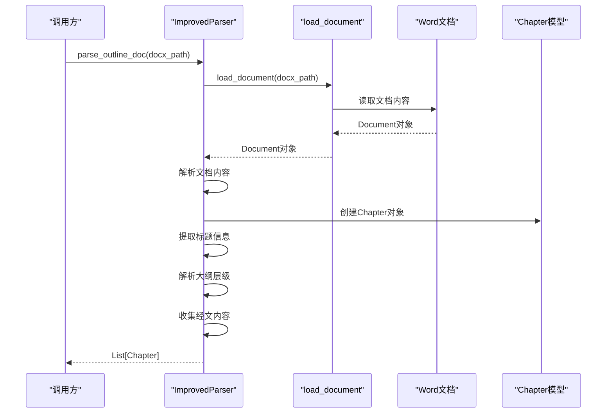
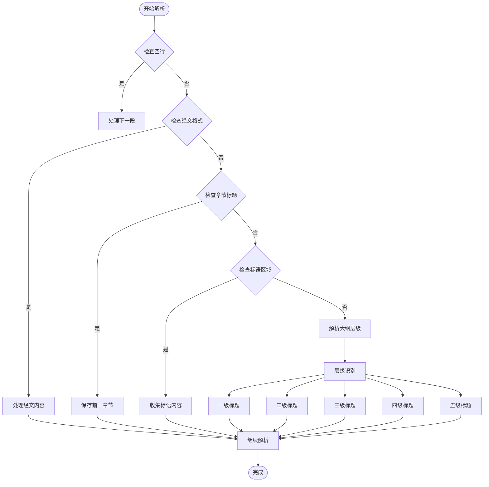
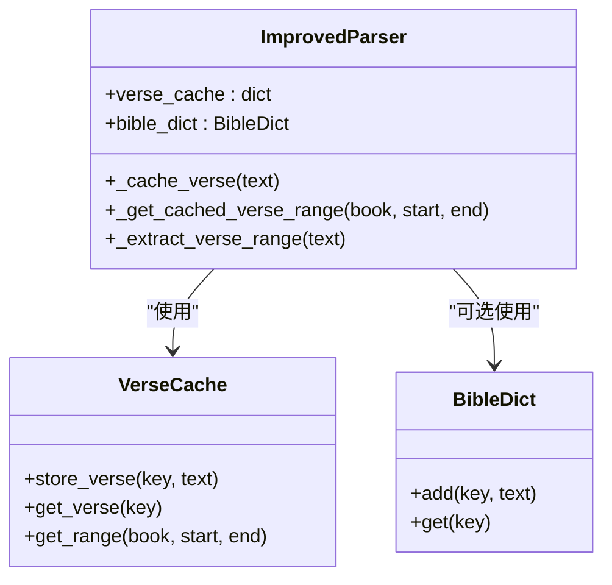
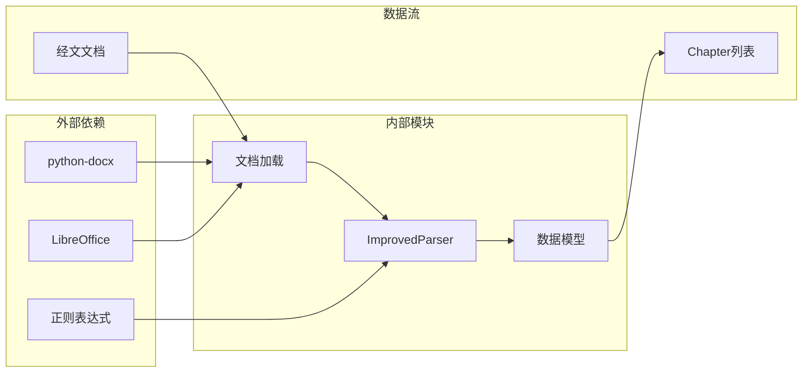

# 纲目文档解析方法

<cite>
**本文档引用的文件**
- [parser_improved.py](file://src/parser_improved.py)
- [models.py](file://src/models.py)
- [load_document:16-112](file://src/parser_improved.py#L16-L112)
- [parse_training_docs_improved:2592-2710](file://src/parser_improved.py#L2592-L2710)
</cite>

## 目录
1. [简介](#简介)
2. [项目结构](#项目结构)
3. [核心组件](#核心组件)
4. [架构概览](#架构概览)
5. [详细组件分析](#详细组件分析)
6. [依赖关系分析](#依赖关系分析)
7. [性能考虑](#性能考虑)
8. [故障排除指南](#故障排除指南)
9. [结论](#结论)

## 简介
本文档详细介绍了 `parse_outline_doc` 方法的API文档，该方法用于解析纲目文档（经文.docx/.doc），提取大纲结构和职事信息摘录。该方法是训练文档解析流程的核心组件，负责从Word文档中抽取结构化的纲目数据，并将其转换为内部的数据模型。

## 项目结构
该项目采用模块化设计，主要包含以下关键组件：
- **解析器模块**：包含 `ImprovedParser` 类和 `parse_outline_doc` 方法
- **数据模型模块**：定义了 `Chapter`、`Content`、`TrainingData` 等数据结构
- **文档加载模块**：提供 `.doc` 和 `.docx` 格式的统一加载接口

```mermaid
graph TB
subgraph "核心模块"
Parser[ImprovedParser<br/>解析器类]
Models[数据模型<br/>Chapter/Content/TrainingData]
Loader[文档加载<br/>load_document]
end
subgraph "输入输出"
Docx[经文.docx/.doc<br/>输入文档]
Output[List[Chapter]<br/>输出结果]
end
Docx --> Parser
Parser --> Loader
Parser --> Models
Models --> Output
Parser -.->|"样式映射"| StyleMap[STYLE_MAP]
Parser -.->|"正则表达式"| RegexPatterns[正则模式]
```

**图表来源**
- [parser_improved.py:115-135](file://src/parser_improved.py#L115-L135)
- [models.py:9-26](file://src/models.py#L9-L26)

## 核心组件

### parse_outline_doc 方法
`parse_outline_doc` 是一个静态方法，负责解析纲目文档并返回 `List[Chapter]` 结果。

**方法签名**
```python
def parse_outline_doc(self, docx_path: str) -> List[Chapter]:
```

**参数说明**
- `docx_path` (str): 经文文档的完整路径，支持 `.docx` 和 `.doc` 格式

**返回值**
- `List[Chapter]`: 章节对象列表，每个对象包含完整的纲目结构信息

**Section sources**
- [parser_improved.py:367-367](file://src/parser_improved.py#L367-L367)

## 架构概览



**图表来源**
- [parser_improved.py:367-782](file://src/parser_improved.py#L367-L782)
- [load_document:16-112](file://src/parser_improved.py#L16-L112)

## 详细组件分析

### 解析流程详解

#### 1. 文档加载阶段
方法首先调用 `load_document` 函数加载Word文档，支持自动格式转换：
- 直接支持 `.docx` 格式
- 通过LibreOffice转换支持 `.doc` 格式
- 自动检测和处理跨平台差异

#### 2. 标题提取阶段
系统会扫描文档开头部分（最多60段）来提取标题信息：
- **标语提取**：识别 "标语" 区域并提取相关内容
- **副标题识别**：支持多种格式的副标题识别
- **主标题组合**：从多个标题片段中组合出完整的训练标题

#### 3. 大纲解析阶段
系统通过多种方式识别和解析大纲层级：



**图表来源**
- [parser_improved.py:537-729](file://src/parser_improved.py#L537-L729)

#### 4. 样式映射机制
系统使用 `STYLE_MAP` 进行样式识别，支持不同训练类型的文档格式：

**样式映射表**
| Word样式 | 解析类型 | 描述 |
|---------|---------|------|
| `121文章篇题` | `chapter_title` | 章节标题（秋季训练） |
| `131文章大点` | `section_level1` | 一级大纲标题 |
| `132文章中点` | `section_level2` | 二级大纲标题 |
| `133文章小点` | `section_level3` | 三级大纲标题 |
| `134文章小a点` | `section_level4` | 四级大纲标题 |
| `8888文章正文` | `content` | 正文内容 |
| `０ａ總題` | `chapter_title` | 章节标题（夏季训练） |
| `職事信息大標` | `section_level1` | 一级大纲标题（夏季训练） |

**Section sources**
- [parser_improved.py:118-135](file://src/parser_improved.py#L118-L135)

#### 5. 正则表达式模式
系统使用预编译的正则表达式来识别各种文档元素：

**核心正则表达式**
- `WEEK_OUTLINE_PATTERN`: `^第([一二三四五六七八九十]+)周[　\s]*•[　\s]*纲目`
- `DAY_PATTERN`: `^第([一二三四五六七八九十]+)周[　\s]*•[　\s]*周([一二三四五六七])`
- `LEVEL1_PATTERN`: `^([壹贰叁肆伍陆柒捌玖拾])[　\s]+(.*)`
- `LEVEL2_PATTERN`: `^([一二三四五六七八九十百]+)[　\s]+(.*)`
- `LEVEL3_PATTERN`: `^(\d+)[　\s]+(.*)`
- `VERSE_PATTERN`: `^([创出利民申书士得撒王代拉尼斯伯诗箴传歌赛耶哀结但何珥摩俄拿弥鸿哈番该亚玛太可路约徒罗林加弗腓西帖提门多来雅彼约犹启](?:[一二三四五六七八九十后前上下壹贰叁]\d+|\d+):\d+[上中下]?)[　\s\t]+(.+)`

**Section sources**
- [parser_improved.py:138-145](file://src/parser_improved.py#L138-L145)

#### 6. 经文缓存机制
系统实现了智能的经文缓存机制来提高解析效率：



**图表来源**
- [parser_improved.py:293-365](file://src/parser_improved.py#L293-L365)

**Section sources**
- [parser_improved.py:338-365](file://src/parser_improved.py#L338-L365)

### 数据结构转换

#### Chapter 模型结构
解析结果转换为 `Chapter` 对象，包含以下关键属性：

| 属性名 | 类型 | 描述 |
|--------|------|------|
| `number` | int | 章节编号（1-9） |
| `title` | str | 章节标题 |
| `outline_sections` | List[Content] | 纲目结构（仅标题） |
| `detail_sections` | List[Content] | 详细内容（带段落） |
| `hymn_number` | str | 诗歌编号 |
| `hymn_images` | List[str] | 诗歌图片列表 |
| `scripture` | str | 经文引用（读经经文） |
| `scripture_verses` | str | 经文内容（经文正文） |
| `ministry_excerpt` | str | 职事信息摘录 |
| `morning_revivals` | List[MorningRevival] | 晨读内容 |

**Section sources**
- [models.py:40-54](file://src/models.py#L40-L54)

## 依赖关系分析



**图表来源**
- [parser_improved.py:16-112](file://src/parser_improved.py#L16-L112)
- [models.py:9-26](file://src/models.py#L9-L26)

**Section sources**
- [parser_improved.py:115-135](file://src/parser_improved.py#L115-L135)

## 性能考虑
- **正则表达式预编译**：所有正则表达式在类初始化时预编译，提高匹配效率
- **样式映射缓存**：样式名称到解析类型的映射使用字典查找，时间复杂度O(1)
- **经文缓存**：使用字典缓存已解析的经文，避免重复处理
- **文档格式转换**：`.doc` 到 `.docx` 的转换通过LibreOffice实现，支持跨平台

## 故障排除指南

### 常见问题及解决方案

#### 1. 文档格式问题
**问题**：无法解析 `.doc` 格式文档
**解决方案**：
- 安装LibreOffice并确保 `soffice` 命令可用
- 手动将 `.doc` 文件转换为 `.docx` 格式
- 检查文件权限和路径正确性

#### 2. 样式识别失败
**问题**：大纲层级识别不准确
**解决方案**：
- 检查Word文档的样式设置
- 验证标题格式是否符合预期模式
- 手动调整 `STYLE_MAP` 以适应特殊文档格式

#### 3. 经文解析异常
**问题**：经文内容缺失或不完整
**解决方案**：
- 检查经文格式是否符合 `VERSE_PATTERN`
- 验证经文缓存机制是否正常工作
- 确认 `bible_dict` 是否正确配置

**Section sources**
- [parser_improved.py:80-112](file://src/parser_improved.py#L80-L112)

## 结论
`parse_outline_doc` 方法是一个功能完整、设计合理的文档解析组件，它能够：
- 支持多种文档格式和训练类型
- 实现精确的大纲层级识别
- 提供高效的经文缓存机制
- 生成标准化的数据结构供后续处理

该方法为训练文档的自动化处理提供了坚实的基础，是整个解析流程的关键环节。