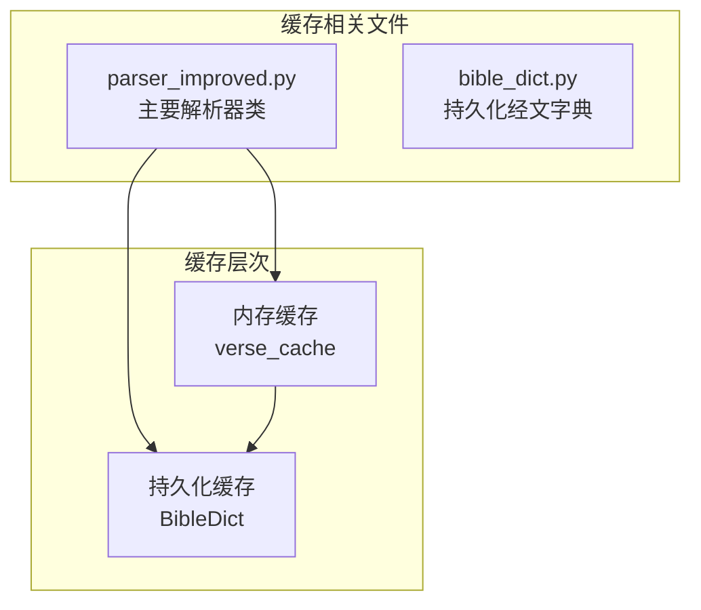
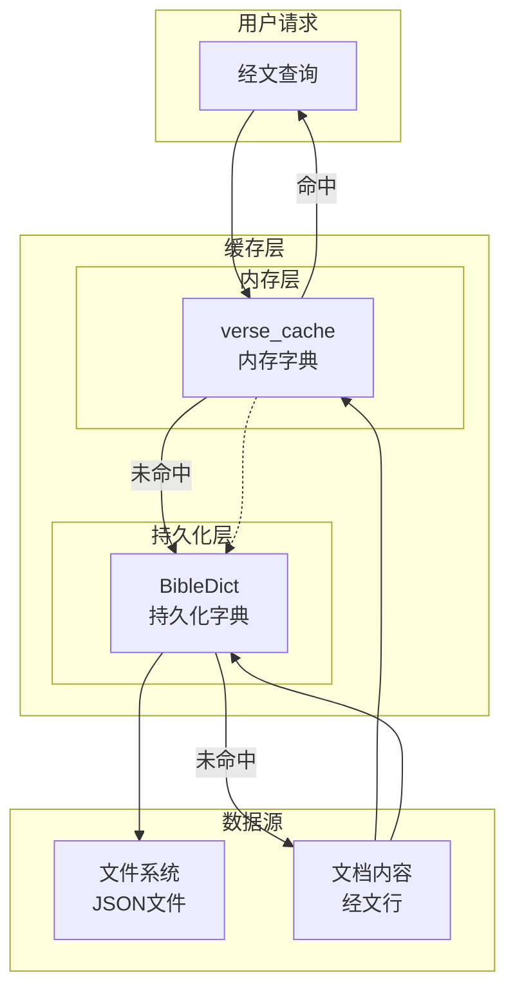
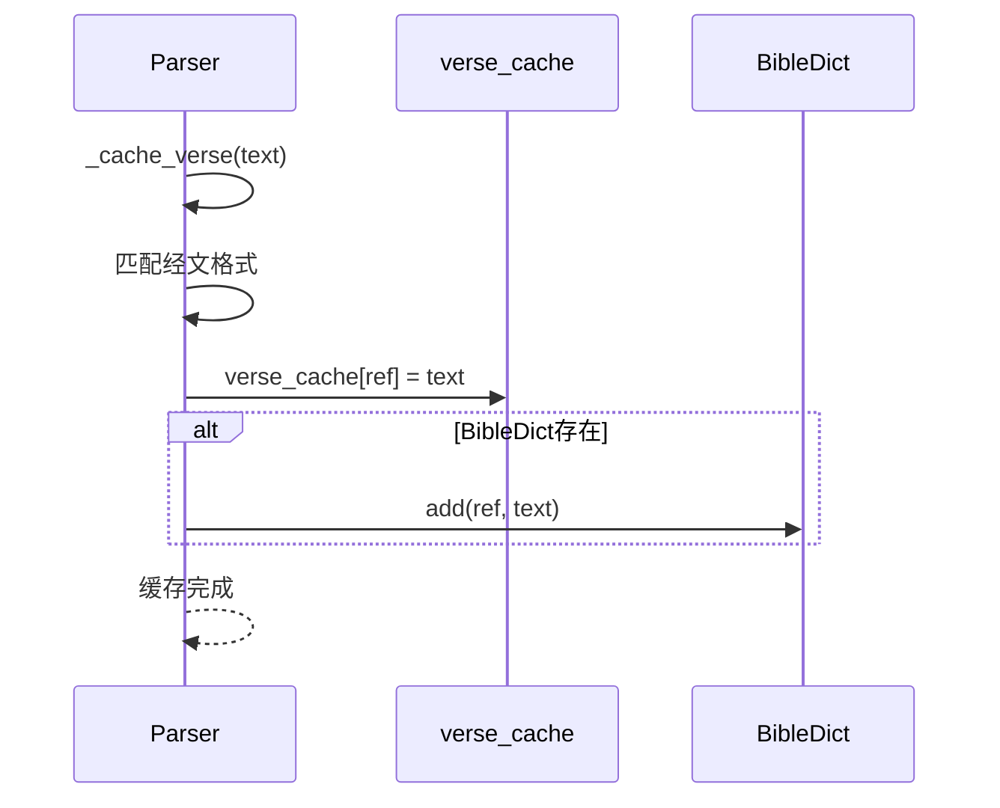
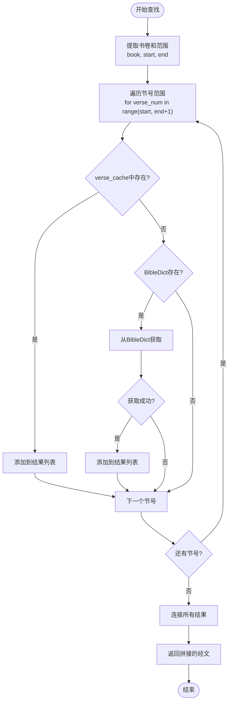
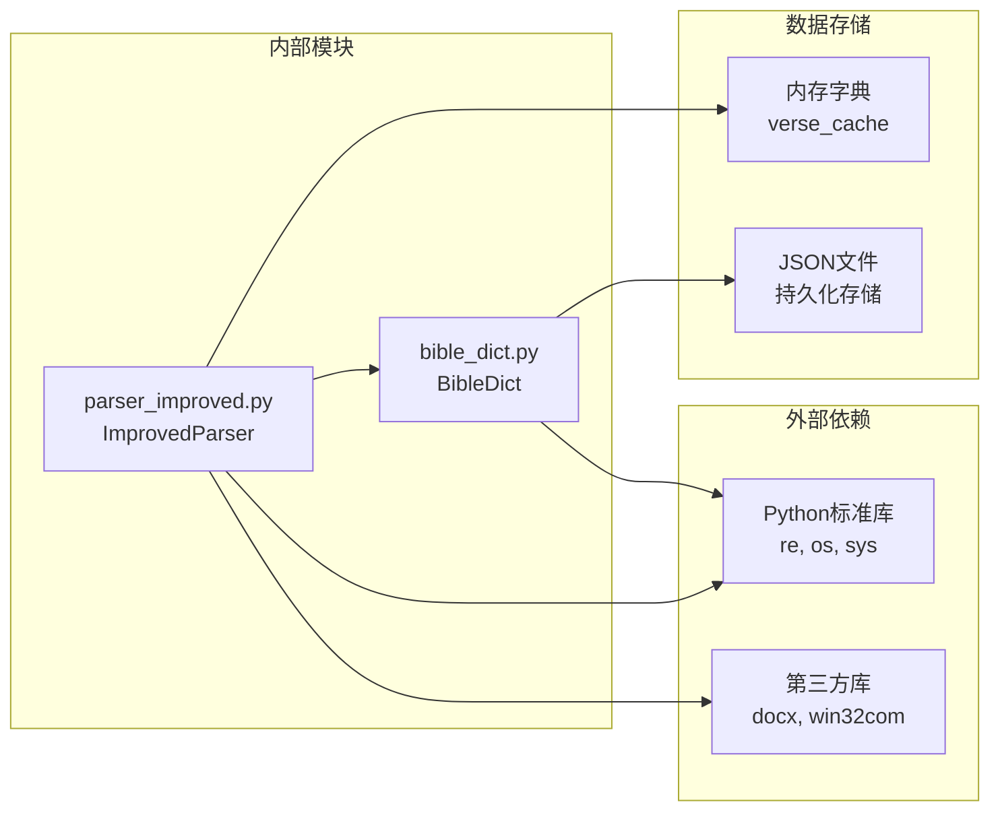

# 缓存机制

<cite>
**本文档引用的文件**
- [parser_improved.py](file://src/parser_improved.py)
- [bible_dict.py](file://src/bible_dict.py)
</cite>

## 目录
1. [简介](#简介)
2. [项目结构](#项目结构)
3. [核心组件](#核心组件)
4. [架构概览](#架构概览)
5. [详细组件分析](#详细组件分析)
6. [依赖关系分析](#依赖关系分析)
7. [性能考量](#性能考量)
8. [故障排除指南](#故障排除指南)
9. [结论](#结论)

## 简介

本文档详细记录了ImprovedParser类的缓存机制，这是一个双层缓存系统，结合了内存缓存和持久化字典，用于高效管理和复用经文内容。该机制确保在处理多个训练文档时能够快速访问已解析的经文，同时保持数据的一致性和完整性。

## 项目结构

缓存机制主要涉及以下两个核心文件：



**图表来源**
- [parser_improved.py:277-294](file://src/parser_improved.py#L277-L294)
- [bible_dict.py:19-96](file://src/bible_dict.py#L19-L96)

**章节来源**
- [parser_improved.py:115-284](file://src/parser_improved.py#L115-L284)
- [bible_dict.py:1-96](file://src/bible_dict.py#L1-L96)

## 核心组件

### ImprovedParser类的缓存属性

ImprovedParser类实现了双层缓存系统，包含以下关键组件：

#### verse_cache属性
- **类型**: `dict`
- **作用**: 内存中的经文缓存，存储已解析的经文内容
- **数据结构**: `{经文引用: 完整经文行}`
- **初始化**: 在`reset_state()`方法中初始化为空字典
- **生命周期**: 仅在单次文档解析过程中有效

#### BibleDict集成
- **类型**: `BibleDict`实例
- **作用**: 持久化存储，跨文档和跨训练累积经文
- **数据结构**: `{经文引用: 完整经文行}`
- **持久化**: 自动序列化到JSON文件

**章节来源**
- [parser_improved.py:277-294](file://src/parser_improved.py#L277-L294)
- [bible_dict.py:26-37](file://src/bible_dict.py#L26-L37)

## 架构概览

缓存系统采用双层架构设计，确保数据的高效访问和持久化存储：



**图表来源**
- [parser_improved.py:338-366](file://src/parser_improved.py#L338-L366)
- [bible_dict.py:33-59](file://src/bible_dict.py#L33-L59)

## 详细组件分析

### 缓存键生成规则

#### 经文引用格式
缓存键遵循标准的经文引用格式：
- **格式**: `{书卷缩写}{章号}:{节号}`
- **示例**: `"腓2:5"`、`"太5:3"`
- **生成方法**: `_get_verse_range_key()`方法

#### 键的唯一性保证
- 使用标准化的书卷缩写
- 章节和节号使用阿拉伯数字
- 去除多余的空白字符

**章节来源**
- [parser_improved.py:334-337](file://src/parser_improved.py#L334-L337)

### _cache_verse方法实现

该方法负责将经文内容缓存到内存和持久化存储中：



**图表来源**
- [parser_improved.py:338-350](file://src/parser_improved.py#L338-L350)

#### 实现逻辑分析

1. **输入验证**: 使用正则表达式验证经文格式
2. **键提取**: 从匹配结果中提取经文引用
3. **内存缓存**: 直接写入`verse_cache`字典
4. **持久化同步**: 条件性地写入`BibleDict`（避免覆盖）

**章节来源**
- [parser_improved.py:338-350](file://src/parser_improved.py#L338-L350)

### _get_cached_verse_range方法实现

该方法实现经文范围的查找机制：



**图表来源**
- [parser_improved.py:351-366](file://src/parser_improved.py#L351-L366)

#### 查找机制分析

1. **范围遍历**: 逐个检查指定范围内的每个节号
2. **缓存优先**: 首先检查内存缓存（`verse_cache`）
3. **回退机制**: 缓存未命中时查询持久化字典（`BibleDict`）
4. **结果聚合**: 将所有找到的经文行连接成单一字符串

**章节来源**
- [parser_improved.py:351-366](file://src/parser_improved.py#L351-L366)

### 与BibleDict类的集成

#### 数据一致性保证

```mermaid
classDiagram
class ImprovedParser {
+verse_cache : dict
+bible_dict : BibleDict
+_cache_verse(text)
+_get_cached_verse_range(book, start, end)
}
class BibleDict {
-_data : dict
+add(ref, line)
+get(ref)
+get_range(book_ch, start, end)
+load(path)
+save(path)
}
ImprovedParser --> BibleDict : "使用"
ImprovedParser --> "内存字典" : "verse_cache"
BibleDict --> "JSON文件" : "持久化"
```

**图表来源**
- [parser_improved.py:277-284](file://src/parser_improved.py#L277-L284)
- [bible_dict.py:19-96](file://src/bible_dict.py#L19-L96)

#### 集成特性

1. **条件性持久化**: 仅在`BibleDict`实例存在时才进行持久化
2. **防重复写入**: `BibleDict.add()`方法避免覆盖现有条目
3. **增量累积**: 支持跨文档和跨训练的经文累积

**章节来源**
- [bible_dict.py:33-42](file://src/bible_dict.py#L33-L42)

## 依赖关系分析

缓存机制的依赖关系如下：



**图表来源**
- [parser_improved.py:1-13](file://src/parser_improved.py#L1-L13)
- [bible_dict.py:8-16](file://src/bible_dict.py#L8-L16)

**章节来源**
- [parser_improved.py:1-13](file://src/parser_improved.py#L1-L13)
- [bible_dict.py:8-16](file://src/bible_dict.py#L8-L16)

## 性能考量

### 时间复杂度分析

1. **单节缓存**: O(1) - 直接字典查找
2. **范围查询**: O(k) - k为范围内的节号数量
3. **持久化写入**: O(1) - 字典插入操作
4. **范围遍历**: O(n) - n为范围大小

### 空间复杂度分析

- **内存缓存**: O(m) - m为已缓存的经节数量
- **持久化存储**: O(p) - p为累计的经节数量
- **整体空间**: O(m + p)

### 性能优化建议

1. **批量处理**: 在处理多个文档时，利用内存缓存减少重复解析
2. **范围优化**: 合理使用`_get_cached_verse_range`避免不必要的范围查询
3. **持久化策略**: 定期保存`BibleDict`以避免数据丢失
4. **内存管理**: 在长时间运行的任务中定期重置状态

## 故障排除指南

### 常见问题及解决方案

#### 缓存未命中问题
- **症状**: 经文查找总是返回空字符串
- **原因**: 缓存键格式不正确或经文未正确解析
- **解决**: 检查经文格式和缓存键生成逻辑

#### 持久化失败
- **症状**: 经文无法保存到JSON文件
- **原因**: 文件权限问题或磁盘空间不足
- **解决**: 检查文件路径权限和磁盘空间

#### 内存泄漏
- **症状**: 随着处理文档数量增加，内存使用持续增长
- **原因**: 未及时清理`verse_cache`
- **解决**: 在适当时候调用`reset_state()`重置缓存

**章节来源**
- [parser_improved.py:285-294](file://src/parser_improved.py#L285-L294)

## 结论

ImprovedParser类的缓存机制通过双层架构设计，实现了高效的经文内容管理。内存缓存提供了快速的本地访问，而持久化字典确保了数据的长期保存和跨文档复用。该系统的设计充分考虑了性能、可靠性和可维护性，在处理大量训练文档时表现出色。

通过合理使用缓存机制，可以显著提升解析效率，减少重复工作，并确保数据的一致性和完整性。建议在实际使用中遵循最佳实践，定期清理和重置缓存，以保持系统的最佳性能。