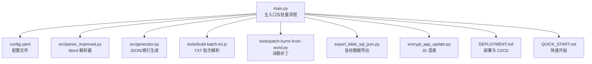
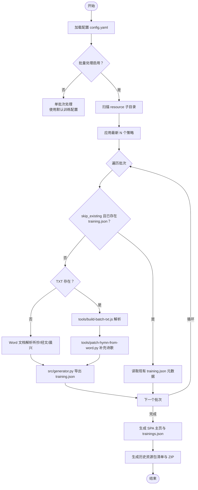
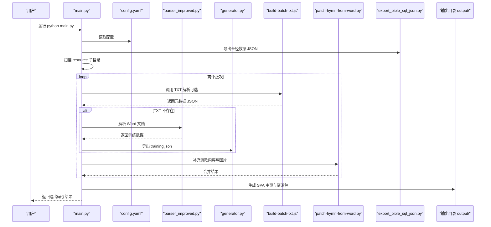
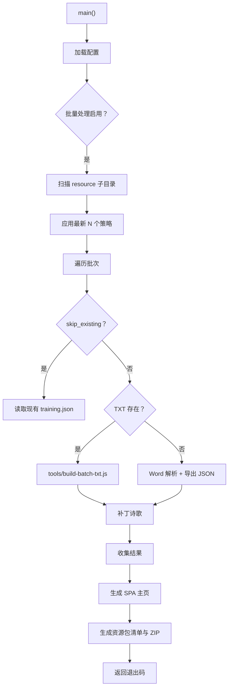
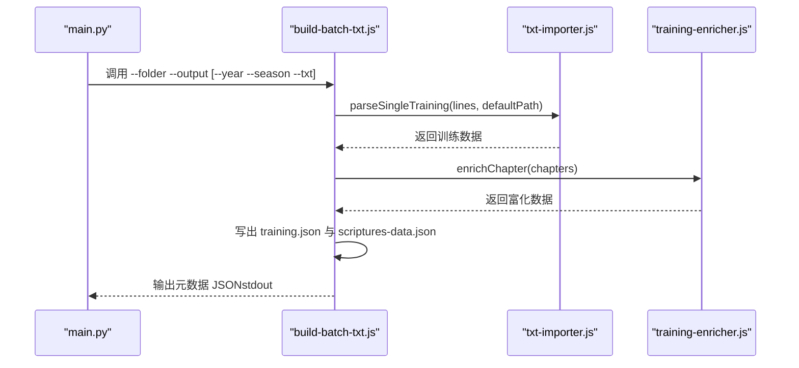
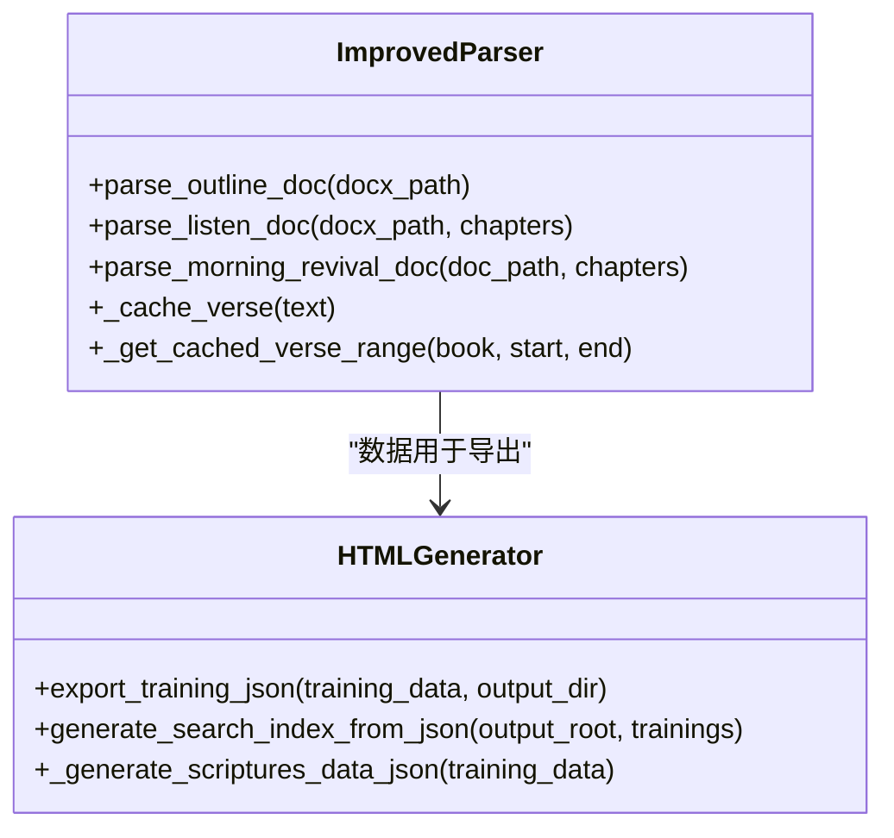
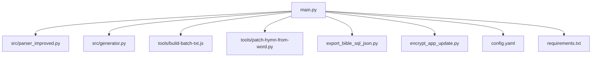

# 主程序 API

<cite>
**本文档引用的文件**
- [main.py](file://main.py)
- [config.yaml](file://config.yaml)
- [requirements.txt](file://requirements.txt)
- [DEPLOYMENT.md](file://DEPLOYMENT.md)
- [QUICK_START.md](file://QUICK_START.md)
- [src/parser_improved.py](file://src/parser_improved.py)
- [src/generator.py](file://src/generator.py)
- [tools/build-batch-txt.js](file://tools/build-batch-txt.js)
- [tools/patch-hymn-from-word.py](file://tools/patch-hymn-from-word.py)
- [export_bible_sql_json.py](file://export_bible_sql_json.py)
- [encrypt_app_update.py](file://encrypt_app_update.py)
</cite>

## 目录
1. [简介](#简介)
2. [项目结构](#项目结构)
3. [核心组件](#核心组件)
4. [架构概览](#架构概览)
5. [详细组件分析](#详细组件分析)
6. [依赖分析](#依赖分析)
7. [性能考虑](#性能考虑)
8. [故障排除指南](#故障排除指南)
9. [结论](#结论)
10. [附录](#附录)

## 简介
本文件为主程序 API 文档，面向使用者与维护者，系统性说明主程序入口、命令行参数处理、配置文件选项、批量处理流程、日志系统、环境变量支持、部署与 CI/CD 集成、性能监控与调试方法，以及完整的使用示例与故障排除指南。

## 项目结构
主程序采用 Python 作为入口，配合 Node.js 工具链与静态资源生成，形成“Python 主流程 + Node.js 辅助脚本”的混合架构。核心文件与职责如下：
- main.py：主入口，负责配置加载、批量扫描、批次处理、SPA 主页生成、资源包打包与混淆控制
- config.yaml：全局配置与批量处理策略
- src/parser_improved.py：Word 文档解析器（.doc/.docx）
- src/generator.py：HTML/JSON 生成器与搜索索引
- tools/build-batch-txt.js：基于 TXT 的批次解析与 training.json 生成
- tools/patch-hymn-from-word.py：从晨兴 Word 补充诗歌内容与图片
- export_bible_sql_json.py：从 SQLite 导出圣经数据 JSON
- encrypt_app_update.py：JS 混淆与保护

**图表来源**
- [main.py:880-1126](file://main.py#L880-L1126)
- [config.yaml:1-42](file://config.yaml#L1-L42)
- [src/parser_improved.py:1-800](file://src/parser_improved.py#L1-L800)
- [src/generator.py:1-546](file://src/generator.py#L1-L546)
- [tools/build-batch-txt.js:1-267](file://tools/build-batch-txt.js#L1-L267)
- [tools/patch-hymn-from-word.py:1-152](file://tools/patch-hymn-from-word.py#L1-L152)
- [export_bible_sql_json.py:1-536](file://export_bible_sql_json.py#L1-L536)
- [encrypt_app_update.py:1-263](file://encrypt_app_update.py#L1-L263)
- [DEPLOYMENT.md:1-157](file://DEPLOYMENT.md#L1-L157)
- [QUICK_START.md:1-181](file://QUICK_START.md#L1-L181)

**章节来源**
- [main.py:880-1126](file://main.py#L880-L1126)
- [config.yaml:1-42](file://config.yaml#L1-L42)

## 核心组件

### 主入口与命令行参数
- 入口函数：main()
  - 负责配置加载、批量/单批次处理、历史合辑解析、SPA 主页生成、资源包打包与混淆控制
  - 返回码策略：全部成功=0；部分失败且有成功=0（CI友好）；全部失败=1；严格模式下只要失败即=1
- 命令行参数：无显式 CLI 参数
  - 通过环境变量与配置文件控制行为（如 JS 混淆开关）

**章节来源**
- [main.py:880-1126](file://main.py#L880-L1126)

### 配置文件 config.yaml 选项与默认值
- 批量处理配置 batch_processing
  - enabled: true（启用批量处理）
  - skip_existing: false（是否跳过已存在的 training.json）
  - strict_exit_on_batch_failure: false（部分失败时是否严格返回 1）
  - max_latest_trainings: 5（GitHub 打包保留最新 N 个训练）
  - specific_trainings: []（指定处理的训练集合，留空则处理所有）
- 全局配置
  - output_dir: "output"
  - resource_base_dir: "resource"
  - template_dir: "src/templates"
  - static_dir: "src/static"
- 默认训练配置 default_training
  - year: 2025
  - season: "秋季"
- 远程服务器配置 remote_servers
  - cloudflare: 多个 Cloudflare 域名
  - github_api: GitHub Releases API
  - github_mirrors: GitHub 镜像代理
  - push: 推送服务地址
  - ip_apis: IP 查询接口

**章节来源**
- [config.yaml:1-42](file://config.yaml#L1-L42)

### 批量处理流程控制逻辑
- 扫描策略
  - 扫描 resource 目录子文件夹，跳过特定目录（如历史合辑）
  - 支持按时间排序与“最新 N 个”策略，控制打包体积
- 处理顺序
  - 优先使用 TXT 文件（批次内或历史合辑匹配）
  - 回退到 Word 文档解析（听抄、经文、晨兴）
  - 生成 training.json 与补充经文 scriptures-data.json
- 错误恢复机制
  - skip_existing：若 output/年-月/training.json 存在则跳过
  - 严格模式：strict_exit_on_batch_failure=true 时，只要失败即返回 1
  - 部分失败：有成功且无严格模式时返回 0（CI 友好）
- SPA 主页与资源包
  - 生成 trainings.json、SPA 入口、静态资源、remote-config.js
  - 生成历史训练资源包清单与分组 ZIP（不含图片）

**图表来源**
- [main.py:908-1121](file://main.py#L908-L1121)
- [tools/build-batch-txt.js:154-266](file://tools/build-batch-txt.js#L154-L266)
- [tools/patch-hymn-from-word.py:42-135](file://tools/patch-hymn-from-word.py#L42-L135)
- [src/generator.py:383-425](file://src/generator.py#L383-L425)

**章节来源**
- [main.py:908-1121](file://main.py#L908-L1121)

### 日志系统与输出格式
- Python 主流程
  - 使用 print 输出进度与结果，stderr 用于错误与警告
  - UTF-8 重配置以保证控制台输出正确
- Node.js 工具
  - build-batch-txt.js 使用 console.error 输出解析过程与错误
- 输出文件
  - training.json（紧凑 JSON，含版本号）
  - scriptures-data.json（补充经文）
  - trainings.json（SPA 列表）
  - resource-packs.json（历史资源包清单）

**章节来源**
- [main.py:880-907](file://main.py#L880-L907)
- [tools/build-batch-txt.js:154-266](file://tools/build-batch-txt.js#L154-L266)
- [src/generator.py:383-425](file://src/generator.py#L383-L425)

### 环境变量支持与配置方式
- JS 混淆控制
  - OBFUSCATE_JS=1 强制开启；OBFUSCATE_JS=0 强制关闭；未设置时 CI 环境自动开启
- Cloudflare Pages 构建环境
  - PYTHON_VERSION=3.9
  - DEBIAN_FRONTEND=noninteractive
- 其他
  - CI/GITHUB_ACTIONS：用于判定是否处于 CI 环境

**章节来源**
- [main.py:705-719](file://main.py#L705-L719)
- [DEPLOYMENT.md:31-34](file://DEPLOYMENT.md#L31-L34)

### 部署配置与 CI/CD 集成
- Cloudflare Pages 自动部署
  - 构建命令：chmod +x build.sh && ./build.sh
  - 输出目录：output
  - 环境变量：PYTHON_VERSION、DEBIAN_FRONTEND
- 一键部署脚本
  - deploy.bat / deploy.ps1：本地运行主程序、提交并推送
- 回滚与预览
  - 支持按部署回滚与分支预览 URL

**章节来源**
- [DEPLOYMENT.md:22-47](file://DEPLOYMENT.md#L22-L47)
- [DEPLOYMENT.md:60-76](file://DEPLOYMENT.md#L60-L76)
- [QUICK_START.md:158-174](file://QUICK_START.md#L158-L174)

### 性能监控与调试功能
- 性能要点
  - skip_existing：避免重复处理
  - 最新 N 个策略：限制打包体积
  - 压缩 JSON：bible-text.json 去空白字符
  - JS 混淆：保护敏感 URL，可按文件强度分级
- 调试建议
  - 本地开发时关闭 JS 混淆（OBFUSCATE_JS=0）
  - 检查 Node.js 与 Python 依赖版本
  - 关注 build-batch-txt.js 的解析错误输出

**章节来源**
- [main.py:1034-1036](file://main.py#L1034-L1036)
- [main.py:1008-1016](file://main.py#L1008-L1016)
- [main.py:705-719](file://main.py#L705-L719)

## 架构概览

**图表来源**
- [main.py:996-1030](file://main.py#L996-L1030)
- [main.py:1031-1086](file://main.py#L1031-L1086)
- [tools/build-batch-txt.js:154-266](file://tools/build-batch-txt.js#L154-L266)
- [tools/patch-hymn-from-word.py:42-135](file://tools/patch-hymn-from-word.py#L42-L135)
- [src/generator.py:383-425](file://src/generator.py#L383-L425)

## 详细组件分析

### 组件 A：主流程与批量处理
- 关键职责
  - 配置加载与模式切换（批量/单批次）
  - 扫描与筛选批次（含时间排序与最新 N 个策略）
  - 调度 TXT/Word 解析、导出 JSON、生成 SPA 与资源包
  - 退出码策略与错误恢复
- 复杂度与性能
  - 批次遍历为 O(N)，解析阶段受文档数量与大小影响
  - skip_existing 与最新 N 个策略显著降低重复工作量

**图表来源**
- [main.py:908-1121](file://main.py#L908-L1121)

**章节来源**
- [main.py:908-1121](file://main.py#L908-L1121)

### 组件 B：TXT 批次解析与富化
- 流程
  - 查找 TXT 文件（批次内优先，其次历史合辑）
  - 使用 txt-importer.js 解析为训练数据
  - 使用 training-enricher.js 富化（如 feeding_refs）
  - 写出 training.json 与 scriptures-data.json
  - 复制标语诗歌图片到 images/
- 错误处理
  - 未找到 TXT 文件时报错并退出
  - 解析异常捕获并输出错误信息

**图表来源**
- [tools/build-batch-txt.js:154-266](file://tools/build-batch-txt.js#L154-L266)

**章节来源**
- [tools/build-batch-txt.js:1-267](file://tools/build-batch-txt.js#L1-L267)

### 组件 C：Word 文档解析与导出
- 解析器
  - 自动识别 .doc/.docx，.doc 通过 LibreOffice 转换
  - 提取纲目、经文、职事摘录、晨兴内容与诗歌信息
- 导出
  - 导出 training.json（紧凑 JSON）
  - 生成 scriptures-data.json（补充经文）
  - 生成搜索索引 search-index.json

**图表来源**
- [src/parser_improved.py:115-800](file://src/parser_improved.py#L115-L800)
- [src/generator.py:22-546](file://src/generator.py#L22-L546)

**章节来源**
- [src/parser_improved.py:1-800](file://src/parser_improved.py#L1-L800)
- [src/generator.py:1-546](file://src/generator.py#L1-L546)

### 组件 D：JS 混淆与保护
- 混淆策略
  - remote-config.js：最强保护（full）
  - app-update.js/theme-toggle.js：尺寸优先（size）
- 依赖
  - javascript-obfuscator（需全局安装）
- 备份与恢复
  - 混淆前自动备份原始文件
  - 提供恢复命令

**章节来源**
- [encrypt_app_update.py:12-263](file://encrypt_app_update.py#L12-L263)

## 依赖分析

**图表来源**
- [main.py:14-16](file://main.py#L14-L16)
- [requirements.txt:1-16](file://requirements.txt#L1-L16)

**章节来源**
- [main.py:14-16](file://main.py#L14-L16)
- [requirements.txt:1-16](file://requirements.txt#L1-L16)

## 性能考虑
- I/O 优化
  - skip_existing 避免重复解析
  - 最新 N 个策略限制打包规模
- CPU 优化
  - 压缩 JSON 减少体积
  - 按文件强度分级混淆，平衡体积与安全
- 并发与外部工具
  - Node.js 工具与 Python 子进程并行执行，提升吞吐

[本节为通用指导，无需特定文件引用]

## 故障排除指南
- 配置问题
  - 配置文件加载失败：检查 config.yaml 语法与路径
- 文档格式
  - .doc 文件需转换为 .docx 或安装 LibreOffice
  - Cloudflare Pages 不支持 LibreOffice，需本地转换
- Node.js 工具
  - build-batch-txt.js 未找到 TXT：确认资源目录与文件命名
  - 解析失败：查看控制台错误输出
- 依赖缺失
  - javascript-obfuscator 未安装：按提示安装
- 部署失败
  - 环境变量缺失：PYTHON_VERSION、DEBIAN_FRONTEND
  - 构建命令错误：确认 build.sh 与 main.py 可运行

**章节来源**
- [main.py:904-906](file://main.py#L904-L906)
- [src/parser_improved.py:84-110](file://src/parser_improved.py#L84-L110)
- [tools/build-batch-txt.js:165-173](file://tools/build-batch-txt.js#L165-L173)
- [encrypt_app_update.py:57-60](file://encrypt_app_update.py#L57-L60)
- [DEPLOYMENT.md:120-127](file://DEPLOYMENT.md#L120-L127)

## 结论
主程序通过清晰的配置驱动与模块化设计，实现了从 Word/TXT 到 SPA 静态站点的完整流水线。批量处理、历史资源包与 CI/CD 集成提供了高效的发布体验；JS 混淆与安全策略保障了生产环境的安全性。遵循本文档的使用与排障建议，可稳定高效地完成训练内容的生成与部署。

## 附录

### 使用示例
- 本地运行
  - python main.py
- 一键部署（Cloudflare Pages）
  - 配置环境变量后推送代码，自动构建与部署
- 本地部署脚本
  - Windows: deploy.bat
  - PowerShell: deploy.ps1

**章节来源**
- [QUICK_START.md:62-81](file://QUICK_START.md#L62-L81)
- [DEPLOYMENT.md:60-76](file://DEPLOYMENT.md#L60-L76)