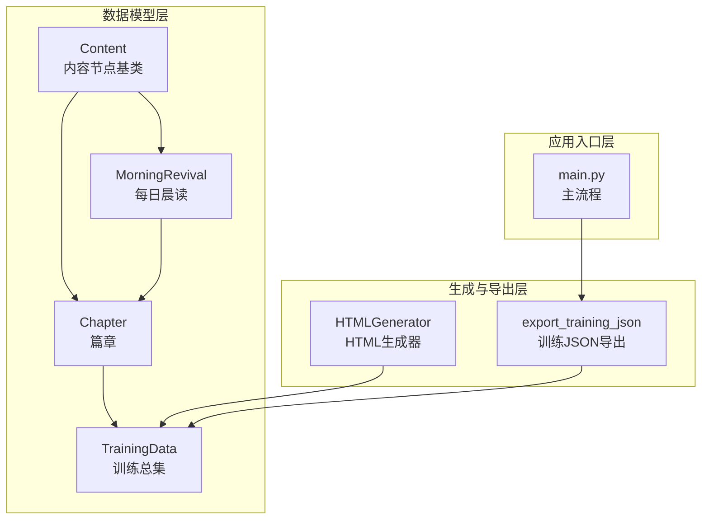
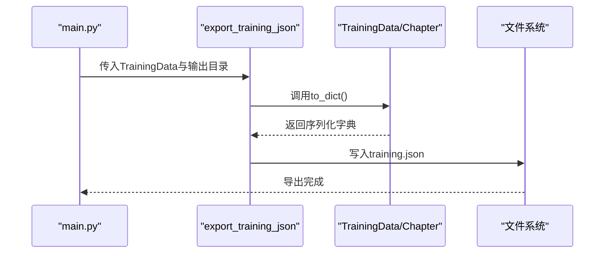
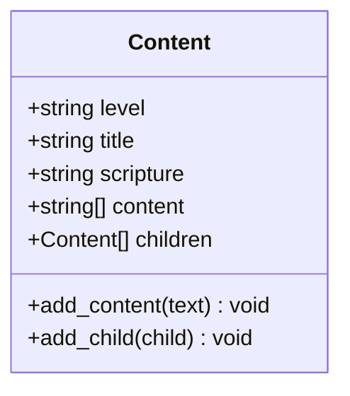
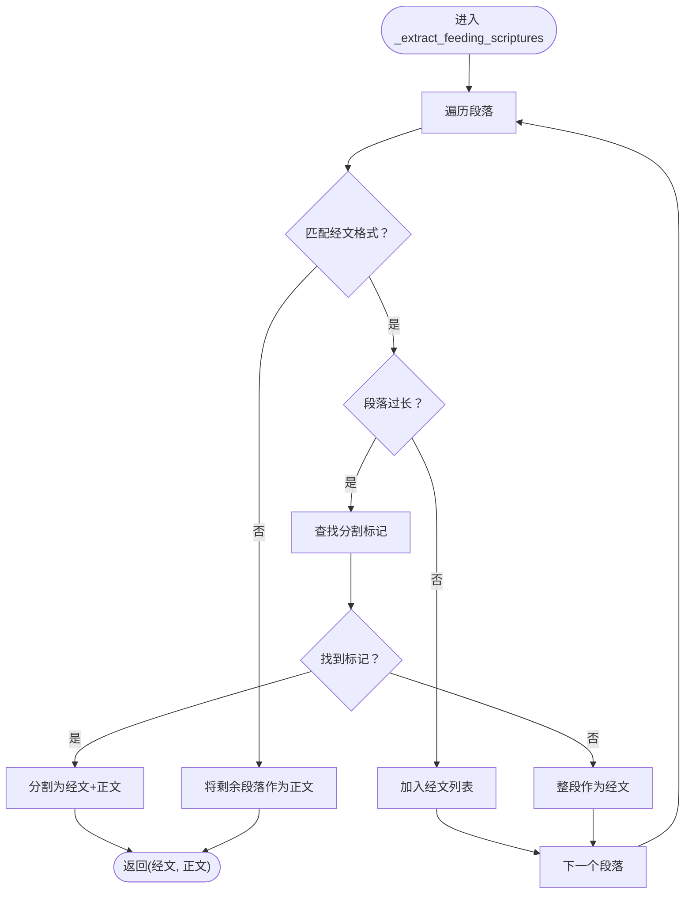
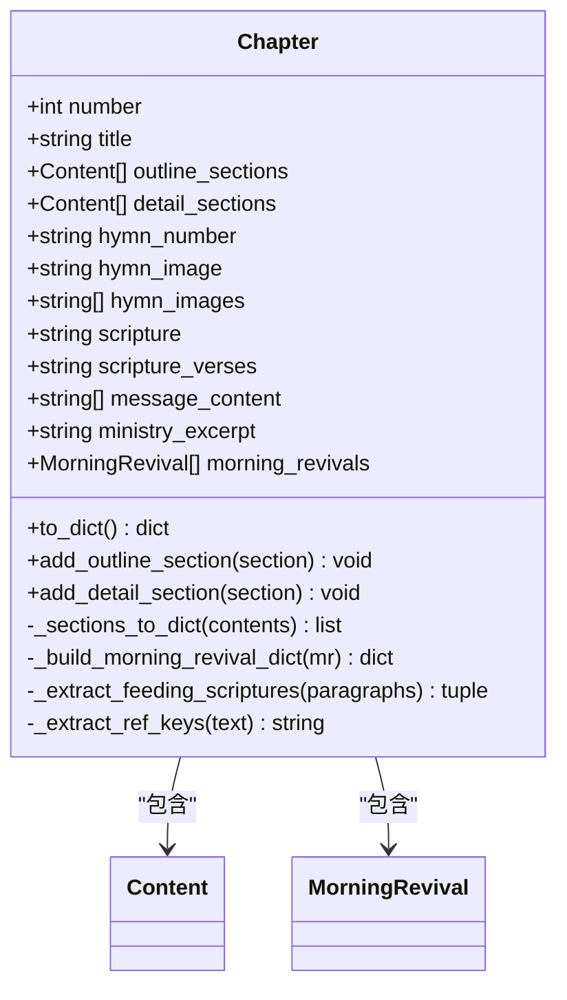
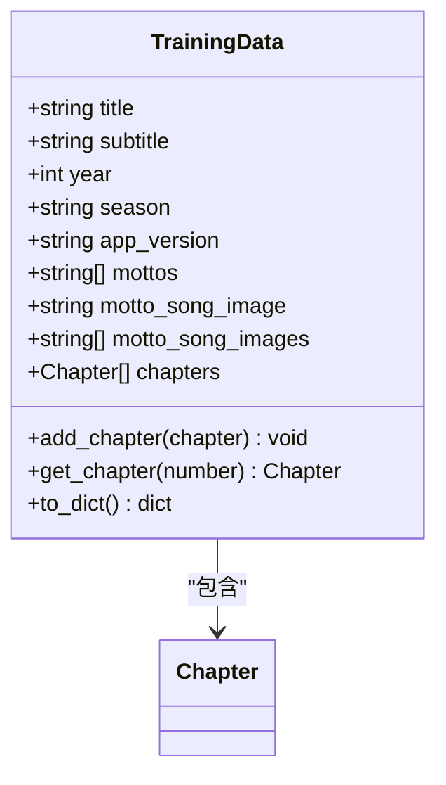
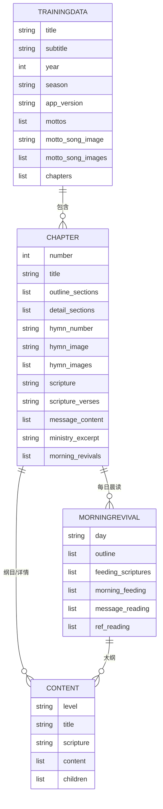
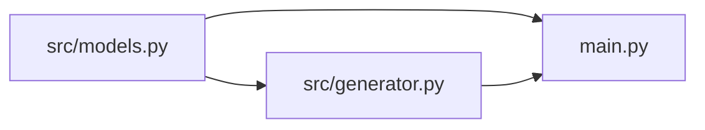

# 数据模型 API

<cite>
**本文引用的文件**
- [src/models.py](file://src/models.py)
- [src/generator.py](file://src/generator.py)
- [main.py](file://main.py)
</cite>

## 目录
1. [简介](#简介)
2. [项目结构](#项目结构)
3. [核心组件](#核心组件)
4. [架构概览](#架构概览)
5. [详细组件分析](#详细组件分析)
6. [依赖分析](#依赖分析)
7. [性能考虑](#性能考虑)
8. [故障排除指南](#故障排除指南)
9. [结论](#结论)
10. [附录](#附录)

## 简介
本文件为数据模型系统的完整API文档，聚焦以下核心类：
- Chapter：篇章数据模型，包含纲目结构、详细内容、诗歌信息、经文引用、职事信息以及每日晨读集合。
- Content：内容节点基类，用于表示层级化的纲目树，支持正文段落与子节点。
- TrainingData：训练数据总集，聚合多个篇章并提供常用查询与序列化能力。
- MorningRevival：每日晨读内容容器，包含大纲、喂养经文、信息选读与参读等。

文档将详细说明各属性与方法的定义、类型、用途与使用方式，提供数据结构的嵌套关系图与使用示例，并总结数据验证规则与序列化/反序列化的最佳实践。

## 项目结构
数据模型位于Python模块中，配合生成器与主流程进行序列化输出与前端渲染：
- 数据模型定义：src/models.py
- HTML生成与JSON导出：src/generator.py
- 主流程入口与JSON读写：main.py

图表来源
- [src/models.py:9-26](file://src/models.py#L9-L26)
- [src/models.py:28-37](file://src/models.py#L28-L37)
- [src/models.py:39-194](file://src/models.py#L39-L194)
- [src/models.py:196-232](file://src/models.py#L196-L232)
- [src/generator.py:22-46](file://src/generator.py#L22-L46)
- [src/generator.py:381-400](file://src/generator.py#L381-L400)
- [main.py:270-294](file://main.py#L270-L294)

章节来源
- [src/models.py:1-232](file://src/models.py#L1-L232)
- [src/generator.py:1-200](file://src/generator.py#L1-L200)
- [main.py:270-340](file://main.py#L270-L340)

## 核心组件

### Content 类
- 作用：内容节点基类，用于构建层级化的纲目树，支持正文段落与子节点。
- 关键属性
  - level: str，层级标识，如“壹”“一”“1”“a”等。
  - title: str，标题文本。
  - scripture: str，默认为空，经文引用。
  - content: List[str]，正文段落列表。
  - children: List[Content]，子节点列表。
- 关键方法
  - add_content(text: str)：添加非空且去空白后的正文段落。
  - add_child(child: Content)：添加子节点。
- 数据验证与约束
  - content段落必须非空且去除首尾空白才被接受。
  - children为递归结构，支持任意层级嵌套。
- 使用场景
  - 作为Chapter.outline_sections与detail_sections的基础节点。
  - 作为MorningRevival.outline的基础节点。

章节来源
- [src/models.py:9-26](file://src/models.py#L9-L26)

### MorningRevival 类
- 作用：按天组织的晨读内容容器，用于承载每日大纲、喂养经文、信息选读与参读。
- 关键属性
  - day: str，如“周一”“周二”等。
  - outline: List[Content]，大纲部分（Content节点树）。
  - feeding_scriptures: List[str]，喂养经文（纯文本行，可能含经文与正文混合）。
  - morning_feeding: List[str]，晨兴喂养（文本段落，可能包含经文与正文）。
  - message_reading: List[str]，信息选读。
  - ref_reading: List[str]，参读。
- 特殊处理
  - _extract_feeding_scriptures：从晨兴喂养段落中分离经文与正文，支持多种经文格式与长段落分割逻辑。
- 数据验证与约束
  - feeding_scriptures与morning_feeding允许混合内容，通过正则与标记位进行拆分。
  - outline为Content树，遵循Content的层级与内容规则。
- 使用场景
  - 作为Chapter.morning_revivals的元素之一，参与to_dict转换与模板渲染。

章节来源
- [src/models.py:28-37](file://src/models.py#L28-L37)
- [src/models.py:101-161](file://src/models.py#L101-L161)

### Chapter 类
- 作用：篇章数据模型，聚合纲目结构、详细内容、诗歌信息、经文引用、职事信息与每日晨读。
- 关键属性
  - number: int，篇章编号（1-9）。
  - title: str，标题。
  - outline_sections: List[Content]，纲目结构（仅标题，来自经文文档）。
  - detail_sections: List[Content]，详细内容（带正文段落，来自听抄文档）。
  - hymn_number: str，默认为空，诗歌编号（如“JL 诗歌：748”）。
  - hymn_image: str，默认为空，诗歌图片路径（相对output目录，向后兼容保留第一张图）。
  - hymn_images: List[str]，诗歌图片列表（支持多张）。
  - scripture: str，默认为空，经文引用（读经经文）。
  - scripture_verses: str，默认为空，经文内容（经文正文）。
  - message_content: List[str]，职事信息内容（来自听抄文档末尾）。
  - ministry_excerpt: str，默认为空，职事信息摘录（来自经文文档）。
  - morning_revivals: List[MorningRevival]，每日晨读（来自晨读文档）。
  - _day_outlines: dict，默认为空，内部使用：按天存储的大纲数据。
- 关键方法
  - add_outline_section(section: Content)：添加纲目节点。
  - add_detail_section(section: Content)：添加详细内容节点。
  - to_dict()：转换为字典，便于模板渲染；自动合并hymn_image与hymn_images，处理经文与晨读结构。
  - _build_morning_revival_dict(mr)：构建单天晨读字典，分离喂养经文与正文。
  - _extract_feeding_scriptures：见MorningRevival说明。
  - _sections_to_dict(contents: List[Content])：递归转换内容节点为字典。
  - _extract_ref_keys(scripture_text)：从“腓4:5\t经文正文\n...”格式中提取引用键列表。
- 数据验证与约束
  - number范围为1-9。
  - hymn_images优先于hymn_image；若两者均为空则输出为空列表。
  - _day_outlines为内部缓存字段，不参与外部序列化。
- 使用场景
  - 作为TrainingData.chapters的元素，参与整体训练数据的序列化与导出。

章节来源
- [src/models.py:39-194](file://src/models.py#L39-L194)

### TrainingData 类
- 作用：训练数据总集，聚合多个篇章并提供常用查询与序列化能力。
- 关键属性
  - title: str，总题。
  - subtitle: str，副标题。
  - year: int，年份。
  - season: str，季节（如“春季”“夏季”等）。
  - app_version: str，默认为空，应用版本号。
  - mottos: List[str]，标语列表。
  - motto_song_image: str，默认为空，标语诗歌图片路径（向后兼容，保留第一张）。
  - motto_song_images: List[str]，标语诗歌图片列表（支持多张）。
  - chapters: List[Chapter]，篇章列表。
- 关键方法
  - add_chapter(chapter: Chapter)：添加篇章。
  - get_chapter(number: int) -> Optional[Chapter]：根据编号获取篇章。
  - to_dict()：转换为字典，自动合并motto_song_image与motto_song_images，序列化所有章节。
- 数据验证与约束
  - motto_song_images优先于motto_song_image；若两者均为空则输出为空列表。
- 使用场景
  - 作为整体训练数据的根对象，参与JSON导出与前端渲染。

章节来源
- [src/models.py:196-232](file://src/models.py#L196-L232)

## 架构概览
数据模型在系统中的角色与交互如下：
- 数据模型层：定义Content、MorningRevival、Chapter、TrainingData四类，形成清晰的层次化数据结构。
- 生成与导出层：HTMLGenerator与export_training_json负责将模型实例转换为JSON并进行模板渲染准备。
- 应用入口层：main.py协调解析、导出与索引生成，读取已存在的training.json以复用元数据。

图表来源
- [src/generator.py:381-400](file://src/generator.py#L381-L400)
- [src/models.py:220-232](file://src/models.py#L220-L232)
- [main.py:286-294](file://main.py#L286-L294)

## 详细组件分析

### Content 类分析
- 结构与职责
  - 作为纲目树的基础节点，支持正文段落与子节点，便于构建层级化的内容结构。
- 方法行为
  - add_content：确保输入非空且去空白后才加入content列表。
  - add_child：直接追加子节点，支持递归构建树形结构。
- 复杂度分析
  - add_content：O(1)。
  - add_child：O(1)。
- 错误处理与边界
  - 空字符串或仅空白字符不会被加入content。
  - children为递归结构，需注意深度控制与内存占用。

图表来源
- [src/models.py:9-26](file://src/models.py#L9-L26)

章节来源
- [src/models.py:9-26](file://src/models.py#L9-L26)

### MorningRevival 类分析
- 结构与职责
  - 按天组织晨读内容，包含大纲、喂养经文、信息选读与参读。
- 特殊处理逻辑
  - _extract_feeding_scriptures：通过正则匹配三种经文格式，并对超长段落进行分割，将经文与正文分离。
- 方法行为
  - _extract_feeding_scriptures：返回(经文列表, 正文列表)元组。
- 复杂度分析
  - 正则匹配与线性扫描：O(n)，n为段落数。
  - 分割逻辑包含固定标记位查找，最坏情况下为O(k)，k为标记数量。
- 错误处理与边界
  - 非经文段落出现后，后续全部视为正文。
  - 超长段落采用预设标记进行分割，若未找到标记则整段作为经文。

图表来源
- [src/models.py:101-161](file://src/models.py#L101-L161)

章节来源
- [src/models.py:28-37](file://src/models.py#L28-L37)
- [src/models.py:101-161](file://src/models.py#L101-L161)

### Chapter 类分析
- 结构与职责
  - 聚合纲目与详细内容、诗歌信息、经文引用、职事信息与每日晨读。
- 方法行为
  - to_dict：统一输出结构，自动合并hymn_image与hymn_images，处理晨读喂养经文分离与大纲树转换。
  - _build_morning_revival_dict：构建单天晨读字典，调用_feeding_scriptures分离逻辑。
  - _sections_to_dict：递归转换Content树为字典。
  - _extract_ref_keys：从“书卷+经文\t正文”的多行文本中提取引用键。
- 复杂度分析
  - to_dict：O(N)，N为所有Content节点与段落数之和。
  - _sections_to_dict：O(N)。
  - _extract_ref_keys：O(M)，M为行数。
- 错误处理与边界
  - number必须在1-9范围内。
  - 当hymn_images为空时回退到hymn_image；若两者均为空则输出空列表。

图表来源
- [src/models.py:39-194](file://src/models.py#L39-L194)

章节来源
- [src/models.py:39-194](file://src/models.py#L39-L194)

### TrainingData 类分析
- 结构与职责
  - 作为顶层容器，聚合多个Chapter与元信息，提供便捷的查询与序列化接口。
- 方法行为
  - add_chapter：添加Chapter。
  - get_chapter：按编号查找Chapter。
  - to_dict：统一输出结构，合并标语诗歌图片字段，序列化所有章节。
- 复杂度分析
  - add_chapter：O(1)。
  - get_chapter：O(C)，C为已添加的章节数量。
  - to_dict：O(T)，T为所有章节与内容节点总数。

图表来源
- [src/models.py:196-232](file://src/models.py#L196-L232)

章节来源
- [src/models.py:196-232](file://src/models.py#L196-L232)

### 数据结构嵌套关系图

图表来源
- [src/models.py:9-26](file://src/models.py#L9-L26)
- [src/models.py:28-37](file://src/models.py#L28-L37)
- [src/models.py:39-194](file://src/models.py#L39-L194)
- [src/models.py:196-232](file://src/models.py#L196-L232)

## 依赖分析
- 模块内聚与耦合
  - Content与MorningRevival为Chapter的组成单元，彼此独立但共同服务于Chapter。
  - TrainingData聚合Chapter，提供顶层查询与序列化。
- 外部依赖
  - JSON序列化：main.py与generator.py使用标准库json进行读写。
  - 模板渲染：generator.py使用Jinja2环境加载模板。
- 循环依赖
  - 模型之间无循环导入；Content在类型注解中使用字符串形式的向前引用，避免循环依赖。

图表来源
- [src/models.py:1-232](file://src/models.py#L1-L232)
- [src/generator.py:1-200](file://src/generator.py#L1-L200)
- [main.py:270-340](file://main.py#L270-L340)

章节来源
- [src/models.py:1-232](file://src/models.py#L1-L232)
- [src/generator.py:1-200](file://src/generator.py#L1-L200)
- [main.py:270-340](file://main.py#L270-L340)

## 性能考虑
- 递归遍历
  - _sections_to_dict与to_dict对Content树进行递归遍历，时间复杂度为O(N)。建议控制Content树的深度与宽度，避免过深导致栈溢出。
- 正则匹配
  - _extract_feeding_scriptures包含多次正则匹配与固定标记查找，整体为O(n)。若段落数量巨大，可考虑优化正则表达式或引入缓存。
- JSON序列化
  - to_dict与export_training_json涉及大量字典构造与列表拼接，建议在批量处理时减少中间对象创建，必要时使用生成器或流式写入。

## 故障排除指南
- 经文分离异常
  - 症状：晨兴喂养段落未正确分离经文与正文。
  - 排查：检查段落是否符合三种经文格式；确认超长段落是否存在预设分割标记；核对MAX_SCRIPTURE_LENGTH阈值是否合理。
- 图片字段为空
  - 症状：hymn_images或motto_song_images输出为空列表。
  - 排查：确认hymn_images是否为空；若为空则回退到hymn_image；若两者均为空则输出为空列表。
- JSON导出失败
  - 症状：training.json生成失败或内容异常。
  - 排查：检查to_dict输出结构；确认编码与换行符；核对文件写入权限与路径。

章节来源
- [src/models.py:64-86](file://src/models.py#L64-L86)
- [src/models.py:101-161](file://src/models.py#L101-L161)
- [src/generator.py:381-400](file://src/generator.py#L381-L400)
- [main.py:286-294](file://main.py#L286-L294)

## 结论
本文档系统性地梳理了数据模型层的四个核心类：Content、MorningRevival、Chapter与TrainingData。它们共同构成训练内容的结构化表示，支持从纲目到详细内容、从经文到每日晨读的全链路数据组织。通过to_dict与export_training_json，模型能够稳定地序列化为JSON供前端渲染与索引生成使用。建议在实际使用中关注Content树的规模、经文分离的正则匹配效率与JSON写入的性能表现，以获得更好的系统稳定性与运行效率。

## 附录

### 使用示例（步骤说明）
- 创建Content节点并添加正文与子节点
  - 步骤：实例化Content，调用add_content添加段落，调用add_child添加子节点。
  - 参考：[src/models.py:18-25](file://src/models.py#L18-L25)
- 构建Chapter大纲与详细内容
  - 步骤：创建Content节点树，分别添加至outline_sections与detail_sections；设置hymn与scripture信息；添加morning_revivals。
  - 参考：[src/models.py:56-62](file://src/models.py#L56-L62)
- 聚合为TrainingData并导出JSON
  - 步骤：实例化TrainingData，调用add_chapter添加Chapter；调用to_dict生成字典；通过export_training_json写入training.json。
  - 参考：[src/models.py:209-211](file://src/models.py#L209-L211)
  - 参考：[src/models.py:220-231](file://src/models.py#L220-L231)
  - 参考：[src/generator.py:381-400](file://src/generator.py#L381-L400)
  - 参考：[main.py:286-294](file://main.py#L286-L294)

### 数据验证规则与约束条件
- Chapter.number：必须为1-9之间的整数。
- Content.content：仅接受非空且去空白后的段落。
- Chapter与TrainingData的图片字段：hymn_images优先，其次回退到hymn_image；motto_song_images优先，其次回退到motto_song_image。
- 经文分离：非经文段落出现后，后续全部视为正文；超长段落按预设标记分割。

章节来源
- [src/models.py:42-42](file://src/models.py#L42-L42)
- [src/models.py:18-21](file://src/models.py#L18-L21)
- [src/models.py:79-79](file://src/models.py#L79-L79)
- [src/models.py:229-229](file://src/models.py#L229-L229)
- [src/models.py:156-159](file://src/models.py#L156-L159)

### 序列化与反序列化最佳实践
- 序列化
  - 使用to_dict统一输出结构，确保字段命名一致；对图片字段进行回退处理；递归转换Content树。
  - 参考：[src/models.py:64-86](file://src/models.py#L64-L86)
  - 参考：[src/models.py:163-174](file://src/models.py#L163-L174)
- 反序列化
  - 通过JSON读取training.json，结合模板渲染与前端解析；注意编码与换行符一致性。
  - 参考：[main.py:822-834](file://main.py#L822-L834)