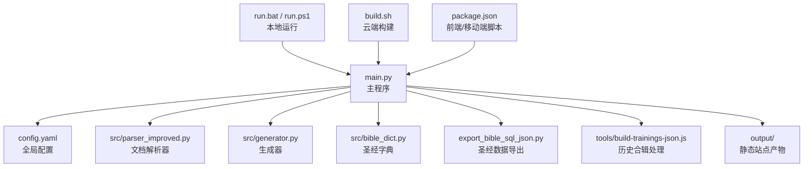
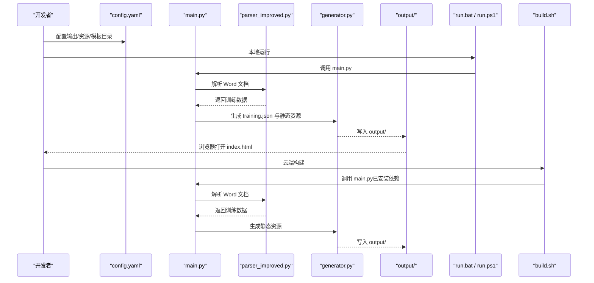
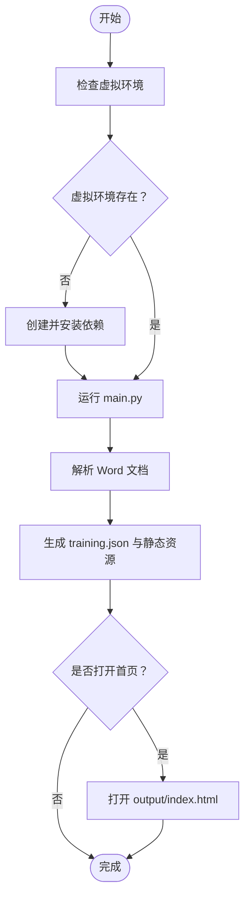
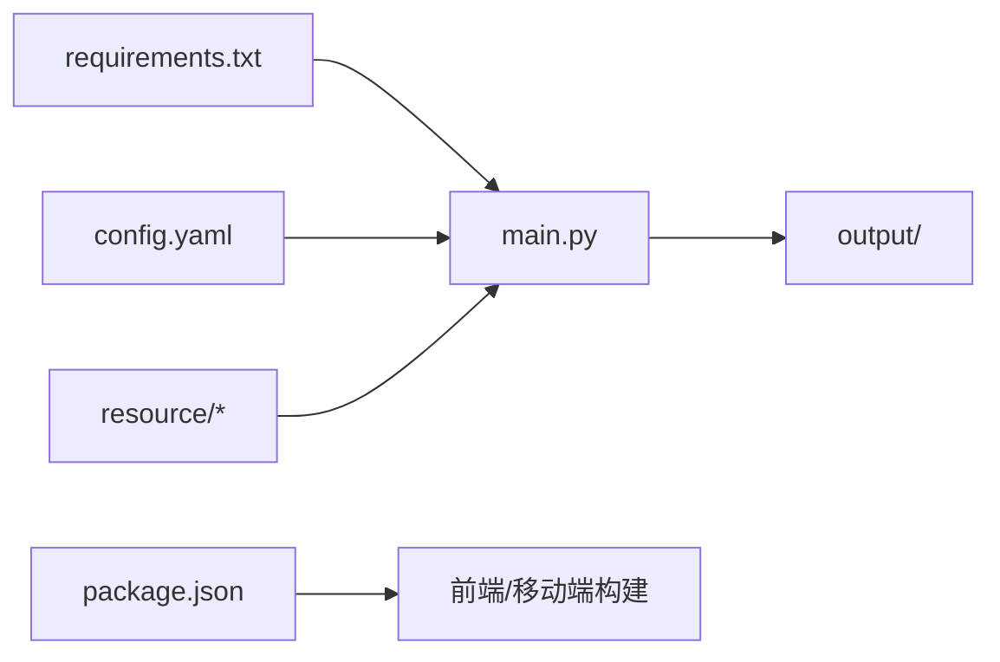

# 快速开始

<cite>
**本文引用的文件**   
- [QUICK_START.md](file://QUICK_START.md)
- [requirements.txt](file://requirements.txt)
- [package.json](file://package.json)
- [main.py](file://main.py)
- [config.yaml](file://config.yaml)
- [run.bat](file://run.bat)
- [run.ps1](file://run.ps1)
- [build.sh](file://build.sh)
- [app_config.json](file://app_config.json)
- [src/parser_improved.py](file://src/parser_improved.py)
- [down_resource.py](file://down_resource.py)
</cite>

## 目录
1. [简介](#简介)
2. [项目结构](#项目结构)
3. [核心组件](#核心组件)
4. [架构概览](#架构概览)
5. [详细组件分析](#详细组件分析)
6. [依赖关系分析](#依赖关系分析)
7. [性能考虑](#性能考虑)
8. [故障排除指南](#故障排除指南)
9. [结论](#结论)
10. [附录](#附录)

## 简介
本指南面向首次接触 CX 项目的用户，帮助你在本地或云端快速完成环境准备、依赖安装与首次运行。项目支持本地开发与 Cloudflare Pages 一键部署，既可作为静态站点生成器，也可作为安卓应用的前端资源构建工具。

## 项目结构
- Python 主程序与配置
  - 主入口：main.py
  - 配置文件：config.yaml
  - 依赖声明：requirements.txt
  - 本地运行脚本：run.bat、run.ps1
  - 云端构建脚本：build.sh
- 前端与移动端相关
  - package.json（包含 Capacitor 与构建脚本）
  - app_config.json（应用版本与标识）
- 资源与工具
  - 资源目录：resource（按“年-月”命名的训练批次）
  - 工具脚本：tools/build-trainings-json.js（历史合辑处理）
  - 下载器：down_resource.py（可选，从 Notion 下载资源）

**图示来源**
- [main.py:655-800](file://main.py#L655-L800)
- [config.yaml:1-42](file://config.yaml#L1-L42)
- [run.bat:1-44](file://run.bat#L1-L44)
- [run.ps1:1-48](file://run.ps1#L1-L48)
- [build.sh:1-20](file://build.sh#L1-L20)
- [package.json:1-30](file://package.json#L1-L30)

**章节来源**
- [main.py:655-800](file://main.py#L655-L800)
- [config.yaml:1-42](file://config.yaml#L1-L42)
- [run.bat:1-44](file://run.bat#L1-L44)
- [run.ps1:1-48](file://run.ps1#L1-L48)
- [build.sh:1-20](file://build.sh#L1-L20)
- [package.json:1-30](file://package.json#L1-L30)

## 核心组件
- 配置系统
  - config.yaml 提供批处理开关、输出目录、资源目录、模板目录、默认训练参数以及远程服务器地址等。
- 文档解析与生成
  - main.py 负责扫描 resource 目录、解析 Word 文档、生成 training.json、SPA 主页与静态资源。
  - src/parser_improved.py 支持 .doc/.docx，.doc 通过 LibreOffice 转换或手动转换。
- 本地运行与云端构建
  - run.bat/run.ps1 用于本地一键运行。
  - build.sh 用于 Cloudflare Pages 环境安装依赖并生成静态文件。
- 前端与移动端
  - package.json 定义 Capacitor 与 Android 构建脚本，配合 main.py 生成的 output 目录。

**章节来源**
- [config.yaml:1-42](file://config.yaml#L1-L42)
- [main.py:205-314](file://main.py#L205-L314)
- [src/parser_improved.py:15-112](file://src/parser_improved.py#L15-L112)
- [run.bat:10-17](file://run.bat#L10-L17)
- [run.ps1:10-16](file://run.ps1#L10-L16)
- [build.sh:11-17](file://build.sh#L11-L17)
- [package.json:5-15](file://package.json#L5-L15)

## 架构概览
下图展示从资源目录到最终静态站点产物的生成流程，以及本地与云端两种运行方式：

**图示来源**
- [main.py:655-800](file://main.py#L655-L800)
- [src/parser_improved.py:15-112](file://src/parser_improved.py#L15-L112)
- [config.yaml:1-42](file://config.yaml#L1-L42)
- [run.bat:22-22](file://run.bat#L22-L22)
- [run.ps1:22-22](file://run.ps1#L22-L22)
- [build.sh:11-17](file://build.sh#L11-L17)

## 详细组件分析

### 环境与依赖准备
- Python 环境
  - 建议使用 Python 3.10+，可参考 requirements.txt 中的最小依赖集合。
  - 本地运行脚本会检查虚拟环境是否存在，不存在则提示先创建并安装依赖。
- Node.js 与前端依赖
  - package.json 定义了 Capacitor 与构建脚本，如需生成安卓应用或进行前端构建，需安装 Node.js 并执行 npm/yarn 安装依赖。
- 云端部署（Cloudflare Pages）
  - build.sh 会自动 pip 安装 requirements.txt，并运行 main.py 生成 output 目录。

**章节来源**
- [requirements.txt:1-16](file://requirements.txt#L1-L16)
- [package.json:1-30](file://package.json#L1-L30)
- [run.bat:10-17](file://run.bat#L10-L17)
- [run.ps1:10-16](file://run.ps1#L10-L16)
- [build.sh:11-17](file://build.sh#L11-L17)

### 首次运行流程（本地）
- 准备资源
  - 在 resource 目录下按“年-月”命名批次文件夹，包含“经文.docx/听抄.docx/晨兴*.docx”等文档。
- 配置文件
  - config.yaml 中可调整输出目录、资源目录、模板目录、默认训练参数等。
- 本地运行
  - Windows：双击 run.bat 或在 CMD 中执行。
  - macOS/Linux/PowerShell：执行 run.ps1。
  - 脚本会检查虚拟环境，不存在则提示先创建并安装依赖，再运行 main.py。
- 验证结果
  - 生成成功后会提示 output 目录中包含 index.html，可选择在浏览器中打开。

**图示来源**
- [run.bat:10-17](file://run.bat#L10-L17)
- [run.ps1:10-16](file://run.ps1#L10-L16)
- [main.py:655-800](file://main.py#L655-L800)

**章节来源**
- [config.yaml:1-42](file://config.yaml#L1-L42)
- [run.bat:10-17](file://run.bat#L10-L17)
- [run.ps1:10-16](file://run.ps1#L10-L16)
- [main.py:655-800](file://main.py#L655-L800)

### 首次运行流程（云端 Cloudflare Pages）
- 配置项目
  - 在 Pages 中连接 GitHub 仓库，设置生产分支为 main，构建命令为 chmod +x build.sh && ./build.sh，输出目录为 output。
  - 添加环境变量：PYTHON_VERSION=3.9、DEBIAN_FRONTEND=noninteractive。
- 部署触发
  - 推送代码后，Cloudflare 会自动安装依赖并运行 main.py，生成 output 目录。
- 验证结果
  - 部署完成后获得 pages.dev 域名，访问即可查看站点。

**章节来源**
- [QUICK_START.md:16-48](file://QUICK_START.md#L16-L48)
- [build.sh:11-17](file://build.sh#L11-L17)

### 文档解析与兼容性
- 支持格式
  - .docx：直接解析。
  - .doc：尝试通过 LibreOffice 转换为 .docx；若失败，提供手动转换或安装 LibreOffice 的指引。
- 资源目录扫描
  - main.py 会扫描 resource 子目录，按“年-月”规则识别批次，生成对应 training.json 与静态资源。

**章节来源**
- [src/parser_improved.py:15-112](file://src/parser_improved.py#L15-L112)
- [main.py:134-156](file://main.py#L134-L156)
- [main.py:205-314](file://main.py#L205-L314)

### 前端与移动端集成
- Capacitor 脚本
  - package.json 提供初始化、添加平台、同步与打开 Android 工程的脚本，结合 main.py 生成的 output 目录使用。
- 应用配置
  - app_config.json 包含应用名称、ID 与版本号，可用于构建或发布流程。

**章节来源**
- [package.json:5-15](file://package.json#L5-L15)
- [app_config.json:1-5](file://app_config.json#L1-L5)

## 依赖关系分析
- Python 依赖
  - requirements.txt 列出运行所需的核心库，如 python-docx、PyYAML、Jinja2、Pillow、requests、beautifulsoup4、lxml、playwright、cryptography 等。
- Node.js 依赖
  - package.json 定义 Capacitor 生态与前端工具，如 @capacitor/core、@capacitor/cli、@capacitor/android 等。
- 运行时耦合
  - main.py 依赖 config.yaml 的配置项；解析器依赖 Word 文档格式；生成器依赖模板与静态资源目录。

**图示来源**
- [requirements.txt:1-16](file://requirements.txt#L1-L16)
- [package.json:1-30](file://package.json#L1-L30)
- [config.yaml:1-42](file://config.yaml#L1-L42)
- [main.py:655-800](file://main.py#L655-L800)

**章节来源**
- [requirements.txt:1-16](file://requirements.txt#L1-L16)
- [package.json:1-30](file://package.json#L1-L30)
- [config.yaml:1-42](file://config.yaml#L1-L42)
- [main.py:655-800](file://main.py#L655-L800)

## 性能考虑
- 批量处理优化
  - config.yaml 支持限制最新批次数量，避免打包体积过大。
- 资源包生成
  - 历史训练按 10 年分组打包，不含图片，减小体积。
- 云端构建
  - build.sh 在 Pages 环境中运行，注意无法安装 LibreOffice，需确保文档为 .docx 格式。

**章节来源**
- [config.yaml:2-6](file://config.yaml#L2-L6)
- [main.py:548-653](file://main.py#L548-L653)
- [build.sh:8-10](file://build.sh#L8-L10)

## 故障排除指南
- 本地运行报错：虚拟环境不存在
  - 现象：run.bat/run.ps1 提示虚拟环境不存在。
  - 处理：先创建虚拟环境并安装 requirements.txt 中的依赖，再重试。
- 文档格式问题：.doc 无法解析
  - 现象：解析器提示无法转换 .doc。
  - 处理：将 .doc 手动另存为 .docx，或安装 LibreOffice 后重试。
- 云端部署失败：LibreOffice 不可用
  - 现象：Pages 构建环境无法安装 LibreOffice。
  - 处理：确保所有文档为 .docx 格式。
- 配置错误：未找到资源目录或批次
  - 现象：main.py 报告未找到资源目录或批次。
  - 处理：确认 resource 目录结构与“年-月”命名规范一致。

**章节来源**
- [run.bat:10-17](file://run.bat#L10-L17)
- [run.ps1:10-16](file://run.ps1#L10-L16)
- [src/parser_improved.py:82-102](file://src/parser_improved.py#L82-L102)
- [build.sh:8-10](file://build.sh#L8-L10)
- [main.py:753-756](file://main.py#L753-L756)

## 结论
通过本快速开始指南，你可以在本地或云端完成环境准备、依赖安装与首次运行。建议优先使用 Cloudflare Pages 一键部署，或在本地使用 run.bat/run.ps1 进行验证。遇到问题时，优先检查资源格式（统一为 .docx）、虚拟环境与配置文件，确保 Pages 构建命令与输出目录正确。

## 附录

### 常用命令速查
- 本地运行（Windows）
  - 双击 run.bat 或在 CMD 中执行。
- 本地运行（PowerShell/macOS/Linux）
  - 执行 run.ps1。
- 云端构建
  - 确保构建命令为 chmod +x build.sh && ./build.sh，输出目录为 output。
- 前端/移动端
  - 安装 Node.js 后执行 npm/yarn 安装依赖，使用 package.json 中的脚本进行 Capacitor 初始化与构建。

**章节来源**
- [run.bat:1-44](file://run.bat#L1-L44)
- [run.ps1:1-48](file://run.ps1#L1-L48)
- [build.sh:1-20](file://build.sh#L1-L20)
- [package.json:1-30](file://package.json#L1-L30)