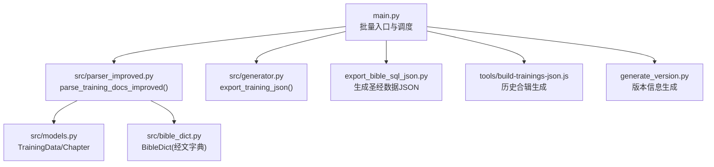
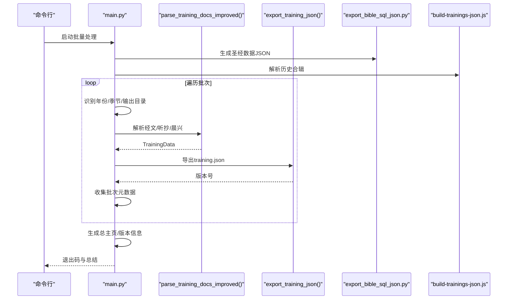
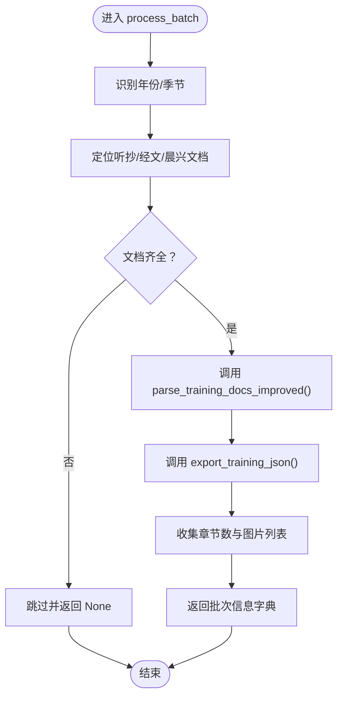
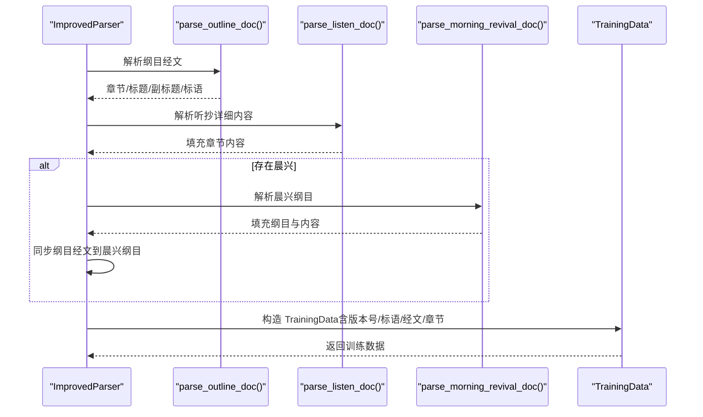
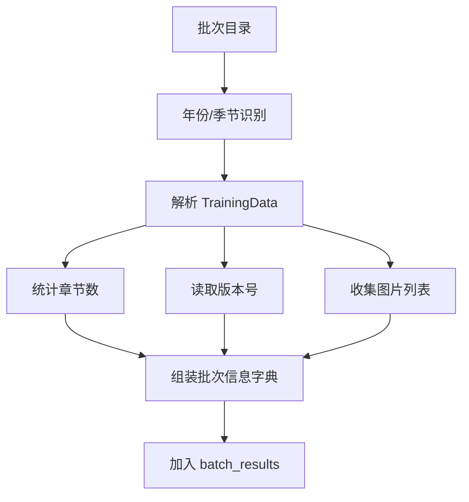
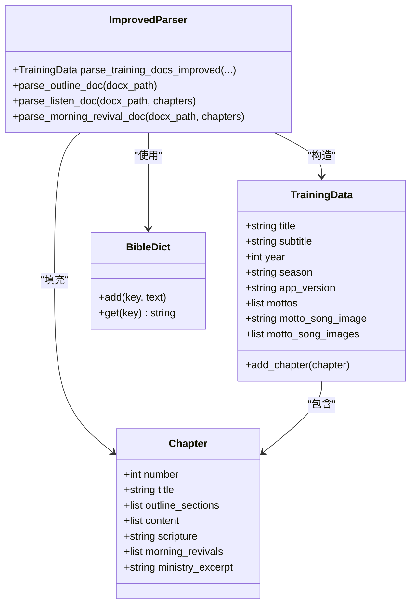
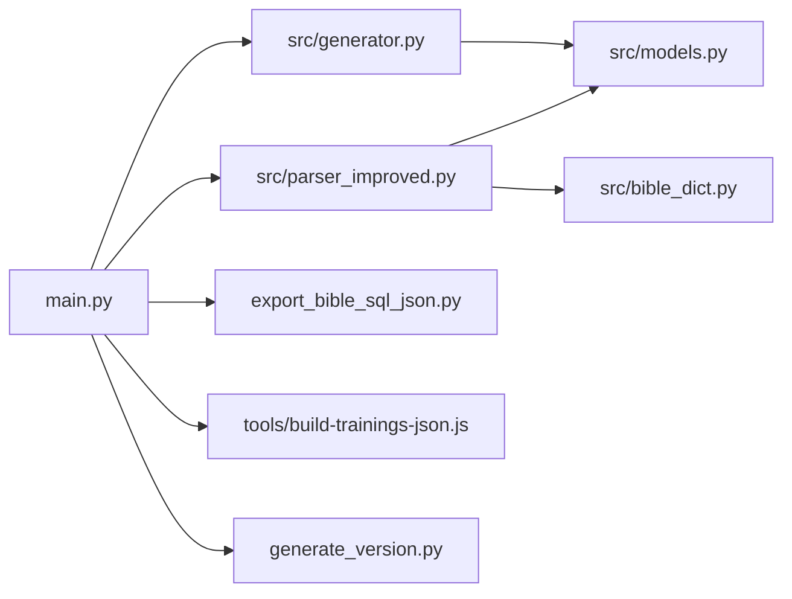

# 批量处理引擎

<cite>
**本文引用的文件**
- [main.py](file://main.py)
- [parser_improved.py](file://src/parser_improved.py)
- [models.py](file://src/models.py)
- [bible_dict.py](file://src/bible_dict.py)
- [generator.py](file://src/generator.py)
- [export_bible_sql_json.py](file://export_bible_sql_json.py)
- [build-trainings-json.js](file://tools/build-trainings-json.js)
- [generate_version.py](file://generate_version.py)
</cite>

## 目录
1. [简介](#简介)
2. [项目结构](#项目结构)
3. [核心组件](#核心组件)
4. [架构总览](#架构总览)
5. [详细组件分析](#详细组件分析)
6. [依赖关系分析](#依赖关系分析)
7. [性能考量](#性能考量)
8. [故障排查指南](#故障排查指南)
9. [结论](#结论)
10. [附录](#附录)

## 简介
本文件面向 CX 项目的批量处理引擎，系统性阐述 process_batch 函数的完整处理流程、错误处理与状态管理，详解 parse_training_docs_improved 的调用链与经文/听抄/晨兴文档解析整合过程，说明批次信息收集与返回机制（年份季节识别、章节统计、版本号生成等），并提供性能优化建议、大规模数据处理最佳实践以及进度监控与异常调试方法。

## 项目结构
- 批量入口与调度：main.py
- 文档解析与整合：src/parser_improved.py
- 数据模型：src/models.py
- 经文字典（跨章节缓存）：src/bible_dict.py
- JSON 导出：src/generator.py
- 圣经数据导出：export_bible_sql_json.py
- 历史合辑生成：tools/build-trainings-json.js
- 版本信息生成：generate_version.py

图表来源
- [main.py](file://main.py)
- [parser_improved.py](file://src/parser_improved.py)
- [models.py](file://src/models.py)
- [bible_dict.py](file://src/bible_dict.py)
- [generator.py](file://src/generator.py)
- [export_bible_sql_json.py](file://export_bible_sql_json.py)
- [build-trainings-json.js](file://tools/build-trainings-json.js)
- [generate_version.py](file://generate_version.py)

章节来源
- [main.py](file://main.py)
- [parser_improved.py](file://src/parser_improved.py)
- [models.py](file://src/models.py)
- [bible_dict.py](file://src/bible_dict.py)
- [generator.py](file://src/generator.py)
- [export_bible_sql_json.py](file://export_bible_sql_json.py)
- [build-trainings-json.js](file://tools/build-trainings-json.js)
- [generate_version.py](file://generate_version.py)

## 核心组件
- 批量处理入口与调度：负责扫描资源目录、选择批次、控制并发与退出策略、汇总结果并生成主页与版本信息。
- 改进解析器：统一解析经文纲目、听抄详细内容与晨兴纲目，整合标语、经文范围缓存与跨章节还原。
- 数据模型：TrainingData/Chapter 等承载训练元数据与章节结构。
- 经文字典：跨章节“从略”还原与经文范围缓存。
- JSON 导出：将训练数据序列化为 training.json，并生成版本号。
- 圣经数据导出：从数据库生成标准化的圣经文本/注释/交叉引用 JSON。
- 历史合辑生成：解析历史合辑文本，生成历史 training.json。
- 版本信息生成：生成版本号文件，便于 SPA 模式与 CDN 缓存控制。

章节来源
- [main.py](file://main.py)
- [parser_improved.py](file://src/parser_improved.py)
- [models.py](file://src/models.py)
- [bible_dict.py](file://src/bible_dict.py)
- [generator.py](file://src/generator.py)
- [export_bible_sql_json.py](file://export_bible_sql_json.py)
- [build-trainings-json.js](file://tools/build-trainings-json.js)
- [generate_version.py](file://generate_version.py)

## 架构总览
批量处理引擎采用“入口调度 + 文档解析 + 数据导出”的分层架构。入口负责批次发现、条件筛选、进度与错误统计；解析器负责多源文档的结构化抽取与整合；导出器负责生成最终产物与元数据。

图表来源
- [main.py](file://main.py)
- [parser_improved.py](file://src/parser_improved.py)
- [generator.py](file://src/generator.py)
- [export_bible_sql_json.py](file://export_bible_sql_json.py)
- [build-trainings-json.js](file://tools/build-trainings-json.js)

## 详细组件分析

### process_batch：单批次完整处理流程
- 输入：批次目录路径、全局配置、可选经文字典
- 关键步骤
  - 年份/季节识别：从文件夹名解析年份与季节，若失败则使用默认配置
  - 文档定位：查找听抄、经文、晨兴（支持编号）文档
  - 解析执行：调用 parse_training_docs_improved，按顺序解析纲目、听抄、晨兴，并进行纲目与晨兴经文同步
  - JSON 导出：调用 export_training_json 生成 training.json，并记录版本号
  - 元数据收集：统计章节数量、收集 images 列表
  - 返回：批次信息字典（name/year/season/title/chapter_count/path/images/version）
- 错误处理
  - 文档缺失：跳过当前批次并返回 None
  - 解析异常：捕获异常并打印堆栈，返回 None
  - 导出异常：捕获异常并打印堆栈，返回 None
- 状态管理
  - 使用经文字典在解析过程中缓存与还原“从略”经文范围
  - 重置解析状态，避免跨批次污染

图表来源
- [main.py](file://main.py)
- [parser_improved.py](file://src/parser_improved.py)
- [generator.py](file://src/generator.py)

章节来源
- [main.py:205-313](file://main.py#L205-L313)
- [main.py:266-283](file://main.py#L266-L283)
- [main.py:285-294](file://main.py#L285-L294)
- [main.py:296-313](file://main.py#L296-L313)

### parse_training_docs_improved：经文/听抄/晨兴解析与整合
- 调用顺序
  - 解析纲目（经文.docx）：建立章节与纲目层级结构，提取标题/副标题/标语
  - 解析听抄（听抄.docx）：填充详细内容
  - 解析晨兴（可选，支持编号）：填充纲目与内容
  - 纲目与晨兴经文同步：构建纲目经文映射并填充到每日晨兴纲目
  - 读取应用版本号：从 app_config.json 获取版本号
  - 标语诗歌图片复制：从资源目录复制到输出 images
  - 构造 TrainingData：汇总标题、副标题、年份、季节、标语、经文、章节等
- 经文处理
  - “从略”占位符：通过经文字典与缓存恢复范围经文
  - 经文范围缓存：verse_cache 与持久化 BibleDict 双层缓存
- 标语与副标题
  - 标语区域识别与清理，避免重复与噪声
  - 副标题多行合并与停靠条件
- 标题识别策略
  - 多候选组合匹配“训练/特会”
  - 时间相关组合（年份）
  - 路径推断（常见训练类型关键词）

图表来源
- [parser_improved.py:2545-2662](file://src/parser_improved.py#L2545-L2662)
- [parser_improved.py:366-540](file://src/parser_improved.py#L366-L540)
- [parser_improved.py:2582-2594](file://src/parser_improved.py#L2582-L2594)
- [parser_improved.py:2595-2607](file://src/parser_improved.py#L2595-L2607)
- [parser_improved.py:2608-2646](file://src/parser_improved.py#L2608-L2646)

章节来源
- [parser_improved.py:2545-2662](file://src/parser_improved.py#L2545-L2662)
- [parser_improved.py:366-540](file://src/parser_improved.py#L366-L540)
- [parser_improved.py:2582-2594](file://src/parser_improved.py#L2582-L2594)
- [parser_improved.py:2595-2607](file://src/parser_improved.py#L2595-L2607)
- [parser_improved.py:2608-2646](file://src/parser_improved.py#L2608-L2646)

### 批次信息收集与返回机制
- 年份/季节识别：从文件夹名解析“YYYY-SS”或“YYYY-MM”，否则使用默认配置
- 章节统计：基于 TrainingData.chapters 数量
- 版本号生成：由 export_training_json 返回，结合 app_config.json.version
- 图片收集：遍历 images 目录，收集 PNG/JPG/JPEG/GIF
- 元数据聚合：在 main.py 中收集每个批次的 name/year/season/title/chapter_count/path/images/version，用于生成总主页与版本信息

图表来源
- [main.py:205-313](file://main.py#L205-L313)
- [main.py:818-843](file://main.py#L818-L843)
- [generator.py:381-410](file://src/generator.py#L381-L410)

章节来源
- [main.py:205-313](file://main.py#L205-L313)
- [main.py:818-843](file://main.py#L818-L843)
- [generator.py:381-410](file://src/generator.py#L381-L410)

### 数据模型与类关系
- TrainingData：承载训练标题、副标题、年份、季节、标语、经文、章节等
- Chapter：承载单篇章节的纲目、内容、经文、晨兴纲目等
- ImprovedParser：负责解析与整合
- BibleDict：持久化经文字典，支持跨章节“从略”还原

图表来源
- [models.py](file://src/models.py)
- [parser_improved.py](file://src/parser_improved.py)
- [bible_dict.py](file://src/bible_dict.py)

章节来源
- [models.py](file://src/models.py)
- [parser_improved.py](file://src/parser_improved.py)
- [bible_dict.py](file://src/bible_dict.py)

## 依赖关系分析
- main.py 依赖
  - parse_training_docs_improved：文档解析
  - export_training_json：JSON 导出
  - export_bible_sql_json.py：圣经数据准备
  - build-trainings-json.js：历史合辑
  - generate_version.py：版本信息
- parser_improved.py 依赖
  - models.TrainingData/Chapter：数据结构
  - bible_dict.BibleDict：经文缓存
- generator.py 依赖
  - models.TrainingData：序列化
  - app_config.json：版本号来源

图表来源
- [main.py](file://main.py)
- [parser_improved.py](file://src/parser_improved.py)
- [models.py](file://src/models.py)
- [bible_dict.py](file://src/bible_dict.py)
- [generator.py](file://src/generator.py)
- [export_bible_sql_json.py](file://export_bible_sql_json.py)
- [build-trainings-json.js](file://tools/build-trainings-json.js)
- [generate_version.py](file://generate_version.py)

章节来源
- [main.py](file://main.py)
- [parser_improved.py](file://src/parser_improved.py)
- [models.py](file://src/models.py)
- [bible_dict.py](file://src/bible_dict.py)
- [generator.py](file://src/generator.py)
- [export_bible_sql_json.py](file://export_bible_sql_json.py)
- [build-trainings-json.js](file://tools/build-trainings-json.js)
- [generate_version.py](file://generate_version.py)

## 性能考量
- 批次筛选与顺序
  - 仅保留最新 N 个批次，减少打包体积与处理时间
  - 按时间排序处理，便于日志阅读与问题定位
- 圣经数据预处理
  - 提前生成并压缩圣经 JSON，避免运行时 IO
- 并发与容错
  - 单线程批处理，避免多进程竞争资源
  - 失败批次不影响其他批次（可配置严格模式）
- I/O 优化
  - 经文范围缓存与持久化字典减少重复解析
  - 图片复制集中处理，避免重复拷贝
- 日志与进度
  - 每批次独立日志，关键步骤打印进度与统计

章节来源
- [main.py:721-751](file://main.py#L721-L751)
- [main.py:766-791](file://main.py#L766-L791)
- [main.py:806-896](file://main.py#L806-L896)
- [parser_improved.py:292-364](file://src/parser_improved.py#L292-L364)

## 故障排查指南
- 常见问题
  - 未找到听抄/经文文档：process_batch 会跳过并返回 None
  - 文档解析失败：捕获异常并打印堆栈，返回 None
  - training.json 生成失败：捕获异常并打印堆栈，返回 None
  - 圣经数据 JSON 生成失败：检查 export_bible_sql_json.py 脚本与数据库访问
  - 历史合辑生成失败：检查 Node 环境与 build-trainings-json.js 脚本
- 调试建议
  - 启用详细日志：关注每一步的“✓/⚠/✗”提示
  - 检查输出目录：确认 training.json、images、data 是否生成
  - 验证 app_config.json：确保版本号字段存在
  - 分离测试：先单独运行 parse_training_docs_improved，再运行 export_training_json
- 退出码策略
  - 全部成功：0
  - 全部失败：1
  - 部分失败：默认 0（CI 持续打包友好），可通过配置切换严格模式

章节来源
- [main.py:246-283](file://main.py#L246-L283)
- [main.py:288-292](file://main.py#L288-L292)
- [main.py:776-781](file://main.py#L776-L781)
- [main.py:796-804](file://main.py#L796-L804)
- [main.py:881-896](file://main.py#L881-L896)

## 结论
批量处理引擎通过清晰的分层设计与稳健的错误处理，实现了从多源文档到结构化 JSON 的自动化生产。process_batch 与 parse_training_docs_improved 的协作保证了经文、听抄、晨兴的高质量整合；BibleDict 与缓存机制有效提升了“从略”还原的准确性与性能；main.py 的调度与汇总能力确保了大规模数据处理的可控性与可观测性。

## 附录
- 最佳实践
  - 保持批次命名规范（YYYY-SS/ YYYY-MM），便于自动识别
  - 预先生成圣经数据 JSON，缩短运行时等待
  - 使用 skip_existing 跳过已生成的批次，提高增量处理效率
  - 在 CI 环境中启用严格模式，确保失败即停
- 监控与排障清单
  - 检查资源目录结构与文件存在性
  - 核对 app_config.json 版本号
  - 关注日志中的“✓/⚠/✗”提示与异常堆栈
  - 验证输出目录权限与磁盘空间