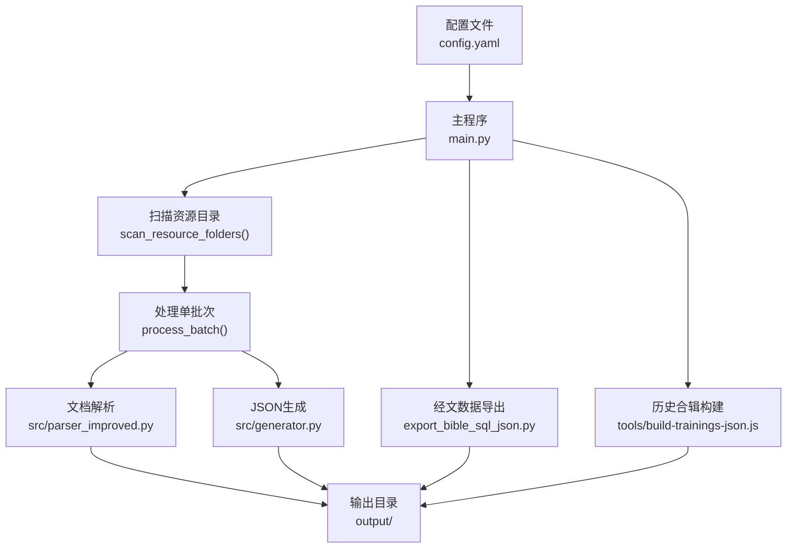
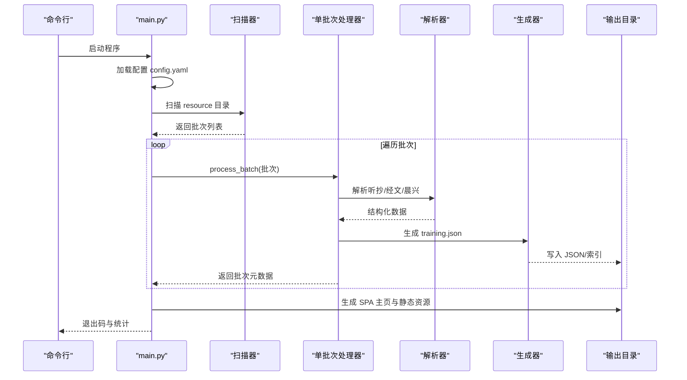
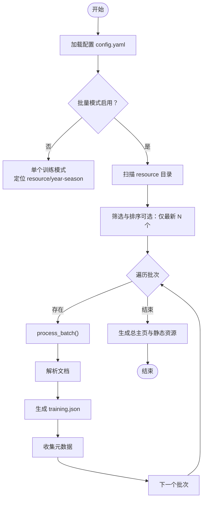
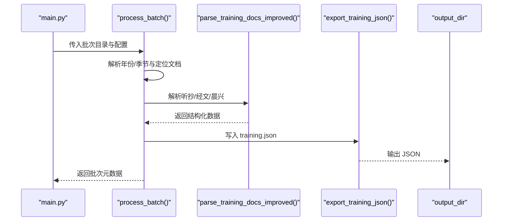
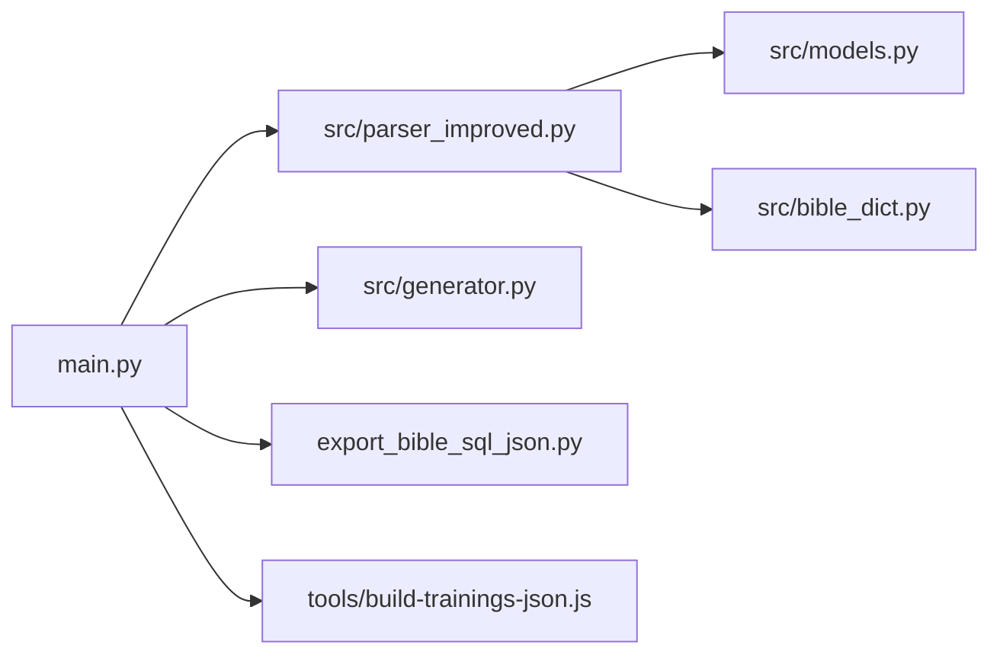

# 批量处理系统

<cite>
**本文引用的文件**   
- [main.py](file://main.py)
- [config.yaml](file://config.yaml)
- [parser_improved.py](file://src/parser_improved.py)
- [generator.py](file://src/generator.py)
- [bible_dict.py](file://src/bible_dict.py)
- [export_bible_sql_json.py](file://export_bible_sql_json.py)
- [build-trainings-json.js](file://tools/build-trainings-json.js)
- [encrypt_app_update.py](file://encrypt_app_update.py)
- [generate_version.py](file://generate_version.py)
</cite>

## 目录
1. [简介](#简介)
2. [项目结构](#项目结构)
3. [核心组件](#核心组件)
4. [架构总览](#架构总览)
5. [详细组件分析](#详细组件分析)
6. [依赖分析](#依赖分析)
7. [性能考虑](#性能考虑)
8. [故障排查指南](#故障排查指南)
9. [结论](#结论)
10. [附录](#附录)

## 简介
本文件面向 CX 项目的“批量处理系统”，聚焦于 main.py 的批量处理逻辑，系统性阐述以下内容：
- 如何扫描与处理多个训练批次的 Word 文档
- config.yaml 的各项参数及其作用域
- 自动化流程控制机制（错误处理、进度跟踪、资源清理）
- 配置示例与典型使用场景
- 性能优化建议与大规模数据处理最佳实践

## 项目结构
本项目采用“配置驱动 + 批量扫描 + 文档解析 + 静态站点生成”的分层组织方式：
- 配置层：config.yaml 提供批量处理开关、输出路径、远程服务器等全局参数
- 批处理层：main.py 负责扫描资源目录、选择批次、逐批处理、汇总生成
- 解析层：src/parser_improved.py 负责 Word 文档解析与结构化
- 生成层：src/generator.py 负责生成 training.json 与搜索索引
- 数据准备：export_bible_sql_json.py 生成经文字典 JSON，供解析阶段使用
- 历史合辑：tools/build-trainings-json.js 生成历史训练集合
- 辅助工具：encrypt_app_update.py、generate_version.py 等

图表来源
- [main.py:134-156](file://main.py#L134-L156)
- [main.py:205-313](file://main.py#L205-L313)
- [parser_improved.py:15-47](file://src/parser_improved.py#L15-L47)
- [generator.py](file://src/generator.py)
- [export_bible_sql_json.py](file://export_bible_sql_json.py)
- [build-trainings-json.js](file://tools/build-trainings-json.js)

章节来源
- [main.py:134-156](file://main.py#L134-L156)
- [main.py:205-313](file://main.py#L205-L313)
- [config.yaml:1-42](file://config.yaml#L1-L42)

## 核心组件
- 批量处理入口与调度：main() 负责加载配置、选择处理模式（批量/单个）、扫描批次、逐批执行、汇总生成与退出码策略
- 扫描与筛选：scan_resource_folders() 扫描 resource 子目录，过滤历史合辑与隐藏项；支持“仅处理最新 N 个”策略
- 单批次处理：process_batch() 识别年份与季节、定位听抄/经文/晨兴文档、调用解析与生成、收集元数据
- 文档解析：parser_improved.py 负责 .doc/.docx 解析、跨章节引用还原、内容结构化
- JSON 生成：generator.py 生成 training.json 与搜索索引
- 经文数据准备：export_bible_sql_json.py 生成经文字典 JSON，供解析阶段使用
- 历史合辑：tools/build-trainings-json.js 生成历史训练集合
- 资源包打包：main.py 内部 generate_resource_packs() 将历史训练按 10 年分组打包，生成 resource-packs.json
- 静态站点生成：generate_main_index() 复制 SPA shell、共享资源、生成 manifest/sw/headers/redirects 等

章节来源
- [main.py:655-896](file://main.py#L655-L896)
- [main.py:134-156](file://main.py#L134-L156)
- [main.py:205-313](file://main.py#L205-L313)
- [parser_improved.py:15-47](file://src/parser_improved.py#L15-L47)
- [generator.py](file://src/generator.py)
- [export_bible_sql_json.py](file://export_bible_sql_json.py)
- [build-trainings-json.js](file://tools/build-trainings-json.js)

## 架构总览
批量处理系统遵循“配置驱动 + 批次扫描 + 单批次处理 + 元数据汇总 + 静态站点生成”的闭环流程。

图表来源
- [main.py:655-896](file://main.py#L655-L896)
- [main.py:134-156](file://main.py#L134-L156)
- [main.py:205-313](file://main.py#L205-L313)
- [parser_improved.py:15-47](file://src/parser_improved.py#L15-L47)
- [generator.py](file://src/generator.py)

## 详细组件分析

### 批量处理逻辑与控制流
- 配置加载与模式切换
  - 批量处理开关：batch_processing.enabled 控制是否进入批量模式
  - 单个训练模式：当 disabled 时，按 default_training 推断年份与季节，定位 resource/年份-季节 目录进行处理
- 扫描与筛选
  - scan_resource_folders() 跳过历史合辑与隐藏目录，返回排序后的子目录列表
  - “仅处理最新 N 个”策略：按文件夹名提取年月，时间倒序取前 N 个，其余按原顺序补齐
- 单批次处理
  - process_batch() 识别年份与季节、定位必需文档（听抄/经文）、可选文档（晨兴系列）
  - 调用 parse_training_docs_improved() 生成结构化数据，再 export_training_json() 写入 training.json
  - 收集图片列表用于元数据
- 汇总与生成
  - generate_main_index() 合并本次与历史训练，生成 trainings.json、SPA 主页与静态资源
  - generate_resource_packs() 生成历史训练资源包与清单
- 退出码策略
  - 全部成功：0；全部失败：1；部分失败：
    - 默认：0（便于 CI 持续打包）
    - 严格模式：strict_exit_on_batch_failure=true 时返回 1

图表来源
- [main.py:655-896](file://main.py#L655-L896)
- [main.py:134-156](file://main.py#L134-L156)
- [main.py:205-313](file://main.py#L205-L313)

章节来源
- [main.py:655-896](file://main.py#L655-L896)
- [config.yaml:2-7](file://config.yaml#L2-L7)

### 配置文件详解（config.yaml）
- 批量处理选项
  - enabled：是否启用批量处理（默认开启）
  - skip_existing：是否跳过已存在的 training.json（用于增量处理）
  - strict_exit_on_batch_failure：严格失败退出策略（默认宽松）
  - max_latest_trainings：仅处理最新 N 个批次（用于控制打包体积）
  - specific_trainings：指定处理的批次名列表（注释掉表示处理全部）
- 全局路径
  - output_dir：输出根目录（默认 output）
  - resource_base_dir：资源根目录（默认 resource）
  - template_dir：模板目录（默认 src/templates）
  - static_dir：静态资源目录（默认 src/static）
- 默认训练配置
  - default_training.year / default_training.season：当无法从文件夹名识别时的后备值
- 远程服务器配置
  - remote_servers：用于生成 output/js/remote-config.js 的服务器列表（Cloudflare、GitHub API/Mirrors、推送、IP 查询）

章节来源
- [config.yaml:1-42](file://config.yaml#L1-L42)

### 文档扫描与定位策略
- 单文件定位：find_document() 支持 .doc/.docx 两种扩展名尝试
- 文件夹内定位：find_document_in_folder() 在指定目录按基础名查找
- 编号文档序列：find_all_numbered_documents() 支持“晨兴2/3/4…”等编号序列，遇到缺失即停止
- 批次命名规则：extract_year_month_from_folder() 从“YYYY-MM 名称”中提取年月；url_safe_name() 生成 URL 安全的输出目录名

章节来源
- [main.py:60-131](file://main.py#L60-L131)
- [main.py:159-203](file://main.py#L159-L203)

### 单批次处理流程（process_batch）
- 年份与季节推断：优先从文件夹名解析，失败则使用 default_training
- 必需文档检查：听抄/经文必须存在，否则跳过该批次
- 可选文档处理：晨兴文档按编号序列处理，缺失即终止
- 输出目录：基于安全文件名生成子目录
- 数据生成：parse_training_docs_improved() → export_training_json()
- 元数据收集：统计章节数、图片列表、版本号等

图表来源
- [main.py:205-313](file://main.py#L205-L313)
- [parser_improved.py:15-47](file://src/parser_improved.py#L15-L47)
- [generator.py](file://src/generator.py)

章节来源
- [main.py:205-313](file://main.py#L205-L313)

### 历史合辑与静态站点生成
- 历史合辑：tools/build-trainings-json.js 生成历史训练集合，main.py 在批量处理前调用该脚本
- 经文数据：export_bible_sql_json.py 生成经文字典 JSON，供解析阶段使用
- 总主页：generate_main_index() 复制 SPA shell、共享 JS/CSS、生成 manifest/sw/headers/redirects 等
- 资源包：generate_resource_packs() 将历史训练按 10 年分组打包，生成 resource-packs.json

章节来源
- [main.py:793-805](file://main.py#L793-L805)
- [main.py:763-791](file://main.py#L763-L791)
- [main.py:317-546](file://main.py#L317-L546)
- [main.py:548-652](file://main.py#L548-L652)

### 错误处理、进度跟踪与资源清理
- 错误处理
  - 单批次异常捕获：process_batch() 捕获解析与生成异常并返回 None
  - 汇总异常：generate_main_index() 捕获异常并记录警告
  - 退出码策略：根据成功/失败数量与 strict_exit_on_batch_failure 决定返回码
- 进度跟踪
  - 控制台打印批次状态、成功/失败计数、输出路径
  - 历史合辑与经文数据导出阶段分别输出进度提示
- 资源清理
  - 资源包生成前清理旧 ZIP，避免策略变更导致僵尸包残留
  - 资源包打包时跳过 images/ 目录，降低体积

章节来源
- [main.py:277-283](file://main.py#L277-L283)
- [main.py:857-860](file://main.py#L857-L860)
- [main.py:881-896](file://main.py#L881-L896)
- [main.py:561-564](file://main.py#L561-L564)
- [main.py:623-627](file://main.py#L623-L627)

## 依赖分析
- 模块耦合
  - main.py 作为编排器，依赖解析器、生成器、经文数据导出、历史合辑构建等模块
  - 解析器与生成器对 models.py 的数据结构有强依赖
- 外部依赖
  - LibreOffice（soffice/libreoffice）用于 .doc 转换（跨平台）
  - Node.js 用于历史合辑构建脚本
- 潜在循环依赖
  - 当前结构清晰，未见循环导入

图表来源
- [main.py:655-896](file://main.py#L655-L896)
- [parser_improved.py:15-47](file://src/parser_improved.py#L15-L47)
- [generator.py](file://src/generator.py)
- [bible_dict.py](file://src/bible_dict.py)
- [export_bible_sql_json.py](file://export_bible_sql_json.py)
- [build-trainings-json.js](file://tools/build-trainings-json.js)

章节来源
- [main.py:655-896](file://main.py#L655-L896)
- [parser_improved.py:15-47](file://src/parser_improved.py#L15-L47)

## 性能考虑
- 批次筛选
  - 使用 max_latest_trainings 限制处理批次数量，显著降低打包体积与 CI 时间
- 文档解析
  - .doc 需要 LibreOffice 转换，建议在 CI 环境预装 soffice/libreoffice，避免重复安装开销
- 资源包
  - 资源包打包跳过 images/，减少体积；按 10 年分组，便于增量下载
- 增量处理
  - 启用 skip_existing 可跳过已生成的 training.json，提升迭代效率
- JS 混淆
  - CI 环境默认混淆，本地开发可禁用以提升调试效率（通过环境变量控制）

章节来源
- [main.py:721-751](file://main.py#L721-L751)
- [main.py:487-494](file://main.py#L487-L494)
- [main.py:561-564](file://main.py#L561-L564)
- [main.py:623-627](file://main.py#L623-L627)
- [config.yaml:4](file://config.yaml#L4)

## 故障排查指南
- 配置加载失败
  - 现象：打印配置加载失败并退出
  - 排查：确认 config.yaml 语法正确、编码为 UTF-8
- 未找到默认训练文件夹
  - 现象：单个训练模式下找不到 resource/year-season
  - 排查：检查 default_training.year/season 与实际目录是否一致
- 未找到必需文档
  - 现象：跳过该批次并提示未找到听抄/经文
  - 排查：确认批次目录下存在“听抄.doc(x)”、“经文.doc(x)”；若存在编号文档，确认命名规范
- 文档解析失败
  - 现象：打印解析异常并返回 None
  - 排查：查看异常堆栈；确认 LibreOffice 可用；检查 Word 文档格式与内容
- 历史合辑生成失败
  - 现象：历史合辑生成失败警告
  - 排查：确认 Node.js 环境可用；检查 tools/build-trainings-json.js 是否存在
- 经文数据导出失败
  - 现象：程序退出并提示圣经数据 JSON 生成失败
  - 排查：确认 export_bible_sql_json.py 存在且可执行；检查数据库文件路径

章节来源
- [main.py:679-681](file://main.py#L679-L681)
- [main.py:693-695](file://main.py#L693-L695)
- [main.py:246-252](file://main.py#L246-L252)
- [main.py:279-283](file://main.py#L279-L283)
- [main.py:803-804](file://main.py#L803-L804)
- [main.py:779-781](file://main.py#L779-L781)

## 结论
本批量处理系统通过“配置驱动 + 批次扫描 + 单批次处理 + 元数据汇总 + 静态站点生成”的流水线，实现了对多批次 Word 文档的自动化处理。其特性包括：
- 灵活的处理模式（批量/单个）
- 智能的批次筛选（按时间与数量）
- 健壮的错误处理与退出码策略
- 高效的增量与资源包优化
- 可扩展的静态站点与历史合辑集成

## 附录

### 配置示例与使用场景
- 示例一：批量处理全部可用批次
  - batch_processing.enabled: true
  - batch_processing.max_latest_trainings: 0（不限制）
  - 适用于：全量重建或离线处理
- 示例二：仅处理最新 5 个批次
  - batch_processing.enabled: true
  - batch_processing.max_latest_trainings: 5
  - 适用于：CI 打包与增量发布
- 示例三：指定处理某几个批次
  - batch_processing.enabled: true
  - batch_processing.specific_trainings: ["2025-04 夏季训练", "2025-05 国际长老及负责弟兄训练"]
  - 适用于：局部修复或验证
- 示例四：单个训练模式
  - batch_processing.enabled: false
  - default_training.year: 2025
  - default_training.season: "秋季"
  - 适用于：快速验证新文档

章节来源
- [config.yaml:2-7](file://config.yaml#L2-L7)
- [config.yaml:15-22](file://config.yaml#L15-L22)

### 实际使用场景
- 场景一：季度发布
  - 设置 max_latest_trainings=5，CI 自动处理最新批次并生成静态站点
- 场景二：修复与回滚
  - 使用 specific_trainings 指定问题批次，快速重新生成
- 场景三：历史资源打包
  - 生成 resource-packs.json 与 ZIP 包，供用户离线下载

章节来源
- [main.py:703-716](file://main.py#L703-L716)
- [main.py:721-751](file://main.py#L721-L751)
- [main.py:548-652](file://main.py#L548-L652)