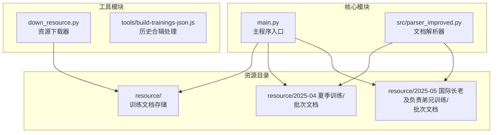
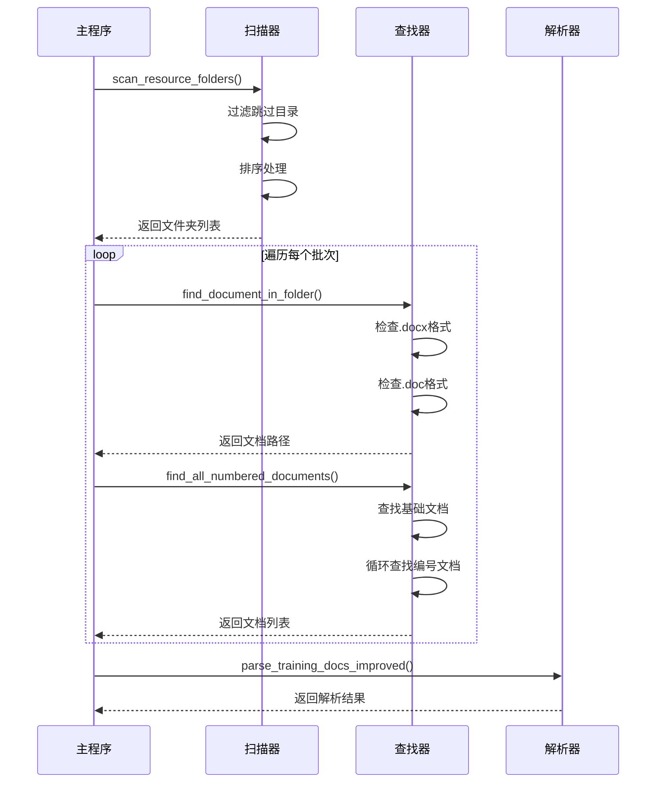
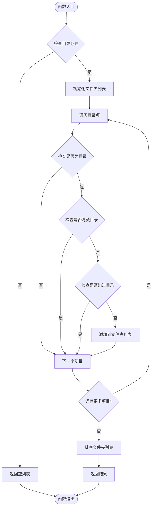
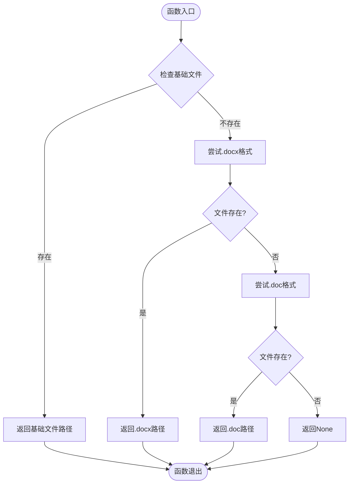
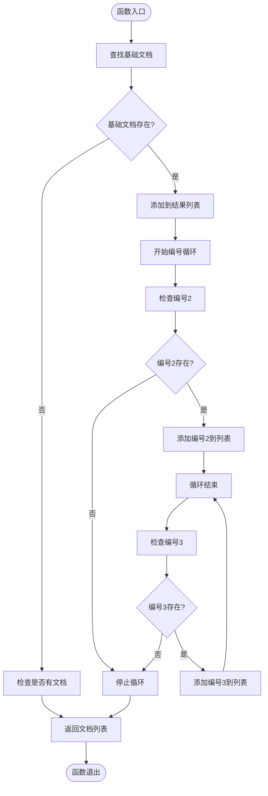
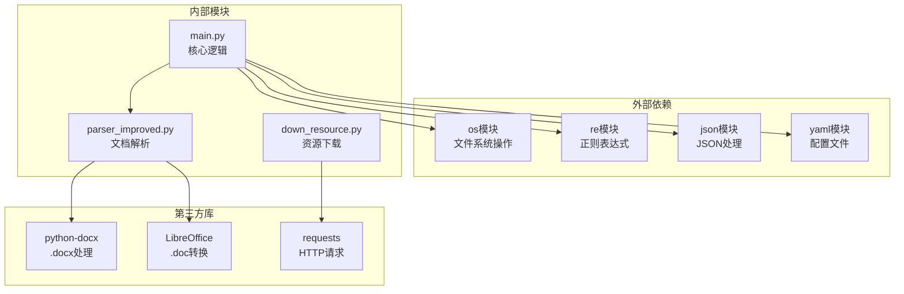

# 文档发现与扫描

<cite>
**本文档引用的文件**
- [main.py](file://main.py)
- [parser_improved.py](file://src/parser_improved.py)
- [down_resource.py](file://down_resource.py)
</cite>

## 目录
1. [简介](#简介)
2. [项目结构](#项目结构)
3. [核心组件](#核心组件)
4. [架构概览](#架构概览)
5. [详细组件分析](#详细组件分析)
6. [依赖分析](#依赖分析)
7. [性能考虑](#性能考虑)
8. [故障排除指南](#故障排除指南)
9. [结论](#结论)
10. [附录](#附录)

## 简介
本文档深入解析CX项目中"文档发现与扫描系统"的实现机制，重点涵盖以下功能：
- scan_resource_folders函数如何扫描resource目录下的子文件夹，包括文件夹命名规则、过滤逻辑和排序机制
- find_document和find_document_in_folder函数的文档查找算法，支持.doc和.docx格式的自动识别
- find_all_numbered_documents函数如何处理带编号的文档（如晨兴2、晨兴3）
- 文件夹命名规范和文档组织建议，展示如何正确放置训练文档以确保系统能够正确识别

该系统采用Python实现，结合正则表达式匹配、文件系统遍历和智能排序策略，为训练文档的批量处理提供了可靠的基础设施。

## 项目结构
CX项目采用模块化设计，文档发现与扫描系统主要分布在以下文件中：

**图表来源**
- [main.py:134-156](file://main.py#L134-L156)
- [main.py:205-313](file://main.py#L205-L313)

**章节来源**
- [main.py:1-901](file://main.py#L1-L901)

## 核心组件
文档发现与扫描系统包含三个核心函数，它们协同工作以实现完整的文档发现流程：

### 1. scan_resource_folders函数
负责扫描resource目录下的所有子文件夹，实现智能过滤和排序。

### 2. find_document_in_folder函数  
在指定文件夹内查找文档，支持.doc和.docx两种格式的自动识别。

### 3. find_all_numbered_documents函数
专门处理带编号的文档集合，如晨兴2、晨兴3等连续编号文档。

**章节来源**
- [main.py:86-131](file://main.py#L86-L131)
- [main.py:134-156](file://main.py#L134-L156)

## 架构概览
整个文档发现与扫描系统采用分层架构设计，确保功能模块的职责清晰分离：

**图表来源**
- [main.py:205-313](file://main.py#L205-L313)
- [main.py:655-896](file://main.py#L655-L896)

## 详细组件分析

### scan_resource_folders函数分析
scan_resource_folders函数实现了智能的文件夹扫描机制，具有以下特点：

#### 过滤逻辑
- 跳过隐藏目录（以"."开头的目录）
- 排除特定系统目录：{'bible', 'bible-db', 'bible2', '历史合辑'}
- 仅处理子目录，忽略文件

#### 排序机制
使用Python内置的sorted()函数对文件夹进行排序，确保处理顺序的一致性。

**图表来源**
- [main.py:134-156](file://main.py#L134-L156)

**章节来源**
- [main.py:134-156](file://main.py#L134-L156)

### find_document_in_folder函数分析
该函数实现了智能的文档查找算法，支持两种文档格式的自动识别：

#### 查找策略
1. 首先检查基础文件名（不带扩展名）
2. 依次尝试.docx和.doc两种扩展名
3. 使用os.path.exists()进行精确验证

#### 格式支持
- .docx格式：直接使用python-docx库处理
- .doc格式：通过LibreOffice转换为.docx格式

**图表来源**
- [main.py:86-101](file://main.py#L86-L101)

**章节来源**
- [main.py:86-101](file://main.py#L86-L101)

### find_all_numbered_documents函数分析
该函数专门处理带编号的文档集合，实现智能的连续编号识别：

#### 编号识别机制
1. 首先查找基础文档（如"晨兴"）
2. 从编号2开始循环查找（2到19）
3. 一旦某个编号不存在，立即停止查找

#### 处理逻辑
- 支持最多19个连续编号的文档
- 自动停止机制防止无限循环
- 返回按编号排序的文档列表

**图表来源**
- [main.py:104-131](file://main.py#L104-L131)

**章节来源**
- [main.py:104-131](file://main.py#L104-L131)

### 文档解析器集成分析
文档解析器在发现文档后进行深度处理，支持多种文档格式：

#### 格式支持
- .docx格式：直接使用python-docx库
- .doc格式：通过LibreOffice转换后处理

#### 解析特性
- 自动识别文档标题和副标题
- 提取经文内容和职事信息
- 支持中文数字转换
- 智能章节结构识别

**章节来源**
- [parser_improved.py:15-112](file://src/parser_improved.py#L15-L112)
- [parser_improved.py:744-800](file://src/parser_improved.py#L744-L800)

## 依赖分析
文档发现与扫描系统的主要依赖关系如下：

**图表来源**
- [main.py:1-17](file://main.py#L1-L17)
- [parser_improved.py:1-12](file://src/parser_improved.py#L1-L12)

**章节来源**
- [main.py:1-17](file://main.py#L1-L17)
- [parser_improved.py:1-12](file://src/parser_improved.py#L1-L12)

## 性能考虑
文档发现与扫描系统在性能方面采用了多项优化策略：

### 1. 文件系统访问优化
- 使用os.path.exists()进行快速文件存在性检查
- 避免不必要的文件读取操作
- 采用早期退出机制（编号查找）

### 2. 内存使用优化
- 流式处理文档内容
- 及时释放临时文件句柄
- 避免重复加载相同数据

### 3. 算法复杂度
- 扫描算法：O(n log n)，主要受排序影响
- 文档查找：O(1)，基于文件系统直接查询
- 编号文档查找：O(k)，k为最大编号

## 故障排除指南

### 常见问题及解决方案

#### 1. 文档格式识别问题
**问题**：.doc格式文档无法被正确识别
**解决方案**：
- 确保已安装LibreOffice
- 检查LibreOffice路径配置
- 手动将.doc文件转换为.docx格式

#### 2. 文件夹扫描异常
**问题**：某些训练批次未被扫描到
**解决方案**：
- 检查文件夹命名格式是否符合要求
- 确认文件夹不在跳过列表中
- 验证目录权限设置

#### 3. 编号文档处理问题
**问题**：带编号的文档未被完整识别
**解决方案**：
- 确认编号连续性（不能有间断）
- 检查文件命名规范
- 验证文档存在性

**章节来源**
- [main.py:124-131](file://main.py#L124-L131)
- [parser_improved.py:34-112](file://src/parser_improved.py#L34-L112)

## 结论
CX项目的文档发现与扫描系统通过精心设计的算法和模块化架构，实现了高效、可靠的训练文档处理能力。系统的主要优势包括：

1. **智能文件夹扫描**：通过合理的过滤和排序策略，确保只处理有效的训练批次
2. **灵活的文档识别**：支持多种文档格式，具备良好的向后兼容性
3. **高效的编号处理**：智能识别连续编号文档，简化批量处理流程
4. **稳定的错误处理**：完善的异常处理机制，保证系统稳定性

该系统为CX项目的文档处理提供了坚实的基础，能够满足各种规模的训练文档管理需求。

## 附录

### 文件夹命名规范
- 推荐格式：`YYYY-MM 季度训练名称`
- 示例：`2025-04 夏季训练`
- 支持变体：`YYYY-MM-季度训练名称`

### 文档组织建议
1. **按时间顺序组织**：使用标准的YYYY-MM格式
2. **保持命名一致性**：确保同一训练批次内的文档命名规范
3. **避免特殊字符**：文件夹名称中避免使用`<>:"/|?*`等特殊字符
4. **文档格式标准化**：优先使用.docx格式，必要时进行转换

### 配置参数说明
- `max_latest_trainings`：控制最新训练批次数量
- `skip_existing`：跳过已存在的训练文件
- `strict_exit_on_batch_failure`：严格失败退出策略

**章节来源**
- [main.py:182-202](file://main.py#L182-L202)
- [main.py:721-751](file://main.py#L721-L751)