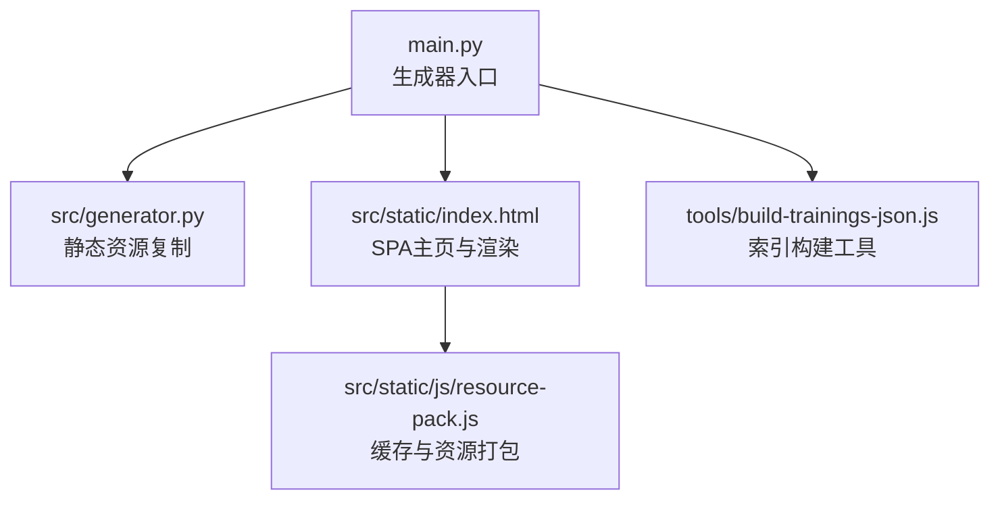
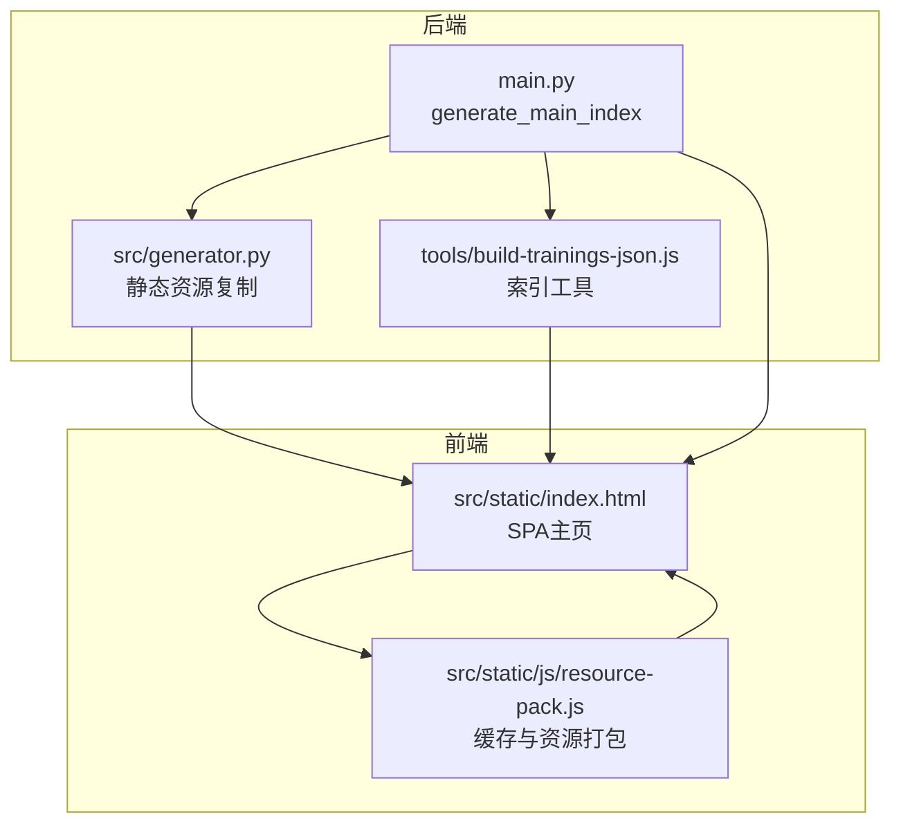
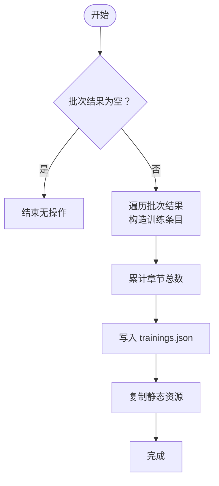
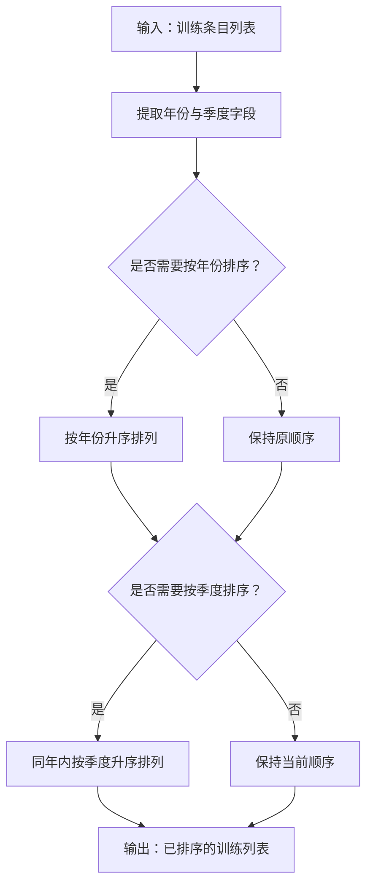
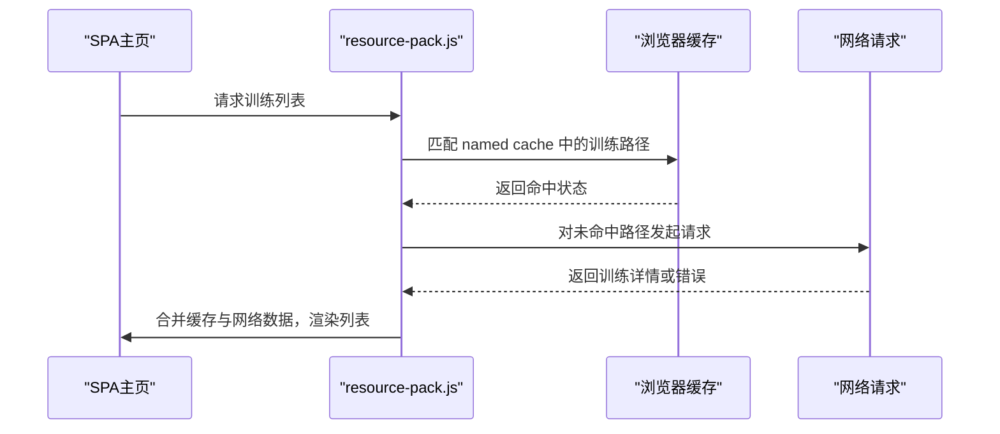
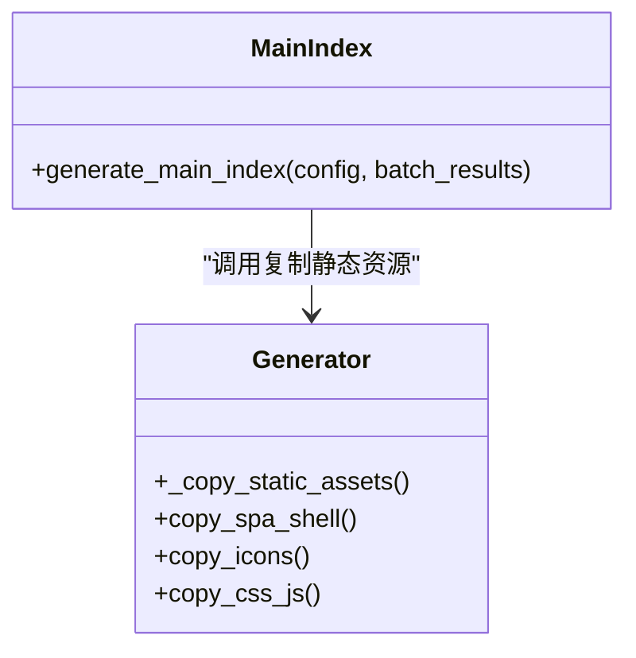
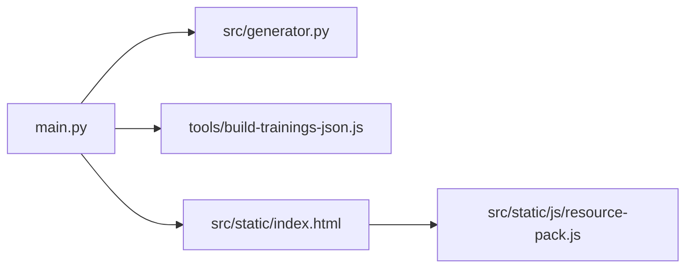

# 索引生成与聚合

<cite>
**本文引用的文件**
- [main.py](file://main.py)
- [src/static/index.html](file://src/static/index.html)
- [src/static/js/resource-pack.js](file://src/static/js/resource-pack.js)
- [src/generator.py](file://src/generator.py)
- [tools/build-trainings-json.js](file://tools/build-trainings-json.js)
</cite>

## 目录
1. [简介](#简介)
2. [项目结构](#项目结构)
3. [核心组件](#核心组件)
4. [架构总览](#架构总览)
5. [详细组件分析](#详细组件分析)
6. [依赖关系分析](#依赖关系分析)
7. [性能考量](#性能考量)
8. [故障排查指南](#故障排查指南)
9. [结论](#结论)
10. [附录](#附录)

## 简介
本文件面向CX项目的索引生成与聚合系统，聚焦于主索引生成流程与训练列表的组织、排序与聚合策略。重点解释以下方面：
- generate_main_index 函数如何生成SPA主页与 trainings.json 索引文件
- 训练列表的整理与排序逻辑（按年份、按季度、混合排序策略）
- 历史训练的合并机制（从已有输出目录读取历史数据、处理缺失文件与版本兼容）
- 静态资源的复制与配置（SPA shell、图标、CSS、JS等）
- 索引文件格式说明与自定义索引生成方法

## 项目结构
围绕索引生成与聚合的关键文件与职责如下：
- main.py：主程序入口，包含 generate_main_index 主流程，负责生成 trainings.json 与复制静态资源
- src/static/index.html：SPA主页模板与渲染逻辑，负责展示训练列表、PWA缓存与本地历史合辑标记
- src/static/js/resource-pack.js：前端资源打包与缓存策略，用于按路径集合拉取训练详情
- src/generator.py：生成器类，负责静态资源复制与构建流程
- tools/build-trainings-json.js：独立工具，可生成或更新 trainings.json（作为替代方案）

图表来源
- [main.py:317-420](file://main.py#L317-L420)
- [src/generator.py:44-60](file://src/generator.py#L44-L60)
- [src/static/index.html:318-407](file://src/static/index.html#L318-L407)
- [src/static/js/resource-pack.js:502-525](file://src/static/js/resource-pack.js#L502-L525)
- [tools/build-trainings-json.js](file://tools/build-trainings-json.js)

章节来源
- [main.py:317-420](file://main.py#L317-L420)
- [src/generator.py:44-60](file://src/generator.py#L44-L60)
- [src/static/index.html:318-407](file://src/static/index.html#L318-L407)
- [src/static/js/resource-pack.js:502-525](file://src/static/js/resource-pack.js#L502-L525)
- [tools/build-trainings-json.js](file://tools/build-trainings-json.js)

## 核心组件
- generate_main_index：主索引生成函数，负责收集批次结果、生成 trainings.json、复制静态资源与SPA shell
- 训练列表整理与排序：按年份、按季度、混合排序策略
- 历史训练合并：从已有输出目录读取历史数据、处理缺失文件与版本兼容
- 静态资源复制与配置：SPA shell、图标、CSS、JS等
- 索引文件格式：trainings.json 的字段结构与用途
- 自定义索引生成：通过工具脚本或扩展主流程实现

章节来源
- [main.py:317-420](file://main.py#L317-L420)
- [src/static/index.html:318-407](file://src/static/index.html#L318-L407)
- [src/static/js/resource-pack.js:502-525](file://src/static/js/resource-pack.js#L502-L525)
- [tools/build-trainings-json.js](file://tools/build-trainings-json.js)

## 架构总览
下图展示了从主流程到前端渲染的整体架构，以及静态资源与索引文件的生成与使用关系。

图表来源
- [main.py:317-420](file://main.py#L317-L420)
- [src/generator.py:44-60](file://src/generator.py#L44-L60)
- [tools/build-trainings-json.js](file://tools/build-trainings-json.js)
- [src/static/index.html:318-407](file://src/static/index.html#L318-L407)
- [src/static/js/resource-pack.js:502-525](file://src/static/js/resource-pack.js#L502-L525)

## 详细组件分析

### 主索引生成流程（generate_main_index）
- 输入：配置对象与批次结果列表
- 输出：SPA主页、trainings.json、静态资源复制
- 关键步骤：
  - 收集批次结果，构造训练条目（包含年份、季度、标题、章节数、路径、图片、版本）
  - 聚合计数（如总章节数）
  - 生成 trainings.json 并写入输出目录
  - 复制静态资源（SPA shell、图标、CSS、JS等）

图表来源
- [main.py:317-420](file://main.py#L317-L420)

章节来源
- [main.py:317-420](file://main.py#L317-L420)

### 训练列表整理与排序逻辑
- 按年份排序：在前端渲染中，通过年份分组显示训练卡片，确保同一年份的训练集中展示
- 按季度排序：训练条目包含季度信息，可用于后续排序策略
- 混合排序策略：结合年份与季度进行综合排序，保证时间序列的连续性与可读性
- 排序实现位置：前端渲染逻辑与资源打包逻辑均体现对路径与时间字段的依赖

图表来源
- [src/static/index.html:318-407](file://src/static/index.html#L318-L407)
- [src/static/js/resource-pack.js:502-525](file://src/static/js/resource-pack.js#L502-L525)

章节来源
- [src/static/index.html:318-407](file://src/static/index.html#L318-L407)
- [src/static/js/resource-pack.js:502-525](file://src/static/js/resource-pack.js#L502-L525)

### 历史训练的合并机制
- 从已有输出目录读取历史数据：前端通过缓存匹配与命名缓存集合，识别已缓存的训练路径
- 处理缺失文件：当无法从缓存或网络获取某训练详情时，降级为本地初始数据或空数据结构
- 版本兼容：通过版本字段与路径集合进行区分，避免旧版本与新版本冲突；对非初始数据进行来源标记以提升一致性

图表来源
- [src/static/index.html:340-397](file://src/static/index.html#L340-L397)
- [src/static/js/resource-pack.js:502-525](file://src/static/js/resource-pack.js#L502-L525)

章节来源
- [src/static/index.html:340-397](file://src/static/index.html#L340-L397)
- [src/static/js/resource-pack.js:502-525](file://src/static/js/resource-pack.js#L502-L525)

### 静态资源的复制与配置
- SPA shell：复制SPA主页模板与相关资源至输出目录
- 图标与媒体：复制应用图标与训练相关的图片资源
- CSS与JS：复制样式与脚本文件，确保前端渲染与缓存逻辑可用
- 生成器类：通过生成器类统一管理静态资源复制流程

图表来源
- [src/generator.py:44-60](file://src/generator.py#L44-L60)
- [main.py:317-420](file://main.py#L317-L420)

章节来源
- [src/generator.py:44-60](file://src/generator.py#L44-L60)
- [main.py:317-420](file://main.py#L317-L420)

### 索引文件格式说明（trainings.json）
- 字段结构：
  - name：批次名称
  - year：年份
  - season：季度
  - title：标题
  - chapter_count：章节数量
  - path：训练路径
  - images：图片列表
  - version：版本号
- 用途：
  - 前端渲染训练列表
  - PWA缓存策略中的路径集合
  - 历史合辑来源标记与版本兼容判断

章节来源
- [main.py:305-313](file://main.py#L305-L313)

### 自定义索引生成方法
- 使用工具脚本：通过独立工具脚本生成或更新 trainings.json，适用于批量处理与自动化流水线
- 扩展主流程：在主索引生成函数中增加自定义字段或排序规则，满足特定业务需求

章节来源
- [tools/build-trainings-json.js](file://tools/build-trainings-json.js)
- [main.py:317-420](file://main.py#L317-L420)

## 依赖关系分析
- 主流程依赖生成器类进行静态资源复制
- 前端渲染依赖 trainings.json 提供的数据结构
- 资源打包依赖路径集合与缓存状态进行差异化加载
- 工具脚本可作为主流程的补充或替代方案

图表来源
- [main.py:317-420](file://main.py#L317-L420)
- [src/generator.py:44-60](file://src/generator.py#L44-L60)
- [tools/build-trainings-json.js](file://tools/build-trainings-json.js)
- [src/static/index.html:318-407](file://src/static/index.html#L318-L407)
- [src/static/js/resource-pack.js:502-525](file://src/static/js/resource-pack.js#L502-L525)

章节来源
- [main.py:317-420](file://main.py#L317-L420)
- [src/generator.py:44-60](file://src/generator.py#L44-L60)
- [tools/build-trainings-json.js](file://tools/build-trainings-json.js)
- [src/static/index.html:318-407](file://src/static/index.html#L318-L407)
- [src/static/js/resource-pack.js:502-525](file://src/static/js/resource-pack.js#L502-L525)

## 性能考量
- 列表渲染优化：前端按年份分组渲染，减少DOM重排与滚动抖动
- 缓存优先策略：优先使用命名缓存与本地缓存，降低网络请求与解析开销
- 资源复用：静态资源统一复制与版本化，避免重复传输
- 批量处理：通过工具脚本或主流程批量生成索引，提高整体吞吐量

## 故障排查指南
- trainings.json 生成失败：检查批次结果是否为空、输出目录权限与磁盘空间
- 前端渲染异常：确认索引字段完整性（年份、季度、路径等）、缓存状态与命名缓存集合
- 静态资源缺失：核对生成器类的复制逻辑与目标路径，确保图标、CSS、JS齐全
- 历史合辑不显示：检查历史输出目录是否存在、路径是否正确、版本字段是否一致

章节来源
- [main.py:317-420](file://main.py#L317-L420)
- [src/static/index.html:340-397](file://src/static/index.html#L340-L397)
- [src/static/js/resource-pack.js:502-525](file://src/static/js/resource-pack.js#L502-L525)

## 结论
本系统通过主索引生成流程与前端渲染协同，实现了训练列表的高效组织与展示。generate_main_index 负责生成 trainings.json 与复制静态资源，前端通过缓存与资源打包策略优化加载体验。历史训练的合并机制与版本兼容设计提升了系统的稳定性与可维护性。通过工具脚本与主流程扩展，可灵活定制索引生成策略以满足多样化需求。

## 附录
- 参考实现路径：[main.py:317-420](file://main.py#L317-L420)
- 前端渲染与缓存：[src/static/index.html:318-407](file://src/static/index.html#L318-L407)、[src/static/js/resource-pack.js:502-525](file://src/static/js/resource-pack.js#L502-L525)
- 静态资源复制：[src/generator.py:44-60](file://src/generator.py#L44-L60)
- 独立索引工具：[tools/build-trainings-json.js](file://tools/build-trainings-json.js)