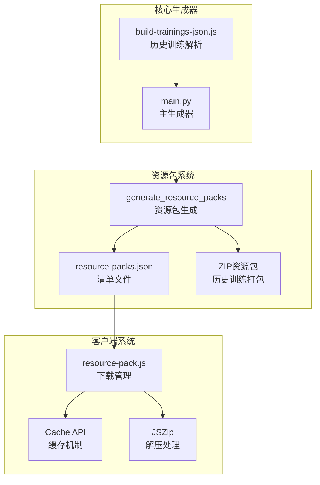
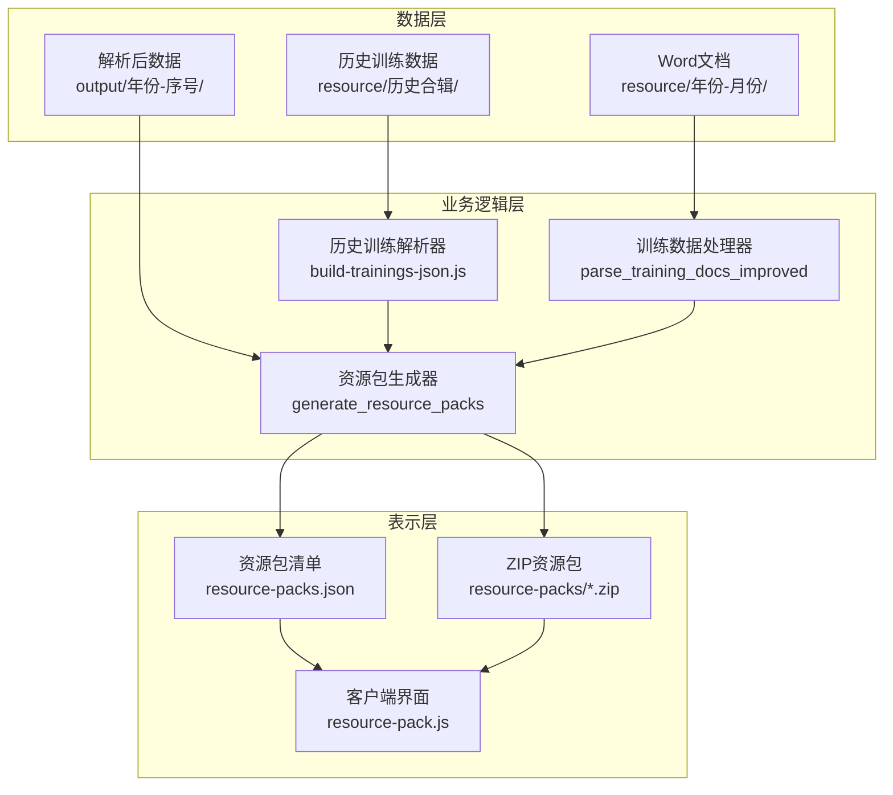
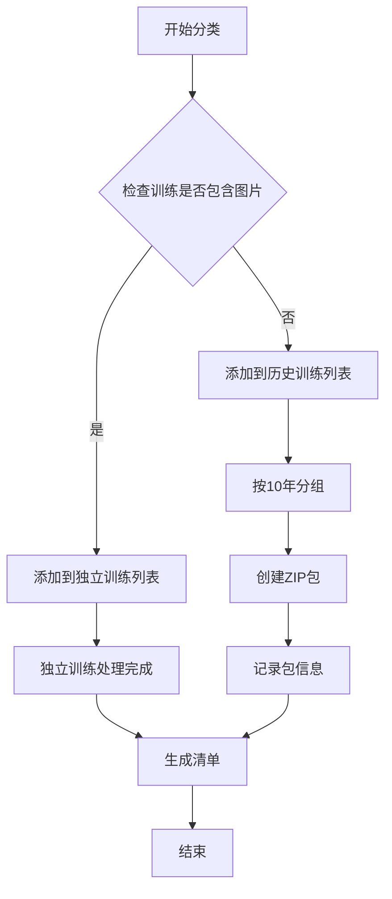
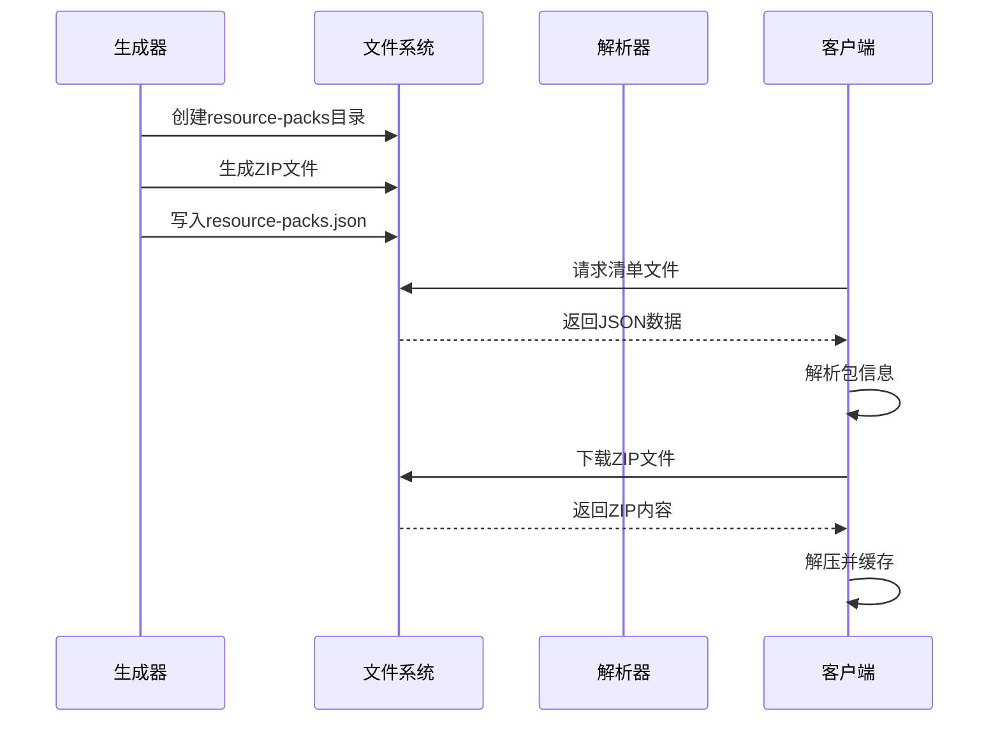
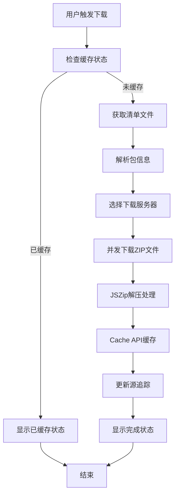
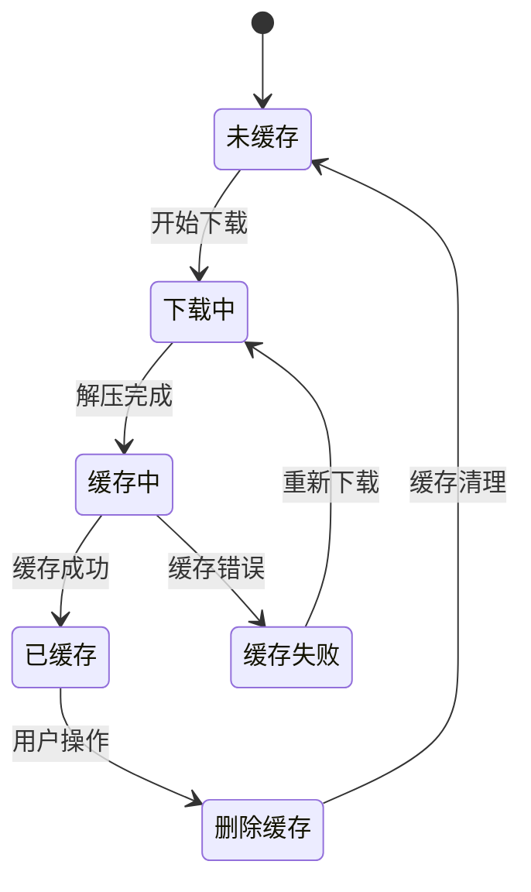
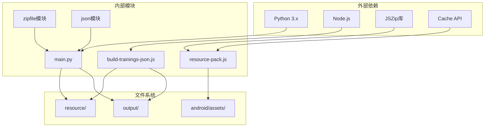

# 资源包生成

<cite>
**本文档引用的文件**
- [main.py](file://main.py)
- [resource-pack.js](file://src/static/js/resource-pack.js)
- [build-trainings-json.js](file://tools/build-trainings-json.js)
- [output/resource-packs.json](file://output/resource-packs.json)
- [android/app/src/main/assets/public/resource-packs.json](file://android/app/src/main/assets/public/resource-packs.json)
</cite>

## 目录
1. [简介](#简介)
2. [项目结构](#项目结构)
3. [核心组件](#核心组件)
4. [架构概览](#架构概览)
5. [详细组件分析](#详细组件分析)
6. [依赖分析](#依赖分析)
7. [性能考虑](#性能考虑)
8. [故障排除指南](#故障排除指南)
9. [结论](#结论)

## 简介

CX项目资源包生成系统是一个完整的离线资源管理解决方案，专门设计用于为历史训练内容提供高效的离线访问能力。该系统通过智能的资源包分类策略，将历史训练内容组织成可下载的ZIP包，同时为最新的训练内容提供即时缓存机制。

系统的核心功能包括：
- 智能资源包分类：区分独立训练包和历史训练包
- 按10年分组的历史训练打包机制
- 完整的资源包清单管理
- 客户端下载和缓存机制
- 跨平台兼容性（Web、Android）

## 项目结构

项目采用模块化的架构设计，主要包含以下关键组件：

**图表来源**
- [main.py:773-878](file://main.py#L773-L878)
- [build-trainings-json.js:1-417](file://tools/build-trainings-json.js#L1-L417)

**章节来源**
- [main.py:766-878](file://main.py#L766-L878)
- [build-trainings-json.js:358-417](file://tools/build-trainings-json.js#L358-L417)

## 核心组件

### 资源包生成器

资源包生成器是整个系统的核心，负责将历史训练内容智能分类并打包。其主要职责包括：

1. **智能分类策略**：根据训练内容特征自动区分独立训练和历史训练
2. **10年分组算法**：实现精确的历史训练分组机制
3. **ZIP文件创建**：生成优化的压缩包文件
4. **清单文件生成**：创建完整的资源包元数据清单

### 历史训练解析器

历史训练解析器专门处理历史合辑内容，通过复杂的文本解析算法提取训练数据：

1. **多格式支持**：支持多种历史训练文件格式
2. **智能边界检测**：自动识别训练内容边界
3. **数据完整性保证**：确保解析过程中的数据完整性
4. **版本兼容性**：支持不同版本的历史训练格式

### 客户端下载管理系统

客户端系统提供了完整的资源包下载和缓存管理功能：

1. **并发下载**：支持多服务器并发下载提升速度
2. **智能缓存**：基于Cache API的智能缓存机制
3. **进度跟踪**：实时显示下载进度和状态
4. **错误处理**：完善的错误处理和重试机制

**章节来源**
- [main.py:773-878](file://main.py#L773-L878)
- [resource-pack.js:1-808](file://src/static/js/resource-pack.js#L1-L808)

## 架构概览

系统采用分层架构设计，确保各组件之间的松耦合和高内聚：

**图表来源**
- [main.py:773-878](file://main.py#L773-L878)
- [build-trainings-json.js:358-417](file://tools/build-trainings-json.js#L358-L417)

## 详细组件分析

### generate_resource_packs函数深度分析

#### 分类策略实现

generate_resource_packs函数实现了智能的资源包分类机制，主要分为两个类别：

**独立训练包（Individuals）**：
- 特征：包含图片文件的训练
- 处理：通过网页访问时自然缓存，无需单独打包
- 优势：减少存储空间，提高缓存效率

**历史训练包（Packs）**：
- 特征：不包含图片文件的历史训练
- 处理：按10年周期进行分组打包
- 优势：便于用户按时间段下载和管理

**图表来源**
- [main.py:797-805](file://main.py#L797-L805)
- [main.py:819-866](file://main.py#L819-L866)

#### 10年分组算法详解

历史训练的10年分组算法是系统的核心创新点，实现了精确的时间段划分：

**算法原理**：
- 基准年份：1997年
- 分组公式：`year_start = ((year - 1997) // 10) * 10 + 1997`
- 分组范围：从1997年开始的连续10年周期

**示例计算**：
- 2025年：`((2025 - 1997) // 10) * 10 + 1997 = 2017-2025`
- 2016年：`((2016 - 1997) // 10) * 10 + 1997 = 2007-2016`
- 1997年：`((1997 - 1997) // 10) * 10 + 1997 = 1997-1997`

**包ID生成规则**：
- 格式：`pack-{year_start}-{actual_end}`
- 示例：`pack-2017-2025`

**章节来源**
- [main.py:819-831](file://main.py#L819-L831)
- [main.py:835-866](file://main.py#L835-L866)

#### ZIP文件创建机制

ZIP文件创建过程经过精心优化，确保高效和可靠：

**文件过滤策略**：
- 跳过图片文件：`/images/` 目录下的所有文件
- 仅打包文本内容：训练数据、配置文件等
- 保持目录结构：维持原有的文件层次结构

**压缩参数优化**：
- 算法：ZIP_DEFLATED
- 压缩级别：6（平衡压缩率和速度）
- 支持：ZIP64（支持大文件）

**内存管理**：
- 流式处理：逐文件处理，避免内存溢出
- 错误恢复：单个文件失败不影响整体进程

**章节来源**
- [main.py:835-852](file://main.py#L835-L852)

### resource-packs.json清单文件结构

resource-packs.json是系统的核心配置文件，包含完整的资源包元数据：

#### 主要结构组成

**版本信息**：
- `version`：清单文件的生成时间戳
- 格式：YYYYMMDDHHMMSS

**包列表（packs）**：
- `id`：包标识符（pack-{start}-{end}）
- `label`：包显示标签（YYYY–YYYY 年训练）
- `year_start/year_end`：分组的起止年份
- `training_count`：包含的训练数量
- `size_bytes`：包文件大小（字节）
- `path`：ZIP文件的相对路径
- `trainings`：训练列表数组

**独立训练列表（individuals）**：
- `path`：训练目录路径
- `title`：训练标题
- `season`：季节信息
- `year`：年份
- `chapter_count`：章节数量

#### 数据流分析

**图表来源**
- [main.py:868-877](file://main.py#L868-L877)
- [resource-pack.js:49-87](file://src/static/js/resource-pack.js#L49-L87)

**章节来源**
- [output/resource-packs.json:1-1054](file://output/resource-packs.json#L1-L1054)
- [android/app/src/main/assets/public/resource-packs.json:1-1054](file://android/app/src/main/assets/public/resource-packs.json#L1-L1054)

### 客户端下载机制

客户端系统提供了完整的资源包下载和缓存管理功能：

#### 下载流程

**图表来源**
- [resource-pack.js:217-327](file://src/static/js/resource-pack.js#L217-L327)

#### 并发下载优化

客户端采用了先进的并发下载技术：

**多服务器竞速**：
- 支持多个CDN服务器
- 自动选择响应最快的服务器
- 超时控制和错误处理

**流式下载**：
- 支持HTTP流式传输
- 实时进度反馈
- 内存使用优化

**错误恢复**：
- 自动重试机制
- 断点续传支持
- 用户友好的错误提示

#### 缓存管理策略

**图表来源**
- [resource-pack.js:91-99](file://src/static/js/resource-pack.js#L91-L99)
- [resource-pack.js:146-152](file://src/static/js/resource-pack.js#L146-L152)

**章节来源**
- [resource-pack.js:217-327](file://src/static/js/resource-pack.js#L217-L327)
- [resource-pack.js:91-107](file://src/static/js/resource-pack.js#L91-L107)

## 依赖分析

系统具有清晰的依赖关系，确保模块间的松耦合：

**图表来源**
- [main.py:773-878](file://main.py#L773-L878)
- [build-trainings-json.js:358-417](file://tools/build-trainings-json.js#L358-L417)

**章节来源**
- [main.py:773-878](file://main.py#L773-L878)
- [resource-pack.js:1-808](file://src/static/js/resource-pack.js#L1-L808)

## 性能考虑

系统在设计时充分考虑了性能优化：

### 内存使用优化
- 流式文件处理，避免大文件内存溢出
- ZIP文件的增量解压和缓存
- 智能的缓存清理机制

### 网络传输优化
- 多服务器并发下载
- CDN加速和智能路由
- 断点续传支持

### 存储空间优化
- 按10年分组减少包数量
- 跳过图片文件减小包体积
- 压缩算法优化

## 故障排除指南

### 常见问题及解决方案

**资源包生成失败**
- 检查历史训练数据完整性
- 验证输出目录权限
- 确认磁盘空间充足

**客户端下载失败**
- 检查网络连接状态
- 验证CDN服务器可用性
- 清理浏览器缓存

**缓存问题**
- 检查Cache API支持状态
- 验证存储配额限制
- 手动清理缓存数据

**章节来源**
- [resource-pack.js:787-796](file://src/static/js/resource-pack.js#L787-L796)

## 结论

CX项目资源包生成系统是一个设计精良的离线资源管理解决方案。通过智能的分类策略、高效的打包机制和完善的客户端管理，系统为用户提供了便捷的历史训练内容访问体验。

系统的主要优势包括：
- **智能化分类**：自动区分独立训练和历史训练
- **高效打包**：按10年分组优化存储和传输
- **完整缓存**：基于Cache API的智能缓存机制
- **跨平台兼容**：支持Web和Android平台
- **性能优化**：多服务器并发下载和流式处理

该系统为类似的历史文档管理项目提供了优秀的参考范例，展示了如何通过技术创新提升用户体验和系统性能。