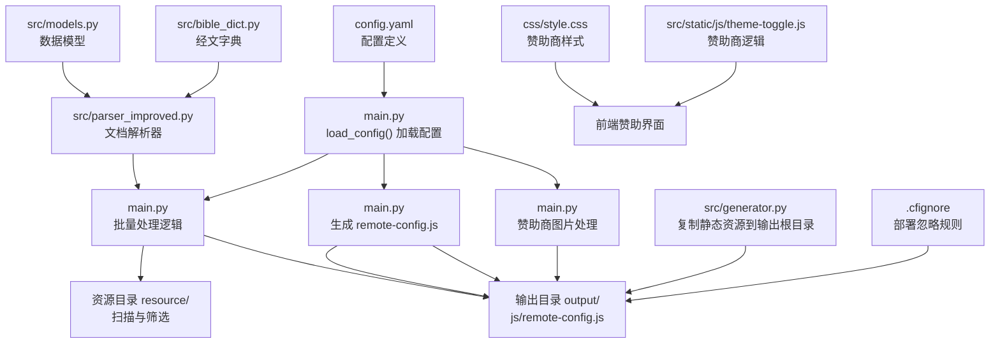
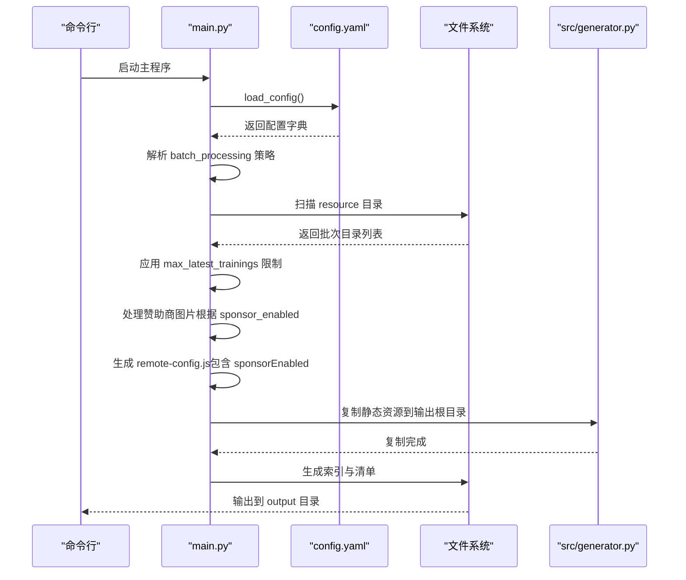
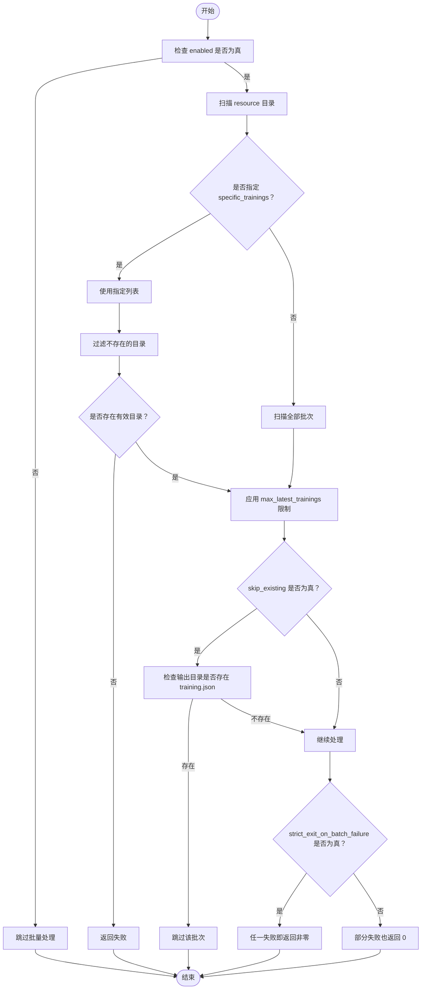
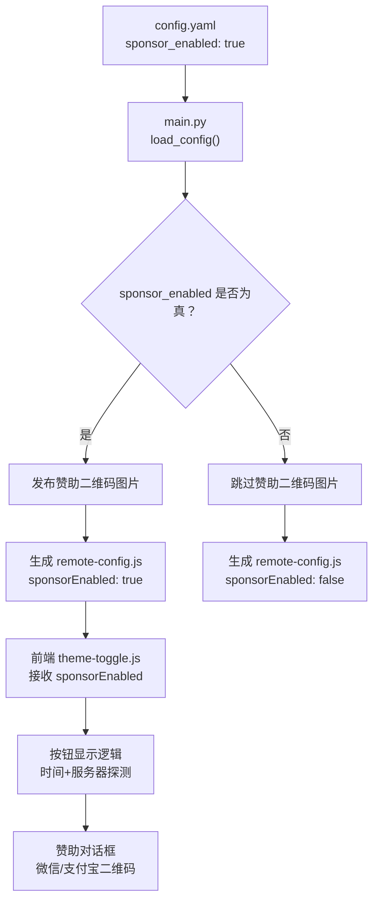
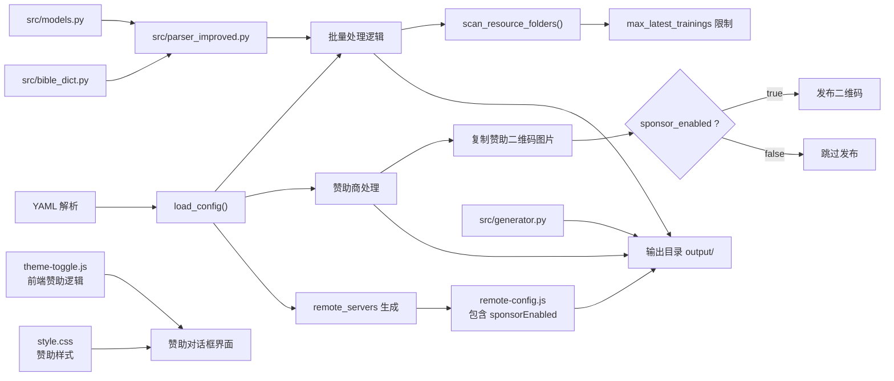

# 配置管理

<cite>
**本文引用的文件**
- [config.yaml](file://config.yaml)
- [main.py](file://main.py)
- [generator.py](file://src/generator.py)
- [parser_improved.py](file://src/parser_improved.py)
- [models.py](file://src/models.py)
- [bible_dict.py](file://src/bible_dict.py)
- [style.css](file://css/style.css)
- [theme-toggle.js](file://src/static/js/theme-toggle.js)
- [.cfignore](file://.cfignore)
</cite>

## 更新摘要
**变更内容**
- 新增赞助商配置系统，包括 sponsor_enabled 参数和条件构建逻辑
- 增强了前端赞助对话框的条件显示机制
- 完善了赞助二维码图片的条件发布逻辑
- 优化了远程配置中赞助功能的状态传递

## 目录
1. [简介](#简介)
2. [项目结构](#项目结构)
3. [核心组件](#核心组件)
4. [架构总览](#架构总览)
5. [详细组件分析](#详细组件分析)
6. [依赖关系分析](#依赖关系分析)
7. [性能考量](#性能考量)
8. [故障排查指南](#故障排查指南)
9. [结论](#结论)
10. [附录](#附录)

## 简介
本文件系统性阐述 CX 项目的配置管理系统，重点围绕 config.yaml 的结构与参数行为，覆盖批量处理、默认训练、输出目录、资源目录、远程服务器、**新增赞助商配置**等关键配置项。文档同时给出参数作用机制说明、配置示例与最佳实践、配置验证与错误处理建议，以及调试技巧，帮助读者快速上手并稳定运维。

**更新** 本次更新反映了配置系统的重构，包括模块重命名、配置结构优化和新增赞助商配置系统，提升了配置管理的灵活性和可维护性。

## 项目结构
与配置管理直接相关的文件与职责如下：
- config.yaml：定义全局配置、批量处理策略、默认训练后备值、远程服务器地址、**赞助商配置**等
- main.py：加载配置、解析批量处理策略、扫描资源目录、生成远程配置脚本、执行主流程、**处理赞助商图片发布**
- src/generator.py：生成静态资源（JS/CSS/Images）到输出根目录
- src/parser_improved.py：改进的文档解析器，支持多种文档格式
- src/models.py：数据模型定义，支撑配置驱动的数据结构
- src/bible_dict.py：圣经经文字典，提供持久化存储功能
- **新增** css/style.css：赞助商对话框样式定义
- **新增** src/static/js/theme-toggle.js：赞助商功能前端逻辑实现
- .cfignore：部署忽略规则，确保仅部署 output 目录内容

**图表来源**
- [config.yaml:1-45](file://config.yaml#L1-L45)
- [main.py:54-57](file://main.py#L54-L57)
- [main.py:19-51](file://main.py#L19-L51)
- [main.py:653-668](file://main.py#L653-L668)
- [main.py:705-707](file://main.py#L705-L707)
- [generator.py:76-104](file://src/generator.py#L76-L104)
- [.cfignore:14-17](file://.cfignore#L14-L17)
- [style.css:712-726](file://css/style.css#L712-L726)
- [theme-toggle.js:633-661](file://src/static/js/theme-toggle.js#L633-L661)

**章节来源**
- [config.yaml:1-45](file://config.yaml#L1-L45)
- [main.py:54-57](file://main.py#L54-L57)
- [main.py:19-51](file://main.py#L19-L51)
- [main.py:653-668](file://main.py#L653-L668)
- [main.py:705-707](file://main.py#L705-L707)
- [generator.py:76-104](file://src/generator.py#L76-L104)
- [.cfignore:14-17](file://.cfignore#L14-L17)
- [style.css:712-726](file://css/style.css#L712-L726)
- [theme-toggle.js:633-661](file://src/static/js/theme-toggle.js#L633-L661)

## 核心组件
本节聚焦 config.yaml 的关键配置段落及其在运行期的行为映射。

- 批量处理配置（batch_processing）
  - enabled：布尔开关，控制是否启用批量处理流程
  - skip_existing：布尔开关，控制是否跳过已存在的输出（SPA 模式下检测 training.json）
  - strict_exit_on_batch_failure：布尔开关，控制批量处理失败时的退出码策略
  - max_latest_trainings：整数，控制仅处理最新 N 个批次，用于控制打包体积
  - specific_trainings：数组（注释状态），若启用则仅处理指定训练目录

- **新增** 赞助商配置（sponsor_enabled）
  - 控制是否启用赞助商功能，包括赞助二维码图片发布和前端赞助对话框显示
  - 默认值为 true，启用状态下会发布 zanzhu-wx.png 和 zanzhu-zfb.jpg 二维码图片，前端显示赞助入口
  - 关闭状态下不会发布赞助二维码图片，前端自动隐藏赞助入口

- 全局目录配置（output_dir、resource_base_dir、template_dir、static_dir）
  - output_dir：输出根目录
  - resource_base_dir：资源根目录（默认 resource）
  - template_dir：模板目录
  - static_dir：静态资源目录

- 默认训练配置（default_training）
  - year、season：当无法从文件夹名自动识别时的后备值

- 远程服务器配置（remote_servers）
  - cloudflare、github_api、github_mirrors、push、ip_apis：各类远程服务地址集合，main.py 会据此生成 output/js/remote-config.js

**章节来源**
- [config.yaml:2-7](file://config.yaml#L2-L7)
- [config.yaml:9-10](file://config.yaml#L9-L10)
- [config.yaml:12-16](file://config.yaml#L12-L16)
- [config.yaml:20-25](file://config.yaml#L20-L25)
- [config.yaml:27-45](file://config.yaml#L27-L45)

## 架构总览
配置驱动的处理流程如下：加载配置 → 解析批量策略 → 扫描资源 → **处理赞助商图片** → 生成远程配置 → 复制静态资源 → 生成索引与清单 → 输出到 output 目录。

**图表来源**
- [main.py:54-57](file://main.py#L54-L57)
- [main.py:653-668](file://main.py#L653-L668)
- [main.py:705-707](file://main.py#L705-L707)
- [main.py:19-51](file://main.py#L19-L51)
- [generator.py:76-104](file://src/generator.py#L76-L104)

## 详细组件分析

### 批量处理配置（batch_processing）
- enabled 开关：控制是否进入批量处理分支
- skip_existing：若开启且输出目录存在 training.json（SPA 模式），则跳过该批次生成
- strict_exit_on_batch_failure：若开启，只要任一批次失败即返回非零退出码；否则即使部分失败也返回 0（利于持续集成）
- max_latest_trainings：当批次数量超过阈值时，按"YYYY-MM"识别优先保留最新 N 个，其余按原始顺序补齐
- specific_trainings：若启用，仅处理列出的训练目录；若全部不存在则直接失败

**图表来源**
- [main.py:702-751](file://main.py#L702-L751)
- [main.py:808-890](file://main.py#L808-L890)

**章节来源**
- [config.yaml:2-7](file://config.yaml#L2-L7)
- [main.py:702-751](file://main.py#L702-L751)
- [main.py:808-890](file://main.py#L808-L890)

### **新增** 赞助商配置（sponsor_enabled）

#### 配置参数说明
- sponsor_enabled：布尔开关，控制是否启用赞助商功能
- 默认值：true（启用状态）
- 影响范围：前端赞助对话框显示、赞助二维码图片发布

#### 后端处理逻辑
- 图片发布控制：当 sponsor_enabled 为 true 时，发布 zanzhu-wx.png 和 zanzhu-zfb.jpg 二维码图片；当为 false 时，跳过发布这些图片
- 远程配置注入：在生成 remote-config.js 时，将 sponsorEnabled 参数传递给前端，值为 true 或 false

#### 前端显示逻辑
- 时间触发：用户使用超过 5 分钟后显示赞助按钮
- 服务器探测：通过探测 Cloudflare 服务器上的二维码图片是否存在来决定按钮显示
- 条件显示：只有当 sponsor_enabled 为 true 且二维码图片可访问时才显示赞助入口
- 对话框功能：支持微信和支付宝两种支付方式的二维码切换显示

**图表来源**
- [config.yaml:9-10](file://config.yaml#L9-L10)
- [main.py:653-668](file://main.py#L653-L668)
- [main.py:19-51](file://main.py#L19-L51)
- [theme-toggle.js:633-661](file://src/static/js/theme-toggle.js#L633-L661)

**章节来源**
- [config.yaml:9-10](file://config.yaml#L9-L10)
- [main.py:653-668](file://main.py#L653-L668)
- [main.py:19-51](file://main.py#L19-L51)
- [theme-toggle.js:633-661](file://src/static/js/theme-toggle.js#L633-L661)

### 默认训练配置（default_training）
- 当批次文件夹名无法解析出年份与季度时，使用此处后备值
- 年份与季度来自 default_training.year 与 default_training.season

**章节来源**
- [config.yaml:20-25](file://config.yaml#L20-L25)
- [main.py:225-240](file://main.py#L225-L240)

### 输出与资源目录配置（output_dir、resource_base_dir、template_dir、static_dir）
- output_dir：最终产物输出根目录
- resource_base_dir：资源目录基座（默认 resource）
- template_dir、static_dir：模板与静态资源目录，用于生成阶段复制与渲染

**章节来源**
- [config.yaml:12-16](file://config.yaml#L12-L16)
- [main.py:322-323](file://main.py#L322-L323)
- [generator.py:76-104](file://src/generator.py#L76-L104)

### 远程服务器配置（remote_servers）
- cloudflare、github_api、github_mirrors、push、ip_apis：各类远程服务地址
- main.py 会读取该配置并生成 output/js/remote-config.js，其中 URL 以 base64 存储并在运行时解码
- **新增** sponsorEnabled 参数：传递赞助商功能状态给前端

**章节来源**
- [config.yaml:27-45](file://config.yaml#L27-L45)
- [main.py:19-51](file://main.py#L19-L51)

## 依赖关系分析
- 配置加载依赖 YAML 解析库，入口函数为 load_config
- 批量处理依赖资源目录扫描与日期提取函数
- **新增** 赞助商处理依赖 sponsor_enabled 配置和二维码图片文件
- 远程配置生成依赖 base64 编解码与 JS 模板拼装，**包含 sponsorEnabled 参数**
- 静态资源复制依赖目录存在性检查与文件遍历
- 文档解析依赖改进的解析器和数据模型
- 经文字典提供持久化存储支持
- **新增** 前端赞助功能依赖 theme-toggle.js 和样式文件

**图表来源**
- [main.py:54-57](file://main.py#L54-L57)
- [main.py:653-668](file://main.py#L653-L668)
- [main.py:705-707](file://main.py#L705-L707)
- [main.py:19-51](file://main.py#L19-L51)
- [generator.py:76-104](file://src/generator.py#L76-L104)
- [theme-toggle.js:633-661](file://src/static/js/theme-toggle.js#L633-L661)
- [style.css:712-726](file://css/style.css#L712-L726)

**章节来源**
- [main.py:54-57](file://main.py#L54-L57)
- [main.py:653-668](file://main.py#L653-L668)
- [main.py:705-707](file://main.py#L705-L707)
- [main.py:19-51](file://main.py#L19-L51)
- [generator.py:76-104](file://src/generator.py#L76-L104)
- [theme-toggle.js:633-661](file://src/static/js/theme-toggle.js#L633-L661)
- [style.css:712-726](file://css/style.css#L712-L726)

## 性能考量
- 批量处理规模控制：通过 max_latest_trainings 限制仅处理最新 N 个批次，显著降低打包体积与构建时间
- 跳过重复生成：启用 skip_existing 可避免重复处理已生成的 SPA 输出
- **新增** 赞助商条件发布：根据 sponsor_enabled 配置决定是否发布赞助二维码图片，减少不必要的文件传输
- 静态资源复用：将共享 JS/CSS/Images 复制到输出根目录，减少运行时请求开销
- 部署体积优化：.cfignore 仅部署 output 目录，避免源码与中间产物进入生产环境
- 配置验证：通过严格的参数校验和错误处理机制，确保配置的正确性和系统的稳定性

**章节来源**
- [main.py:721-751](file://main.py#L721-L751)
- [main.py:808-818](file://main.py#L808-L818)
- [main.py:653-668](file://main.py#L653-L668)
- [generator.py:76-104](file://src/generator.py#L76-L104)
- [.cfignore:14-17](file://.cfignore#L14-L17)

## 故障排查指南
- 配置加载失败
  - 症状：程序启动时报错，无法读取配置
  - 排查：确认 config.yaml 路径正确、YAML 格式合法、编码为 UTF-8
  - 参考实现：load_config 使用安全解析函数加载 YAML
- 批量处理未生效
  - 症状：未按预期处理指定批次或未应用最新批次限制
  - 排查：检查 batch_processing.enabled、specific_trainings 是否启用；确认 resource 目录存在且命名符合 YYYY-MM 格式以便日期识别
  - 参考实现：批量处理分支与筛选逻辑
- **新增** 赞助商功能异常
  - 症状：前端未显示赞助按钮或赞助对话框无法打开
  - 排查：检查 config.yaml 中 sponsor_enabled 设置；确认二维码图片已发布；验证 Cloudflare 服务器上二维码文件可访问
  - 参考实现：前端按钮显示逻辑和服务器探测机制
- 输出目录为空或缺少静态资源
  - 症状：生成物缺失 JS/CSS/Images
  - 排查：确认 static_dir 与 template_dir 路径正确；检查 src/generator.py 的复制逻辑
- 远程配置未生成
  - 症状：前端无法访问远程服务地址
  - 排查：确认 remote_servers 字段完整；检查 main.py 的 remote-config.js 生成逻辑；**确认 sponsorEnabled 参数正确传递**
- 配置参数验证失败
  - 症状：配置参数类型不匹配或值超出范围
  - 排查：检查配置参数的数据类型和取值范围；参考配置参数速查表进行修正
- 模块依赖问题
  - 症状：导入模块时出现错误
  - 排查：确认 Python 环境中已安装必要的依赖包；检查模块路径配置

**章节来源**
- [main.py:54-57](file://main.py#L54-L57)
- [main.py:653-668](file://main.py#L653-L668)
- [main.py:705-707](file://main.py#L705-L707)
- [generator.py:76-104](file://src/generator.py#L76-L104)
- [main.py:19-51](file://main.py#L19-L51)
- [.cfignore:14-17](file://.cfignore#L14-L17)

## 结论
config.yaml 是 CX 项目配置管理的核心，通过 batch_processing、default_training、output_dir、resource_base_dir、remote_servers、**新增赞助商配置**等键位，将批量处理策略、输出布局、远程服务和**赞助商功能**无缝衔接。结合 skip_existing、max_latest_trainings 等参数，可在保证产出质量的同时显著提升构建效率与部署稳定性。**新增的 sponsor_enabled 配置提供了灵活的功能开关机制，支持按需启用或禁用赞助商功能，包括二维码图片发布和前端界面显示。**建议在不同场景下按需调整参数，并配合 skip_existing 与严格退出策略，以满足本地开发与持续集成的不同需求。

**更新** 本次重构增强了配置系统的模块化设计，优化了配置参数的命名规范，完善了配置验证机制，并新增了赞助商配置系统，为项目的长期维护和发展奠定了坚实基础。

## 附录

### 配置参数速查表
- batch_processing.enabled：启用/禁用批量处理
- batch_processing.skip_existing：跳过已存在输出
- batch_processing.strict_exit_on_batch_failure：严格失败退出策略
- batch_processing.max_latest_trainings：最新批次数量限制
- batch_processing.specific_trainings：指定训练列表（注释启用）
- **新增** sponsor_enabled：启用/禁用赞助商功能
- output_dir：输出根目录
- resource_base_dir：资源根目录
- template_dir：模板目录
- static_dir：静态资源目录
- default_training.year、default_training.season：自动识别失败时的后备值
- remote_servers.cloudflare、github_api、github_mirrors、push、ip_apis：远程服务地址集合

**章节来源**
- [config.yaml:2-7](file://config.yaml#L2-L7)
- [config.yaml:9-10](file://config.yaml#L9-L10)
- [config.yaml:12-16](file://config.yaml#L12-L16)
- [config.yaml:20-25](file://config.yaml#L20-L25)
- [config.yaml:27-45](file://config.yaml#L27-L45)