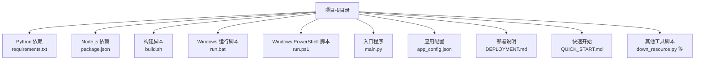
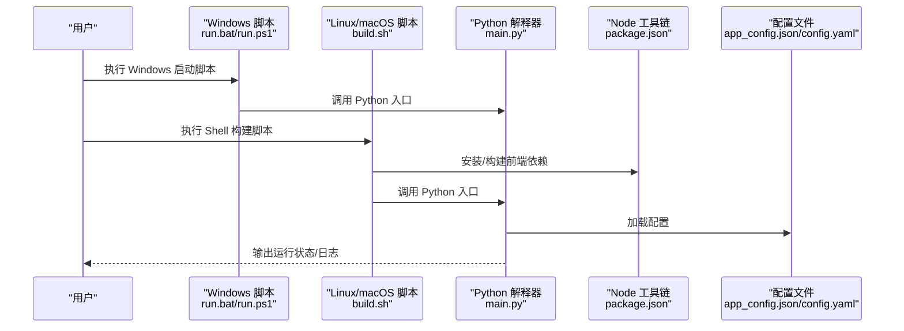
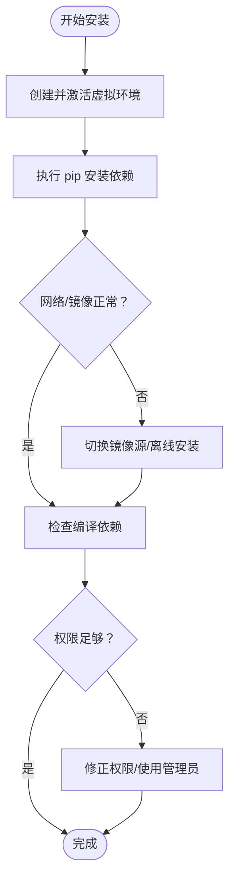
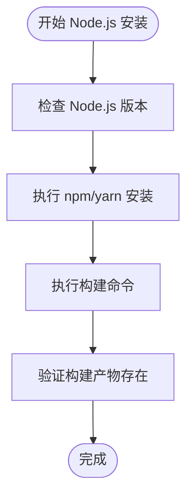
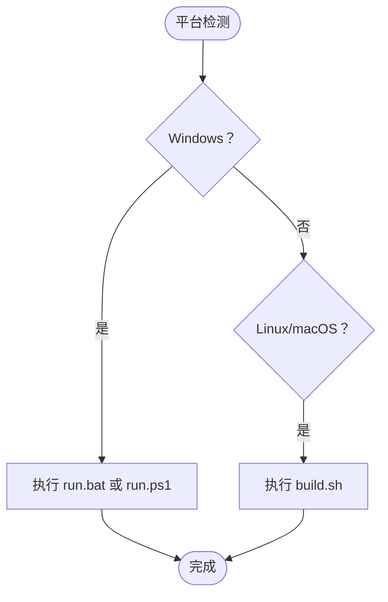
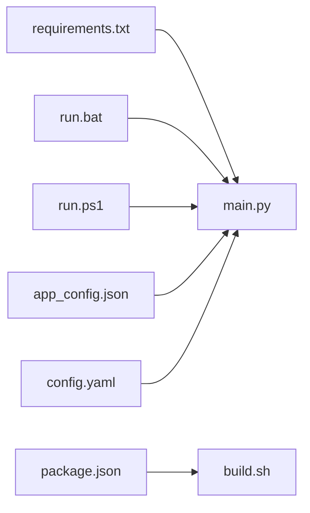

# 安装问题

<cite>
**本文引用的文件**
- [requirements.txt](file://requirements.txt)
- [package.json](file://package.json)
- [build.sh](file://build.sh)
- [run.bat](file://run.bat)
- [run.ps1](file://run.ps1)
- [main.py](file://main.py)
- [DEPLOYMENT.md](file://DEPLOYMENT.md)
- [QUICK_START.md](file://QUICK_START.md)
- [app_config.json](file://app_config.json)
- [config.yaml](file://config.yaml)
- [down_resource.py](file://down_resource.py)
</cite>

## 目录
1. [简介](#简介)
2. [项目结构](#项目结构)
3. [核心组件](#核心组件)
4. [架构总览](#架构总览)
5. [详细组件分析](#详细组件分析)
6. [依赖关系分析](#依赖关系分析)
7. [性能考虑](#性能考虑)
8. [故障排除指南](#故障排除指南)
9. [结论](#结论)
10. [附录](#附录)

## 简介
本指南聚焦于CX项目的安装与运行问题，覆盖Python环境配置、依赖安装、Node.js相关问题、权限问题、跨平台差异（Windows/Linux/macOS）等常见安装错误，并提供系统化的诊断与修复流程。文档同时给出验证安装成功的检查清单与常见环境检查步骤，帮助快速定位并解决问题。

## 项目结构
该项目采用多语言混合架构：后端以Python为主（含依赖清单），前端资源与构建脚本位于根目录，跨平台运行脚本分别提供Windows批处理与PowerShell脚本，以及通用的Shell构建脚本。配置文件包括JSON与YAML格式，用于应用参数与部署说明。

图表来源
- [requirements.txt](file://requirements.txt)
- [package.json](file://package.json)
- [build.sh](file://build.sh)
- [run.bat](file://run.bat)
- [run.ps1](file://run.ps1)
- [main.py](file://main.py)
- [app_config.json](file://app_config.json)
- [DEPLOYMENT.md](file://DEPLOYMENT.md)
- [QUICK_START.md](file://QUICK_START.md)
- [down_resource.py](file://down_resource.py)

章节来源
- [requirements.txt](file://requirements.txt)
- [package.json](file://package.json)
- [build.sh](file://build.sh)
- [run.bat](file://run.bat)
- [run.ps1](file://run.ps1)
- [main.py](file://main.py)
- [DEPLOYMENT.md](file://DEPLOYMENT.md)
- [QUICK_START.md](file://QUICK_START.md)
- [app_config.json](file://app_config.json)
- [down_resource.py](file://down_resource.py)

## 核心组件
- Python运行时与依赖
  - 使用pip安装依赖，建议在隔离的虚拟环境中执行，避免污染系统Python环境。
  - 若出现网络或镜像问题，可切换到国内镜像源或离线安装方式。
- Node.js与前端构建
  - 通过package.json声明前端依赖；如需构建前端资源，请确保已安装Node.js并具备npm/yarn可用。
- 跨平台运行脚本
  - Windows提供批处理与PowerShell脚本，便于一键启动；Linux/macOS使用Shell脚本进行构建与运行。
- 配置文件
  - JSON与YAML配置文件用于应用参数与部署策略，安装后应先校验配置项是否存在且路径正确。

章节来源
- [requirements.txt](file://requirements.txt)
- [package.json](file://package.json)
- [build.sh](file://build.sh)
- [run.bat](file://run.bat)
- [run.ps1](file://run.ps1)
- [app_config.json](file://app_config.json)
- [config.yaml](file://config.yaml)

## 架构总览
下图展示从安装到运行的关键路径：用户在不同平台选择对应脚本，脚本调用Python解释器与Node工具链，加载配置并执行主程序。

图表来源
- [run.bat](file://run.bat)
- [run.ps1](file://run.ps1)
- [build.sh](file://build.sh)
- [main.py](file://main.py)
- [package.json](file://package.json)
- [app_config.json](file://app_config.json)
- [config.yaml](file://config.yaml)

## 详细组件分析

### Python 环境与依赖安装
- 依赖清单
  - 依赖定义位于requirements.txt，建议在虚拟环境中安装，避免与系统包冲突。
- 版本兼容性
  - Python版本要求未在仓库中显式声明，建议优先使用Python 3.8及以上稳定版本。
- 常见问题
  - pip安装失败：检查网络、代理、镜像源；必要时使用离线wheel包。
  - 权限不足：在类Unix系统上使用sudo或调整目录权限；Windows以管理员身份运行。
  - 编译依赖失败：确认系统已安装编译工具链与头文件（如gcc、make、Python开发头文件）。

图表来源
- [requirements.txt](file://requirements.txt)

章节来源
- [requirements.txt](file://requirements.txt)

### Node.js 与前端构建
- 依赖管理
  - package.json定义了前端依赖与脚本命令，建议使用npm或yarn进行安装。
- 常见问题
  - Node.js版本不匹配：根据package.json中的engines字段或社区约定选择合适版本。
  - npm安装失败：清理缓存、更换registry、检查网络；Windows可能需要以管理员运行。
  - 构建产物缺失：确认已执行构建命令并生成所需资源。

图表来源
- [package.json](file://package.json)

章节来源
- [package.json](file://package.json)

### 跨平台运行脚本
- Windows
  - run.bat与run.ps1提供一键启动能力，建议以管理员身份运行以避免权限问题。
- Linux/macOS
  - build.sh用于构建与运行，注意赋予执行权限并根据系统调整命令。

图表来源
- [run.bat](file://run.bat)
- [run.ps1](file://run.ps1)
- [build.sh](file://build.sh)

章节来源
- [run.bat](file://run.bat)
- [run.ps1](file://run.ps1)
- [build.sh](file://build.sh)

### 配置文件与部署
- 配置文件
  - app_config.json与config.yaml用于应用参数与部署策略，安装后应核对路径与键值。
- 部署与快速开始
  - DEPLOYMENT.md与QUICK_START.md提供了部署与入门指引，建议按步骤逐一验证。

章节来源
- [app_config.json](file://app_config.json)
- [config.yaml](file://config.yaml)
- [DEPLOYMENT.md](file://DEPLOYMENT.md)
- [QUICK_START.md](file://QUICK_START.md)

## 依赖关系分析
- Python后端依赖由requirements.txt集中管理，建议与虚拟环境绑定。
- Node.js前端依赖由package.json管理，构建脚本依赖其脚本命令。
- 运行脚本与主程序存在直接耦合：Windows脚本与Shell脚本最终调用Python入口。

图表来源
- [requirements.txt](file://requirements.txt)
- [package.json](file://package.json)
- [build.sh](file://build.sh)
- [run.bat](file://run.bat)
- [run.ps1](file://run.ps1)
- [main.py](file://main.py)
- [app_config.json](file://app_config.json)
- [config.yaml](file://config.yaml)

章节来源
- [requirements.txt](file://requirements.txt)
- [package.json](file://package.json)
- [build.sh](file://build.sh)
- [run.bat](file://run.bat)
- [run.ps1](file://run.ps1)
- [main.py](file://main.py)
- [app_config.json](file://app_config.json)
- [config.yaml](file://config.yaml)

## 性能考虑
- 安装阶段
  - 使用镜像源可显著提升pip与npm下载速度。
  - 在CI/CD场景中复用缓存可减少重复安装时间。
- 运行阶段
  - 将大型资源下载与构建分离，避免每次启动都重新构建。
  - 合理设置日志级别，减少I/O开销。

## 故障排除指南

### 一、Python环境配置问题
- 症状
  - 无法找到python/pip命令；或提示模块导入失败。
- 排查步骤
  - 确认已安装Python 3.8+，并在PATH中可见。
  - 创建并激活虚拟环境，再执行pip安装。
  - 如网络受限，切换至国内镜像源或准备离线包。
- 修复建议
  - 在虚拟环境中安装requirements.txt。
  - 若为编译型扩展失败，安装系统编译工具与Python开发头文件。

章节来源
- [requirements.txt](file://requirements.txt)

### 二、依赖包安装失败（pip）
- 症状
  - pip安装超时、证书错误、权限不足。
- 排查步骤
  - 检查网络与代理；尝试更换镜像源。
  - 在类Unix系统上确认用户权限；Windows以管理员身份运行。
  - 清理pip缓存后重试。
- 修复建议
  - 使用离线wheel包进行安装。
  - 对于特定包，使用预编译wheel或二进制包。

章节来源
- [requirements.txt](file://requirements.txt)

### 三、Node.js相关问题
- 症状
  - npm安装卡住、版本不兼容、构建失败。
- 排查步骤
  - 检查Node.js版本是否满足package.json要求。
  - 更换registry或清理缓存后重试。
  - 确认已执行构建命令并生成前端资源。
- 修复建议
  - 使用nvm固定Node版本。
  - 在Windows上以管理员身份运行npm/yarn。

章节来源
- [package.json](file://package.json)

### 四、权限问题
- 症状
  - 安装或运行时报权限不足。
- 排查步骤
  - 类Unix系统：检查当前用户对目标目录的写入权限。
  - Windows：以管理员身份运行命令提示符或PowerShell。
- 修复建议
  - 修改目录权限或将安装路径改为用户可写目录。

章节来源
- [run.bat](file://run.bat)
- [run.ps1](file://run.ps1)
- [build.sh](file://build.sh)

### 五、跨平台差异（Windows/Linux/macOS）
- Windows
  - 使用run.bat或run.ps1启动；若涉及外部工具，确保以管理员运行。
- Linux/macOS
  - 使用build.sh构建；确保脚本具备执行权限；必要时调整shebang与依赖。
- 通用建议
  - 统一使用虚拟环境隔离Python依赖。
  - 前端依赖统一通过npm/yarn管理。

章节来源
- [run.bat](file://run.bat)
- [run.ps1](file://run.ps1)
- [build.sh](file://build.sh)

### 六、验证安装是否成功
- Python侧
  - 在虚拟环境中运行Python入口文件，观察输出与日志。
  - 检查关键模块是否可导入。
- Node.js侧
  - 确认前端依赖安装完成，构建产物存在。
- 配置侧
  - 校验app_config.json与config.yaml中的关键键值是否存在且路径有效。
- 部署侧
  - 参考DEPLOYMENT.md与QUICK_START.md逐项核对。

章节来源
- [main.py](file://main.py)
- [package.json](file://package.json)
- [app_config.json](file://app_config.json)
- [config.yaml](file://config.yaml)
- [DEPLOYMENT.md](file://DEPLOYMENT.md)
- [QUICK_START.md](file://QUICK_START.md)

## 结论
通过分层排查Python环境、Node.js工具链、权限与跨平台差异，结合配置文件校验与部署文档对照，可高效定位并解决CX项目的安装问题。建议在标准化流程中引入虚拟环境与镜像源策略，以提升可重复性与稳定性。

## 附录
- 常用环境检查清单
  - Python版本与pip可用性
  - 虚拟环境激活状态
  - Node.js版本与npm/yarn可用性
  - 前端依赖安装与构建产物
  - 配置文件路径与键值有效性
  - 平台脚本执行权限与管理员权限