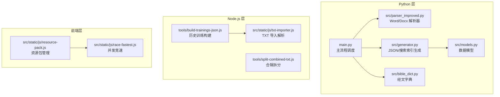
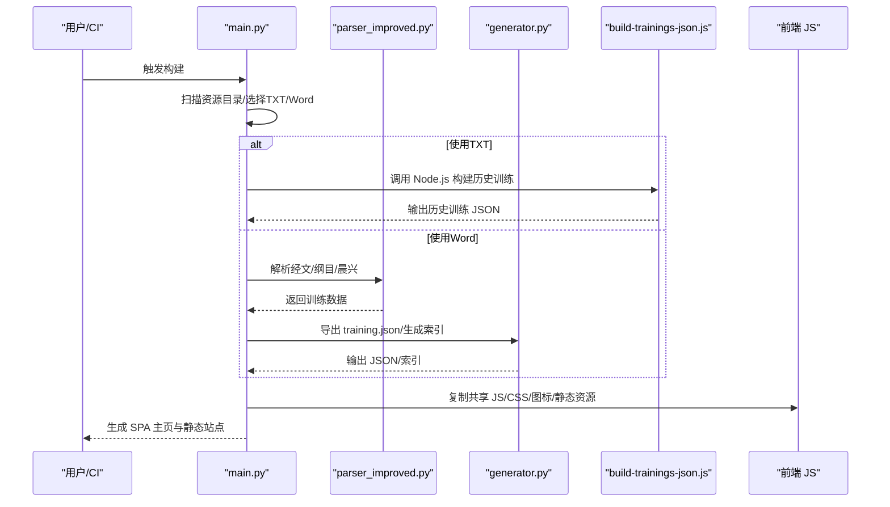
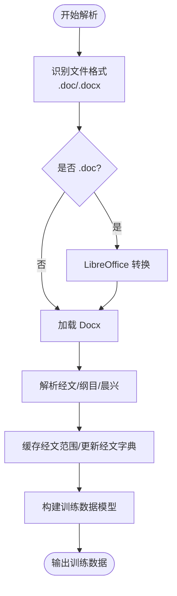
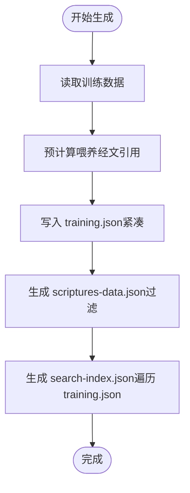
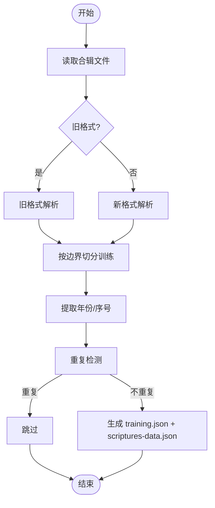
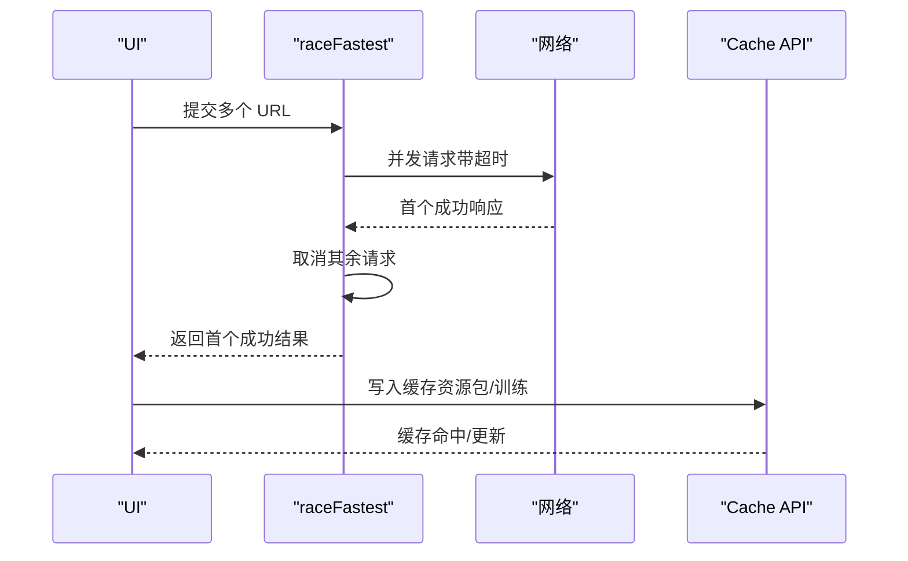
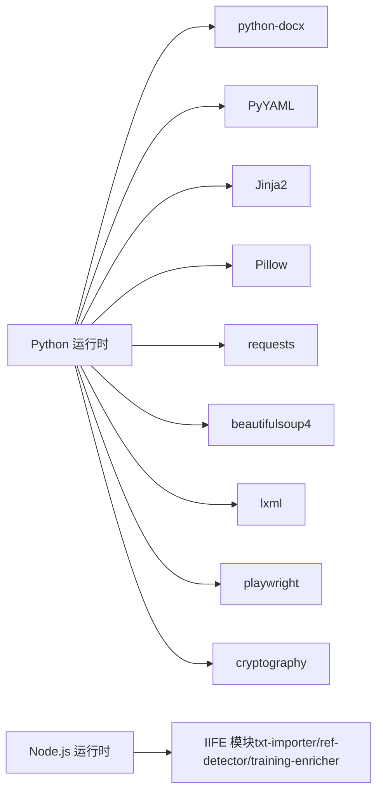

# 性能问题

<cite>
**本文引用的文件**   
- [main.py](file://main.py)
- [src/parser_improved.py](file://src/parser_improved.py)
- [src/generator.py](file://src/generator.py)
- [src/models.py](file://src/models.py)
- [src/bible_dict.py](file://src/bible_dict.py)
- [tools/build-trainings-json.js](file://tools/build-trainings-json.js)
- [tools/split-combined-txt.js](file://tools/split-combined-txt.js)
- [src/static/js/race-fastest.js](file://src/static/js/race-fastest.js)
- [src/static/js/resource-pack.js](file://src/static/js/resource-pack.js)
- [src/static/js/txt-importer.js](file://src/static/js/txt-importer.js)
- [requirements.txt](file://requirements.txt)
- [app_config.json](file://app_config.json)
</cite>

## 目录
1. [简介](#简介)
2. [项目结构](#项目结构)
3. [核心组件](#核心组件)
4. [架构总览](#架构总览)
5. [详细组件分析](#详细组件分析)
6. [依赖分析](#依赖分析)
7. [性能考虑](#性能考虑)
8. [故障排查指南](#故障排查指南)
9. [结论](#结论)
10. [附录](#附录)

## 简介
本指南聚焦 CX 项目的性能问题诊断与优化，围绕文档处理缓慢、内存占用过高、磁盘空间不足等瓶颈展开，结合项目中 Python 解析器、JSON 生成器、Node.js 历史训练构建脚本、前端并发下载与缓存策略，给出监控方法、内存泄漏检测、I/O 优化技巧、并发处理优化、缓存策略与性能基准测试建议。

## 项目结构
项目采用“Python 批处理 + Node.js 历史训练构建 + 前端静态站点”的混合架构：
- Python 主流程负责扫描资源目录、选择 TXT 或 Word 文档解析、生成 training.json、构建 SPA 主页与静态资源。
- Node.js 脚本负责解析历史合辑 TXT，生成历史训练的 training.json 与补充经文数据。
- 前端 JS 提供并发下载、资源包缓存、竞速请求等能力，配合 Service Worker 与 Cache API 实现离线与加速访问。

**图表来源**
- [main.py:1-1126](file://main.py#L1-L1126)
- [src/parser_improved.py:1-800](file://src/parser_improved.py#L1-L800)
- [src/generator.py:1-546](file://src/generator.py#L1-L546)
- [src/models.py:1-232](file://src/models.py#L1-L232)
- [src/bible_dict.py:1-96](file://src/bible_dict.py#L1-L96)
- [tools/build-trainings-json.js:1-417](file://tools/build-trainings-json.js#L1-L417)
- [tools/split-combined-txt.js:1-194](file://tools/split-combined-txt.js#L1-L194)
- [src/static/js/txt-importer.js:1-200](file://src/static/js/txt-importer.js#L1-L200)
- [src/static/js/race-fastest.js:1-122](file://src/static/js/race-fastest.js#L1-L122)
- [src/static/js/resource-pack.js:1-800](file://src/static/js/resource-pack.js#L1-L800)

**章节来源**
- [main.py:1-1126](file://main.py#L1-L1126)
- [requirements.txt:1-16](file://requirements.txt#L1-L16)

## 核心组件
- 文档解析器（Python）：支持 .doc/.docx，.doc 通过 LibreOffice 转换；内置经文范围缓存与持久化经文字典，减少重复解析与 I/O。
- JSON 生成器（Python）：生成 training.json、补充经文 scriptures-data.json、搜索索引 search-index.json。
- 历史训练构建（Node.js）：解析历史合辑 TXT，按年份/序号拆分，生成历史训练 training.json 与 scriptures-data.json。
- 前端并发与缓存（JS）：竞速请求 raceFastest、资源包下载与缓存 resource-pack、TXT 导入解析 txt-importer。

**章节来源**
- [src/parser_improved.py:1-800](file://src/parser_improved.py#L1-L800)
- [src/generator.py:1-546](file://src/generator.py#L1-L546)
- [tools/build-trainings-json.js:1-417](file://tools/build-trainings-json.js#L1-L417)
- [src/static/js/race-fastest.js:1-122](file://src/static/js/race-fastest.js#L1-L122)
- [src/static/js/resource-pack.js:1-800](file://src/static/js/resource-pack.js#L1-L800)
- [src/static/js/txt-importer.js:1-200](file://src/static/js/txt-importer.js#L1-L200)

## 架构总览
整体流程分为“批处理构建”和“历史训练构建”两条主线，最终汇聚到 SPA 主页与静态资源输出。

**图表来源**
- [main.py:1-1126](file://main.py#L1-L1126)
- [src/parser_improved.py:1-800](file://src/parser_improved.py#L1-L800)
- [src/generator.py:1-546](file://src/generator.py#L1-L546)
- [tools/build-trainings-json.js:1-417](file://tools/build-trainings-json.js#L1-L417)

## 详细组件分析

### 组件A：文档解析器（Python）
- 功能要点
  - 自动识别 .doc/.docx，.doc 通过 LibreOffice 转换。
  - 解析经文、纲目、晨兴喂养、信息选读等结构，生成训练数据对象。
  - 经文范围缓存与持久化经文字典，避免重复解析与 I/O。
- 性能影响
  - .doc 转换耗时与内存占用较高，建议优先使用 .docx。
  - 大型 Word 文档解析涉及大量正则匹配与树形结构构建，注意内存峰值。
- 优化建议
  - 限制并发解析数量，分批处理。
  - 对超大文档启用增量写入与流式处理（如适用）。
  - 使用持久化经文字典减少重复解析成本。

**图表来源**
- [src/parser_improved.py:1-800](file://src/parser_improved.py#L1-L800)
- [src/bible_dict.py:1-96](file://src/bible_dict.py#L1-L96)

**章节来源**
- [src/parser_improved.py:1-800](file://src/parser_improved.py#L1-L800)
- [src/bible_dict.py:1-96](file://src/bible_dict.py#L1-L96)

### 组件B：JSON 生成器（Python）
- 功能要点
  - 生成 training.json（紧凑 JSON，无缩进）。
  - 生成 scriptures-data.json（仅包含全本圣经中缺失的经文）。
  - 生成 search-index.json（基于 training.json 的搜索索引）。
- 性能影响
  - 大型 training.json 与 scripts-data.json 写入 I/O 成本高。
  - 搜索索引构建需遍历所有 training.json，CPU 占用显著。
- 优化建议
  - training.json 使用紧凑格式，减少体积与写入时间。
  - 搜索索引按需增量更新，避免全量重建。
  - 对 scripts-data.json 过滤已存在条目，降低冗余。

**图表来源**
- [src/generator.py:1-546](file://src/generator.py#L1-L546)

**章节来源**
- [src/generator.py:1-546](file://src/generator.py#L1-L546)

### 组件C：历史训练构建（Node.js）
- 功能要点
  - 解析历史合辑 TXT，支持旧格式与新格式。
  - 按年份/序号拆分子训练，生成 training.json 与 scriptures-data.json。
  - 多段文件追加与重复检测，避免冗余输出。
- 性能影响
  - 大型合辑文件读取与解析耗时较长。
  - 多段文件与边界切片增加复杂度。
- 优化建议
  - 仅在必要时解析多段文件，避免重复处理。
  - 使用懒加载与按需写入，减少内存峰值。
  - 对重复训练进行快速去重，避免无效写入。

**图表来源**
- [tools/build-trainings-json.js:1-417](file://tools/build-trainings-json.js#L1-L417)

**章节来源**
- [tools/build-trainings-json.js:1-417](file://tools/build-trainings-json.js#L1-L417)

### 组件D：前端并发与缓存（JS）
- 功能要点
  - raceFastest：多个 URL 并发竞速，首个成功者获胜，其余请求取消。
  - resource-pack：资源包下载、缓存管理、删除与恢复。
  - txt-importer：本地 TXT 导入解析，支持导航与大纲层级识别。
- 性能影响
  - 并发请求提升下载速度，但可能造成带宽浪费与服务器压力。
  - Cache API 与命名缓存提升访问速度，但需合理清理与恢复。
- 优化建议
  - 控制并发数量与超时时间，避免过度竞争。
  - 使用合理的缓存策略（TTL/容量控制），定期清理陈旧缓存。
  - 对大资源包采用分片写入与进度反馈，改善用户体验。

**图表来源**
- [src/static/js/race-fastest.js:1-122](file://src/static/js/race-fastest.js#L1-L122)
- [src/static/js/resource-pack.js:1-800](file://src/static/js/resource-pack.js#L1-L800)

**章节来源**
- [src/static/js/race-fastest.js:1-122](file://src/static/js/race-fastest.js#L1-L122)
- [src/static/js/resource-pack.js:1-800](file://src/static/js/resource-pack.js#L1-L800)
- [src/static/js/txt-importer.js:1-200](file://src/static/js/txt-importer.js#L1-L200)

## 依赖分析
- Python 运行时依赖（最小化）：python-docx、PyYAML、Jinja2、Pillow、requests、beautifulsoup4、lxml、playwright、cryptography。
- Node.js 运行时：浏览器端 IIFE 模块（txt-importer、ref-detector、training-enricher）在 Node 环境中通过全局注入方式加载。

**图表来源**
- [requirements.txt:1-16](file://requirements.txt#L1-L16)
- [tools/build-trainings-json.js:1-417](file://tools/build-trainings-json.js#L1-L417)

**章节来源**
- [requirements.txt:1-16](file://requirements.txt#L1-L16)
- [tools/build-trainings-json.js:1-417](file://tools/build-trainings-json.js#L1-L417)

## 性能考虑
- 文档处理缓慢
  - 优先使用 .docx，避免 .doc 转换。
  - 限制并发解析数量，分批处理大型 Word 文档。
  - 使用持久化经文字典与经文范围缓存，减少重复解析。
- 内存占用过高
  - 控制单次处理的文档数量与大小，避免一次性加载过多数据。
  - 对大型 training.json 与 scripts-data.json 采用流式写入与增量处理。
- 磁盘空间不足
  - 合理清理历史资源包与缓存，定期执行缓存清理任务。
  - 对超大资源包采用分片下载与进度反馈，避免一次性写满磁盘。
- 并发处理优化
  - 前端竞速请求控制并发数量与超时，避免带宽浪费。
  - 后端批处理控制并发解析任务，避免 CPU/内存峰值。
- 缓存策略
  - 使用 Cache API 与命名缓存，结合 TTL/容量控制。
  - 对历史资源包与默认训练分别管理缓存，支持恢复与删除。

[本节为通用指导，无需具体文件引用]

## 故障排查指南
- LibreOffice 转换失败
  - 现象：.doc 文件无法自动转换，报错提示。
  - 排查：确认 LibreOffice 安装路径与权限，或手动转换为 .docx。
- 搜索索引生成失败
  - 现象：search-index.json 生成异常或为空。
  - 排查：检查 training.json 是否存在，确认 JSON 格式正确。
- 资源包下载失败
  - 现象：资源包下载超时或解压失败。
  - 排查：检查网络连接、镜像可用性、Cache API 支持情况。
- 缓存清理无效
  - 现象：删除缓存后仍显示旧内容。
  - 排查：确认缓存键与命名缓存一致性，检查删除逻辑。

**章节来源**
- [src/parser_improved.py:1-800](file://src/parser_improved.py#L1-L800)
- [src/generator.py:1-546](file://src/generator.py#L1-L546)
- [src/static/js/resource-pack.js:1-800](file://src/static/js/resource-pack.js#L1-L800)

## 结论
通过优化文档格式、控制并发、利用缓存与增量处理、合理清理磁盘空间，可显著缓解 CX 项目的性能瓶颈。建议在 CI 环境中启用混淆与并发控制，在生产环境中实施严格的缓存策略与容量管理，并对历史资源包与默认训练分别维护缓存生命周期。

[本节为总结，无需具体文件引用]

## 附录
- 性能基准测试建议
  - 基准：记录不同文档规模（小/中/大）的解析时间、内存峰值、I/O 速率。
  - 场景：.docx 与 .doc 转换对比、并发解析 vs 串行解析、缓存命中率对比。
  - 工具：使用系统监控（CPU/内存/磁盘/网络）与应用日志统计。
- 优化清单
  - 优先 .docx，禁用 .doc 转换。
  - 控制并发解析数量，分批处理。
  - 使用持久化经文字典与范围缓存。
  - 采用紧凑 JSON 与增量索引更新。
  - 前端竞速请求控制并发与超时。
  - 定期清理缓存与资源包，保留最近 N 个训练。

[本节为通用指导，无需具体文件引用]