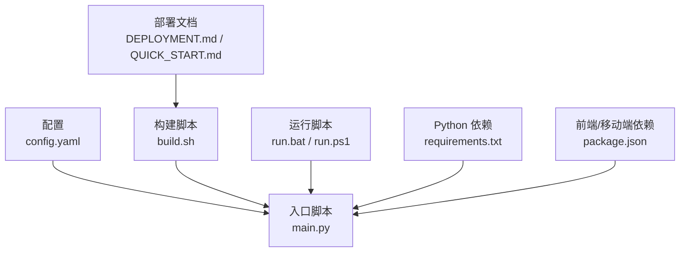
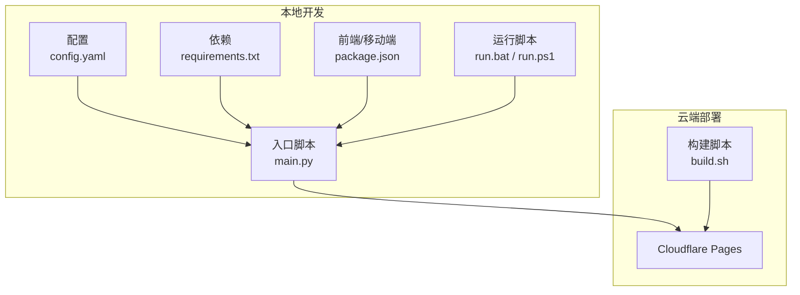
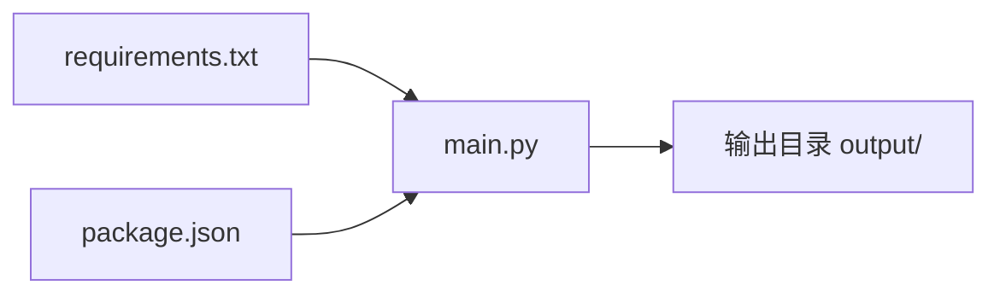
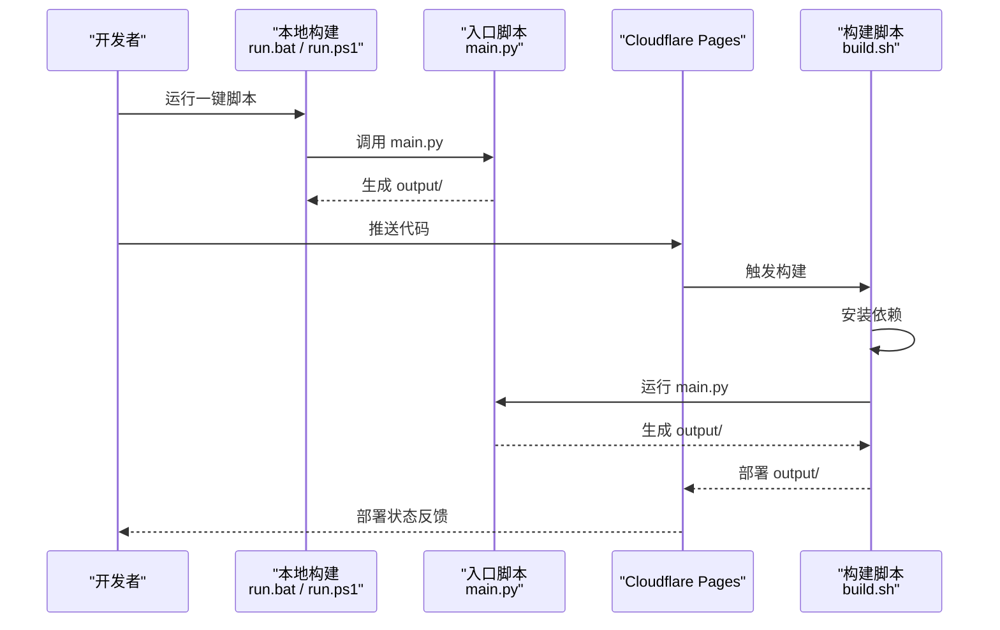
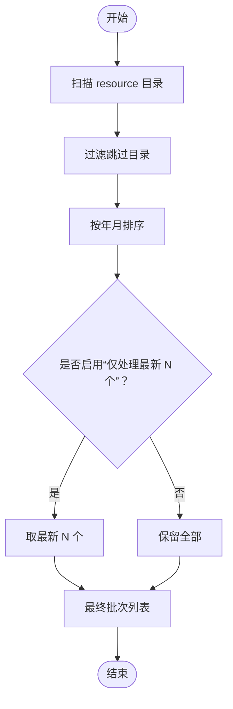

# 故障排除

<cite>
**本文引用的文件**   
- [main.py](file://main.py)
- [config.yaml](file://config.yaml)
- [requirements.txt](file://requirements.txt)
- [build.sh](file://build.sh)
- [DEPLOYMENT.md](file://DEPLOYMENT.md)
- [QUICK_START.md](file://QUICK_START.md)
- [run.bat](file://run.bat)
- [run.ps1](file://run.ps1)
- [package.json](file://package.json)
</cite>

## 目录
1. [简介](#简介)
2. [项目结构](#项目结构)
3. [核心组件](#核心组件)
4. [架构总览](#架构总览)
5. [详细组件分析](#详细组件分析)
6. [依赖分析](#依赖分析)
7. [性能考量](#性能考量)
8. [故障排除指南](#故障排除指南)
9. [结论](#结论)
10. [附录](#附录)

## 简介
本指南面向维护者与使用者，系统化梳理 CX 项目的安装、运行与部署常见问题，提供可操作的诊断步骤、日志定位方法、错误代码解读与修复建议。内容覆盖本地开发、自动化部署（Cloudflare Pages）、以及跨平台差异（Windows/PowerShell、Linux/macOS Shell）。

## 项目结构
- 配置与入口
  - 配置文件：config.yaml
  - 入口脚本：main.py
  - 构建脚本：build.sh
  - 一键运行脚本：run.bat、run.ps1
- 依赖管理
  - Python 依赖：requirements.txt
  - 前端/移动端集成：package.json（Capacitor）
- 部署与使用
  - 部署文档：DEPLOYMENT.md、QUICK_START.md

图表来源
- [main.py:655-800](file://main.py#L655-L800)
- [config.yaml:1-42](file://config.yaml#L1-L42)
- [build.sh:1-20](file://build.sh#L1-L20)
- [run.bat:1-44](file://run.bat#L1-L44)
- [run.ps1:1-48](file://run.ps1#L1-L48)
- [requirements.txt:1-16](file://requirements.txt#L1-L16)
- [package.json:1-30](file://package.json#L1-L30)

章节来源
- [main.py:655-800](file://main.py#L655-L800)
- [config.yaml:1-42](file://config.yaml#L1-L42)
- [build.sh:1-20](file://build.sh#L1-L20)
- [run.bat:1-44](file://run.bat#L1-L44)
- [run.ps1:1-48](file://run.ps1#L1-L48)
- [requirements.txt:1-16](file://requirements.txt#L1-L16)
- [package.json:1-30](file://package.json#L1-L30)

## 核心组件
- 配置加载与校验
  - 读取 config.yaml，解析批量处理开关、输出目录、资源目录、默认训练参数、远端服务器配置等。
- 批量扫描与筛选
  - 扫描 resource 子目录，按日期排序与“最新 N 个”策略筛选批次。
- 文档解析与产物生成
  - 解析听抄、经文、晨兴文档，生成 training.json、搜索索引、静态资源与清单文件。
- SPA 主页与静态资源
  - 生成 SPA shell、manifest、service worker、headers/redirects、资源包清单等。
- 构建与混淆
  - 依据环境变量决定是否混淆 JS；生成 remote-config.js。
- 部署与回滚
  - Cloudflare Pages 自动构建与部署；支持预览、回滚、自定义域名。

章节来源
- [main.py:54-58](file://main.py#L54-L58)
- [main.py:134-156](file://main.py#L134-L156)
- [main.py:205-314](file://main.py#L205-L314)
- [main.py:317-546](file://main.py#L317-L546)
- [main.py:471-495](file://main.py#L471-L495)
- [DEPLOYMENT.md:118-151](file://DEPLOYMENT.md#L118-L151)

## 架构总览

图表来源
- [main.py:655-800](file://main.py#L655-L800)
- [config.yaml:1-42](file://config.yaml#L1-L42)
- [requirements.txt:1-16](file://requirements.txt#L1-L16)
- [package.json:1-30](file://package.json#L1-L30)
- [build.sh:1-20](file://build.sh#L1-L20)

## 详细组件分析

### 组件A：配置加载与校验
- 关键点
  - 读取 YAML 配置，包含批量处理开关、输出/资源/模板目录、默认训练参数、远端服务器列表。
  - 若配置加载失败，主流程直接返回错误码，避免后续步骤。
- 常见问题
  - YAML 格式错误、字段类型不符、路径不存在。
- 诊断步骤
  - 使用在线 YAML 校验工具验证 config.yaml。
  - 检查路径字段是否指向实际存在的目录。
  - 逐步注释配置项定位问题段落。

章节来源
- [main.py:54-58](file://main.py#L54-L58)
- [config.yaml:1-42](file://config.yaml#L1-L42)

### 组件B：批量扫描与筛选
- 关键点
  - 扫描 resource 目录，跳过特定子目录；按文件夹名提取年月进行排序；支持“仅处理最新 N 个”的策略。
- 常见问题
  - 文件夹命名不符合规范导致无法识别年月。
  - 资源目录为空或权限不足。
- 诊断步骤
  - 确认 resource 下的子目录命名符合“YYYY-MM 名称”格式。
  - 检查目录权限与磁盘空间。
  - 临时关闭“仅处理最新 N 个”策略验证是否能列出全部批次。

章节来源
- [main.py:134-156](file://main.py#L134-L156)
- [main.py:718-751](file://main.py#L718-L751)

### 组件C：文档解析与产物生成
- 关键点
  - 解析听抄、经文、晨兴文档，生成 training.json；记录章节数、图片列表、版本号。
  - 异常捕获并打印堆栈，便于定位具体文件与步骤。
- 常见问题
  - 缺少必需文档（听抄/经文）。
  - 文档格式异常（.doc 未转换为 .docx）。
  - 解析过程中抛出异常。
- 诊断步骤
  - 确认每个批次目录包含听抄与经文文档。
  - 将 .doc 转换为 .docx 后重试。
  - 查看解析阶段的错误堆栈，定位到具体文件与行号。

章节来源
- [main.py:205-314](file://main.py#L205-L314)

### 组件D：SPA 主页与静态资源
- 关键点
  - 复制 SPA shell、注入最大缓存配置、复制图标、静态图片、共享 JS/CSS、生成 remote-config.js、清单与资源包。
- 常见问题
  - 缺少 src/static 下的必要文件导致复制失败。
  - remote-config.js 未生成或内容为空。
- 诊断步骤
  - 检查 src/static 与 src/templates 是否存在。
  - 确认 config.yaml 中 remote_servers 字段有效。
  - 对比输出目录中的文件完整性。

章节来源
- [main.py:317-546](file://main.py#L317-L546)

### 组件E：构建与混淆
- 关键点
  - 依据环境变量决定是否混淆 JS；默认在 CI 环境混淆。
- 常见问题
  - 本地开发模式下跳过混淆导致调试困难。
  - 环境变量设置不当。
- 诊断步骤
  - 设置 OBFUSCATE_JS=1 强制混淆；或在 CI 环境下确认 CI/GITHUB_ACTIONS 环境变量。
  - 检查 encrypt_app_update.py 是否存在且可导入。

章节来源
- [main.py:471-495](file://main.py#L471-L495)

### 组件F：部署与回滚（Cloudflare Pages）
- 关键点
  - 自动构建：安装依赖、运行 main.py、部署 output 目录。
  - 支持预览、回滚、自定义域名、环境变量。
- 常见问题
  - Python 版本不匹配。
  - 依赖安装失败。
  - 构建命令错误或权限问题。
- 诊断步骤
  - 在 Cloudflare Pages 项目中查看部署日志，定位失败阶段。
  - 确认 PYTHON_VERSION、DEBIAN_FRONTEND 等环境变量。
  - 确保所有文档为 .docx 格式。

章节来源
- [DEPLOYMENT.md:118-151](file://DEPLOYMENT.md#L118-L151)
- [build.sh:1-20](file://build.sh#L1-L20)

## 依赖分析
- Python 依赖
  - 必需：python-docx、PyYAML、Jinja2、Pillow、requests、beautifulsoup4、lxml、playwright、cryptography。
  - 可选：pywin32（Windows 下通过 COM 读取 .doc）。
- 前端/移动端
  - Capacitor 生态与文本转语音插件；打包脚本通过 npm scripts 调用。

图表来源
- [requirements.txt:1-16](file://requirements.txt#L1-L16)
- [package.json:1-30](file://package.json#L1-L30)
- [main.py:655-800](file://main.py#L655-L800)

章节来源
- [requirements.txt:1-16](file://requirements.txt#L1-L16)
- [package.json:1-30](file://package.json#L1-L30)

## 性能考量
- 控制打包体积
  - 通过“仅处理最新 N 个”策略限制批次数量，降低打包体积与构建时间。
- 压缩 JSON
  - 生成的圣经数据 JSON 去缩进，减少体积。
- 资源包分组
  - 历史训练按 10 年分组打包，不含图片，减小体积。
- 建议
  - 合理设置 max_latest_trainings，平衡构建时间与覆盖率。
  - 保持 .docx 格式，避免云端安装 LibreOffice 的需求。

章节来源
- [main.py:721-751](file://main.py#L721-L751)
- [main.py:783-791](file://main.py#L783-L791)
- [main.py:594-652](file://main.py#L594-L652)

## 故障排除指南

### 一、安装与环境问题
- 症状：运行脚本报错“虚拟环境不存在”
  - 原因：未创建或未激活 .venv。
  - 处理：按提示创建虚拟环境并安装依赖。
  - 参考
    - [run.bat:10-17](file://run.bat#L10-L17)
    - [run.ps1:10-16](file://run.ps1#L10-L16)
- 症状：requirements 安装失败
  - 原因：网络受限或代理问题。
  - 处理：更换 pip 源或配置代理；确认 Python 版本满足要求。
  - 参考
    - [requirements.txt:1-16](file://requirements.txt#L1-16)
- 症状：Cloudflare Pages 构建失败
  - 原因：Python 版本不匹配、依赖安装失败、构建命令错误。
  - 处理：在项目设置中添加 PYTHON_VERSION、DEBIAN_FRONTEND；确认 build.sh 可执行；确保 .docx 文档齐全。
  - 参考
    - [DEPLOYMENT.md:118-151](file://DEPLOYMENT.md#L118-L151)
    - [build.sh:1-20](file://build.sh#L1-L20)

章节来源
- [run.bat:10-17](file://run.bat#L10-L17)
- [run.ps1:10-16](file://run.ps1#L10-L16)
- [requirements.txt:1-16](file://requirements.txt#L1-L16)
- [DEPLOYMENT.md:118-151](file://DEPLOYMENT.md#L118-L151)
- [build.sh:1-20](file://build.sh#L1-L20)

### 二、运行时错误
- 症状：配置加载失败
  - 表现：直接返回错误码，不继续处理。
  - 处理：修正 config.yaml 格式与字段；逐项注释定位问题。
  - 参考
    - [main.py:675-682](file://main.py#L675-L682)
- 症状：未找到默认训练文件夹
  - 表现：单个训练模式下找不到对应目录。
  - 处理：确认 resource 下存在形如“年-季节”的目录。
  - 参考
    - [main.py:686-697](file://main.py#L686-L697)
- 症状：未找到指定训练文件夹
  - 表现：批量处理指定列表但目录不存在。
  - 处理：检查列表项与实际目录一致。
  - 参考
    - [main.py:704-717](file://main.py#L704-L717)
- 症状：在 resource 目录下未找到任何批次文件夹
  - 表现：提示未找到批次。
  - 处理：确认目录结构与命名规范。
  - 参考
    - [main.py:753-756](file://main.py#L753-L756)
- 症状：解析失败并打印堆栈
  - 表现：解析阶段抛出异常。
  - 处理：根据堆栈定位具体文件，检查文档格式与内容。
  - 参考
    - [main.py:279-283](file://main.py#L279-L283)
- 症状：training.json 生成失败
  - 表现：导出阶段异常。
  - 处理：检查解析结果与目标目录权限。
  - 参考
    - [main.py:288-292](file://main.py#L288-L292)

章节来源
- [main.py:675-682](file://main.py#L675-L682)
- [main.py:686-697](file://main.py#L686-L697)
- [main.py:704-717](file://main.py#L704-L717)
- [main.py:753-756](file://main.py#L753-L756)
- [main.py:279-283](file://main.py#L279-L283)
- [main.py:288-292](file://main.py#L288-L292)

### 三、部署问题
- 症状：部署失败
  - 表现：Cloudflare Pages 显示红色叉号。
  - 处理：查看 Build log 与 Function log，定位失败阶段；核对环境变量与构建命令。
  - 参考
    - [DEPLOYMENT.md:129-134](file://DEPLOYMENT.md#L129-L134)
- 症状：本地 output 需要提交吗？
  - 表现：疑问。
  - 处理：不需要，Cloudflare 会在云端重新生成。
  - 参考
    - [DEPLOYMENT.md:136-138](file://DEPLOYMENT.md#L136-L138)
- 症状：如何回滚到之前的版本
  - 处理：在 Deployments 标签中选择之前的部署并回滚。
  - 参考
    - [DEPLOYMENT.md:98-104](file://DEPLOYMENT.md#L98-L104)

章节来源
- [DEPLOYMENT.md:129-134](file://DEPLOYMENT.md#L129-L134)
- [DEPLOYMENT.md:136-138](file://DEPLOYMENT.md#L136-L138)
- [DEPLOYMENT.md:98-104](file://DEPLOYMENT.md#L98-L104)

### 四、日志分析与错误代码解读
- 日志位置
  - 本地：终端输出（标准输出/错误输出）。
  - 云端：Cloudflare Pages 项目 Deployments 页面的 Build log。
- 常见错误信号
  - “配置文件加载失败”：检查 config.yaml。
  - “未找到默认训练文件夹”：检查 resource 目录结构。
  - “解析失败”：检查文档格式与内容。
  - “training.json 生成失败”：检查导出逻辑与权限。
- 建议
  - 保存最近一次构建日志以便对比。
  - 在本地最小化复现问题，缩小范围后再上云验证。

章节来源
- [main.py:675-682](file://main.py#L675-L682)
- [main.py:686-697](file://main.py#L686-L697)
- [main.py:279-283](file://main.py#L279-L283)
- [main.py:288-292](file://main.py#L288-L292)
- [DEPLOYMENT.md:129-134](file://DEPLOYMENT.md#L129-L134)

### 五、不同操作系统下的特殊问题
- Windows
  - 虚拟环境路径与权限：确保 .venv 存在且可执行。
  - 运行脚本：run.bat 与 run.ps1 提示缺少虚拟环境时，按提示创建并安装依赖。
  - 参考
    - [run.bat:10-17](file://run.bat#L10-L17)
    - [run.ps1:10-16](file://run.ps1#L10-L16)
- Linux/macOS
  - 构建脚本 build.sh 需要可执行权限；确保 pip 安装依赖成功。
  - 参考
    - [build.sh:1-20](file://build.sh#L1-L20)
- 云端（Cloudflare Pages）
  - 无法安装 LibreOffice，必须使用 .docx 格式。
  - 参考
    - [DEPLOYMENT.md:37-39](file://DEPLOYMENT.md#L37-L39)

章节来源
- [run.bat:10-17](file://run.bat#L10-L17)
- [run.ps1:10-16](file://run.ps1#L10-L16)
- [build.sh:1-20](file://build.sh#L1-L20)
- [DEPLOYMENT.md:37-39](file://DEPLOYMENT.md#L37-L39)

### 六、调试工具与最佳实践
- 调试工具
  - Python：启用详细日志与异常堆栈（已在代码中打印）。
  - 浏览器：开发者工具检查 SPA shell、JS 资源与 remote-config.js。
  - 云端：利用 Cloudflare Pages 的部署日志定位失败阶段。
- 最佳实践
  - 本地先行最小化复现，再上云验证。
  - 保持 .docx 格式，避免云端安装 LibreOffice。
  - 合理设置“仅处理最新 N 个”，平衡构建时间与覆盖率。
  - 使用环境变量 OBFUSCATE_JS 控制混淆，便于本地调试。

章节来源
- [main.py:471-495](file://main.py#L471-L495)
- [DEPLOYMENT.md:118-151](file://DEPLOYMENT.md#L118-L151)

## 结论
通过系统化的配置校验、批量扫描策略、文档解析与产物生成流程、SPA 主页与静态资源生成、构建与混淆控制，以及 Cloudflare Pages 的自动部署与回滚机制，CX 项目具备清晰的故障定位路径。遵循本指南的诊断步骤与最佳实践，可显著提升问题解决效率，快速恢复正常使用。

## 附录

### A. 关键流程时序图：构建与部署

图表来源
- [run.bat:22](file://run.bat#L22)
- [run.ps1:22](file://run.ps1#L22)
- [main.py:655-800](file://main.py#L655-L800)
- [build.sh:11-17](file://build.sh#L11-L17)
- [DEPLOYMENT.md:43-47](file://DEPLOYMENT.md#L43-L47)

### B. 算法流程图：批量扫描与筛选

图表来源
- [main.py:134-156](file://main.py#L134-L156)
- [main.py:718-751](file://main.py#L718-L751)