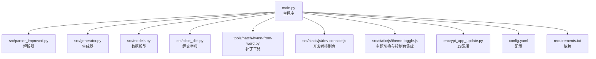
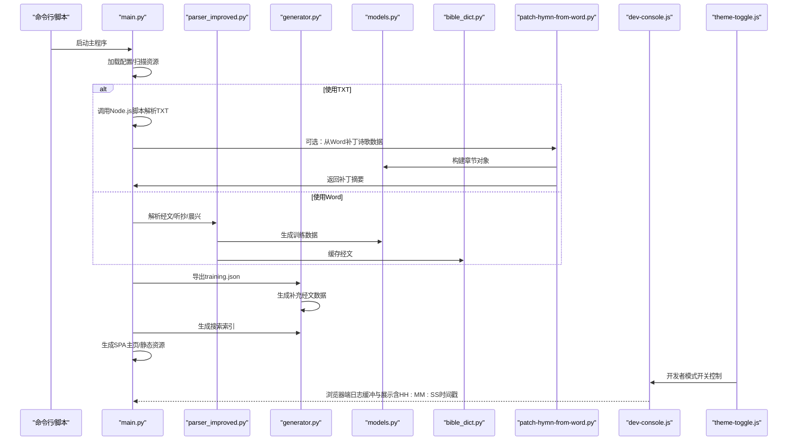
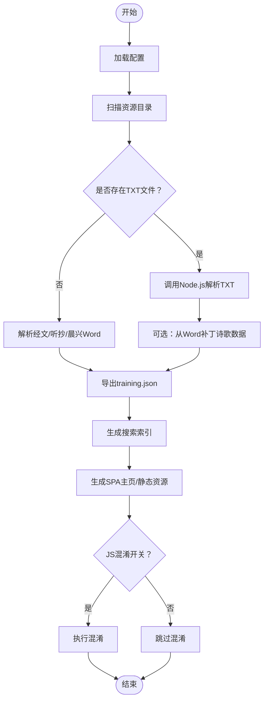
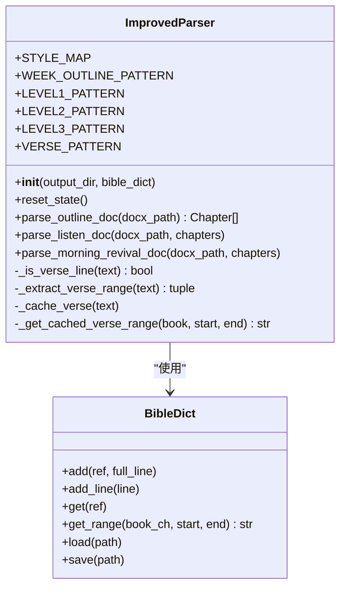
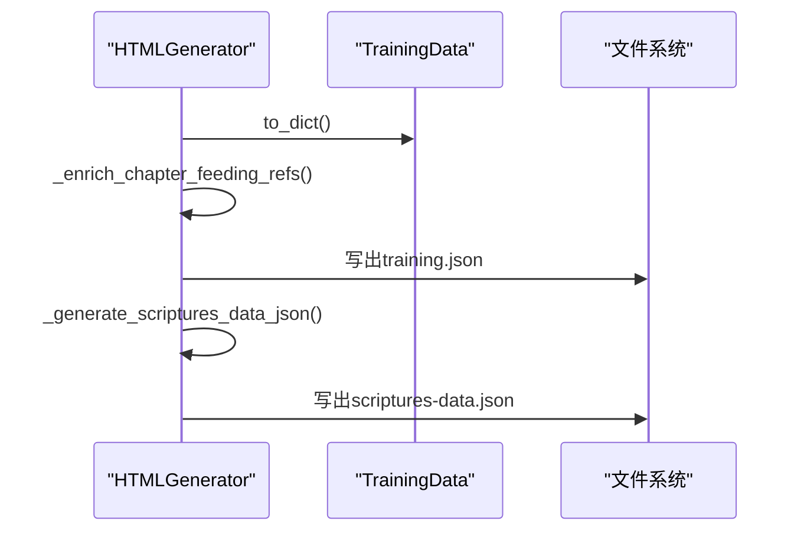
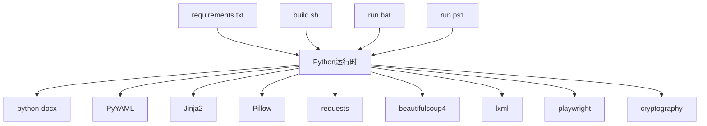

# 调试工具和方法

<cite>
**本文引用的文件**
- [main.py](file://main.py)
- [config.yaml](file://config.yaml)
- [requirements.txt](file://requirements.txt)
- [src/parser_improved.py](file://src/parser_improved.py)
- [src/generator.py](file://src/generator.py)
- [src/models.py](file://src/models.py)
- [src/bible_dict.py](file://src/bible_dict.py)
- [tools/patch-hymn-from-word.py](file://tools/patch-hymn-from-word.py)
- [src/static/js/dev-console.js](file://src/static/js/dev-console.js)
- [src/static/js/theme-toggle.js](file://src/static/js/theme-toggle.js)
- [encrypt_app_update.py](file://encrypt_app_update.py)
- [build.sh](file://build.sh)
- [run.bat](file://run.bat)
- [run.ps1](file://run.ps1)
</cite>

## 目录
1. [简介](#简介)
2. [项目结构](#项目结构)
3. [核心组件](#核心组件)
4. [架构概览](#架构概览)
5. [详细组件分析](#详细组件分析)
6. [依赖分析](#依赖分析)
7. [性能考虑](#性能考虑)
8. [故障排除指南](#故障排除指南)
9. [结论](#结论)
10. [附录](#附录)

## 简介
本指南面向CX项目的调试与排障需求，围绕Python调试器使用、日志分析技巧、错误追踪方法展开，结合项目实际代码实现，提供命令行参数调试、环境变量配置、断点设置等实用技巧，并覆盖文档解析问题定位、数据处理异常排查、生成器错误诊断等常见场景的解决方案，最后总结调试最佳实践与效率提升建议。

**更新** 本版本新增了开发者控制台复制功能的时间戳格式化增强，现在支持精确的HH:MM:SS时间戳格式，便于调试时精确定位事件发生时间。

## 项目结构
项目采用"主程序 + 解析器 + 生成器 + 数据模型 + 工具脚本 + 前端调试控制台"的分层组织方式：
- 主程序负责流程编排、配置加载、批处理调度与产物生成
- 解析器负责从Word/TXT提取结构化数据
- 生成器负责JSON与搜索索引生成
- 数据模型定义训练、篇章、内容等核心数据结构
- 工具脚本提供辅助能力（如从Word补丁诗歌数据）
- 前端JS提供开发者控制台与调试能力，包括增强的时间戳格式化功能

**图表来源**
- [main.py:1-120](file://main.py#L1-L120)
- [src/parser_improved.py:1-120](file://src/parser_improved.py#L1-L120)
- [src/generator.py:1-120](file://src/generator.py#L1-L120)
- [src/models.py:1-120](file://src/models.py#L1-L120)
- [src/bible_dict.py:1-96](file://src/bible_dict.py#L1-L96)
- [tools/patch-hymn-from-word.py:1-152](file://tools/patch-hymn-from-word.py#L1-L152)
- [src/static/js/dev-console.js:1-187](file://src/static/js/dev-console.js#L1-L187)
- [src/static/js/theme-toggle.js:1-1471](file://src/static/js/theme-toggle.js#L1-L1471)
- [encrypt_app_update.py:1-263](file://encrypt_app_update.py#L1-L263)
- [config.yaml:1-42](file://config.yaml#L1-L42)
- [requirements.txt:1-16](file://requirements.txt#L1-L16)

**章节来源**
- [main.py:1-120](file://main.py#L1-L120)
- [config.yaml:1-42](file://config.yaml#L1-L42)
- [requirements.txt:1-16](file://requirements.txt#L1-L16)

## 核心组件
- 主程序（main.py）
  - 负责扫描资源目录、选择TXT或Word解析路径、生成训练索引与静态资源、JS混淆开关控制
  - 关键流程：配置加载、文件发现、TXT/Word解析、训练数据导出、SPA主页生成
- 解析器（src/parser_improved.py）
  - 支持.doc/.docx，.doc通过LibreOffice转换；提取标题、纲目、经文、职事摘录、晨兴喂养等内容
  - 提供经文引用解析、层级结构识别、标语提取等能力
- 生成器（src/generator.py）
  - 生成training.json、补充经文数据、构建搜索索引
  - 提供HTML生成器与搜索索引生成器
- 数据模型（src/models.py）
  - 定义TrainingData、Chapter、Content、MorningRevival等数据结构
- 经文字典（src/bible_dict.py）
  - 持久化存储经文，支持增量加载与保存
- 补丁工具（tools/patch-hymn-from-word.py）
  - 从晨兴Word补丁诗歌文本与图片到TXT生成的training.json
- 开发者控制台（src/static/js/dev-console.js）
  - 捕获并可视化console输出，支持复制、清空、展开/收起，现已增强时间戳格式化功能
- 主题切换与控制台集成（src/static/js/theme-toggle.js）
  - 管理开发者模式开关，控制开发者控制台的初始化与销毁
- JS混淆（encrypt_app_update.py）
  - 对remote-config.js、app-update.js、theme-toggle.js进行混淆保护

**章节来源**
- [main.py:410-536](file://main.py#L410-L536)
- [src/parser_improved.py:115-284](file://src/parser_improved.py#L115-L284)
- [src/generator.py:22-116](file://src/generator.py#L22-L116)
- [src/models.py:9-232](file://src/models.py#L9-L232)
- [src/bible_dict.py:19-96](file://src/bible_dict.py#L19-L96)
- [tools/patch-hymn-from-word.py:42-135](file://tools/patch-hymn-from-word.py#L42-L135)
- [src/static/js/dev-console.js:84-179](file://src/static/js/dev-console.js#L84-L179)
- [src/static/js/theme-toggle.js:397-599](file://src/static/js/theme-toggle.js#L397-L599)
- [encrypt_app_update.py:155-167](file://encrypt_app_update.py#L155-L167)

## 架构概览
下图展示从输入到输出的关键交互路径，涵盖TXT/Word解析、训练数据导出、搜索索引生成与SPA主页构建，以及增强的开发者控制台时间戳功能：

**图表来源**
- [main.py:258-407](file://main.py#L258-L407)
- [main.py:410-536](file://main.py#L410-L536)
- [src/parser_improved.py:367-782](file://src/parser_improved.py#L367-L782)
- [src/generator.py:383-425](file://src/generator.py#L383-L425)
- [src/generator.py:428-546](file://src/generator.py#L428-L546)
- [tools/patch-hymn-from-word.py:42-135](file://tools/patch-hymn-from-word.py#L42-L135)
- [src/static/js/dev-console.js:84-179](file://src/static/js/dev-console.js#L84-L179)
- [src/static/js/theme-toggle.js:397-599](file://src/static/js/theme-toggle.js#L397-L599)

## 详细组件分析

### 组件A：主程序（流程与调试要点）
- 关键职责
  - 配置加载、资源扫描、TXT/Word解析路径选择、训练数据导出、SPA主页生成、JS混淆控制
- 调试关注点
  - 配置项（batch_processing、output_dir、remote_servers等）影响整体行为
  - TXT解析通过subprocess调用外部脚本，stderr/stdout需关注
  - Word解析涉及LibreOffice转换，超时与格式错误需捕获
  - 生成阶段的异常应打印堆栈并返回失败码
- 常见问题定位
  - "未找到TXT构建脚本"：确认tools/build-batch-txt.js存在
  - "TXT解析失败"：查看stderr输出与returncode
  - "LibreOffice转换超时"：检查系统是否安装LibreOffice且路径正确
  - "JS混淆失败"：检查javascript-obfuscator是否全局安装

**图表来源**
- [main.py:258-407](file://main.py#L258-L407)
- [main.py:410-536](file://main.py#L410-L536)
- [main.py:696-720](file://main.py#L696-L720)

**章节来源**
- [main.py:258-407](file://main.py#L258-L407)
- [main.py:410-536](file://main.py#L410-L536)
- [main.py:696-720](file://main.py#L696-L720)

### 组件B：解析器（调试与排障）
- 关键职责
  - 识别.doc/.docx，必要时通过LibreOffice转换；提取标题、纲目、经文、职事摘录、晨兴喂养
- 调试关注点
  - .doc转换失败：检查soffice命令路径与可执行性，超时阈值60秒
  - 经文识别：VERSER_PATTERN与多类引用格式需验证
  - 标语提取：需过滤日期、数字、括号内容
  - 层级结构：中文数字层级与罗马数字层级的识别
- 常见问题定位
  - "无法自动转换.doc文件"：提示手动转换或安装LibreOffice
  - "经文范围解析失败"：检查缓存与持久化字典的键值一致性
  - "标语重复/空内容"：检查过滤规则与标题/副标题去重逻辑

**图表来源**
- [src/parser_improved.py:115-284](file://src/parser_improved.py#L115-L284)
- [src/parser_improved.py:367-782](file://src/parser_improved.py#L367-L782)
- [src/bible_dict.py:19-96](file://src/bible_dict.py#L19-L96)

**章节来源**
- [src/parser_improved.py:16-113](file://src/parser_improved.py#L16-L113)
- [src/parser_improved.py:115-284](file://src/parser_improved.py#L115-L284)
- [src/parser_improved.py:367-782](file://src/parser_improved.py#L367-L782)
- [src/bible_dict.py:19-96](file://src/bible_dict.py#L19-L96)

### 组件C：生成器（调试与排障）
- 关键职责
  - 导出training.json、生成补充经文数据、构建搜索索引
- 调试关注点
  - scriptures-data.json生成失败：检查bible-text.json存在性与完整性
  - search-index.json构建：确认training.json存在且结构正确
  - HTML生成器复制静态资源失败不应阻断流程
- 常见问题定位
  - "scriptures-data.json生成失败"：检查bible-text.json路径与权限
  - "search-index.json生成失败"：检查训练数量与文件完整性

**图表来源**
- [src/generator.py:383-425](file://src/generator.py#L383-L425)
- [src/generator.py:334-373](file://src/generator.py#L334-L373)

**章节来源**
- [src/generator.py:22-116](file://src/generator.py#L22-L116)
- [src/generator.py:383-425](file://src/generator.py#L383-L425)
- [src/generator.py:428-546](file://src/generator.py#L428-L546)

### 组件D：数据模型（调试与排障）
- 关键职责
  - 定义训练、篇章、内容、晨兴等数据结构，提供to_dict序列化
- 调试关注点
  - 晨兴喂养经文分离：需正确识别经文格式与正文边界
  - 层级结构转字典：确保children递归转换正确
- 常见问题定位
  - "经文分离异常"：检查正则匹配与段落长度阈值
  - "层级结构丢失"：检查_children字段与递归转换逻辑

**章节来源**
- [src/models.py:9-232](file://src/models.py#L9-L232)

### 组件E：补丁工具（调试与排障）
- 关键职责
  - 从晨兴Word提取诗歌文本与图片，合并到training.json
- 调试关注点
  - training.json不存在或章节为空：需提前确认TXT解析成功
  - 未找到晨兴文档：确认批次文件夹命名与扩展名
  - stdout摘要输出：供调用方解析补丁结果
- 常见问题定位
  - "未找到training.json"：确认TXT解析阶段已生成
  - "未找到晨兴文档"：检查文件名包含"晨兴"或"morning"

**章节来源**
- [tools/patch-hymn-from-word.py:42-135](file://tools/patch-hymn-from-word.py#L42-L135)

### 组件F：开发者控制台（调试与排障）
- 关键职责
  - 捕获console输出，提供可视化面板，支持复制与清空
  - **增强功能**：现在支持精确的HH:MM:SS时间戳格式化，便于调试时精确定位事件发生时间
- 调试关注点
  - 未捕获异常与Promise拒绝会被记录，包含时间戳
  - 面板展开时自动滚动到底部
  - **新增**：复制功能现在包含精确的时间戳格式（hh:mm:ss）
- 常见问题定位
  - "面板不显示"：检查theme-toggle.js是否触发init
  - "日志丢失"：确认缓冲上限与DOM操作
  - **新增**："复制日志时间戳格式不正确"：检查时间戳格式化函数实现

**更新** 开发者控制台的复制功能现已增强，支持精确的HH:MM:SS时间戳格式化。当用户点击复制按钮时，日志将按照以下格式输出：
- 面板中的单条日志：`hh:mm:ss 日志内容`
- 复制的完整日志：`hh:mm:ss [级别] 日志内容`

**章节来源**
- [src/static/js/dev-console.js:84-179](file://src/static/js/dev-console.js#L84-L179)
- [src/static/js/dev-console.js:145-166](file://src/static/js/dev-console.js#L145-L166)

### 组件G：主题切换与控制台集成（调试与排障）
- 关键职责
  - 管理开发者模式开关，控制开发者控制台的初始化与销毁
  - 通过localStorage控制开发者模式状态
- 调试关注点
  - 开发者模式开关：通过localStorage.cx_dev_mode控制
  - 控制台初始化时机：页面加载时自动检查开发者模式状态
  - 主题切换与控制台的协调工作
- 常见问题定位
  - "开发者模式无法开启"：检查localStorage访问权限
  - "控制台初始化失败"：确认window.CXDevConsole存在
  - "模式切换不生效"：检查事件监听器绑定

**章节来源**
- [src/static/js/theme-toggle.js:397-599](file://src/static/js/theme-toggle.js#L397-L599)

## 依赖分析
- Python运行时与第三方库
  - python-docx、PyYAML、Jinja2、Pillow、requests、beautifulsoup4、lxml、playwright、cryptography
  - optional：pywin32（Windows下通过COM读取.doc）
- 构建与运行脚本
  - build.sh：Cloudflare Pages构建脚本，要求所有文档为.docx
  - run.bat/run.ps1：Windows启动脚本，检查虚拟环境并运行主程序

**图表来源**
- [requirements.txt:1-16](file://requirements.txt#L1-L16)
- [build.sh:1-20](file://build.sh#L1-L20)
- [run.bat:1-44](file://run.bat#L1-L44)
- [run.ps1:1-48](file://run.ps1#L1-L48)

**章节来源**
- [requirements.txt:1-16](file://requirements.txt#L1-L16)
- [build.sh:1-20](file://build.sh#L1-L20)
- [run.bat:1-44](file://run.bat#L1-L44)
- [run.ps1:1-48](file://run.ps1#L1-L48)

## 性能考虑
- 解析阶段
  - LibreOffice转换超时阈值60秒，建议优先准备.docx
  - 正则表达式预编译，减少重复编译开销
- 生成阶段
  - scriptures-data.json按全本圣经过滤，避免重复数据
  - 搜索索引按训练文件批量读取，注意I/O开销
- 前端调试
  - dev-console.js仅缓冲最近500条日志，避免内存占用过大
  - **新增**：时间戳格式化使用padStart方法，性能优化的时间格式化处理

## 故障排除指南
- 配置与环境
  - 配置文件缺失或格式错误：检查config.yaml键值与注释
  - 依赖安装：确保requirements.txt中依赖已安装
  - 环境变量：OBFUSCATE_JS控制JS混淆开关
- 文档解析
  - .doc转换失败：安装LibreOffice或手动转换为.docx
  - 经文范围解析异常：核对缓存与持久化字典键值
  - 标语提取异常：检查过滤规则与标题/副标题去重
- 数据导出
  - training.json导出失败：检查TrainingData结构与to_dict实现
  - scriptures-data.json生成失败：确认bible-text.json存在
  - search-index.json生成失败：确认training.json存在且可读
- 生成器与SPA
  - SPA主页生成失败：检查模板与静态资源复制
  - JS混淆失败：安装javascript-obfuscator并确保npx可用
- 前端调试
  - 控制台不显示：确认dev-console.js被正确引入与初始化
  - **新增**：时间戳格式异常：检查Date对象的getHours/getMinutes/getSeconds方法
  - **新增**：复制功能失效：确认navigator.clipboard API可用或备用textarea方案

**章节来源**
- [config.yaml:1-42](file://config.yaml#L1-L42)
- [requirements.txt:1-16](file://requirements.txt#L1-L16)
- [main.py:696-720](file://main.py#L696-L720)
- [src/parser_improved.py:38-112](file://src/parser_improved.py#L38-L112)
- [src/generator.py:428-546](file://src/generator.py#L428-L546)
- [encrypt_app_update.py:12-60](file://encrypt_app_update.py#L12-L60)
- [src/static/js/dev-console.js:84-179](file://src/static/js/dev-console.js#L84-L179)

## 结论
通过结合Python调试器、日志分析、断点设置与环境变量控制，可以高效定位与解决CX项目在文档解析、数据导出与前端生成过程中的各类问题。**新增的开发者控制台时间戳格式化功能**进一步提升了调试效率，精确的HH:MM:SS时间戳格式使得事件追踪更加准确。建议在开发阶段启用JS混淆开关，在CI环境中自动执行混淆，以平衡调试便利与发布安全。

## 附录
- 常用调试命令
  - 运行主程序：python main.py
  - 生成搜索索引：在生成training.json后执行生成器的索引生成函数
  - 混淆JS：python encrypt_app_update.py
- 常用环境变量
  - OBFUSCATE_JS：控制JS混淆开关（1/0或true/false）
  - CI/GITHUB_ACTIONS：在CI环境下默认启用混淆
  - **新增**：cx_dev_mode：控制开发者模式开关（1/0）
- 常见问题清单
  - "找不到TXT构建脚本"：确认tools/build-batch-txt.js存在
  - "LibreOffice转换超时"：检查soffice命令与系统安装
  - "未找到training.json"：确认TXT解析阶段成功
  - "javascript-obfuscator未安装"：全局安装并确保npx可用
  - **新增**："复制日志时间戳格式不正确"：检查时间戳格式化函数实现
  - **新增**："开发者模式无法开启"：检查localStorage访问权限