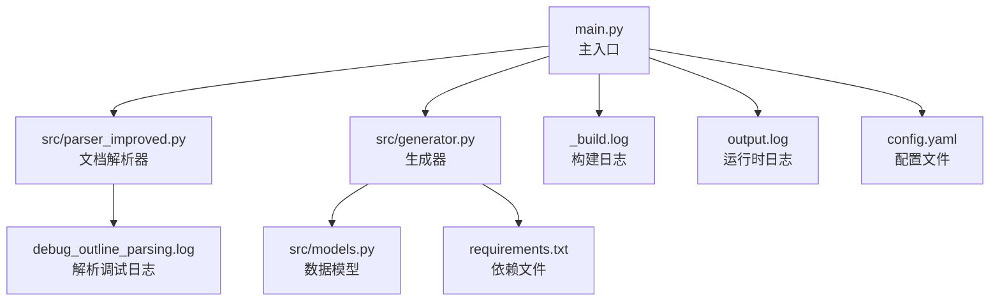
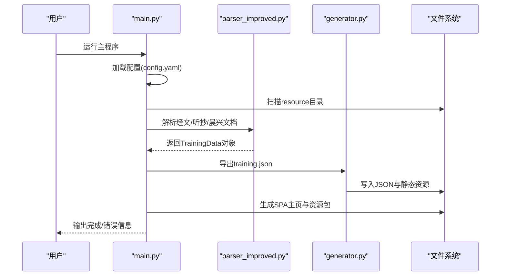
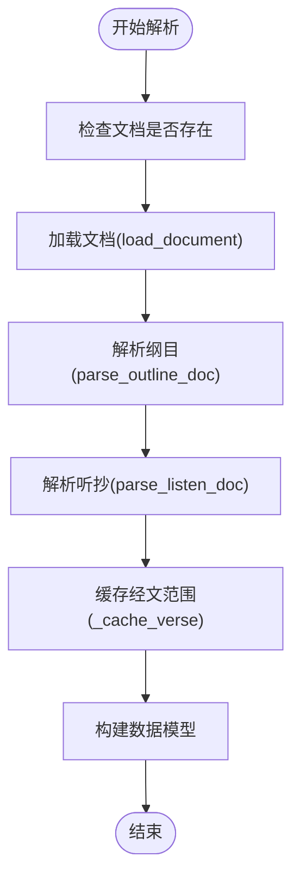
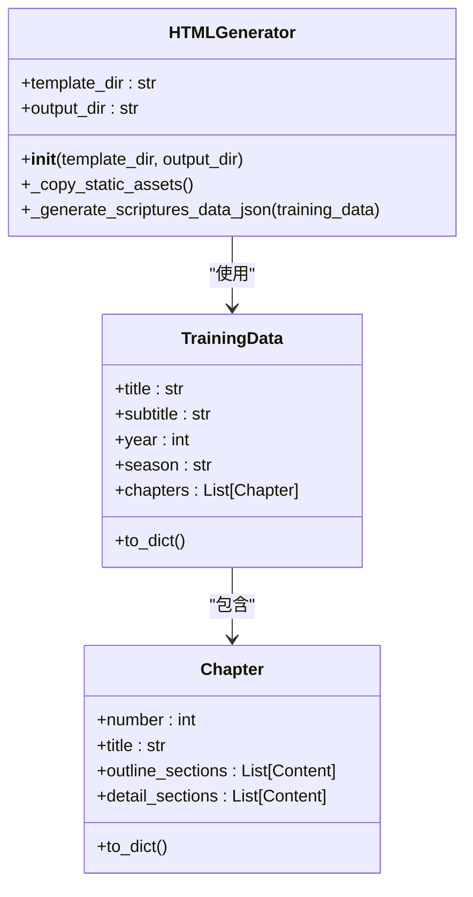
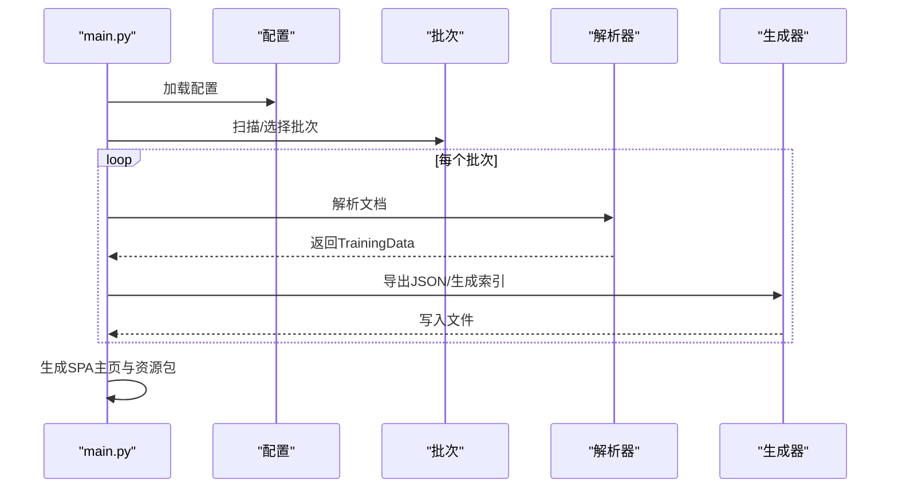
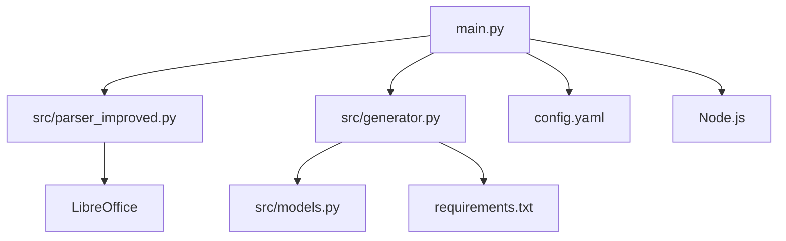

# 运行时错误

<cite>
**本文档引用的文件**
- [main.py](file://main.py)
- [src/parser_improved.py](file://src/parser_improved.py)
- [src/generator.py](file://src/generator.py)
- [src/models.py](file://src/models.py)
- [_build.log](file://_build.log)
- [debug_outline_parsing.log](file://debug_outline_parsing.log)
- [output.log](file://output.log)
- [config.yaml](file://config.yaml)
- [requirements.txt](file://requirements.txt)
</cite>

## 目录
1. [简介](#简介)
2. [项目结构](#项目结构)
3. [核心组件](#核心组件)
4. [架构概览](#架构概览)
5. [详细组件分析](#详细组件分析)
6. [依赖分析](#依赖分析)
7. [性能考虑](#性能考虑)
8. [故障排除指南](#故障排除指南)
9. [结论](#结论)
10. [附录](#附录)

## 简介
本指南面向CX项目运行时错误的全面故障排除，涵盖文档解析错误、数据模型处理异常、静态网站生成失败等常见问题。内容包括错误代码解读、堆栈跟踪分析、内存不足问题、Word文档格式兼容性问题、文件路径错误、编码问题等具体案例与修复方法，并提供调试技巧与日志分析方法。

## 项目结构
CX项目采用模块化设计，核心流程包括：配置加载、文档扫描与选择、文档解析、数据模型构建、JSON导出、静态资源复制、SPA主页生成与资源包打包。关键文件与职责如下：
- main.py：主入口，负责配置加载、批次扫描、批量处理、SPA主页生成、资源包打包
- src/parser_improved.py：改进的Word文档解析器，支持.doc与.docx，处理大纲、经文、晨兴等内容
- src/generator.py：HTML/JSON生成器，负责training.json导出、搜索索引生成、静态资源复制
- src/models.py：数据模型定义，包括Chapter、Content、TrainingData等
- 日志文件：_build.log、debug_outline_parsing.log、output.log，记录构建过程、解析调试与运行时错误
- 配置与依赖：config.yaml、requirements.txt

**图表来源**
- [main.py](file://main.py)
- [src/parser_improved.py](file://src/parser_improved.py)
- [src/generator.py](file://src/generator.py)
- [src/models.py](file://src/models.py)
- [_build.log](file://_build.log)
- [debug_outline_parsing.log](file://debug_outline_parsing.log)
- [output.log](file://output.log)
- [config.yaml](file://config.yaml)
- [requirements.txt](file://requirements.txt)

**章节来源**
- [main.py](file://main.py)
- [src/parser_improved.py](file://src/parser_improved.py)
- [src/generator.py](file://src/generator.py)
- [src/models.py](file://src/models.py)
- [_build.log](file://_build.log)
- [debug_outline_parsing.log](file://debug_outline_parsing.log)
- [output.log](file://output.log)
- [config.yaml](file://config.yaml)
- [requirements.txt](file://requirements.txt)

## 核心组件
- 配置加载与验证：从config.yaml读取配置，校验路径与参数
- 批次扫描与选择：扫描resource目录，按规则筛选批次，支持指定批次与最新N个批次策略
- 文档解析：支持.doc与.docx，自动识别样式与结构，提取大纲、经文、晨兴内容
- 数据模型：构建TrainingData、Chapter、Content等对象，支持序列化为JSON
- JSON导出与搜索索引：生成training.json与search-index.json
- 静态资源复制：复制JS/CSS/图片等共享资源
- SPA主页生成：复制SPA shell、生成manifest、SW、Headers/Redirects等
- 资源包打包：按10年分组打包历史训练，生成resource-packs.json

**章节来源**
- [main.py](file://main.py)
- [src/parser_improved.py](file://src/parser_improved.py)
- [src/generator.py](file://src/generator.py)
- [src/models.py](file://src/models.py)

## 架构概览
整体架构采用“配置驱动 + 批处理 + 解析 + 生成”的流水线模式。解析器负责从Word文档抽取结构化数据，生成器负责将数据转换为静态网站所需的JSON与HTML资源，主程序协调整个流程并处理异常与日志。

**图表来源**
- [main.py](file://main.py)
- [src/parser_improved.py](file://src/parser_improved.py)
- [src/generator.py](file://src/generator.py)

## 详细组件分析

### 组件A：文档解析器（src/parser_improved.py）
- 功能概述：支持.doc与.docx格式，自动识别样式与结构，提取大纲、经文、晨兴内容，处理“从略”占位符与经文范围缓存
- 关键实现：
  - load_document：自动识别格式，.doc通过LibreOffice转换为.docx
  - parse_outline_doc：解析纲目文档，提取标题、标语、经文、职事摘录
  - parse_listen_doc：解析听抄文档，构建详细内容结构
  - _cache_verse/_get_cached_verse_range：经文范围缓存与回填
- 错误处理：对不支持格式抛出异常，.doc转换失败提供友好提示

**图表来源**
- [src/parser_improved.py](file://src/parser_improved.py)

**章节来源**
- [src/parser_improved.py](file://src/parser_improved.py)

### 组件B：生成器（src/generator.py）
- 功能概述：负责JSON导出、搜索索引生成、静态资源复制
- 关键实现：
  - export_training_json：生成training.json，包含补充经文数据
  - generate_search_index_from_json：基于training.json生成search-index.json
  - HTMLGenerator：复制共享JS/CSS/图片，生成scriptures-data.json
- 错误处理：静态资源复制失败不影响HTML生成， scriptures-data.json生成失败仅打印警告

**图表来源**
- [src/generator.py](file://src/generator.py)
- [src/models.py](file://src/models.py)

**章节来源**
- [src/generator.py](file://src/generator.py)
- [src/models.py](file://src/models.py)

### 组件C：主程序（main.py）
- 功能概述：协调配置加载、批次扫描、解析与生成，处理异常与日志
- 关键实现：
  - load_config：加载config.yaml
  - scan_resource_folders/find_document/find_document_in_folder：文件查找与选择
  - process_batch：单批次处理，调用解析器与生成器
  - generate_main_index：生成SPA主页与静态资源
  - generate_resource_packs：历史训练资源包打包
- 错误处理：捕获解析与生成异常，打印堆栈跟踪，返回错误码

**图表来源**
- [main.py](file://main.py)
- [src/parser_improved.py](file://src/parser_improved.py)
- [src/generator.py](file://src/generator.py)

**章节来源**
- [main.py](file://main.py)

## 依赖分析
- Python依赖：python-docx（解析.docx）、Jinja2（模板渲染）、yaml/json（配置与数据）、subprocess（LibreOffice转换）
- 外部工具：LibreOffice（.doc转换）、Node.js（历史合辑构建）
- 文件依赖：config.yaml、模板与静态资源、Word文档

**图表来源**
- [main.py](file://main.py)
- [src/parser_improved.py](file://src/parser_improved.py)
- [src/generator.py](file://src/generator.py)
- [src/models.py](file://src/models.py)
- [config.yaml](file://config.yaml)
- [requirements.txt](file://requirements.txt)

**章节来源**
- [requirements.txt](file://requirements.txt)
- [config.yaml](file://config.yaml)

## 性能考虑
- 批量处理策略：通过max_latest_trainings限制最新批次数量，降低打包体积与处理时间
- 资源压缩：生成的JSON去缩进，减少体积
- 静态资源复用：共享JS/CSS/图片复制到根目录，避免重复
- 经文范围缓存：提升“从略”占位符回填效率

[本节为通用指导，无需引用具体文件]

## 故障排除指南

### 1. 文档解析错误
- 症状
  - 未找到听抄/经文文档，跳过批次
  - “从略”占位符无法回填，经文范围缺失
  - .doc文件无法自动转换，提示安装LibreOffice
- 根因分析
  - 文档命名不规范或路径错误
  - .doc格式未安装LibreOffice或转换超时
  - “从略”占位符与经文范围缓存不匹配
- 修复方法
  - 确保文件名为“听抄.doc/.docx”、“经文.doc/.docx”、“晨兴.doc/.docx”等
  - 安装LibreOffice并确保soffice命令可用，或手动转换为.docx
  - 检查经文范围格式与缓存逻辑，确保“从略”前后经文存在
- 相关代码路径
  - [find_document/find_document_in_folder](file://main.py)
  - [load_document](file://src/parser_improved.py)
  - [parse_outline_doc/parse_listen_doc](file://src/parser_improved.py)

**章节来源**
- [main.py](file://main.py)
- [src/parser_improved.py](file://src/parser_improved.py)

### 2. 数据模型处理异常
- 症状
  - training.json导出失败
  - scriptures-data.json生成失败
  - 搜索索引生成异常
- 根因分析
  - JSON序列化异常（编码/Unicode）
  - 模型字段缺失或类型不匹配
  - 文件写入权限不足
- 修复方法
  - 确保编码为UTF-8，避免非法字符
  - 检查模型to_dict()与字段映射
  - 确认输出目录可写
- 相关代码路径
  - [export_training_json](file://src/generator.py)
  - [generate_search_index_from_json](file://src/generator.py)
  - [to_dict](file://src/models.py)

**章节来源**
- [src/generator.py](file://src/generator.py)
- [src/models.py](file://src/models.py)

### 3. 静态网站生成失败
- 症状
  - SPA主页未生成或缺失
  - 静态资源复制失败
  - remote-config.js生成异常
- 根因分析
  - 模板文件缺失（src/static/index.html）
  - Node.js未安装或历史合辑构建失败
  - 远程服务器配置错误
- 修复方法
  - 确保src/static/index.html存在
  - 安装Node.js并确保build-trainings-json.js可执行
  - 检查config.yaml中的remote_servers配置
- 相关代码路径
  - [generate_main_index](file://main.py)
  - [generate_remote_config_js](file://main.py)

**章节来源**
- [main.py](file://main.py)

### 4. Word文档格式兼容性问题
- 症状
  - .doc文件转换失败或超时
  - 文档样式不匹配导致解析异常
- 根因分析
  - LibreOffice未安装或路径不正确
  - 不同版本Word样式差异
- 修复方法
  - 手动将.doc转换为.docx后运行
  - 统一使用.docx格式
- 相关代码路径
  - [load_document](file://src/parser_improved.py)

**章节来源**
- [src/parser_improved.py](file://src/parser_improved.py)

### 5. 文件路径错误
- 症状
  - 未找到指定训练文件夹
  - 输出目录不存在或不可写
- 根因分析
  - resource_dir或output_dir配置错误
  - 相对路径与绝对路径混用
- 修复方法
  - 检查config.yaml中的路径配置
  - 使用绝对路径或确保相对路径正确
- 相关代码路径
  - [scan_resource_folders](file://main.py)
  - [load_config](file://main.py)

**章节来源**
- [main.py](file://main.py)
- [config.yaml](file://config.yaml)

### 6. 编码问题
- 症状
  - Unicode编码错误（如“非法多字节序列”）
  - 日志文件显示gbk编码无法解码
- 根因分析
  - 文件系统默认编码与Python默认编码不一致
  - 日志输出未正确设置编码
- 修复方法
  - 在Python启动时设置UTF-8编码
  - 确保文件读写使用UTF-8编码
- 相关代码路径
  - [main.py中的stdout.reconfigure](file://main.py)
  - [output.log中的编码错误](file://output.log)

**章节来源**
- [main.py](file://main.py)
- [output.log](file://output.log)

### 7. 堆栈跟踪分析
- 分析要点
  - 查看异常类型与发生位置
  - 关注LibreOffice转换超时、远程命令错误、编码错误等
  - 结合日志文件定位具体文件与行号
- 常见异常
  - NativeCommandError：外部命令执行失败
  - UnicodeEncodeError：编码不匹配
  - FileNotFoundError：文件不存在
- 相关代码路径
  - [output.log中的异常堆栈](file://output.log)

**章节来源**
- [output.log](file://output.log)

### 8. 内存不足问题
- 症状
  - 处理大型文档时内存占用过高
  - 进程被系统终止
- 优化建议
  - 分批处理大批量训练
  - 控制最大最新批次数量
  - 使用生成器模式减少内存占用
- 相关配置
  - [config.yaml中的batch_processing.max_latest_trainings](file://config.yaml)

**章节来源**
- [config.yaml](file://config.yaml)

### 9. 调试技巧与日志分析
- 调试技巧
  - 启用详细日志：查看_build.log与debug_outline_parsing.log
  - 分模块测试：单独运行解析器与生成器
  - 使用最小化输入：准备少量测试文档验证流程
- 日志分析
  - _build.log：构建阶段的文件大小与进度
  - debug_outline_parsing.log：解析过程的详细步骤
  - output.log：运行时异常与编码错误
- 相关文件
  - [_build.log](file://_build.log)
  - [debug_outline_parsing.log](file://debug_outline_parsing.log)
  - [output.log](file://output.log)

**章节来源**
- [_build.log](file://_build.log)
- [debug_outline_parsing.log](file://debug_outline_parsing.log)
- [output.log](file://output.log)

## 结论
CX项目的运行时错误主要集中在文档格式兼容性、路径配置、编码设置与外部工具依赖等方面。通过规范文档命名与格式、完善配置与依赖管理、增强异常处理与日志记录，可显著提升稳定性与可维护性。建议在持续集成环境中固定依赖版本与工具链，确保构建一致性。

[本节为总结性内容，无需引用具体文件]

## 附录
- 常用命令
  - 运行主程序：python main.py
  - 安装依赖：pip install -r requirements.txt
  - 安装LibreOffice：参考官方安装指南
  - 安装Node.js：参考官网安装指南
- 常见配置项
  - batch_processing.enabled/max_latest_trainings
  - resource_dir/output_dir/template_dir
  - remote_servers（cloudflare/github_api/github_mirrors/push/ip_apis）

[本节为通用信息，无需引用具体文件]