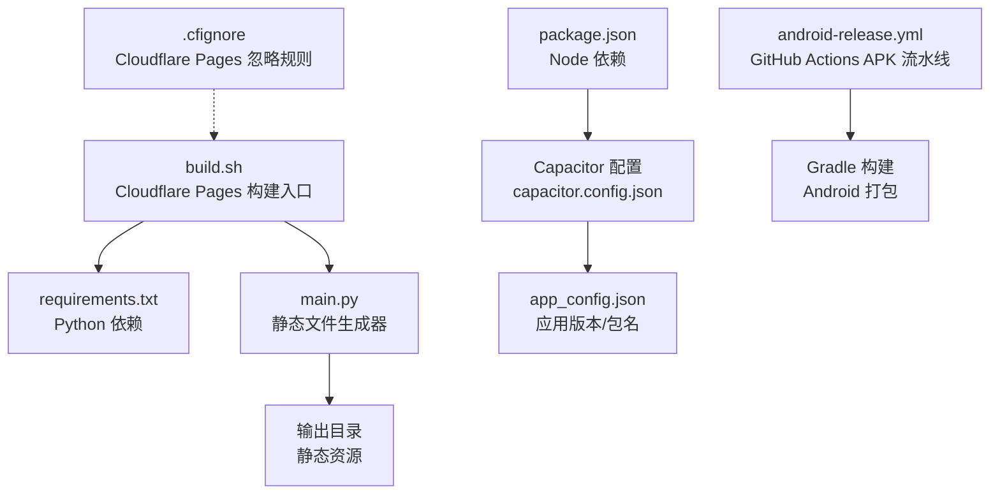
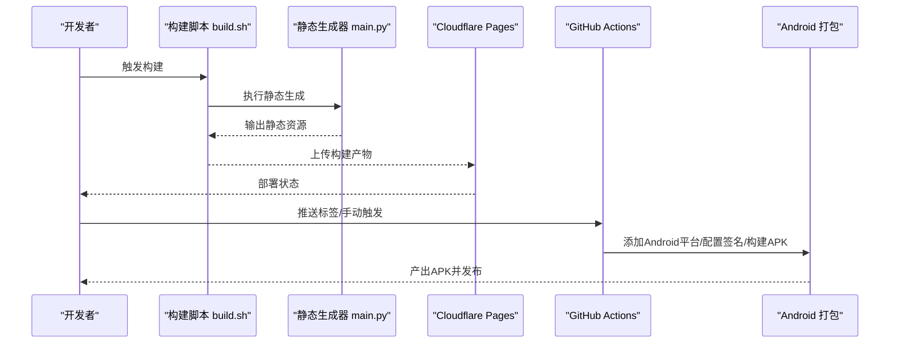
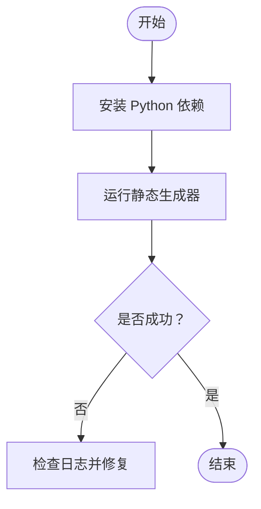
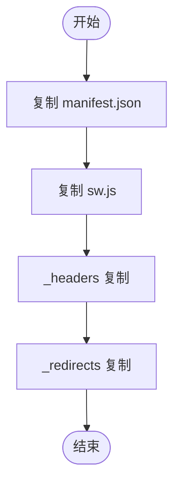
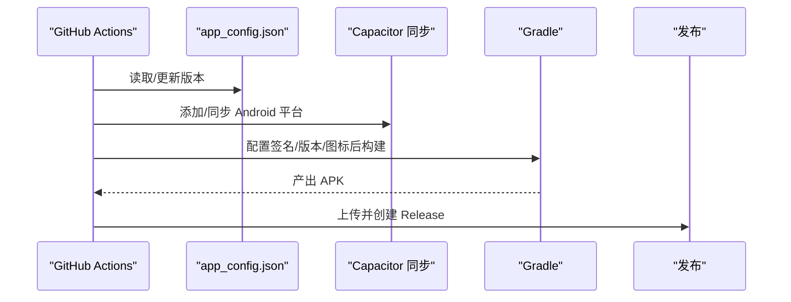
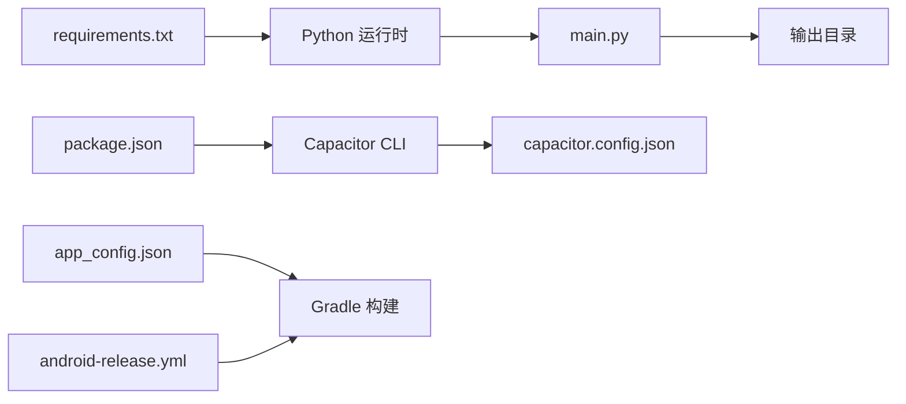

# 部署问题

<cite>
**本文引用的文件**
- [build.sh](file://build.sh)
- [DEPLOYMENT.md](file://DEPLOYMENT.md)
- [QUICK_START.md](file://QUICK_START.md)
- [README.md](file://README.md)
- [main.py](file://main.py)
- [requirements.txt](file://requirements.txt)
- [package.json](file://package.json)
- [capacitor.config.json](file://capacitor.config.json)
- [app_config.json](file://app_config.json)
- [.cfignore](file://.cfignore)
- [android-release.yml](file://.github/workflows/android-release.yml)
- [apk-build-workflow.md](file://.github/skills/capacitor-apk-build/references/apk-build-workflow.md)
- [SKILL.md](file://.github/skills/capacitor-apk-build/SKILL.md)
- [release-automation.md](file://.github/skills/capacitor-apk-build/references/release-automation.md)
- [apk-build-workflow.md](file://.github/skills/static-to-pwa/references/apk-build-workflow.md)
- [SKILL.md](file://.github/skills/static-to-pwa/SKILL.md)
</cite>

## 目录
1. [简介](#简介)
2. [项目结构](#项目结构)
3. [核心组件](#核心组件)
4. [架构总览](#架构总览)
5. [详细组件分析](#详细组件分析)
6. [依赖关系分析](#依赖关系分析)
7. [性能考虑](#性能考虑)
8. [故障排除指南](#故障排除指南)
9. [结论](#结论)
10. [附录](#附录)

## 简介
本指南聚焦于CX项目的部署问题排查，覆盖以下场景：
- Cloudflare Pages部署失败
- 静态文件生成错误
- Android应用打包问题（APK）
- 不同部署平台的权限配置、域名设置、SSL证书、CNAME记录
- 构建脚本错误、环境变量配置、CI/CD流水线问题

通过分层讲解与可视化图示，帮助开发者快速定位并修复问题。

## 项目结构
该项目包含Web端静态站点生成、Android原生打包以及CI/CD自动化流水线。关键路径如下：
- 构建脚本：用于Cloudflare Pages一键构建
- 静态生成：Python脚本生成静态资源并输出到输出目录
- Android打包：基于Capacitor的GitHub Actions流水线
- 配置文件：包管理、应用配置、Capacitor配置、忽略规则等

图表来源
- [build.sh:1-19](file://build.sh#L1-L19)
- [main.py:508-530](file://main.py#L508-L530)
- [package.json](file://package.json)
- [capacitor.config.json](file://capacitor.config.json)
- [app_config.json](file://app_config.json)
- [android-release.yml](file://.github/workflows/android-release.yml)
- [.cfignore](file://.cfignore)

章节来源
- [build.sh:1-19](file://build.sh#L1-L19)
- [DEPLOYMENT.md:24](file://DEPLOYMENT.md#L24)
- [QUICK_START.md:39](file://QUICK_START.md#L39)

## 核心组件
- 构建脚本：负责安装依赖、执行静态生成、输出构建结果
- 静态生成器：生成Cloudflare Pages所需的静态资源与元数据文件
- Capacitor配置：定义WebView目录、应用标识、Android平台参数
- Android打包流水线：自动添加平台、配置签名、构建APK并发布
- 忽略规则：控制Cloudflare Pages上传内容

章节来源
- [build.sh:1-19](file://build.sh#L1-L19)
- [main.py:508-530](file://main.py#L508-L530)
- [capacitor.config.json](file://capacitor.config.json)
- [app_config.json](file://app_config.json)
- [android-release.yml](file://.github/workflows/android-release.yml)
- [.cfignore](file://.cfignore)

## 架构总览
下图展示从源码到部署的关键流程，包括静态站点生成、Cloudflare Pages上传、Android APK构建与发布。

图表来源
- [build.sh:1-19](file://build.sh#L1-L19)
- [main.py:508-530](file://main.py#L508-L530)
- [android-release.yml](file://.github/workflows/android-release.yml)

## 详细组件分析

### 组件A：Cloudflare Pages 构建脚本
- 责任边界：安装Python依赖、运行静态生成器、输出构建完成信号
- 关键行为：严格错误处理、避免需要sudo的系统级操作
- 典型问题：依赖缺失、生成器异常、输出目录不正确

图表来源
- [build.sh:1-19](file://build.sh#L1-L19)

章节来源
- [build.sh:1-19](file://build.sh#L1-L19)
- [DEPLOYMENT.md:24](file://DEPLOYMENT.md#L24)

### 组件B：静态文件生成器
- 责任边界：生成manifest、Service Worker、Headers与Redirects等Cloudflare Pages所需文件
- 关键行为：复制模板文件到输出目录，确保MIME类型与重定向正确
- 典型问题：模板缺失、复制失败、路径编码问题

图表来源
- [main.py:508-530](file://main.py#L508-L530)

章节来源
- [main.py:508-530](file://main.py#L508-L530)

### 组件C：Capacitor 应用配置
- 责任边界：定义应用标识、WebView目录、Android平台参数
- 关键行为：webDir需与静态生成输出一致；允许混合内容以兼容部分资源
- 典型问题：webDir不匹配导致同步失败；缺少必要参数导致调试或网络策略异常

章节来源
- [capacitor.config.json](file://capacitor.config.json)

### 组件D：Android 打包流水线
- 责任边界：自动添加Android平台、配置版本与图标、生成/注入签名、构建APK并发布
- 关键行为：版本号计算、命名空间注入、签名配置、Gradle构建
- 典型问题：签名密钥未配置、版本号格式错误、图标缺失、构建权限不足

图表来源
- [apk-build-workflow.md](file://.github/skills/capacitor-apk-build/references/apk-build-workflow.md)
- [SKILL.md](file://.github/skills/capacitor-apk-build/SKILL.md)
- [release-automation.md](file://.github/skills/capacitor-apk-build/references/release-automation.md)

章节来源
- [apk-build-workflow.md](file://.github/skills/capacitor-apk-build/references/apk-build-workflow.md)
- [SKILL.md](file://.github/skills/capacitor-apk-build/SKILL.md)
- [release-automation.md](file://.github/skills/capacitor-apk-build/references/release-automation.md)

## 依赖关系分析
- 构建脚本依赖Python环境与requirements.txt
- 静态生成器依赖模板与输出目录结构
- Capacitor配置决定Capacitor CLI行为
- Android流水线依赖Node.js、Java、Gradle与GitHub Secrets（如密钥）

图表来源
- [requirements.txt](file://requirements.txt)
- [main.py:508-530](file://main.py#L508-L530)
- [package.json](file://package.json)
- [capacitor.config.json](file://capacitor.config.json)
- [app_config.json](file://app_config.json)
- [android-release.yml](file://.github/workflows/android-release.yml)

章节来源
- [requirements.txt](file://requirements.txt)
- [package.json](file://package.json)
- [capacitor.config.json](file://capacitor.config.json)
- [app_config.json](file://app_config.json)
- [android-release.yml](file://.github/workflows/android-release.yml)

## 性能考虑
- 构建阶段尽量减少不必要的文件上传，利用忽略规则降低传输时间
- 静态生成器仅复制必要文件，避免重复处理
- Android构建使用缓存与并行任务，合理拆分步骤以缩短总耗时

## 故障排除指南

### Cloudflare Pages 部署失败
常见症状
- 构建阶段报错或超时
- 静态资源无法访问或MIME类型错误
- 自定义重定向未生效

排查步骤
1. 检查构建命令与工作目录
   - 确认使用构建脚本作为唯一入口
   - 参考：[DEPLOYMENT.md:24](file://DEPLOYMENT.md#L24)
2. 核对输出目录与上传内容
   - 确保静态生成器已生成必需文件
   - 参考：[main.py:508-530](file://main.py#L508-L530)
3. 检查忽略规则
   - 使用忽略文件过滤无关文件，避免上传过大或敏感文件
   - 参考：[.cfignore](file://.cfignore)
4. 验证Headers与Redirects
   - 确认_headers与_redirects存在且语法正确
   - 参考：[main.py:508-530](file://main.py#L508-L530)

章节来源
- [DEPLOYMENT.md:24](file://DEPLOYMENT.md#L24)
- [main.py:508-530](file://main.py#L508-L530)
- [.cfignore](file://.cfignore)

### 静态文件生成错误
常见症状
- 生成器执行失败
- 输出目录缺少关键文件
- 路径或编码导致资源加载异常

排查步骤
1. 本地复现
   - 在本地运行构建脚本，观察错误堆栈
   - 参考：[build.sh:1-19](file://build.sh#L1-L19)
2. 检查依赖
   - 确认requirements.txt完整且可安装
   - 参考：[requirements.txt](file://requirements.txt)
3. 校验模板与目标路径
   - 确保模板文件存在，复制逻辑正常
   - 参考：[main.py:508-530](file://main.py#L508-L530)

章节来源
- [build.sh:1-19](file://build.sh#L1-L19)
- [requirements.txt](file://requirements.txt)
- [main.py:508-530](file://main.py#L508-L530)

### Android 应用打包问题（APK）
常见症状
- 构建失败或签名错误
- 版本号/包名不匹配
- 图标缺失或尺寸不合规

排查步骤
1. 确认流水线触发条件
   - 使用标签触发或手动触发
   - 参考：[release-automation.md](file://.github/skills/capacitor-apk-build/references/release-automation.md)
2. 校验版本与包名
   - app_config.json中的版本与包名应与Gradle配置一致
   - 参考：[app_config.json](file://app_config.json)
3. 检查签名配置
   - 密钥文件与密码应在安全位置管理
   - 参考：[apk-build-workflow.md](file://.github/skills/capacitor-apk-build/references/apk-build-workflow.md)
4. 验证Capacitor配置
   - webDir与实际输出一致
   - 参考：[capacitor.config.json](file://capacitor.config.json)

章节来源
- [release-automation.md](file://.github/skills/capacitor-apk-build/references/release-automation.md)
- [app_config.json](file://app_config.json)
- [apk-build-workflow.md](file://.github/skills/capacitor-apk-build/references/apk-build-workflow.md)
- [capacitor.config.json](file://capacitor.config.json)

### CI/CD 流水线问题
常见症状
- 步骤权限不足
- 环境变量缺失
- 依赖下载失败

排查步骤
1. 检查权限声明
   - 确认工作流具有写入与部署权限
   - 参考：[apk-build-workflow.md](file://.github/skills/capacitor-apk-build/references/apk-build-workflow.md)
2. 校验环境变量与Secrets
   - 签名相关变量是否正确配置
   - 参考：[SKILL.md](file://.github/skills/capacitor-apk-build/SKILL.md)
3. 依赖与工具链
   - Node.js、Java版本与Gradle要求一致
   - 参考：[apk-build-workflow.md](file://.github/skills/capacitor-apk-build/references/apk-build-workflow.md)

章节来源
- [apk-build-workflow.md](file://.github/skills/capacitor-apk-build/references/apk-build-workflow.md)
- [SKILL.md](file://.github/skills/capacitor-apk-build/SKILL.md)

### 域名设置、SSL证书与CNAME记录
- 域名与自定义域：在Cloudflare Pages设置自定义域并验证TXT解析
- SSL证书：启用自动证书，确认证书颁发与续期状态
- CNAME记录：将自定义域指向Cloudflare Pages提供的CNAME值
- 参考：[DEPLOYMENT.md](file://DEPLOYMENT.md) 中的域名与证书说明

章节来源
- [DEPLOYMENT.md](file://DEPLOYMENT.md)

### 权限配置
- GitHub Actions权限：确保工作流具备contents、deployments、actions写入权限
- 参考：[apk-build-workflow.md](file://.github/skills/capacitor-apk-build/references/apk-build-workflow.md)

章节来源
- [apk-build-workflow.md](file://.github/skills/capacitor-apk-build/references/apk-build-workflow.md)

## 结论
通过明确各组件职责、梳理构建与打包流程、结合忽略规则与配置文件校验，可系统性地定位并解决部署问题。建议在变更后进行本地复现与最小化回归测试，确保CI/CD稳定运行。

## 附录
- 快速开始与部署命令参考
  - 参考：[QUICK_START.md:39](file://QUICK_START.md#L39)
  - 参考：[README.md:268](file://README.md#L268)
- 静态到PWA相关配置（如需）
  - 参考：[SKILL.md](file://.github/skills/static-to-pwa/SKILL.md)