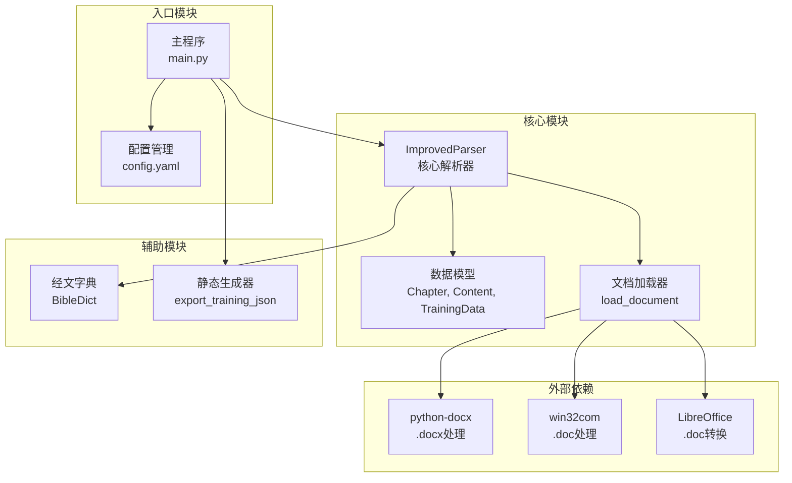
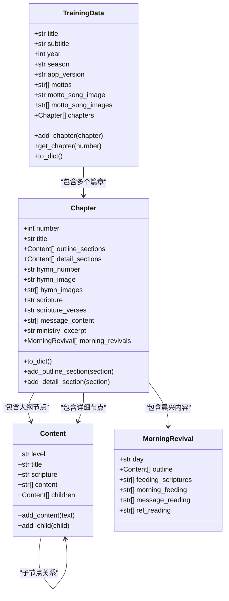
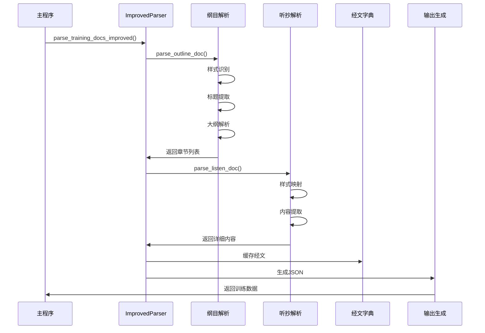
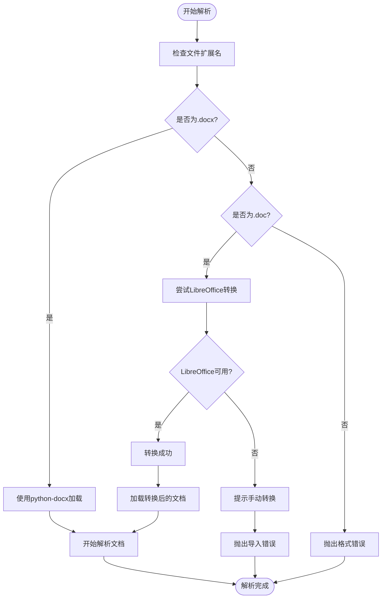
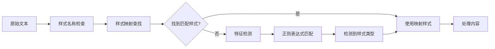
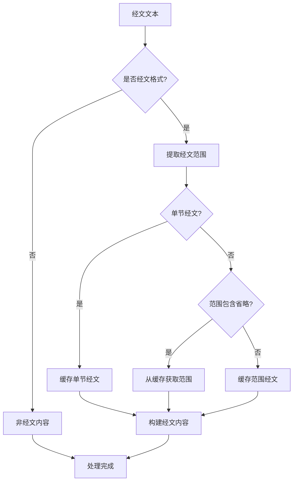
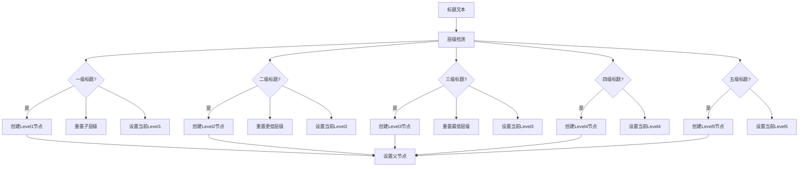
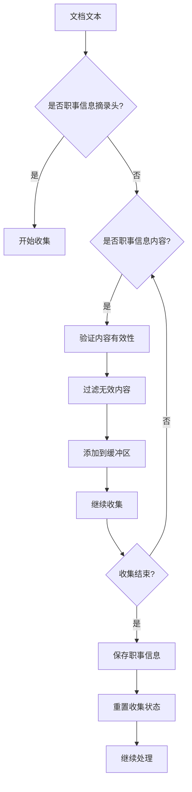
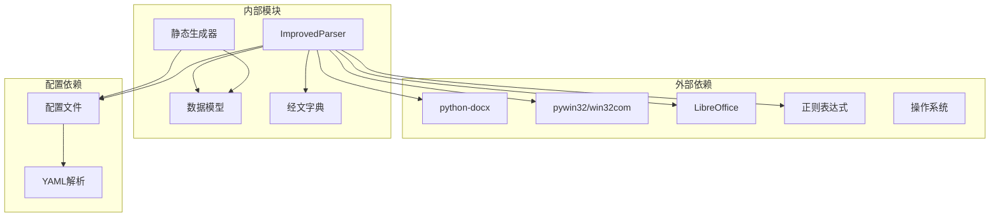
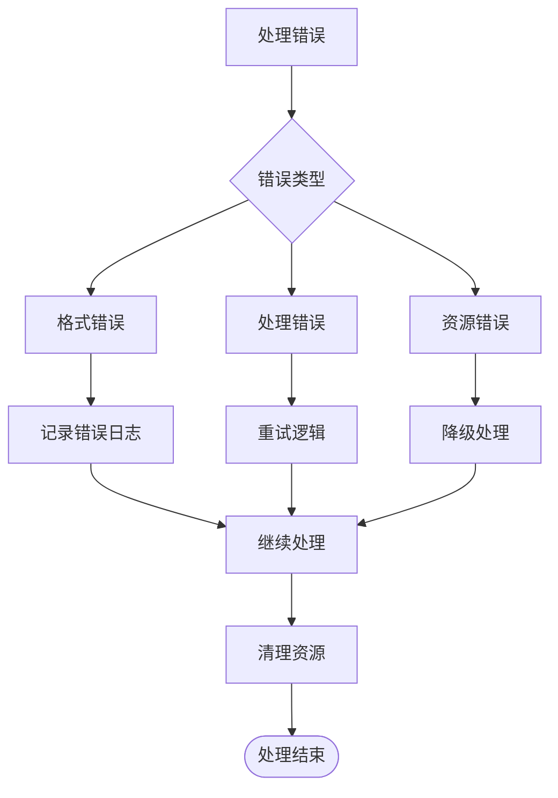

# ImprovedParser文档解析器

<cite>
**本文档引用的文件**
- [parser_improved.py](file://src/parser_improved.py)
- [models.py](file://src/models.py)
- [main.py](file://main.py)
- [generator.py](file://src/generator.py)
- [bible_dict.py](file://src/bible_dict.py)
</cite>

## 目录
1. [简介](#简介)
2. [项目结构](#项目结构)
3. [核心组件](#核心组件)
4. [架构概览](#架构概览)
5. [详细组件分析](#详细组件分析)
6. [依赖关系分析](#依赖关系分析)
7. [性能考虑](#性能考虑)
8. [故障排除指南](#故障排除指南)
9. [结论](#结论)
10. [附录](#附录)

## 简介

ImprovedParser文档解析器是一个专为Word文档训练材料设计的高级解析系统，能够智能处理不同格式的Word文档（.doc和.docx），并准确提取训练内容的结构化信息。该解析器的核心设计理念是"正确区分数据来源"，通过精确的样式映射机制、强大的正则表达式模式匹配和智能的经文识别算法，实现了对复杂训练文档的深度解析。

该解析器主要服务于静态网站生成器，能够将Word文档转换为JSON格式的数据结构，供前端应用进行展示和交互。系统支持多种训练文档格式，包括纲目文档（经文.docx）、详细内容文档（听抄.docx）和晨兴文档（晨兴.doc），并通过智能的样式识别和内容提取算法，确保解析结果的准确性和完整性。

## 项目结构

项目采用模块化设计，核心解析功能集中在`src/parser_improved.py`中，数据模型定义在`src/models.py`中，主程序入口在`main.py`中，静态资源生成在`src/generator.py`中。



**图表来源**
- [parser_improved.py:15-112](file://src/parser_improved.py#L15-L112)
- [models.py:9-232](file://src/models.py#L9-L232)
- [main.py:14-16](file://main.py#L14-L16)

**章节来源**
- [parser_improved.py:1-112](file://src/parser_improved.py#L1-L112)
- [models.py:1-232](file://src/models.py#L1-L232)
- [main.py:1-800](file://main.py#L1-L800)

## 核心组件

### ImprovedParser类

ImprovedParser是整个解析系统的核心类，负责处理各种类型的训练文档。该类实现了完整的文档解析流程，包括文档加载、样式识别、内容提取和数据结构构建。

#### 主要特性

1. **多格式支持**：自动识别和处理.doc和.docx格式的Word文档
2. **智能样式映射**：支持多种训练文档的样式系统
3. **经文识别**：强大的经文格式识别和范围提取能力
4. **层次化结构**：支持多层级的大纲结构解析
5. **缓存机制**：内置经文缓存系统，支持跨文档引用

#### 关键属性

- `STYLE_MAP`：样式名称到内部标识符的映射表
- `_FULL_BOOK_MAP`：圣经书卷全名到缩写的映射
- `_CANONICAL_BOOK_MAP`：正式圣经书卷名称映射
- `_ALIAS_BOOK_MAP`：常用简称到缩写的映射

**章节来源**
- [parser_improved.py:114-283](file://src/parser_improved.py#L114-L283)

### 数据模型系统

系统采用强类型的数据模型设计，通过`@dataclass`装饰器定义了完整的数据结构。

#### 核心数据模型

1. **Content类**：内容节点基类，支持树形结构
2. **Chapter类**：篇章模型，包含大纲和详细内容
3. **TrainingData类**：训练数据总集，管理多个篇章
4. **MorningRevival类**：晨兴内容模型

#### 模型关系



**图表来源**
- [models.py:9-232](file://src/models.py#L9-L232)

**章节来源**
- [models.py:9-232](file://src/models.py#L9-L232)

## 架构概览

ImprovedParser采用分层架构设计，从底层的文档加载到顶层的数据输出，形成了清晰的处理流水线。



**图表来源**
- [parser_improved.py:2548-2663](file://src/parser_improved.py#L2548-L2663)
- [main.py:266-277](file://main.py#L266-L277)

### 文档加载流程

系统提供了灵活的文档加载机制，能够自动处理不同格式的Word文档：



**图表来源**
- [parser_improved.py:15-112](file://src/parser_improved.py#L15-L112)

**章节来源**
- [parser_improved.py:15-112](file://src/parser_improved.py#L15-L112)

## 详细组件分析

### 样式映射机制

ImprovedParser实现了复杂的样式映射系统，能够识别不同训练文档的样式特征：

#### 样式分类

| 样式类型 | 描述 | 示例 |
|---------|------|------|
| `chapter_title` | 篇章标题 | "第X篇" |
| `section_level1` | 一级大纲标题 | "壹、" |
| `section_level2` | 二级大纲标题 | "一、" |
| `section_level3` | 三级大纲标题 | "1、" |
| `section_level4` | 四级大纲标题 | "a、" |
| `content` | 正文内容 | 普通段落文本 |

#### 样式识别流程



**图表来源**
- [parser_improved.py:117-134](file://src/parser_improved.py#L117-L134)
- [parser_improved.py:764-783](file://src/parser_improved.py#L764-L783)

**章节来源**
- [parser_improved.py:117-134](file://src/parser_improved.py#L117-L134)
- [parser_improved.py:764-783](file://src/parser_improved.py#L764-L783)

### 经文识别算法

系统实现了强大的经文识别和处理算法，能够准确识别和解析各种格式的圣经经文引用。

#### 经文格式支持

| 格式类型 | 示例 | 描述 |
|---------|------|------|
| 书卷+中文数字+节 | "太五3" | 简洁格式 |
| 书卷+阿拉伯数字+节 | "腓2:5" | 标准格式 |
| 经文范围 | "腓2:5~11" | 范围格式 |
| 省略书卷 | "二1" | 同章内引用 |

#### 经文解析流程



**图表来源**
- [parser_improved.py:299-365](file://src/parser_improved.py#L299-L365)

**章节来源**
- [parser_improved.py:299-365](file://src/parser_improved.py#L299-L365)

### 标题层级提取

系统能够智能识别和提取多层级的标题结构，支持从一级到五级的完整层级体系。

#### 层级识别规则

| 层级 | 标识符 | 规则 |
|------|--------|------|
| Level 1 | "壹、" | 中文数字+顿号 |
| Level 2 | "一、" | 中文数字+顿号 |
| Level 3 | "1、" | 阿拉伯数字+顿号 |
| Level 4 | "a、" | 英文小写字母+顿号 |
| Level 5 | "①" | 圆圈数字 |

#### 标题处理流程



**图表来源**
- [parser_improved.py:646-689](file://src/parser_improved.py#L646-L689)

**章节来源**
- [parser_improved.py:646-689](file://src/parser_improved.py#L646-L689)

### 职事信息摘录

系统专门设计了职事信息摘录功能，能够从经文文档中提取重要的信息摘录内容。

#### 摘录识别机制



**图表来源**
- [parser_improved.py:625-644](file://src/parser_improved.py#L625-L644)

**章节来源**
- [parser_improved.py:625-644](file://src/parser_improved.py#L625-L644)

## 依赖关系分析

系统采用松耦合的设计，各个模块之间的依赖关系清晰明确。



**图表来源**
- [parser_improved.py:5-12](file://src/parser_improved.py#L5-L12)
- [main.py:54-58](file://main.py#L54-L58)

### 模块间交互

系统通过清晰的接口定义实现模块间的通信：

1. **主程序与解析器**：通过`parse_training_docs_improved`函数进行交互
2. **解析器与数据模型**：直接操作数据模型对象
3. **解析器与经文字典**：通过缓存机制共享经文数据
4. **生成器与数据模型**：通过`to_dict()`方法转换数据

**章节来源**
- [parser_improved.py:2548-2663](file://src/parser_improved.py#L2548-L2663)
- [main.py:266-277](file://main.py#L266-L277)

## 性能考虑

### 内存优化策略

1. **延迟加载**：文档内容按需解析，避免一次性加载大量数据
2. **缓存机制**：经文内容缓存在内存中，减少重复处理
3. **流式处理**：大型文档采用流式处理方式，降低内存占用

### 处理效率优化

1. **预编译正则表达式**：所有正则表达式在类初始化时预编译
2. **样式映射缓存**：样式名称映射结果缓存到字典中
3. **批量处理**：支持批量处理多个训练批次

### 错误处理策略



**图表来源**
- [parser_improved.py:104-111](file://src/parser_improved.py#L104-L111)

**章节来源**
- [parser_improved.py:104-111](file://src/parser_improved.py#L104-L111)

## 故障排除指南

### 常见问题及解决方案

#### .doc文件转换问题

**问题描述**：系统无法自动转换.doc格式文件

**解决方案**：
1. 安装LibreOffice并确保命令可用
2. 手动将.doc文件转换为.docx格式
3. 检查文件权限和磁盘空间

#### 样式识别失败

**问题描述**：系统无法正确识别文档样式

**解决方案**：
1. 检查Word文档的样式设置
2. 确认样式名称与映射表匹配
3. 手动指定样式参数

#### 经文识别错误

**问题描述**：经文引用格式不被正确识别

**解决方案**：
1. 检查经文格式是否符合支持规范
2. 确认书卷名称的正确性
3. 验证节号格式的准确性

**章节来源**
- [parser_improved.py:82-102](file://src/parser_improved.py#L82-L102)

### 调试技巧

1. **启用详细日志**：查看解析过程中的详细信息
2. **单元测试**：针对特定功能编写测试用例
3. **数据验证**：检查中间结果的正确性
4. **性能监控**：监控内存使用和处理时间

## 结论

ImprovedParser文档解析器是一个功能强大、设计精良的文档处理系统。通过其智能的样式识别、强大的经文处理能力和优雅的架构设计，成功解决了Word文档训练材料的结构化处理难题。

该系统的创新之处在于：
- **多格式支持**：无缝处理.doc和.docx格式
- **智能识别**：基于样式和内容特征的双重识别机制
- **层次化处理**：完整的多层级结构解析
- **扩展性强**：模块化设计便于功能扩展

未来可以考虑的功能增强包括：
- 更丰富的经文格式支持
- 批量处理性能优化
- 更完善的错误恢复机制
- 增强的用户自定义能力

## 附录

### 使用示例

#### 基本使用流程

```python
# 创建解析器实例
parser = ImprovedParser()

# 解析训练文档
chapters = parser.parse_outline_doc("经文.docx")
```

#### 高级配置选项

```python
# 带有经文字典的解析
bible_dict = BibleDict()
parser = ImprovedParser(bible_dict=bible_dict)
```

### 配置参数说明

| 参数 | 类型 | 默认值 | 描述 |
|------|------|--------|------|
| output_dir | str | "output" | 输出目录路径 |
| bible_dict | BibleDict | None | 经文字典实例 |
| first_week_number | int | None | 第一周的周数 |

### 支持的文档格式

- **输入格式**：.doc, .docx
- **输出格式**：JSON, HTML
- **配置格式**：YAML, JSON