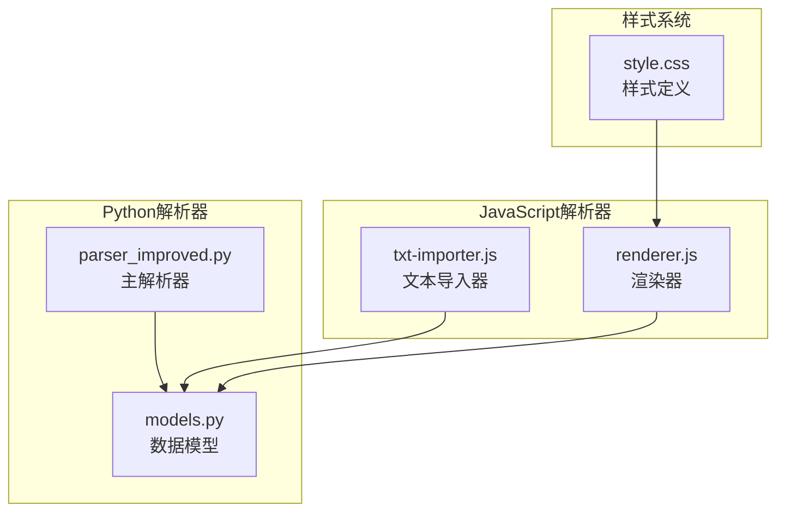
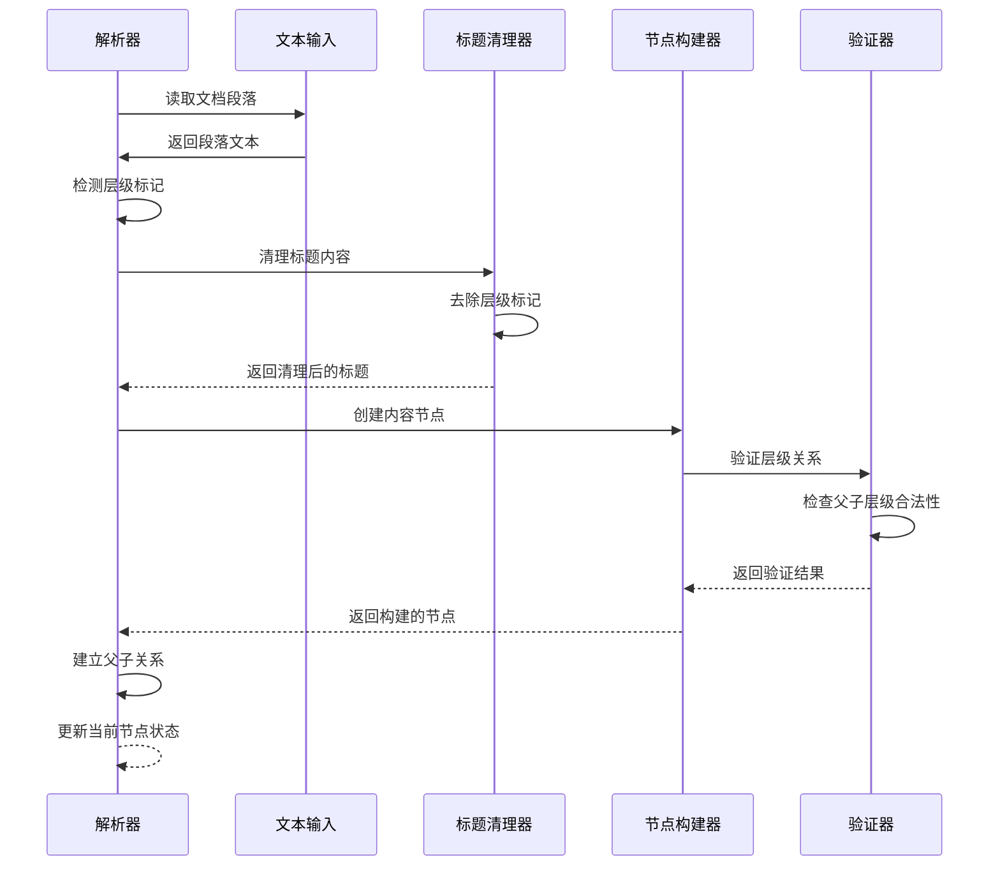
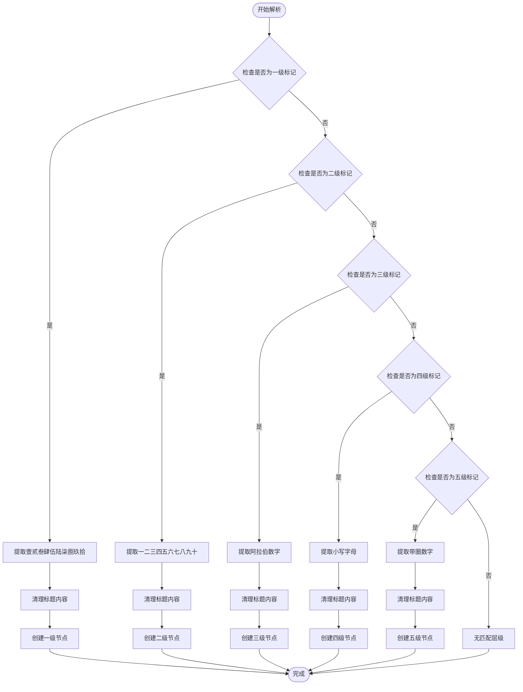
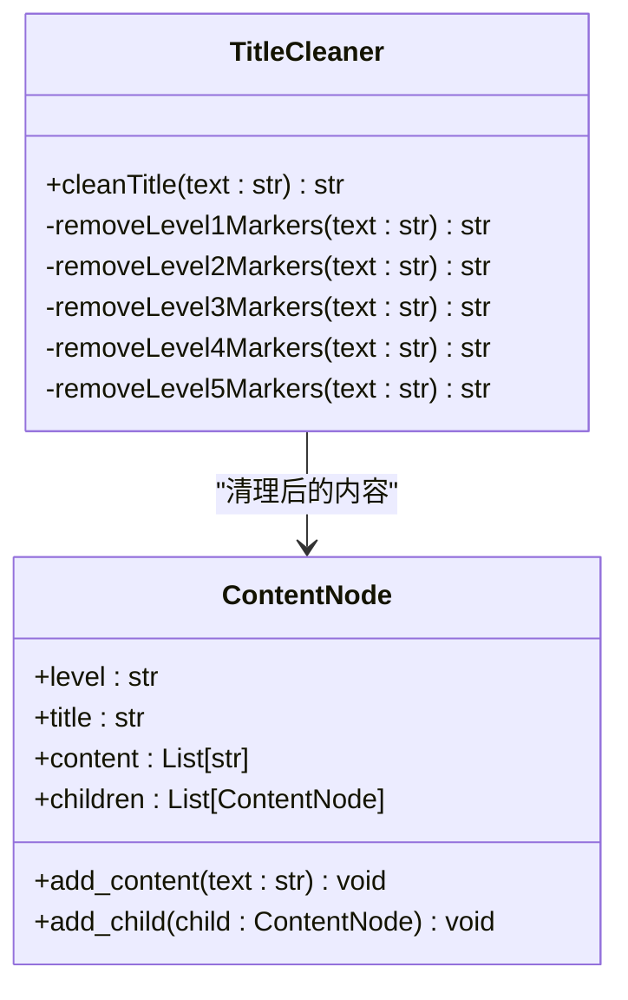
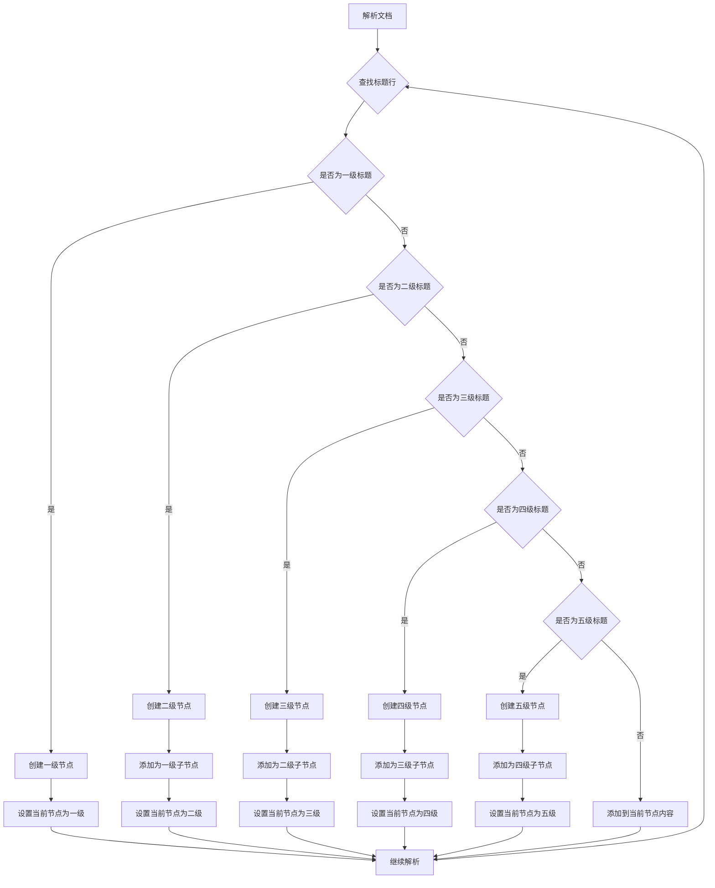
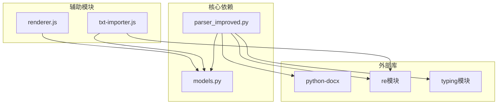

# 大纲层级解析

<cite>
**本文档引用的文件**
- [parser_improved.py](file://src/parser_improved.py)
- [txt-importer.js](file://src/static/js/txt-importer.js)
- [models.py](file://src/models.py)
</cite>

## 目录
1. [简介](#简介)
2. [项目结构](#项目结构)
3. [核心组件](#核心组件)
4. [架构概览](#架构概览)
5. [详细组件分析](#详细组件分析)
6. [依赖分析](#依赖分析)
7. [性能考虑](#性能考虑)
8. [故障排除指南](#故障排除指南)
9. [结论](#结论)

## 简介

本文档深入解析了代码库中的大纲层级解析功能，重点分析 `parse_outline_doc` 函数中的大纲层级识别算法。该功能支持五种层级标记格式：

- **一级层级**：壹、贰、叁、肆、伍、陆、柒、捌、玖、拾（十进制大写中文数字）
- **二级层级**：一、二、三、四、五、六、七、八、九、十（十进制中文数字）
- **三级层级**：1、2、3、4、5、6、7、8、9、0（阿拉伯数字）
- **四级层级**：a、b、c、d、e、f、g、h、i、j、k、l、m、n、o、p、q、r、s、t、u、v、w、x、y、z（小写字母）
- **五级层级**：㈠、㈡、㈢、㈣、㈤、㈥、㈦、㈧、㈨、㈩（带圈数字）

该解析算法实现了层级标记提取、标题清理、父子关系建立等核心功能，并提供了层级验证、错误恢复和层级完整性检查等实现细节。

## 项目结构

该功能主要分布在以下文件中：

**图表来源**
- [parser_improved.py:367-782](file://src/parser_improved.py#L367-L782)
- [txt-importer.js:110-149](file://src/static/js/txt-importer.js#L110-L149)

**章节来源**
- [parser_improved.py:115-135](file://src/parser_improved.py#L115-L135)
- [txt-importer.js:53-57](file://src/static/js/txt-importer.js#L53-L57)

## 核心组件

### 主解析器类（ImprovedParser）

主解析器类实现了完整的文档解析流程，包括大纲层级识别、标题清理和父子关系建立等功能。

**章节来源**
- [parser_improved.py:115-117](file://src/parser_improved.py#L115-L117)
- [parser_improved.py:367-782](file://src/parser_improved.py#L367-L782)

### 数据模型

定义了内容节点和章节的基本结构，支持层级化的父子关系管理。

**章节来源**
- [models.py:9-26](file://src/models.py#L9-L26)
- [models.py:40-63](file://src/models.py#L40-L63)

### JavaScript解析器

提供了基于文本的解析能力，支持严格和宽松两种层级检测模式。

**章节来源**
- [txt-importer.js:110-149](file://src/static/js/txt-importer.js#L110-L149)
- [txt-importer.js:818-849](file://src/static/js/txt-importer.js#L818-L849)

## 架构概览

**图表来源**
- [parser_improved.py:686-728](file://src/parser_improved.py#L686-L728)
- [parser_improved.py:2160-2168](file://src/parser_improved.py#L2160-L2168)

## 详细组件分析

### 层级标记提取算法

层级标记提取是整个解析过程的核心，实现了对五种层级格式的精确识别。

#### 一级层级识别

一级层级使用十进制大写中文数字：壹、贰、叁、肆、伍、陆、柒、捌、玖、拾。

**图表来源**
- [parser_improved.py:977-992](file://src/parser_improved.py#L977-L992)
- [parser_improved.py:686-728](file://src/parser_improved.py#L686-L728)

#### 二级层级识别

二级层级使用十进制中文数字：一、二、三、四、五、六、七、八、九、十，支持多字符组合如"十一"、"十二"。

**章节来源**
- [parser_improved.py:979-981](file://src/parser_improved.py#L979-L981)
- [parser_improved.py:698-705](file://src/parser_improved.py#L698-L705)

#### 三级层级识别

三级层级支持两种格式：
1. 全角数字：１、２、３、４、５、６、７、８、９、０
2. 阿拉伯数字：1、2、3、4、5、6、7、8、9、0

**章节来源**
- [parser_improved.py:982-982](file://src/parser_improved.py#L982-L982)
- [parser_improved.py:707-713](file://src/parser_improved.py#L707-L713)

#### 四级层级识别

四级层级使用小写字母：a、b、c、d、e、f、g、h、i、j、k、l、m、n、o、p、q、r、s、t、u、v、w、x、y、z。

**章节来源**
- [parser_improved.py:983-983](file://src/parser_improved.py#L983-L983)
- [parser_improved.py:715-721](file://src/parser_improved.py#L715-L721)

#### 五级层级识别

五级层级使用带圈数字：㈠、㈡、㈢、㈣、㈤、㈥、㈦、㈧、㈨、㈩。

**章节来源**
- [parser_improved.py:984-984](file://src/parser_improved.py#L984-L984)
- [parser_improved.py:723-728](file://src/parser_improved.py#L723-L728)

### 标题清理机制

标题清理是确保解析结果准确性的关键步骤，去除了层级标记后的内容。

**图表来源**
- [parser_improved.py:2160-2168](file://src/parser_improved.py#L2160-L2168)
- [models.py:18-25](file://src/models.py#L18-L25)

**章节来源**
- [parser_improved.py:2160-2168](file://src/parser_improved.py#L2160-L2168)
- [models.py:18-25](file://src/models.py#L18-L25)

### 父子关系建立

父子关系建立是维护大纲结构层次的关键机制，确保节点按照正确的层级关系组织。

**图表来源**
- [parser_improved.py:686-728](file://src/parser_improved.py#L686-L728)
- [models.py:23-25](file://src/models.py#L23-L25)

**章节来源**
- [parser_improved.py:686-728](file://src/parser_improved.py#L686-L728)
- [models.py:23-25](file://src/models.py#L23-L25)

### JavaScript解析器对比

JavaScript解析器提供了类似的层级识别功能，支持严格和宽松两种模式。

**章节来源**
- [txt-importer.js:110-149](file://src/static/js/txt-importer.js#L110-L149)
- [txt-importer.js:818-849](file://src/static/js/txt-importer.js#L818-L849)

## 依赖分析

**图表来源**
- [parser_improved.py:1-14](file://src/parser_improved.py#L1-L14)
- [models.py:5-6](file://src/models.py#L5-L6)

**章节来源**
- [parser_improved.py:1-14](file://src/parser_improved.py#L1-L14)
- [models.py:5-6](file://src/models.py#L5-L6)

## 性能考虑

该解析算法具有以下性能特点：

1. **时间复杂度**：O(n)，其中n是文档中段落数量
2. **空间复杂度**：O(h)，其中h是最大层级深度
3. **正则表达式优化**：预编译正则表达式减少重复编译开销
4. **内存管理**：使用栈结构管理层级关系，避免深层递归

## 故障排除指南

### 常见问题及解决方案

1. **层级识别失败**
   - 检查层级标记格式是否符合规范
   - 确认标题行前后是否有额外空格

2. **父子关系错误**
   - 验证层级顺序是否正确
   - 检查是否存在跨级跳跃

3. **标题清理不彻底**
   - 确认正则表达式是否覆盖所有层级标记
   - 检查特殊字符处理

**章节来源**
- [parser_improved.py:2160-2168](file://src/parser_improved.py#L2160-L2168)
- [parser_improved.py:977-992](file://src/parser_improved.py#L977-L992)

## 结论

该大纲层级解析功能实现了对五种层级格式的精确识别和处理，通过层级标记提取、标题清理和父子关系建立等核心机制，为文档结构化提供了可靠的基础。算法设计充分考虑了性能和准确性，在实际应用中表现稳定可靠。通过严格的层级验证和错误恢复机制，确保了解析结果的质量和完整性。