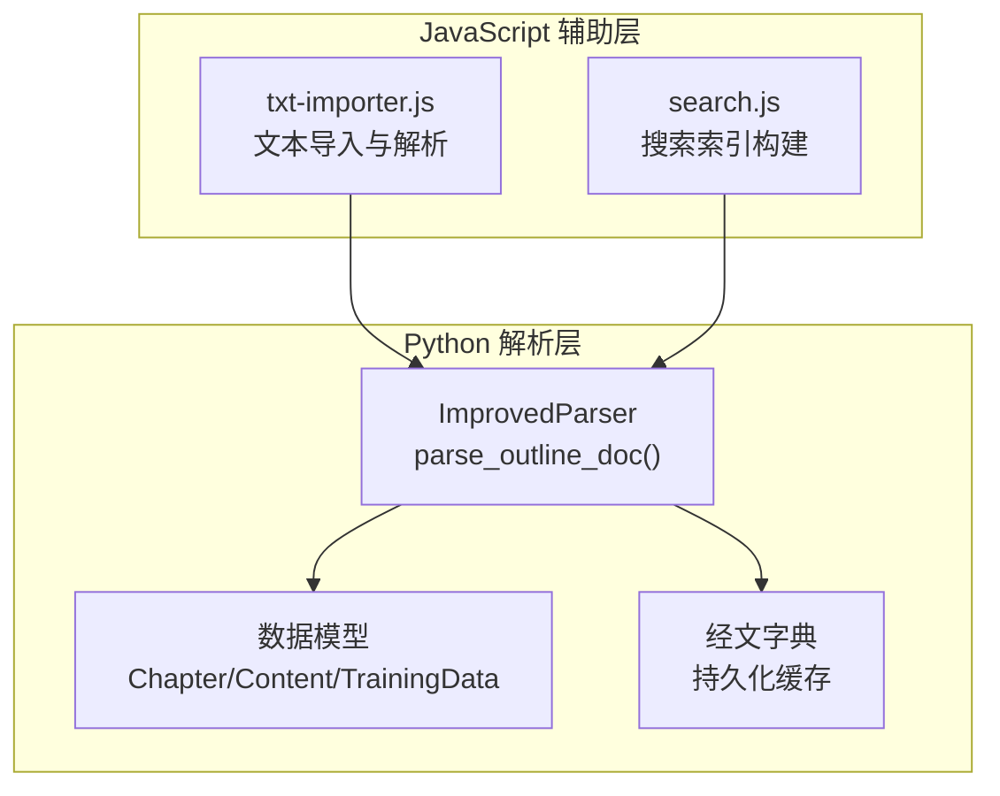
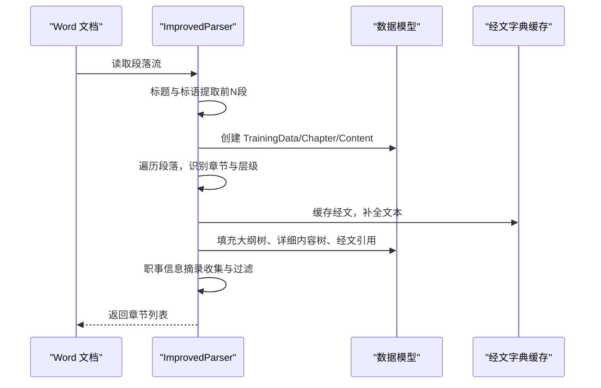
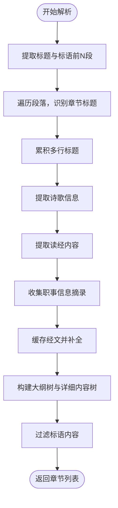
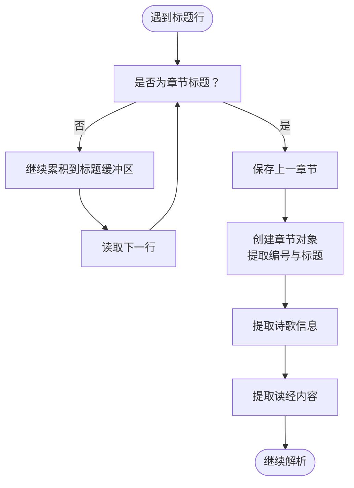
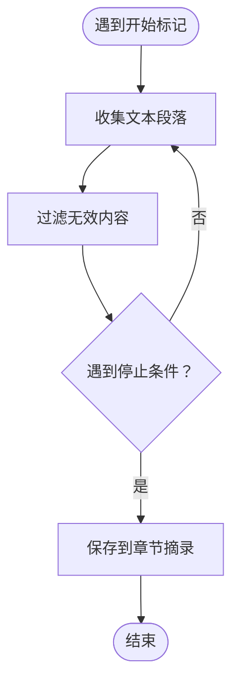
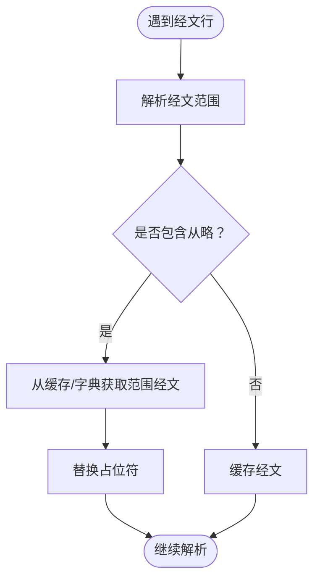
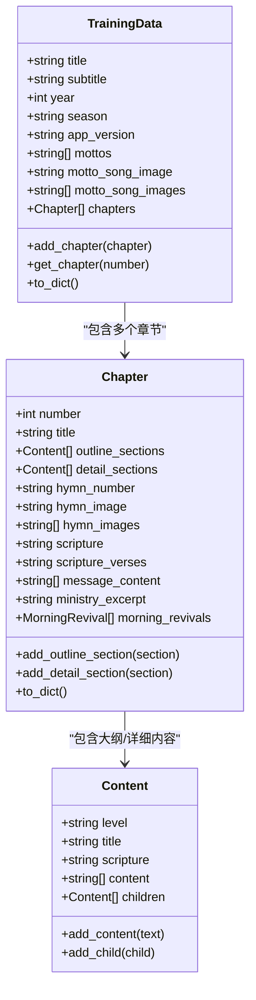
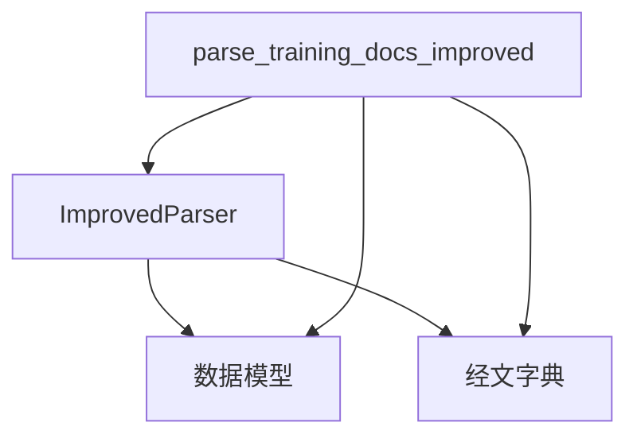

# 大纲解析与结构提取

<cite>
**本文引用的文件**
- [parser_improved.py](file://src/parser_improved.py)
- [models.py](file://src/models.py)
- [txt-importer.js](file://src/static/js/txt-importer.js)
- [search.js](file://src/static/js/search.js)
</cite>

## 目录
1. [简介](#简介)
2. [项目结构](#项目结构)
3. [核心组件](#核心组件)
4. [架构概览](#架构概览)
5. [详细组件分析](#详细组件分析)
6. [依赖分析](#依赖分析)
7. [性能考虑](#性能考虑)
8. [故障排除指南](#故障排除指南)
9. [结论](#结论)

## 简介
本文档深入解析“大纲解析与结构提取”功能，重点围绕 parse_outline_doc 函数的实现原理，涵盖训练标题识别、标语提取、章节结构解析、职事信息摘录等核心模块。文档详细阐述标题提取算法（副标题识别、主标题推断、文件路径解析）、复杂文档结构处理策略（多行标题累积、诗歌信息提取、读经内容处理），以及错误处理、边界情况处理和数据验证等关键实现细节。

## 项目结构
该项目采用模块化设计，核心解析逻辑集中在 Python 模块中，前端 JavaScript 辅助处理文本导入与搜索。关键文件与职责如下：
- src/parser_improved.py：核心解析器与 parse_outline_doc 实现，负责 Word 文档解析、标题识别、标语提取、章节结构解析、职事信息摘录、经文缓存与补全。
- src/models.py：数据模型定义，包括 Content、Chapter、TrainingData 等，支撑解析结果的结构化存储与序列化。
- src/static/js/txt-importer.js：文本导入器，支持从历史合辑文本中解析训练边界、提取大纲与职事信息摘录，与 Python 解析器形成互补。
- src/static/js/search.js：搜索辅助，用于从职事摘录中提取短标题行并构建搜索索引。



图表来源
- [parser_improved.py:367-782](file://src/parser_improved.py#L367-L782)
- [models.py:9-232](file://src/models.py#L9-L232)
- [txt-importer.js:1277-1363](file://src/static/js/txt-importer.js#L1277-L1363)
- [search.js:153-183](file://src/static/js/search.js#L153-L183)

章节来源
- [parser_improved.py:115-283](file://src/parser_improved.py#L115-L283)
- [models.py:9-232](file://src/models.py#L9-L232)

## 核心组件
- ImprovedParser：封装所有解析逻辑，包括标题识别、标语提取、章节结构解析、职事信息摘录、经文缓存与补全、跨文档数据同步等。
- 数据模型：Chapter、Content、TrainingData 提供稳定的结构化输出，支持大纲树、详细内容树、经文引用与摘录等字段。
- 经文字典：BibleDict 提供跨文档/训练的经文缓存，提升解析效率与一致性。
- 文本导入器：txt-importer.js 支持从历史合辑文本中解析训练边界与大纲，补充 Python 解析器的文本场景。

章节来源
- [parser_improved.py:115-283](file://src/parser_improved.py#L115-L283)
- [models.py:9-232](file://src/models.py#L9-L232)
- [txt-importer.js:1277-1363](file://src/static/js/txt-importer.js#L1277-L1363)

## 架构概览
parse_outline_doc 的执行流程分为三个阶段：
1) 标题与标语提取：在文档前若干段中识别训练主标题与副标题，同时提取标语内容。
2) 章节结构解析：遍历文档段落，识别“第X篇”章节标题，累积多行标题，提取诗歌信息与读经内容。
3) 职事信息摘录：识别“职事信息摘录：”标记，收集后续有效文本段落，过滤无效内容。



图表来源
- [parser_improved.py:367-782](file://src/parser_improved.py#L367-L782)
- [models.py:40-100](file://src/models.py#L40-L100)

## 详细组件分析

### parse_outline_doc 函数详解
parse_outline_doc 是大纲解析的核心入口，负责：
- 标题识别：从文档开头提取训练主标题与副标题，支持内联与分行两种“总题：”格式，以及首行主题内容识别与文件路径推断。
- 标语提取：识别“标语”区域，过滤纯数字、括号内容、日期信息，避免与副标题/标题重复。
- 章节结构解析：识别“第X篇”章节标题，累积多行标题，提取诗歌信息与读经内容，处理跨行续接。
- 职事信息摘录：识别“职事信息摘录：”标记，收集有效文本段落，过滤无效内容。
- 经文缓存与补全：缓存经文到内存与持久化字典，支持“从略”占位符替换与跨章节范围补全。



图表来源
- [parser_improved.py:367-782](file://src/parser_improved.py#L367-L782)

章节来源
- [parser_improved.py:367-782](file://src/parser_improved.py#L367-L782)

### 标题提取算法
标题提取包含主标题与副标题两个维度：
- 副标题识别：
  - 内联格式：“标题文本 总题：副标题内容”，支持“总题：”同行或分行续接，最多收集若干行直至停止条件。
  - 分行格式：“总题：”独占一行，随后收集若干行直至空行或停止条件。
  - 首行主题识别：若首行长度适中且包含常见训练主题词，则直接作为副标题。
- 主标题推断：
  - 组合候选：在标题片段中寻找包含“训练”或“特会”的组合，优先选择此类组合。
  - 时间组合：若无“训练/特会”组合，尝试包含年份的组合。
  - 路径推断：若仍无法识别，基于文件路径中的训练类型（如“夏季”、“秋季”等）推断标题。
  - 默认值：若以上均失败，使用通用标题“训练”。

```mermaid
flowchart TD
Start(["开始提取副标题"]) --> InlineFormat["内联格式检测<br/>\"总题：\"同行/分行"]
InlineFormat --> FirstLineTheme["首行主题识别<br/>包含训练主题词"]
FirstLineTheme --> CandidateTitle["候选标题片段收集"]
CandidateTitle --> CombineTitle["组合候选<br/>训练/特会/时间"]
CombineTitle --> PathInference["路径推断<br/>训练类型关键词"]
PathInference --> DefaultTitle["默认标题"]
DefaultTitle --> End(["副标题提取完成"])
```

图表来源
- [parser_improved.py:438-487](file://src/parser_improved.py#L438-L487)
- [parser_improved.py:495-535](file://src/parser_improved.py#L495-L535)

章节来源
- [parser_improved.py:438-487](file://src/parser_improved.py#L438-L487)
- [parser_improved.py:495-535](file://src/parser_improved.py#L495-L535)

### 章节结构解析与多行标题累积
章节解析遵循以下策略：
- 章节识别：匹配“第X篇”模式，支持中文与阿拉伯数字，确保“第X篇”出现在标题中才视为章节。
- 多行标题累积：若当前行不是诗歌编号、读经等特定内容，则继续累积到标题缓冲区，直到遇到其他内容为止。
- 诗歌信息提取：从标题中提取“XX 诗歌：NNN”格式，支持多前缀（如 EM、JL、MC 等），并去除诗歌信息后得到干净标题。
- 读经内容处理：仅取每篇第一个“读经：”内容，避免后续读经引用覆盖章首读经；支持跨行续接（以逗号结尾）。



图表来源
- [parser_improved.py:582-655](file://src/parser_improved.py#L582-L655)

章节来源
- [parser_improved.py:582-655](file://src/parser_improved.py#L582-L655)

### 职事信息摘录提取
职事信息摘录的提取过程：
- 开始标记：识别“职事信息摘录：”或“职事信息摘录”等变体。
- 收集阶段：持续收集后续文本段落，过滤无效内容（空行、纯下划线、过短无中文等）。
- 结束条件：遇到“TOP”或导航行时停止收集。
- 过滤与保存：对收集到的内容进行有效性过滤后保存到当前章节的 ministry_excerpt 字段。



图表来源
- [parser_improved.py:665-684](file://src/parser_improved.py#L665-L684)
- [txt-importer.js:603-627](file://src/static/js/txt-importer.js#L603-L627)

章节来源
- [parser_improved.py:665-684](file://src/parser_improved.py#L665-L684)
- [txt-importer.js:603-627](file://src/static/js/txt-importer.js#L603-L627)

### 经文缓存与补全
经文处理包含以下要点：
- 经文识别：支持“书卷+中文数字+阿拉伯数字”与“书卷+阿拉伯数字”两种格式。
- “从略”占位符：当经文行包含“从略”时，解析范围并从缓存或持久化字典中获取相应经文范围内容进行替换。
- 缓存机制：将经文行缓存到内存字典，并同步写入持久化字典，避免重复覆盖。
- 跨文档补全：解析完成后，对空经文节进行补全，并补充章节读经经文。



图表来源
- [parser_improved.py:309-366](file://src/parser_improved.py#L309-L366)
- [parser_improved.py:546-568](file://src/parser_improved.py#L546-L568)
- [parser_improved.py:771-776](file://src/parser_improved.py#L771-L776)

章节来源
- [parser_improved.py:309-366](file://src/parser_improved.py#L309-L366)
- [parser_improved.py:546-568](file://src/parser_improved.py#L546-L568)
- [parser_improved.py:771-776](file://src/parser_improved.py#L771-L776)

### 数据模型与序列化
数据模型以结构化方式组织解析结果：
- Chapter：包含章节编号、标题、大纲树、详细内容树、诗歌编号/图片、经文引用/正文、职事信息摘录、晨兴内容等。
- Content：内容节点，支持层级标识、标题、经文引用、正文段落与子节点。
- TrainingData：训练总集，包含标题、副标题、年份、季节、标语与章节列表。



图表来源
- [models.py:9-232](file://src/models.py#L9-L232)

章节来源
- [models.py:9-232](file://src/models.py#L9-L232)

### 文本导入与搜索辅助
- txt-importer.js：支持从历史合辑文本中解析训练边界、提取大纲与职事信息摘录，与 Python 解析器形成互补，尤其适用于文本格式的历史资料。
- search.js：从职事摘录中提取短标题行并构建搜索索引，支持快速检索与展示。

章节来源
- [txt-importer.js:1277-1363](file://src/static/js/txt-importer.js#L1277-L1363)
- [txt-importer.js:603-627](file://src/static/js/txt-importer.js#L603-L627)
- [search.js:153-183](file://src/static/js/search.js#L153-L183)

## 依赖分析
- 模块耦合：
  - ImprovedParser 依赖数据模型（Chapter/Content/TrainingData）与经文字典（BibleDict），用于结构化输出与经文缓存。
  - parse_training_docs_improved 作为高层接口，协调 parse_outline_doc、parse_listen_doc、parse_morning_revival_doc 的执行顺序与数据同步。
- 外部依赖：
  - python-docx：用于加载 .docx/.doc 文档。
  - LibreOffice：用于 .doc 自动转换（跨平台）。
  - JSON：用于读取应用版本号。



图表来源
- [parser_improved.py:2592-2710](file://src/parser_improved.py#L2592-L2710)
- [models.py:196-232](file://src/models.py#L196-L232)

章节来源
- [parser_improved.py:2592-2710](file://src/parser_improved.py#L2592-L2710)
- [models.py:196-232](file://src/models.py#L196-L232)

## 性能考虑
- 正则表达式预编译：标题与层级识别使用预编译正则，减少重复编译开销。
- 缓存机制：经文缓存与持久化字典结合，避免重复解析与网络请求。
- 早期停止：在遇到“目录”、“第X篇”等停止条件时及时退出，减少不必要的遍历。
- 跨文档同步：在解析完成后进行一次性补全与同步，降低实时计算成本。

## 故障排除指南
- .doc 文件转换失败：
  - 现象：无法自动转换 .doc 文件，提示安装 LibreOffice 或手动转换。
  - 处理：安装 LibreOffice 或手动将 .doc 转换为 .docx 后重试。
- 文档格式不支持：
  - 现象：抛出不支持的文件格式异常。
  - 处理：确保输入为 .docx 或 .doc 格式。
- 经文范围解析异常：
  - 现象：“从略”占位符无法替换或范围解析失败。
  - 处理：检查经文格式是否符合预期，确认缓存与持久化字典中是否存在对应范围。
- 标语内容重复或缺失：
  - 现象：标语列表包含重复内容或末尾出现段落分隔符。
  - 处理：解析后自动清理末尾分隔符；避免与副标题/标题重复的内容被收录。

章节来源
- [parser_improved.py:16-112](file://src/parser_improved.py#L16-L112)
- [parser_improved.py:2665-2667](file://src/parser_improved.py#L2665-L2667)

## 结论
parse_outline_doc 函数通过严谨的标题识别、标语提取、章节结构解析与职事信息摘录流程，实现了对训练文档的高质量结构化提取。配合经文缓存与补全、跨文档数据同步以及文本导入与搜索辅助，形成了完整的解析与呈现体系。该实现兼顾准确性与性能，能够稳定处理复杂的多行标题、诗歌信息与读经内容，并提供完善的错误处理与边界情况处理策略。