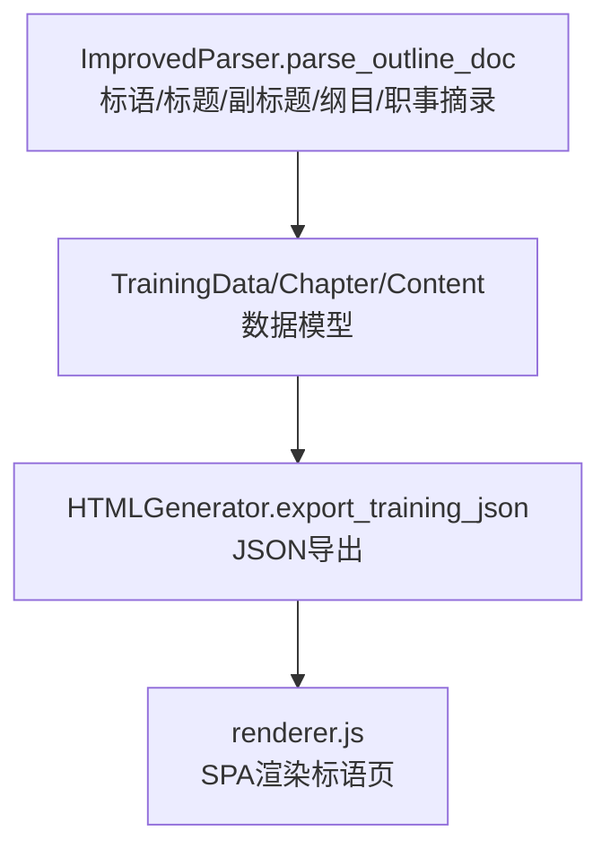
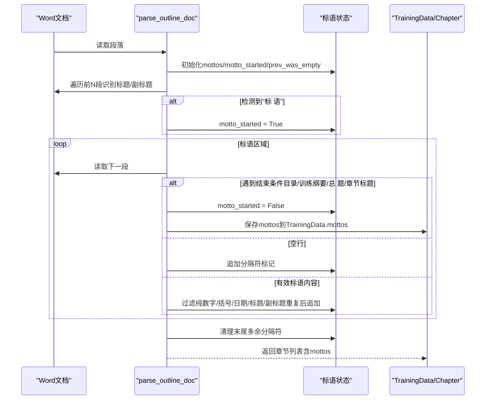

# 标语收集与处理

<cite>
**本文引用的文件**
- [src/parser_improved.py](file://src/parser_improved.py)
- [src/models.py](file://src/models.py)
- [src/generator.py](file://src/generator.py)
- [src/static/js/renderer.js](file://src/static/js/renderer.js)
</cite>

## 目录
1. [简介](#简介)
2. [项目结构](#项目结构)
3. [核心组件](#核心组件)
4. [架构概览](#架构概览)
5. [详细组件分析](#详细组件分析)
6. [依赖关系分析](#依赖关系分析)
7. [性能考量](#性能考量)
8. [故障排查指南](#故障排查指南)
9. [结论](#结论)

## 简介
本技术文档聚焦于“标语收集与处理”功能，围绕 parse_outline_doc 函数中的标语提取算法展开，系统阐述：
- 标语区域检测与触发条件（'标 语'关键字）
- 标语区域结束条件（'目录'、'训练纲要'、'总 题'、章节标题等）
- 内容有效性验证规则（排除纯数字、括号内容、日期信息、标题/副标题重复项等）
- 段落分隔符处理策略（空行转为分隔标记）
- 边界情况与性能优化要点
- 与训练数据模型、HTML生成器、前端渲染器的集成关系

## 项目结构
与标语提取直接相关的代码位于 Python 解析器模块中，同时涉及数据模型与前端渲染器的联动：
- 解析器：负责从经文 Word 文档中抽取标语、标题、副标题、纲目、职事摘录等
- 数据模型：承载训练标题、副标题、标语列表等结构化数据
- HTML生成器：将训练数据序列化为 JSON，并生成前端所需的脚本数据
- 前端渲染器：在 SPA 中渲染标语页面与标语诗歌

图表来源
- [src/parser_improved.py:367-782](file://src/parser_improved.py#L367-L782)
- [src/models.py:196-232](file://src/models.py#L196-L232)
- [src/generator.py:383-425](file://src/generator.py#L383-L425)
- [src/static/js/renderer.js:1236-1257](file://src/static/js/renderer.js#L1236-L1257)

章节来源
- [src/parser_improved.py:367-782](file://src/parser_improved.py#L367-L782)
- [src/models.py:196-232](file://src/models.py#L196-L232)
- [src/generator.py:383-425](file://src/generator.py#L383-L425)
- [src/static/js/renderer.js:1236-1257](file://src/static/js/renderer.js#L1236-L1257)

## 核心组件
- ImprovedParser.parse_outline_doc：负责解析经文 Word 文档，提取标题、副标题、标语、纲目、职事摘录等
- TrainingData/Chapter/Content：数据模型，承载训练标题、副标题、标语列表、章节纲目与详细内容
- HTMLGenerator.export_training_json：将训练数据导出为 JSON，供前端渲染器使用
- renderer.js：SPA 渲染器，负责渲染标语页与标语诗歌

章节来源
- [src/parser_improved.py:367-782](file://src/parser_improved.py#L367-L782)
- [src/models.py:196-232](file://src/models.py#L196-L232)
- [src/generator.py:383-425](file://src/generator.py#L383-L425)
- [src/static/js/renderer.js:1236-1257](file://src/static/js/renderer.js#L1236-L1257)

## 架构概览
标语提取在 parse_outline_doc 中的执行流程如下：
- 初始化标语相关状态变量（mottos、motto_started、prev_was_empty）
- 在文档前若干段落中识别标题与副标题，同时检测标语区域开始
- 进入标语区域后，依据结束条件终止收集
- 对收集到的标语内容进行有效性过滤与去重
- 将段落分隔符（空行）转换为统一的分隔标记
- 最终清理末尾多余的分隔标记，形成最终标语列表

图表来源
- [src/parser_improved.py:383-436](file://src/parser_improved.py#L383-L436)
- [src/parser_improved.py:412-421](file://src/parser_improved.py#L412-L421)
- [src/parser_improved.py:778-780](file://src/parser_improved.py#L778-L780)

## 详细组件分析

### 标语区域检测与触发条件
- 触发条件：当段落文本匹配“标 语”（允许中间空格）时，进入标语区域
- 作用：将后续内容视为标语候选，直至遇到结束条件或再次遇到“标 语”以外的标题/目录类内容

章节来源
- [src/parser_improved.py:428-432](file://src/parser_improved.py#L428-L432)

### 标语区域结束条件
- 目录：包含“目 录”
- 训练纲要：包含“训练纲要”
- 总 题：包含“总 题”（支持全角空格）
- 章节标题：以“第X篇”开头

章节来源
- [src/parser_improved.py:398-401](file://src/parser_improved.py#L398-L401)

### 内容有效性验证规则
- 排除纯数字
- 排除括号内容（中文圆括号、中文方括号、英文括号）
- 排除日期信息（包含“至/到/日”、年份、月日等模式）
- 排除与副标题完全一致的内容
- 排除与标题完全一致的内容

章节来源
- [src/parser_improved.py:413-421](file://src/parser_improved.py#L413-L421)

### 段落分隔符处理
- 空行被视为段落分隔
- 连续空行仅保留一个分隔标记
- 分隔标记统一为“###PARAGRAPH_SEPARATOR###”，便于前端渲染时按段落拆分

章节来源
- [src/parser_improved.py:403-408](file://src/parser_improved.py#L403-L408)

### 标语内容收集与后处理
- 收集阶段：在标语区域内，对每条有效内容进行过滤与去重后追加到 mottos
- 结束阶段：遇到结束条件或再次遇到标题/目录类内容时，停止收集
- 清理阶段：移除末尾多余的分隔标记，确保最终列表整洁

章节来源
- [src/parser_improved.py:396-421](file://src/parser_improved.py#L396-L421)
- [src/parser_improved.py:778-780](file://src/parser_improved.py#L778-L780)

### 与数据模型的集成
- TrainingData.mottos：最终标语列表
- Chapter.ministry_excerpt：职事摘录（与标语区域不同，但同属经文文档的摘录类内容）

章节来源
- [src/models.py:196-232](file://src/models.py#L196-L232)
- [src/parser_improved.py:778-780](file://src/parser_improved.py#L778-L780)

### 与前端渲染器的集成
- renderer.js 在加载训练数据后，若存在 mottos，则在导航中显示“标语”链接
- 支持多图（motto_song_images）优先，向后兼容 motto_song_image

章节来源
- [src/static/js/renderer.js:1236-1257](file://src/static/js/renderer.js#L1236-L1257)

### 代码示例（路径引用）
- 标语区域开始检测与进入
  - [src/parser_improved.py:428-432](file://src/parser_improved.py#L428-L432)
- 标语区域结束条件与停止逻辑
  - [src/parser_improved.py:398-401](file://src/parser_improved.py#L398-L401)
- 内容有效性过滤与去重
  - [src/parser_improved.py:413-421](file://src/parser_improved.py#L413-L421)
- 段落分隔符处理
  - [src/parser_improved.py:403-408](file://src/parser_improved.py#L403-L408)
- 末尾分隔符清理
  - [src/parser_improved.py:778-780](file://src/parser_improved.py#L778-L780)

## 依赖关系分析
- ImprovedParser 依赖数据模型（TrainingData/Chapter/Content）以组织提取结果
- HTMLGenerator 依赖 TrainingData 将 mottos 等字段序列化为 JSON
- renderer.js 依赖 JSON 中的 mottos 字段进行页面渲染

图表来源
- [src/parser_improved.py:367-782](file://src/parser_improved.py#L367-L782)
- [src/models.py:196-232](file://src/models.py#L196-L232)
- [src/generator.py:383-425](file://src/generator.py#L383-L425)
- [src/static/js/renderer.js:1236-1257](file://src/static/js/renderer.js#L1236-L1257)

## 性能考量
- 正则表达式预编译：在类初始化时预编译常用正则，减少重复编译开销
- 早停策略：在文档开头扩大检查范围以捕获标语，但遇到目录/章节标题即停止，避免全量扫描
- 状态变量最小化：仅维护必要状态（mottos、motto_started、prev_was_empty），降低内存占用
- 过滤与去重：在收集阶段即时过滤无效内容，减少后续处理成本

章节来源
- [src/parser_improved.py:137-145](file://src/parser_improved.py#L137-L145)
- [src/parser_improved.py:383-436](file://src/parser_improved.py#L383-L436)
- [src/parser_improved.py:413-421](file://src/parser_improved.py#L413-L421)

## 故障排查指南
- 标语未被识别
  - 检查触发条件是否为“标 语”（允许空格）
  - 确认结束条件是否正确（目录/训练纲要/总 题/章节标题）
  - 参考：[src/parser_improved.py:398-432](file://src/parser_improved.py#L398-L432)
- 标语内容异常
  - 确认过滤规则是否导致误判（纯数字/括号/日期/标题/副标题重复）
  - 参考：[src/parser_improved.py:413-421](file://src/parser_improved.py#L413-L421)
- 段落分隔异常
  - 确认空行是否被正确识别为分隔符
  - 参考：[src/parser_improved.py:403-408](file://src/parser_improved.py#L403-L408)
- 末尾多余分隔符
  - 确认清理逻辑是否执行
  - 参考：[src/parser_improved.py:778-780](file://src/parser_improved.py#L778-L780)
- 前端未显示标语
  - 检查 JSON 中 mottos 是否存在
  - 参考：[src/static/js/renderer.js:1236-1257](file://src/static/js/renderer.js#L1236-L1257)

## 结论
parse_outline_doc 中的标语提取算法通过明确的触发与结束条件、严格的过滤与去重规则、以及统一的段落分隔符处理，实现了稳定可靠的标语收集。配合数据模型与前端渲染器，最终形成完整的标语展示链路。建议在后续迭代中持续关注正则表达式的可维护性与性能表现，并在边界场景（如复杂标题/副标题格式）下进行回归测试。