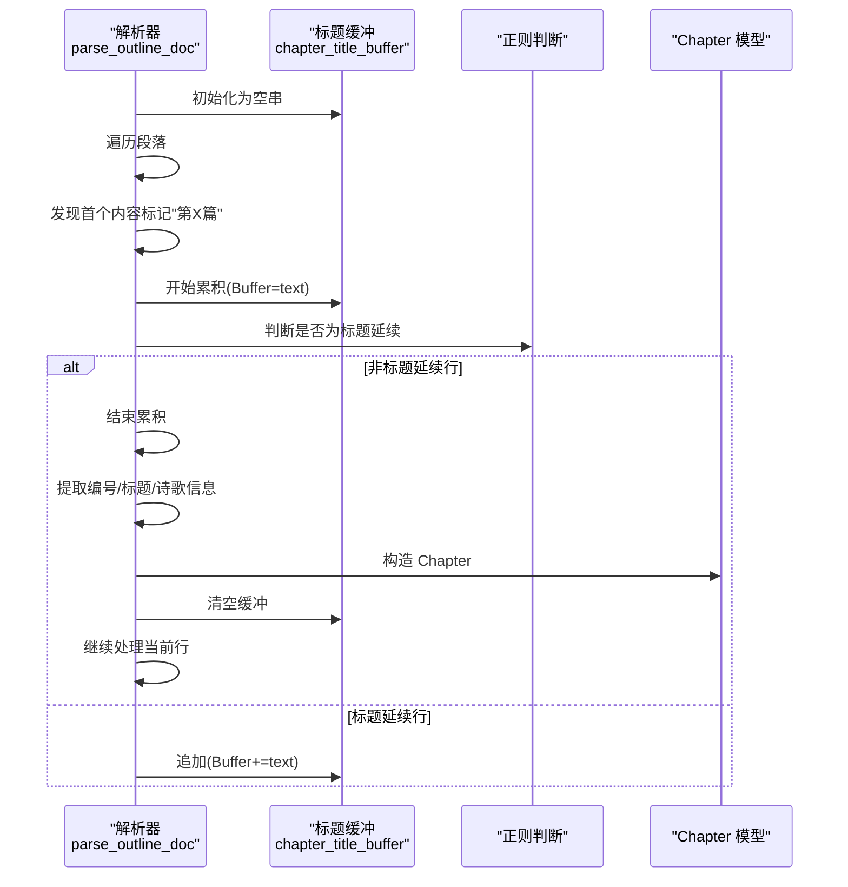
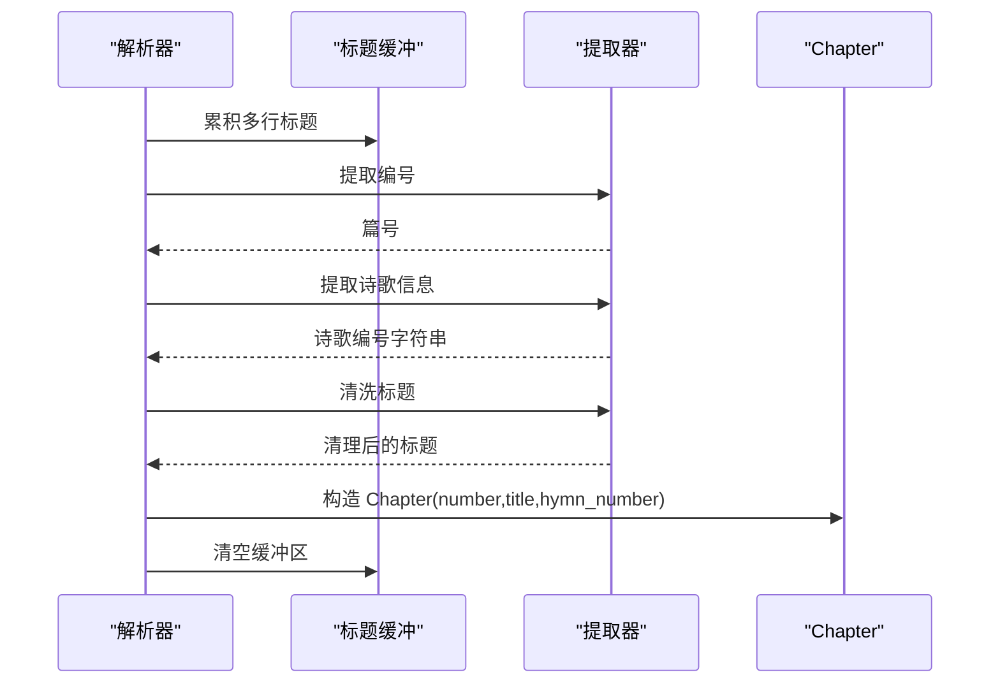
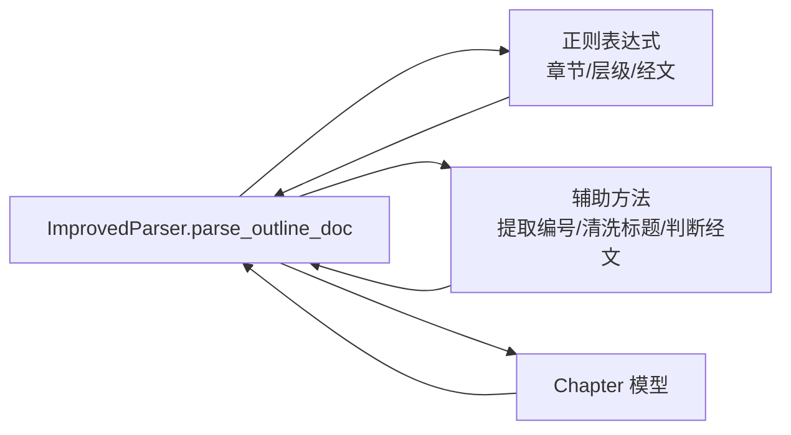

# 多行标题缓冲处理

<cite>
**本文引用的文件**
- [parser_improved.py](file://src/parser_improved.py)
- [models.py](file://src/models.py)
</cite>

## 目录
1. [简介](#简介)
2. [项目结构](#项目结构)
3. [核心组件](#核心组件)
4. [架构概览](#架构概览)
5. [详细组件分析](#详细组件分析)
6. [依赖关系分析](#依赖关系分析)
7. [性能考量](#性能考量)
8. [故障排查指南](#故障排查指南)
9. [结论](#结论)

## 简介
本技术文档聚焦于“多行标题缓冲处理”机制，系统性阐述 chapter_title_buffer 的实现原理与控制流，包括：
- 标题行的累积逻辑
- 标题延续的判断条件
- 缓冲区状态管理
- 如何识别标题的延续行（排除诗歌编号行、读经行等非标题内容）
- 多行标题的拼接算法
- 标题结束的判定标准
- 完整的标题创建流程（含异常处理与边界条件）

目标读者既包括需要快速上手的工程师，也包括希望深入理解实现细节的高级开发者。

## 项目结构
本功能位于解析器模块中，围绕 ImprovedParser 类展开，涉及标题识别、缓冲累积、结束判定与章节创建等环节。

```mermaid
graph TB
A["ImprovedParser.parse_outline_doc<br/>解析纲目文档"] --> B["初始化状态<br/>in_content_section=false<br/>chapter_title_buffer=''"]
B --> C["遍历段落<br/>text=para.text.strip()"]
C --> D{"是否处于内容区？"}
D -- 否 --> E["寻找首个内容标记<br/>\"第X篇\""]
E --> F["进入内容区<br/>in_content_section=true"]
F --> G["开始累积标题<br/>chapter_title_buffer=text"]
D -- 是 --> H["检测章节标题行<br/>\"第[一二三四...]篇\""]
H --> I["保存上一章<br/>append(current_chapter)"]
I --> J["重置状态<br/>ministry_buffer=[]<br/>collecting_ministry=False"]
J --> K["开始新篇<br/>chapter_title_buffer=text"]
G --> L{"缓冲区是否存在内容？"}
L -- 是 --> M["继续累积标题行<br/>chapter_title_buffer+=text"]
M --> N{"是否遇到非标题延续行？"}
N -- 否 --> O["继续累积"]
N -- 是 --> P["标题结束，创建章节"]
P --> Q["提取编号/标题/诗歌信息"]
Q --> R["构造 Chapter 对象"]
R --> S["清空缓冲区<br/>chapter_title_buffer=''"]
```

图表来源
- [parser_improved.py:367-782](file://src/parser_improved.py#L367-L782)

章节来源
- [parser_improved.py:367-782](file://src/parser_improved.py#L367-L782)

## 核心组件
- ImprovedParser.parse_outline_doc：解析纲目文档的主流程，负责标题缓冲、章节创建与大纲解析。
- Chapter：章节数据模型，承载标题、编号、诗歌编号、经文等字段。
- 正则与辅助方法：用于识别标题延续、提取编号、清理标题、判断经文行等。

章节来源
- [parser_improved.py:367-782](file://src/parser_improved.py#L367-L782)
- [models.py:40-63](file://src/models.py#L40-L63)

## 架构概览
标题缓冲处理贯穿于“内容区扫描”阶段，其关键在于：
- 何时开启缓冲（遇到首个“第X篇”）
- 如何判断标题延续（排除诗歌编号、读经行等）
- 如何结束累积并创建章节
- 如何处理跨行续接（读经行末尾逗号）



图表来源
- [parser_improved.py:576-638](file://src/parser_improved.py#L576-L638)

章节来源
- [parser_improved.py:576-638](file://src/parser_improved.py#L576-L638)

## 详细组件分析

### 1) 标题缓冲区状态管理
- 初始化：在进入内容区前，缓冲区为空串。
- 开启：首次遇到“第X篇”的单独行时，将该行写入缓冲区并标记进入内容区。
- 关闭：当检测到下一个“第X篇”或遇到非标题延续行时，停止累积。
- 清空：创建章节后，清空缓冲区，以便处理下一篇文章。

```mermaid
flowchart TD
Start(["开始"]) --> Init["初始化<br/>chapter_title_buffer=''"]
Init --> FirstMarker{"是否遇到首个内容标记<br/>\"第X篇\"？"}
FirstMarker -- 否 --> NextPara["继续遍历"]
FirstMarker -- 是 --> EnterContent["进入内容区<br/>in_content_section=true"]
EnterContent --> BufferStart["开始累积<br/>chapter_title_buffer=text"]
BufferStart --> Continue{"缓冲区是否为空？"}
Continue -- 是 --> DetectNext["检测下一行"]
DetectNext --> IsTitle{"是否为标题延续行？"}
IsTitle -- 是 --> Append["追加到缓冲区"]
Append --> DetectNext
IsTitle -- 否 --> EndAccumulate["结束累积"]
EndAccumulate --> CreateChapter["提取编号/标题/诗歌信息<br/>构造 Chapter"]
CreateChapter --> Clear["清空缓冲区"]
Clear --> NextPara
```

图表来源
- [parser_improved.py:576-638](file://src/parser_improved.py#L576-L638)

章节来源
- [parser_improved.py:576-638](file://src/parser_improved.py#L576-L638)

### 2) 标题延续的判断条件
- 若当前行满足任一“非标题延续行”的特征，则认为标题结束，停止累积。
- 非标题延续行包括但不限于：
  - 以两字母前缀开头（如 EM、JL、MC 等，支持斜杠或空格分隔）
  - 以 NL/ 开头
  - 以“读经：”开头
  - 包含“诗歌：”或“诗歌:”
- 以上规则通过正则集合进行匹配，确保不会把诗歌编号行、读经行误判为标题延续。

章节来源
- [parser_improved.py:604-613](file://src/parser_improved.py#L604-L613)

### 3) 多行标题的拼接算法
- 累积策略：将“标题延续行”直接拼接到缓冲区，形成完整的多行标题。
- 拼接顺序：按段落遍历顺序依次追加，保持原文顺序。
- 结束条件：遇到非标题延续行即停止累积。

章节来源
- [parser_improved.py:603-613](file://src/parser_improved.py#L603-L613)

### 4) 标题结束的判定标准
- 下一“第X篇”出现：触发保存上一章并开启新章。
- 遇到非标题延续行：立即结束累积，进入章节创建流程。
- 读经跨行续接：若当前行是上一行以逗号结尾的“读经：”续接，则特殊处理，不视为标题延续。

章节来源
- [parser_improved.py:583-638](file://src/parser_improved.py#L583-L638)
- [parser_improved.py:640-655](file://src/parser_improved.py#L640-L655)

### 5) 标题创建的完整流程
- 提取编号：从完整标题中提取“第X篇”中的篇号，支持中文数字与阿拉伯数字。
- 提取诗歌信息：从标题中抽取“XX 诗歌：YYYY”形式的诗歌编号，并保留多前缀组合。
- 清洗标题：去除“第X篇”与诗歌信息，得到最终标题文本。
- 构造章节：创建 Chapter 实例，填充编号、标题、诗歌编号等字段。



图表来源
- [parser_improved.py:615-637](file://src/parser_improved.py#L615-L637)
- [parser_improved.py:958-975](file://src/parser_improved.py#L958-L975)
- [models.py:40-63](file://src/models.py#L40-L63)

章节来源
- [parser_improved.py:615-637](file://src/parser_improved.py#L615-L637)
- [parser_improved.py:958-975](file://src/parser_improved.py#L958-L975)
- [models.py:40-63](file://src/models.py#L40-L63)

### 6) 异常处理与边界条件
- 非标题延续行的严格排除：确保诗歌编号行、读经行、NL/ 前缀等不被误判为标题延续。
- 读经跨行续接：若上一行以逗号结尾，下一行应视为续接而非标题延续。
- 标题清洗：去除“第X篇”与诗歌信息，避免冗余信息污染标题。
- 多前缀诗歌编号：支持多个两字母前缀组合（如 EM、JL、MC 等），并兼容全角/半角冒号。
- 编号映射：中文数字与阿拉伯数字均可识别，超出范围时回退默认值。

章节来源
- [parser_improved.py:604-627](file://src/parser_improved.py#L604-L627)
- [parser_improved.py:640-655](file://src/parser_improved.py#L640-L655)
- [parser_improved.py:958-975](file://src/parser_improved.py#L958-L975)

## 依赖关系分析
- ImprovedParser.parse_outline_doc 依赖：
  - 正则表达式：用于识别“第X篇”、层级标记、经文行等。
  - 辅助方法：提取编号、清洗标题、判断经文行等。
  - 数据模型：Chapter 用于承载解析结果。
- 正则与模式：
  - “第X篇”识别：支持中文数字与阿拉伯数字。
  - 层级标记：支持壹、一、1、a、㈠等层级标记。
  - 经文格式：支持“书卷+章节:节”等多种格式。



图表来源
- [parser_improved.py:118-145](file://src/parser_improved.py#L118-L145)
- [parser_improved.py:958-975](file://src/parser_improved.py#L958-L975)
- [models.py:40-63](file://src/models.py#L40-L63)

章节来源
- [parser_improved.py:118-145](file://src/parser_improved.py#L118-L145)
- [parser_improved.py:958-975](file://src/parser_improved.py#L958-L975)
- [models.py:40-63](file://src/models.py#L40-L63)

## 性能考量
- 时间复杂度：线性扫描段落，O(N)，其中 N 为段落数。
- 空间复杂度：主要由缓冲区与正则匹配占用，整体仍为线性级别。
- 优化建议：
  - 预编译正则表达式，减少重复编译开销（已在代码中预编译）。
  - 控制标题累积范围：仅在必要范围内进行累积，避免无意义的长串拼接。
  - 早期终止：一旦检测到“第X篇”或非标题延续行，立即切换状态，减少无效匹配。

## 故障排查指南
- 症状：标题未正确合并为多行
  - 检查是否遗漏“第X篇”内容标记
  - 确认非标题延续行的排除规则是否覆盖了目标行（如 NL/、读经：、诗歌：等）
- 症状：章节编号错误
  - 检查中文数字映射范围与默认回退逻辑
- 症状：诗歌编号丢失
  - 确认标题中“XX 诗歌：YYYY”格式是否正确，以及多前缀组合是否被正确提取
- 症状：标题清洗不彻底
  - 检查“第X篇”与“诗歌：”的正则替换是否生效

章节来源
- [parser_improved.py:615-637](file://src/parser_improved.py#L615-L637)
- [parser_improved.py:958-975](file://src/parser_improved.py#L958-L975)

## 结论
多行标题缓冲处理通过“章节标记识别 + 标题延续判断 + 缓冲累积 + 结束判定 + 章节创建”的闭环流程，实现了对复杂标题结构的稳健解析。其关键在于：
- 明确的缓冲区状态机
- 严格的非标题延续行排除
- 清晰的标题清洗与编号提取
- 对跨行续接的细致处理

该机制为后续的大纲解析与内容填充提供了可靠的基础，具备良好的可维护性与扩展性。