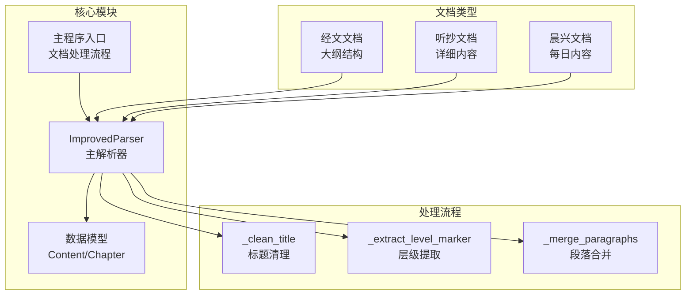
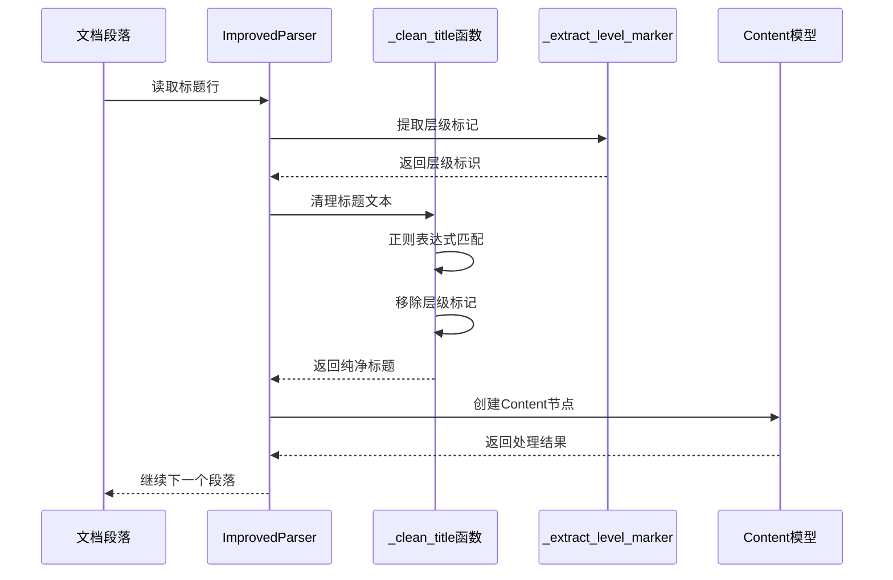
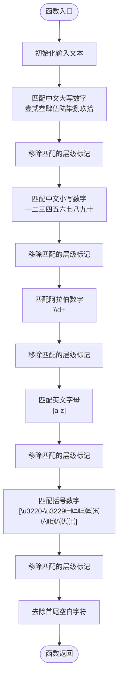
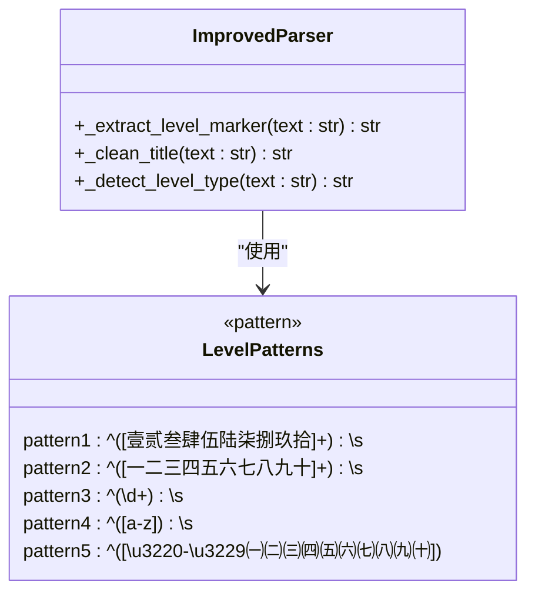
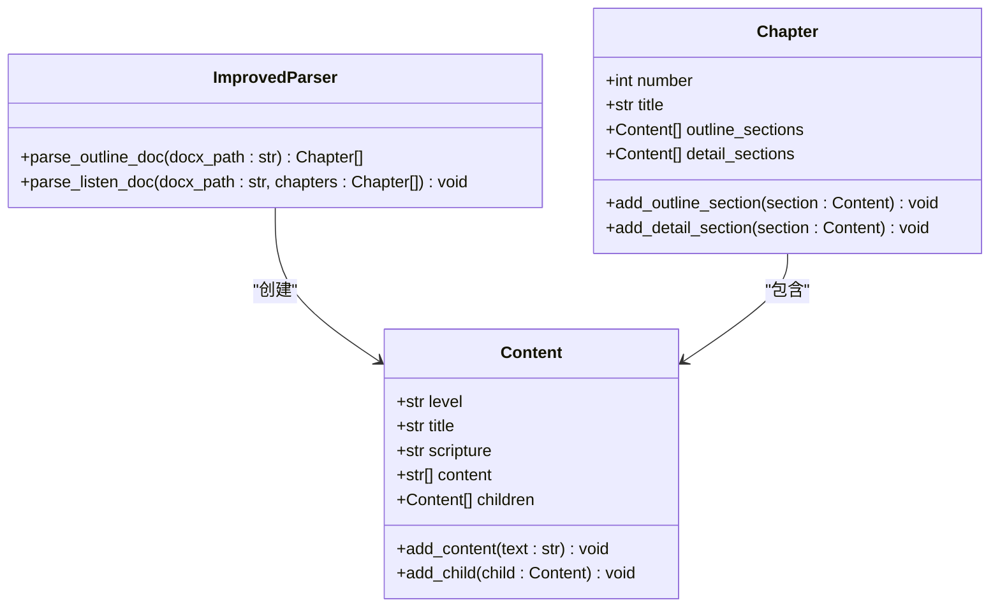
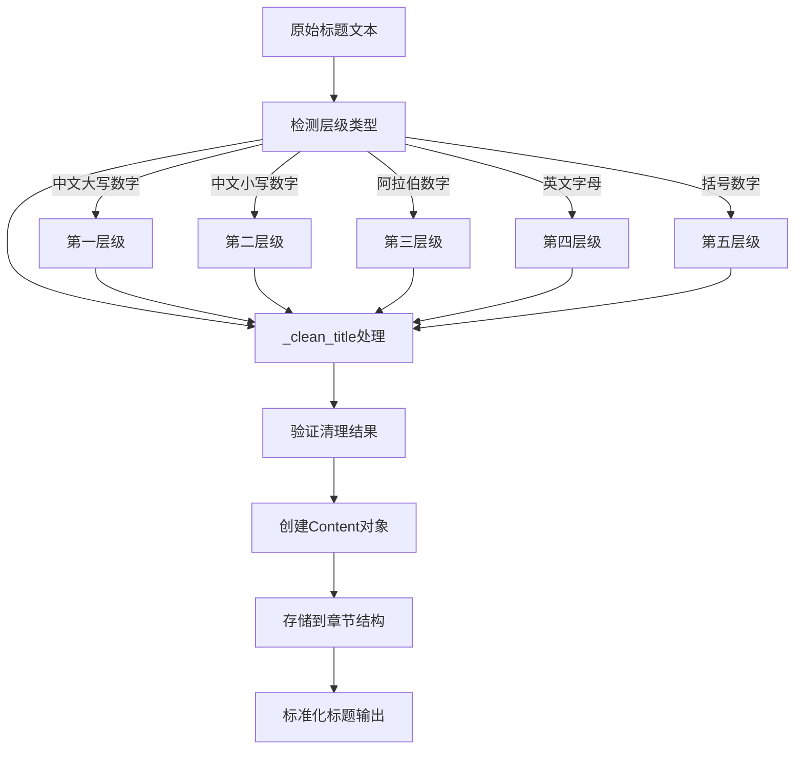
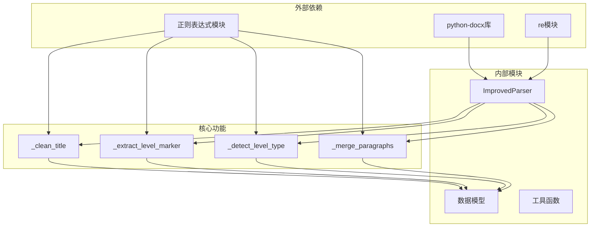

# 标题清理处理

<cite>
**本文档引用的文件**
- [src/parser_improved.py](file://src/parser_improved.py)
- [src/models.py](file://src/models.py)
- [main.py](file://main.py)
</cite>

## 目录
1. [简介](#简介)
2. [项目结构](#项目结构)
3. [核心组件](#核心组件)
4. [架构概览](#架构概览)
5. [详细组件分析](#详细组件分析)
6. [依赖分析](#依赖分析)
7. [性能考虑](#性能考虑)
8. [故障排除指南](#故障排除指南)
9. [结论](#结论)

## 简介

本文档深入分析了项目中的标题清理处理功能，重点解释 `_clean_title` 函数的实现机制。该函数负责从带有层级标记的标题文本中提取纯净的标题内容，包括对不同层级符号（壹贰叁肆伍陆柒捌玖拾、一二三四五六七八九十、数字、英文字母等）的处理。

标题清理处理是文档解析过程中的关键步骤，确保从原始文档中提取的标题信息具有统一的格式和结构，为后续的内容组织和展示奠定基础。

## 项目结构

该项目采用模块化的Python架构，主要包含以下核心组件：

**图表来源**
- [src/parser_improved.py:115-135](file://src/parser_improved.py#L115-L135)
- [src/models.py:9-63](file://src/models.py#L9-L63)

**章节来源**
- [src/parser_improved.py:1-113](file://src/parser_improved.py#L1-L113)
- [src/models.py:1-232](file://src/models.py#L1-L232)

## 核心组件

### ImprovedParser 类

`ImprovedParser` 是整个文档解析系统的核心类，负责处理各种类型的Word文档。它包含完整的标题清理功能，能够识别和处理多层次的标题结构。

### Content 数据模型

`Content` 类代表内容节点，包含层级标识、标题文本、经文引用和正文段落等属性。这是标题清理结果的承载容器。

### 标题清理函数族

系统提供了多个相关的标题处理函数：

- `_clean_title`: 主要的标题清理函数
- `_extract_level_marker`: 提取层级标识
- `_detect_level_type`: 检测文本层级类型
- `_merge_paragraphs`: 合并段落逻辑

**章节来源**
- [src/parser_improved.py:115-135](file://src/parser_improved.py#L115-L135)
- [src/models.py:9-26](file://src/models.py#L9-L26)

## 架构概览

标题清理处理在整个文档解析流程中扮演着关键角色：

**图表来源**
- [src/parser_improved.py:686-728](file://src/parser_improved.py#L686-L728)
- [src/parser_improved.py:2160-2168](file://src/parser_improved.py#L2160-L2168)
- [src/parser_improved.py:977-992](file://src/parser_improved.py#L977-L992)

## 详细组件分析

### _clean_title 函数详解

`_clean_title` 函数是标题清理的核心实现，采用多阶段的正则表达式处理策略：

#### 算法流程

**图表来源**
- [src/parser_improved.py:2160-2168](file://src/parser_improved.py#L2160-L2168)

#### 正则表达式分析

函数使用了五个不同的正则表达式模式来处理不同类型的层级标记：

1. **中文大写数字**: `^[壹贰叁肆伍陆柒捌玖拾]+\s+`
   - 处理"壹、贰、叁"等大写中文数字
   - 适用于第一层级标题

2. **中文小写数字**: `^[一二三四五六七八九十]+\s+`
   - 处理"一、二、三"等小写中文数字  
   - 适用于第二层级标题

3. **阿拉伯数字**: `^\d+\s+`
   - 处理"1、2、3"等阿拉伯数字
   - 适用于第三层级标题

4. **英文字母**: `^[a-z]\s+`
   - 处理"a、b、c"等英文字母
   - 适用于第四层级标题

5. **括号数字**: `^[\u3220-\u3229㈠㈡㈢㈣㈤㈥㈦㈧㈨㈩]\s*`
   - 处理"㈠、㈡、㈢"等特殊括号数字
   - 适用于第五层级标题

#### 处理逻辑复杂度

- **时间复杂度**: O(n)，其中n是输入文本长度
- **空间复杂度**: O(n)，用于存储处理后的文本
- **执行次数**: 每个标题行最多执行5次正则匹配

**章节来源**
- [src/parser_improved.py:2160-2168](file://src/parser_improved.py#L2160-L2168)

### _extract_level_marker 函数

该函数负责从标题文本中提取层级标识，与 `_clean_title` 函数配合使用：

**图表来源**
- [src/parser_improved.py:977-992](file://src/parser_improved.py#L977-L992)

**章节来源**
- [src/parser_improved.py:977-992](file://src/parser_improved.py#L977-L992)

### Content 模型集成

清理后的标题信息最终存储在 `Content` 模型中：

**图表来源**
- [src/models.py:9-63](file://src/models.py#L9-L63)

**章节来源**
- [src/models.py:9-63](file://src/models.py#L9-L63)

### 标准化处理流程

标题清理不仅仅是简单的文本删除，还涉及复杂的文本标准化过程：

**图表来源**
- [src/parser_improved.py:686-728](file://src/parser_improved.py#L686-L728)
- [src/parser_improved.py:2160-2168](file://src/parser_improved.py#L2160-L2168)

**章节来源**
- [src/parser_improved.py:686-728](file://src/parser_improved.py#L686-L728)

## 依赖分析

### 组件间依赖关系

**图表来源**
- [src/parser_improved.py:5-13](file://src/parser_improved.py#L5-L13)
- [src/parser_improved.py:2160-2168](file://src/parser_improved.py#L2160-L2168)

### 错误处理机制

系统实现了完善的错误处理机制：

- **正则表达式异常**: 使用 try-catch 处理正则匹配异常
- **文档格式错误**: 检测不支持的文件格式
- **内存管理**: 及时清理临时文件和资源
- **类型验证**: 确保输入参数的正确性

**章节来源**
- [src/parser_improved.py:26-113](file://src/parser_improved.py#L26-L113)

## 性能考虑

### 时间复杂度优化

- **预编译正则表达式**: 所有正则表达式在类初始化时预编译，避免重复编译开销
- **早期退出**: 一旦找到匹配的层级类型就立即停止后续匹配
- **批量处理**: 同一文档中的多个标题行共享预编译的正则表达式

### 内存使用优化

- **惰性求值**: 只在需要时才创建和存储中间结果
- **资源管理**: 及时释放临时文件和文档对象
- **数据结构选择**: 使用高效的列表和字典结构存储处理结果

### 并发处理

系统支持多线程处理多个文档，每个文档的解析过程相互独立，互不影响。

## 故障排除指南

### 常见问题及解决方案

#### 标题清理不完整

**问题**: 清理后的标题仍然包含层级标记

**原因分析**:
1. 正则表达式模式不匹配特定的层级格式
2. 输入文本包含特殊字符或编码问题
3. 标题格式不符合预期的标准格式

**解决方法**:
1. 检查输入文本的编码格式
2. 验证正则表达式的匹配模式
3. 添加日志输出跟踪处理过程

#### 层级识别错误

**问题**: 系统错误地识别了标题的层级

**原因分析**:
1. 标题格式与标准格式存在差异
2. 正则表达式匹配顺序影响结果
3. 特殊字符干扰了匹配过程

**解决方法**:
1. 调整正则表达式的匹配优先级
2. 添加更严格的格式验证
3. 实现回退机制处理异常情况

#### 性能问题

**问题**: 处理大量文档时性能下降

**解决方法**:
1. 使用多线程并发处理
2. 实现结果缓存机制
3. 优化正则表达式的复杂度

**章节来源**
- [src/parser_improved.py:2100-2158](file://src/parser_improved.py#L2100-L2158)

## 结论

标题清理处理功能是整个文档解析系统的重要组成部分，通过 `_clean_title` 函数实现了对多层级标题的精确识别和清理。该函数采用多阶段的正则表达式处理策略，能够有效处理各种格式的层级标记，确保标题内容的标准化和一致性。

系统的整体设计体现了良好的模块化原则，各个组件职责明确，耦合度适中，为后续的功能扩展和维护提供了良好的基础。通过合理的错误处理机制和性能优化策略，系统能够在保证准确性的同时满足大规模文档处理的需求。

未来可以考虑进一步优化的方向包括：支持更多样化的标题格式、实现更智能的层级识别算法、以及提供更丰富的配置选项来适应不同的文档结构需求。