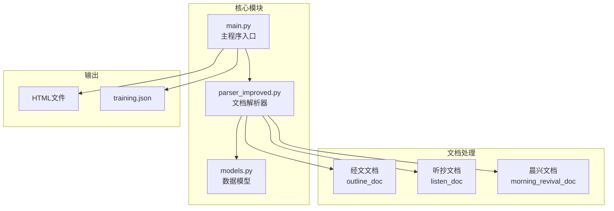
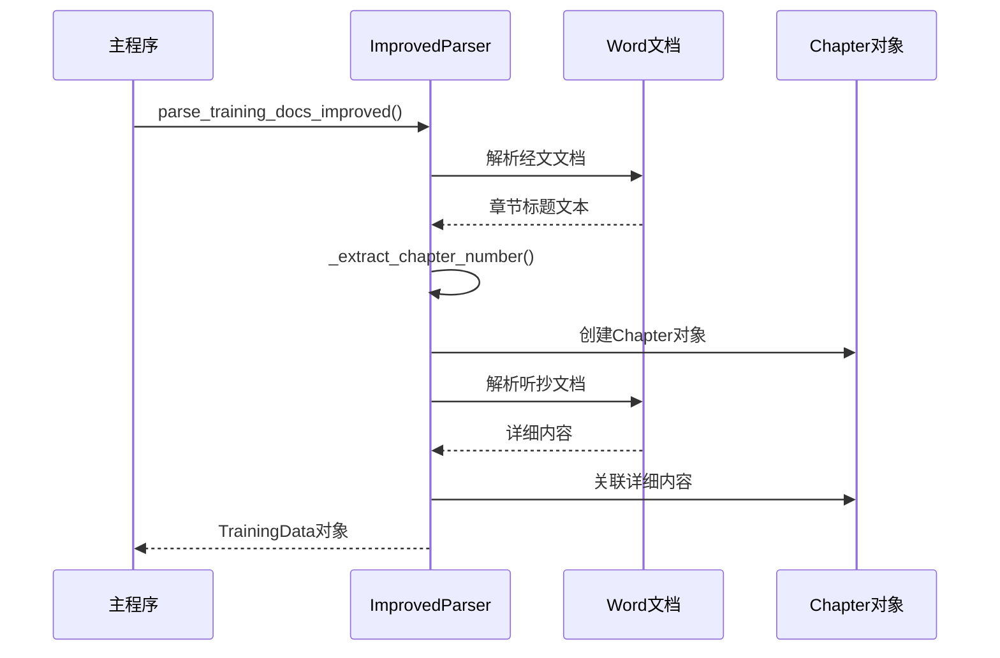
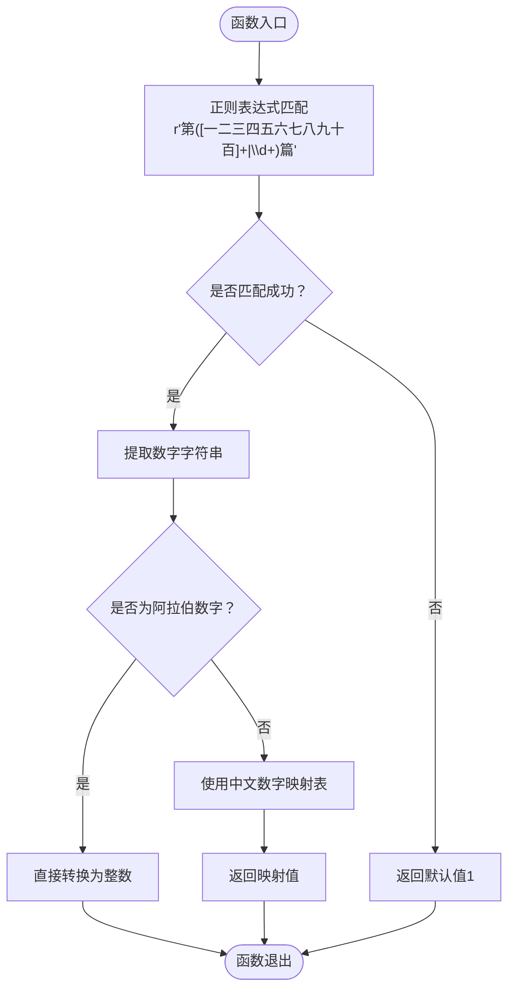
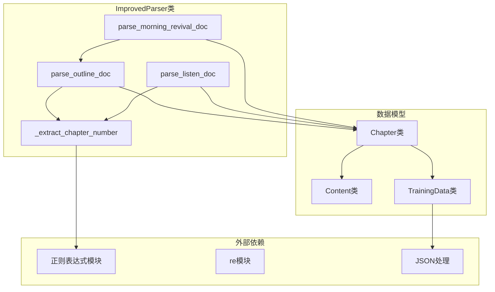

# 章节编号提取

<cite>
**本文档引用的文件**
- [parser_improved.py](file://src/parser_improved.py)
- [models.py](file://src/models.py)
- [main.py](file://main.py)
</cite>

## 目录
1. [简介](#简介)
2. [项目结构](#项目结构)
3. [核心组件](#核心组件)
4. [架构概览](#架构概览)
5. [详细组件分析](#详细组件分析)
6. [依赖关系分析](#依赖关系分析)
7. [性能考虑](#性能考虑)
8. [故障排除指南](#故障排除指南)
9. [结论](#结论)

## 简介

本文档详细介绍了项目中的章节编号提取功能，重点分析 `_extract_chapter_number` 函数的实现原理。该功能负责从文档标题中准确提取篇章编号，支持中文数字（一二三四五六七八九十、壹贰叁肆伍陆柒捌玖拾等）和阿拉伯数字的转换，确保文档解析的准确性。

## 项目结构

该项目是一个从Word文档自动生成静态HTML网站的工具，专门用于处理特会信息内容。主要结构包括：



**图表来源**
- [parser_improved.py:115-2550](file://src/parser_improved.py#L115-L2550)
- [models.py:1-232](file://src/models.py#L1-232)
- [main.py:1-800](file://src/main.py#L1-L800)

## 核心组件

### ImprovedParser 类

`ImprovedParser` 是整个文档解析系统的核心类，负责处理各种文档格式和提取结构化内容。该类包含多个关键方法，其中 `_extract_chapter_number` 函数专门用于章节编号提取。

### Chapter 数据模型

`Chapter` 类定义了篇章的数据结构，包含编号、标题、纲目结构、详细内容等属性。章节编号提取功能直接影响到 `Chapter` 对象的创建和关联。

**章节来源**
- [parser_improved.py:115-2550](file://src/parser_improved.py#L115-L2550)
- [models.py:40-100](file://src/models.py#L40-L100)

## 架构概览

章节编号提取功能在整个文档解析流程中扮演着关键角色：



**图表来源**
- [parser_improved.py:2592-2709](file://src/parser_improved.py#L2592-L2709)
- [parser_improved.py:615-630](file://src/parser_improved.py#L615-L630)

## 详细组件分析

### _extract_chapter_number 函数实现

#### 函数签名和基本结构



**图表来源**
- [parser_improved.py:958-975](file://src/parser_improved.py#L958-L975)

#### 正则表达式匹配模式

函数使用精确的正则表达式来匹配章节标题格式：

```python
match = re.search(r'第([一二三四五六七八九十百]+|\d+)篇', text)
```

该模式的特点：
- `第` - 匹配章节标识词
- `([一二三四五六七八九十百]+|\d+)` - 匹配中文数字或阿拉伯数字
- `篇` - 匹配章节单位词

#### 中文数字映射机制

对于中文数字，函数使用预定义的映射表支持1-99的转换：

```python
num_map = {
    '一': 1, '二': 2, '三': 3, '四': 4, '五': 5, '六': 6, '七': 7, '八': 8, '九': 9, '十': 10,
    '十一': 11, '十二': 12, '十三': 13, '十四': 14, '十五': 15, '十六': 16, '十七': 17, '十八': 18, '十九': 19, '二十': 20,
    '二十一': 21, '二十二': 22, '二十三': 23, '二十四': 24, '二十五': 25, '二十六': 26, '二十七': 27, '二十八': 28, '二十九': 29, '三十': 30
}
```

#### 边界条件处理

函数实现了完善的边界条件处理：

1. **空输入处理**：返回默认值1
2. **格式不匹配**：返回默认值1  
3. **中文数字范围限制**：仅支持1-99的中文数字
4. **阿拉伯数字直接转换**：支持任意阿拉伯数字

### 使用场景分析

#### 在经文文档解析中的应用

在 `parse_outline_doc` 方法中，章节编号提取用于创建 `Chapter` 对象：

```python
chapter_num = self._extract_chapter_number(chapter_title_buffer)
self.current_chapter = Chapter(
    number=chapter_num,
    title=clean_title
)
```

#### 在听抄文档解析中的应用

在 `parse_listen_doc` 方法中，章节编号用于定位对应的 `Chapter` 对象：

```python
chapter_num = self._extract_chapter_number(text)
current_chapter_num = chapter_num
for chapter in chapters:
    if chapter.number == chapter_num:
        self.current_chapter = chapter
        break
```

**章节来源**
- [parser_improved.py:615-630](file://src/parser_improved.py#L615-L630)
- [parser_improved.py:826-841](file://src/parser_improved.py#L826-L841)

## 依赖关系分析

### 内部依赖关系



**图表来源**
- [parser_improved.py:115-2550](file://src/parser_improved.py#L115-L2550)
- [models.py:1-232](file://src/models.py#L1-232)

### 外部依赖

章节编号提取功能依赖于以下外部模块：
- `re` - 正则表达式处理
- `os` - 文件系统操作
- `sys` - 系统特定参数

## 性能考虑

### 时间复杂度分析

章节编号提取函数的时间复杂度为 O(n)，其中 n 是输入文本的长度。主要开销来自于：
- 正则表达式匹配：O(n)
- 字符串处理：O(k)，k为匹配字符串长度
- 字典查找：O(1)

### 空间复杂度分析

空间复杂度为 O(1)，因为：
- 正则表达式模式大小固定
- 映射表大小固定（最多99个条目）
- 只使用常量额外空间

### 优化建议

1. **预编译正则表达式**：已在类级别预编译，无需额外优化
2. **缓存常用映射**：映射表在类初始化时创建，避免重复分配
3. **早期返回**：匹配失败时立即返回默认值

## 故障排除指南

### 常见问题及解决方案

#### 问题1：中文数字转换错误

**症状**：中文数字如"三十一"转换为错误的数值

**原因**：当前映射表只支持1-30的中文数字

**解决方案**：扩展映射表以支持更大的中文数字范围

#### 问题2：格式不匹配导致的错误

**症状**：标题格式不符合预期时返回默认值1

**原因**：正则表达式匹配失败

**解决方案**：检查输入文本格式，确保包含"第X篇"格式

#### 问题3：阿拉伯数字溢出

**症状**：超过整数范围的阿拉伯数字处理异常

**原因**：Python整数限制

**解决方案**：添加输入验证，限制数字范围

### 调试技巧

1. **打印中间结果**：在正则表达式匹配前后打印文本
2. **单元测试**：为不同格式的输入编写测试用例
3. **边界测试**：测试最小值和最大值边界条件

**章节来源**
- [parser_improved.py:958-975](file://src/parser_improved.py#L958-L975)

## 结论

章节编号提取功能是文档解析系统的重要组成部分，通过精确的正则表达式匹配和完善的中文数字转换机制，确保了文档结构的正确解析。该功能具有以下特点：

1. **高可靠性**：完善的边界条件处理和默认值机制
2. **易扩展性**：清晰的接口设计，便于功能扩展
3. **高性能**：线性时间复杂度，适合大规模文档处理
4. **健壮性**：对各种输入格式都有良好的容错能力

未来可以考虑的改进方向包括：
- 扩展中文数字支持范围
- 添加更多格式的兼容性
- 实现更复杂的数字转换算法
- 增强错误报告和调试功能