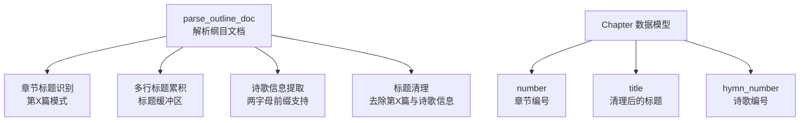
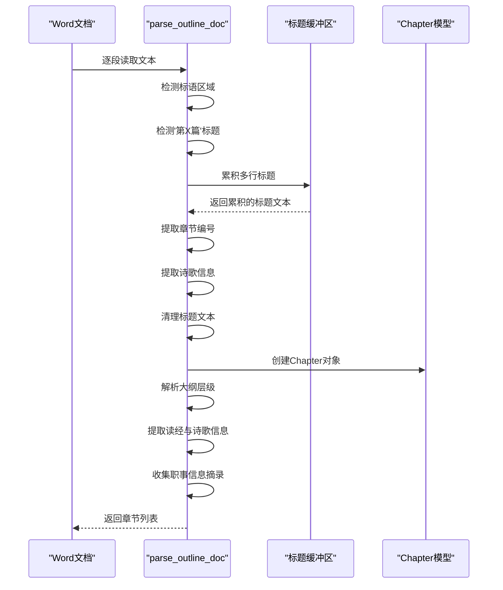
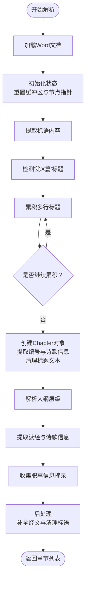
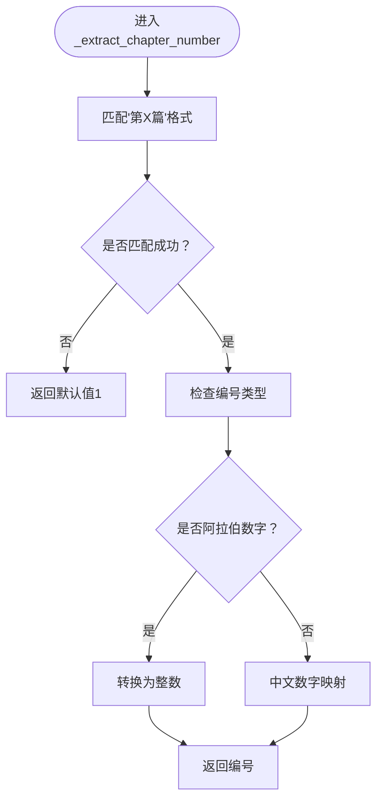
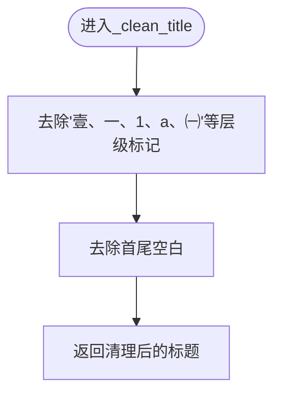
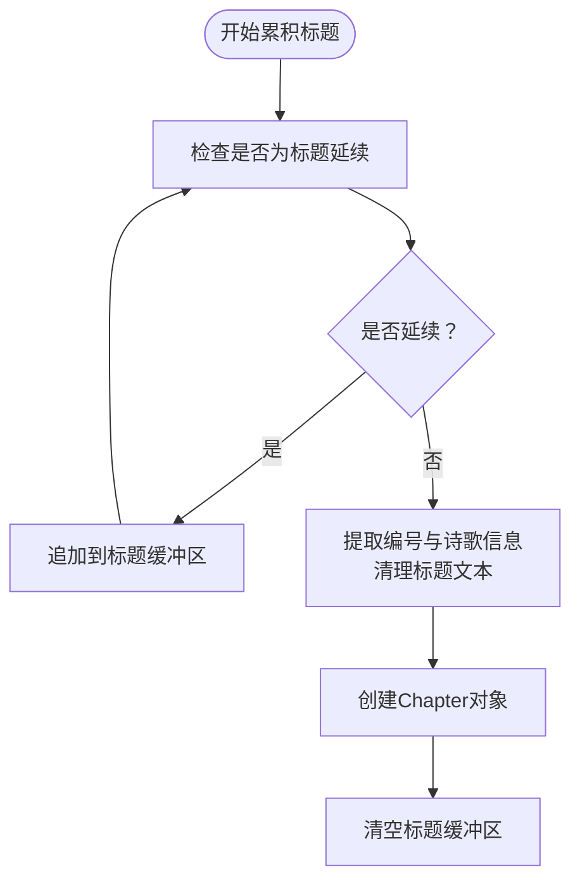
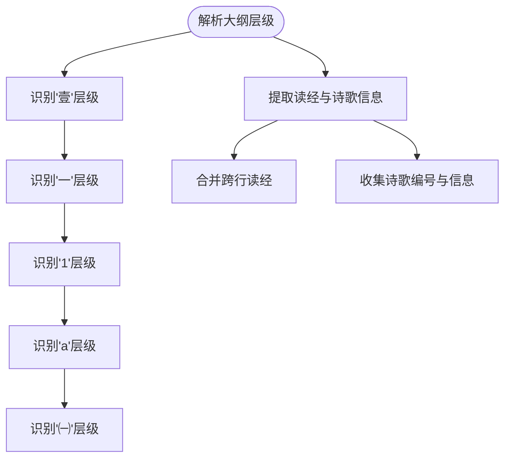
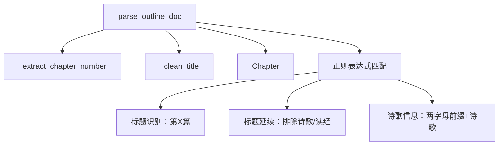

# 篇章标题处理

<cite>
**本文档引用的文件**
- [src/parser_improved.py](file://src/parser_improved.py)
- [src/models.py](file://src/models.py)
</cite>

## 目录
1. [简介](#简介)
2. [项目结构](#项目结构)
3. [核心组件](#核心组件)
4. [架构概览](#架构概览)
5. [详细组件分析](#详细组件分析)
6. [依赖分析](#依赖分析)
7. [性能考虑](#性能考虑)
8. [故障排除指南](#故障排除指南)
9. [结论](#结论)

## 简介
本文件针对篇章标题处理功能进行深入技术文档编写，重点围绕 parse_outline_doc 函数中的章节标题解析算法展开。内容涵盖章节编号提取、标题清理、诗歌信息提取等核心功能，并详细说明章节标题识别模式（'第X篇'格式）、多行标题累积机制、标题缓冲区管理等。同时提供正则表达式匹配、标题格式验证、异常处理等实现细节，帮助读者全面理解该模块的设计思路与实现方式。

## 项目结构
与篇章标题处理相关的核心代码位于 src/parser_improved.py 文件中，数据模型定义位于 src/models.py。parse_outline_doc 是该模块的主要入口函数，负责解析经文文档中的章节标题、大纲层级、读经与诗歌信息等内容。

**图表来源**
- [src/parser_improved.py:367-782](file://src/parser_improved.py#L367-L782)
- [src/models.py:40-55](file://src/models.py#L40-L55)

**章节来源**
- [src/parser_improved.py:367-782](file://src/parser_improved.py#L367-L782)
- [src/models.py:40-55](file://src/models.py#L40-L55)

## 核心组件
- parse_outline_doc：解析经文文档，提取章节标题、大纲层级、读经与诗歌信息，生成章节对象列表。
- _extract_chapter_number：从标题中提取章节编号（支持中文与阿拉伯数字）。
- _clean_title：清理标题，去除层级标记与多余内容。
- Chapter：数据模型，包含章节编号、标题、诗歌编号、读经引用、大纲结构等字段。

**章节来源**
- [src/parser_improved.py:367-782](file://src/parser_improved.py#L367-L782)
- [src/parser_improved.py:958-975](file://src/parser_improved.py#L958-L975)
- [src/parser_improved.py:2160-2168](file://src/parser_improved.py#L2160-L2168)
- [src/models.py:40-55](file://src/models.py#L40-L55)

## 架构概览
parse_outline_doc 的整体流程如下：
- 文档加载与初始化：加载 Word 文档，重置状态，初始化章节标题缓冲区与大纲节点指针。
- 标语提取：在文档开头提取标语内容，避免将其误判为章节标题。
- 标题识别与累积：检测'第X篇'格式，进入标题累积阶段，直到遇到非延续内容为止。
- 章节创建：从累积的标题中提取编号与诗歌信息，清理标题文本，创建 Chapter 对象。
- 大纲层级解析：根据层级标记（壹、一、1、a、㈠等）建立大纲树结构。
- 读经与诗歌信息处理：提取每篇的第一个读经，合并跨行读经；收集诗歌编号与信息。
- 职事信息摘录：识别并收集'职事信息摘录：'段落，过滤无效内容后保存。
- 后处理：补全空经文节与章节读经经文，清理标语列表。

**图表来源**
- [src/parser_improved.py:367-782](file://src/parser_improved.py#L367-L782)

**章节来源**
- [src/parser_improved.py:367-782](file://src/parser_improved.py#L367-L782)

## 详细组件分析

### parse_outline_doc 函数详解
- 功能概述：解析经文文档，提取章节标题、大纲层级、读经与诗歌信息，生成章节对象列表。
- 关键步骤：
  - 文档加载与初始化：加载 Word 文档，重置状态，初始化章节标题缓冲区与大纲节点指针。
  - 标语提取：在文档开头提取标语内容，避免将其误判为章节标题。
  - 标题识别与累积：检测'第X篇'格式，进入标题累积阶段，直到遇到非延续内容为止。
  - 章节创建：从累积的标题中提取编号与诗歌信息，清理标题文本，创建 Chapter 对象。
  - 大纲层级解析：根据层级标记（壹、一、1、a、㈠等）建立大纲树结构。
  - 读经与诗歌信息处理：提取每篇的第一个读经，合并跨行读经；收集诗歌编号与信息。
  - 职事信息摘录：识别并收集'职事信息摘录：'段落，过滤无效内容后保存。
  - 后处理：补全空经文节与章节读经经文，清理标语列表。

**图表来源**
- [src/parser_improved.py:367-782](file://src/parser_improved.py#L367-L782)

**章节来源**
- [src/parser_improved.py:367-782](file://src/parser_improved.py#L367-L782)

### 章节编号提取算法
- 实现位置：_extract_chapter_number 函数。
- 功能：从标题中提取章节编号（支持中文与阿拉伯数字）。
- 算法要点：
  - 使用正则表达式匹配'第X篇'格式，提取编号字符串。
  - 若为阿拉伯数字，直接转换为整数。
  - 若为中文数字，使用映射表转换为整数（支持1-99）。
  - 默认返回1（兜底逻辑）。

**图表来源**
- [src/parser_improved.py:958-975](file://src/parser_improved.py#L958-L975)

**章节来源**
- [src/parser_improved.py:958-975](file://src/parser_improved.py#L958-L975)

### 标题清理算法
- 实现位置：_clean_title 函数。
- 功能：清理标题，去除层级标记（壹、一、1、a、㈠等）。
- 算法要点：
  - 使用正则表达式依次去除不同层级的标记。
  - 返回清理后的标题文本。

**图表来源**
- [src/parser_improved.py:2160-2168](file://src/parser_improved.py#L2160-L2168)

**章节来源**
- [src/parser_improved.py:2160-2168](file://src/parser_improved.py#L2160-L2168)

### 诗歌信息提取与多行标题累积
- 多行标题累积机制：
  - 当检测到'第X篇'标题时，进入标题累积阶段。
  - 通过正则表达式判断是否为标题延续（排除诗歌编号行、读经等）。
  - 若为延续，则将当前行拼接到标题缓冲区；否则结束累积，创建章节。
- 诗歌信息提取：
  - 使用正则表达式匹配两字母前缀（如EM、JL、MC等），支持多个前缀组合。
  - 提取'诗歌：'或'诗歌:'后的编号，形成统一格式的诗歌信息字符串。
- 标题缓冲区管理：
  - 初始化为空字符串，累积过程中不断追加文本。
  - 创建章节后清空缓冲区，准备下一个标题的累积。

**图表来源**
- [src/parser_improved.py:603-638](file://src/parser_improved.py#L603-L638)
- [src/parser_improved.py:618-623](file://src/parser_improved.py#L618-L623)
- [src/parser_improved.py:625-627](file://src/parser_improved.py#L625-L627)

**章节来源**
- [src/parser_improved.py:603-638](file://src/parser_improved.py#L603-L638)
- [src/parser_improved.py:618-623](file://src/parser_improved.py#L618-L623)
- [src/parser_improved.py:625-627](file://src/parser_improved.py#L625-L627)

### 大纲层级解析与读经、诗歌信息处理
- 大纲层级解析：
  - 识别不同层级的标记（壹、一、1、a、㈠），分别创建对应层级的 Content 节点。
  - 建立父子关系，维护当前节点指针，确保层级结构正确。
- 读经与诗歌信息处理：
  - 提取每篇的第一个读经，若读经跨行（以逗号结尾），自动合并下一行。
  - 收集诗歌编号与信息，支持多种两字母前缀组合。

**图表来源**
- [src/parser_improved.py:686-728](file://src/parser_improved.py#L686-L728)
- [src/parser_improved.py:647-663](file://src/parser_improved.py#L647-L663)

**章节来源**
- [src/parser_improved.py:686-728](file://src/parser_improved.py#L686-L728)
- [src/parser_improved.py:647-663](file://src/parser_improved.py#L647-L663)

### 职事信息摘录处理
- 职事信息摘录的开始识别：检测'职事信息摘录：'或以'职事信息摘录'开头的行。
- 收集与过滤：在收集过程中过滤无效内容，最终保存到当前章节的 ministry_excerpt 字段。
- 结束条件：遇到新的章节标题或其他内容时，保存当前收集结果并开始新的收集。

**章节来源**
- [src/parser_improved.py:665-684](file://src/parser_improved.py#L665-L684)
- [src/parser_improved.py:761-766](file://src/parser_improved.py#L761-L766)

## 依赖分析
- parse_outline_doc 依赖：
  - _extract_chapter_number：用于提取章节编号。
  - _clean_title：用于清理标题文本。
  - Chapter：用于封装章节信息。
- 正则表达式依赖：
  - 标题识别：'第X篇'格式匹配。
  - 标题延续判断：排除诗歌编号行、读经等特定模式。
  - 诗歌信息提取：两字母前缀与'诗歌：'或'诗歌:'的组合匹配。
- 数据模型依赖：
  - Chapter：包含 number、title、hymn_number、scripture、outline_sections 等字段。

**图表来源**
- [src/parser_improved.py:367-782](file://src/parser_improved.py#L367-L782)
- [src/parser_improved.py:958-975](file://src/parser_improved.py#L958-L975)
- [src/parser_improved.py:2160-2168](file://src/parser_improved.py#L2160-L2168)
- [src/models.py:40-55](file://src/models.py#L40-L55)

**章节来源**
- [src/parser_improved.py:367-782](file://src/parser_improved.py#L367-L782)
- [src/parser_improved.py:958-975](file://src/parser_improved.py#L958-L975)
- [src/parser_improved.py:2160-2168](file://src/parser_improved.py#L2160-L2168)
- [src/models.py:40-55](file://src/models.py#L40-L55)

## 性能考虑
- 正则表达式优化：在标题识别与清理过程中，尽量减少回溯与复杂匹配，提升处理速度。
- 缓冲区管理：合理使用标题缓冲区，避免不必要的字符串拼接与内存占用。
- 大纲层级解析：通过层级标记的顺序匹配，减少多次正则匹配的开销。
- 后处理：补全经文与清理标语的操作在最后执行，避免重复计算。

## 故障排除指南
- 标题未正确识别：
  - 检查'第X篇'格式是否规范，确保中文数字与阿拉伯数字均被支持。
  - 确认标题缓冲区是否正确累积，避免提前结束。
- 诗歌信息缺失：
  - 确认两字母前缀是否符合规范，检查'诗歌：'或'诗歌:'的格式。
  - 验证多个前缀组合的正则表达式是否正确匹配。
- 大纲层级错误：
  - 检查层级标记的识别逻辑，确保不同层级的标记被正确区分。
- 读经跨行未合并：
  - 确认读经行末尾是否以逗号结尾，检查跨行合并逻辑。

**章节来源**
- [src/parser_improved.py:603-638](file://src/parser_improved.py#L603-L638)
- [src/parser_improved.py:618-623](file://src/parser_improved.py#L618-L623)
- [src/parser_improved.py:647-663](file://src/parser_improved.py#L647-L663)
- [src/parser_improved.py:686-728](file://src/parser_improved.py#L686-L728)

## 结论
parse_outline_doc 函数通过严谨的状态机与正则表达式匹配，实现了对经文文档中章节标题的准确解析。其多行标题累积机制、诗歌信息提取与标题清理算法共同构成了完整的篇章标题处理体系。配合清晰的大纲层级解析与读经、诗歌信息处理，能够高效地生成结构化的章节数据，为后续的文档处理与展示提供可靠基础。