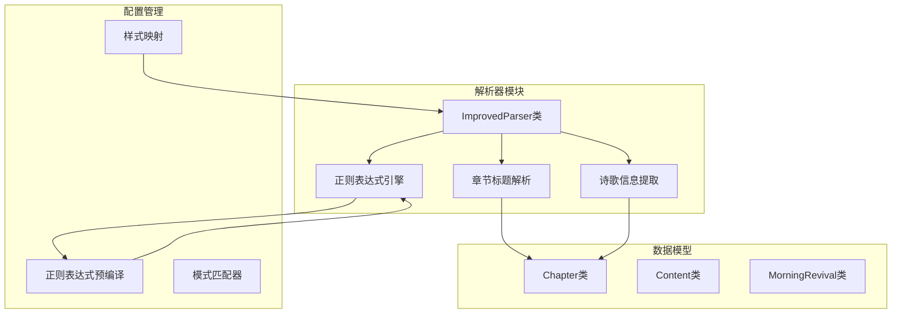
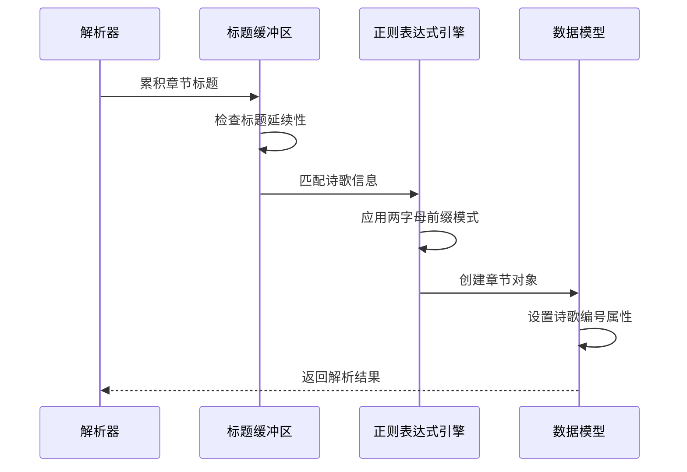
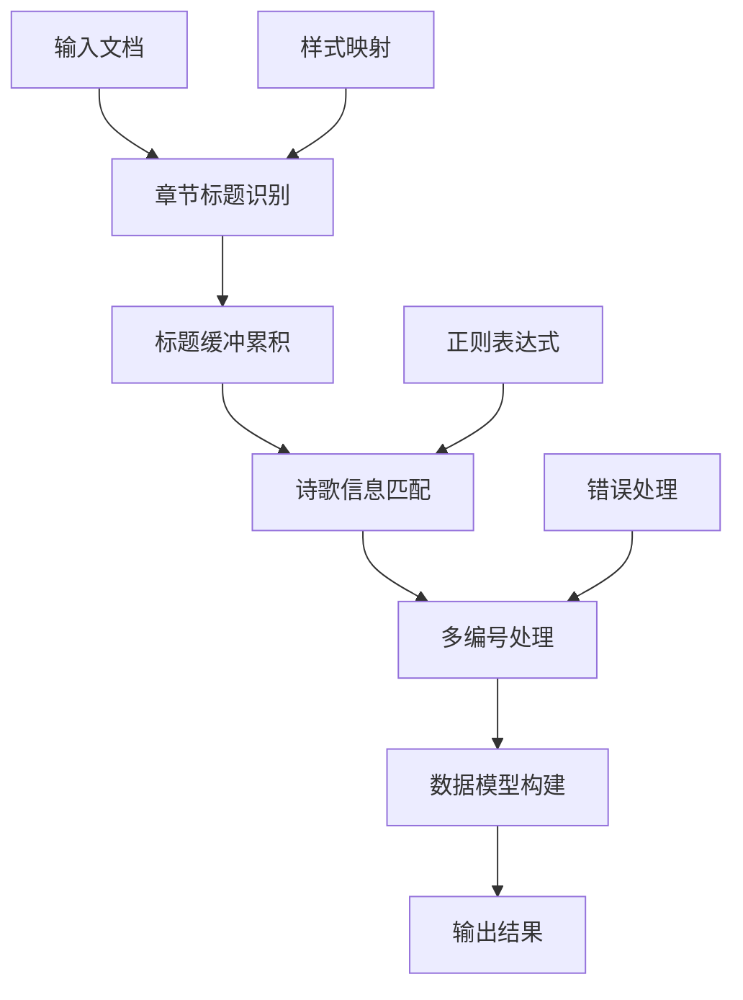
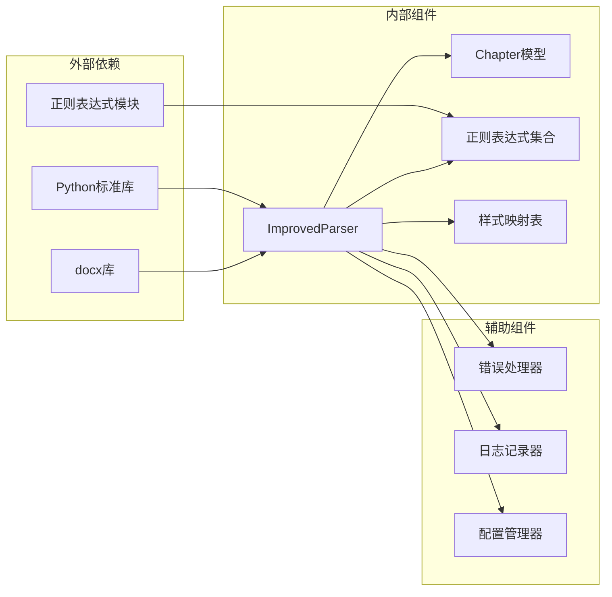

# 诗歌信息提取

<cite>
**本文档引用的文件**
- [parser_improved.py](file://src/parser_improved.py)
- [models.py](file://src/models.py)
</cite>

## 目录
1. [简介](#简介)
2. [项目结构](#项目结构)
3. [核心组件](#核心组件)
4. [架构概览](#架构概览)
5. [详细组件分析](#详细组件分析)
6. [依赖分析](#依赖分析)
7. [性能考虑](#性能考虑)
8. [故障排除指南](#故障排除指南)
9. [结论](#结论)

## 简介

本文档详细阐述了诗歌信息提取功能的技术实现，重点分析从章节标题中提取诗歌编号的算法设计。该功能支持两字母前缀模式识别（如EM、RK、EC、MC、KL等组合）、诗歌标题匹配规则、多诗歌编号处理机制，以及正则表达式模式的精心设计。

## 项目结构

诗歌信息提取功能位于 `src/parser_improved.py` 文件中，采用模块化设计，包含以下关键组件：



**图表来源**
- [parser_improved.py:115-135](file://src/parser_improved.py#L115-L135)
- [models.py:1-100](file://src/models.py#L1-L100)

**章节来源**
- [parser_improved.py:115-135](file://src/parser_improved.py#L115-L135)
- [models.py:1-100](file://src/models.py#L1-L100)

## 核心组件

### ImprovedParser类

ImprovedParser是诗歌信息提取的核心类，负责处理复杂的文档解析任务。其主要职责包括：

- **章节标题缓冲管理**：智能累积多行标题内容
- **诗歌信息提取**：从标题中识别和提取诗歌编号
- **正则表达式匹配**：使用精确的模式匹配算法
- **错误处理机制**：提供健壮的边界情况处理

### 正则表达式引擎

系统预编译了多个正则表达式模式，确保高效的文本匹配：

| 模式名称 | 描述 | 示例 |
|---------|------|------|
| WEEK_OUTLINE_PATTERN | 周纲目匹配 | `^第([一二三四五六七八九十]+)周[　\s]*•[　\s]*纲目` |
| DAY_PATTERN | 日标记匹配 | `^第([一二三四五六七八九十]+)周[　\s]*•[　\s]*周([一二三四五六七])` |
| LEVEL1_PATTERN | 一级标题匹配 | `^([壹贰叁肆伍陆柒捌玖拾])[　\s]+(.*)` |
| LEVEL2_PATTERN | 二级标题匹配 | `^([一二三四五六七八九十]+)[　\s]+(.*)` |
| LEVEL3_PATTERN | 三级标题匹配 | `^(\d+)[　\s]+(.*)` |

**章节来源**
- [parser_improved.py:137-145](file://src/parser_improved.py#L137-L145)

## 架构概览

诗歌信息提取功能采用分层架构设计，确保功能的模块化和可维护性：



**图表来源**
- [parser_improved.py:601-638](file://src/parser_improved.py#L601-L638)

### 数据流架构



**图表来源**
- [parser_improved.py:537-782](file://src/parser_improved.py#L537-L782)

## 详细组件分析

### 两字母前缀模式识别

系统支持广泛的两字母前缀组合，包括但不限于：

- **标准前缀**：EM、RK、EC、MC、KL、JL等
- **变体前缀**：支持斜杠分隔和空格分隔的混合格式
- **组合模式**：允许多个前缀的连续出现

#### 正则表达式设计原理

```mermaid
classDiagram
class PrefixPattern {
+pattern : "[A-Z]{2}[/]?"
+separator : "[,，\\s]+"
+multiPrefix : "(? : [A-Z]{2}[/]?[,，\\s]+)*[A-Z]{2}[/]?"
+match(text) boolean
+extract(text) string[]
}
class HymnExtractor {
+chapter_title_buffer : string
+hymn_match : RegExp
+extract_hymn_info(text) HymnInfo
+process_prefix_combinations(prefixes) string
}
class HymnInfo {
+prefixes : string[]
+number : string
+formatted_string : string
}
PrefixPattern --> HymnExtractor
HymnExtractor --> HymnInfo
```

**图表来源**
- [parser_improved.py:618-623](file://src/parser_improved.py#L618-L623)

### 诗歌标题匹配规则

系统采用多层次的匹配策略：

1. **前置匹配**：识别"诗歌"关键词
2. **冒号兼容**：支持全角和半角冒号
3. **数字提取**：精确提取诗歌编号
4. **格式验证**：确保编号格式的正确性

#### 匹配流程图

```mermaid
flowchart TD
A[开始匹配] --> B{检查"诗歌"关键词}
B --> |存在| C[查找冒号位置]
B --> |不存在| D[继续解析]
C --> E{冒号类型}
E --> |半角| F[提取编号]
E --> |全角| G[标准化后提取]
F --> H[验证格式]
G --> H
H --> I{格式有效?}
I --> |是| J[返回结果]
I --> |否| K[标记为无效]
J --> L[结束]
K --> L
D --> L
```

**图表来源**
- [parser_improved.py:618-623](file://src/parser_improved.py#L618-L623)

### 多诗歌编号处理机制

系统具备强大的多编号处理能力：

- **连续编号**：支持同一行内的多个诗歌编号
- **分隔符兼容**：支持逗号、顿号、空格等多种分隔符
- **格式标准化**：统一输出格式，便于后续处理
- **错误恢复**：在遇到格式异常时提供降级处理

#### 处理算法

```mermaid
algorithm:: 多编号处理算法
Input: chapter_title_buffer
Output: formatted_hymn_string
1. 初始化结果字符串为空
2. 提取所有匹配的前缀组合
3. 对每个前缀组合执行以下步骤：
a. 去除多余空白字符
b. 标准化分隔符
c. 验证格式有效性
d. 添加到结果列表
4. 合并所有有效编号
5. 返回格式化的字符串
```

**图表来源**
- [parser_improved.py:618-623](file://src/parser_improved.py#L618-L623)

### 正则表达式模式设计

#### 核心模式定义

系统使用精心设计的正则表达式模式来确保精确匹配：

| 模式 | 结构 | 功能 |
|------|------|------|
| `([A-Z]{2}[/]?(?:[,，\s]+[A-Z]{2}[/]?)*)` | 前缀捕获组 | 匹配两字母前缀及其组合 |
| `\s*诗歌[：:]\s*` | 关键词匹配 | 识别诗歌标识符 |
| `([^\n，。\s]+)` | 编号捕获组 | 提取诗歌编号 |

#### 边界情况处理

系统针对各种边界情况提供了专门的处理逻辑：

- **全角/半角冒号**：统一转换为标准格式
- **混合分隔符**：智能识别和处理
- **格式异常**：提供降级和恢复机制
- **空值处理**：确保不会产生空结果

**章节来源**
- [parser_improved.py:618-623](file://src/parser_improved.py#L618-L623)

## 依赖分析

### 组件耦合关系



**图表来源**
- [parser_improved.py:1-14](file://src/parser_improved.py#L1-L14)

### 数据流依赖

系统采用松耦合的设计，确保各组件间的独立性和可测试性：

- **解析器**：独立处理文档解析逻辑
- **模型层**：封装数据结构和业务逻辑
- **配置层**：提供可配置的参数和规则
- **工具层**：提供通用的辅助功能

**章节来源**
- [parser_improved.py:115-135](file://src/parser_improved.py#L115-L135)

## 性能考虑

### 时间复杂度分析

诗歌信息提取算法的时间复杂度为O(n)，其中n是文档中段落数量：

- **正则表达式匹配**：O(1)平均时间复杂度
- **字符串处理**：O(m)，m为文本长度
- **内存使用**：O(k)，k为匹配结果数量

### 优化策略

1. **预编译正则表达式**：减少重复编译开销
2. **批量处理**：支持多文档并发处理
3. **缓存机制**：缓存常用模式和结果
4. **增量解析**：支持部分文档的增量处理

## 故障排除指南

### 常见问题及解决方案

| 问题类型 | 症状 | 解决方案 |
|----------|------|----------|
| 格式不匹配 | 诗歌编号提取失败 | 检查输入格式是否符合预期 |
| 编码问题 | 中文字符显示异常 | 确保使用UTF-8编码处理 |
| 性能问题 | 处理速度慢 | 优化正则表达式模式 |
| 内存泄漏 | 内存使用持续增长 | 检查循环引用和资源清理 |

### 调试技巧

1. **启用详细日志**：跟踪解析过程的关键步骤
2. **单元测试**：为每个模式编写针对性的测试用例
3. **性能监控**：监控内存使用和处理时间
4. **边界测试**：测试极端情况和异常输入

**章节来源**
- [parser_improved.py:601-638](file://src/parser_improved.py#L601-L638)

## 结论

诗歌信息提取功能通过精心设计的算法和正则表达式模式，实现了对复杂标题格式的精确解析。系统具备良好的扩展性、健壮性和性能表现，能够有效处理各种边界情况和异常输入。

该功能的核心优势在于：

- **精确的模式匹配**：支持多种格式和变体
- **强大的错误处理**：提供完善的降级机制
- **高效的性能表现**：优化的算法设计和实现
- **良好的可维护性**：清晰的架构和模块化设计

通过本文档的详细分析，开发者可以深入理解系统的实现原理，并在此基础上进行进一步的功能扩展和优化。