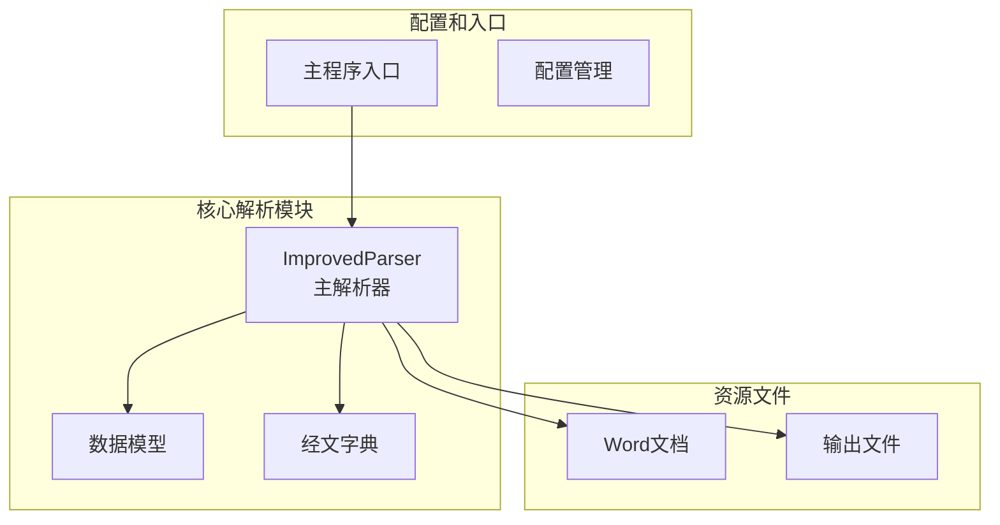
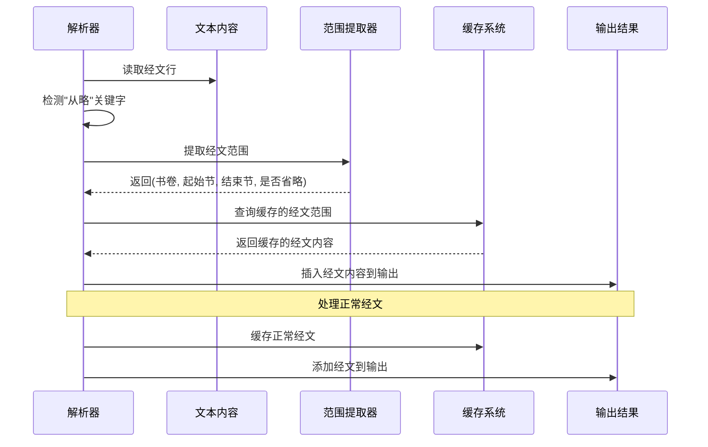
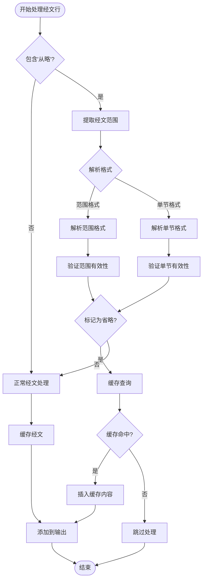
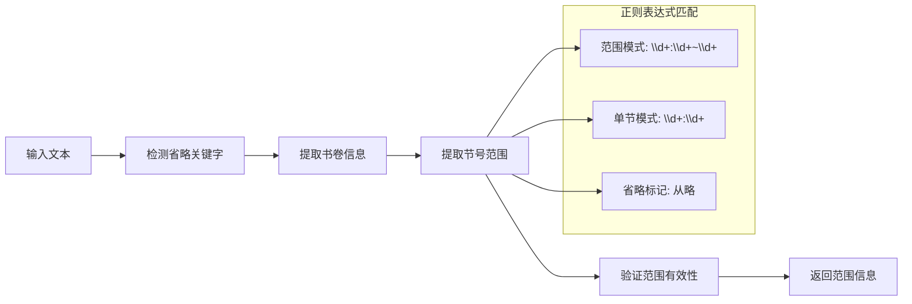
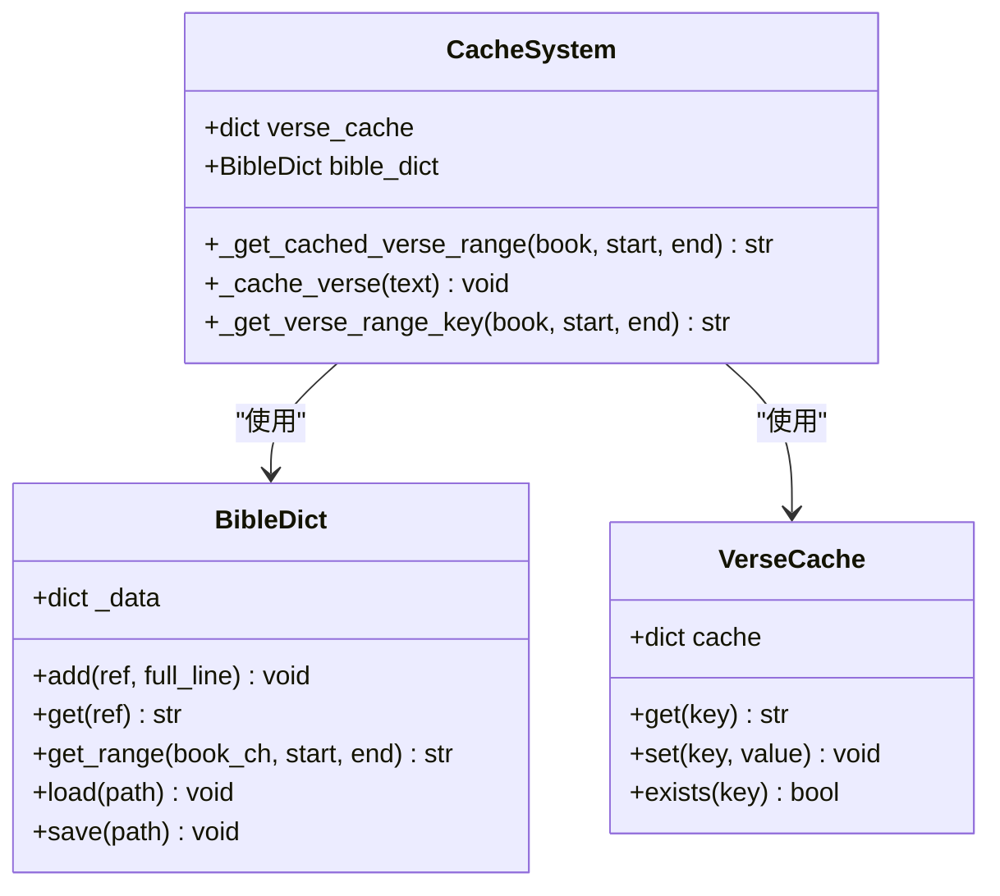
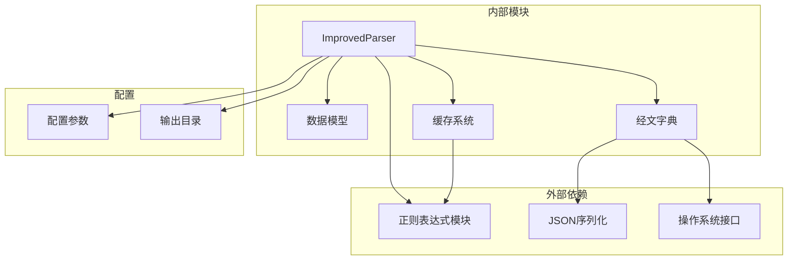
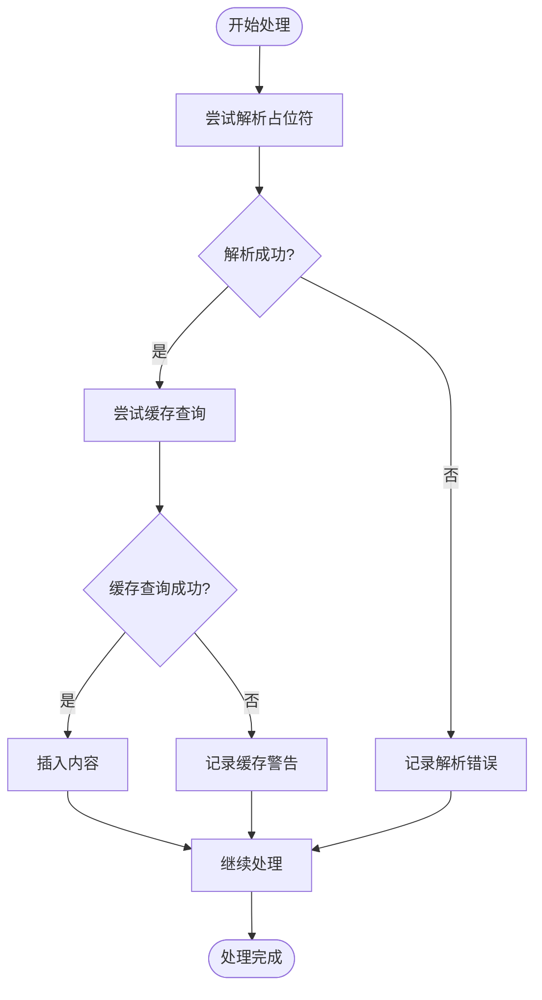

# 从略占位符处理

<cite>
**本文档引用的文件**
- [src/parser_improved.py](file://src/parser_improved.py)
- [src/bible_dict.py](file://src/bible_dict.py)
- [src/models.py](file://src/models.py)
- [main.py](file://main.py)
</cite>

## 目录
1. [简介](#简介)
2. [项目结构](#项目结构)
3. [核心组件](#核心组件)
4. [架构概览](#架构概览)
5. [详细组件分析](#详细组件分析)
6. [依赖分析](#依赖分析)
7. [性能考虑](#性能考虑)
8. [故障排除指南](#故障排除指南)
9. [结论](#结论)

## 简介

从略占位符处理是本项目中一个重要的文本解析功能，主要用于处理圣经经文中的"从略"占位符。当解析器遇到包含"从略"关键字的经文行时，它会自动识别经文范围并从缓存中检索相应的经文内容，然后将其插入到最终的输出中。

这个功能的核心价值在于：
- **提高解析效率**：避免重复输入相同的经文内容
- **保持一致性**：确保相同经文在不同章节中的显示一致
- **简化维护**：减少手动维护重复经文的工作量
- **增强用户体验**：提供更流畅的阅读体验

## 项目结构

该项目采用模块化的Python架构，主要包含以下关键组件：



**图表来源**
- [src/parser_improved.py:115-284](file://src/parser_improved.py#L115-L284)
- [src/models.py:9-232](file://src/models.py#L9-L232)
- [src/bible_dict.py:19-96](file://src/bible_dict.py#L19-L96)

**章节来源**
- [src/parser_improved.py:115-284](file://src/parser_improved.py#L115-L284)
- [src/models.py:9-232](file://src/models.py#L9-L232)
- [src/bible_dict.py:19-96](file://src/bible_dict.py#L19-L96)

## 核心组件

从略占位符处理功能涉及以下核心组件：

### 主解析器 (ImprovedParser)
- **职责**：处理Word文档解析，识别和处理"从略"占位符
- **关键方法**：
  - `_extract_verse_range()`: 提取经文范围信息
  - `_get_cached_verse_range()`: 从缓存获取经文范围
  - `_cache_verse()`: 缓存经文内容

### 经文字典 (BibleDict)
- **职责**：持久化存储经文内容，提供快速查询
- **特点**：支持增量加载和保存，避免重复覆盖

### 数据模型 (Models)
- **职责**：定义章节、内容等数据结构
- **关键字段**：
  - `scripture_verses`: 经文内容
  - `outline_sections`: 纲目结构
  - `detail_sections`: 详细内容

**章节来源**
- [src/parser_improved.py:309-366](file://src/parser_improved.py#L309-L366)
- [src/bible_dict.py:19-96](file://src/bible_dict.py#L19-L96)
- [src/models.py:40-100](file://src/models.py#L40-L100)

## 架构概览

从略占位符处理的整体架构如下：



**图表来源**
- [src/parser_improved.py:546-760](file://src/parser_improved.py#L546-L760)
- [src/parser_improved.py:309-366](file://src/parser_improved.py#L309-L366)

## 详细组件分析

### 占位符检测机制

占位符检测是整个处理流程的第一步，主要通过以下方式实现：



**图表来源**
- [src/parser_improved.py:546-760](file://src/parser_improved.py#L546-L760)
- [src/parser_improved.py:309-332](file://src/parser_improved.py#L309-L332)

### 范围提取算法

范围提取是核心功能之一，负责从文本中识别和解析经文范围：

#### 支持的格式类型

1. **范围格式**：`腓2:5~11 从略。`
   - 语法：`书卷:起始节~结束节 省略符号`
   - 示例：`太5:3~16 从略。`

2. **单节格式**：`腓2:5`
   - 语法：`书卷:节号`
   - 示例：`约11:35`

3. **省略标记**：`从略`、`省略`、`略`

#### 解析流程



**图表来源**
- [src/parser_improved.py:309-332](file://src/parser_improved.py#L309-L332)

**章节来源**
- [src/parser_improved.py:309-332](file://src/parser_improved.py#L309-L332)

### 缓存查询机制

缓存查询机制提供了高效的经文内容检索能力：



**图表来源**
- [src/parser_improved.py:338-366](file://src/parser_improved.py#L338-L366)
- [src/bible_dict.py:19-96](file://src/bible_dict.py#L19-L96)

#### 缓存层次结构

缓存系统采用双层结构设计：

1. **内存缓存** (`verse_cache`)
   - 优点：访问速度快
   - 适用：当前解析过程中的经文
   - 生命周期：仅在单次解析过程中有效

2. **持久化缓存** (`BibleDict`)
   - 优点：持久存储，跨解析过程可用
   - 适用：历史经文和跨章节引用
   - 生命周期：整个应用运行期间

**章节来源**
- [src/parser_improved.py:338-366](file://src/parser_improved.py#L338-L366)
- [src/bible_dict.py:19-96](file://src/bible_dict.py#L19-L96)

### 触发条件和控制流程

从略占位符处理的触发条件和控制流程如下：

```mermaid
stateDiagram-v2
[*] --> Idle
Idle --> DetectText : 读取经文行
DetectText --> CheckKeyword{"包含'从略'?"}
CheckKeyword --> |否| ProcessNormal : 正常经文处理
CheckKeyword --> |是| ExtractRange : 提取范围信息
ExtractRange --> ValidateRange : 验证范围有效性
ValidateRange --> CheckCache : 检查缓存
CheckCache --> CacheHit : 缓存命中
CheckCache --> CacheMiss : 缓存未命中
CacheHit --> InsertContent : 插入缓存内容
CacheMiss --> SkipProcessing : 跳过处理
ProcessNormal --> CacheVerse : 缓存经文
CacheVerse --> AddToOutput : 添加到输出
InsertContent --> AddToOutput
SkipProcessing --> Idle : 返回空闲状态
AddToOutput --> Idle : 处理完成
```

**图表来源**
- [src/parser_improved.py:546-760](file://src/parser_improved.py#L546-L760)

**章节来源**
- [src/parser_improved.py:546-760](file://src/parser_improved.py#L546-L760)

## 依赖分析

从略占位符处理功能的依赖关系如下：



**图表来源**
- [src/parser_improved.py:1-14](file://src/parser_improved.py#L1-L14)
- [src/bible_dict.py:8-16](file://src/bible_dict.py#L8-L16)

### 关键依赖关系

1. **正则表达式依赖**
   - 用于精确匹配经文格式
   - 支持多种经文书写变体

2. **数据模型依赖**
   - `Chapter` 类的 `scripture_verses` 字段
   - `Content` 类的层次结构

3. **缓存系统依赖**
   - 内存缓存和持久化缓存的协调工作
   - 跨章节引用的支持

**章节来源**
- [src/parser_improved.py:1-14](file://src/parser_improved.py#L1-L14)
- [src/bible_dict.py:8-16](file://src/bible_dict.py#L8-L16)

## 性能考虑

从略占位符处理功能在设计时充分考虑了性能优化：

### 时间复杂度分析

1. **占位符检测**：O(n)，其中n为文本长度
2. **范围提取**：O(1)，使用预编译的正则表达式
3. **缓存查询**：O(1)，字典查找
4. **范围遍历**：O(m)，其中m为范围内的节数量

### 空间复杂度优化

1. **内存缓存**：仅存储当前解析过程需要的经文
2. **持久化缓存**：按需加载，避免一次性加载全部数据
3. **正则表达式预编译**：减少重复编译开销

### 性能优化策略

1. **早期退出**：当检测到非经文行时立即跳过
2. **缓存优先**：优先查询内存缓存，再查询持久化缓存
3. **批量处理**：对连续的经文范围进行批量查询

## 故障排除指南

### 常见问题和解决方案

#### 1. 占位符未被识别

**症状**：包含"从略"的经文行未被正确处理

**可能原因**：
- 文本格式不符合预期
- 缺少必要的空白字符
- 书卷名称不匹配

**解决方法**：
- 检查经文格式是否为标准格式
- 确认"从略"关键字前后有适当的空白
- 验证书卷名称的正确性

#### 2. 缓存查询失败

**症状**：从略占位符无法显示对应经文

**可能原因**：
- 经文不在缓存中
- 书卷或节号不匹配
- 缓存数据损坏

**解决方法**：
- 确保相关经文已被正常解析并缓存
- 检查书卷缩写是否正确
- 重新生成缓存数据

#### 3. 范围解析错误

**症状**：经文范围提取不正确

**可能原因**：
- 正则表达式匹配失败
- 节号超出范围
- 格式不规范

**解决方法**：
- 检查输入格式是否符合要求
- 验证节号的有效性
- 使用标准的经文格式

### 错误处理机制



**图表来源**
- [src/parser_improved.py:546-760](file://src/parser_improved.py#L546-L760)

**章节来源**
- [src/parser_improved.py:546-760](file://src/parser_improved.py#L546-L760)

## 结论

从略占位符处理功能是本项目中一个精心设计的文本处理机制，它通过智能的占位符识别、精确的范围提取和高效的缓存查询，实现了对圣经经文的智能化处理。

### 主要优势

1. **智能化识别**：能够准确识别各种格式的"从略"占位符
2. **高效缓存**：双层缓存系统确保快速响应
3. **灵活处理**：支持多种经文格式和变体
4. **错误容错**：完善的错误处理和恢复机制

### 技术亮点

1. **正则表达式优化**：预编译的正则表达式确保高性能匹配
2. **层次化缓存**：内存缓存和持久化缓存的有机结合
3. **模块化设计**：清晰的组件分离和职责划分
4. **扩展性考虑**：为未来功能扩展预留接口

### 应用价值

该功能不仅提高了文本解析的效率，更重要的是为用户提供了更加一致和完整的经文阅读体验。通过自动化的占位符处理，减少了人工干预的需求，降低了错误率，提升了整体的用户体验质量。