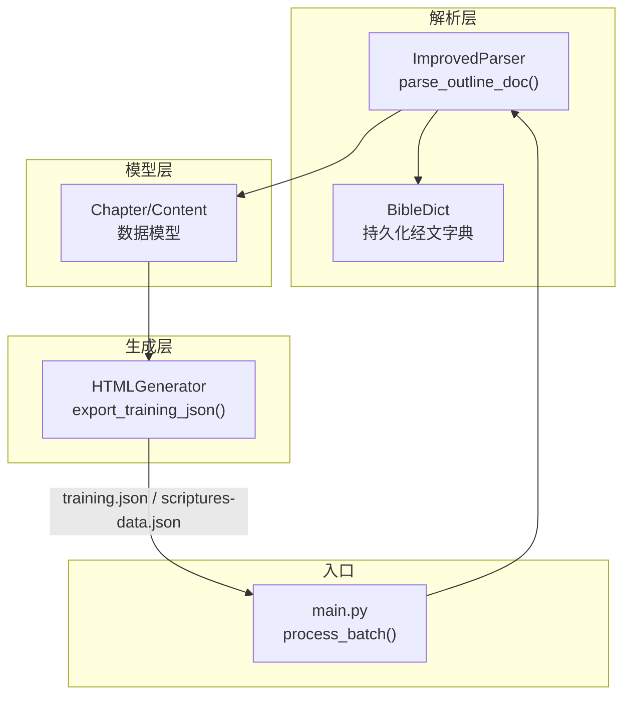
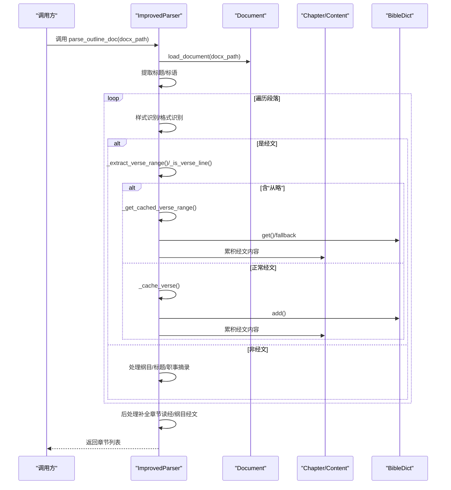
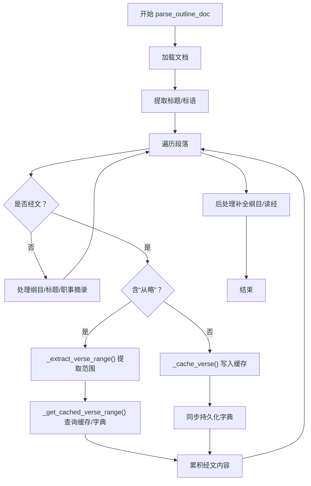
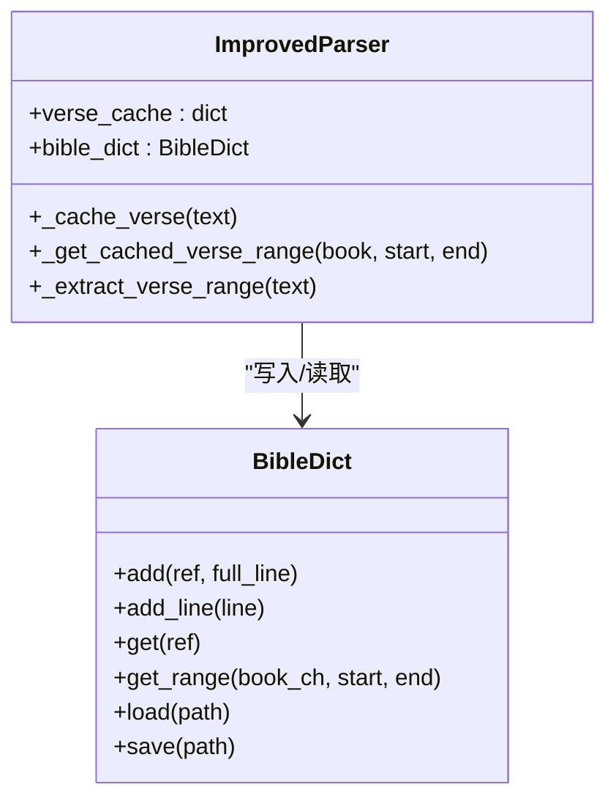
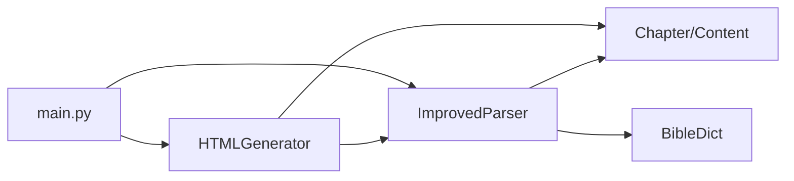

# 经文内容处理

<cite>
**本文引用的文件**
- [src/parser_improved.py](file://src/parser_improved.py)
- [src/models.py](file://src/models.py)
- [src/bible_dict.py](file://src/bible_dict.py)
- [src/generator.py](file://src/generator.py)
- [main.py](file://main.py)
</cite>

## 目录
1. [简介](#简介)
2. [项目结构](#项目结构)
3. [核心组件](#核心组件)
4. [架构概览](#架构概览)
5. [详细组件分析](#详细组件分析)
6. [依赖分析](#依赖分析)
7. [性能考虑](#性能考虑)
8. [故障排查指南](#故障排查指南)
9. [结论](#结论)

## 简介
本技术文档聚焦于“经文内容处理”功能，围绕 parse_outline_doc 函数展开，深入解析其在经文样式识别、经文格式验证、缓存机制、范围提取、占位符处理、持久化字典同步等方面的实现细节。文档还提供缓存策略、性能优化建议与错误处理实践，帮助读者在理解算法的同时，掌握工程化的落地要点。

## 项目结构
本项目采用“Python 解析器 + 模型 + 生成器”的分层设计：
- 解析层：负责从 Word 文档中抽取经文、纲目、职事信息摘录等结构化内容
- 模型层：定义章节、纲目树、晨兴等数据结构
- 生成层：将解析结果导出为前端可用的 JSON，并生成前端所需的脚本与索引
- 主程序：协调流程，驱动解析与生成

图表来源
- [src/parser_improved.py:367-782](file://src/parser_improved.py#L367-L782)
- [src/models.py:40-232](file://src/models.py#L40-L232)
- [src/bible_dict.py:19-96](file://src/bible_dict.py#L19-L96)
- [src/generator.py:383-425](file://src/generator.py#L383-L425)
- [main.py:410-536](file://main.py#L410-L536)

章节来源
- [src/parser_improved.py:367-782](file://src/parser_improved.py#L367-L782)
- [src/models.py:40-232](file://src/models.py#L40-L232)
- [src/bible_dict.py:19-96](file://src/bible_dict.py#L19-L96)
- [src/generator.py:383-425](file://src/generator.py#L383-L425)
- [main.py:410-536](file://main.py#L410-L536)

## 核心组件
- ImprovedParser：负责解析经文文档，识别样式与格式、处理“从略”占位符、维护经文缓存与持久化字典、补全章节读经与纲目经文
- Chapter/Content：承载章节、纲目树、经文与内容的结构化数据
- BibleDict：持久化经文字典，提供增量加载与范围读取能力
- HTMLGenerator：将训练数据导出为前端可用的 JSON，并生成 scriptures-data.json
- main.py：调度解析与生成流程，处理 Word 文档与 TXT 文本两种输入路径

章节来源
- [src/parser_improved.py:115-284](file://src/parser_improved.py#L115-L284)
- [src/models.py:9-232](file://src/models.py#L9-L232)
- [src/bible_dict.py:19-96](file://src/bible_dict.py#L19-L96)
- [src/generator.py:22-135](file://src/generator.py#L22-L135)
- [main.py:410-536](file://main.py#L410-L536)

## 架构概览
parse_outline_doc 的执行流程如下：
- 文档加载与标题/标语提取
- 纲目层级识别与节点构建
- 经文样式识别与内容累积
- “从略”占位符处理与范围缓存回填
- 持久化字典同步与后处理补全

图表来源
- [src/parser_improved.py:367-782](file://src/parser_improved.py#L367-L782)
- [src/bible_dict.py:33-60](file://src/bible_dict.py#L33-L60)

## 详细组件分析

### 组件A：ImprovedParser（parse_outline_doc）
- 功能职责
  - 解析经文文档，抽取章节标题、诗歌编号、读经引用、纲目层级、职事信息摘录
  - 识别经文样式（样式名 vs 内容格式）并累积经文内容
  - 处理“从略”占位符，按范围从缓存或持久化字典回填经文
  - 维护内存缓存与持久化字典，保证重复范围高效复用
  - 后处理阶段补全空缺的纲目经文与章节读经经文

- 关键算法与数据结构
  - 经文样式识别
    - 样式名识别：para.style.name == 'verses' 或 '０c 經節'
    - 内容格式识别：_is_verse_line(text) 使用预编译正则匹配“书卷+章节”格式
  - 经文范围提取：_extract_verse_range(text) 支持“腓2:5~11 从略”“腓2:5”等格式
  - 经文范围缓存：_get_cached_verse_range(book, start, end) 逐节查询缓存与持久化字典
  - 内存缓存：self.verse_cache 以“经文引用键”为字典，键为“书卷:节”，值为完整行
  - 持久化字典：BibleDict.add()/get()/get_range()，支持增量加载与范围读取

- 处理流程（简化）
  - 文档加载与标题/标语提取
  - 遍历段落，识别经文（样式或格式），处理“从略”占位符
  - 正常经文写入内存缓存并同步持久化字典
  - 纲目层级识别与节点构建
  - 后处理：补全空缺纲目经文与章节读经经文

图表来源
- [src/parser_improved.py:367-782](file://src/parser_improved.py#L367-L782)
- [src/parser_improved.py:309-366](file://src/parser_improved.py#L309-L366)
- [src/bible_dict.py:33-60](file://src/bible_dict.py#L33-L60)

章节来源
- [src/parser_improved.py:115-284](file://src/parser_improved.py#L115-L284)
- [src/parser_improved.py:309-366](file://src/parser_improved.py#L309-L366)
- [src/parser_improved.py:367-782](file://src/parser_improved.py#L367-L782)

### 组件B：经文样式识别与格式验证
- 样式识别
  - 通过段落样式名识别经文段落，支持'verses'与'０c 經節'
- 内容格式识别
  - 使用预编译正则 VERSE_PATTERN 匹配“书卷+章节”格式，支持中文数字与阿拉伯数字混合
- 格式验证
  - _is_verse_line(text) 返回布尔值，确保仅在符合经文格式时才进行缓存与累积

章节来源
- [src/parser_improved.py:137-146](file://src/parser_improved.py#L137-L146)
- [src/parser_improved.py:300-308](file://src/parser_improved.py#L300-L308)

### 组件C：“从略”占位符处理
- 范围提取
  - _extract_verse_range(text) 解析“腓2:5~11 从略”“腓2:5”等文本，返回(书卷, 起始节, 结束节, 是否省略)
- 范围回填
  - _get_cached_verse_range(book, start, end) 逐节查询内存缓存与持久化字典，拼接为多行文本
- 内容累积
  - 将回填的经文追加到当前节点或章节的 scripture/scripture_verses 字段

章节来源
- [src/parser_improved.py:309-366](file://src/parser_improved.py#L309-L366)
- [src/parser_improved.py:548-568](file://src/parser_improved.py#L548-L568)
- [src/parser_improved.py:738-760](file://src/parser_improved.py#L738-L760)

### 组件D：经文范围缓存与持久化字典同步
- 内存缓存
  - _cache_verse(text) 将单节经文写入 self.verse_cache，并同步持久化字典
- 范围缓存
  - _get_cached_verse_range(book, start, end) 逐节查询，支持缓存未命中时从持久化字典回填
- 持久化字典
  - BibleDict.add()/add_line() 写入；get()/get_range() 读取；load()/save() 持久化

图表来源
- [src/parser_improved.py:338-366](file://src/parser_improved.py#L338-L366)
- [src/bible_dict.py:33-60](file://src/bible_dict.py#L33-L60)

章节来源
- [src/parser_improved.py:338-366](file://src/parser_improved.py#L338-L366)
- [src/bible_dict.py:33-60](file://src/bible_dict.py#L33-L60)

### 组件E：后处理与补全
- 补全空缺纲目经文
  - _fill_empty_section_scriptures(sections, default_book) 递归遍历纲目树，为缺失的经文字段补全默认书卷
- 补全章节读经经文
  - _supplement_chapter_scripture_verses(chapter) 基于章节 scripture 推断默认书卷，补全 scripture_verses

章节来源
- [src/parser_improved.py:771-776](file://src/parser_improved.py#L771-L776)

### 组件F：数据模型与导出
- 数据模型
  - Chapter/Content/TrainingData 定义章节、纲目树与训练集合的数据结构
- 导出
  - export_training_json(training_data, output_dir) 生成 training.json
  - HTMLGenerator._generate_scriptures_data_json(training_data) 生成 scriptures-data.json（补充经文）

章节来源
- [src/models.py:40-232](file://src/models.py#L40-L232)
- [src/generator.py:383-425](file://src/generator.py#L383-L425)

## 依赖分析
- 解析器依赖
  - 模型：Chapter/Content
  - 持久化字典：BibleDict
- 生成器依赖
  - 模型：TrainingData/Chapter
  - 解析器：用于后处理与经文引用计算
- 主程序依赖
  - 解析器：parse_training_docs_improved
  - 生成器：export_training_json/generate_search_index_from_json

图表来源
- [src/parser_improved.py:115-284](file://src/parser_improved.py#L115-L284)
- [src/models.py:40-232](file://src/models.py#L40-L232)
- [src/bible_dict.py:19-96](file://src/bible_dict.py#L19-L96)
- [src/generator.py:22-135](file://src/generator.py#L22-L135)
- [main.py:410-536](file://main.py#L410-L536)

章节来源
- [src/parser_improved.py:115-284](file://src/parser_improved.py#L115-L284)
- [src/models.py:40-232](file://src/models.py#L40-L232)
- [src/bible_dict.py:19-96](file://src/bible_dict.py#L19-L96)
- [src/generator.py:22-135](file://src/generator.py#L22-L135)
- [main.py:410-536](file://main.py#L410-L536)

## 性能考虑
- 正则预编译
  - VERSE_PATTERN、LEVEL* 等正则在类初始化时预编译，减少重复编译开销
- 缓存策略
  - 内存缓存（self.verse_cache）按“经文引用键”存储，命中率高
  - 范围查询逐节迭代，避免一次性拼接大范围导致的内存峰值
- I/O 优化
  - 持久化字典仅在新增时写入（已有条目不覆盖），降低写放大
  - load() 增量加载，避免覆盖已有条目
- 后处理
  - 递归补全纲目经文，复杂度与纲目层级深度相关，建议控制层级深度或分批处理

[本节为通用性能讨论，不直接分析具体文件]

## 故障排查指南
- LibreOffice 转换失败
  - 现象：.doc 文件无法自动转换为 .docx
  - 处理：参考 load_document() 中的错误提示，手动转换或安装 LibreOffice
- 持久化字典加载失败
  - 现象：JSON 文件损坏或编码问题
  - 处理：BibleDict.load() 捕获异常并打印警告，检查文件完整性
- 经文范围解析异常
  - 现象：_extract_verse_range() 无法识别“从略”范围
  - 处理：确认文本格式是否符合“书卷:节~节 从略”或“书卷:节”
- 缓存未命中
  - 现象：_get_cached_verse_range() 返回空
  - 处理：确认经文是否已写入持久化字典；检查键格式一致性

章节来源
- [src/parser_improved.py:16-113](file://src/parser_improved.py#L16-L113)
- [src/bible_dict.py:65-78](file://src/bible_dict.py#L65-L78)
- [src/parser_improved.py:309-332](file://src/parser_improved.py#L309-L332)
- [src/parser_improved.py:351-366](file://src/parser_improved.py#L351-L366)

## 结论
parse_outline_doc 通过“样式识别 + 内容格式识别 + 占位符处理 + 缓存与持久化同步”的组合，实现了对经文文档的高可靠解析与高效复用。其关键在于：
- 双重识别机制提升鲁棒性
- “从略”占位符的范围解析与缓存回填保障内容完整性
- 内存缓存与持久化字典协同，兼顾速度与持久化
- 后处理补全确保纲目与读经经文的完整性

在工程实践中，建议关注正则预编译、缓存键一致性、持久化字典增量加载与错误处理，以获得稳定可靠的经文内容处理能力。