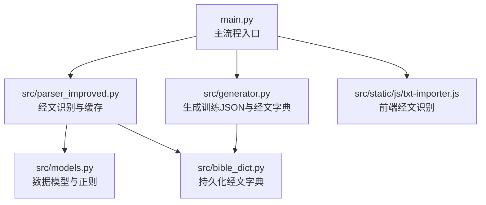
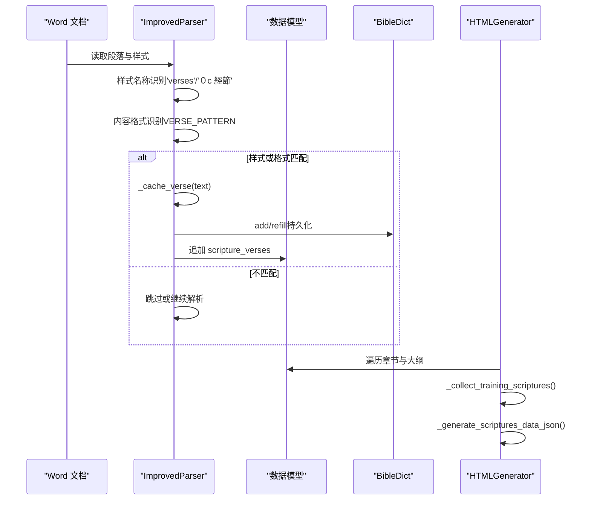
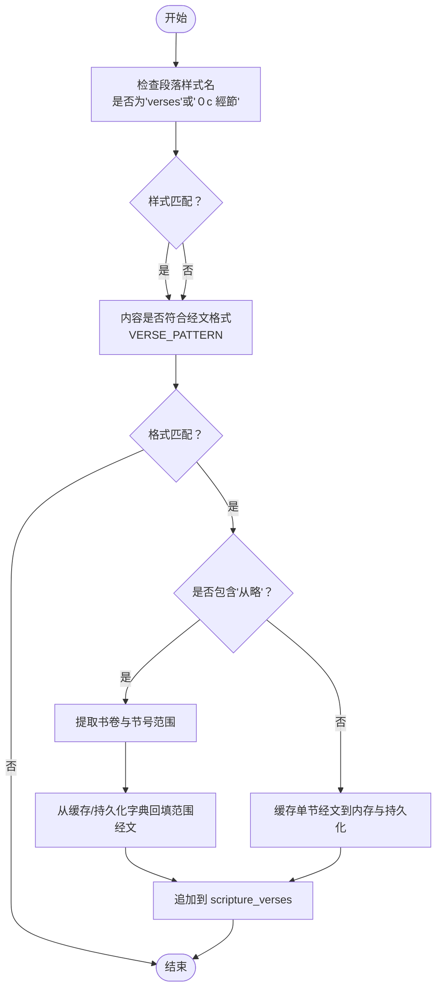
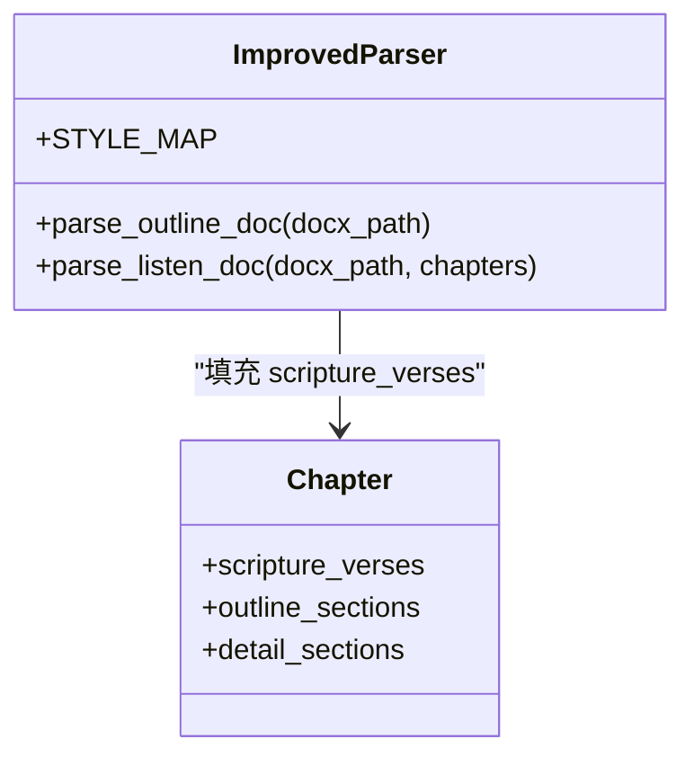
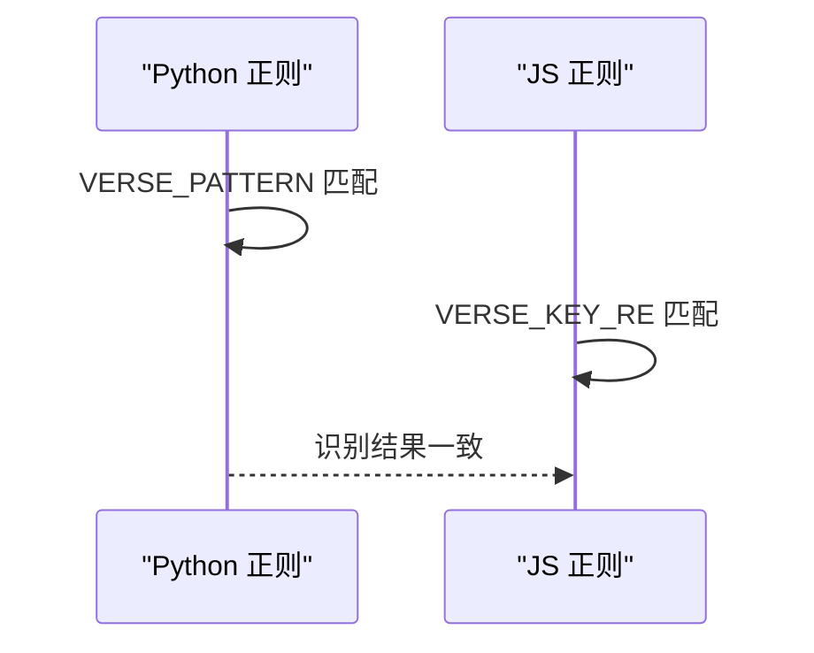
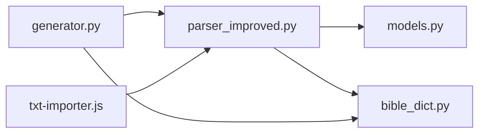

# 经文样式识别

<cite>
**本文引用的文件**
- [src/parser_improved.py](file://src/parser_improved.py)
- [src/models.py](file://src/models.py)
- [src/generator.py](file://src/generator.py)
- [src/bible_dict.py](file://src/bible_dict.py)
- [src/static/js/txt-importer.js](file://src/static/js/txt-importer.js)
- [main.py](file://main.py)
</cite>

## 目录
1. [简介](#简介)
2. [项目结构](#项目结构)
3. [核心组件](#核心组件)
4. [架构总览](#架构总览)
5. [详细组件分析](#详细组件分析)
6. [依赖分析](#依赖分析)
7. [性能考虑](#性能考虑)
8. [故障排查指南](#故障排查指南)
9. [结论](#结论)

## 简介
本技术文档聚焦“经文样式识别”能力，系统阐述双识别机制：样式名称识别（基于段落样式名）与内容格式识别（基于经文正则表达式）。重点说明 STYLE_MAP 映射表的作用、样式兼容性处理、通过 paragraph.style.name 进行样式检测的实现细节，并给出样式名称转换、格式验证、兼容性处理等过程的代码示例路径。同时提供性能优化策略与错误处理机制，帮助读者快速理解并正确使用该功能。

## 项目结构
围绕经文样式识别的关键文件与职责如下：
- src/parser_improved.py：实现经文识别、缓存、范围提取、样式映射与兼容处理的核心逻辑
- src/models.py：定义数据模型（章节、内容节点、训练数据等），包含经文格式识别辅助正则
- src/generator.py：生成 scriptures-data.json 与训练数据 JSON，复用经文识别正则
- src/bible_dict.py：持久化经文字典，提供经文范围读取与增量保存
- src/static/js/txt-importer.js：前端侧经文行识别正则，与后端保持一致
- main.py：主流程入口，调度解析与生成

图表来源
- [main.py:488-500](file://main.py#L488-L500)
- [src/parser_improved.py:118-135](file://src/parser_improved.py#L118-L135)
- [src/models.py:112-123](file://src/models.py#L112-L123)
- [src/bible_dict.py:13-16](file://src/bible_dict.py#L13-L16)
- [src/generator.py:209-212](file://src/generator.py#L209-L212)
- [src/static/js/txt-importer.js:30-31](file://src/static/js/txt-importer.js#L30-L31)

章节来源
- [main.py:488-500](file://main.py#L488-L500)
- [src/parser_improved.py:118-135](file://src/parser_improved.py#L118-L135)
- [src/models.py:112-123](file://src/models.py#L112-L123)
- [src/bible_dict.py:13-16](file://src/bible_dict.py#L13-L16)
- [src/generator.py:209-212](file://src/generator.py#L209-L212)
- [src/static/js/txt-importer.js:30-31](file://src/static/js/txt-importer.js#L30-L31)

## 核心组件
- 双重识别机制
  - 样式名称识别：通过 paragraph.style.name 判断是否为经文样式（支持'verses'和'０c 經節'）
  - 内容格式识别：通过 VERSE_PATTERN 正则匹配经文行格式
- STYLE_MAP 映射表：将 Word 样式名映射为内部层级标识，间接影响经文识别的上下文定位
- 经文缓存与范围提取：缓存单节经文，支持“从略”范围占位符的替换
- 前后端一致性：前端 txt-importer.js 与后端正则保持一致，确保跨端识别一致

章节来源
- [src/parser_improved.py:118-135](file://src/parser_improved.py#L118-L135)
- [src/parser_improved.py:300-307](file://src/parser_improved.py#L300-L307)
- [src/parser_improved.py:338-366](file://src/parser_improved.py#L338-L366)
- [src/static/js/txt-importer.js:30-31](file://src/static/js/txt-importer.js#L30-L31)

## 架构总览
经文样式识别贯穿解析与生成阶段，形成如下闭环：
- 解析阶段：识别经文样式与格式，缓存经文，处理“从略”范围
- 生成阶段：抽取训练数据中的经文行，生成 scriptures-data.json，避免与全本圣经重复

图表来源
- [src/parser_improved.py:542-568](file://src/parser_improved.py#L542-L568)
- [src/parser_improved.py:731-760](file://src/parser_improved.py#L731-L760)
- [src/parser_improved.py:338-366](file://src/parser_improved.py#L338-L366)
- [src/bible_dict.py:33-42](file://src/bible_dict.py#L33-L42)
- [src/generator.py:214-248](file://src/generator.py#L214-L248)

## 详细组件分析

### 组件A：经文样式识别与兼容性处理
- 样式名称识别
  - 通过 paragraph.style.name 判断是否为经文样式，支持'verses'与'０c 經節'
  - 两种样式均触发经文内容采集与缓存
- 内容格式识别
  - VERSE_PATTERN 匹配“书卷+章节”格式的经文行
  - 支持中文数字与阿拉伯数字混合的章节形式
- “从略”范围处理
  - 识别“从略”占位符，按书卷与节号范围从缓存或持久化字典中回填经文
- 缓存与回填
  - 单节经文缓存到内存字典，同时写入持久化 BibleDict
  - 范围回填时优先使用内存缓存，缺失时回退到持久化字典

图表来源
- [src/parser_improved.py:542-568](file://src/parser_improved.py#L542-L568)
- [src/parser_improved.py:731-760](file://src/parser_improved.py#L731-L760)
- [src/parser_improved.py:300-307](file://src/parser_improved.py#L300-L307)
- [src/parser_improved.py:338-366](file://src/parser_improved.py#L338-L366)

章节来源
- [src/parser_improved.py:542-568](file://src/parser_improved.py#L542-L568)
- [src/parser_improved.py:731-760](file://src/parser_improved.py#L731-L760)
- [src/parser_improved.py:300-307](file://src/parser_improved.py#L300-L307)
- [src/parser_improved.py:338-366](file://src/parser_improved.py#L338-L366)

### 组件B：STYLE_MAP 映射表与样式兼容性
- STYLE_MAP 作用
  - 将 Word 样式名映射为内部层级标识（如章节标题、大纲层级等）
  - 间接影响经文识别的上下文定位（经文通常位于章节正文或大纲节点下）
- 兼容性处理
  - 支持不同训练批次的样式差异（如秋季与夏季样式）
  - 通过样式名兼容'verses'与'０c 經節'两种命名

图表来源
- [src/parser_improved.py:118-135](file://src/parser_improved.py#L118-L135)
- [src/parser_improved.py:542-568](file://src/parser_improved.py#L542-L568)

章节来源
- [src/parser_improved.py:118-135](file://src/parser_improved.py#L118-L135)
- [src/parser_improved.py:542-568](file://src/parser_improved.py#L542-L568)

### 组件C：前后端经文识别一致性
- 后端正则
  - VERSE_PATTERN 与 _VERSE_LINE_RE 保持一致，确保前后端识别一致
- 前端正则
  - txt-importer.js 中的 VERSE_KEY_RE 与后端正则保持一致的字符集合与匹配逻辑

图表来源
- [src/parser_improved.py:145](file://src/parser_improved.py#L145)
- [src/generator.py:209-212](file://src/generator.py#L209-L212)
- [src/static/js/txt-importer.js:30-31](file://src/static/js/txt-importer.js#L30-L31)

章节来源
- [src/parser_improved.py:145](file://src/parser_improved.py#L145)
- [src/generator.py:209-212](file://src/generator.py#L209-L212)
- [src/static/js/txt-importer.js:30-31](file://src/static/js/txt-importer.js#L30-L31)

### 组件D：经文缓存与持久化
- 缓存策略
  - 单节经文缓存到内存字典（verse_cache），提升范围回填效率
  - 同步写入持久化 BibleDict，避免重复解析
- 范围回填
  - 从缓存或持久化字典按节号范围拼接经文
  - 支持“从略”占位符的范围替换

图表来源
- [src/parser_improved.py:338-366](file://src/parser_improved.py#L338-L366)
- [src/bible_dict.py:52-59](file://src/bible_dict.py#L52-L59)

章节来源
- [src/parser_improved.py:338-366](file://src/parser_improved.py#L338-L366)
- [src/bible_dict.py:52-59](file://src/bible_dict.py#L52-L59)

## 依赖分析
- 模块耦合
  - ImprovedParser 依赖 models.Chapter 与 bible_dict.BibleDict
  - HTMLGenerator 依赖 ImprovedParser 的正则与上下文推断能力
- 外部依赖
  - 正则表达式预编译减少运行时开销
  - 前端与后端正则保持一致，避免跨端差异

图表来源
- [src/parser_improved.py:12-13](file://src/parser_improved.py#L12-L13)
- [src/generator.py:10-11](file://src/generator.py#L10-L11)
- [src/static/js/txt-importer.js:30-31](file://src/static/js/txt-importer.js#L30-L31)

章节来源
- [src/parser_improved.py:12-13](file://src/parser_improved.py#L12-L13)
- [src/generator.py:10-11](file://src/generator.py#L10-L11)
- [src/static/js/txt-importer.js:30-31](file://src/static/js/txt-importer.js#L30-L31)

## 性能考虑
- 正则预编译
  - VERSE_PATTERN、LEVEL 系列正则在类初始化时预编译，避免重复编译开销
- 缓存优先
  - 内存 verse_cache 优先回填范围经文，减少持久化字典访问次数
- 早期退出
  - 非经文段落直接跳过，减少不必要的正则匹配
- 前端一致性
  - 前后端正则一致，避免重复解析与数据不一致导致的额外处理

章节来源
- [src/parser_improved.py:137-190](file://src/parser_improved.py#L137-L190)
- [src/parser_improved.py:338-366](file://src/parser_improved.py#L338-L366)

## 故障排查指南
- 样式识别失效
  - 检查段落样式名是否为'verses'或'０c 經節'
  - 确认 STYLE_MAP 中是否存在对应映射
- 经文格式不识别
  - 确认文本是否符合 VERSE_PATTERN 格式（书卷+章节）
  - 检查是否包含“从略”，确认范围提取逻辑
- 范围回填为空
  - 检查 verse_cache 与持久化字典中是否存在对应节号
  - 确认 BibleDict 的加载与保存流程
- 前后端不一致
  - 对比 Python 与 JS 的正则字符集与匹配逻辑
  - 确保 VERSE_PATTERN 与 VERSE_KEY_RE 保持一致

章节来源
- [src/parser_improved.py:118-135](file://src/parser_improved.py#L118-L135)
- [src/parser_improved.py:300-307](file://src/parser_improved.py#L300-L307)
- [src/parser_improved.py:338-366](file://src/parser_improved.py#L338-L366)
- [src/static/js/txt-importer.js:30-31](file://src/static/js/txt-importer.js#L30-L31)

## 结论
经文样式识别通过“样式名称识别 + 内容格式识别”的双重机制，结合 STYLE_MAP 的兼容性处理与经文缓存/回填策略，实现了高可靠、高性能的经文抽取。前后端正则一致性保证了跨端识别的一致性，持久化字典提升了范围回填效率。遵循本文的实现细节与优化策略，可稳定支撑大规模训练文档的经文识别与生成。