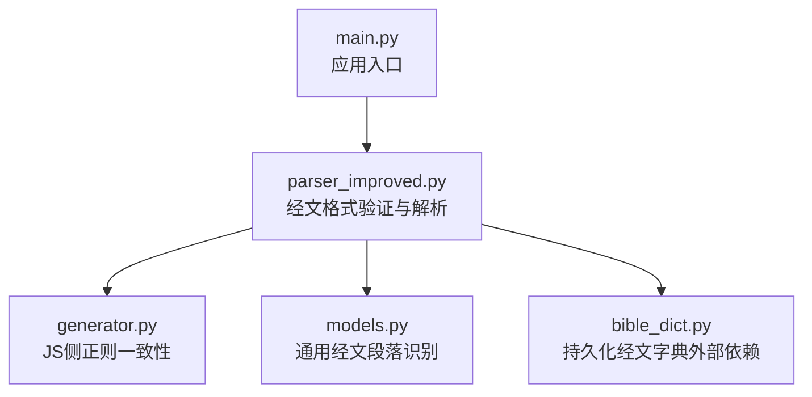
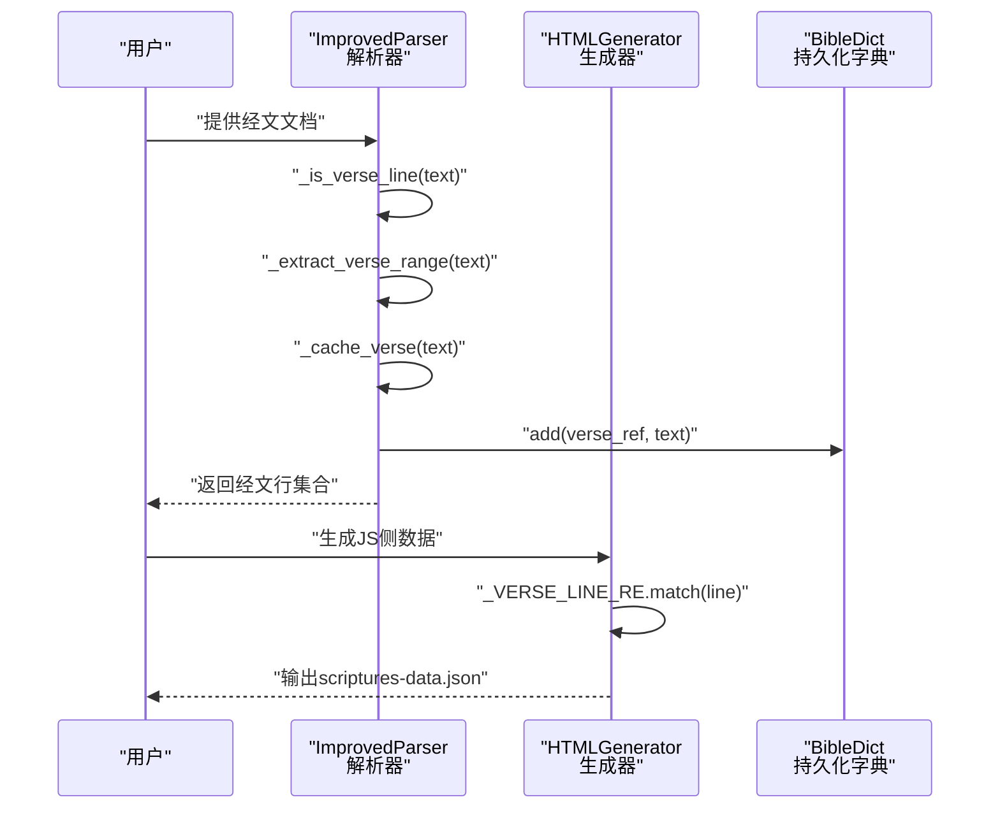
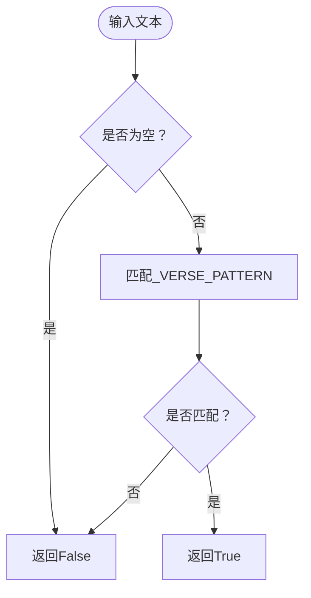
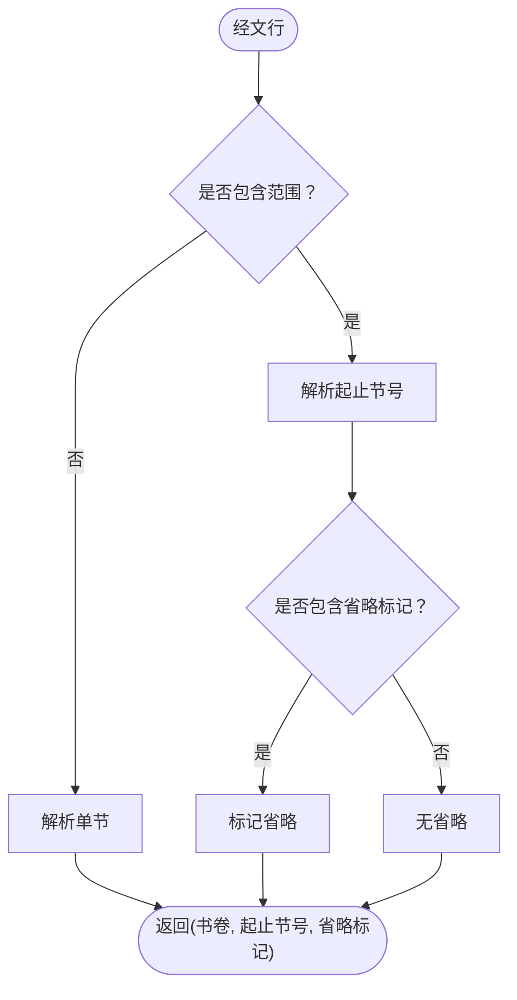
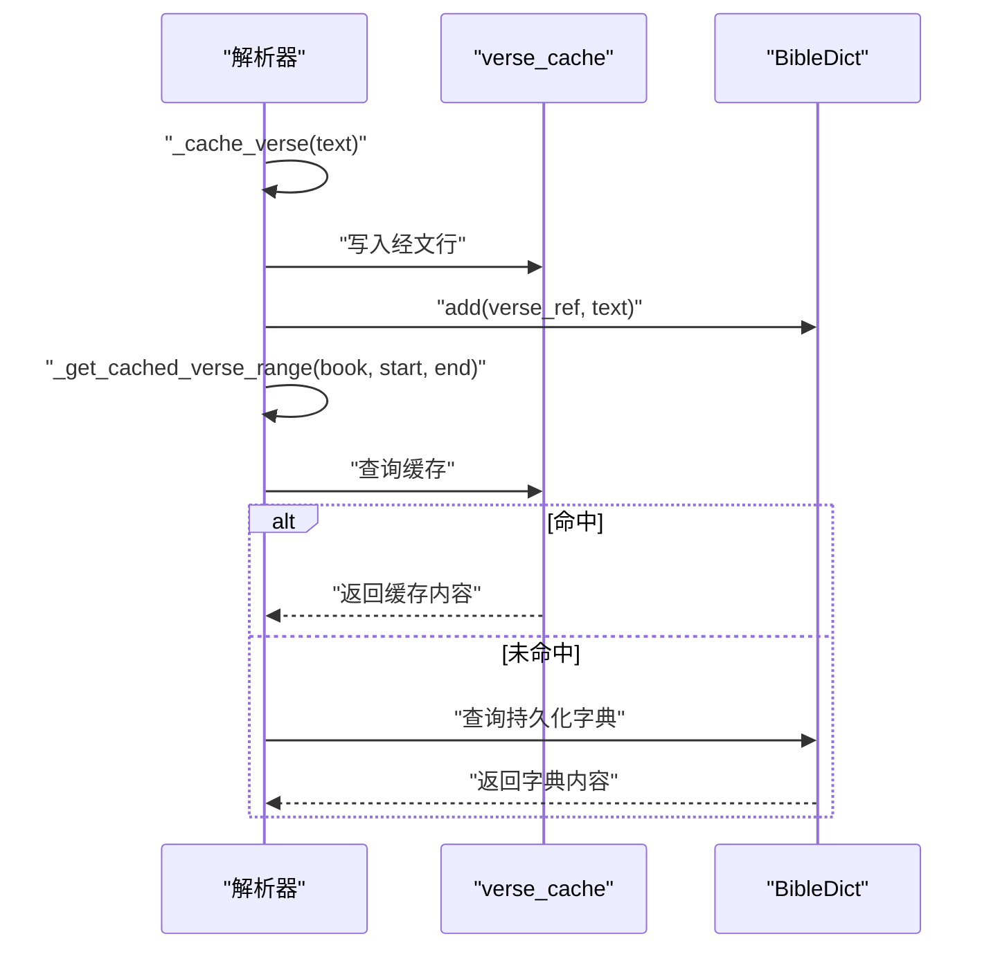
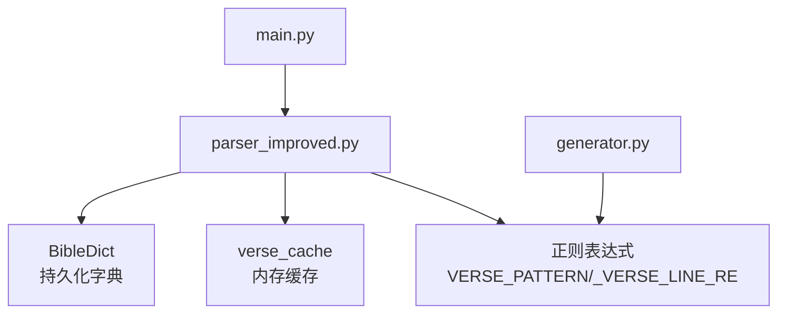

# 经文格式验证

<cite>
**本文档引用的文件**
- [parser_improved.py](file://src/parser_improved.py)
- [generator.py](file://src/generator.py)
- [models.py](file://src/models.py)
- [main.py](file://main.py)
</cite>

## 目录
1. [简介](#简介)
2. [项目结构](#项目结构)
3. [核心组件](#核心组件)
4. [架构概览](#架构概览)
5. [详细组件分析](#详细组件分析)
6. [依赖分析](#依赖分析)
7. [性能考虑](#性能考虑)
8. [故障排除指南](#故障排除指南)
9. [结论](#结论)

## 简介
本文档深入解析经文格式验证功能，重点阐述_VERSE_PATTERN正则表达式的匹配逻辑与实现机制。该功能用于识别和验证两类经文格式：
- 书卷 + 中文数字 + 阿拉伯数字：如「太五3」
- 书卷 + 阿拉伯数字（带章节与节号）：如「腓2:5」

通过对正则表达式结构、匹配规则、格式规范化、错误处理以及性能优化的全面分析，帮助开发者准确理解并高效使用该验证机制。

## 项目结构
经文格式验证功能主要分布在以下文件中：
- src/parser_improved.py：定义_VERSE_PATTERN并提供经文行检测、范围提取、缓存与补全等核心逻辑
- src/generator.py：与解析器保持一致的正则表达式，用于JS侧的经文提取与处理
- src/models.py：提供通用的经文段落识别与长段落分割逻辑（辅助验证）
- main.py：应用入口，调用解析器生成训练数据

**图表来源**
- [main.py:489-500](file://main.py#L489-L500)
- [parser_improved.py:143-146](file://src/parser_improved.py#L143-L146)
- [generator.py:208-212](file://src/generator.py#L208-L212)
- [models.py:120-161](file://src/models.py#L120-L161)

**章节来源**
- [main.py:489-500](file://main.py#L489-L500)
- [parser_improved.py:143-146](file://src/parser_improved.py#L143-L146)
- [generator.py:208-212](file://src/generator.py#L208-L212)
- [models.py:120-161](file://src/models.py#L120-L161)

## 核心组件
- VERSE_PATTERN（解析器侧）：用于识别「书卷 + 阿拉伯章节:节 + 可选半节标记」的经文行
- _VERSE_LINE_RE（生成器侧）：与解析器保持一致的正则表达式，确保JS侧处理的一致性
- _is_verse_line：基于_VERSE_PATTERN的便捷检测方法
- _extract_verse_range：从经文行中提取书卷、起止节号与省略标记
- _cache_verse/_get_cached_verse_range：经文缓存与范围补全机制
- 通用经文段落识别（models.py）：辅助识别长段落中的经文内容

**章节来源**
- [parser_improved.py:143-146](file://src/parser_improved.py#L143-L146)
- [parser_improved.py:300-350](file://src/parser_improved.py#L300-L350)
- [parser_improved.py:351-366](file://src/parser_improved.py#L351-L366)
- [generator.py:208-212](file://src/generator.py#L208-L212)
- [models.py:120-161](file://src/models.py#L120-L161)

## 架构概览
经文格式验证贯穿文档解析流程，从输入文档中识别符合格式规范的经文行，提取关键信息并进行缓存与补全，最终生成训练数据。

**图表来源**
- [parser_improved.py:300-350](file://src/parser_improved.py#L300-L350)
- [parser_improved.py:351-366](file://src/parser_improved.py#L351-L366)
- [generator.py:208-212](file://src/generator.py#L208-L212)

## 详细组件分析

### VERSE_PATTERN 正则表达式详解
_VERSE_PATTERN用于识别「书卷 + 阿拉伯章节:节 + 可选半节标记」的经文行，其结构如下：
- 书卷标识：由特定字符集组成，支持常见书卷缩写与修饰符
- 章节与节号：阿拉伯数字，格式为「章节:节」
- 半节标记：可选的「上/中/下」标记，用于半节引用
- 分隔符：支持中文全角空格、英文空格与制表符

匹配示例（概念性说明）：
- 太5:3 → 书卷「太」 + 章节5 + 节号3
- 太五3 → 书卷「太」 + 中文章节「五」 + 节号3（该格式由其他正则处理）
- 腓2:5上 → 书卷「腓」 + 章节2 + 节号5 + 半节标记「上」

**图表来源**
- [parser_improved.py:300-307](file://src/parser_improved.py#L300-L307)

**章节来源**
- [parser_improved.py:143-146](file://src/parser_improved.py#L143-L146)
- [parser_improved.py:300-307](file://src/parser_improved.py#L300-L307)

### 经文范围提取与规范化
_extract_verse_range负责从经文行中提取书卷、起止节号与省略标记，支持以下格式：
- 单节：「腓2:5」
- 范围：「腓2:5~11」
- 带省略标记：「腓2:5~11 从略。」

规范化要点：
- 书卷标识标准化（如「腓」）
- 节号转为整数
- 省略标记识别并记录

**图表来源**
- [parser_improved.py:309-332](file://src/parser_improved.py#L309-L332)

**章节来源**
- [parser_improved.py:309-332](file://src/parser_improved.py#L309-L332)

### 缓存与补全机制
_cache_verse将经文行缓存到内存字典中，并同步写入持久化字典（避免覆盖既有条目）。_get_cached_verse_range在缓存未命中时回退到持久化字典，实现跨文档/训练的数据复用。

**图表来源**
- [parser_improved.py:338-366](file://src/parser_improved.py#L338-L366)

**章节来源**
- [parser_improved.py:338-366](file://src/parser_improved.py#L338-L366)

### JS侧正则一致性
generator.py中的_VERSE_LINE_RE与解析器保持一致，确保前端渲染与后端解析结果一致。该正则同样用于从训练数据中提取经文行并生成scriptures-data.json。

**章节来源**
- [generator.py:208-212](file://src/generator.py#L208-L212)

### 通用经文段落识别（辅助验证）
models.py提供了针对长段落的经文识别与分割逻辑，当段落过长可能包含正文时，通过预设的分隔标记进行分割，确保经文提取的准确性。

**章节来源**
- [models.py:120-161](file://src/models.py#L120-L161)

## 依赖分析
经文格式验证功能的依赖关系如下：

**图表来源**
- [parser_improved.py:143-146](file://src/parser_improved.py#L143-L146)
- [parser_improved.py:338-366](file://src/parser_improved.py#L338-L366)
- [generator.py:208-212](file://src/generator.py#L208-L212)
- [main.py:489-500](file://main.py#L489-L500)

**章节来源**
- [parser_improved.py:143-146](file://src/parser_improved.py#L143-L146)
- [parser_improved.py:338-366](file://src/parser_improved.py#L338-L366)
- [generator.py:208-212](file://src/generator.py#L208-L212)
- [main.py:489-500](file://main.py#L489-L500)

## 性能考虑
- 预编译正则表达式：VERSE_PATTERN与_GENERATOR中的_VERSE_LINE_RE均在模块级别预编译，减少重复编译开销
- 缓存策略：内存缓存与持久化字典双层缓存，提升重复查询效率
- 正则复杂度：正则表达式结构相对简单，匹配复杂度近似O(n)，其中n为输入文本长度
- 长段落处理：models.py中的分割逻辑避免一次性处理过长文本，降低内存压力

[本节为一般性指导，不涉及具体文件分析]

## 故障排除指南
- 无法识别经文行：检查输入文本是否符合「书卷 + 章节:节」格式，确认分隔符为中文全角空格、英文空格或制表符
- 范围提取异常：确认经文行中包含正确的范围分隔符「~」或全角波浪号「～」，并检查省略标记「从略」是否存在
- 缓存未命中：确认BibleDict是否正确初始化，以及经文键是否与缓存键一致
- JS侧不一致：确保generator.py中的_VERSE_LINE_RE与解析器中的_VERSE_PATTERN保持一致

**章节来源**
- [parser_improved.py:300-350](file://src/parser_improved.py#L300-L350)
- [parser_improved.py:351-366](file://src/parser_improved.py#L351-L366)
- [generator.py:208-212](file://src/generator.py#L208-L212)
- [models.py:120-161](file://src/models.py#L120-L161)

## 结论
经文格式验证功能通过_VERSE_PATTERN正则表达式实现了对两类经文格式的精确识别与规范化处理。结合缓存与持久化字典机制，系统能够在保证准确性的同时提升性能与可维护性。JS侧正则一致性进一步确保了前后端处理结果的一致性，为最终的训练数据生成奠定了坚实基础。