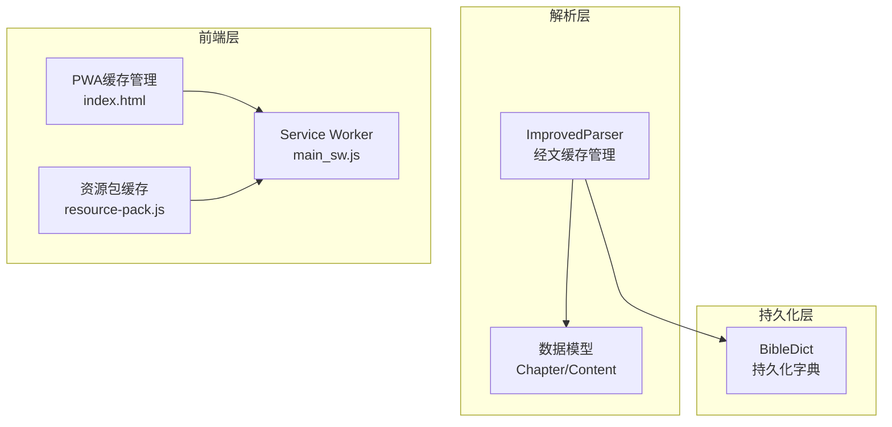
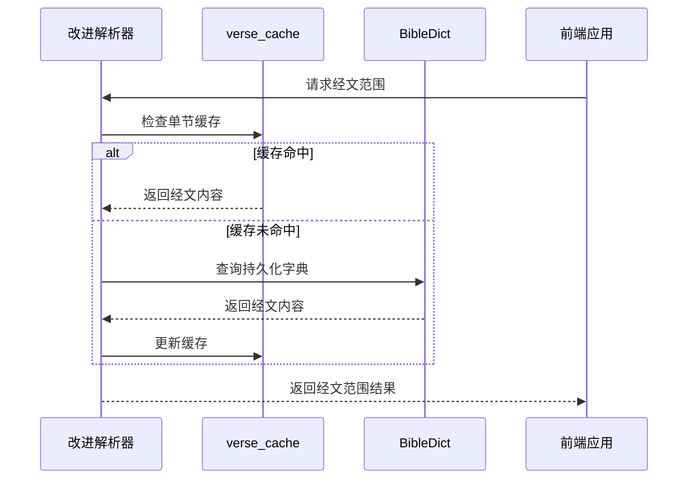
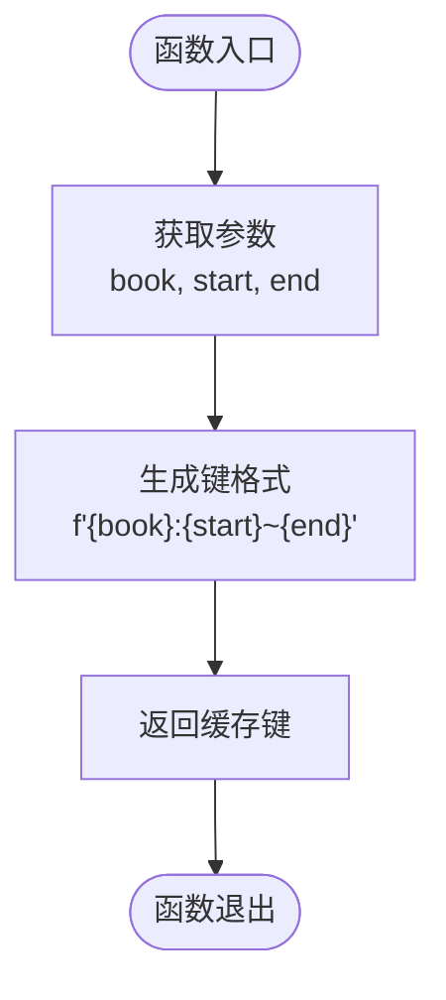
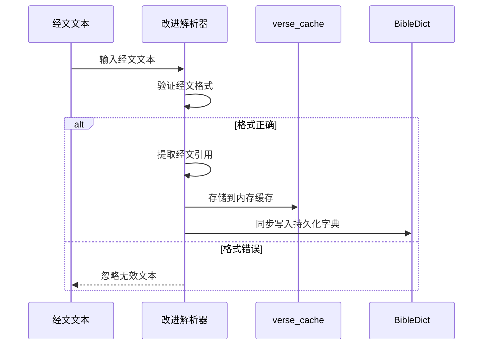
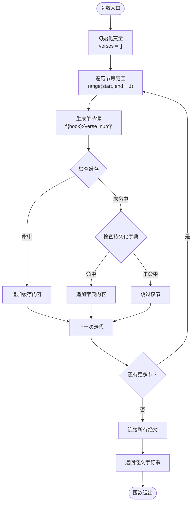
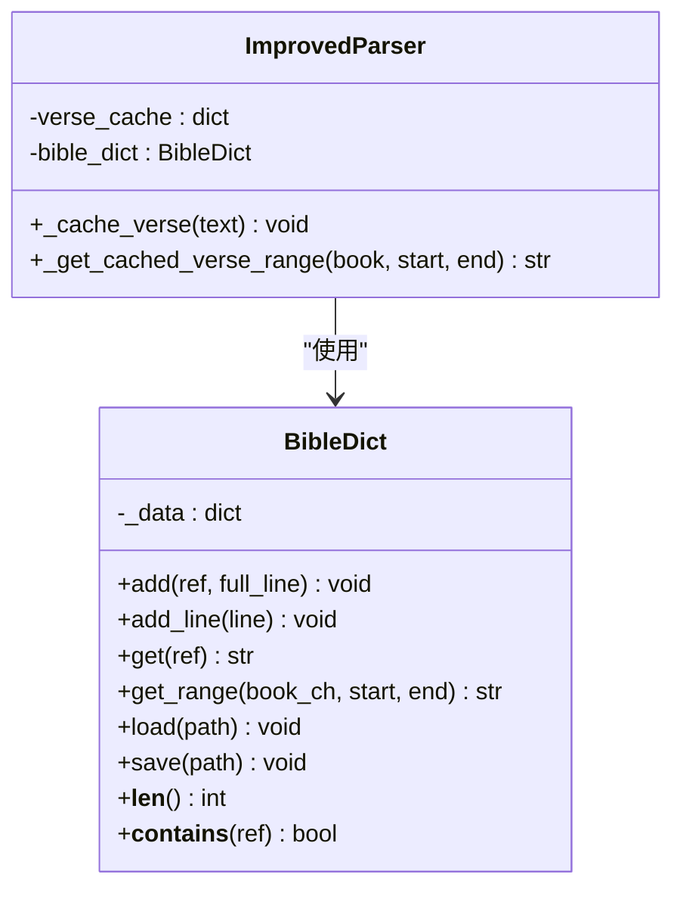
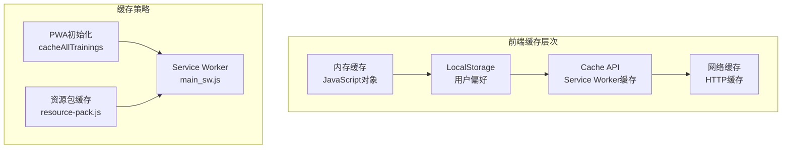
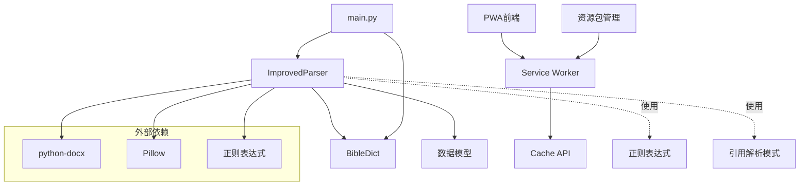
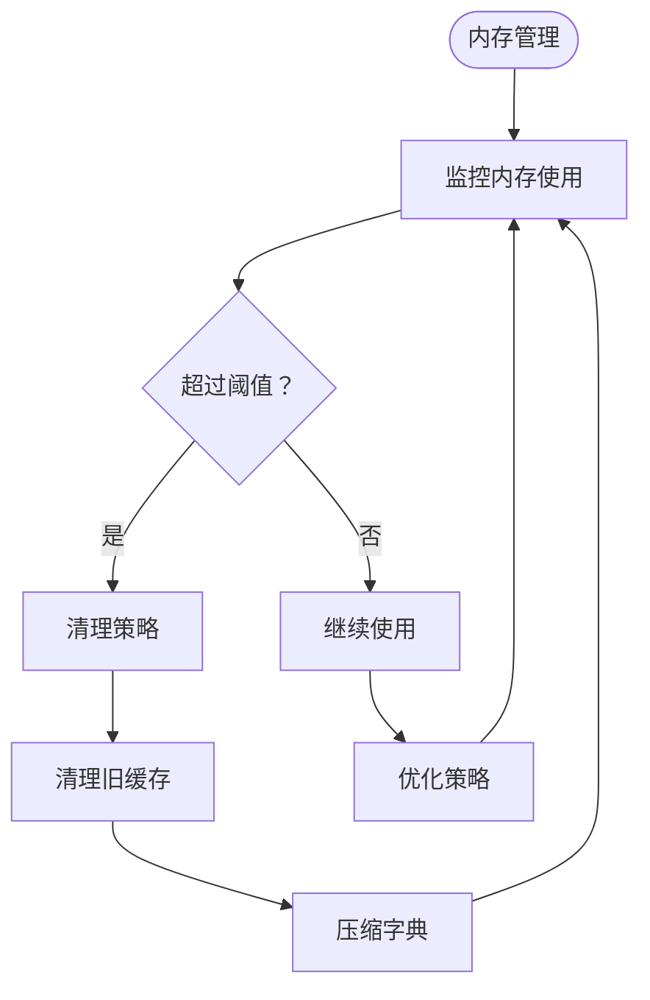
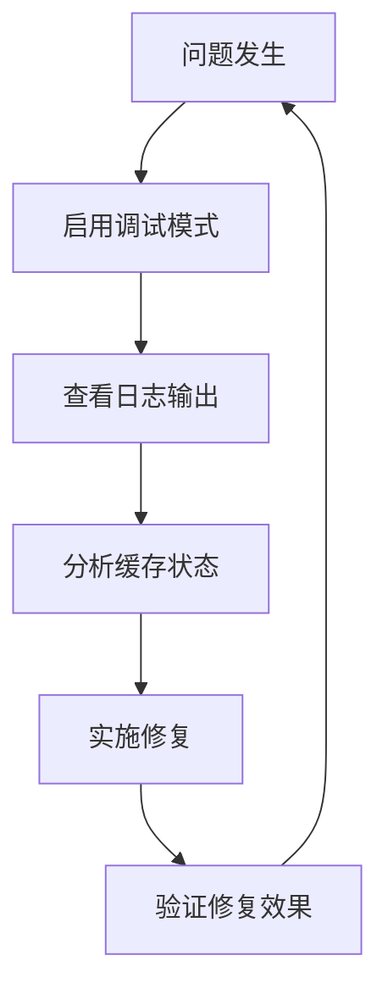

# 经文缓存管理

<cite>
**本文档引用的文件**
- [parser_improved.py](file://src/parser_improved.py)
- [bible_dict.py](file://src/bible_dict.py)
- [models.py](file://src/models.py)
- [main.py](file://main.py)
- [index.html](file://src/static/index.html)
- [main_sw.js](file://src/templates/main_sw.js)
- [resource-pack.js](file://src/static/js/resource-pack.js)
</cite>

## 目录
1. [简介](#简介)
2. [项目结构](#项目结构)
3. [核心组件](#核心组件)
4. [架构概览](#架构概览)
5. [详细组件分析](#详细组件分析)
6. [依赖关系分析](#依赖关系分析)
7. [性能考量](#性能考量)
8. [故障排除指南](#故障排除指南)
9. [结论](#结论)

## 简介
本文档深入解析经文缓存管理系统，重点阐述 `verse_cache` 字典的缓存机制，包括缓存键生成（`_get_verse_range_key`）、缓存存储（`_cache_verse`）、缓存检索（`_get_cached_verse_range`）等核心功能。文档详细描述缓存策略、持久化同步、缓存失效等机制，并提供具体使用场景示例，涵盖单节缓存、范围缓存、缓存查询等过程。同时包含缓存性能优化、内存管理、并发安全等实现细节。

## 项目结构
经文缓存管理功能主要分布在以下文件中：
- `src/parser_improved.py`: 改进的解析器，包含 `verse_cache` 字典及相关的缓存操作方法
- `src/bible_dict.py`: 持久化经文字典，提供跨文档/训练的经文存储
- `src/models.py`: 数据模型定义，包含章节和内容节点结构
- `main.py`: 主程序入口，负责初始化解析器和持久化字典
- `src/static/index.html`: 前端PWA缓存管理逻辑
- `src/templates/main_sw.js`: Service Worker缓存策略
- `src/static/js/resource-pack.js`: 资源包下载与缓存管理

**图表来源**
- [parser_improved.py:277-293](file://src/parser_improved.py#L277-L293)
- [bible_dict.py:19-96](file://src/bible_dict.py#L19-L96)
- [models.py:9-232](file://src/models/models.py#L9-L232)

**章节来源**
- [parser_improved.py:115-293](file://src/parser_improved.py#L115-L293)
- [bible_dict.py:1-96](file://src/bible_dict.py#L1-L96)
- [models.py:1-232](file://src/models.py#L1-L232)

## 核心组件
经文缓存管理系统由以下核心组件构成：

### 1. ImprovedParser 类
- **verse_cache**: 内存字典，存储已解析的经文内容
- **bible_dict**: 外部持久化字典实例
- **缓存操作方法**: `_get_verse_range_key`、`_cache_verse`、`_get_cached_verse_range`

### 2. BibleDict 类
- **持久化存储**: JSON文件格式，键为经文引用，值为完整经文行
- **读写接口**: `add`、`get`、`get_range`、`load`、`save`
- **增量加载**: 支持从JSON文件增量加载，不覆盖已有条目

### 3. 数据模型
- **Chapter**: 篇章结构，包含纲目、详细内容、经文等字段
- **Content**: 内容节点，支持层级结构和经文引用

**章节来源**
- [parser_improved.py:277-365](file://src/parser_improved.py#L277-L365)
- [bible_dict.py:19-96](file://src/bible_dict.py#L19-L96)
- [models.py:9-232](file://src/models.py#L9-L232)

## 架构概览
经文缓存管理系统采用三层架构设计：

**图表来源**
- [parser_improved.py:351-365](file://src/parser_improved.py#L351-L365)
- [bible_dict.py:48-59](file://src/bible_dict.py#L48-L59)

系统架构特点：
- **内存优先**: `verse_cache` 作为一级缓存，提供快速访问
- **持久化备份**: `BibleDict` 作为二级缓存，确保数据持久性
- **渐进增强**: 前端PWA结合Service Worker实现离线缓存
- **跨文档共享**: 持久化字典支持跨文档/训练的经文共享

## 详细组件分析

### 缓存键生成机制
`_get_verse_range_key` 方法负责生成经文范围的缓存键：

**图表来源**
- [parser_improved.py:334-336](file://src/parser_improved.py#L334-L336)

缓存键生成策略：
- **格式规范**: 使用 `书卷:起始节~结束节` 的统一格式
- **唯一性保证**: 结合书卷名和节号范围，确保键的唯一性
- **可读性强**: 键格式直观易懂，便于调试和维护

**章节来源**
- [parser_improved.py:334-336](file://src/parser_improved.py#L334-L336)

### 缓存存储机制
`_cache_verse` 方法实现单节经文的缓存存储：

**图表来源**
- [parser_improved.py:338-349](file://src/parser_improved.py#L338-L349)

存储策略特点：
- **原子操作**: 缓存和持久化写入在同一方法中执行
- **幂等性**: 持久化字典采用 `add` 方法，已有条目不覆盖
- **格式验证**: 通过正则表达式严格验证经文格式

**章节来源**
- [parser_improved.py:338-349](file://src/parser_improved.py#L338-L349)

### 缓存检索机制
`_get_cached_verse_range` 方法实现经文范围的缓存检索：

**图表来源**
- [parser_improved.py:351-365](file://src/parser_improved.py#L351-L365)

检索策略特点：
- **优先级**: 先查内存缓存，未命中再查持久化字典
- **渐进填充**: 逐步构建范围经文，支持部分命中场景
- **容错处理**: 未命中的节号会被跳过，不影响整体结果

**章节来源**
- [parser_improved.py:351-365](file://src/parser_improved.py#L351-L365)

### 持久化同步机制
BibleDict 类提供完整的持久化存储能力：

**图表来源**
- [bible_dict.py:19-96](file://src/bible_dict.py#L19-L96)
- [parser_improved.py:277-293](file://src/parser_improved.py#L277-L293)

持久化特性：
- **增量加载**: `load` 方法支持从JSON文件增量加载，避免覆盖已有数据
- **自动保存**: `save` 方法按引用键排序，确保数据一致性
- **范围查询**: `get_range` 方法支持书卷+章号的范围查询

**章节来源**
- [bible_dict.py:19-96](file://src/bible_dict.py#L19-L96)

### 前端缓存管理
前端PWA结合Service Worker实现多层次缓存：

**图表来源**
- [index.html:584-805](file://src/static/index.html#L584-L805)
- [main_sw.js:79-149](file://src/templates/main_sw.js#L79-L149)
- [resource-pack.js:184-327](file://src/static/js/resource-pack.js#L184-L327)

前端缓存特点：
- **渐进式缓存**: 从内存到持久化的渐进式缓存策略
- **智能验证**: `verifyCacheIntegrity` 方法验证缓存完整性
- **批量管理**: 支持批量缓存和清理操作

**章节来源**
- [index.html:584-805](file://src/static/index.html#L584-L805)
- [main_sw.js:79-149](file://src/templates/main_sw.js#L79-L149)
- [resource-pack.js:184-327](file://src/static/js/resource-pack.js#L184-L327)

## 依赖关系分析

**图表来源**
- [parser_improved.py:115-293](file://src/parser_improved.py#L115-L293)
- [main.py:410-536](file://main.py#L410-L536)

依赖关系特点：
- **低耦合设计**: `ImprovedParser` 通过构造函数注入 `BibleDict` 实例
- **清晰边界**: 缓存逻辑与业务逻辑分离
- **可测试性**: 通过依赖注入支持单元测试

**章节来源**
- [parser_improved.py:277-293](file://src/parser_improved.py#L277-L293)
- [main.py:410-536](file://main.py#L410-L536)

## 性能考量

### 缓存性能优化策略

1. **内存缓存优化**
   - 使用字典结构实现O(1)的平均查找复杂度
   - 通过 `verse_cache` 减少重复的持久化查询
   - 支持部分命中场景，提升缓存利用率

2. **持久化性能**
   - JSON文件格式，读写效率高
   - 增量加载避免重复解析
   - 排序保存确保数据一致性

3. **前端缓存优化**
   - Service Worker预缓存核心资源
   - 智能缓存验证，避免过期数据
   - 批量缓存操作，减少I/O开销

### 内存管理策略

**图表来源**
- [parser_improved.py:292-293](file://src/parser_improved.py#L292-L293)

内存管理措施：
- **缓存大小控制**: 通过 `reset_state` 方法重置解析状态
- **字典清理**: 支持手动清理和自动清理机制
- **内存监控**: 前端提供内存使用监控功能

### 并发安全考虑

当前实现的并发安全特性：
- **单线程解析**: 改进解析器在单个解析过程中使用
- **原子操作**: 缓存和持久化写入在同一方法中执行
- **幂等性保证**: 持久化字典不覆盖已有条目

潜在并发问题：
- 多实例共享同一持久化字典时可能出现竞态条件
- 建议在生产环境中使用适当的锁机制或队列管理

**章节来源**
- [parser_improved.py:285-293](file://src/parser_improved.py#L285-L293)
- [bible_dict.py:33-36](file://src/bible_dict.py#L33-L36)

## 故障排除指南

### 常见问题及解决方案

1. **缓存未命中问题**
   - 检查经文格式是否符合正则表达式要求
   - 验证 `verse_cache` 键生成是否正确
   - 确认持久化字典中是否存在相应条目

2. **性能问题**
   - 监控 `verse_cache` 命中率
   - 检查持久化文件大小和访问频率
   - 优化范围查询的节号范围

3. **内存泄漏**
   - 定期调用 `reset_state` 重置解析状态
   - 监控前端缓存大小
   - 实施缓存清理策略

### 调试技巧

**图表来源**
- [parser_improved.py:300-307](file://src/parser_improved.py#L300-L307)

调试建议：
- 在关键方法中添加日志输出
- 使用 `__contains__` 方法检查缓存状态
- 监控持久化文件的读写操作

**章节来源**
- [parser_improved.py:300-307](file://src/parser_improved.py#L300-L307)
- [bible_dict.py:91-96](file://src/bible_dict.py#L91-L96)

## 结论

经文缓存管理系统通过多层次的缓存策略实现了高效的数据访问和持久化存储。核心特性包括：

1. **高效的缓存机制**: `verse_cache` 提供内存级别的快速访问
2. **可靠的持久化**: `BibleDict` 确保数据的长期保存
3. **智能的前端缓存**: PWA结合Service Worker实现离线访问
4. **灵活的扩展性**: 通过依赖注入支持不同的持久化后端

系统设计充分考虑了性能、可靠性、可维护性等多个方面，为大规模经文数据的处理提供了坚实的技术基础。通过合理的缓存策略和内存管理，系统能够在保证性能的同时满足各种使用场景的需求。