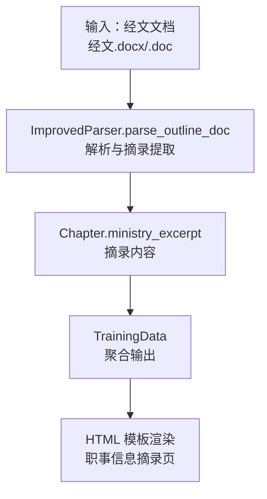
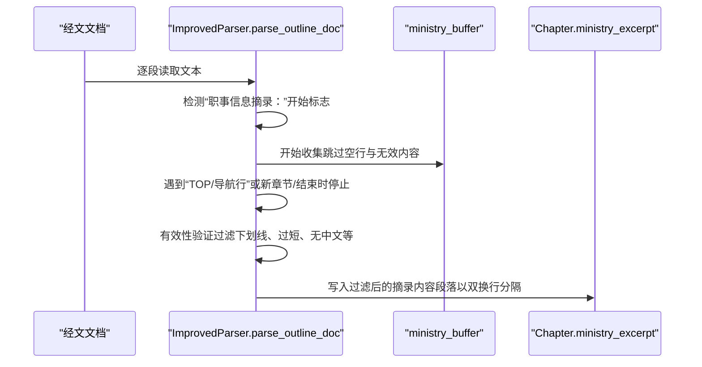
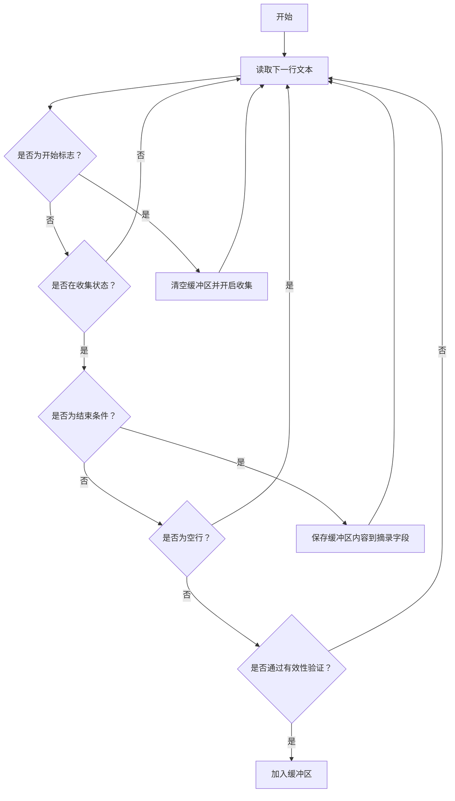
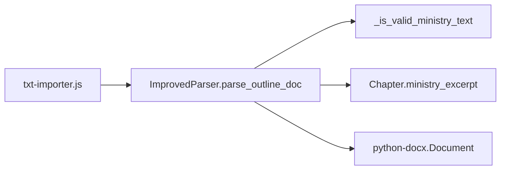

# 职事信息摘录提取

<cite>
**本文引用的文件**
- [src/parser_improved.py](file://src/parser_improved.py)
- [src/models.py](file://src/models.py)
- [src/static/js/txt-importer.js](file://src/static/js/txt-importer.js)
- [README.md](file://README.md)
</cite>

## 目录
1. [简介](#简介)
2. [项目结构](#项目结构)
3. [核心组件](#核心组件)
4. [架构总览](#架构总览)
5. [详细组件分析](#详细组件分析)
6. [依赖分析](#依赖分析)
7. [性能考虑](#性能考虑)
8. [故障排查指南](#故障排查指南)
9. [结论](#结论)

## 简介
本文件聚焦“职事信息摘录”提取功能，围绕 parse_outline_doc 函数中的摘录区域检测、内容收集、有效性验证、缓冲区管理等核心机制，提供面向开发与维护人员的深度技术说明，并辅以可视化图示帮助理解。

## 项目结构
- 本项目采用“解析器 + 模型 + 生成器”的分层架构，其中解析器负责从 Word 文档中抽取结构化内容，模型定义数据结构，生成器将结构化数据渲染为静态页面。
- “职事信息摘录”属于经文文档（经文.docx/.doc）解析流程的一部分，最终写入 Chapter 数据模型的 ministry_excerpt 字段，供前端模板渲染。

图表来源
- [src/parser_improved.py:367-782](file://src/parser_improved.py#L367-L782)
- [src/models.py:40-54](file://src/models.py#L40-L54)

章节来源
- [README.md:52-88](file://README.md#L52-L88)

## 核心组件
- ImprovedParser.parse_outline_doc：负责解析经文文档，提取大纲结构与职事信息摘录。
- _is_valid_ministry_text：对摘录内容进行有效性验证，过滤无效文本。
- Chapter.ministry_excerpt：承载摘录内容的模型字段，供后续渲染使用。

章节来源
- [src/parser_improved.py:367-782](file://src/parser_improved.py#L367-L782)
- [src/parser_improved.py:2516-2550](file://src/parser_improved.py#L2516-L2550)
- [src/models.py:40-54](file://src/models.py#L40-L54)

## 架构总览
下面的序列图展示了“职事信息摘录”从识别到落库的关键流程。

图表来源
- [src/parser_improved.py:665-684](file://src/parser_improved.py#L665-L684)
- [src/parser_improved.py:761-766](file://src/parser_improved.py#L761-L766)
- [src/parser_improved.py:2516-2550](file://src/parser_improved.py#L2516-L2550)

## 详细组件分析

### 摘录区域检测与开始标志识别
- 开始标志：文本严格等于“职事信息摘录：”或以“职事信息摘录”开头（兼容不同冒号形式）。
- 触发动作：清空当前缓冲区，开启收集模式，不清空 current_node，以便纲目解析继续进行。
- 结束条件：遇到“TOP”或导航行、新章节标题、文档结束时停止收集。

章节来源
- [src/parser_improved.py:665-677](file://src/parser_improved.py#L665-L677)

### 内容收集与缓冲区管理
- 缓冲区：ministry_buffer 为列表，按顺序累积有效文本。
- 收集策略：
  - 跳过空行（保留段落分隔符，见“段落分隔处理”）。
  - 仅收集通过有效性验证的文本。
  - 在遇到结束条件时，将缓冲区内容合并为字符串，段落以双换行分隔。
- 结束时机：
  - 遇到“TOP/导航行”或新章节标题时，先保存当前摘录，再开启新的缓冲区。
  - 文档结束时，保存最后一次摘录。

章节来源
- [src/parser_improved.py:678-684](file://src/parser_improved.py#L678-L684)
- [src/parser_improved.py:761-766](file://src/parser_improved.py#L761-L766)

### 有效性验证规则（内容过滤）
- 过滤规则（满足任一即视为无效）：
  - 纯空白或去空白后为空。
  - 全是下划线（如“____”）。
  - 下划线占比超过 80%。
  - 长度小于 3 且不含中文字符。
- 通过验证的内容才会进入缓冲区。

章节来源
- [src/parser_improved.py:2516-2550](file://src/parser_improved.py#L2516-L2550)

### 段落分隔处理
- 空行处理：遇到空行时，不直接丢弃，而是作为段落分隔符保留，确保最终输出的段落间距。
- 实现细节：在收集过程中，空行会被跳过，但在必要时通过特定逻辑插入段落分隔标记，最终以双换行分隔段落。

章节来源
- [src/parser_improved.py:678-684](file://src/parser_improved.py#L678-L684)

### 缓冲区清空与落库
- 清空策略：每次开始新的摘录区域时，清空缓冲区并开启新收集。
- 落库策略：在遇到结束条件或文档结束时，将缓冲区中通过验证的内容合并为字符串，写入 Chapter.ministry_excerpt。
- 段落分隔：段落之间以双换行分隔，保证渲染一致性。

章节来源
- [src/parser_improved.py:674-677](file://src/parser_improved.py#L674-L677)
- [src/parser_improved.py:761-766](file://src/parser_improved.py#L761-L766)
- [src/models.py:40-54](file://src/models.py#L40-L54)

### 与前端 JavaScript 的对应逻辑
- 前端同样实现了类似的摘录提取逻辑，包括：
  - 开始标志识别（“职事信息摘录：”或变体）。
  - 遇到“TOP”或导航行时停止。
  - 过滤无效内容（纯下划线、下划线占比过高、过短且无中文）。
  - 以双换行分隔段落。

章节来源
- [src/static/js/txt-importer.js:603-627](file://src/static/js/txt-importer.js#L603-L627)

### 算法流程图（摘录提取）

图表来源
- [src/parser_improved.py:665-684](file://src/parser_improved.py#L665-L684)
- [src/parser_improved.py:761-766](file://src/parser_improved.py#L761-L766)
- [src/parser_improved.py:2516-2550](file://src/parser_improved.py#L2516-L2550)

## 依赖分析
- 模块耦合：
  - parse_outline_doc 依赖 _is_valid_ministry_text 进行内容过滤。
  - parse_outline_doc 依赖 Chapter 模型的 ministry_excerpt 字段进行落库。
  - 前端 txt-importer.js 与后端逻辑保持一致的摘录提取策略，确保前后端一致性。
- 外部依赖：
  - python-docx：用于读取 Word 文档段落。
  - 正则表达式：用于开始标志、结束条件、有效性验证等。

图表来源
- [src/parser_improved.py:367-782](file://src/parser_improved.py#L367-L782)
- [src/parser_improved.py:2516-2550](file://src/parser_improved.py#L2516-L2550)
- [src/models.py:40-54](file://src/models.py#L40-L54)
- [src/static/js/txt-importer.js:603-627](file://src/static/js/txt-importer.js#L603-L627)

## 性能考虑
- 时间复杂度：遍历文档段落一次，O(N)，其中 N 为段落数量。有效性验证为 O(L)，L 为文本长度，整体仍为线性。
- 空间复杂度：ministry_buffer 为列表，最坏情况下与有效摘录段落数成正比；最终字符串合并为 O(M)，M 为有效摘录总字符数。
- 优化建议：
  - 使用预编译正则表达式（开始标志、结束条件、有效性验证）以减少重复编译开销。
  - 在大规模文档中，可考虑分批处理或流式读取，降低峰值内存占用。
  - 对于长段落，避免在有效性验证中做过多字符串复制，尽量使用切片与计数操作。

## 故障排查指南
- 现象：摘录未被识别
  - 检查开始标志是否严格匹配“职事信息摘录：”，注意冒号与空格差异。
  - 确认文档中是否存在“TOP/导航行”导致提前结束。
- 现象：摘录内容为空
  - 检查有效性验证规则是否过于严格（如过短、无中文、下划线过多）。
  - 确认空行是否被正确识别为段落分隔符。
- 现象：前后端摘录不一致
  - 对照前端 txt-importer.js 的摘录逻辑，确保正则与过滤规则一致。

章节来源
- [src/parser_improved.py:665-684](file://src/parser_improved.py#L665-L684)
- [src/parser_improved.py:2516-2550](file://src/parser_improved.py#L2516-L2550)
- [src/static/js/txt-importer.js:603-627](file://src/static/js/txt-importer.js#L603-L627)

## 结论
“职事信息摘录”提取在 parse_outline_doc 中通过明确的开始标志识别、严格的缓冲区管理与有效性验证，实现了稳定可靠的内容抽取。结合前端一致的逻辑与模型落库，最终形成可渲染的摘录页面。建议在后续迭代中进一步优化正则复用与内存占用，以提升大规模文档处理的性能与稳定性。