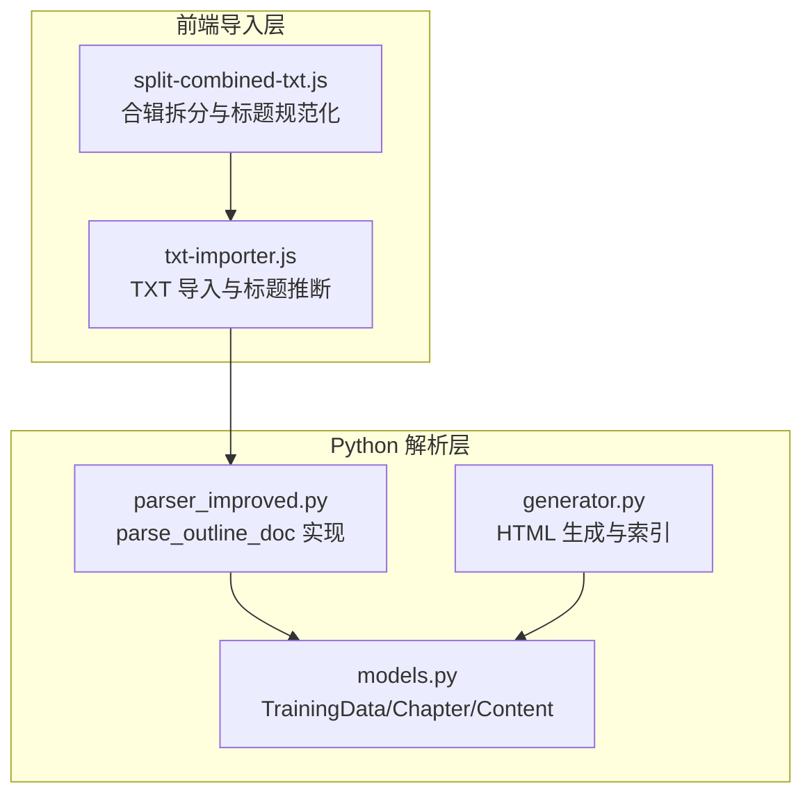
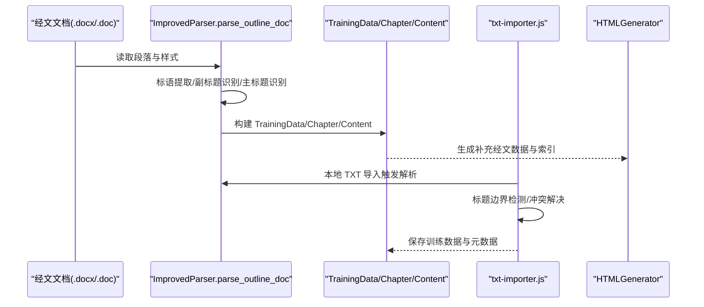
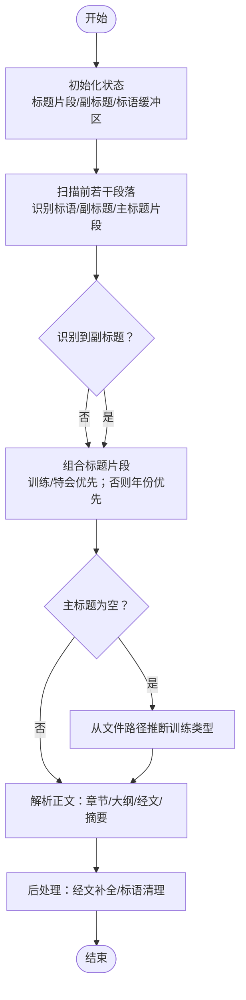
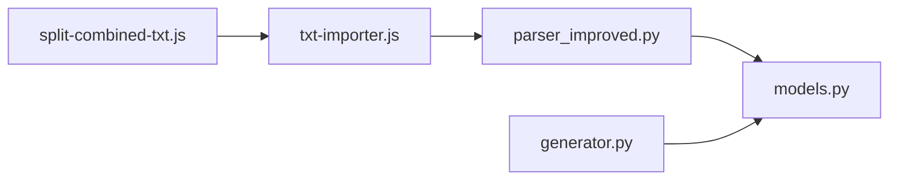

# 训练标题识别与提取

<cite>
**本文引用的文件**
- [parser_improved.py](file://src/parser_improved.py)
- [models.py](file://src/models.py)
- [generator.py](file://src/generator.py)
- [txt-importer.js](file://src/static/js/txt-importer.js)
- [split-combined-txt.js](file://tools/split-combined-txt.js)
</cite>

## 目录
1. [简介](#简介)
2. [项目结构](#项目结构)
3. [核心组件](#核心组件)
4. [架构概览](#架构概览)
5. [详细组件分析](#详细组件分析)
6. [依赖分析](#依赖分析)
7. [性能考量](#性能考量)
8. [故障排查指南](#故障排查指南)
9. [结论](#结论)
10. [附录](#附录)

## 简介
本技术文档聚焦于“训练标题识别与提取”的实现，围绕 parse_outline_doc 函数展开，系统阐述主标题识别、副标题提取、文件路径推断等核心能力，并详细说明三种标题识别策略：基于文本内容的训练类型识别（夏季、秋季、春季、冬季等）、基于时间信息的标题推断、基于文件路径的智能推断。文档还涵盖复杂标题组合处理（多行标题累积、特殊字符处理、标题格式验证）、错误处理与边界情况、标题冲突解决等关键实现细节，帮助读者全面理解并高效使用该功能。

## 项目结构
本项目采用模块化设计，涉及 Python 解析器、数据模型、HTML 生成器以及前端 TXT 导入工具链。与标题识别直接相关的核心文件如下：
- Python 解析器：src/parser_improved.py（包含 parse_outline_doc 主体逻辑）
- 数据模型：src/models.py（定义 TrainingData、Chapter、Content 等结构）
- HTML 生成器：src/generator.py（用于生成补充经文数据与索引）
- 前端 TXT 导入：src/static/js/txt-importer.js（本地 TXT 训练导入与标题推断）
- 合辑拆分工具：tools/split-combined-txt.js（标题规范化与范围提取）

图表来源
- [parser_improved.py:367-782](file://src/parser_improved.py#L367-L782)
- [models.py:9-232](file://src/models.py#L9-L232)
- [generator.py:22-546](file://src/generator.py#L22-L546)
- [txt-importer.js:1644-1849](file://src/static/js/txt-importer.js#L1644-L1849)
- [split-combined-txt.js:56-111](file://tools/split-combined-txt.js#L56-L111)

章节来源
- [parser_improved.py:1-113](file://src/parser_improved.py#L1-L113)
- [models.py:1-232](file://src/models.py#L1-L232)
- [generator.py:1-546](file://src/generator.py#L1-L546)
- [txt-importer.js:1-200](file://src/static/js/txt-importer.js#L1-L200)
- [split-combined-txt.js:1-111](file://tools/split-combined-txt.js#L1-L111)

## 核心组件
- parse_outline_doc：核心解析入口，负责从经文 .docx/.doc 文档中抽取训练主标题、副标题、标语、大纲结构与经文内容。
- TrainingData/Chapter/Content：数据模型，承载训练标题、副标题、章节大纲、经文与摘要等结构化信息。
- HTMLGenerator：生成补充经文数据与搜索索引，支撑前端渲染与检索。
- txt-importer.js：前端本地 TXT 导入，包含标题识别、边界检测、冲突解决与保存流程。
- split-combined-txt.js：合辑拆分与标题规范化，辅助 TXT 导入阶段的标题处理。

章节来源
- [parser_improved.py:367-782](file://src/parser_improved.py#L367-L782)
- [models.py:9-232](file://src/models.py#L9-L232)
- [generator.py:22-546](file://src/generator.py#L22-L546)
- [txt-importer.js:1644-1849](file://src/static/js/txt-importer.js#L1644-L1849)
- [split-combined-txt.js:56-111](file://tools/split-combined-txt.js#L56-L111)

## 架构概览
标题识别与提取贯穿“解析层”和“导入层”，形成“文本识别 → 路径推断 → 标题合并 → 格式验证 → 冲突解决”的闭环。

图表来源
- [parser_improved.py:367-782](file://src/parser_improved.py#L367-L782)
- [models.py:196-232](file://src/models.py#L196-L232)
- [generator.py:383-426](file://src/generator.py#L383-L426)
- [txt-importer.js:1644-1849](file://src/static/js/txt-importer.js#L1644-L1849)

## 详细组件分析

### parse_outline_doc 核心算法
parse_outline_doc 是标题识别与提取的中枢，负责：
- 首段标语与副标题提取：识别“标语”区域、副标题（总题）及其续行，避免与标题重复。
- 主标题识别：从标题片段中寻找包含“训练/特会”的组合，其次选择包含年份的组合，最后回退到文件路径推断。
- 大纲结构解析：依据层级标记（壹、一、1、a、㈠）构建 Content 树。
- 经文与摘要处理：缓存经文、提取读经与诗歌信息、收集职事信息摘录。
- 后处理：从持久化经文字典补全缺失经文，清理标语列表。

图表来源
- [parser_improved.py:388-536](file://src/parser_improved.py#L388-L536)
- [parser_improved.py:537-782](file://src/parser_improved.py#L537-L782)

章节来源
- [parser_improved.py:367-782](file://src/parser_improved.py#L367-L782)

### 标题识别策略详解
- 基于文本内容的训练类型识别
  - 从标题片段中寻找包含“训练/特会”的组合，优先匹配最长且最合理的组合。
  - 示例路径：[parser_improved.py:496-518](file://src/parser_improved.py#L496-L518)
- 基于时间信息的标题推断
  - 若未找到“训练/特会”组合，则尝试匹配包含“年份”的组合，确保年份格式正确。
  - 示例路径：[parser_improved.py:508-518](file://src/parser_improved.py#L508-L518)
- 基于文件路径的智能推断
  - 支持常见训练类型：夏季、秋季、春季、冬季、感恩节、圣诞节、国殇节、新年等。
  - 示例路径：[parser_improved.py:520-535](file://src/parser_improved.py#L520-L535)

章节来源
- [parser_improved.py:496-535](file://src/parser_improved.py#L496-L535)

### 副标题提取与多行累积
- 支持“总题：内容”同行内联格式与分行续行格式。
- 自动识别“总题”行及其后续段落，最多收集若干行，直到遇到目录、章节或标语等终止条件。
- 示例路径：
  - 内联格式处理：[parser_improved.py:438-461](file://src/parser_improved.py#L438-L461)
  - 分行续行格式处理：[parser_improved.py:462-479](file://src/parser_improved.py#L462-L479)
  - 首行特殊处理：[parser_improved.py:481-487](file://src/parser_improved.py#L481-L487)

章节来源
- [parser_improved.py:438-487](file://src/parser_improved.py#L438-L487)

### 多行标题累积与特殊字符处理
- 标题片段累积：在限定范围内收集标题候选，避免过长或明显非标题内容。
- 特殊字符与标点清理：过滤括号、数字、日期、与副标题/标题重复的内容，确保唯一性。
- 示例路径：
  - 标题片段收集与过滤：[parser_improved.py:489-494](file://src/parser_improved.py#L489-L494)
  - 标语区域处理与去重：[parser_improved.py:396-422](file://src/parser_improved.py#L396-L422)

章节来源
- [parser_improved.py:396-494](file://src/parser_improved.py#L396-L494)

### 标题格式验证与边界情况
- 标题长度限制：标题通常较短，避免过长段落被误判。
- 标题重复过滤：避免标语与副标题与标题重复出现。
- 示例路径：
  - 标题长度与重复过滤：[parser_improved.py:489-494](file://src/parser_improved.py#L489-L494)
  - 标语重复过滤：[parser_improved.py:413-421](file://src/parser_improved.py#L413-L421)

章节来源
- [parser_improved.py:413-494](file://src/parser_improved.py#L413-L494)

### 前端 TXT 导入中的标题识别
- 标题边界检测：通过“年份+章节/总题/标语/读经/诗歌”等特征标记统计评分，判断是否为训练 TXT。
- 合辑文件解析：检测多个训练边界，逐个解析并生成训练对象。
- 序号冲突检测与重分配：避免与网络训练或本地导入冲突，自动分配新序号。
- 示例路径：
  - 格式校验与评分：[txt-importer.js:1548-1575](file://src/static/js/txt-importer.js#L1548-L1575)
  - 训练边界检测：[txt-importer.js:1115-1142](file://src/static/js/txt-importer.js#L1115-L1142)
  - 冲突检测与重分配：[txt-importer.js:1584-1642](file://src/static/js/txt-importer.js#L1584-L1642)

章节来源
- [txt-importer.js:1115-1642](file://src/static/js/txt-importer.js#L1115-L1642)

### 合辑拆分与标题规范化
- 标题规范化：去除横线、括号、逗号、顿号、全角空格等干扰字符，保留核心信息。
- 合辑拆分：基于边界检测与范围提取，生成独立训练内容。
- 示例路径：
  - 标题规范化：[split-combined-txt.js:63-65](file://tools/split-combined-txt.js#L63-L65)
  - 合辑拆分与内容组装：[split-combined-txt.js:67-88](file://tools/split-combined-txt.js#L67-L88)

章节来源
- [split-combined-txt.js:63-88](file://tools/split-combined-txt.js#L63-L88)

### 数据模型与输出
- TrainingData：承载训练总题、副标题、年份、季节、标语、章节集合等。
- Chapter：承载篇章编号、标题、大纲、详细内容、经文、摘要、晨兴等。
- Content：内容节点，支持层级标记与子节点嵌套。
- 示例路径：
  - TrainingData/Chapter/Content 定义：[models.py:9-232](file://src/models.py#L9-L232)

章节来源
- [models.py:9-232](file://src/models.py#L9-L232)

## 依赖分析
- parse_outline_doc 依赖：
  - 文档加载与样式映射：[parser_improved.py:16-113](file://src/parser_improved.py#L16-L113)
  - 正则表达式与层级模式：[parser_improved.py:137-276](file://src/parser_improved.py#L137-L276)
  - 数据模型：[models.py:9-232](file://src/models.py#L9-L232)
- 前端导入依赖：
  - 标题边界检测与冲突解决：[txt-importer.js:1115-1642](file://src/static/js/txt-importer.js#L1115-L1642)
  - 经文内联提取：[txt-importer.js:30-51](file://src/static/js/txt-importer.js#L30-L51)
- HTML 生成依赖：
  - 补充经文数据生成：[generator.py:334-373](file://src/generator.py#L334-L373)
  - 搜索索引生成：[generator.py:428-546](file://src/generator.py#L428-L546)

图表来源
- [parser_improved.py:16-113](file://src/parser_improved.py#L16-L113)
- [models.py:9-232](file://src/models.py#L9-L232)
- [generator.py:334-546](file://src/generator.py#L334-L546)
- [txt-importer.js:30-51](file://src/static/js/txt-importer.js#L30-L51)
- [split-combined-txt.js:63-88](file://tools/split-combined-txt.js#L63-L88)

章节来源
- [parser_improved.py:16-113](file://src/parser_improved.py#L16-L113)
- [models.py:9-232](file://src/models.py#L9-L232)
- [generator.py:334-546](file://src/generator.py#L334-L546)
- [txt-importer.js:30-51](file://src/static/js/txt-importer.js#L30-L51)
- [split-combined-txt.js:63-88](file://tools/split-combined-txt.js#L63-L88)

## 性能考量
- 正则表达式预编译：提升匹配效率，减少重复编译开销。
- 文档扫描范围控制：仅扫描前若干段落提取标语与副标题，避免全量扫描。
- 缓存机制：经文缓存与持久化字典结合，减少重复解析与 IO。
- 前端异步处理：导入过程异步化，避免阻塞 UI。
- 合辑拆分优化：基于边界检测与范围切片，减少不必要的全文扫描。

## 故障排查指南
- 无法识别训练类型
  - 检查标题片段是否包含“训练/特会”或年份信息。
  - 若均无，回退到文件路径推断，确认文件名包含常见训练类型关键词。
  - 参考路径：[parser_improved.py:520-535](file://src/parser_improved.py#L520-L535)
- 副标题未提取
  - 确认“总题”行格式是否符合“总题：内容”或分行续行格式。
  - 检查终止条件是否正确（目录、章节、标语等）。
  - 参考路径：[parser_improved.py:438-479](file://src/parser_improved.py#L438-L479)
- 标题冲突
  - 前端导入时发生同一年份同序号不同标题的冲突，系统会自动分配新序号。
  - 参考路径：[txt-importer.js:1584-1642](file://src/static/js/txt-importer.js#L1584-L1642)
- TXT 导入失败
  - 检查文件格式评分是否满足最低阈值，确保包含“第X篇/年份/TOP/总题/标语/读经/诗歌”等特征。
  - 参考路径：[txt-importer.js:1548-1575](file://src/static/js/txt-importer.js#L1548-L1575)

章节来源
- [parser_improved.py:520-535](file://src/parser_improved.py#L520-L535)
- [parser_improved.py:438-479](file://src/parser_improved.py#L438-L479)
- [txt-importer.js:1548-1642](file://src/static/js/txt-importer.js#L1548-L1642)

## 结论
parse_outline_doc 通过“文本内容识别 → 时间信息推断 → 文件路径推断”的三层策略，实现了高鲁棒性的训练标题识别与提取。配合前端 TXT 导入的边界检测与冲突解决机制，以及合辑拆分与标题规范化工具，形成了从文档解析到数据落地的完整链路。该实现兼顾准确性与性能，能够有效处理多行标题累积、特殊字符、边界情况与标题冲突等复杂场景。

## 附录
- 相关实现路径汇总：
  - 主标题识别与副标题提取：[parser_improved.py:388-536](file://src/parser_improved.py#L388-L536)
  - 大纲解析与经文处理：[parser_improved.py:537-782](file://src/parser_improved.py#L537-L782)
  - 前端导入与冲突解决：[txt-importer.js:1548-1642](file://src/static/js/txt-importer.js#L1548-L1642)
  - 合辑拆分与标题规范化：[split-combined-txt.js:63-88](file://tools/split-combined-txt.js#L63-L88)
  - 数据模型定义：[models.py:9-232](file://src/models.py#L9-L232)
  - 补充经文与索引生成：[generator.py:334-546](file://src/generator.py#L334-L546)