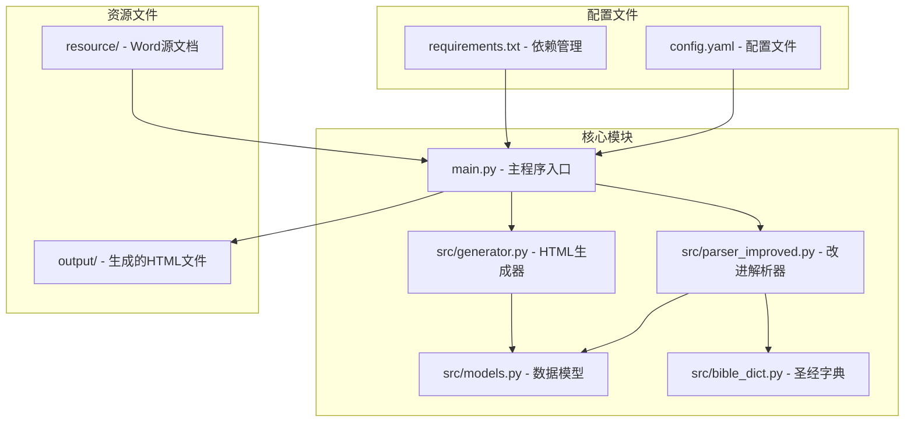
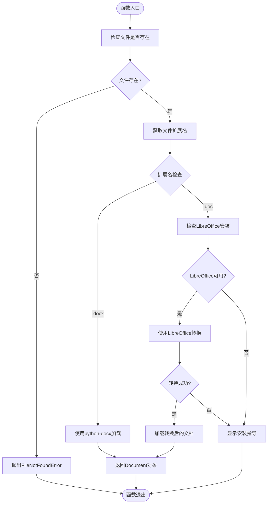
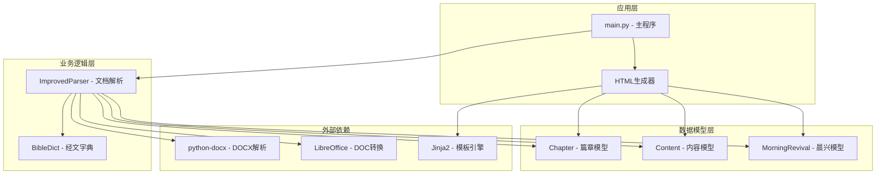
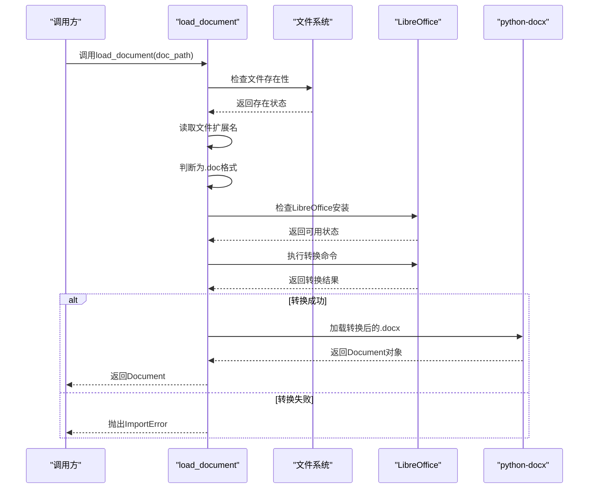
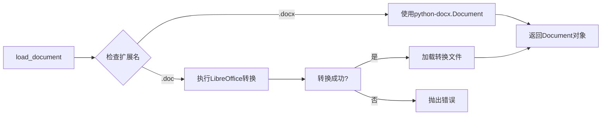
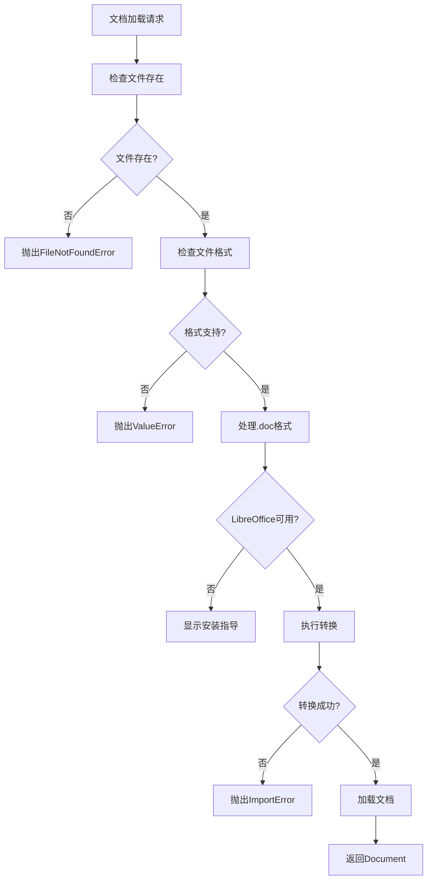
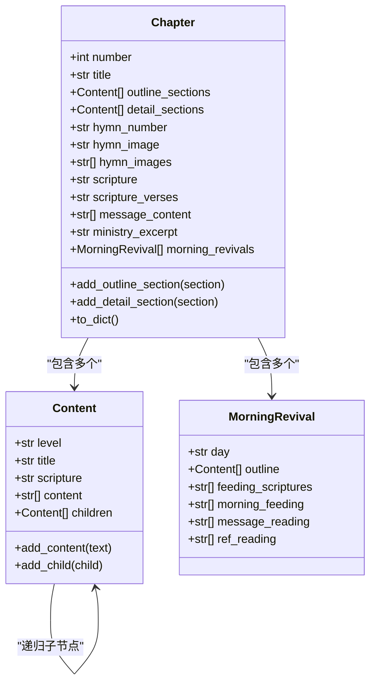

# 文档加载与格式支持

<cite>
**本文档引用的文件**
- [parser_improved.py](file://src/parser_improved.py)
- [models.py](file://src/models.py)
- [bible_dict.py](file://src/bible_dict.py)
- [main.py](file://main.py)
- [requirements.txt](file://requirements.txt)
- [config.yaml](file://config.yaml)
- [README.md](file://README.md)
</cite>

## 目录
1. [简介](#简介)
2. [项目结构](#项目结构)
3. [核心组件](#核心组件)
4. [架构概览](#架构概览)
5. [详细组件分析](#详细组件分析)
6. [依赖分析](#依赖分析)
7. [性能考虑](#性能考虑)
8. [故障排除指南](#故障排除指南)
9. [结论](#结论)

## 简介

本文档详细介绍了项目中的文档加载与格式支持功能，重点解释了ImprovedParser如何处理不同格式的Word文档，包括.doc和.docx格式的自动识别机制、LibreOffice转换流程、错误处理策略。文档还深入分析了load_document函数的实现原理，包括文件存在性检查、扩展名判断、格式转换逻辑、跨平台兼容性处理。

该项目是一个从Word文档自动生成静态HTML网站的工具，专门用于处理特会信息内容。它支持自动检测文档格式、批量处理多个批次、跨平台支持等功能。

## 项目结构

项目采用模块化设计，主要包含以下关键组件：



**图表来源**
- [main.py:1-800](file://main.py#L1-L800)
- [parser_improved.py:1-113](file://src/parser_improved.py#L1-L113)
- [models.py:1-232](file://src/models.py#L1-L232)

**章节来源**
- [README.md:52-88](file://README.md#L52-L88)
- [config.yaml:1-42](file://config.yaml#L1-L42)

## 核心组件

### load_document函数详解

load_document函数是文档加载的核心组件，实现了智能的格式识别和处理机制：

#### 主要功能特性

1. **文件存在性验证**：确保目标文档路径有效
2. **自动格式识别**：基于文件扩展名判断.doc或.docx格式
3. **跨平台转换**：使用LibreOffice处理.doc格式
4. **错误处理**：提供详细的错误信息和解决方案

#### 核心实现逻辑



**图表来源**
- [parser_improved.py:16-113](file://src/parser_improved.py#L16-L113)

#### 跨平台兼容性

系统支持多种操作系统和LibreOffice安装路径：

| 平台 | 命令名称 | 安装路径 |
|------|----------|----------|
| Linux | `libreoffice` | `/usr/bin/libreoffice` |
| macOS | `soffice` | `/Applications/LibreOffice.app/Contents/MacOS/soffice` |
| Windows | `soffice.exe` | `C:\Program Files\LibreOffice\program\soffice.exe` |
| Windows (x86) | `soffice.exe` | `C:\Program Files (x86)\LibreOffice\program\soffice.exe` |

**章节来源**
- [parser_improved.py:16-113](file://src/parser_improved.py#L16-L113)

### ImprovedParser类

ImprovedParser类提供了高级的文档解析功能，支持多种文档格式和复杂的解析策略：

#### 主要功能

1. **样式映射**：支持秋季和夏季两种不同的样式系统
2. **正则表达式解析**：精确识别经文引用和内容结构
3. **层次化内容解析**：支持多层级的大纲结构
4. **经文缓存系统**：优化性能和内存使用

#### 样式映射表

| Word样式 | 含义 | 解析器映射 |
|----------|------|------------|
| 121文章篇题 | 篇章标题 | chapter_title |
| 131文章大点 | 大点（壹贰叁） | section_level1 |
| 132文章中点 | 中点（一二三） | section_level2 |
| 133文章小点 | 小点（1 2 3） | section_level3 |
| 134文章小a点 | 小a点（a b c） | section_level4 |
| 8888文章正文 | 正文内容 | content |
| ０ａ總題 | 篇章标题 | chapter_title |
| 职事信息大標 | 大点 | section_level1 |
| 职事信息中標 | 中点 | section_level2 |
| 职事小标题 | 小点 | section_level3 |
| 信息正文18 | 正文内容 | content |

**章节来源**
- [parser_improved.py:115-135](file://src/parser_improved.py#L115-L135)

## 架构概览

系统采用分层架构设计，确保模块间的松耦合和高内聚：



**图表来源**
- [main.py:14-16](file://main.py#L14-L16)
- [parser_improved.py:115-135](file://src/parser_improved.py#L115-L135)
- [models.py:9-232](file://src/models.py#L9-L232)

## 详细组件分析

### 文档加载流程

#### .doc格式处理流程



**图表来源**
- [parser_improved.py:35-113](file://src/parser_improved.py#L35-L113)

#### .docx格式直接处理

对于.docx格式，系统使用python-docx库直接解析：



**图表来源**
- [parser_improved.py:32-34](file://src/parser_improved.py#L32-L34)

### 错误处理机制

系统实现了多层次的错误处理策略：

#### 主要错误类型

1. **文件不存在错误**：`FileNotFoundError`
2. **格式不支持错误**：`ValueError`
3. **LibreOffice转换超时**：`subprocess.TimeoutExpired`
4. **转换失败**：`ImportError`

#### 错误恢复策略



**图表来源**
- [parser_improved.py:26-113](file://src/parser_improved.py#L26-L113)

**章节来源**
- [parser_improved.py:26-113](file://src/parser_improved.py#L26-L113)

### 数据模型支持

系统使用数据类来表示解析后的文档结构：

#### 章节模型



**图表来源**
- [models.py:40-100](file://src/models.py#L40-L100)
- [models.py:9-26](file://src/models.py#L9-L26)
- [models.py:29-37](file://src/models.py#L29-L37)

**章节来源**
- [models.py:9-232](file://src/models.py#L9-L232)

## 依赖分析

### 核心依赖关系

系统的主要依赖关系如下：

```mermaid
graph TB
subgraph "运行时依赖"
A[python-docx >= 0.8.11]
B[PyYAML >= 6.0]
C[Jinja2 >= 3.1]
D[Pillow >= 10.0]
E[requests >= 2.31.0]
F[beautifulsoup4 >= 4.12.0]
G[lxml >= 4.9.0]
H[playwright >= 1.41.0]
I[cryptography >= 41.0.0]
end
subgraph "可选依赖"
J[pywin32 >= 306 (仅Windows)]
end
subgraph "项目模块"
K[parser_improved.py]
L[models.py]
M[bible_dict.py]
N[generator.py]
end
K --> A
K --> L
K --> M
N --> C
N --> L
N --> K
O[main.py] --> K
O --> N
O --> M
```

**图表来源**
- [requirements.txt:1-16](file://requirements.txt#L1-L16)
- [main.py:14-16](file://main.py#L14-L16)

### 依赖版本要求

| 依赖包 | 最低版本 | 用途 |
|--------|----------|------|
| Python | 3.10+ | 运行时环境 |
| python-docx | 0.8.11 | Word文档解析 |
| PyYAML | 6.0 | 配置文件解析 |
| Jinja2 | 3.1 | HTML模板引擎 |
| Pillow | 10.0 | 图片处理 |
| requests | 2.31.0 | HTTP请求 |
| beautifulsoup4 | 4.12.0 | HTML解析 |
| lxml | 4.9.0 | XML解析 |
| playwright | 1.41.0 | 自动化测试 |

**章节来源**
- [requirements.txt:1-16](file://requirements.txt#L1-L16)

## 性能考虑

### 内存优化策略

1. **延迟加载**：只在需要时加载文档内容
2. **缓存机制**：使用BibleDict缓存经文引用
3. **流式处理**：大文件分块处理
4. **垃圾回收**：及时清理临时文件和对象

### 处理效率优化

1. **并行处理**：支持多批次并发处理
2. **增量更新**：只处理变更的文档
3. **预编译正则**：减少正则表达式编译开销
4. **对象池**：复用解析器实例

## 故障排除指南

### 常见问题及解决方案

#### LibreOffice安装问题

**问题症状**：
- 转换超时或失败
- 报告LibreOffice不可用
- 转换过程卡住

**解决方案**：
1. **手动安装**：从官方网站下载安装LibreOffice
2. **路径配置**：确保LibreOffice在系统PATH中
3. **权限检查**：确认用户有执行权限
4. **版本兼容**：使用最新稳定版本

#### 转换超时处理

**问题症状**：
- LibreOffice转换超时（60秒）
- 程序异常终止

**解决方案**：
1. **增加超时时间**：修改timeout参数
2. **优化文档**：减少文档大小和复杂度
3. **系统资源**：释放内存和CPU资源
4. **重试机制**：实现自动重试逻辑

#### 格式不支持错误

**问题症状**：
- 报告不支持的文件格式
- 扩展名识别失败

**解决方案**：
1. **文件重命名**：确保正确的文件扩展名
2. **格式转换**：使用Microsoft Word手动转换
3. **插件安装**：安装相应的文件格式插件
4. **权限检查**：确认文件读取权限

#### 经文解析错误

**问题症状**：
- 经文引用解析失败
- 经文内容显示异常

**解决方案**：
1. **格式标准化**：统一经文引用格式
2. **字典更新**：更新BibleDict内容
3. **正则调整**：优化经文解析正则表达式
4. **缓存清理**：清除损坏的缓存数据

**章节来源**
- [parser_improved.py:83-113](file://src/parser_improved.py#L83-L113)

### 调试技巧

1. **日志记录**：启用详细日志输出
2. **错误堆栈**：捕获和分析异常堆栈
3. **中间结果**：检查转换过程中的中间文件
4. **性能监控**：监控内存和CPU使用情况

## 结论

本文档详细介绍了项目中文档加载与格式支持功能的实现原理和技术细节。通过load_document函数和ImprovedParser类，系统实现了对.doc和.docx格式的智能识别和处理，提供了完善的跨平台兼容性和错误处理机制。

关键特性包括：
- 自动格式识别和转换
- 跨平台LibreOffice集成
- 完善的错误处理和恢复机制
- 高效的数据模型设计
- 灵活的配置选项

这些功能使得系统能够可靠地处理各种格式的Word文档，为生成高质量的静态HTML网站奠定了坚实的基础。通过合理的架构设计和错误处理策略，系统能够在各种环境下稳定运行，满足不同用户的需求。