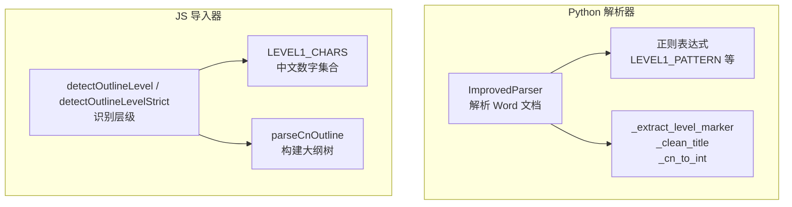
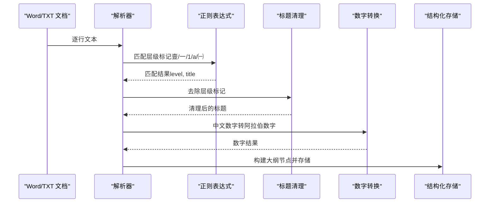
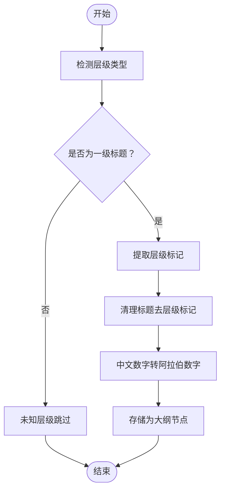
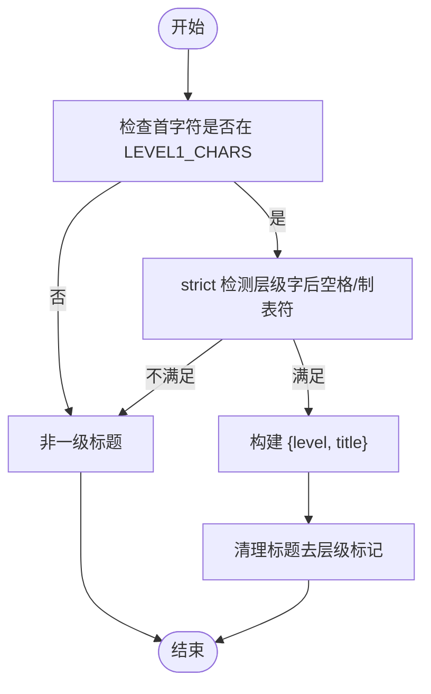
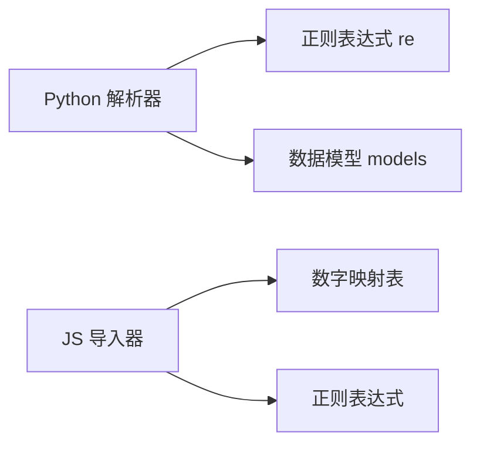

# 一级标题提取（中文数字壹贰叁肆伍陆柒捌玖拾）

<cite>
**本文引用的文件**
- [src/parser_improved.py](file://src/parser_improved.py)
- [src/static/js/txt-importer.js](file://src/static/js/txt-importer.js)
- [README.md](file://README.md)
</cite>

## 目录
1. [简介](#简介)
2. [项目结构](#项目结构)
3. [核心组件](#核心组件)
4. [架构总览](#架构总览)
5. [详细组件分析](#详细组件分析)
6. [依赖关系分析](#依赖关系分析)
7. [性能考量](#性能考量)
8. [故障排查指南](#故障排查指南)
9. [结论](#结论)
10. [附录](#附录)

## 简介
本技术文档聚焦“一级标题提取（中文数字壹贰叁肆伍陆柒捌玖拾）”功能，系统阐述中文数字壹贰叁肆伍陆柒捌玖拾的识别与处理机制，包括：
- 正则表达式 LEVEL1_PATTERN 的实现原理与匹配规则
- 中文数字到阿拉伯数字的转换逻辑
- 标题层级标记的提取算法
- 标题清理、层级验证、异常处理等关键技术点
- 不同格式一级标题的处理示例与边界情况
- 错误恢复与健壮性保障

本功能在 Word 文档解析与本地 TXT 导入两大场景中均有体现，分别由 Python 解析器与 JavaScript 导入器协同完成。

## 项目结构
围绕“一级标题提取”的相关模块与职责如下：
- Python 解析器（Word 文档）：负责从 .doc/.docx 中提取结构化内容，识别并解析以中文数字壹贰叁等开头的一级标题，执行标题清理、层级验证与异常处理。
- JavaScript 导入器（TXT 文本）：负责从本地 TXT 文件中解析大纲层级，识别中文数字壹贰叁等作为一级标题标记，并进行严格层级检测与标题清理。

图表来源
- [src/parser_improved.py](file://src/parser_improved.py)
- [src/static/js/txt-importer.js](file://src/static/js/txt-importer.js)

章节来源
- [README.md:154-183](file://README.md#L154-L183)

## 核心组件
- 正则表达式与层级检测
  - Python：预编译正则 LEVEL1_PATTERN、LEVEL2_PATTERN、LEVEL3_PATTERN 等，用于识别不同层级的标题行。
  - JS：通过 detectOutlineLevel/detectOutlineLevelStrict 严格匹配中文数字壹贰叁作为一级标题标记。
- 标题提取与清理
  - Python：_extract_level_marker 提取层级标记；_clean_title 去除层级标记后的内容。
  - JS：detectOutlineLevel 返回 {level, title}，并进行标题清理。
- 数字转换
  - Python：_cn_to_int 将中文数字字符串转为整数，支持 1-999。
  - JS：cnOrdToInt 将中文序数（如“一”、“十”、“十一”等）转为整数。

章节来源
- [src/parser_improved.py:140-145](file://src/parser_improved.py#L140-L145)
- [src/parser_improved.py:977-992](file://src/parser_improved.py#L977-L992)
- [src/parser_improved.py:2160-2168](file://src/parser_improved.py#L2160-L2168)
- [src/parser_improved.py:2172-2205](file://src/parser_improved.py#L2172-L2205)
- [src/static/js/txt-importer.js:54-57](file://src/static/js/txt-importer.js#L54-L57)
- [src/static/js/txt-importer.js:111-149](file://src/static/js/txt-importer.js#L111-L149)
- [src/static/js/txt-importer.js:75-92](file://src/static/js/txt-importer.js#L75-L92)

## 架构总览
整体流程：输入文本行 → 层级检测 → 标题提取 → 标题清理 → 数字转换 → 结构化存储。

图表来源
- [src/parser_improved.py:946-956](file://src/parser_improved.py#L946-L956)
- [src/parser_improved.py:977-992](file://src/parser_improved.py#L977-L992)
- [src/parser_improved.py:2160-2168](file://src/parser_improved.py#L2160-L2168)
- [src/parser_improved.py:2172-2205](file://src/parser_improved.py#L2172-L2205)
- [src/static/js/txt-importer.js:111-149](file://src/static/js/txt-importer.js#L111-L149)

## 详细组件分析

### Python 解析器中的中文数字识别与处理
- 正则表达式 LEVEL1_PATTERN
  - 作用：识别以中文数字壹贰叁肆伍陆柒捌玖拾开头的一级标题行。
  - 匹配规则：以中文数字字符开头，后接全角/半角空格或制表符，再接标题内容。
  - 关联正则：在 ImprovedParser 类中预编译，用于识别一级标题。
- 标题提取与清理
  - _extract_level_marker：按顺序尝试匹配壹贰叁肆伍陆柒捌玖拾、一二三四五六七八九十、数字、英文字母、括号数字等层级标记。
  - _clean_title：去除开头层级标记及其后空白，保留纯标题文本。
- 中文数字到阿拉伯数字转换
  - _cn_to_int：递归与分治结合，支持“十”“百”“两字缩写”“三字缩写（含零/○）”等格式，输出 1-999 的整数。
- 层级验证与异常处理
  - _detect_level_type：根据行首字符集判定层级类型，若不符合任一层级则返回 unknown。
  - 标题清理与层级验证：在提取后对标题进行清洗，确保层级标记被正确剥离，避免误判。

图表来源
- [src/parser_improved.py:946-956](file://src/parser_improved.py#L946-L956)
- [src/parser_improved.py:977-992](file://src/parser_improved.py#L977-L992)
- [src/parser_improved.py:2160-2168](file://src/parser_improved.py#L2160-L2168)
- [src/parser_improved.py:2172-2205](file://src/parser_improved.py#L2172-L2205)

章节来源
- [src/parser_improved.py:140-145](file://src/parser_improved.py#L140-L145)
- [src/parser_improved.py:946-956](file://src/parser_improved.py#L946-L956)
- [src/parser_improved.py:977-992](file://src/parser_improved.py#L977-L992)
- [src/parser_improved.py:2160-2168](file://src/parser_improved.py#L2160-L2168)
- [src/parser_improved.py:2172-2205](file://src/parser_improved.py#L2172-L2205)

### JS 导入器中的中文数字识别与处理
- 中文数字集合与层级检测
  - LEVEL1_CHARS 定义中文数字壹贰叁肆伍陆柒捌玖拾集合。
  - detectOutlineLevel：识别以壹开头的一级标题，返回 {level, title}。
  - detectOutlineLevelStrict：严格匹配（层级字后必须跟全角空格或 ASCII 空格/制表符），提升鲁棒性。
- 标题清理与层级验证
  - 返回的 title 已去除层级标记，便于后续构建大纲树。
- 数字转换
  - cnOrdToInt：将中文序数（如“一”“十”“十一”等）转为整数，用于周/日等场景。

图表来源
- [src/static/js/txt-importer.js:54-57](file://src/static/js/txt-importer.js#L54-L57)
- [src/static/js/txt-importer.js:111-149](file://src/static/js/txt-importer.js#L111-L149)
- [src/static/js/txt-importer.js:819-849](file://src/static/js/txt-importer.js#L819-L849)
- [src/static/js/txt-importer.js:75-92](file://src/static/js/txt-importer.js#L75-L92)

章节来源
- [src/static/js/txt-importer.js:54-57](file://src/static/js/txt-importer.js#L54-L57)
- [src/static/js/txt-importer.js:111-149](file://src/static/js/txt-importer.js#L111-L149)
- [src/static/js/txt-importer.js:819-849](file://src/static/js/txt-importer.js#L819-L849)
- [src/static/js/txt-importer.js:75-92](file://src/static/js/txt-importer.js#L75-L92)

### 中文数字到阿拉伯数字转换逻辑
- Python 实现（_cn_to_int）
  - 支持“十”“百”“两字缩写”“三字缩写（含零/○）”等格式，递归分解百位/十位/个位，输出 1-999 的整数。
- JS 实现（cnOrdToInt）
  - 支持“一”到“二十”等序数映射，复合数“X十Y”按十位与个位拆分累加。

章节来源
- [src/parser_improved.py:2172-2205](file://src/parser_improved.py#L2172-L2205)
- [src/static/js/txt-importer.js:75-92](file://src/static/js/txt-importer.js#L75-L92)

### 标题层级标记提取算法
- Python
  - _extract_level_marker：按顺序尝试匹配不同层级的正则，返回首个匹配的层级标记。
  - _detect_level_type：根据首字符集快速判定层级类型，便于早期分流。
- JS
  - detectOutlineLevel：识别壹开头的一级标题，支持多字符层级（如“十一”“十二”）。
  - detectOutlineLevelStrict：严格匹配，避免误判。

章节来源
- [src/parser_improved.py:977-992](file://src/parser_improved.py#L977-L992)
- [src/parser_improved.py:946-956](file://src/parser_improved.py#L946-L956)
- [src/static/js/txt-importer.js:111-149](file://src/static/js/txt-importer.js#L111-L149)
- [src/static/js/txt-importer.js:819-849](file://src/static/js/txt-importer.js#L819-L849)

### 标题清理、层级验证与异常处理
- 标题清理
  - Python：_clean_title 去除开头层级标记及其后空白，保留纯标题文本。
  - JS：detectOutlineLevel 返回的 title 已清理层级标记。
- 层级验证
  - Python：_detect_level_type 返回 unknown 时跳过该行，避免误判。
  - JS：detectOutlineLevelStrict 严格校验层级字后空格/制表符，提高准确性。
- 异常处理
  - 对于无法识别的层级或标题格式，解析器采用“跳过并记录”的策略，保证整体流程稳定。

章节来源
- [src/parser_improved.py:2160-2168](file://src/parser_improved.py#L2160-L2168)
- [src/static/js/txt-importer.js:111-149](file://src/static/js/txt-importer.js#L111-L149)
- [src/static/js/txt-importer.js:819-849](file://src/static/js/txt-importer.js#L819-L849)

### 示例与边界情况
- 示例格式
  - “壹 经文的解释”
  - “贰 晨兴的供应”
  - “叁 信息的要点”
- 边界情况
  - 标题行末尾的标点与空格：通过清理函数统一处理。
  - 多字符层级（如“十一”“十二”）：JS 支持多字符匹配；Python 通过正则捕获组处理。
  - 误匹配风险：strict 检测与层级类型快速判定降低误判概率。
  - 数字转换溢出：_cn_to_int 限定 1-999 范围，超出范围的输入将被安全处理或忽略。

章节来源
- [src/static/js/txt-importer.js:121-129](file://src/static/js/txt-importer.js#L121-L129)
- [src/parser_improved.py:2172-2205](file://src/parser_improved.py#L2172-L2205)

## 依赖关系分析
- Python 解析器依赖
  - 正则表达式模块 re：用于层级匹配与清理。
  - 数据模型 models：用于构建 Chapter/Content 结构。
- JS 导入器依赖
  - 自定义映射表 CN_DIGIT_MAP/CN_ORD_MAP：用于中文数字与阿拉伯数字互转。
  - 正则表达式：用于层级检测与标题清理。

图表来源
- [src/parser_improved.py:5-13](file://src/parser_improved.py#L5-L13)
- [src/static/js/txt-importer.js:60-71](file://src/static/js/txt-importer.js#L60-L71)

章节来源
- [src/parser_improved.py:5-13](file://src/parser_improved.py#L5-L13)
- [src/static/js/txt-importer.js:60-71](file://src/static/js/txt-importer.js#L60-L71)

## 性能考量
- 预编译正则表达式：Python 解析器在类初始化时预编译常用正则，减少重复编译开销。
- 早期层级判定：_detect_level_type 快速分流，避免不必要的匹配。
- 严格层级检测：JS 的 strict 检测减少误匹配带来的额外处理成本。
- 字符串清理与映射：通过固定长度映射表与正则替换，控制时间复杂度在 O(n) 级别。

## 故障排查指南
- 常见问题
  - 一级标题未被识别：检查行首是否为中文数字壹贰叁等，且层级字后是否有空格/制表符。
  - 标题残留层级标记：确认 _clean_title 或 detectOutlineLevel 的清理逻辑是否生效。
  - 中文数字转换异常：检查输入是否在支持范围内（1-999），并核对“十”“百”“两字/三字缩写”格式。
- 排查步骤
  - 在 Python 中打印匹配结果与清理后的标题，定位问题行。
  - 在 JS 中启用 strict 检测，观察是否因空格/制表符缺失导致未识别。
  - 核对数字映射表与转换函数，确保输入格式符合预期。

章节来源
- [src/parser_improved.py:946-956](file://src/parser_improved.py#L946-L956)
- [src/parser_improved.py:2160-2168](file://src/parser_improved.py#L2160-L2168)
- [src/static/js/txt-importer.js:819-849](file://src/static/js/txt-importer.js#L819-L849)

## 结论
本功能通过“正则表达式识别 + 标题清理 + 数字转换”的三段式流程，实现了对中文数字壹贰叁肆伍陆柒捌玖拾开头的一级标题的高准确率提取。Python 与 JS 两侧实现相互印证，既保证了跨平台一致性，又提升了健壮性与可维护性。建议在生产环境中结合严格层级检测与层级类型快速判定，进一步降低误判风险。

## 附录
- 相关数据模型与层级映射
  - README 中明确列出“131文章大点”对应“大点（壹贰叁）”为 `<h2>`，体现了一级标题的层级语义。

章节来源
- [README.md:176-179](file://README.md#L176-L179)