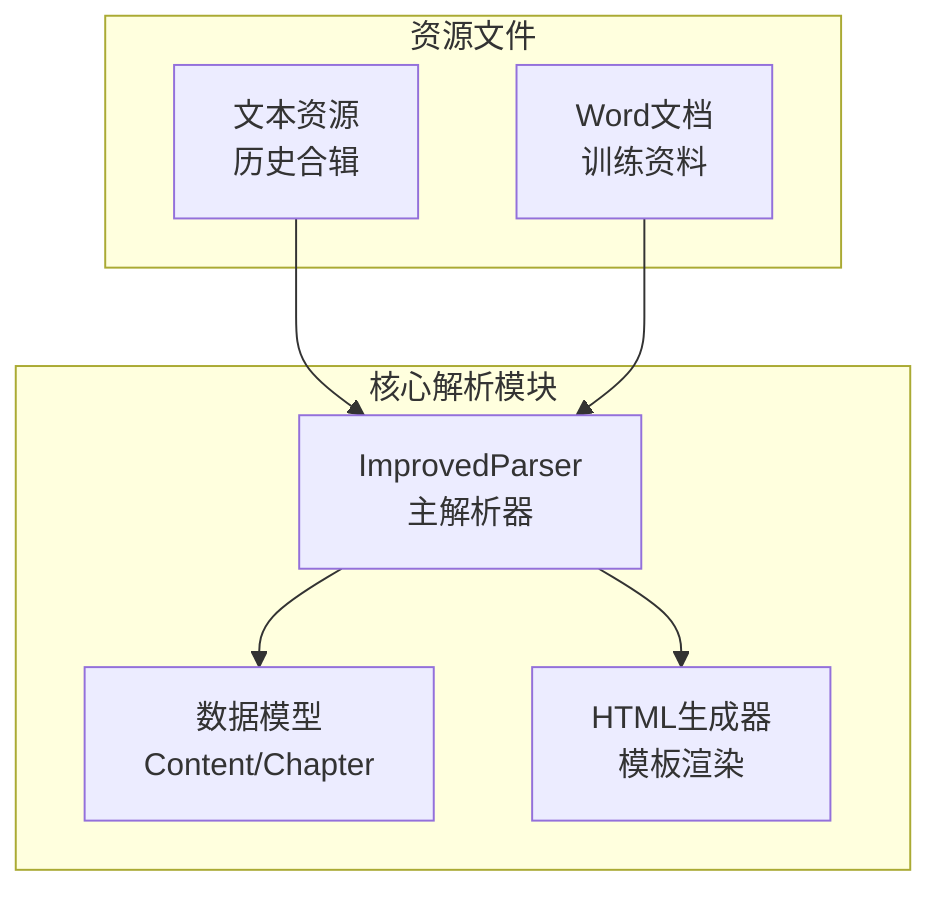
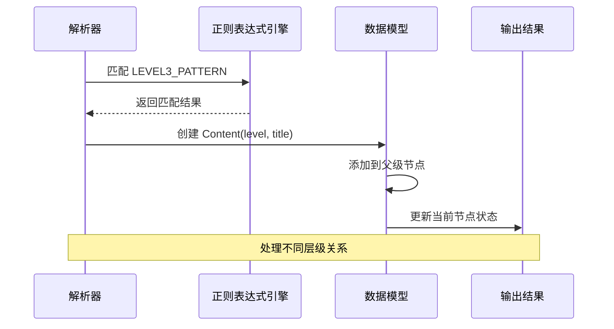
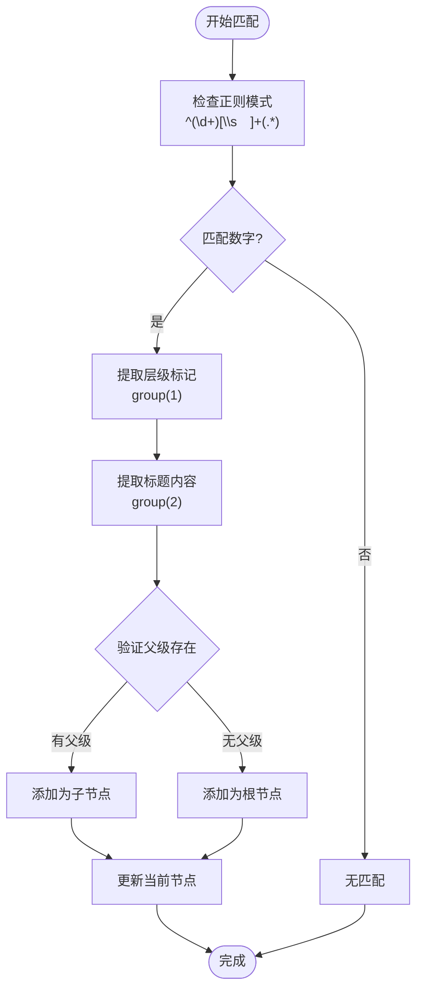
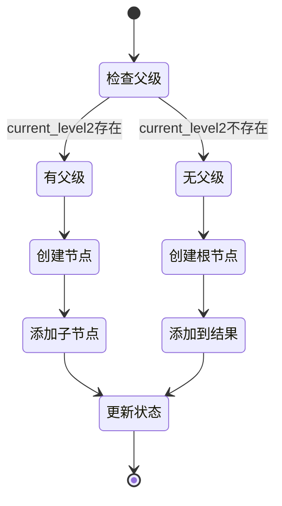
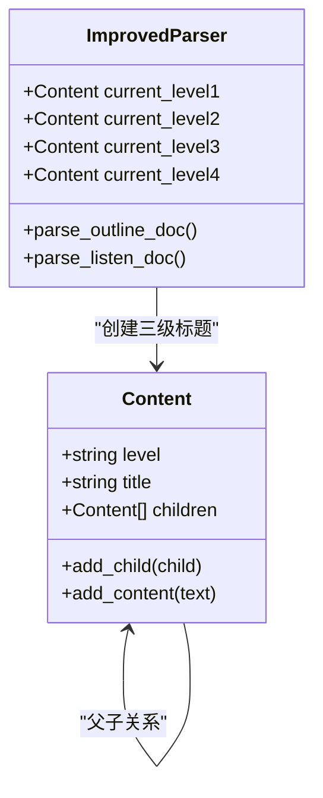
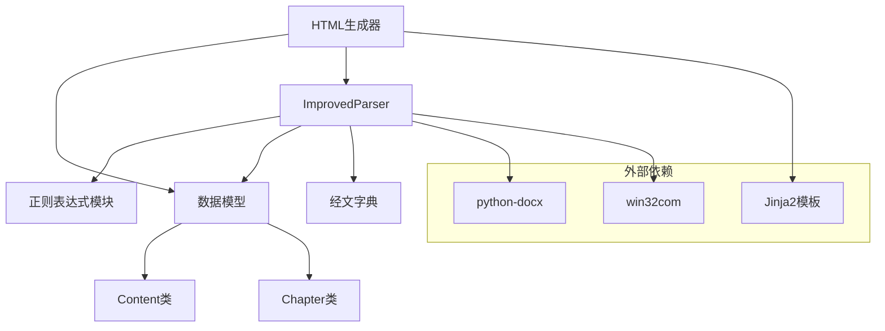

# 三级标题提取（阿拉伯数字）

<cite>
**本文档引用的文件**
- [src/parser_improved.py](file://src/parser_improved.py)
- [src/models.py](file://src/models.py)
- [src/generator.py](file://src/generator.py)
- [resource/历史合辑/2010/2010-03-国殇节特会.txt](file://resource/历史合辑/2010/2010-03-国殇节特会.txt)
</cite>

## 目录
1. [简介](#简介)
2. [项目结构](#项目结构)
3. [核心组件](#核心组件)
4. [架构概览](#架构概览)
5. [详细组件分析](#详细组件分析)
6. [依赖分析](#依赖分析)
7. [性能考虑](#性能考虑)
8. [故障排除指南](#故障排除指南)
9. [结论](#结论)

## 简介
本文档深入解析三级标题提取功能，重点阐述阿拉伯数字层级标记的识别与处理机制。通过对正则表达式 LEVEL3_PATTERN 的实现原理、数字层级标记提取算法、标题层级验证逻辑进行全面分析，详细说明如何正确识别和解析以 1、2、3 等阿拉伯数字开头的标题格式。文档涵盖标题清理、层级验证、与二级标题的关系处理等关键技术点，并提供具体示例展示不同格式的三级标题处理流程。

## 项目结构
该项目采用模块化设计，核心解析逻辑集中在 parser_improved.py 中，数据模型定义在 models.py，HTML 生成逻辑在 generator.py。资源文件位于 resource 目录，包含历史训练文档示例。

**图表来源**
- [src/parser_improved.py:115-142](file://src/parser_improved.py#L115-L142)
- [src/models.py:9-54](file://src/models.py#L9-L54)
- [src/generator.py:22-46](file://src/generator.py#L22-L46)

**章节来源**
- [src/parser_improved.py:1-113](file://src/parser_improved.py#L1-L113)
- [src/models.py:1-54](file://src/models.py#L1-L54)
- [src/generator.py:1-50](file://src/generator.py#L1-L50)

## 核心组件
本功能的核心组件包括：

### 正则表达式模式
- **LEVEL3_PATTERN**: `r'^(\d+)[\s　]+(.*)'`
- **LEVEL2_PATTERN**: `r'^([一二三四五六七八九十]+)[\s]+(.*)'`
- **LEVEL1_PATTERN**: `r'^([壹贰叁肆伍陆柒捌玖拾])[　\s]+(.*)'`

### 关键方法
- `_extract_level_marker()`: 提取层级标识
- `_clean_title()`: 清理标题内容
- `parse_outline_doc()`: 解析大纲文档
- `parse_listen_doc()`: 解析听抄文档

**章节来源**
- [src/parser_improved.py:137-142](file://src/parser_improved.py#L137-L142)
- [src/parser_improved.py:977-992](file://src/parser_improved.py#L977-L992)
- [src/parser_improved.py:2160-2168](file://src/parser_improved.py#L2160-L2168)

## 架构概览
三级标题提取功能采用分层解析架构，通过正则表达式模式匹配实现精确的标题识别。

**图表来源**
- [src/parser_improved.py:1834-1848](file://src/parser_improved.py#L1834-L1848)
- [src/parser_improved.py:707-713](file://src/parser_improved.py#L707-L713)

## 详细组件分析

### 正则表达式实现原理
LEVEL3_PATTERN 使用捕获组实现精确匹配：
- 第一组 `(\d+)`: 匹配阿拉伯数字层级标记
- 第二组 `(.*)`: 匹配标题内容
- 支持多种空白字符：`\s`（普通空格）和 `　`（全角空格）

**图表来源**
- [src/parser_improved.py:1834-1848](file://src/parser_improved.py#L1834-L1848)

### 数字层级标记提取算法
算法通过多步骤验证确保准确性：

1. **模式匹配**: 使用 LEVEL3_PATTERN 精确识别阿拉伯数字开头的标题
2. **父级验证**: 检查是否存在有效的二级标题父级
3. **层级继承**: 自动继承父级的层级关系
4. **状态管理**: 更新当前解析状态

**章节来源**
- [src/parser_improved.py:1834-1848](file://src/parser_improved.py#L1834-L1848)
- [src/parser_improved.py:707-713](file://src/parser_improved.py#L707-L713)

### 标题层级验证逻辑
验证逻辑确保三级标题的正确层级关系：

**图表来源**
- [src/parser_improved.py:1840-1847](file://src/parser_improved.py#L1840-L1847)

### 标题清理机制
_clean_title() 方法负责清理标题内容，移除层级标记：

**章节来源**
- [src/parser_improved.py:2160-2168](file://src/parser_improved.py#L2160-L2168)

### 与二级标题的关系处理
三级标题必须依附于有效的二级标题父级：

**图表来源**
- [src/models.py:9-26](file://src/models.py#L9-L26)
- [src/parser_improved.py:707-713](file://src/parser_improved.py#L707-L713)

**章节来源**
- [src/models.py:9-26](file://src/models.py#L9-L26)
- [src/parser_improved.py:707-713](file://src/parser_improved.py#L707-L713)

### 具体处理示例
基于历史合辑中的实际文档，展示三级标题的处理流程：

**章节来源**
- [resource/历史合辑/2010/2010-03-国殇节特会.txt:1658-1662](file://resource/历史合辑/2010/2010-03-国殇节特会.txt#L1658-L1662)

## 依赖分析
三级标题提取功能的依赖关系如下：

**图表来源**
- [src/parser_improved.py:115-142](file://src/parser_improved.py#L115-L142)
- [src/generator.py:22-46](file://src/generator.py#L22-L46)

**章节来源**
- [src/parser_improved.py:115-142](file://src/parser_improved.py#L115-L142)
- [src/generator.py:22-46](file://src/generator.py#L22-L46)

## 性能考虑
- **正则表达式优化**: 预编译正则表达式减少重复编译开销
- **内存管理**: 及时清理临时状态变量
- **批量处理**: 支持多文档并行解析
- **缓存机制**: 经文内容缓存提升查询效率

## 故障排除指南
常见问题及解决方案：

### 问题1：三级标题未正确识别
**症状**: 阿拉伯数字标题被识别为普通文本
**原因**: 格式不符合 LEVEL3_PATTERN 规范
**解决方案**: 
- 确保标题以数字开头后跟空白字符
- 检查是否有额外的空白字符
- 验证父级二级标题的存在

### 问题2：层级关系错误
**症状**: 三级标题未正确嵌套在二级标题下
**原因**: 缺少有效的二级标题父级
**解决方案**:
- 确保在三级标题之前存在有效的二级标题
- 检查标题格式的连续性
- 验证解析状态的正确更新

### 问题3：标题内容被截断
**症状**: 标题内容显示不完整
**原因**: 标题清理过程中移除了部分内容
**解决方案**:
- 检查 _clean_title() 方法的正则表达式
- 验证标题内容的编码格式
- 确保空白字符的正确处理

**章节来源**
- [src/parser_improved.py:2160-2168](file://src/parser_improved.py#L2160-L2168)
- [src/parser_improved.py:1834-1848](file://src/parser_improved.py#L1834-L1848)

## 结论
三级标题提取功能通过精心设计的正则表达式模式和严格的层级验证逻辑，实现了对阿拉伯数字标题的准确识别和处理。该功能的关键优势在于：

1. **精确匹配**: 使用专门的正则表达式确保标题格式的准确性
2. **层级验证**: 严格的父级检查确保层级关系的正确性
3. **状态管理**: 完善的状态跟踪机制维护解析过程的连续性
4. **扩展性**: 模块化的架构设计便于功能扩展和维护

通过本文档的详细分析，开发者可以深入理解三级标题提取的技术实现，为类似的功能开发提供参考和指导。