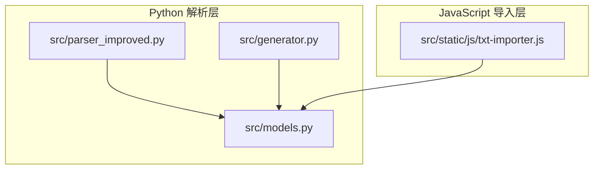
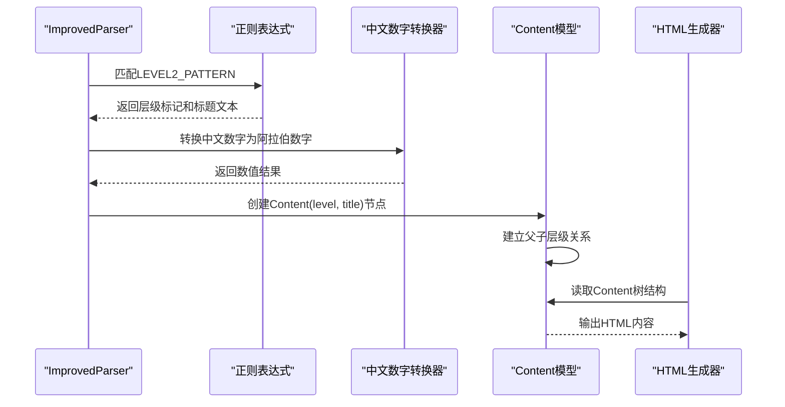
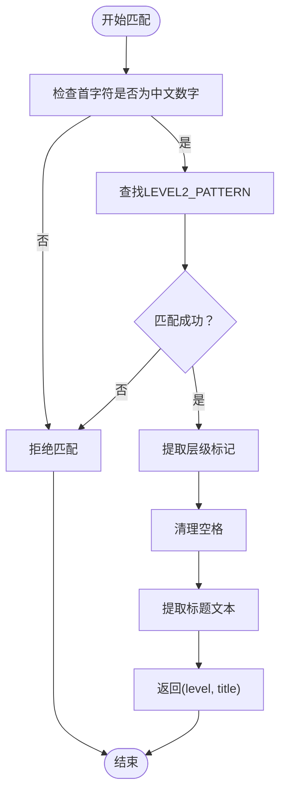
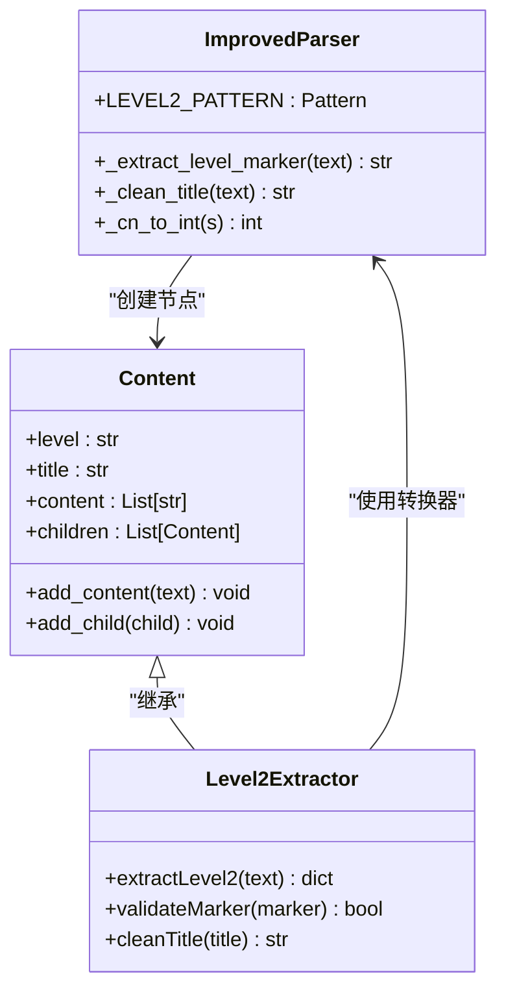
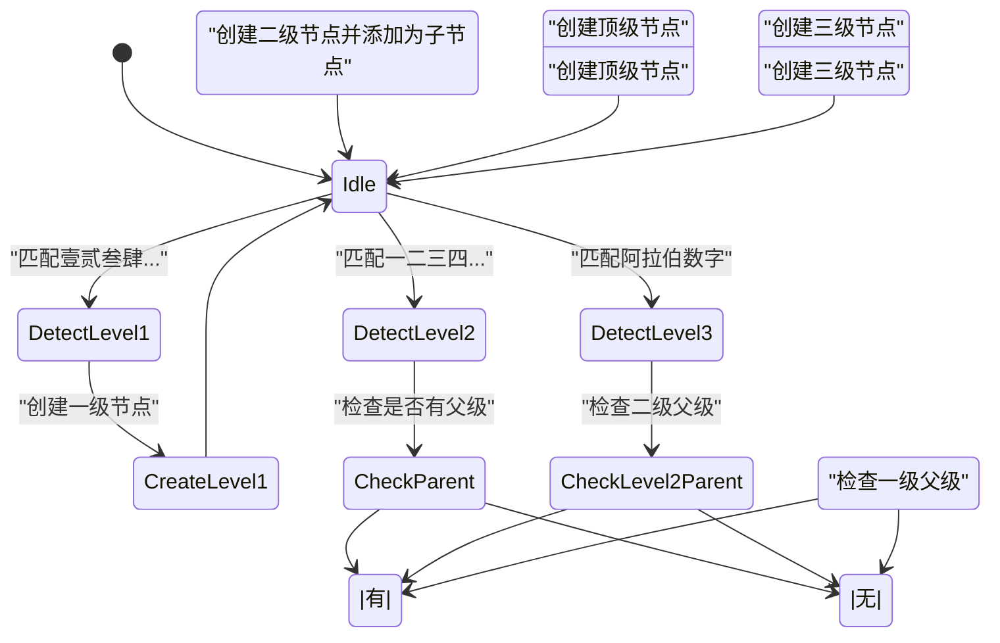
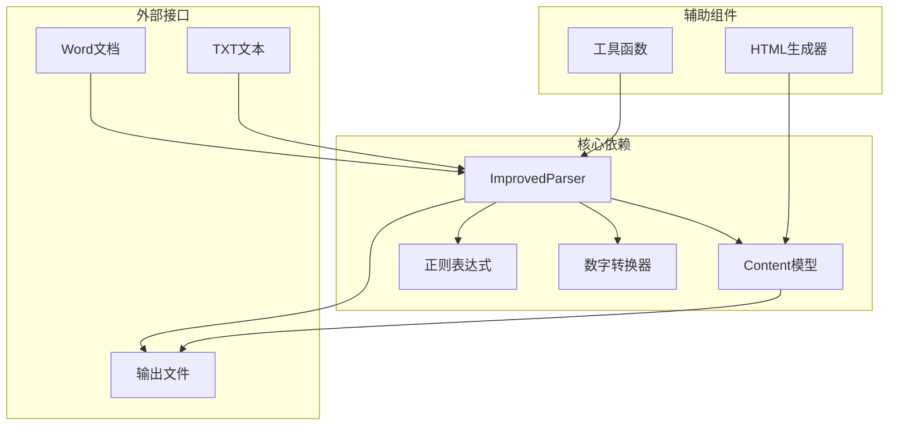

# 二级标题提取（中文数字一二三四五六七八九十）

<cite>
**本文档引用的文件**
- [src/parser_improved.py](file://src/parser_improved.py)
- [src/static/js/txt-importer.js](file://src/static/js/txt-importer.js)
- [src/generator.py](file://src/generator.py)
- [src/models.py](file://src/models.py)
</cite>

## 目录
1. [简介](#简介)
2. [项目结构](#项目结构)
3. [核心组件](#核心组件)
4. [架构概览](#架构概览)
5. [详细组件分析](#详细组件分析)
6. [依赖分析](#依赖分析)
7. [性能考虑](#性能考虑)
8. [故障排除指南](#故障排除指南)
9. [结论](#结论)

## 简介
本文档深入解析项目中"二级标题提取（中文数字一二三四五六七八九十）"功能的技术实现，重点涵盖：
- 正则表达式 LEVEL2_PATTERN 的实现原理与匹配机制
- 中文数字"一二三四五六七八九十"的识别与处理流程
- 中文数字到阿拉伯数字的转换逻辑
- 标题层级标记的提取算法与清理规则
- 与父级标题的层级关系维护与嵌套结构处理
- 不同格式二级标题的处理示例与最佳实践

该功能在 Word 文档解析与 TXT 文本导入两个场景中均有实现，确保对中文数字标题的准确识别与结构化处理。

## 项目结构
该项目采用多语言混合架构，核心解析逻辑位于 Python 模块中，前端导入与展示逻辑位于 JavaScript 模块中。二级标题提取功能横跨以下关键文件：



**图表来源**
- [src/parser_improved.py:1-150](file://src/parser_improved.py#L1-L150)
- [src/static/js/txt-importer.js:1-120](file://src/static/js/txt-importer.js#L1-L120)
- [src/models.py:1-100](file://src/models.py#L1-L100)

**章节来源**
- [src/parser_improved.py:115-146](file://src/parser_improved.py#L115-L146)
- [src/static/js/txt-importer.js:53-72](file://src/static/js/txt-importer.js#L53-L72)
- [src/models.py:9-26](file://src/models.py#L9-L26)

## 核心组件
二级标题提取功能的核心组件包括：

### 1. 正则表达式模式
- **LEVEL2_PATTERN**: 用于匹配以中文数字开头的二级标题
- **LEVEL1_PATTERN**: 用于匹配以大写中文数字开头的一级标题
- **LEVEL3_PATTERN**: 用于匹配以阿拉伯数字开头的三级标题

### 2. 中文数字转换引擎
- `_cn_to_int`: 将中文数字字符串转换为整数
- 支持"十"、"百"、复合数字（如"十一"、"三十七"）等格式
- 支持两位数缩写（如"三八"=38）和三位数缩写（如"一一九"=119）

### 3. 标题提取与清理
- `_extract_level_marker`: 从标题行提取层级标记
- `_clean_title`: 清理标题文本，去除层级标记
- `detectOutlineLevel`: JavaScript 端的标题检测函数

**章节来源**
- [src/parser_improved.py:140-142](file://src/parser_improved.py#L140-L142)
- [src/parser_improved.py:2174-2205](file://src/parser_improved.py#L2174-L2205)
- [src/static/js/txt-importer.js:110-149](file://src/static/js/txt-importer.js#L110-L149)

## 架构概览
二级标题提取功能在不同场景下的工作流程如下：



**图表来源**
- [src/parser_improved.py:698-705](file://src/parser_improved.py#L698-L705)
- [src/parser_improved.py:1818-1832](file://src/parser_improved.py#L1818-L1832)
- [src/generator.py:158-202](file://src/generator.py#L158-L202)

## 详细组件分析

### 正则表达式 LEVEL2_PATTERN 实现
LEVEL2_PATTERN 的设计原则：
- 匹配以中文数字"一二三四五六七八九十百"开头的标题
- 支持数字间的空格（如"十 一" → "十一"）
- 使用 Unicode 空白字符（\u3000）处理全角空格
- 通过捕获组分离层级标记和标题内容



**图表来源**
- [src/parser_improved.py:140-142](file://src/parser_improved.py#L140-L142)
- [src/parser_improved.py:1820-1823](file://src/parser_improved.py#L1820-L1823)

**章节来源**
- [src/parser_improved.py:140-142](file://src/parser_improved.py#L140-L142)
- [src/parser_improved.py:1820-1823](file://src/parser_improved.py#L1820-L1823)

### 中文数字到阿拉伯数字转换逻辑
中文数字转换器支持多种数字格式：

```mermaid
flowchart TD
Input[输入中文数字字符串] --> CheckEmpty{是否为空}
CheckEmpty --> |是| ReturnZero[返回0]
CheckEmpty --> |否| CheckTen{是否为"十"}
CheckTen --> |是| ReturnTen[返回10]
CheckTen --> |否| CheckHundred{是否包含"百"}
CheckHundred --> |是| SplitHundred["按'百'分割"]
SplitHundred --> CalcHundred["计算百位数*100"]
CalcHundred --> RecurseRest["递归处理余数"]
CheckHundred --> |否| CheckTenDigit{是否包含"十"}
CheckTenDigit --> |是| SplitTen["按'十'分割"]
SplitTen --> CalcTens["计算十位数*10"]
CalcTens --> CalcUnits["计算个位数"]
CalcUnits --> SumResult["返回十位+个位"]
CheckTenDigit --> |否| CheckTwoDigit{是否两位数}
CheckTwoDigit --> |是| CalcTwoDigit["计算两位数"]
CheckTwoDigit --> |否| CheckThreeDigit{是否三位数}
CheckThreeDigit --> |是| CalcThreeDigit["计算三位数"]
CheckThreeDigit --> |否| LookupUnit["查索单位数字"]
CalcTwoDigit --> SumResult
CalcThreeDigit --> SumResult
LookupUnit --> SumResult
SumResult --> End[返回结果]
ReturnZero --> End
ReturnTen --> End
RecurseRest --> End
```

**图表来源**
- [src/parser_improved.py:2174-2205](file://src/parser_improved.py#L2174-L2205)

**章节来源**
- [src/parser_improved.py:2174-2205](file://src/parser_improved.py#L2174-L2205)

### 标题层级标记提取算法
标题提取算法的关键步骤：

1. **层级标记提取**：使用正则表达式捕获组提取中文数字标记
2. **空格清理**：移除层级标记中的所有空格和全角空格
3. **标题清理**：移除层级标记后剩余的文本内容
4. **层级验证**：确保提取的层级标记符合预期格式



**图表来源**
- [src/parser_improved.py:698-705](file://src/parser_improved.py#L698-L705)
- [src/models.py:9-26](file://src/models.py#L9-L26)

**章节来源**
- [src/parser_improved.py:698-705](file://src/parser_improved.py#L698-L705)
- [src/models.py:9-26](file://src/models.py#L9-L26)

### 父级标题关系维护与嵌套结构处理
系统通过以下机制维护层级关系：



**图表来源**
- [src/parser_improved.py:698-721](file://src/parser_improved.py#L698-L721)
- [src/parser_improved.py:1818-1857](file://src/parser_improved.py#L1818-L1857)

**章节来源**
- [src/parser_improved.py:698-721](file://src/parser_improved.py#L698-L721)
- [src/parser_improved.py:1818-1857](file://src/parser_improved.py#L1818-L1857)

### JavaScript 端实现对比
JavaScript 端的实现与 Python 端保持一致性：

| 功能特性 | Python 实现 | JavaScript 实现 |
|---------|-------------|----------------|
| 中文数字字符集 | '一二三四五六七八九十百' | '一二三四五六七八九十' |
| 正则匹配 | LEVEL2_PATTERN | LEVEL2_CHARS + 正则表达式 |
| 数字转换 | _cn_to_int | cnOrdToInt |
| 标题检测 | detectOutlineLevel | detectOutlineLevel |
| 层级验证 | levelRank | levelRank |

**章节来源**
- [src/static/js/txt-importer.js:54-57](file://src/static/js/txt-importer.js#L54-L57)
- [src/static/js/txt-importer.js:110-149](file://src/static/js/txt-importer.js#L110-L149)

## 依赖分析
二级标题提取功能的依赖关系：



**图表来源**
- [src/parser_improved.py:115-146](file://src/parser_improved.py#L115-L146)
- [src/generator.py:158-202](file://src/generator.py#L158-L202)

**章节来源**
- [src/parser_improved.py:115-146](file://src/parser_improved.py#L115-L146)
- [src/generator.py:158-202](file://src/generator.py#L158-L202)

## 性能考虑
- **正则表达式优化**：预编译正则表达式减少重复编译开销
- **内存管理**：使用生成器模式处理大型文档
- **缓存机制**：对已转换的数字进行缓存
- **批量处理**：支持批量文档解析提高效率

## 故障排除指南
常见问题及解决方案：

### 1. 中文数字识别失败
**症状**：标题中的中文数字未被正确识别
**原因**：
- 标题格式不符合预期
- 包含特殊字符或空格
- 数字格式超出支持范围

**解决方法**：
- 确保标题以标准中文数字开头
- 移除不必要的空格和特殊字符
- 检查数字格式是否在支持范围内

### 2. 层级关系错误
**症状**：标题层级关系混乱
**原因**：
- 缺少父级标题
- 标题格式不规范
- 解析顺序错误

**解决方法**：
- 确保按照正确的顺序解析标题
- 检查父级标题是否存在
- 验证标题格式的规范性

### 3. 数字转换错误
**症状**：中文数字转换为阿拉伯数字时出现错误
**原因**：
- 数字格式不支持
- 输入字符串包含非法字符
- 转换逻辑异常

**解决方法**：
- 检查输入字符串的合法性
- 验证数字格式的支持范围
- 查看转换器的日志输出

**章节来源**
- [src/parser_improved.py:2174-2205](file://src/parser_improved.py#L2174-L2205)
- [src/parser_improved.py:698-721](file://src/parser_improved.py#L698-L721)

## 结论
二级标题提取功能通过精心设计的正则表达式、完善的中文数字转换逻辑和严格的层级关系维护机制，实现了对中文数字标题的准确识别与结构化处理。该功能在 Word 文档解析和 TXT 文本导入两个场景中均表现出色，为后续的内容生成和展示奠定了坚实基础。

关键优势：
- **准确性**：支持多种中文数字格式和变体
- **完整性**：维护完整的层级关系和嵌套结构
- **一致性**：Python 和 JavaScript 实现保持高度一致
- **可扩展性**：模块化设计便于功能扩展和维护