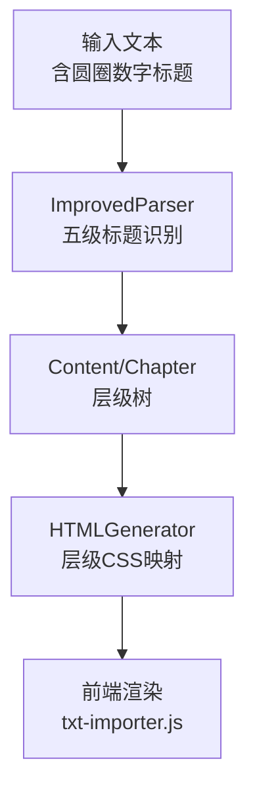
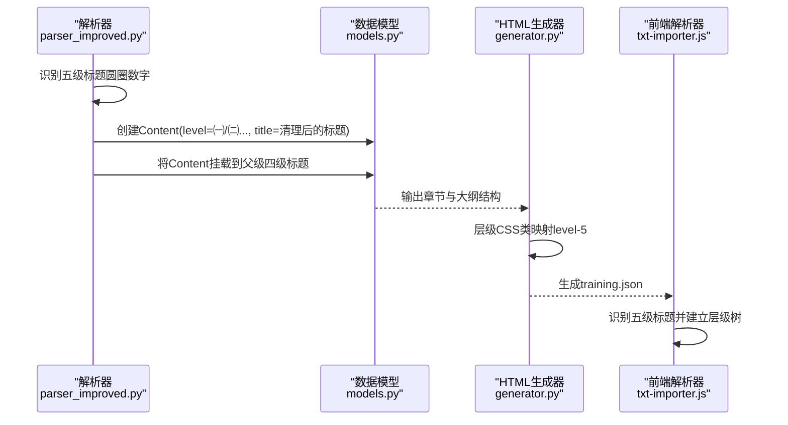
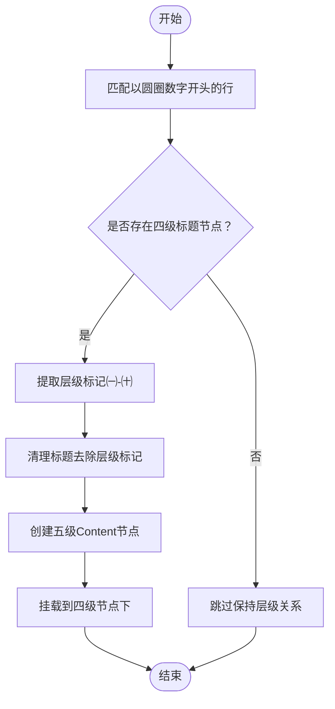
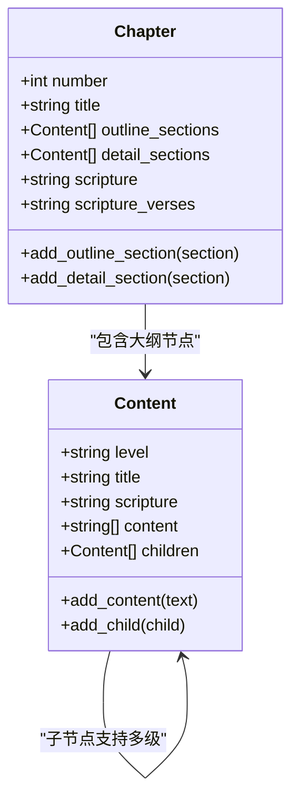
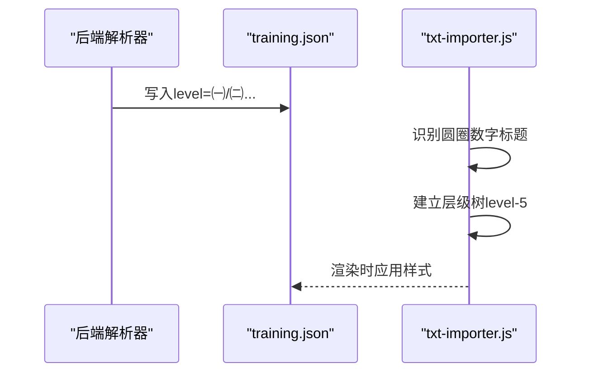
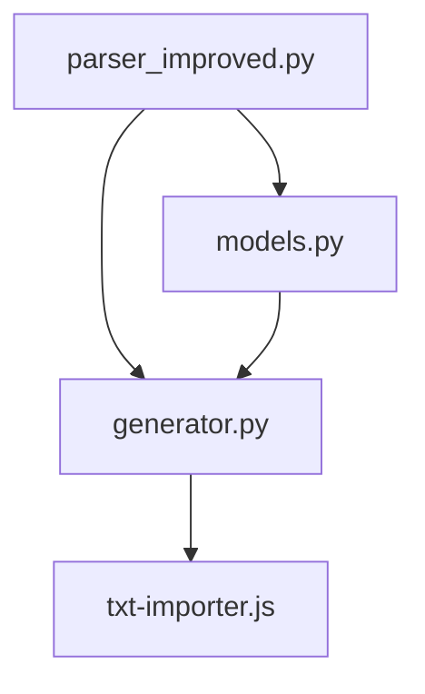

# 五级标题提取（圆圈数字）

<cite>
**本文引用的文件**
- [src/parser_improved.py](file://src/parser_improved.py)
- [src/models.py](file://src/models/models.py)
- [src/generator.py](file://src/generator.py)
- [src/static/js/txt-importer.js](file://src/static/js/txt-importer.js)
</cite>

## 目录
1. [简介](#简介)
2. [项目结构](#项目结构)
3. [核心组件](#核心组件)
4. [架构概览](#架构概览)
5. [详细组件分析](#详细组件分析)
6. [依赖分析](#依赖分析)
7. [性能考虑](#性能考虑)
8. [故障排除指南](#故障排除指南)
9. [结论](#结论)

## 简介
本文档聚焦于“五级标题提取（圆圈数字）”功能，系统阐述如何从文本中识别并解析以圆圈数字（㈠-㈩）开头的五级标题，包括：
- 圆圈数字的识别与处理机制
- Unicode字符㈠-㈩的识别与提取
- 五级标题层级标记的提取算法
- 标题清理与层级验证
- 与四级标题的层级关系维护
- 与前端JS解析器的协同工作

目标是帮助开发者准确理解并扩展该功能，确保在不同格式的输入文本中稳定提取五级标题。

## 项目结构
围绕五级标题提取的关键文件与职责如下：
- src/parser_improved.py：核心解析器，包含五级标题识别、层级标记提取、标题清理等逻辑
- src/models.py：数据模型，定义Content与Chapter结构，承载层级树
- src/generator.py：HTML生成器，负责将解析结果映射为前端可用的数据结构，并处理层级CSS类映射
- src/static/js/txt-importer.js：前端文本导入器，同样支持五级标题识别与层级判定

图表来源
- [src/parser_improved.py](file://src/parser_improved.py)
- [src/models.py](file://src/models.py)
- [src/generator.py](file://src/generator.py)
- [src/static/js/txt-importer.js](file://src/static/js/txt-importer.js)

章节来源
- [src/parser_improved.py](file://src/parser_improved.py)
- [src/models.py](file://src/models.py)
- [src/generator.py](file://src/generator.py)
- [src/static/js/txt-importer.js](file://src/static/js/txt-importer.js)

## 核心组件
- 五级标题识别与提取
  - 通过正则表达式匹配以Unicode圆圈数字（㈠-㈩）开头的行，并提取层级标记与标题文本
  - 仅在四级标题节点存在时进行五级标题的提取，确保层级关系正确
- 标题清理
  - 去除层级标记后的内容，保留纯标题文本
- 层级验证
  - 通过层级检测函数确认当前行属于五级标题
- 数据模型支撑
  - Content与Chapter模型支持层级树的构建与嵌套

章节来源
- [src/parser_improved.py](file://src/parser_improved.py)
- [src/models.py](file://src/models.py)

## 架构概览
五级标题提取贯穿“解析-建模-生成-渲染”的完整链路：

图表来源
- [src/parser_improved.py](file://src/parser_improved.py)
- [src/models.py](file://src/models.py)
- [src/generator.py](file://src/generator.py)
- [src/static/js/txt-importer.js](file://src/static/js/txt-importer.js)

## 详细组件分析

### 五级标题识别与提取（Python解析器）
- 识别规则
  - 使用正则匹配以Unicode圆圈数字开头的行，支持全角括号（\uff08）与标准圆圈数字（㈠-㈩）
  - 仅在当前存在四级标题节点时，才允许提取五级标题，防止层级错乱
- 标题清理
  - 去除层级标记（如㈠、㈡等），保留纯标题文本
- 层级标记提取
  - 从行首提取圆圈数字作为level字段
- 关键实现位置
  - 五级标题识别与挂载：[src/parser_improved.py](file://src/parser_improved.py)
  - 标题清理：[src/parser_improved.py](file://src/parser_improved.py)
  - 层级标记提取：[src/parser_improved.py](file://src/parser_improved.py)

图表来源
- [src/parser_improved.py](file://src/parser_improved.py)

章节来源
- [src/parser_improved.py](file://src/parser_improved.py)

### 数据模型与层级树（Content/Chapter）
- Content模型
  - level：层级标识（如㈠、㈡等）
  - title：标题文本
  - children：子节点列表，支持多级嵌套
- Chapter模型
  - outline_sections：纲目结构（仅标题）
  - detail_sections：详细内容（带段落）
  - 五级标题作为Content的叶子节点加入层级树

图表来源
- [src/models.py](file://src/models.py)

章节来源
- [src/models.py](file://src/models.py)

### HTML生成器与层级CSS映射
- 层级CSS类映射
  - level-5：用于圆圈数字（㈠-㈩）层级
  - 保证前端渲染时正确应用样式
- 生成流程
  - 解析器输出大纲结构
  - 生成器将level映射为CSS类，写入training.json供前端使用

图表来源
- [src/generator.py](file://src/generator.py)

章节来源
- [src/generator.py](file://src/generator.py)

### 前端JS解析器（协同工作）
- 识别规则
  - 支持以圆圈数字（㈠-㈩）开头的行作为五级标题
  - 严格层级判定，确保父子关系正确
- 与后端协同
  - 后端解析生成的training.json中level字段与前端txt-importer.js的识别规则保持一致

图表来源
- [src/static/js/txt-importer.js](file://src/static/js/txt-importer.js)

章节来源
- [src/static/js/txt-importer.js](file://src/static/js/txt-importer.js)

## 依赖分析
- 组件耦合
  - 解析器依赖数据模型构建层级树
  - HTML生成器依赖解析器输出的结构
  - 前端JS解析器依赖后端生成的training.json
- 层级关系
  - 五级标题必须依附于四级标题节点
  - 圆圈数字层级映射为level-5，与前端样式体系一致

图表来源
- [src/parser_improved.py](file://src/parser_improved.py)
- [src/models.py](file://src/models.py)
- [src/generator.py](file://src/generator.py)
- [src/static/js/txt-importer.js](file://src/static/js/txt-importer.js)

章节来源
- [src/parser_improved.py](file://src/parser_improved.py)
- [src/models.py](file://src/models.py)
- [src/generator.py](file://src/generator.py)
- [src/static/js/txt-importer.js](file://src/static/js/txt-importer.js)

## 性能考虑
- 正则匹配效率
  - 使用预编译正则减少重复编译开销
- 层级验证
  - 仅在四级节点存在时处理五级标题，避免不必要的处理
- 数据结构
  - Content采用children列表，支持动态扩展，适合大规模层级树

## 故障排除指南
- 五级标题未被识别
  - 检查行首是否为圆圈数字（㈠-㈩），且存在四级标题节点
  - 确认标题清理逻辑未误删有效内容
- 层级错乱
  - 确保四级标题先行，再提取五级标题
  - 检查HTML生成器的层级CSS映射是否正确
- 前后端不一致
  - 确认training.json中level字段与前端txt-importer.js的识别规则一致

章节来源
- [src/parser_improved.py](file://src/parser_improved.py)
- [src/generator.py](file://src/generator.py)
- [src/static/js/txt-importer.js](file://src/static/js/txt-importer.js)

## 结论
五级标题提取（圆圈数字）通过“识别-清理-验证-建模-映射-渲染”的完整链路，实现了对㈠-㈩圆圈数字标题的稳定提取与层级维护。关键在于：
- 准确识别圆圈数字并提取层级标记
- 在四级标题节点存在时才允许五级标题
- 清理标题文本，保留纯标题
- 与前端JS解析器协同，确保渲染一致性

该机制为后续扩展（如支持更多Unicode层级符号）提供了清晰的实现框架与最佳实践。