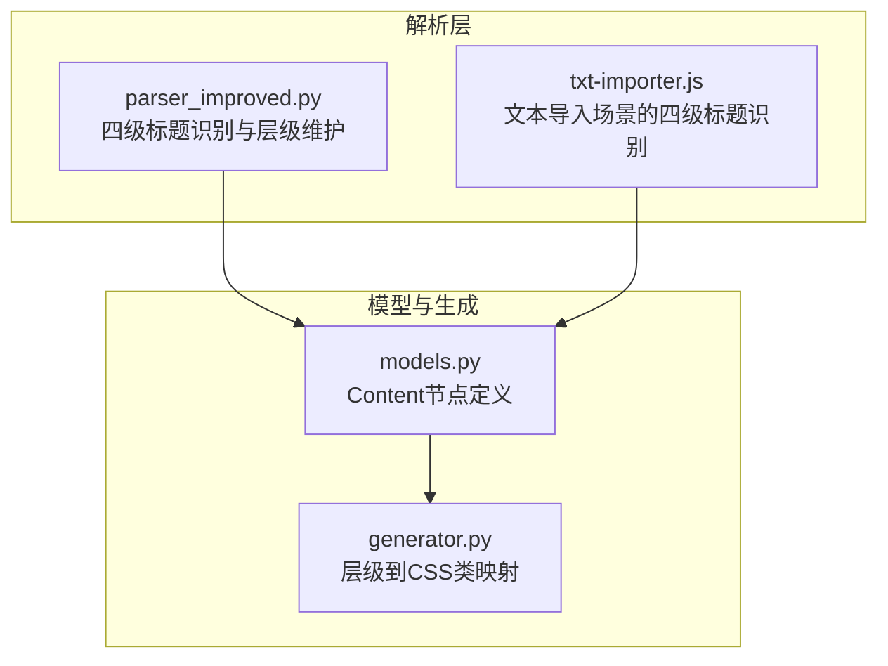
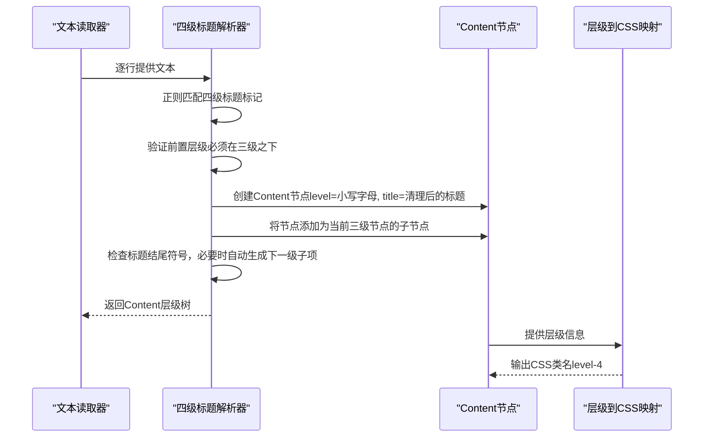
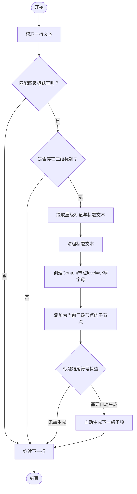
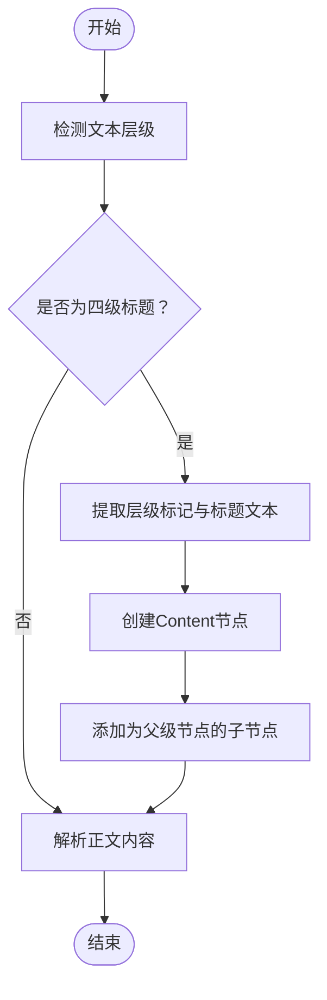
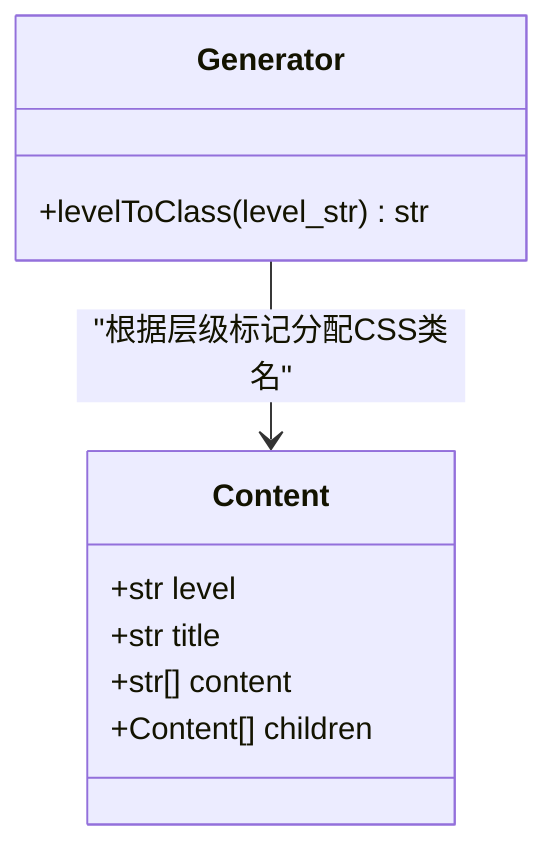
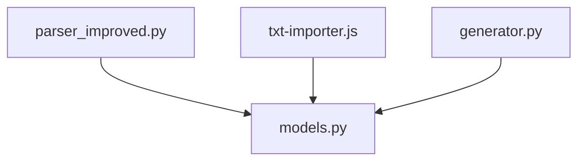

# 四级标题提取（小写字母）

<cite>
**本文档引用的文件**
- [parser_improved.py](file://src/parser_improved.py)
- [txt-importer.js](file://src/static/js/txt-importer.js)
- [generator.py](file://src/generator.py)
- [models.py](file://src/models.py)
</cite>

## 目录
1. [简介](#简介)
2. [项目结构](#项目结构)
3. [核心组件](#核心组件)
4. [架构概览](#架构概览)
5. [详细组件分析](#详细组件分析)
6. [依赖分析](#依赖分析)
7. [性能考虑](#性能考虑)
8. [故障排除指南](#故障排除指南)
9. [结论](#结论)

## 简介
本技术文档聚焦于四级标题提取功能，特别是针对以小写字母（a、b、c...）开头的四级标题识别与处理机制。文档深入解释了小写字母层级标记的提取算法、标题层级标记的验证逻辑、与三级标题的关系处理，以及如何正确识别和解析以a、b、c等小写字母开头的标题格式。同时，文档提供了标题清理、层级验证、嵌套结构处理等关键技术点，并包含字母序列的正确排序和层级关系的维护策略。

## 项目结构
四级标题提取功能涉及三个核心文件：
- Python解析器：负责从文档中识别并解析四级标题，维护层级关系，处理嵌套与续接。
- JavaScript导入器：负责从文本导入场景中识别四级标题，辅助层级判定与内容解析。
- 生成器：负责根据层级标记分配CSS类名，确保前端渲染正确体现层级关系。
- 数据模型：定义Content节点结构，支撑层级树的构建与维护。

**图表来源**
- [parser_improved.py](file://src/parser_improved.py)
- [txt-importer.js](file://src/static/js/txt-importer.js)
- [generator.py](file://src/generator.py)
- [models.py](file://src/models.py)

**章节来源**
- [parser_improved.py](file://src/parser_improved.py)
- [txt-importer.js](file://src/static/js/txt-importer.js)
- [generator.py](file://src/generator.py)
- [models.py](file://src/models.py)

## 核心组件
- 四级标题识别与解析：通过正则表达式匹配以小写字母开头的标题行，并在满足前置层级条件（必须位于三级标题之下）时创建Content节点，将其作为当前三级节点的子节点。
- 标题清理与层级验证：在提取层级标记后，对标题文本进行清理，去除多余空白与标点，确保层级验证逻辑的准确性。
- 嵌套结构处理：当四级标题以特定符号结尾时，自动为其生成下一级子项，实现嵌套结构的自动化维护。
- 层级关系维护：通过current_level3/current_level4等状态变量维护当前层级，确保四级标题始终依附于三级标题。

**章节来源**
- [parser_improved.py](file://src/parser_improved.py)
- [models.py](file://src/models.py)

## 架构概览
四级标题提取的整体流程如下：
- 输入文本逐行扫描，识别各级标题标记。
- 当检测到以小写字母开头的四级标题时，验证其前置层级（必须位于三级标题之下）。
- 提取层级标记与标题文本，创建Content节点并加入当前三级节点的子节点列表。
- 若四级标题以特定符号结尾，自动为其生成下一级子项，维持层级树的完整性。
- 最终输出完整的Content层级树，供后续渲染与导出使用。

**图表来源**
- [parser_improved.py](file://src/parser_improved.py)
- [models.py](file://src/models.py)
- [generator.py](file://src/generator.py)

## 详细组件分析

### 四级标题识别与解析（Python）
- 正则匹配：使用正则表达式匹配以小写字母开头的标题行，确保层级标记与标题文本分离。
- 前置层级验证：仅当存在有效的三级标题时，才允许创建四级标题节点，保证层级关系的合法性。
- 标题清理：对提取的标题文本进行清理，去除多余空白与标点，提升后续处理的稳定性。
- 嵌套结构：当四级标题以特定符号结尾时，自动为其生成下一级子项，维持层级树的完整性。

**图表来源**
- [parser_improved.py](file://src/parser_improved.py)

**章节来源**
- [parser_improved.py](file://src/parser_improved.py)

### 四级标题识别与解析（JavaScript）
- 正则匹配：在文本导入场景中，使用正则表达式匹配以小写字母开头的标题行，确保层级标记与标题文本分离。
- 层级判定：通过levelRank函数对层级标记进行判定，确保小写字母被识别为四级标题。
- 内容解析：将识别到的四级标题与其正文内容进行关联，构建层级树。

**图表来源**
- [txt-importer.js](file://src/static/js/txt-importer.js)

**章节来源**
- [txt-importer.js](file://src/static/js/txt-importer.js)

### 层级到CSS类映射
- 小写字母映射：当层级标记为单个小写字母时，映射到CSS类名"level-4"，确保前端渲染正确体现四级标题的样式。
- 层级优先级：通过层级判定函数，确保不同层级标记被正确分类，避免混淆。

**图表来源**
- [generator.py](file://src/generator.py)
- [models.py](file://src/models.py)

**章节来源**
- [generator.py](file://src/generator.py)
- [models.py](file://src/models.py)

## 依赖分析
四级标题提取功能的关键依赖关系如下：
- parser_improved.py依赖models.py中的Content节点定义，用于构建层级树。
- txt-importer.js在文本导入场景中识别四级标题，与parser_improved.py的逻辑相互补充。
- generator.py依赖Content节点的层级信息，将其映射到CSS类名，确保前端渲染一致性。

**图表来源**
- [parser_improved.py](file://src/parser_improved.py)
- [txt-importer.js](file://src/static/js/txt-importer.js)
- [generator.py](file://src/generator.py)
- [models.py](file://src/models.py)

**章节来源**
- [parser_improved.py](file://src/parser_improved.py)
- [txt-importer.js](file://src/static/js/txt-importer.js)
- [generator.py](file://src/generator.py)
- [models.py](file://src/models.py)

## 性能考虑
- 正则匹配效率：四级标题识别依赖正则表达式匹配，建议优化正则模式以减少回溯，提高处理速度。
- 嵌套结构生成：自动生成下一级子项时，注意控制生成数量，避免层级过深导致内存占用增加。
- 标题清理：在清理标题文本时，尽量减少不必要的字符串操作，提升整体性能。

## 故障排除指南
- 四级标题未被识别：检查前置层级条件，确保四级标题位于三级标题之下；确认正则表达式匹配规则是否正确。
- 嵌套结构异常：检查标题结尾符号的识别逻辑，确保在需要自动生成下一级子项时能够正确触发。
- CSS类名不正确：确认层级标记是否为单个小写字母，确保映射到正确的CSS类名。

**章节来源**
- [parser_improved.py](file://src/parser_improved.py)
- [generator.py](file://src/generator.py)

## 结论
四级标题提取功能通过严格的层级验证与正则匹配，实现了对以小写字母开头的四级标题的准确识别与处理。结合标题清理、嵌套结构自动生成与层级到CSS类的映射，系统能够在多种输入场景中稳定地构建完整的Content层级树，为后续渲染与导出提供可靠的数据基础。