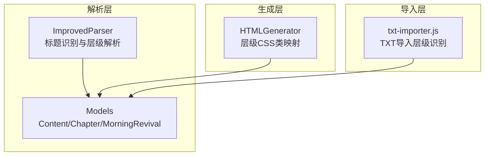
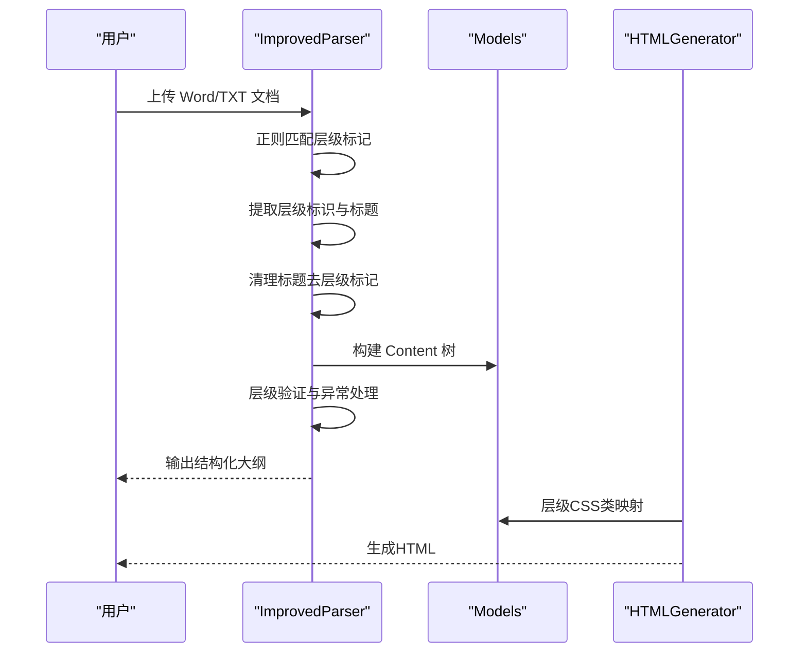
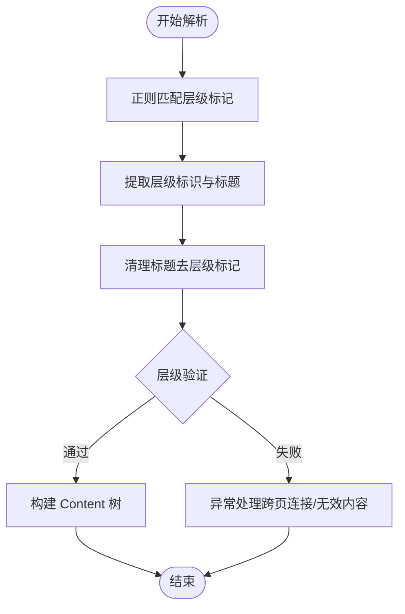
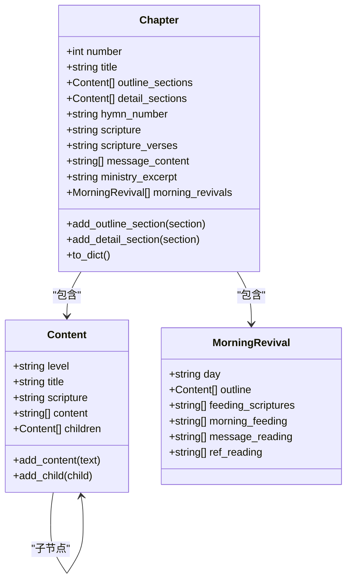
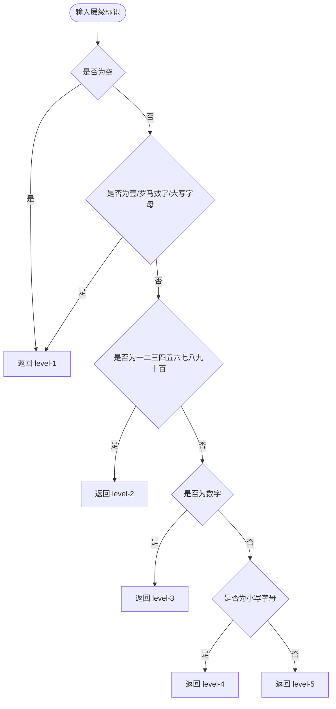
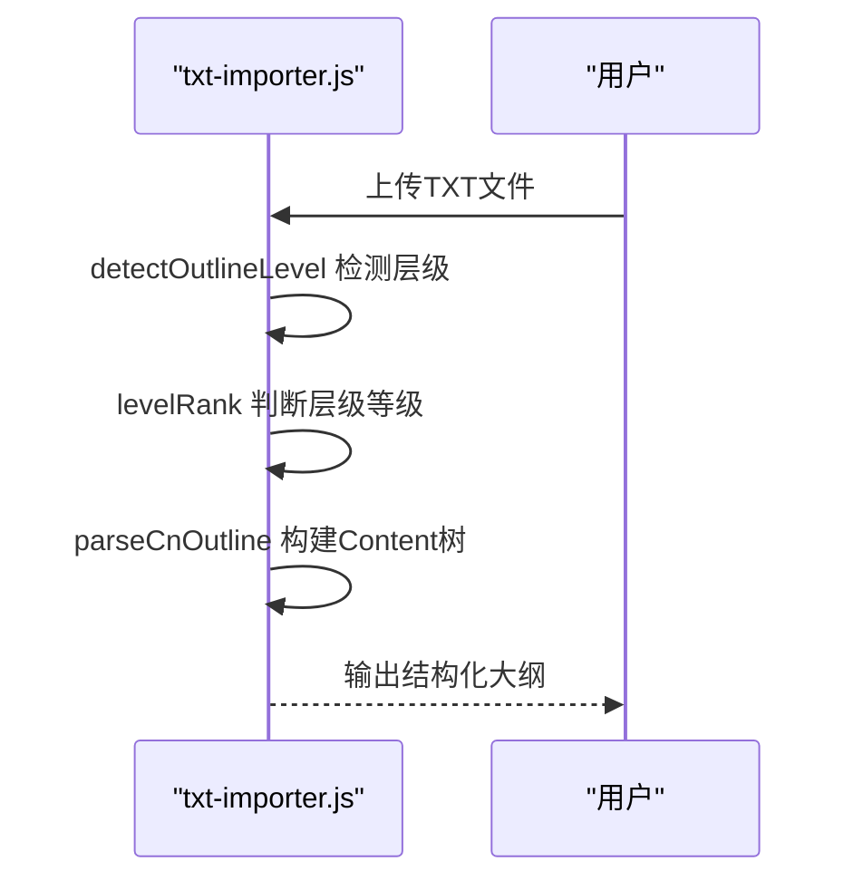
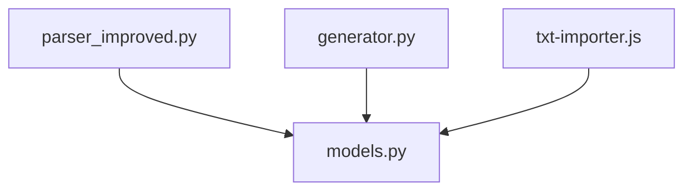

# 标题提取与层级解析

<cite>
**本文档引用的文件**
- [parser_improved.py](file://src/parser_improved.py)
- [models.py](file://src/models.py)
- [generator.py](file://src/generator.py)
- [txt-importer.js](file://src/static/js/txt-importer.js)
</cite>

## 目录
1. [简介](#简介)
2. [项目结构](#项目结构)
3. [核心组件](#核心组件)
4. [架构概览](#架构概览)
5. [详细组件分析](#详细组件分析)
6. [依赖分析](#依赖分析)
7. [性能考量](#性能考量)
8. [故障排查指南](#故障排查指南)
9. [结论](#结论)

## 简介
本技术文档聚焦于“标题提取与层级解析”功能，系统阐述中文训练材料中多层次标题的识别与组织机制。文档涵盖：
- 正则表达式模式匹配策略
- 中文数字转换与层级标记提取
- 不同层级标题的识别规则（level1 壹贰叁肆伍陆柒捌玖拾；level2 一二三四五六七八九十；level3 数字；level4 小写字母；level5 圆圈数字）
- 标题清理、层级验证、异常处理等关键技术点
- 具体代码示例路径与实现细节

## 项目结构
本功能涉及的核心文件与职责如下：
- parser_improved.py：提供 Word 文档解析、标题识别、层级提取、标题清理、中文数字转换、层级验证与异常处理
- models.py：定义 Content、Chapter、MorningRevival 等数据模型，支撑层级树结构
- generator.py：提供层级 CSS 类映射与层级验证逻辑，确保层级与样式一致性
- txt-importer.js：提供纯文本导入场景下的层级识别与解析流程，与 Python 实现保持一致

图表来源
- [parser_improved.py:115-284](file://src/parser_improved.py#L115-L284)
- [models.py:9-100](file://src/models.py#L9-L100)
- [generator.py:22-203](file://src/generator.py#L22-L203)
- [txt-importer.js:169-203](file://src/static/js/txt-importer.js#L169-L203)

章节来源
- [parser_improved.py:115-284](file://src/parser_improved.py#L115-L284)
- [models.py:9-100](file://src/models.py#L9-L100)
- [generator.py:22-203](file://src/generator.py#L22-L203)
- [txt-importer.js:169-203](file://src/static/js/txt-importer.js#L169-L203)

## 核心组件
- ImprovedParser：负责 Word 文档解析、标题识别、层级提取、标题清理、中文数字转换、层级验证与异常处理
- Content/Chapter/MorningRevival：数据模型，承载层级树结构与内容
- HTMLGenerator：提供层级到 CSS 类的映射，确保层级与样式一致性
- txt-importer.js：提供纯文本导入场景下的层级识别与解析流程

章节来源
- [parser_improved.py:115-284](file://src/parser_improved.py#L115-L284)
- [models.py:9-100](file://src/models.py#L9-L100)
- [generator.py:22-203](file://src/generator.py#L22-L203)
- [txt-importer.js:169-203](file://src/static/js/txt-importer.js#L169-L203)

## 架构概览
标题提取与层级解析的整体流程如下：
- 输入：Word 文档或 TXT 文本
- 解析：基于正则表达式识别不同层级标记，提取层级标识与标题文本
- 清理：去除层级标记，保留纯标题文本
- 组织：构建 Content 树，按层级关系建立父子节点
- 验证：校验层级合法性与父子关系约束
- 异常处理：处理跨页连接、标题续接、空行与无效内容

图表来源
- [parser_improved.py:686-730](file://src/parser_improved.py#L686-L730)
- [parser_improved.py:2160-2168](file://src/parser_improved.py#L2160-L2168)
- [models.py:9-26](file://src/models.py#L9-L26)
- [generator.py:158-202](file://src/generator.py#L158-L202)

## 详细组件分析

### 标题识别与层级提取（ImprovedParser）
- 正则表达式模式匹配
  - level1（壹贰叁肆伍陆柒捌玖拾）：匹配“壹、贰、叁…”等大点标记
  - level2（一二三四五六七八九十）：匹配“一、二、三…”等中点标记，支持多字符如“十一”
  - level3（数字）：匹配“1、2、3…”等小点标记
  - level4（小写字母）：匹配“a、b、c…”等细纲标记
  - level5（圆圈数字）：匹配“㈠、㈡、㈢…”等更细纲标记
- 层级标记提取
  - 使用 _extract_level_marker 方法，按优先级匹配上述模式，返回层级标识
- 标题清理
  - 使用 _clean_title 方法，去除层级标记，保留纯标题文本
- 层级验证
  - 通过父子节点关系与层级顺序进行验证，确保层级合法
- 异常处理
  - 跨页连接与标题续接：_should_merge_with_previous 判断是否合并
  - 职事信息有效性：_is_valid_ministry_text 过滤无效内容

图表来源
- [parser_improved.py:977-993](file://src/parser_improved.py#L977-L993)
- [parser_improved.py:2160-2168](file://src/parser_improved.py#L2160-L2168)
- [parser_improved.py:2092-2158](file://src/parser_improved.py#L2092-L2158)
- [parser_improved.py:2516-2550](file://src/parser_improved.py#L2516-L2550)

章节来源
- [parser_improved.py:977-993](file://src/parser_improved.py#L977-L993)
- [parser_improved.py:2160-2168](file://src/parser_improved.py#L2160-L2168)
- [parser_improved.py:2092-2158](file://src/parser_improved.py#L2092-L2158)
- [parser_improved.py:2516-2550](file://src/parser_improved.py#L2516-L2550)

### 数据模型（Content/Chapter/MorningRevival）
- Content：承载层级标识、标题、经文引用、正文段落与子节点
- Chapter：承载篇章编号、标题、纲目结构、详细内容、诗歌编号、经文引用、职事信息摘录、晨读内容等
- MorningRevival：承载按天的晨兴纲目、喂养经文、晨兴喂养、信息选读、参读

图表来源
- [models.py:9-100](file://src/models.py#L9-L100)
- [models.py:196-232](file://src/models.py#L196-L232)

章节来源
- [models.py:9-100](file://src/models.py#L9-L100)
- [models.py:196-232](file://src/models.py#L196-L232)

### 层级到CSS类映射（HTMLGenerator）
- 根据层级标识判断应使用的 CSS 类名：
  - level1：壹、罗马数字、大写字母 → level-1
  - level2：一二三四五六七八九十百 → level-2
  - level3：数字 → level-3
  - level4：小写字母 → level-4
  - level5：圆圈数字 → level-5

图表来源
- [generator.py:158-202](file://src/generator.py#L158-L202)

章节来源
- [generator.py:158-202](file://src/generator.py#L158-L202)

### 纯文本导入层级识别（txt-importer.js）
- 字符集定义：LEVEL1_CHARS、LEVEL2_CHARS、LEVEL3_FW、LEVEL5_CHARS
- 检测层级：detectOutlineLevel
- 层级等级：levelRank
- 解析流程：parseCnOutline

图表来源
- [txt-importer.js:110-149](file://src/static/js/txt-importer.js#L110-L149)
- [txt-importer.js:151-167](file://src/static/js/txt-importer.js#L151-L167)
- [txt-importer.js:169-203](file://src/static/js/txt-importer.js#L169-L203)

章节来源
- [txt-importer.js:110-149](file://src/static/js/txt-importer.js#L110-L149)
- [txt-importer.js:151-167](file://src/static/js/txt-importer.js#L151-L167)
- [txt-importer.js:169-203](file://src/static/js/txt-importer.js#L169-L203)

## 依赖分析
- ImprovedParser 依赖 models.Content/Chapter/MorningRevival 构建层级树
- HTMLGenerator 依赖 models 与 ImprovedParser 的层级映射
- txt-importer.js 与 Python 实现保持一致的层级识别逻辑

图表来源
- [parser_improved.py:11-13](file://src/parser_improved.py#L11-L13)
- [generator.py:9-11](file://src/generator.py#L9-L11)
- [txt-importer.js:19-26](file://src/static/js/txt-importer.js#L19-L26)

章节来源
- [parser_improved.py:11-13](file://src/parser_improved.py#L11-L13)
- [generator.py:9-11](file://src/generator.py#L9-L11)
- [txt-importer.js:19-26](file://src/static/js/txt-importer.js#L19-L26)

## 性能考量
- 正则表达式预编译：在 ImprovedParser 中预编译常用正则，减少重复编译开销
- 层级匹配顺序：按优先级匹配，避免不必要的回溯
- 标题清理与层级验证：在构建树过程中同步进行，降低二次遍历成本
- 跨页连接判断：通过缩进与标点特征快速判断，减少无效合并

## 故障排查指南
- 标题未正确识别
  - 检查层级标记是否符合规范（如“拾壹”应去除空格）
  - 确认正则表达式是否匹配目标格式
- 层级顺序错误
  - 确保父节点存在后再创建子节点
  - 使用层级验证逻辑检查父子关系
- 跨页连接问题
  - 检查 _should_merge_with_previous 的缩进与标点判断
  - 确认标题续接是否以完整句子标点结尾
- 职事信息无效内容
  - 使用 _is_valid_ministry_text 过滤下划线过多或过短的文本

章节来源
- [parser_improved.py:2092-2158](file://src/parser_improved.py#L2092-L2158)
- [parser_improved.py:2516-2550](file://src/parser_improved.py#L2516-L2550)

## 结论
标题提取与层级解析功能通过正则表达式模式匹配、中文数字转换与层级标记提取，实现了对多层次文档结构的准确识别与组织。结合标题清理、层级验证与异常处理，确保了输出结构的完整性与一致性。HTMLGenerator 的层级 CSS 类映射进一步保证了层级与样式的一致性，而 txt-importer.js 则提供了纯文本导入场景下的等效实现，满足多样化的数据来源需求。