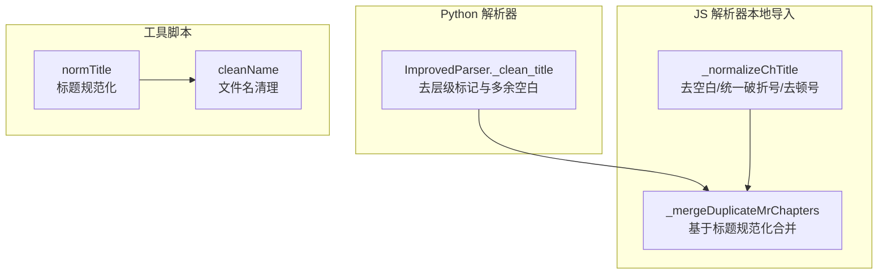
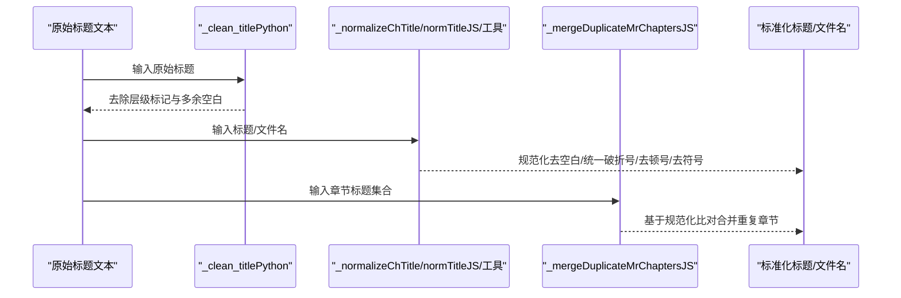
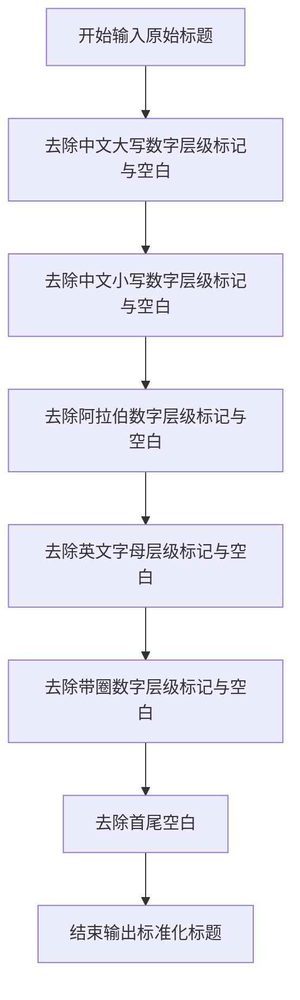
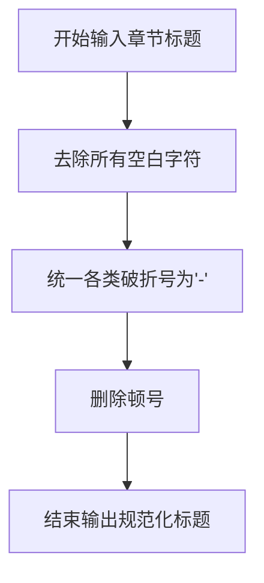
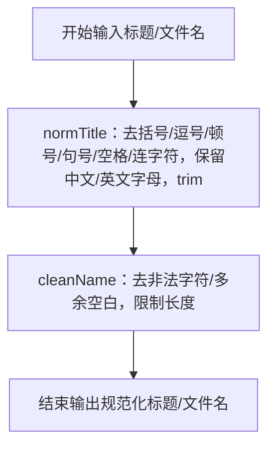
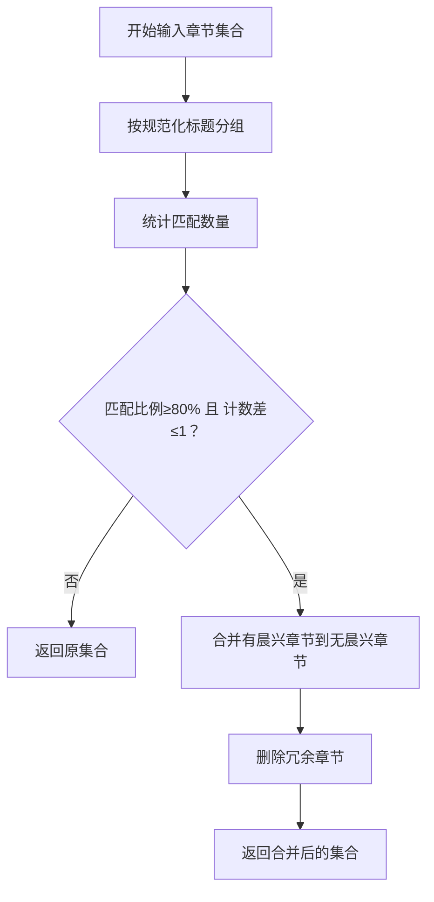
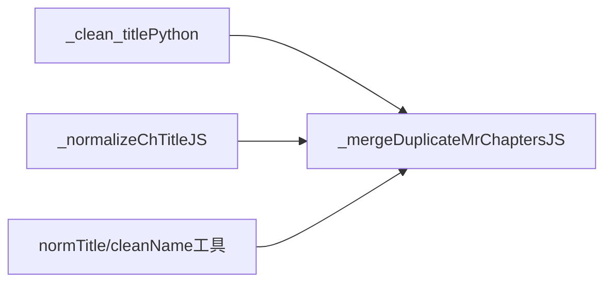

# 标题清理与标准化

<cite>
**本文引用的文件**
- [src/parser_improved.py](file://src/parser_improved.py)
- [src/static/js/txt-importer.js](file://src/static/js/txt-importer.js)
- [tools/split-combined-txt.js](file://tools/split-combined-txt.js)
</cite>

## 目录
1. [简介](#简介)
2. [项目结构](#项目结构)
3. [核心组件](#核心组件)
4. [架构概览](#架构概览)
5. [详细组件分析](#详细组件分析)
6. [依赖分析](#依赖分析)
7. [性能考虑](#性能考虑)
8. [故障排查指南](#故障排查指南)
9. [结论](#结论)

## 简介
本技术文档聚焦“标题清理与标准化”能力，系统性阐述在多语言、多格式输入场景下，如何将原始标题文本清洗为统一、规范、可比较的标准格式。重点围绕以下目标展开：
- 去除层级标记（如“壹”“一”“1”“a”“㈠”等）及其后跟随的空白字符
- 统一空白字符（空格、全角空格、不间断空格等）为单个普通空格
- 规范化标点与连接符（统一破折号、删除顿号等）
- 保证边界情况与格式一致性，确保不同来源的标题在下游比对、合并、命名时保持稳定

## 项目结构
本仓库涉及标题清理与标准化的关键实现分布在三处：
- Python 解析器：提供核心的标题清理方法与正则表达式
- JavaScript 解析器（前端/本地导入）：提供章节标题规范化与合并比对
- 工具脚本：对历史合辑进行标题规范化与文件命名

图表来源
- [src/parser_improved.py:2160-2168](file://src/parser_improved.py#L2160-L2168)
- [src/static/js/txt-importer.js:464-466](file://src/static/js/txt-importer.js#L464-L466)
- [src/static/js/txt-importer.js:474-520](file://src/static/js/txt-importer.js#L474-L520)
- [tools/split-combined-txt.js:63-65](file://tools/split-combined-txt.js#L63-L65)
- [tools/split-combined-txt.js:108-110](file://tools/split-combined-txt.js#L108-L110)

章节来源
- [src/parser_improved.py:2160-2168](file://src/parser_improved.py#L2160-L2168)
- [src/static/js/txt-importer.js:464-466](file://src/static/js/txt-importer.js#L464-L466)
- [src/static/js/txt-importer.js:474-520](file://src/static/js/txt-importer.js#L474-L520)
- [tools/split-combined-txt.js:63-65](file://tools/split-combined-txt.js#L63-L65)
- [tools/split-combined-txt.js:108-110](file://tools/split-combined-txt.js#L108-L110)

## 核心组件
- Python 标题清理方法：_clean_title
  - 功能：去除标题开头的层级标记（中文大写数字、中文小写数字、阿拉伯数字、英文字母、带圈数字）及其后空白
  - 输出：去除层级标记与多余空白后的标准标题
- JS 章节标题规范化：_normalizeChTitle
  - 功能：去除空白、统一各类破折号为“-”、删除顿号
  - 输出：可用于章节标题比对的规范化字符串
- 工具脚本标题规范化：normTitle
  - 功能：去除全角/半角括号、逗号、顿号、句号、空格、连字符等，保留中文与英文字母，再 trim
  - 输出：适合用于文件名与资源路径的标题
- 合并比对流程：_mergeDuplicateMrChapters
  - 功能：基于标题规范化结果进行相似度比对，合并重复章节
  - 输出：去重后的章节集合

章节来源
- [src/parser_improved.py:2160-2168](file://src/parser_improved.py#L2160-L2168)
- [src/static/js/txt-importer.js:464-466](file://src/static/js/txt-importer.js#L464-L466)
- [src/static/js/txt-importer.js:474-520](file://src/static/js/txt-importer.js#L474-L520)
- [tools/split-combined-txt.js:63-65](file://tools/split-combined-txt.js#L63-L65)
- [tools/split-combined-txt.js:108-110](file://tools/split-combined-txt.js#L108-L110)

## 架构概览
标题清理与标准化贯穿“输入解析—规范化—比对合并—输出”的全流程，形成如下闭环：

图表来源
- [src/parser_improved.py:2160-2168](file://src/parser_improved.py#L2160-L2168)
- [src/static/js/txt-importer.js:464-466](file://src/static/js/txt-importer.js#L464-L466)
- [src/static/js/txt-importer.js:474-520](file://src/static/js/txt-importer.js#L474-L520)
- [tools/split-combined-txt.js:63-65](file://tools/split-combined-txt.js#L63-L65)
- [tools/split-combined-txt.js:108-110](file://tools/split-combined-txt.js#L108-L110)

## 详细组件分析

### Python 标题清理方法 _clean_title
- 设计要点
  - 使用正则表达式按层级类型逐一去除标题开头的层级标记与紧随其后的空白
  - 层级类型覆盖：中文大写数字（壹、贰、…）、中文小写数字（一、二、…）、阿拉伯数字、英文字母、带圈数字（㈠、㈡、…）
  - 最终统一 strip，消除尾部多余空白
- 关键实现路径
  - [src/parser_improved.py:2160-2168](file://src/parser_improved.py#L2160-L2168)
- 处理流程图

图表来源
- [src/parser_improved.py:2160-2168](file://src/parser_improved.py#L2160-L2168)

章节来源
- [src/parser_improved.py:2160-2168](file://src/parser_improved.py#L2160-L2168)

### JS 章节标题规范化 _normalizeChTitle
- 设计要点
  - 去除所有空白字符（含全角/半角空格、不间断空格等）
  - 统一各类破折号（如“—”“–”“‐”“‑”“⁻”“₋”）为“-”
  - 删除顿号“、”
  - 用于章节标题的比对与合并
- 关键实现路径
  - [src/static/js/txt-importer.js:464-466](file://src/static/js/txt-importer.js#L464-L466)
- 流程图

图表来源
- [src/static/js/txt-importer.js:464-466](file://src/static/js/txt-importer.js#L464-L466)

章节来源
- [src/static/js/txt-importer.js:464-466](file://src/static/js/txt-importer.js#L464-L466)

### 工具脚本标题规范化 normTitle 与文件名清理 cleanName
- 设计要点
  - normTitle：去除全角/半角括号、逗号、顿号、句号、空格、连字符等，保留中文与英文字母，再 trim
  - cleanName：去除文件系统非法字符，去除多余空白，限制长度
- 关键实现路径
  - [tools/split-combined-txt.js:63-65](file://tools/split-combined-txt.js#L63-L65)
  - [tools/split-combined-txt.js:108-110](file://tools/split-combined-txt.js#L108-L110)
- 流程图

图表来源
- [tools/split-combined-txt.js:63-65](file://tools/split-combined-txt.js#L63-L65)
- [tools/split-combined-txt.js:108-110](file://tools/split-combined-txt.js#L108-L110)

章节来源
- [tools/split-combined-txt.js:63-65](file://tools/split-combined-txt.js#L63-L65)
- [tools/split-combined-txt.js:108-110](file://tools/split-combined-txt.js#L108-L110)

### 合并重复章节 _mergeDuplicateMrChapters
- 设计要点
  - 基于标题规范化结果（_normalizeChTitle）进行相似度比对
  - 阈值：至少 80% 标题匹配
  - 计数差容错：允许“有晨兴”与“无晨兴”章节数量相差不超过 1
  - 合并后删除冗余章节
- 关键实现路径
  - [src/static/js/txt-importer.js:474-520](file://src/static/js/txt-importer.js#L474-L520)
- 流程图

图表来源
- [src/static/js/txt-importer.js:474-520](file://src/static/js/txt-importer.js#L474-L520)

章节来源
- [src/static/js/txt-importer.js:474-520](file://src/static/js/txt-importer.js#L474-L520)

## 依赖分析
- Python 解析器依赖正则表达式模块，通过预编译正则提升性能
- JS 解析器依赖本地存储与浏览器环境（通过全局 window 注入）
- 工具脚本依赖 Node.js 文件系统模块
- 合并流程依赖规范化函数的稳定性与一致性

图表来源
- [src/parser_improved.py:2160-2168](file://src/parser_improved.py#L2160-L2168)
- [src/static/js/txt-importer.js:464-466](file://src/static/js/txt-importer.js#L464-L466)
- [src/static/js/txt-importer.js:474-520](file://src/static/js/txt-importer.js#L474-L520)
- [tools/split-combined-txt.js:63-65](file://tools/split-combined-txt.js#L63-L65)
- [tools/split-combined-txt.js:108-110](file://tools/split-combined-txt.js#L108-L110)

章节来源
- [src/parser_improved.py:2160-2168](file://src/parser_improved.py#L2160-L2168)
- [src/static/js/txt-importer.js:464-466](file://src/static/js/txt-importer.js#L464-L466)
- [src/static/js/txt-importer.js:474-520](file://src/static/js/txt-importer.js#L474-L520)
- [tools/split-combined-txt.js:63-65](file://tools/split-combined-txt.js#L63-L65)
- [tools/split-combined-txt.js:108-110](file://tools/split-combined-txt.js#L108-L110)

## 性能考虑
- 正则预编译：Python 解析器中大量正则表达式采用预编译，减少重复编译开销
- 按需匹配：_clean_title 仅对标题开头进行匹配与替换，避免全量扫描
- 规范化最小化：JS 与工具脚本的规范化仅针对必要字符，降低复杂度
- 合并阈值与容错：JS 合并流程设置合理阈值与计数差容错，平衡准确性与性能

## 故障排查指南
- 常见问题
  - 层级标记未完全去除：确认输入是否包含带圈数字（㈠、㈡、…）或特殊空白字符
  - 标题比对失败：检查是否使用了相同的规范化函数（_normalizeChTitle 或 normTitle）
  - 文件名非法字符：使用 cleanName 进行清理
- 定位方法
  - 在 Python 中逐步执行 _clean_title 的各步正则替换，观察中间结果
  - 在 JS 中分别测试 _normalizeChTitle 与 _mergeDuplicateMrChapters 的中间步骤
  - 在工具脚本中验证 normTitle 与 cleanName 的输出

章节来源
- [src/parser_improved.py:2160-2168](file://src/parser_improved.py#L2160-L2168)
- [src/static/js/txt-importer.js:464-466](file://src/static/js/txt-importer.js#L464-L466)
- [src/static/js/txt-importer.js:474-520](file://src/static/js/txt-importer.js#L474-L520)
- [tools/split-combined-txt.js:63-65](file://tools/split-combined-txt.js#L63-L65)
- [tools/split-combined-txt.js:108-110](file://tools/split-combined-txt.js#L108-L110)

## 结论
标题清理与标准化通过“去层级标记—去空白—统一标点—规范化比对—合并冗余”的闭环流程，实现了对多源标题的一致化处理。Python 的 _clean_title、JS 的 _normalizeChTitle 与工具脚本的 normTitle/cleanName 各司其职，配合 _mergeDuplicateMrChapters 的比对合并，确保了在训练、合辑、文件命名等场景下的稳定性与可维护性。