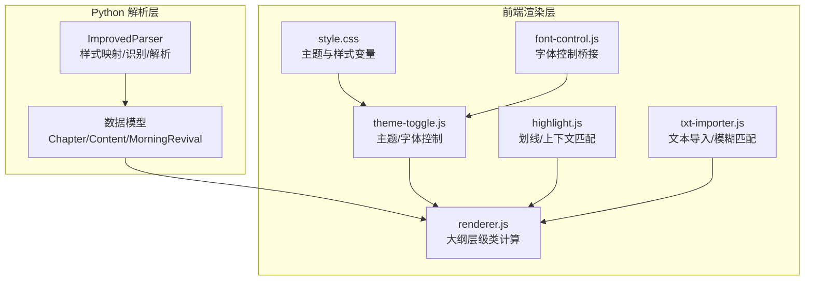
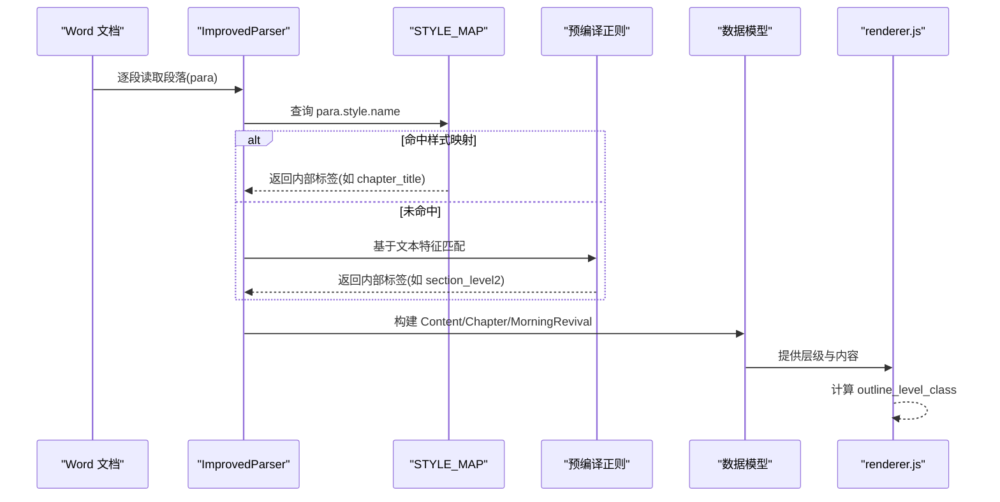
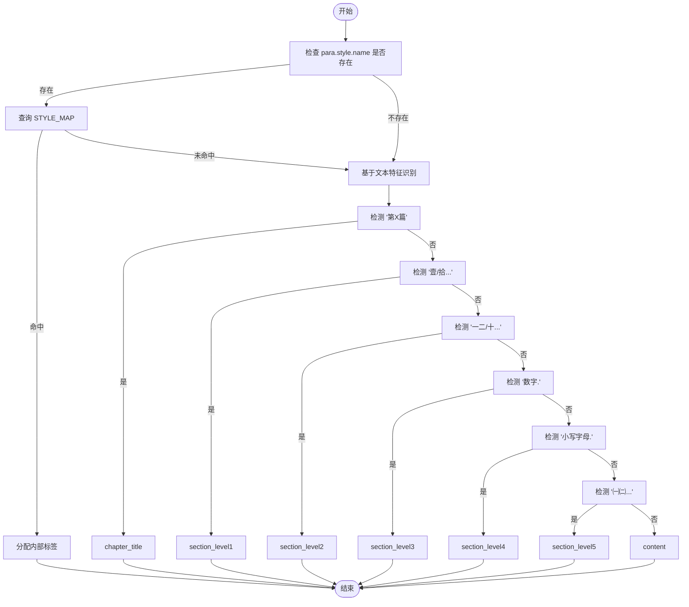
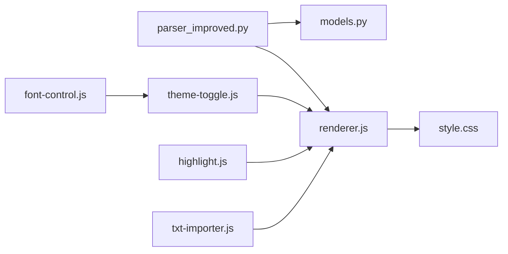

# 样式映射与识别

<cite>
**本文引用的文件**
- [parser_improved.py](file://src/parser_improved.py)
- [models.py](file://src/models.py)
- [style.css](file://src/static/css/style.css)
- [theme-toggle.js](file://src/static/js/theme-toggle.js)
- [renderer.js](file://src/static/js/renderer.js)
- [txt-importer.js](file://src/static/js/txt-importer.js)
- [highlight.js](file://src/static/js/highlight.js)
- [font-control.js](file://src/static/js/font-control.js)
</cite>

## 目录
1. [简介](#简介)
2. [项目结构](#项目结构)
3. [核心组件](#核心组件)
4. [架构概览](#架构概览)
5. [详细组件分析](#详细组件分析)
6. [依赖分析](#依赖分析)
7. [性能考量](#性能考量)
8. [故障排查指南](#故障排查指南)
9. [结论](#结论)
10. [附录](#附录)

## 简介
本技术文档围绕“样式映射与识别”功能展开，重点阐述 STYLE_MAP 的设计理念与实现机制，涵盖不同训练批次（秋季、夏季）的样式差异处理、样式名称映射规则、预编译正则表达式的优化策略。文档还详细说明样式识别算法的工作原理，包括 para.style.name 的使用、样式特征匹配、fallback 机制，并提供具体示例展示如何处理各类样式标签（如 chapter_title、section_level1、content 等）。最后给出样式映射的扩展方法与自定义样式支持建议。

## 项目结构
本项目采用“Python 解析层 + 前端渲染层”的双层架构：
- Python 解析层：负责从 Word 文档中抽取结构化数据，完成样式映射、层级识别、经文解析与后处理。
- 前端渲染层：负责将解析结果渲染为页面，提供主题切换、字体控制、高亮等功能。

图表来源
- [parser_improved.py](file://src/parser_improved.py)
- [models.py](file://src/models.py)
- [style.css](file://src/static/css/style.css)
- [theme-toggle.js](file://src/static/js/theme-toggle.js)
- [renderer.js](file://src/static/js/renderer.js)
- [highlight.js](file://src/static/js/highlight.js)
- [txt-importer.js](file://src/static/js/txt-importer.js)
- [font-control.js](file://src/static/js/font-control.js)

章节来源
- [parser_improved.py](file://src/parser_improved.py)
- [models.py](file://src/models.py)
- [style.css](file://src/static/css/style.css)
- [theme-toggle.js](file://src/static/js/theme-toggle.js)
- [renderer.js](file://src/static/js/renderer.js)
- [highlight.js](file://src/static/js/highlight.js)
- [txt-importer.js](file://src/static/js/txt-importer.js)
- [font-control.js](file://src/static/js/font-control.js)

## 核心组件
- 样式映射与识别核心：ImprovedParser 类中的 STYLE_MAP 与样式识别逻辑，支持基于样式名与基于文本特征的双重识别。
- 数据模型：Chapter、Content、MorningRevival，承载解析后的结构化数据。
- 前端渲染：renderer.js 将层级标记转换为 CSS 类，配合 style.css 的主题变量实现视觉呈现。
- 主题与字体：theme-toggle.js 与 font-control.js 提供主题切换与字体大小控制。
- 高亮与检索：highlight.js 提供划线与上下文匹配，txt-importer.js 提供模糊匹配与索引构建。

章节来源
- [parser_improved.py](file://src/parser_improved.py)
- [models.py](file://src/models.py)
- [renderer.js](file://src/static/js/renderer.js)
- [style.css](file://src/static/css/style.css)
- [theme-toggle.js](file://src/static/js/theme-toggle.js)
- [font-control.js](file://src/static/js/font-control.js)
- [highlight.js](file://src/static/js/highlight.js)
- [txt-importer.js](file://src/static/js/txt-importer.js)

## 架构概览
样式映射与识别贯穿“解析-模型-渲染”链路：
- 解析阶段：通过 STYLE_MAP 将 Word 样式名映射为内部语义标签（如 chapter_title、section_level1、content），并在映射失败时回退到基于文本特征的识别。
- 模型阶段：将识别结果组织为 Content/Chapter/MorningRevival 结构，便于后续渲染与检索。
- 渲染阶段：renderer.js 将层级标记转换为 level-1 至 level-5 的 CSS 类，结合 style.css 的主题变量实现一致的视觉风格。

图表来源
- [parser_improved.py](file://src/parser_improved.py)
- [renderer.js](file://src/static/js/renderer.js)

## 详细组件分析

### 样式映射与识别（STYLE_MAP）
- 设计理念
  - 将 Word 样式名抽象为内部语义标签，屏蔽样式名随训练批次变化带来的差异。
  - 通过预编译正则表达式提升识别效率，减少重复编译成本。
  - 提供 fallback 机制：当样式名未命中映射时，依据文本特征进行识别，增强鲁棒性。
- 实现机制
  - STYLE_MAP：定义秋季与夏季样式名到内部标签的映射。
  - 预编译正则：WEEK_OUTLINE_PATTERN、DAY_PATTERN、LEVEL1_PATTERN、LEVEL2_PATTERN、LEVEL3_PATTERN、VERSE_PATTERN 等，用于快速识别层级与经文。
  - 识别流程：优先使用 para.style.name 进行映射，失败则通过正则与文本特征进行识别。
- 不同训练批次的处理
  - 秋季：使用“文章样式”（如 121文章篇题、131文章大点等）。
  - 夏季：使用“职事样式”（如 ０ａ總題、職事信息大標等），并支持样式标记的重新编号（周数较大时从1重新编号）。
- fallback 机制
  - 当样式名为空或未命中映射时，通过正则匹配“第X篇”、“壹/一二三四等”、“数字.”、“a.”、“㈠㈡”等特征，确定章节标题、大纲层级与正文内容。

图表来源
- [parser_improved.py](file://src/parser_improved.py)

章节来源
- [parser_improved.py](file://src/parser_improved.py)

### 预编译正则表达式优化
- 优化策略
  - 将常用正则在类初始化时一次性编译，避免每次匹配重复编译，降低 CPU 开销。
  - 通过分层正则（WEEK_OUTLINE_PATTERN、LEVEL1_PATTERN 等）减少回溯与误判。
- 性能影响
  - 预编译显著提升大规模文档解析速度，尤其在大量段落与复杂层级场景下收益明显。
  - 合理的匹配顺序与短路逻辑（如先检测层级再检测内容）进一步减少不必要的计算。

章节来源
- [parser_improved.py](file://src/parser_improved.py)

### 样式识别算法工作原理
- 基于样式名的识别
  - 通过 para.style.name 与 STYLE_MAP 直接映射到内部标签。
- 基于文本特征的识别
  - 使用 LEVEL1_PATTERN、LEVEL2_PATTERN、LEVEL3_PATTERN 等正则识别层级标记。
  - 使用 WEEK_OUTLINE_PATTERN、DAY_PATTERN 识别周纲目与天标记（夏季）。
- fallback 机制
  - 当样式名缺失或未命中映射时，按层级优先级与常见格式进行识别，确保解析连续性。
- 经文识别
  - 使用 VERSE_PATTERN 识别“书卷+章节”格式的经文行，支持“腓2:5”与“太五3”两类格式。
  - 对“从略”占位符进行范围解析，并从缓存或持久化字典中回填经文。

章节来源
- [parser_improved.py](file://src/parser_improved.py)

### 具体样式标签处理示例
- chapter_title
  - 识别特征：“第X篇”（含“篇”字）。
  - 处理逻辑：定位章节编号，关联到对应 Chapter 对象，重置层级状态。
- section_level1
  - 识别特征：以“壹/拾…”开头的标题。
  - 处理逻辑：创建 Content(level=壹/拾…, title=清理后的标题)，作为大纲一级节点。
- section_level2
  - 识别特征：以“一二/十…”开头的标题。
  - 处理逻辑：作为二级节点添加到一级节点下。
- section_level3
  - 识别特征：以“数字.”开头的标题。
  - 处理逻辑：作为三级节点添加到二级节点下。
- section_level4
  - 识别特征：以“小写字母.”开头的标题。
  - 处理逻辑：作为四级节点添加到三级节点下。
- section_level5
  - 识别特征：以“㈠㈡…”开头的标题。
  - 处理逻辑：作为五级节点添加到四级节点下。
- content
  - 识别特征：不属于上述层级的正文段落。
  - 处理逻辑：按当前层级顺序追加到相应节点的内容列表中。

章节来源
- [parser_improved.py](file://src/parser_improved.py)

### 夏季训练样式差异与重新编号
- 样式差异
  - 夏季使用“职事样式”，如“第一周”“周期”“第一周右”等，与秋季“文章样式”不同。
- 重新编号
  - 当周数≥20 时，按出现顺序从1重新编号，保证训练序列连续性。
- 解析策略
  - 基于样式的解析（_parse_morning_revival_by_styles）与基于文本的解析（_parse_morning_revival_by_text）并存，自动检测样式类型。

章节来源
- [parser_improved.py](file://src/parser_improved.py)

### 前端渲染与样式映射衔接
- renderer.js
  - 将层级标记字符串映射为 level-1 至 level-5 的 CSS 类，确保与后端解析一致。
- style.css
  - 定义主题变量与基础样式，配合主题切换实现一致的视觉风格。
- theme-toggle.js / font-control.js
  - 提供主题与字体控制能力，与 renderer.js 的层级类协同工作。

章节来源
- [renderer.js](file://src/static/js/renderer.js)
- [style.css](file://src/static/css/style.css)
- [theme-toggle.js](file://src/static/js/theme-toggle.js)
- [font-control.js](file://src/static/js/font-control.js)

## 依赖分析
- 解析层依赖
  - ImprovedParser 依赖 models.py 中的 Chapter、Content、MorningRevival 数据模型。
  - 使用预编译正则提升识别性能。
- 渲染层依赖
  - renderer.js 依赖 outline_level_class 计算层级类，与 style.css 的主题变量配合。
  - theme-toggle.js 与 font-control.js 提供主题与字体控制，间接影响渲染效果。
- 检索与高亮
  - txt-importer.js 提供模糊匹配与索引构建，highlight.js 提供划线与上下文匹配，二者与渲染层协同工作。

图表来源
- [parser_improved.py](file://src/parser_improved.py)
- [models.py](file://src/models.py)
- [renderer.js](file://src/static/js/renderer.js)
- [style.css](file://src/static/css/style.css)
- [theme-toggle.js](file://src/static/js/theme-toggle.js)
- [font-control.js](file://src/static/js/font-control.js)
- [highlight.js](file://src/static/js/highlight.js)
- [txt-importer.js](file://src/static/js/txt-importer.js)

章节来源
- [parser_improved.py](file://src/parser_improved.py)
- [models.py](file://src/models.py)
- [renderer.js](file://src/static/js/renderer.js)
- [style.css](file://src/static/css/style.css)
- [theme-toggle.js](file://src/static/js/theme-toggle.js)
- [font-control.js](file://src/static/js/font-control.js)
- [highlight.js](file://src/static/js/highlight.js)
- [txt-importer.js](file://src/static/js/txt-importer.js)

## 性能考量
- 预编译正则
  - 在类初始化时一次性编译，避免重复编译开销，适合大规模文档处理。
- 匹配顺序优化
  - 先检测层级标记，再检测内容，减少不必要的正则匹配。
- 跨页续接处理
  - _should_merge_with_previous 通过标点、缩进与长度等启发式规则判断是否合并，避免错误拼接。
- 主题与字体控制
  - theme-toggle.js 与 font-control.js 通过本地存储与媒体查询实现快速切换，不影响解析性能。

## 故障排查指南
- 样式名未命中映射
  - 检查 STYLE_MAP 是否包含目标样式名；若缺失，可通过文本特征识别回退。
- 层级识别错误
  - 确认文本是否符合层级标记格式（如“壹/一二/数字./小写字母./㈠㈡”）；必要时调整正则或清理文本。
- 夏季样式解析异常
  - 确认是否正确识别“第一周”“周期”等样式；检查周数是否≥20导致重新编号。
- 经文识别失败
  - 检查 VERSE_PATTERN 是否匹配目标格式；确认“从略”占位符是否正确解析范围。
- 渲染层级不正确
  - 检查 renderer.js 的 outline_level_class 逻辑与 style.css 的主题变量是否一致。

章节来源
- [parser_improved.py](file://src/parser_improved.py)
- [renderer.js](file://src/static/js/renderer.js)

## 结论
本功能通过“样式映射 + 预编译正则 + 文本特征回退”的三层机制，实现了对不同训练批次（秋季/夏季）样式的稳定识别与结构化输出。结合数据模型与前端渲染，形成从解析到展示的一致体验。未来可在以下方面持续优化：扩展样式映射覆盖、引入更细粒度的文本特征规则、增强跨页续接的智能判断。

## 附录
- 扩展样式映射的方法
  - 在 STYLE_MAP 中新增“Word样式名 → 内部标签”的映射项。
  - 若样式名不稳定，补充相应的文本特征正则与识别分支。
- 自定义样式支持
  - 在解析层增加新的识别分支，确保与现有层级体系（level-1 至 level-5）保持一致。
  - 在渲染层通过 outline_level_class 与 CSS 类保持视觉一致性。